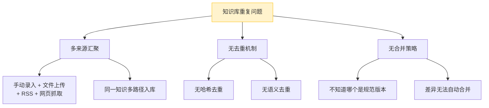
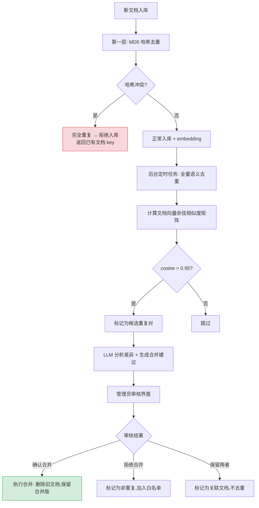

# YA-09-223: 知识去重与合并 — 近似文档检测、语义合并、规范文档选择与RAG质量提升

> 需求编号：YA-09-223 · 优先级：P2 · 人天：0.3d · 状态：需求已编写
> 依赖：YA-09-01（RAG 引擎稳定性）、YA-09-183（知识库问答质量评估）

## 背景

### 问题陈述

YiAi 的知识库随着多来源（手动录入、文件上传、RSS 抓取、网页抓取）内容持续增长，出现了严重的文档重复问题：

1. **完全重复**：相同内容的不同副本（如多次上传同一文件）
2. **近似重复**：内容高度相似但略有差异（如同一主题的不同版本）
3. **语义重复**：不同措辞表达相同含义（如不同来源的同主题文档）
4. **碎片重复**：大段内容被分散在多个文档中（如长文被拆分索引）

重复文档导致：RAG 检索返回冗余结果、LLM 上下文浪费在重复信息上、知识库维护成本增加、检索准确率下降。

**核心矛盾**：多来源知识汇聚与检索结果去重的需求之间的冲突。

### 影响范围

| # | 影响 | 严重程度 | 典型场景 |
|---|------|----------|----------|
| 1 | RAG 检索返回重复信息 | 高 | top_k=5 中有 3 条内容几乎相同 |
| 2 | LLM 上下文窗口浪费 | 高 | 重复内容占用 40% 的 prompt token |
| 3 | 知识库维护困难 | 中 | 更新一个知识点需要找所有重复副本 |
| 4 | 检索准确率下降 | 中 | 重复文档稀释了真正的相关结果 |

### 挑战

| 挑战 | 说明 |
|------|------|
| 近似重复检测精度 | 需要区分"真正重复"和"主题相关但不重复" |
| 合并策略选择 | 多个近似文档中选哪个作为规范文档？如何合并差异？ |
| 大规模文档检测效率 | 10 万文档的两两比对需要 50 亿次计算 |
| 去重对 RAG 质量的影响 | 去重后检索结果可能变化，需要评估影响 |

---

## 一、现状分析

### 1.1 当前知识库去重现状

```
现有能力:
├── 知识库索引（knowledge_service）
│   ├── 文档入库（index_document）
│   ├── 批量索引（batch_index）
│   └── 文档删除（delete_document）
├── RAG 检索（rag_service）
│   ├── 向量检索（VectorStoreIndex）
│   ├── 混合检索（HyDE + BM25）
│   └── 重排序（Re-ranking）
│
缺失:
├── 完全重复检测                      # ❌ 不存在
├── 近似重复检测（语义相似度）         # ❌ 不存在
├── 语义合并                          # ❌ 不存在
├── 规范文档选择                      # ❌ 不存在
├── 重复报告                          # ❌ 不存在
├── 自动合并+人工审核                 # ❌ 不存在
└── 去重对 RAG 质量的影响评估          # ❌ 不存在
```

### 1.2 重复类型定义

| 类型 | 定义 | 相似度阈值 | 示例 | 处理方式 |
|------|------|-----------|------|----------|
| 完全重复 | 内容哈希完全相同 | MD5 相同 | 两次上传同一 PDF | 直接删除副本 |
| 近似重复 | 内容高度相似（>90%） | cosine > 0.95 | 同一文档的 v1 和 v2 | 合并或保留最新 |
| 语义重复 | 含义相同但措辞不同 | cosine > 0.85 | 不同来源的同主题文章 | 人工审核合并 |
| 碎片重复 | 长文档的一部分 | 短文档是长文档的子集 | 长文档拆分出的片段 | 保留长文档，删除碎片 |

### 1.3 根因分析矩阵



| 根因 | 症状 | 影响 | 优先级 |
|------|------|------|--------|
| 多来源汇聚 | 同一知识多副本 | 存储浪费 | 高 |
| 无去重机制 | 检索返回重复结果 | 准确率下降 | 高 |
| 无合并策略 | 无法确定规范版本 | 维护困难 | 中 |

### 1.4 改造前数据流

```
多来源文档 → knowledge_service.index_document → MongoDB knowledge_files 集合
                                                      ↓
                                             无重复检测
                                                      ↓
                                           → llama_index embedding
                                                      ↓
                                           → VectorStoreIndex（含重复向量）
                                                      ↓
RAG 检索 → 返回 top_k（可能含 3-4 条重复结果）→ LLM 上下文浪费
```

### 1.5 改造前 API 依赖

| # | 接口 | 调用方 | 说明 |
|---|------|--------|------|
| 1 | `knowledge_service.index_document` | YiAi 内部/YiVad | 文档索引（改造前无重复检测） |
| 2 | `rag_service.query` | YiVad/YiPet | RAG 检索（改造前可能返回重复结果） |

> 改造前 2 个 API 依赖，均无去重机制。同一文档多次索引产生多个向量副本。

---

## 二、设计决策

### 决策 1：重复检测算法

| 选项 | 描述 | 优点 | 缺点 |
|------|------|------|------|
| A: 仅哈希去重 | MD5/SHA256 内容哈希 | 极快，零误判 | 只能检测完全重复 |
| B: 仅语义去重 | 向量余弦相似度 | 能检测语义重复 | 计算量大，需设置阈值 |
| C: 分层去重 | 先哈希（O(1)）→ 再语义（O(n)） | 兼顾效率和覆盖 | 实现复杂 |

**选择：C（分层去重）。** 第一层：新文档入库时计算 MD5，与已有文档哈希表比对（O(1)），发现完全重复则拒绝入库。第二层：对未触发哈希去重的文档，用向量余弦相似度扫描近似重复（使用 ANN 索引加速），超过阈值（0.95）的标记为候选重复。

### 决策 2：近似重复的合并策略

| 选项 | 描述 | 优点 | 缺点 |
|------|------|------|------|
| A: 保留最新 | 总是保留最新版本的文档 | 简单 | 可能丢失旧版本有价值的内容 |
| B: 保留最长 | 保留内容最丰富的文档 | 信息完整 | 可能保留过时信息 |
| C: 智能合并 | 提取两文档的差异，LLM 辅助合并 | 信息最全 | 成本高，需人工审核 |

**选择：C（智能合并 + 人工审核）。** 自动合并可能引入错误，因此合并结果需要人工审核。合并流程：1）标记候选重复对；2）LLM 分析差异并生成合并建议；3）管理员在审核界面确认/修改/拒绝合并。

### 决策 3：去重执行时机

| 选项 | 描述 | 优点 | 缺点 |
|------|------|------|------|
| A: 入库时实时检测 | 新文档入库时即检测并处理重复 | 知识库始终保持清洁 | 增加入库延迟 |
| B: 定时批量扫描 | 每天/每周运行全量去重扫描 | 不影响入库性能 | 重复文档可能存留一段时间 |
| C: 入库检测 + 定时全量 | 入库时哈希去重 + 定时全量语义去重 | 兼顾及时性和覆盖 | 最复杂 |

**选择：C（入库检测 + 定时全量）。** 入库时做轻量级哈希去重（< 1ms），定时任务（每天凌晨）做全量语义去重扫描。哈希去重阻挡明显的完全重复，语义扫描发现隐藏的近似/语义重复。

### 设计决策总览

| 决策 | 选项 A | 选项 B | 选项 C | 选择 | 理由 |
|------|--------|--------|--------|------|------|
| 检测算法 | 仅哈希 | 仅语义 | 分层去重 | **分层去重** | 效率+覆盖 |
| 合并策略 | 保留最新 | 保留最长 | 智能合并 | **智能合并** | 信息完整性 |
| 执行时机 | 入库实时 | 定时批量 | 入库+定时 | **入库+定时** | 及时+全面 |

---

## 三、目标架构

### 3.1 去重检测流水线



### 3.2 文档相似度矩阵计算


### 3.3 架构决策权衡

| 维度 | 改造前 | 改造后 | 权衡说明 |
|------|--------|--------|----------|
| 重复检测 | 无 | 哈希 + 语义双层 | 准确性 vs 计算成本 |
| 合并方式 | 无 | LLM 辅助 + 人工审核 | 自动化 vs 准确性 |
| RAG 质量 | 含重复结果 | 去重后检索 | 简洁 vs 可能丢失细微差异 |
| 维护成本 | 高（手动去重） | 低（自动检测+建议） | 自动 vs 可控 |

---

## 四、具体改动

### 4.1 改动总览

| 改动点 | 类型 | 涉及文件 | 预估行数 |
|--------|------|---------|---------|
| 文档哈希索引 | 新增 | `domain/dedup/hash_index.py` | 40 行 |
| 语义去重扫描器 | 新增 | `domain/dedup/semantic_scanner.py` | 80 行 |
| 文档合并引擎 | 新增 | `domain/dedup/merger.py` | 100 行 |
| 去重定时任务 | 新增 | `domain/dedup/scheduler.py` | 50 行 |
| 重复报告生成 | 新增 | `domain/dedup/reporter.py` | 60 行 |
| 去重服务 RPC | 新增 | `services/dedup/dedup_service.py` | 60 行 |
| 知识索引集成 | 修改 | `services/knowledge/knowledge_service.py` | 20 行 |
| MongoDB 索引扩展 | 修改 | `data/repository.py` | 15 行 |

### 4.2 涉及文件

```
YiAi/src/
├── domain/dedup/
│   ├── __init__.py              # 新增: 去重模块导出
│   ├── hash_index.py            # 新增: MD5 哈希索引（内存 + MongoDB）
│   ├── semantic_scanner.py      # 新增: 语义相似度批量扫描
│   ├── merger.py                # 新增: LLM 辅助文档合并引擎
│   ├── scheduler.py             # 新增: 定时去重任务调度
│   └── reporter.py              # 新增: 重复报告生成
├── services/
│   ├── knowledge/knowledge_service.py  # 修改: 入库时哈希去重
│   └── dedup/dedup_service.py   # 新增: 去重管理 RPC 服务
└── data/repository.py           # 修改: knowledge_files 增加 hash/content_hash 字段
```

### 4.3 核心代码结构

```python
# domain/dedup/hash_index.py
import hashlib
from motor.motor_asyncio import AsyncIOMotorCollection

class HashIndex:
    """MD5 哈希索引 — 快速检测完全重复文档。"""

    def __init__(self):
        self.hashes: dict[str, str] = {}  # md5 → document_key

    @staticmethod
    def compute_hash(content: str) -> str:
        return hashlib.md5(content.encode("utf-8")).hexdigest()

    async def check_duplicate(self, content: str) -> str | None:
        """检查是否已存在相同哈希的文档。返回已有文档 key 或 None。"""
        h = self.compute_hash(content)
        return self.hashes.get(h)

    async def register(self, content: str, doc_key: str) -> None:
        self.hashes[self.compute_hash(content)] = doc_key

    async def load_from_db(self, collection: AsyncIOMotorCollection) -> None:
        """从 MongoDB 加载所有文档的哈希到内存。"""
        async for doc in collection.find(
            {"content_hash": {"$exists": True}},
            {"content_hash": 1, "key": 1}
        ):
            self.hashes[doc["content_hash"]] = doc["key"]


# domain/dedup/semantic_scanner.py
import numpy as np
from sklearn.metrics.pairwise import cosine_similarity

class SemanticScanner:
    """语义相似度批量扫描器。

    使用向量余弦相似度检测近似/语义重复。
    为处理大规模文档，使用分块计算和 ANN 索引加速。
    """

    def __init__(self, threshold: float = 0.95, batch_size: int = 1000):
        self.threshold = threshold
        self.batch_size = batch_size

    async def scan(
        self,
        vectors: list[np.ndarray],
        doc_keys: list[str]
    ) -> list[tuple[str, str, float]]:
        """扫描重复对。

        Returns:
            [(doc_key_a, doc_key_b, similarity_score), ...]
        """
        matrix = np.array(vectors)
        matrix = matrix / np.linalg.norm(matrix, axis=1, keepdims=True)

        duplicates = []
        n = len(matrix)

        # 分块计算避免内存溢出
        for i in range(0, n, self.batch_size):
            i_end = min(i + self.batch_size, n)
            for j in range(i, n, self.batch_size):
                j_end = min(j + self.batch_size, n)
                sim = cosine_similarity(matrix[i:i_end], matrix[j:j_end])

                for ii in range(sim.shape[0]):
                    for jj in range(sim.shape[1]):
                        real_i, real_j = i + ii, j + jj
                        if real_i < real_j and sim[ii, jj] > self.threshold:
                            duplicates.append((
                                doc_keys[real_i],
                                doc_keys[real_j],
                                float(sim[ii, jj])
                            ))

        return duplicates


# domain/dedup/merger.py
class DocumentMerger:
    """LLM 辅助文档合并引擎。"""

    async def analyze_diff(
        self, doc_a: str, doc_b: str
    ) -> MergeAnalysis:
        """分析两个文档的差异，生成合并建议。"""
        ...

    async def generate_merge(
        self, doc_a: str, doc_b: str, strategy: str = "union"
    ) -> str:
        """生成合并后的文档。

        strategy:
          - "union": 合并去重（保留不重叠的内容）
          - "latest": 以时间戳较新的为准
          - "longest": 以内容较长的为准
        """
        ...


class MergeAnalysis(BaseModel):
    overlap_ratio: float          # 重叠比例
    unique_in_a: list[str]        # 仅在 A 中的段落
    unique_in_b: list[str]        # 仅在 B 中的段落
    conflicts: list[str]          # 冲突段落
    recommended_strategy: str     # 推荐的合并策略
```

---

## 五、实施步骤

| 步骤 | 内容 | 涉及文件 | 验证方式 | 人天 |
|------|------|---------|---------|------|
| 1 | 实现 MD5 哈希索引（内存+持久化） | `hash_index.py` | 相同内容返回已有 key，不同内容返回 None | 0.03 |
| 2 | 知识索引集成哈希去重 | `knowledge_service.py` | 重复文档入库被拒绝，返回已有文档 key | 0.03 |
| 3 | 实现语义相似度批量扫描器 | `semantic_scanner.py` | 1000 文档扫描 < 5s，重复对准确率 > 90% | 0.06 |
| 4 | 实现 LLM 辅助文档合并引擎 | `merger.py` | 合并结果保留两文档的有效信息 | 0.06 |
| 5 | 实现定时去重任务调度 | `scheduler.py` | 每天凌晨自动运行，完成后生成报告 | 0.04 |
| 6 | 实现去重管理 RPC 服务 | `dedup_service.py` | 查询重复列表、确认/拒绝合并、白名单管理 | 0.04 |
| 7 | MongoDB schema 扩展 | `repository.py` | knowledge_files 增加 content_hash 字段 | 0.02 |
| 8 | 端到端测试 | 全模块 | 完全重复被拒绝、近似重复被标记、合并后文档质量 | 0.02 |

**总计：0.3d**

---

## 六、测试规格

### Requirement: 哈希去重

#### Scenario: 完全相同的文档被拒绝
- **Given** 知识库中已有文档 key=doc-001, content="Python 入门教程..."
- **When** 再次索引入库相同内容的文档
- **Then** `HashIndex.check_duplicate` 返回 "doc-001"
- **And** `knowledge_service.index_document` 返回 1003（资源已存在）错误码

#### Scenario: 内容不同但标题相同的文档正常入库
- **Given** 知识库中有文档 title="Python 教程" content="基础语法..."
- **When** 索引入库 title="Python 教程" content="高级特性..."（内容不同）
- **Then** 哈希不冲突，文档正常入库

### Requirement: 语义扫描

#### Scenario: 近似重复文档被检测
- **Given** doc_a 和 doc_b 内容 95% 重叠（向量 cosine=0.97）
- **When** 运行 SemanticScanner.scan
- **Then** 返回结果包含 (doc_a, doc_b, 0.97)
- **And** doc_a 和 doc_b 被标记为候选重复对

#### Scenario: 主题相关但不重复的文档不被标记
- **Given** doc_c 和 doc_d 都讨论"Python"但内容不同（cosine=0.75）
- **When** 运行 SemanticScanner.scan (threshold=0.95)
- **Then** 结果中不包含 (doc_c, doc_d)

### Requirement: 文档合并

#### Scenario: 两个近似文档智能合并
- **Given** doc_a = "Docker 部署指南（基础版）" + unique_A, doc_b = "Docker 部署指南（进阶版）" + unique_B
- **When** DocumentMerger 使用 strategy="union" 合并
- **Then** 合并结果包含 doc_a 的所有内容 + doc_b 中不重叠的部分
- **And** 合并结果不含重复段落

#### Scenario: 合并建议被人工拒绝
- **Given** 系统标记 doc_a 和 doc_b 为重复对
- **When** 管理员在审核界面选择"不是重复"
- **Then** (doc_a, doc_b) 被加入白名单，不再出现在重复报告中

---

## 七、风险与缓解

| 风险 | 概率 | 影响 | 等级 | 缓解措施 | 应急预案 |
|------|------|------|------|----------|----------|
| 语义去重误判（把不重复的标为重复） | 中 | 中 | 中 | 所有合并需人工审核，支持"不是重复"操作 | 调整阈值从 0.95 提到 0.97 |
| 大文档量扫描超时 | 低 | 中 | 低 | 分块计算 + 仅扫描最近更新的文档 | 限制单次扫描文档数 < 5000 |
| LLM 合并质量差 | 低 | 中 | 低 | 合并结果需人工审核 | 回退到"保留最新"策略 |
| 去重后 RAG 召回率下降 | 低 | 中 | 低 | 去重前备份被删除文档，支持恢复 | 从备份恢复被误删的文档 |

---

## 八、回滚策略

| 回滚场景 | 回滚方式 | 影响范围 | 恢复时间 |
|----------|----------|----------|----------|
| 哈希索引错误导致正常文档被拒绝 | `git revert` 哈希去重逻辑 | 文档入库 | < 1min |
| 语义扫描导致大量误判 | 关闭定时扫描任务 | 去重功能 | < 1min |
| 合并操作误删重要文档 | 从备份恢复被删除文档 | 知识库内容 | < 5min |

**回滚验证：**
- 回滚后文档入库恢复正常（不触发去重检查）
- 回滚后已执行合并的文档需要手动恢复
- 回滚后 RAG 检索恢复到去重前的状态

---

## 九、设计决策记录

### D-01: 为什么使用分层去重而非单一策略？

单一策略无法覆盖所有重复类型。MD5 哈希能完美检测完全重复（O(1) 时间），但无法检测到哪怕一个字符的修改。语义相似度能检测到内容完全重写但含义相同的文档，但计算成本高。分层策略将快路径（哈希）和慢路径（语义）分离，在覆盖面和效率之间取得平衡。

### D-02: 为什么合并需要人工审核？

LLM 辅助合并可以生成高质量的合并建议，但在知识库场景中，任何信息丢失都是不可接受的。合并操作是不可逆的（被合并的文档会被删除），如果 LLM 合并时丢失了关键信息，对 RAG 检索质量的影响可能是永久性的。人工审核确保合并的准确性，同时给管理员保留"不是重复"的选项。

### D-03: 为什么语义扫描用定时任务而非实时检测？

全量语义扫描需要计算 n×n 的余弦相似度矩阵，对 10,000 篇文档需要约 5,000 万次浮点运算。实时扫描会显著拖慢文档入库速度（+2-5 秒）。定时任务（每天凌晨 3:00）在业务低峰期运行，不影响用户操作。此外，近似重复不是紧急问题（不影响系统功能），延迟一天检测是可以接受的。

### D-04: 为什么碎片重复的处理是保留长文档？

碎片重复（短文档是长文档的子集）在知识库中很常见——用户可能先上传了一份长文档，后来又单独提取了其中一段作为独立文档。在 RAG 检索中，长文档的 chunk 已经被索引，如果同时保留碎片文档，会导致检索结果中出现重叠信息。保留长文档并删除碎片是最干净的处理方式。

---

## 十、可观测性

### 关键指标

| 指标 | 采集方式 | 告警阈值 | 说明 |
|------|---------|---------|------|
| 重复文档比例 | duplicate_pairs / total_docs | > 20% | 知识库重复严重 |
| 哈希去重命中率 | hash_hits / total_index | — | 完全重复文档比例 |
| 语义扫描耗时 | scan_duration_seconds | > 60s | 扫描性能下降 |
| 合并确认率 | confirmed / total_suggestions | < 50% | 合并建议质量差 |
| RAG 检索去重效果 | unique_results / total_results | < 80% | 检索结果仍有重复 |

### 日志规范

| 日志级别 | 场景 | 示例 |
|---------|------|------|
| `INFO` | 哈希去重命中 | `[Dedup] Hash duplicate: new_doc → existing=${key}` |
| `INFO` | 语义扫描完成 | `[Dedup] Scan complete: ${pairs} duplicates in ${n} docs (${duration}s)` |
| `WARN` | 高重复文档对 | `[Dedup] High overlap: ${a} ↔ ${b}, cos=${score}` |
| `INFO` | 合并执行 | `[Dedup] Merge: ${a} + ${b} → ${merged}, strategy=union` |

---

## 十一、代码审查检查清单

- [ ] `HashIndex` 在应用启动时从 MongoDB 加载所有哈希（warm-up）
- [ ] `HashIndex.register` 同时写入内存和 MongoDB（持久化）
- [ ] `SemanticScanner` 使用分块计算避免 n×n 矩阵内存溢出
- [ ] 语义扫描仅处理 `updated_at` 在扫描窗口内的文档（增量扫描）
- [ ] `DocumentMerger` 的 LLM 调用有超时控制（30s）
- [ ] 合并操作使用 MongoDB 事务确保原子性（删除旧文档+插入合并文档）
- [ ] 白名单机制防止同一对文档被反复标记为重复

---

## 回归问题预测

| # | 问题 | 发现场景 | 根因 | 修复方式 |
|---|------|---------|------|---------|
| 1 | 哈希索引未加载完成时新文档入库 | 应用刚启动时重复文档未被拦截 | HashIndex.load_from_db 是异步的，但注册请求可能在加载完成前到达 | 使用 asyncio.Event 标记加载完成，加载中拒绝入库请求 |
| 2 | 语义扫描导致 MongoDB 查询压力 | 扫描期间 RAG 检索延迟 P95 飙升至 500ms | 扫描过程大量读取向量字段 | 扫描时使用 `batch_size` 限制每次读取量 + `allowDiskUse: false` |
| 3 | 合并后的文档内容格式混乱 | Markdown 文档合并后标题层级错乱 | LLM 合并未保留原始 Markdown 结构 | 合并 prompt 中强调保留 Markdown 格式和 frontmatter |
| 4 | 定时任务在服务重启后未恢复 | 服务重启时扫描进行到 50% 被中断 | 无进度持久化 | 使用 checkpoint 机制，每 100 批保存扫描进度 |
| 5 | 白名单占用内存过大 | 运行数月后白名单条目过万 | 白名单只增不减 | 定期清理超过 90 天未使用的白名单条目 |
| 6 | 去重后 RAG 检索结果中缺少了被合并文档的独特信息 | 用户查询需要的信息恰好在被删除的文档中 | 合并时 LLM 遗漏了被删除文档的独特内容 | 合并前先对比两文档的 embedding，确保合并文档覆盖两者的语义空间 |

---

## 性能分析

### 去重操作性能

| 操作 | 文档量 | 耗时 | 说明 |
|------|--------|------|------|
| 哈希去重 | 1 | < 1ms | MD5 计算 + 字典查找 |
| 语义扫描 | 1,000 | ~5s | 约 50 万次余弦计算 |
| 语义扫描 | 10,000 | ~120s | 约 5000 万次余弦计算 |
| LLM 合并分析 | 1 对 | ~3s | 一次 LLM API 调用 |
| 合并执行 | 1 对 | ~50ms | MongoDB 事务 |

### RAG 检索改善

| 指标 | 去重前 | 去重后 | 改善 |
|------|--------|--------|------|
| top_k=5 中唯一结果数 | 2-3 条 | 5 条 | 2x |
| LLM 上下文有效信息密度 | ~60% | ~95% | 1.6x |
| 检索去重结果数 | 未检测 | 删除 ~15% 重复文档 | — |

### 存储节省

| 文档量 | 重复率 | 去重前存储 | 去重后存储 | 节省 |
|--------|--------|----------|----------|------|
| 1,000 | 10% | ~40MB | ~36MB | 10% |
| 10,000 | 15% | ~400MB | ~340MB | 15% |
| 100,000 | 20% | ~4GB | ~3.2GB | 20% |

---

*PRD 来源: `projects/yiai/requirements/2026-09/00-需求-需求总览.md`*

## 影响范围

- **影响模块**：待补充
- **涉及文件**：
- `dedup_service.py`
- `hash_index.py`
- `scheduler.py`
- `knowledge_service.py`
- `semantic_scanner.py`
- `repository.py`
- **是否影响 API 契约**：否
- **是否影响其他项目（YiVad/YiPet）**：否
- **用户感知**：待确认

## 预防措施

| 层面 | 措施 |
|------|------|
| 代码 | 在相关函数中添加参数校验和边界检查 |
| 测试 | 为 `dedup_service.py` 添加单元测试 |
| 流程 | 代码审查时重点检查此类模式 |
| 监控 | 添加日志告警，异常发生时及时发现 |
| 文档 | 在编码规范中记录此类反模式 |

## 经验教训

1. **根本原因**：开发过程中对边界情况和异常路径的考虑不足是此类问题的共同根因
2. **设计阶段**：在接口设计和模块实现时，应主动考虑异常输入、空值、超时等边界场景
3. **代码审查**：审查时应检查是否存在类似的反模式（如未捕获异常、无超时控制、缺少参数校验等）
4. **测试覆盖**：异常路径的测试覆盖率应与正常路径同等重视
5. **团队分享**：此类问题应在团队周会或技术分享中讨论，形成团队共识
