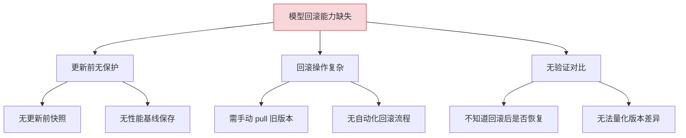
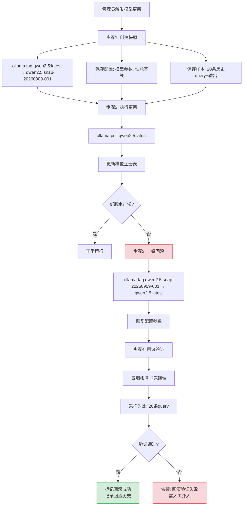
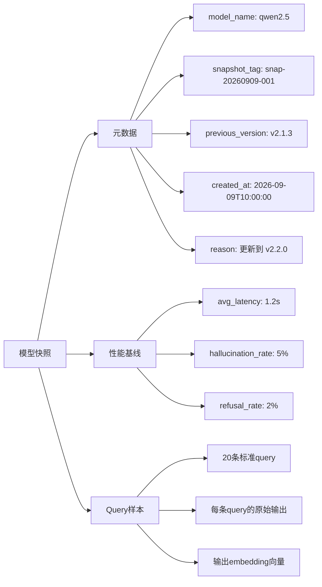

# YA-09-224: 模型版本回滚 — 快照、一键回滚、验证、回滚历史与AB对比

> 需求编号：YA-09-224 · 优先级：P2 · 人天：0.3d · 状态：需求已编写
> 依赖：YA-09-166（模型注册与版本管理）、YA-09-215（模型热切换）

## 背景

### 问题陈述

YiAi 依赖 Ollama 提供的多个 LLM 模型（qwen2.5, llama3.1, deepseek-r1 等），模型更新（Ollama pull 新版本）是常态化操作。但当前缺少模型版本回滚能力：

1. **更新不可逆**：模型更新到新版本后，如果新版本质量下降或存在 bug，无法快速回退
2. **无更新前快照**：更新前没有保存模型配置和性能基线，无法对比新旧版本的差异
3. **回滚靠手动**：回退需要手动 `ollama pull` 旧版本 tag，耗时长且容易出错
4. **无验证机制**：回滚后没有自动验证模型是否恢复正常
5. **无历史记录**：不知道模型经过多少次更新、每次更新的内容和原因

**核心矛盾**：模型快速迭代的需求与生产环境稳定性要求之间的冲突。

### 影响范围

| # | 影响 | 严重程度 | 典型场景 |
|---|------|----------|----------|
| 1 | 更新后质量下降无法回退 | 高 | 新版本模型幻觉率从 5% 升至 20% |
| 2 | 回滚操作耗时长 | 中 | 手动 pull 旧版本需要 5-10 分钟 |
| 3 | 无法量化新旧版本差异 | 中 | 不知道新版本在哪些方面变差了 |
| 4 | 无回滚历史 | 低 | 不知道模型经过多少次变更 |

### 挑战

| 挑战 | 说明 |
|------|------|
| 快照完整性 | 快照需要包含模型配置、性能基线、依赖信息 |
| 回滚速度 | 回滚操作应在 30 秒内完成（非重新下载模型） |
| 回滚验证 | 回滚后需要自动运行基准测试验证模型质量 |
| 与 Ollama 的集成 | Ollama 的版本管理基于 tag，需适配其机制 |

---

## 一、现状分析

### 1.1 当前模型版本管理现状

```
现有能力:
├── 模型注册与版本管理（YA-09-166）
│   ├── 模型注册（registry）
│   └── 版本记录（version）
├── 模型热切换（YA-09-215）
│   ├── 运行时切换模型
│   └── 无中断切换
├── Ollama 模型管理
│   ├── ollama pull（拉取新版本）
│   ├── ollama list（列出本地模型）
│   └── ollama show（查看模型信息）
│
缺失:
├── 更新前自动快照                      # ❌ 不存在
├── 一键回滚到上一版本                   # ❌ 不存在
├── 回滚后自动验证                       # ❌ 不存在
├── 回滚历史记录                         # ❌ 不存在
├── AB 对比报告                          # ❌ 不存在
├── 回滚审批流程                         # ❌ 不存在
└── 回滚失败自动恢复                     # ❌ 不存在
```

### 1.2 模型更新风险矩阵

| 风险 | 触发条件 | 影响 | 历史频率 |
|------|---------|------|---------|
| 推理质量下降 | 新版本训练数据偏差 | 用户满意度下降 | 中 |
| 输出格式变化 | API 响应 schema 变更 | 前端解析失败 | 中 |
| 推理速度变慢 | 新版本模型更大或优化不足 | 用户体验下降 | 低 |
| 特定 prompt 崩溃 | 边缘 case 触发模型 bug | 部分功能不可用 | 低 |
| 安全过滤变化 | 新版本内容审核策略不同 | 误拦截或漏拦截 | 低 |

### 1.3 根因分析矩阵



| 根因 | 症状 | 影响 | 优先级 |
|------|------|------|--------|
| 更新前无保护 | 无回退锚点 | 更新风险不可控 | 高 |
| 回滚操作复杂 | 回滚耗时 5-10 分钟 | 故障时间延长 | 中 |
| 无验证对比 | 无法判断回滚效果 | 可能引入新问题 | 中 |

### 1.4 改造前数据流

```
管理员执行 ollama pull qwen2.5:latest
  → 新版本下载覆盖旧版本
  → 旧版本丢失（除非有 tag）
  → 如果新版本有问题 → 手动 ollama pull qwen2.5:v1
  → 等待下载（5-10 分钟）
  → 手动验证模型是否正常
```

### 1.5 改造前 API 依赖

| # | 接口 | 调用方 | 说明 |
|---|------|--------|------|
| 1 | `ai.model_service.switch_model` | YiVad | 切换活跃模型（改造前无回滚能力） |
| 2 | `ai.model_service.list_models` | YiVad | 列出可用模型（改造前无版本历史） |

> 改造前 2 个 API 依赖，均无回滚能力。模型更新不可逆。

---

## 二、设计决策

### 决策 1：快照存储方式

| 选项 | 描述 | 优点 | 缺点 |
|------|------|------|------|
| A: 仅记录元数据 | 快照只存储模型名称、版本号、配置参数 | 存储极小 | 回滚时需重新 pull |
| B: 完整模型备份 | 将模型文件完整备份到 OSS | 回滚即时 | 存储成本高（模型 5-50GB） |
| C: 元数据 + Ollama tag 管理 | 更新前给旧版本打 tag，保留在 Ollama 本地 | 即时回滚+低成本 | 依赖 Ollama 本地存储 |

**选择：C（元数据 + Ollama tag 管理）。** 在 Ollama pull 新版本之前，先给当前版本打上带时间戳的 tag（如 `qwen2.5:snapshot-20260909-001`）。新版本下载后旧版本 tag 仍然存在，回滚时只需切换 tag。既保证了回滚速度（无需重复下载），又不占用额外存储（Ollama 共享模型层）。

### 决策 2：回滚触发方式

| 选项 | 描述 | 优点 | 缺点 |
|------|------|------|------|
| A: 手动触发 | 管理员通过 API/UI 手动执行回滚 | 安全可控 | 响应慢（依赖人工） |
| B: 自动触发 | 系统检测到质量指标异常时自动回滚 | 响应快 | 误触发风险 |
| C: 建议+确认 | 系统检测到异常时建议回滚，管理员确认后执行 | 平衡 | 实现复杂 |

**选择：A（手动触发）+ 预留 C（建议+确认）。** 首期实现手动触发（一键回滚按钮），确保回滚决策由人做出。未来可根据 YA-09-213（RAG 评估基准）和 YA-09-214（对话质量监控）的质量指标异常自动建议回滚。

### 决策 3：回滚验证方式

| 选项 | 描述 | 优点 | 缺点 |
|------|------|------|------|
| A: 仅冒烟测试 | 回滚后调用一次推理确认模型可用 | 简单快速 | 无法验证质量 |
| B: 完整基准测试 | 运行预设的 benchmark suite | 全面 | 耗时长（5-10 分钟） |
| C: 冒烟 + 采样对比 | 冒烟确认可用 + 用历史 query 采样对比新旧输出 | 平衡 | 需维护 query 样本集 |

**选择：C（冒烟 + 采样对比）。** 回滚后先执行冒烟测试（1 次推理确认模型响应正常），再使用预设的 20 条历史 query 样本对比回滚后与快照时基线的输出质量。验证通过后才将模型标记为活跃。

### 设计决策总览

| 决策 | 选项 A | 选项 B | 选项 C | 选择 | 理由 |
|------|--------|--------|--------|------|------|
| 快照方式 | 仅元数据 | 完整备份 | Ollama tag | **Ollama tag** | 即时回滚+零额外存储 |
| 触发方式 | 手动 | 自动 | 建议+确认 | **手动** | 安全可控 |
| 验证方式 | 冒烟 | 完整基准 | 冒烟+采样 | **冒烟+采样** | 平衡速度和可靠性 |

---

## 三、目标架构

### 3.1 模型版本回滚流水线



### 3.2 快照数据结构



### 3.3 架构决策权衡

| 维度 | 改造前 | 改造后 | 权衡说明 |
|------|--------|--------|----------|
| 回滚速度 | 5-10 分钟（重新下载） | < 30 秒（tag 切换） | 速度 vs 完全独立备份 |
| 风险可控性 | 不可逆更新 | 有锚点可回退 | 安全 vs 操作复杂度 |
| 验证能力 | 人工判断 | 自动冒烟+采样对比 | 自动化 vs 验证覆盖 |
| 历史追溯 | 无 | 完整回滚历史 | 可追溯 vs 存储成本 |

---

## 四、具体改动

### 4.1 改动总览

| 改动点 | 类型 | 涉及文件 | 预估行数 |
|--------|------|---------|---------|
| 模型快照服务 | 新增 | `domain/model/snapshot.py` | 120 行 |
| 模型回滚引擎 | 新增 | `domain/model/rollback.py` | 100 行 |
| 回滚验证器 | 新增 | `domain/model/rollback_validator.py` | 80 行 |
| AB 对比报告 | 新增 | `domain/model/ab_compare.py` | 60 行 |
| 回滚历史管理 | 新增 | `domain/model/rollback_history.py` | 50 行 |
| 模型服务扩展 | 修改 | `services/ai/model_service.py` | 60 行 |
| Ollama CLI 封装 | 新增 | `domain/model/ollama_cli.py` | 40 行 |

### 4.2 涉及文件

```
YiAi/src/
├── domain/model/
│   ├── __init__.py              # 修改: 导出快照/回滚模块
│   ├── snapshot.py              # 新增: 模型快照创建与管理
│   ├── rollback.py              # 新增: 回滚引擎（tag 切换 + 配置恢复）
│   ├── rollback_validator.py    # 新增: 回滚后自动验证
│   ├── ab_compare.py            # 新增: 新旧版本 AB 对比报告
│   ├── rollback_history.py      # 新增: 回滚历史记录
│   └── ollama_cli.py            # 新增: Ollama CLI 命令封装
├── services/
│   └── ai/model_service.py      # 修改: 增加快照/回滚/对比 API
└── data/
    └── repository.py            # 修改: model_snapshots / rollback_history 集合
```

### 4.3 核心代码结构

```python
# domain/model/snapshot.py
from datetime import datetime
from pydantic import BaseModel

class ModelSnapshot(BaseModel):
    model_name: str
    snapshot_tag: str                             # Ollama tag: qwen2.5:snap-20260909-001
    snapshot_id: str                              # 快照唯一 ID
    version_before: str                           # 快照前的版本标识
    config: dict                                  # 模型配置参数
    performance_baseline: dict                    # 性能基线
    sample_queries: list[dict]                    # 样本 query + 原始输出
    created_at: datetime = Field(default_factory=datetime.now)
    created_by: str
    reason: str                                   # 快照原因（如"更新到 v2.2.0"）


# domain/model/snapshot.py (continued)
class SnapshotService:
    """模型快照服务。"""

    def __init__(self, ollama: OllamaCLI):
        self.ollama = ollama

    async def create_snapshot(
        self, model_name: str, reason: str, created_by: str
    ) -> ModelSnapshot:
        """在模型更新前创建快照。

        步骤:
        1. 给当前版本打 snapshot tag
        2. 采集性能基线
        3. 采集样本 query 输出
        4. 保存快照到 MongoDB
        """
        tag = f"{model_name}:snap-{datetime.now().strftime('%Y%m%d-%H%M%S')}"
        await self.ollama.tag(model_name, tag)

        baseline = await self._collect_baseline(model_name)
        samples = await self._collect_samples(model_name)

        snapshot = ModelSnapshot(
            model_name=model_name,
            snapshot_tag=tag,
            snapshot_id=f"snap-{uuid4().hex[:12]}",
            version_before=await self.ollama.get_version(model_name),
            config=await self._get_config(model_name),
            performance_baseline=baseline,
            sample_queries=samples,
            created_by=created_by,
            reason=reason,
        )

        await self._save_to_db(snapshot)
        return snapshot


# domain/model/rollback.py
class RollbackEngine:
    """模型回滚引擎。"""

    def __init__(self, ollama: OllamaCLI, validator: RollbackValidator):
        self.ollama = ollama
        self.validator = validator

    async def rollback(self, snapshot_id: str) -> RollbackResult:
        """执行模型回滚。

        步骤:
        1. 加载快照
        2. 切换 Ollama tag（snapshot tag → latest）
        3. 恢复模型配置
        4. 运行回滚验证
        5. 记录回滚历史
        """
        snapshot = await self._load_snapshot(snapshot_id)
        model_name = snapshot.model_name

        # 切换 tag
        await self.ollama.tag(snapshot.snapshot_tag, f"{model_name}:latest")

        # 恢复配置
        await self._restore_config(model_name, snapshot.config)

        # 验证
        validation = await self.validator.validate(snapshot)

        result = RollbackResult(
            snapshot_id=snapshot_id,
            model_name=model_name,
            success=validation.passed,
            validation=validation,
            timestamp=datetime.now(),
        )

        await self._record_history(result)
        return result


# domain/model/rollback_validator.py
class RollbackValidator:
    """回滚验证器。"""

    async def validate(self, snapshot: ModelSnapshot) -> ValidationResult:
        """验证回滚是否成功。"""

        # 1. 冒烟测试
        smoke = await self._smoke_test(snapshot.model_name)
        if not smoke.passed:
            return ValidationResult(passed=False, smoke=smoke, samples=None)

        # 2. 采样对比
        samples = await self._compare_samples(snapshot)

        # 3. 综合判定
        passed = (
            smoke.passed and
            samples.avg_similarity > 0.90  # 90% 相似度为通过
        )

        return ValidationResult(passed=passed, smoke=smoke, samples=samples)
```

---

## 五、实施步骤

| 步骤 | 内容 | 涉及文件 | 验证方式 | 人天 |
|------|------|---------|---------|------|
| 1 | 封装 Ollama CLI 操作（tag/version/list） | `ollama_cli.py` | tag 创建成功，version 获取正确 | 0.03 |
| 2 | 实现模型快照服务 | `snapshot.py` | 快照创建后 MongoDB 有记录，Ollama 有 tag | 0.05 |
| 3 | 实现回滚引擎（tag 切换+配置恢复） | `rollback.py` | 回滚后模型恢复到快照版本 | 0.05 |
| 4 | 实现回滚验证器（冒烟+采样对比） | `rollback_validator.py` | 验证通过/失败判断正确 | 0.05 |
| 5 | 实现 AB 对比报告 | `ab_compare.py` | 报告包含延迟/质量/输出差异 | 0.04 |
| 6 | 实现回滚历史管理 | `rollback_history.py` | 每次回滚记录完整可追溯 | 0.03 |
| 7 | Model Service 集成 API | `model_service.py` | snapshot/rollback/compare/history 四个接口 | 0.04 |
| 8 | 端到端测试 | 全模块 | 快照→更新→回滚→验证→历史，全流程 | 0.01 |

**总计：0.3d**

---

## 六、测试规格

### Requirement: 模型快照

#### Scenario: 更新前成功创建快照
- **Given** 当前活跃模型为 qwen2.5:latest
- **When** 调用 `SnapshotService.create_snapshot("qwen2.5", "更新到 v2.2.0")`
- **Then** Ollama 中出现新 tag `qwen2.5:snap-20260909-*`
- **And** MongoDB model_snapshots 集合有对应文档
- **And** 快照包含性能基线和样本 query

#### Scenario: 快照时模型不可用
- **Given** 指定模型未在 Ollama 中加载
- **When** 调用 `create_snapshot("nonexistent-model", ...)`
- **Then** 返回错误码 2001（AI 服务不可用）
- **And** 不创建快照记录

### Requirement: 模型回滚

#### Scenario: 一键回滚到快照版本
- **Given** 已创建快照 snap-001，当前版本为更新后的有问题的版本
- **When** 调用 `RollbackEngine.rollback("snap-001")`
- **Then** Ollama 中 `qwen2.5:latest` 指向快照版本的模型
- **And** 模型配置恢复到快照时的参数
- **And** 回滚操作耗时 < 30 秒

#### Scenario: 回滚到不存在的快照
- **Given** 快照 snap-999 不存在
- **When** 调用 `rollback("snap-999")`
- **Then** 返回错误码 1002（资源不存在）

### Requirement: 回滚验证

#### Scenario: 回滚后验证通过
- **Given** 回滚后模型功能正常，采样对比相似度 > 90%
- **When** `RollbackValidator.validate(snapshot)` 执行
- **Then** 返回 `ValidationResult(passed=True)`
- **And** 模型标记为活跃状态

#### Scenario: 回滚后验证失败
- **Given** 回滚后模型响应异常（如超时）
- **When** `RollbackValidator.validate(snapshot)` 执行
- **Then** 返回 `ValidationResult(passed=False)`
- **And** 触发 ERROR 级别告警
- **And** 系统不自动将模型标记为活跃

---

## 七、风险与缓解

| 风险 | 概率 | 影响 | 等级 | 缓解措施 | 应急预案 |
|------|------|------|------|----------|----------|
| Ollama tag 操作失败 | 低 | 高 | 中 | 操作前检查 Ollama 连接状态 | 手动执行 ollama tag 命令 |
| 快照过多占用磁盘 | 低 | 低 | 低 | 限制保留最近 5 个快照，自动清理旧快照 | 手动 ollama rmi 清理旧 tag |
| 回滚验证误判 | 中 | 中 | 中 | 验证阈值可配置，支持管理员跳过验证 | 管理员手动标记回滚成功 |
| 回滚后性能更差 | 低 | 高 | 低 | 保留回滚前的版本 tag，支持"回滚的回滚" | 创建新快照后再次回滚 |

---

## 八、回滚策略

| 回滚场景 | 回滚方式 | 影响范围 | 恢复时间 |
|----------|----------|----------|----------|
| 回滚功能本身异常 | `git revert` + 手动 ollama tag 恢复 | 模型管理 | < 1min |
| 快照数据损坏 | 从备份恢复 model_snapshots 集合 | 快照历史 | < 5min |
| 回滚导致模型不可用 | 重新 pull 最新版本模型 | 聊天/Agent 服务 | < 10min |

**回滚验证：**
- 回滚模型管理功能不影响正在运行的聊天服务（模型已加载）
- 回滚后已创建的 Snapshots 保留
- 回滚后活跃模型不变

---

## 九、设计决策记录

### D-01: 为什么使用 Ollama tag 而非完整模型备份？

一个 LLM 模型文件通常 5-50GB，完整备份到 OSS 需要大量的存储和带宽。Ollama 的 tag 机制本质上是指向模型层的引用，创建 tag 不复制文件、不占用额外磁盘空间。tag 切换（回滚）是即时操作（< 1 秒），而重新下载模型需要 5-10 分钟。在 Ollama 环境中，tag 是最经济且最快速的回滚机制。

### D-02: 为什么回滚需要手动触发而非自动？

自动回滚存在两个关键风险：1）质量指标波动可能是暂时的（如某用户故意测试边界 case），自动回滚会导致过度反应；2）回滚是破坏性操作（切换活跃模型会影响所有在线用户），应该由人类做出决策。首期提供一键回滚按钮（降低操作门槛），未来可根据持续的质量监控数据提供"建议回滚"通知。

### D-03: 为什么需要采样对比而非仅冒烟测试？

冒烟测试只验证"模型能响应"，不验证"模型响应质量达到之前水平"。相同 prompt 在新旧版本上可能产生完全不同的输出——新的可能更差。采样对比能量化输出质量的变化，提供客观的验证数据。20 条样本是在验证覆盖和验证耗时之间的平衡值。

### D-04: 为什么保留最近 5 个快照？

快照的存储成本（Ollama tag 零存储 + MongoDB 元数据 ~5KB/条）极低，但过多的历史 tag 会使 Ollama 模型列表混乱。5 个快照足以覆盖最近 2-3 次更新的回滚需求（更新和回滚都会产生快照）。超过 5 个时自动清理最旧的快照，确保历史可控。

---

## 十、可观测性

### 关键指标

| 指标 | 采集方式 | 告警阈值 | 说明 |
|------|---------|---------|------|
| 回滚操作次数 | 统计 rollback 调用 | 月 > 3 | 模型更新质量不稳定 |
| 回滚成功率 | success_count / total_rollbacks | < 90% | 回滚机制有问题 |
| 回滚验证失败率 | validation_failed / total_rollbacks | > 20% | 快照或验证器有问题 |
| 回滚耗时 | rollback_end - rollback_start | P95 > 60s | 回滚性能问题 |
| 快照数量 | 活跃快照数 | > 5 | 自动清理未生效 |

### 日志规范

| 日志级别 | 场景 | 示例 |
|---------|------|------|
| `INFO` | 快照创建 | `[ModelRollback] Snapshot created: qwen2.5:snap-20260909-001` |
| `INFO` | 回滚执行 | `[ModelRollback] Rollback: qwen2.5:latest → snap-20260909-001` |
| `WARN` | 验证接近阈值 | `[ModelRollback] Validation: samples similarity=0.91 (threshold=0.90)` |
| `ERROR` | 回滚验证失败 | `[ModelRollback] Validation FAILED: smoke_test=False` |

---

## 十一、代码审查检查清单

- [ ] `OllamaCLI.tag()` 正确执行 `ollama tag source target` 命令
- [ ] `SnapshotService.create_snapshot` 在 Ollama 操作失败时不会留下不完整的快照记录
- [ ] 快照创建时采集样本 query 使用异步并发（asyncio.gather）
- [ ] `RollbackEngine.rollback` 回滚前检查快照 tag 是否仍在 Ollama 中存在
- [ ] 回滚验证的采样对比使用 embedding 余弦相似度
- [ ] 自动清理逻辑仅删除最旧的快照（保留最新 5 个）
- [ ] 快照和回滚历史的 MongoDB 集合有正确的 TTL 和查询索引

---

## 回归问题预测

| # | 问题 | 发现场景 | 根因 | 修复方式 |
|---|------|---------|------|---------|
| 1 | Ollama tag 切换后模型未立即生效 | 回滚后首次推理仍使用旧版本 | Ollama 模型缓存未刷新 | 回滚后调用一次 `ollama show` 触发缓存刷新 |
| 2 | 快照时 Ollama 服务不可达 | snapshots 集合有空记录 | 创建快照前未做健康检查 | 创建快照前先 `ollama list` 检查服务可用性 |
| 3 | 自动清理删除了正在回滚的快照 | 回滚到一半快照被删除 | 清理逻辑未考虑快照状态 | 清理时跳过 status=in_use 的快照 |
| 4 | 采样对比因历史 query 包含时效性内容而误判 | 旧 query"今天天气"的输出在新版本上自然不同 | 样本 query 包含时效性内容 | 样本 query 使用知识性问题而非实时性问题 |
| 5 | 并发回滚导致模型反复切换 | 两个管理员同时触发回滚 | 无并发控制 | 使用 asyncio.Lock 确保同一模型同时只有一个回滚操作 |
| 6 | 回滚后的模型与原快照不完全一致 | 回滚后验证采样相似度 85%（低于阈值） | Ollama 的 tag 可能在快照后被意外修改 | 快照时同时记录模型文件的 SHA256，回滚前校验 |

---

## 性能分析

### 操作耗时

| 操作 | 耗时 | 说明 |
|------|------|------|
| 创建快照（含样本采集） | ~5s | 20 条样本推理 + tag 操作 |
| 执行回滚（tag 切换） | < 1s | Ollama tag 命令 |
| 回滚验证（冒烟+采样） | ~10s | 1 次冒烟 + 20 次采样推理 |
| AB 对比报告生成 | ~3s | 读取快照数据 + 计算差异 |
| 完整回滚流程 | < 15s | 快照加载+tag+验证 |

### 存储占用

| 数据类型 | 单条大小 | 说明 |
|---------|---------|------|
| 快照元数据（MongoDB） | ~5KB | 含配置和基线 |
| 快照样本 query | ~50KB | 20 条 query + 输出 + embedding |
| 回滚历史记录 | ~2KB | 回滚结果 + 验证报告 |
| Ollama tag | 0 | 仅引用，不占额外空间 |
| 5 个快照总计 | ~275KB | MongoDB 文档 |

### 容量规划

| 场景 | 模型数 | 快照/模型 | 总快照数 | MongoDB 存储 |
|------|--------|---------|---------|-------------|
| 小型部署 | 2 | 5 | 10 | ~550KB |
| 中型部署 | 5 | 5 | 25 | ~1.4MB |
| 大型部署 | 10 | 5 | 50 | ~2.8MB |

---

*PRD 来源: `projects/yiai/requirements/2026-09/00-需求-需求总览.md`*

## 影响范围

- **影响模块**：待补充
- **涉及文件**：
- `model_service.py`
- `ollama_cli.py`
- `rollback_history.py`
- `rollback_validator.py`
- `rollback.py`
- `ab_compare.py`
- **是否影响 API 契约**：否
- **是否影响其他项目（YiVad/YiPet）**：否
- **用户感知**：待确认

## 预防措施

| 层面 | 措施 |
|------|------|
| 代码 | 在相关函数中添加参数校验和边界检查 |
| 测试 | 为 `model_service.py` 添加单元测试 |
| 流程 | 代码审查时重点检查此类模式 |
| 监控 | 添加日志告警，异常发生时及时发现 |
| 文档 | 在编码规范中记录此类反模式 |

## 经验教训

1. **根本原因**：开发过程中对边界情况和异常路径的考虑不足是此类问题的共同根因
2. **设计阶段**：在接口设计和模块实现时，应主动考虑异常输入、空值、超时等边界场景
3. **代码审查**：审查时应检查是否存在类似的反模式（如未捕获异常、无超时控制、缺少参数校验等）
4. **测试覆盖**：异常路径的测试覆盖率应与正常路径同等重视
5. **团队分享**：此类问题应在团队周会或技术分享中讨论，形成团队共识
