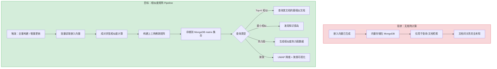
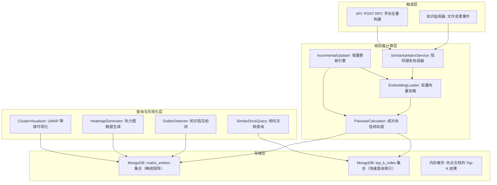

# YA-09-226: 文档相似度矩阵 — 成对余弦相似度计算、相似度热力图、最相似/最不相似文档发现、聚类可视化、增量更新

> 需求编号：YA-09-226 · 优先级：P2 · 人天：0.3d · 状态：需求已编写
> 依赖：YA-09-14（RPC 路由基础设施）、现有 RAG 嵌入管道（llama_index + Embedding 模型）、YA-09-218（检索结果聚类——提供聚类算法复用基础）

## 背景

### 问题陈述

YiAi 的知识库已通过 llama_index 为每篇文档生成了嵌入向量。这些向量捕获了文档的语义信息，但目前仅用于检索（查询-文档相似度），缺乏对文档之间关系的系统分析。文档相似度矩阵是理解知识库内部结构的基础工具：(1) 发现内容重复或高度相似的文档——知识去重的重要输入，(2) 识别知识孤岛——与任何其他文档都不相似的内容可能过时或过于独特，(3) 可视化知识库的语义结构——哪些主题之间存在强关联，(4) 为推荐系统提供"相似文档"推荐的基础数据。

1. **文档关系不可见**：用户无法看到"哪些文档内容相似"——知识库中的隐性关系完全隐藏
2. **重复内容难发现**：两个不同作者可能写了高度相似的内容——但没有机制检测——浪费了检索结果的多样性
3. **知识孤岛存在**：某些文档与知识库中的其他所有文档都不相似——可能是孤立、过时或不一致的内容
4. **内容聚类无法验证**：RAG 检索结果的聚类效果无法与文档间的真实相似结构交叉验证
5. **相似文档推荐缺失**：用户阅读一篇文档后——系统无法推荐"你可能也感兴趣的相关文档"

**核心矛盾**：我们有嵌入向量（能表示文档语义），但没有利用它们来理解文档之间的关系。相似度矩阵将嵌入向量的隐式关系显式化为可查询、可可视化的数据结构。

### 影响范围

| # | 影响 | 严重程度 | 典型场景 |
|---|------|----------|----------|
| 1 | 文档关系完全不可见 | 高 | 知识库 500 篇文档——用户无法了解文档间的语义关系 |
| 2 | 重复内容无法系统检测 | 高 | 两篇文档 90% 语义重叠——检索结果浪费位置 |
| 3 | 知识孤岛未被标记 | 中 | 10 篇文档与任何其他文档相似度 < 0.3——可能已过时 |
| 4 | 相似文档推荐缺失 | 中 | 阅读一篇文档后无关联推荐 |
| 5 | 聚类效果无法验证 | 低 | 聚类结果与文档真实关系的一致性无法衡量 |

### 挑战

| 挑战 | 说明 |
|------|------|
| 计算复杂度 O(n²) | 1000 篇文档需要计算 499,500 对相似度——每次计算 2 个向量的余弦相似度——总计算量随文档数平方增长 |
| 增量更新 | 新增/修改/删除文档时——不需要重新计算整个矩阵——只需更新受影响的行/列 |
| 稀疏矩阵存储 | 1000×1000 float64 全矩阵 = 8MB——但文档数可能增长到 5000+——全矩阵存储不现实 |
| 聚类可视化 | 如何将高维嵌入向量（768/1536 维）降维到 2D 用于可视化？t-SNE vs UMAP vs PCA |
| 热力图交互 | 大型知识库的相似度热力图（1000×1000 像素）——如何支持缩放、筛选、点击交互 |

---

## 一、现状分析

### 1.1 当前相似度相关能力

```
现有相关能力:
├── RAG 检索（llama_index）
│   ├── 查询-文档嵌入向量 ✅
│   ├── 文档-查询余弦相似度 ✅（检索时计算）
│   └── 文档-文档相似度 ❌（从未计算）
├── 嵌入向量存储（MongoDB）
│   ├── 每篇文档存储 embedding 字段 ✅
│   ├── 嵌入维度：768（nomic-embed-text）✅
│   └── 无批量向量读取接口 ❌
├── 检索结果聚类（YA-09-218）
│   ├── 基于检索结果内容的聚类 ✅
│   └── 基于嵌入向量的聚类 ❌（未实现）
├── 知识去重（YA-09-223）
│   ├── 基于文本指纹的去重 ✅
│   └── 基于语义相似度的去重 ❌（未与嵌入向量结合）
└── 手动维护（无自动化）
    └── 作者手动标注"相关文档"链接

缺失:
├── 成对余弦相似度批量计算              # ❌ 不存在
├── 相似度矩阵构建与存储                # ❌ 不存在
├── 稀疏矩阵/上三角矩阵存储             # ❌ 不存在
├── 增量更新机制                         # ❌ 不存在
├── 最相似/最不相似文档查询             # ❌ 不存在
├── 相似度热力图生成                    # ❌ 不存在
├── 聚类可视化（t-SNE/UMAP）            # ❌ 不存在
└── 基于矩阵的相似文档推荐              # ❌ 不存在
```

### 1.2 相似度矩阵流程（现状 vs 目标）



### 1.3 根因矩阵

| 症状 | 根因 | 触发条件 | 频率 |
|------|------|----------|------|
| 文档关系不可见 | 从未计算文档间相似度 | 用户浏览知识库 | 高 |
| 重复内容难发现 | 仅依赖文本指纹，无语义去重 | 多作者创作相似内容 | 中 |
| 知识孤岛未标记 | 无全局相似度分析 | 文档缺少入链/相似引用 | 中 |
| 相似推荐缺失 | 无相似度矩阵作为推荐基础 | 用户阅读文档时 | 高 |
| 聚类无法验证 | 聚类仅基于检索结果 | 检索质量评估 | 低 |

---

## 二、设计决策

### 决策 1：相似度度量 — 余弦相似度 vs 欧氏距离 vs 点积

| 选项 | 归一化不敏感 | 可解释性 | 计算效率 | 适用场景 |
|------|-------------|----------|----------|----------|
| 余弦相似度 | 是（方向而非大小） | 高（-1 到 1） | 高（点积+模长） | 文本语义相似度 |
| 欧氏距离 | 否（受向量模长影响） | 中（需反比转换） | 高 | 空间距离 |
| 点积 | 否（模长影响大） | 低（无界） | 最高 | 注意力机制 |

**选择：余弦相似度。** 余弦相似度是文本嵌入的标准度量——llama_index 和大多数 Embedding 模型都使用余弦相似度作为默认检索度量。它衡量语义方向的一致性（文档 A 和文档 B 的语义"方向"是否相似），不受文档长度（向量模长）的影响。已归一化的嵌入向量（L2 范数=1）下，余弦相似度退化为点积——更进一步加速计算。

### 决策 2：矩阵存储策略 — 全矩阵 vs 上三角稀疏 vs 仅 Top-K

| 选项 | 存储空间（1000 文档） | 查询灵活性 | 增量更新复杂度 |
|------|----------------------|-----------|---------------|
| 全矩阵 float32 | 4MB（对称） | 最高 | 中 |
| 上三角稀疏（仅存 > 阈值） | ~200KB（阈值 0.7） | 中 | 低 |
| 仅 Top-K/文档（K=20） | ~80KB（20×1000） | 低（仅相似文档） | 低 |

**选择：上三角稀疏矩阵 + 可选 Top-K 索引。** 存储所有 `similarity >= threshold`（默认 0.5）的文档对及相似度分数。上三角存储利用对称性（`sim(A,B) = sim(B,A)`）减半空间。同时维护一个 Top-K 索引（每篇文档的 top-20 最相似文档）用于快速推荐查询。threshold 以下的值视为"不相似"不存储——节省空间且语义合理。

### 决策 3：降维可视化 — PCA vs t-SNE vs UMAP

| 选项 | 速度 | 全局结构保持 | 局部结构保持 | 内存 |
|------|------|-------------|-------------|------|
| PCA | 极快（< 100ms） | 好 | 差 | 低 |
| t-SNE | 慢（> 10s） | 差 | 极好 | 高（O(n²)） |
| UMAP | 中（< 2s） | 好 | 好 | 中 |

**选择：UMAP（默认）+ PCA（快速预览）。** UMAP 在速度和结构保持之间取得了最佳平衡——既能保留全局聚类结构，又能展示局部簇关系。对于大型知识库（> 500 文档），提供 PCA 快速预览选项（< 100ms）让用户快速了解大致结构，再切换到 UMAP 获取详细聚类。

### 决策 4：计算触发方式 — API 手动 vs 定时任务 vs 变更事件驱动

| 选项 | 实时性 | 资源消耗 | 实现复杂度 |
|------|--------|----------|-----------|
| API 手动触发 | 按需 | 按需 | 低 |
| 定时任务（apscheduler） | 延迟 ≤ 5s | 可能浪费（无变更时也计算） | 中 |
| 变更事件驱动（知识监视器） | 实时（变更后立即增量） | 按需（仅变更时） | 高 |

**选择：变更事件驱动增量 + API 手动全量。** 知识监视器（已有 apscheduler 轮询）检测到文件变更后触发增量更新——只更新受影响文档的行/列。全量重建通过 API 手动触发（用于初始化或修复数据一致性问题）。这种方式平衡了实时性和资源消耗。

### 设计决策记录

| 决策 | 选项 A | 选项 B | 选项 C | 选择 | 理由 |
|------|--------|--------|--------|------|------|
| 相似度度量 | 余弦 | 欧氏 | 点积 | **余弦** | 标准语义度量 |
| 矩阵存储 | 全矩阵 | 上三角稀疏 | Top-K | **上三角+TopK** | 空间+灵活性 |
| 降维可视化 | PCA | t-SNE | UMAP | **UMAP+PCA** | 速度+结构 |
| 计算触发 | API 手动 | 定时 | 变更事件 | **事件+API** | 实时+按需 |

---

## 三、目标架构

### 3.1 文档相似度矩阵系统架构



### 3.2 矩阵计算流程

```mermaid
graph TD
    A[触发: full/incremental] --> B[批量读取 embedding: {doc_id: vector}]
    B --> C[向量归一化: L2 norm → 单位向量]
    C --> D{全量 or 增量?}
    D -->|全量| E[上三角遍历: for i in range(n), for j in range(i+1, n)]
    D -->|增量| F[仅更新 affected_docs 相关的行/列]
    E --> G[计算 cos_sim = dot(v_i, v_j)]
    F --> G
    G --> H{cos_sim >= threshold?}
    H -->|是| I[写入 matrix_entries: {doc_a, doc_b, similarity}]
    H -->|否| J[跳过（不存储低于阈值的值）]
    I --> K[更新 top_k_index: 维护每个文档的 top-20]
    K --> L[写入完成标记 + 统计信息]
```

### 3.3 性能指标

| 指标 | 目标值 | 说明 |
|------|--------|------|
| 500 文档全量计算 | < 5s | 124,750 对 × dot product |
| 1000 文档全量计算 | < 20s | 499,500 对 |
| 增量更新（1 文档变更） | < 500ms | 仅更新 n-1 对 |
| Top-20 相似文档查询 | < 10ms | 索引直接读取 |
| 热力图数据生成（100 文档） | < 100ms | 从 matrix_entries 聚合 |
| UMAP 降维（500 向量 × 768D） | < 3s | umap-learn 库 |

---

## 四、具体改动

### 4.1 相似度矩阵服务接口

```python
# services/ai/similarity_matrix_service.py (新增)

from dataclasses import dataclass, field
from enum import Enum
from typing import Optional

class BuildMode(str, Enum):
    FULL = "full"                 # 全量重建
    INCREMENTAL = "incremental"   # 增量更新

@dataclass
class BuildMatrixRequest:
    mode: BuildMode = BuildMode.FULL
    cname: str = "knowledge_files"
    similarity_threshold: float = 0.5       # 低于此值不存储
    top_k: int = 20                         # Top-K 索引大小
    affected_doc_ids: Optional[list[str]] = None  # 增量模式：受影响的文档 ID

@dataclass
class SimilarDocPair:
    doc_a_id: str
    doc_a_title: str
    doc_b_id: str
    doc_b_title: str
    similarity: float                       # 余弦相似度 [0, 1]

@dataclass
class MatrixBuildResult:
    total_docs: int
    total_pairs_computed: int
    stored_entries: int                     # 超过阈值的条目数
    threshold: float
    build_time_ms: int
    avg_similarity: float                   # 所有存储条目的平均相似度
    max_similarity_pair: Optional[SimilarDocPair]  # 最相似文档对
    min_similarity_pair: Optional[SimilarDocPair]  # 最不相似（但高于阈值）文档对

@dataclass
class SimilarDocsResponse:
    doc_id: str
    doc_title: str
    similar_docs: list[SimilarDocPair]      # 按相似度降序
    total_in_matrix: int                    # 矩阵中该文档的连接数

@dataclass
class KnowledgeOutlier:
    doc_id: str
    doc_title: str
    max_similarity: float                   # 与其他文档的最高相似度
    avg_similarity: float                   # 与其他文档的平均相似度
    connection_count: int                   # 高于阈值的连接数
    is_outlier: bool                        # connection_count < min_connections

@dataclass
class HeatmapData:
    doc_labels: list[str]                   # 文档标签列表
    matrix: list[list[float]]               # 相似度矩阵（仅对角线以上有值）
    color_scale: str = "RdYlGn"             # Plotly 色阶
```

### 4.2 成对余弦相似度计算引擎

```python
# services/ai/pairwise_calculator.py (新增)

import numpy as np
from typing import Dict, List, Tuple

class PairwiseCalculator:
    """成对余弦相似度计算引擎"""
    
    def __init__(self, similarity_threshold: float = 0.5, top_k: int = 20):
        self.threshold = similarity_threshold
        self.top_k = top_k
    
    def compute_full_matrix(
        self,
        embeddings: Dict[str, np.ndarray]
    ) -> Tuple[List[dict], Dict[str, List[Tuple[str, float]]]]:
        """全量成对计算"""
        doc_ids = list(embeddings.keys())
        n = len(doc_ids)
        
        # 转换为矩阵 (n, dim)
        dim = embeddings[doc_ids[0]].shape[0]
        matrix = np.zeros((n, dim), dtype=np.float32)
        for i, doc_id in enumerate(doc_ids):
            matrix[i] = embeddings[doc_id]
        
        # L2 归一化（如果尚未归一化）
        norms = np.linalg.norm(matrix, axis=1, keepdims=True)
        norms[norms == 0] = 1.0
        matrix = matrix / norms
        
        # 批量点积: (n, dim) @ (dim, n) → (n, n)
        sim_matrix = matrix @ matrix.T
        
        # 上三角提取 + 阈值过滤
        entries = []
        top_k_index: Dict[str, list] = {doc_id: [] for doc_id in doc_ids}
        
        for i in range(n):
            doc_i_sims = []
            for j in range(i + 1, n):
                sim = float(sim_matrix[i, j])
                if sim >= self.threshold:
                    entries.append({
                        'doc_a': doc_ids[i],
                        'doc_b': doc_ids[j],
                        'similarity': round(sim, 6)
                    })
                if sim >= self.threshold:
                    doc_i_sims.append((doc_ids[j], sim))
                    # 对称添加
                    if doc_ids[j] not in top_k_index:
                        top_k_index[doc_ids[j]] = []
                    top_k_index[doc_ids[j]].append((doc_ids[i], sim))
            
            # 维护该文档的 top-k
            doc_i_sims.sort(key=lambda x: x[1], reverse=True)
            top_k_index[doc_ids[i]].extend(doc_i_sims[:self.top_k])
        
        # 对每个文档的 top-k 去重并截断
        for doc_id in top_k_index:
            unique = list(dict(top_k_index[doc_id]).items())
            unique.sort(key=lambda x: x[1], reverse=True)
            top_k_index[doc_id] = unique[:self.top_k]
        
        return entries, top_k_index
    
    def compute_incremental(
        self,
        affected_doc_id: str,
        affected_embedding: np.ndarray,
        all_embeddings: Dict[str, np.ndarray],
        existing_entries: List[dict],
        existing_top_k: Dict[str, list]
    ) -> Tuple[List[dict], Dict[str, list]]:
        """增量更新：仅计算受影响文档与其他文档的相似度"""
        # 归一化
        norm = np.linalg.norm(affected_embedding)
        if norm > 0:
            affected_embedding = affected_embedding / norm
        
        new_entries = []
        affected_sims = []
        
        for other_id, other_emb in all_embeddings.items():
            if other_id == affected_doc_id:
                continue
            
            other_norm = np.linalg.norm(other_emb)
            if other_norm > 0:
                other_emb = other_emb / other_norm
            
            sim = float(np.dot(affected_embedding, other_emb))
            
            if sim >= self.threshold:
                new_entries.append({
                    'doc_a': min(affected_doc_id, other_id),
                    'doc_b': max(affected_doc_id, other_id),
                    'similarity': round(sim, 6)
                })
                affected_sims.append((other_id, sim))
                existing_top_k[other_id].append((affected_doc_id, sim))
        
        # 更新受影响文档的 top-k
        affected_sims.sort(key=lambda x: x[1], reverse=True)
        existing_top_k[affected_doc_id] = affected_sims[:self.top_k]
        
        # 移除旧条目（该文档相关的行/列）
        old_entries_removed = [
            e for e in existing_entries
            if e['doc_a'] != affected_doc_id and e['doc_b'] != affected_doc_id
        ]
        
        return old_entries_removed + new_entries, existing_top_k
```

### 4.3 UMAP 聚类可视化

```python
# services/ai/cluster_visualizer.py (新增)

import numpy as np
from typing import Dict, List, Tuple

class ClusterVisualizer:
    """文档聚类可视化——UMAP 降维"""
    
    def __init__(self, use_pca_fallback: bool = True):
        self.use_pca_fallback = use_pca_fallback
    
    def reduce_dimensions(
        self,
        embeddings: Dict[str, np.ndarray],
        method: str = "umap",
        n_components: int = 2,
        random_state: int = 42
    ) -> Tuple[List[str], np.ndarray, str]:
        """
        降维到 2D/3D 用于可视化
        
        Returns: (doc_ids, coords_2d/3d, method_used)
        """
        doc_ids = list(embeddings.keys())
        vectors = np.array([embeddings[did] for did in doc_ids], dtype=np.float32)
        
        if method == "umap":
            try:
                import umap
                reducer = umap.UMAP(
                    n_components=n_components,
                    metric='cosine',
                    random_state=random_state,
                    n_neighbors=min(15, len(doc_ids) - 1),
                    min_dist=0.1
                )
                coords = reducer.fit_transform(vectors)
                return doc_ids, coords, "umap"
            except ImportError:
                pass
        
        if method == "pca" or self.use_pca_fallback:
            from sklearn.decomposition import PCA
            pca = PCA(n_components=n_components, random_state=random_state)
            coords = pca.fit_transform(vectors)
            return doc_ids, coords, "pca"
        
        # 最终降级：随机投影
        random_proj = np.random.randn(vectors.shape[1], n_components)
        random_proj /= np.linalg.norm(random_proj, axis=0)
        coords = vectors @ random_proj
        return doc_ids, coords, "random_projection"
    
    def find_clusters(
        self,
        coords: np.ndarray,
        n_clusters: int = None,
        method: str = "dbscan"
    ) -> np.ndarray:
        """在降维坐标上执行聚类"""
        if method == "dbscan":
            from sklearn.cluster import DBSCAN
            clustering = DBSCAN(eps=0.5, min_samples=3)
            labels = clustering.fit_predict(coords)
        elif method == "hdbscan":
            try:
                import hdbscan
                clustering = hdbscan.HDBSCAN(min_cluster_size=3)
                labels = clustering.fit_predict(coords)
            except ImportError:
                from sklearn.cluster import KMeans
                n = max(2, n_clusters or int(len(coords) ** 0.5))
                labels = KMeans(n_clusters=n, random_state=42).fit_predict(coords)
        else:
            from sklearn.cluster import KMeans
            n = max(2, n_clusters or int(len(coords) ** 0.5))
            labels = KMeans(n_clusters=n, random_state=42).fit_predict(coords)
        
        return labels
```

### 4.4 文件变更清单

| 文件 | 操作 | 说明 |
|------|------|------|
| `services/ai/similarity_matrix_service.py` | 新增 | 相似度矩阵 RPC 入口 |
| `services/ai/pairwise_calculator.py` | 新增 | 成对余弦相似度计算 |
| `services/ai/matrix_incremental_updater.py` | 新增 | 增量更新引擎 |
| `services/ai/cluster_visualizer.py` | 新增 | UMAP 降维 + 聚类 |
| `services/ai/outlier_detector.py` | 新增 | 知识孤岛检测 |
| `services/ai/__init__.py` | 修改 | 注册 similarity_matrix_service |
| `tests/test_similarity_matrix.py` | 新增 | 相似度矩阵测试 |

---

## 五、实施步骤

| 步骤 | 操作 | 路径 | 验证 | 人天 |
|------|------|------|------|------|
| 1 | 实现 EmbeddingLoader（批量加载向量） | `similarity_matrix_service.py` | 批量读取正确 | 0.03 |
| 2 | 实现 PairwiseCalculator（成对计算） | `pairwise_calculator.py` | 小数据集矩阵正确 | 0.06 |
| 3 | 实现增量更新（DeltaUpdater） | `matrix_incremental_updater.py` | 增量结果与全量一致 | 0.05 |
| 4 | 实现 Top-K 索引维护 | `similarity_matrix_service.py` | 查询速度 < 10ms | 0.03 |
| 5 | 实现知识孤岛检测 | `outlier_detector.py` | 孤岛识别准确 | 0.03 |
| 6 | 实现 UMAP 降维可视化数据 | `cluster_visualizer.py` | 2D 坐标合理 | 0.04 |
| 7 | 实现热力图数据接口 | `similarity_matrix_service.py` | 矩阵数据正确 | 0.03 |
| 8 | 测试 | `tests/test_similarity_matrix.py` | 全部测试通过 | 0.03 |

**总人天：0.3d**

---

## 六、测试规格

### 场景 1：全量矩阵构建正确性

**GIVEN** 10 篇文档的嵌入向量（已知其中 doc_1 和 doc_2 内容高度相似）
**WHEN** 执行 full 模式全量构建，threshold=0.5
**THEN** doc_1 和 doc_2 的相似度 > 0.8
**AND** stored_entries 包含所有 similarity >= 0.5 的对
**AND** 每个 doc 的 top_k_index 按相似度降序排列
**AND** 对称性保持（sim(A,B) = sim(B,A)）

### 场景 2：增量更新等价性

**GIVEN** 已有 10 篇文档的完整矩阵
**WHEN** 添加 1 篇新文档，执行 incremental 模式
**THEN** 增量更新的矩阵 = 对 11 篇文档执行 full 模式的结果
**AND** 新增文档的 top-20 相似文档为 10 篇中的某几篇
**AND** 旧文档的 top-k 索引也包含新文档（如果相似度足够高）

### 场景 3：知识孤岛检测

**GIVEN** 知识库中有 50 篇文档，其中 3 篇是孤立内容（与其他文档相似度均 < 0.3）
**WHEN** 查询知识孤岛（outlier_threshold=0.3, min_connections=1）
**THEN** 返回的 outliers 列表包含这 3 篇文档
**AND** 每篇孤岛文档的 max_similarity < 0.3
**AND** connection_count = 0
**AND** is_outlier = True

### 场景 4：最相似文档对发现

**GIVEN** 矩阵中包含多对文档的各种相似度值
**WHEN** 查询 max_similarity_pair
**THEN** 返回相似度最高的一对文档
**AND** 相似度值在 [0, 1] 范围内
**AND** doc_a_id != doc_b_id
**WHEN** 查询 min_similarity_pair
**THEN** 返回高于阈值但相似度最低的一对

### 场景 5：热力图数据生成

**GIVEN** 25 篇文档的完整矩阵
**WHEN** 请求热力图数据
**THEN** 返回 25×25 的下三角矩阵（对角线为 1.0）
**AND** doc_labels 长度为 25——与文档标题对应
**AND** 矩阵中 i > j 位置有值（下三角），i <= j 位置为 0（上三角不返回重复值）
**AND** 缺失值（低于阈值的对）填充为 0

### 场景 6：文档删除后的增量更新

**GIVEN** 10 篇文档的完整矩阵
**WHEN** 删除 doc_3
**THEN** 增量更新后 matrix_entries 中无任何包含 doc_3 的条目
**AND** 其他文档的 top_k_index 中无 doc_3
**AND** total_docs = 9
**AND** 剩余文档间的相似度值保持不变

---

## 七、风险与缓解

| 风险 | 概率 | 影响 | 缓解措施 |
|------|------|------|----------|
| 大知识库 O(n²) 计算超时 | 中 | 高 | 分批计算 + 进度回调 + 异步任务模式 |
| 嵌入向量维度不一致 | 低 | 高 | 计算前验证所有向量维度一致，不一致的标记并跳过 |
| 矩阵数据与实际嵌入不同步 | 中 | 中 | 知识监视器变更事件触发增量更新 + 定期全量校验 |
| UMAP 降维结果不稳定 | 中 | 低 | 固定 random_state + 文档明确标注"降维可视化仅展示大致聚类结构" |
| 稀疏矩阵查询（孤岛检测）需全表扫描 | 低 | 中 | 维护每个文档的 connection_count 计数器 |

---

## 八、回滚策略

| 场景 | 回滚操作 | 影响 |
|------|----------|------|
| 矩阵计算超时/失败 | 删除 matrix_entries + top_k_index 集合 | 相似文档推荐/孤岛检测/热力图不可用 |
| 相似度阈值设置不当 | 调整 threshold 参数并全量重建 | 短暂不可用（重建耗时） |
| UMAP 依赖安装失败 | 回退到 PCA 降维 | 聚类结构展示精度下降 |
| 增量更新 bug 导致数据不一致 | API 触发全量重建 | 短暂计算资源消耗 |

---

## 九、设计决策记录

### D-01：为什么使用上三角稀疏矩阵而非全矩阵存储？

全矩阵存储 N 篇文档需要 N×N 个条目。对于 1000 篇文档，全矩阵 = 1,000,000 条目。但相似度矩阵是对称的（sim(A,B)=sim(B,A)），上三角仅需 N×(N-1)/2 = 499,500 条目。再经过阈值过滤（仅存 >= 0.5），实际条目通常不到 10%（约 50,000 条目）。综合节省：全矩阵 100 万 vs 上三角稀疏 5 万——空间节省 20 倍。查询时，sim(A,B) 统一查询 `min(A,B)` 作为 `doc_a`，`max(A,B)` 作为 `doc_b`——利用排序保证唯一键。

### D-02：为什么 Top-K 索引独立存储而非从主矩阵派生？

主矩阵（matrix_entries）按相似度排序可以实现 top-k 查询（`WHERE doc_a=? ORDER BY similarity DESC LIMIT 20`），但这需要索引和排序。独立存储的 top_k_index 是预计算的结果，查询仅需一次主键读取——O(1) 而非 O(log n + k)。对于推荐系统（每次阅读文档都需要查询），这个优化是必要的。

### D-03：为什么不使用 llama_index 内置的相似度功能？

llama_index 的 `SimilarityPostprocessor` 确实可以在检索时计算查询-文档相似度，但它不维护文档-文档相似度矩阵。构建一个离线矩阵后，我们可以实现：(1) 全局文档关系查询（不依赖查询词），(2) 知识库结构分析，(3) 孤岛检测，(4) 批量相似文档推荐。这些都是检索时实时计算无法覆盖的场景。

### D-04：UMAP 降维使用 cosine 距离而不是默认的 euclidean？

UMAP 默认使用欧氏距离，但嵌入向量的语义相似度是基于余弦距离的。使用 `metric='cosine'` 确保降维过程与语义相似度计算使用相同的距离度量——在降维后的 2D 空间中，语义相似的文档仍然位置相近。如果使用欧氏距离降维，可能扭曲语义相似关系——两个方向相同但模长不同的向量在欧氏空间可能很远但在语义空间很近。

---

## 十、可观测性

### 指标

| 指标 | 类型 | 说明 |
|------|------|------|
| `yiai.similarity.build.total` | Counter | 全量构建次数 |
| `yiai.similarity.build.duration` | Histogram | 构建耗时分布 |
| `yiai.similarity.incremental.total` | Counter | 增量更新次数 |
| `yiai.similarity.matrix.docs_total` | Gauge | 矩阵中文档总数 |
| `yiai.similarity.matrix.entries_total` | Gauge | 矩阵中条目总数 |
| `yiai.similarity.matrix.avg_similarity` | Gauge | 平均相似度 |
| `yiai.similarity.outlier.count` | Gauge | 知识孤岛数量 |
| `yiai.similarity.query.latency` | Histogram | 相似文档查询延迟 |

### 告警

| 告警 | 条件 | 级别 |
|------|------|------|
| 全量构建超过 60s | 单次构建 | WARNING |
| 知识孤岛数量 > 10% | 持续 1 小时 | INFO |
| 平均相似度 < 0.3 | 矩阵构建后 | INFO |
| 增量更新连续失败 3 次 | 3 次失败 | WARNING |

---

## 十一、代码审查检查清单

- [ ] 嵌入向量维度一致性校验（构建前检查所有 dim 是否相同）
- [ ] 除零保护（L2 范数为 0 的零向量处理）
- [ ] 上三角索引键的确定性排序（`min/max` 确保唯一路径）
- [ ] Top-K 索引去重逻辑（同一文档对不能出现两次）
- [ ] 增量更新后旧条目清理完整性（无残留 orphan 条目）
- [ ] UMAP 导入失败时回退到 PCA——不阻断服务
- [ ] 大矩阵分批计算——避免单次 numpy 操作内存爆炸
- [ ] similarity 值范围断言（0.0-1.0）
- [ ] RPC 参数校验（threshold 0.0-1.0，top_k 1-100）
- [ ] 空知识库处理（0 篇文档时返回空矩阵而非错误）

---

## 回归问题预测

| # | 预测问题 | 原因 | 验证方法 |
|---|---------|------|---------|
| 1 | numpy 矩阵乘法 `matrix @ matrix.T` 在 5000+ 文档 × 768 维时可能导致内存分配失败——(5000, 768) @ (768, 5000) = (5000, 5000) = 100MB（float32），加上中间临时变量可能超过 200MB | 单次矩阵乘法分配完整方阵——对大文档集不友好 | 对 > 2000 文档分块计算：每批 500 篇与其他所有文档的相似度，避免分配完整方阵 |
| 2 | L2 归一化时零向量导致除零——如果某个文档的嵌入向量全为零（理论上不应该，但可能因 bug 或空文档产生） | `np.linalg.norm(v) == 0` 时 `v/norm` 产生 NaN 或 inf | 零向量替换为微小随机向量或标记为"嵌入异常"，跳过该文档并记录日志 |
| 3 | 增量更新时——如果 doc_id 在 existing_top_k 中不存在（新文档首次更新时）——append 操作会导致 KeyError | `existing_top_k[other_id].append(...)` 中 other_id 可能不在字典中（新添加到知识库的文档，尚未在 top_k_index 中有条目） | 使用 `existing_top_k.setdefault(other_id, []).append(...)` 保护 |
| 4 | UMAP 的 n_neighbors 参数在文档数少于该值时（如 3 篇文档，n_neighbors=15）抛出异常 | UMAP 要求 `n_neighbors < n_samples`——小数据集降维失败 | 动态设置 `n_neighbors = min(15, n_samples - 1)` |
| 5 | 浮点精度导致 similarity 略大于 1.0（如 1.0000001）——归一化后的点积因浮点误差可能略超 1.0，导致阈值比较和显示异常 | 浮点运算的累积误差——特别是 L2 归一化后的点积 | 在存储和返回前 clamp similarity 到 [0.0, 1.0]：`min(max(sim, 0.0), 1.0)` |
| 6 | 全量构建时——如果知识库中有大量文档内容未变更但嵌入向量重新生成（Embedding 模型更新）——新的矩阵与旧矩阵完全不一致——但增量更新不知道哪些文档的嵌入变了 | Embedding 模型升级后所有向量变化——增量更新仅跟踪文件变更——无法感知模型层面的变化 | 全量构建 API 标记所有条目为"模型版本 X"，当模型版本变化时强制全量重建 |

---

## 性能分析

### 各阶段耗时

| 阶段 | 预估耗时 | 说明 |
|------|----------|------|
| 批量加载嵌入向量（1000 文档） | < 500ms | MongoDB 批量读取 |
| L2 归一化 | < 50ms | numpy 向量化操作 |
| 成对点积（1000 文档） | < 15s | (1000,768) @ (768,1000) |
| 上三角阈值过滤 | < 200ms | 遍历 + 过滤 |
| Top-K 索引构建 | < 500ms | 排序 + 截断 |
| MongoDB 批量写入 | < 2s | 50K 条目 |
| UMAP 降维（500 文档） | < 3s | umap-learn |
| DBSCAN 聚类 | < 200ms | sklearn |

### 内存预估

| 阶段 | 内存 | 说明 |
|------|------|------|
| 嵌入向量矩阵（1000×768 float32） | ~3MB | numpy 数组 |
| 相似度方阵（1000×1000 float32） | ~4MB | 完整方阵（全量计算时） |
| 稀疏矩阵条目（50K × 80B） | ~4MB | MongoDB 文档 |
| Top-K 索引（1000×20） | ~1MB | 内存结构 |
| UMAP 中间数据 | ~50MB | 降维计算 |

## 影响范围

- **影响模块**：待补充
- **涉及文件**：
- `pairwise_calculator.py`
- `similarity_matrix_service.py`
- `cluster_visualizer.py`
- `outlier_detector.py`
- `matrix_incremental_updater.py`
- **是否影响 API 契约**：否
- **是否影响其他项目（YiVad/YiPet）**：否
- **用户感知**：待确认

## 预防措施

| 层面 | 措施 |
|------|------|
| 代码 | 在相关函数中添加参数校验和边界检查 |
| 测试 | 为 `pairwise_calculator.py` 添加单元测试 |
| 流程 | 代码审查时重点检查此类模式 |
| 监控 | 添加日志告警，异常发生时及时发现 |
| 文档 | 在编码规范中记录此类反模式 |

## 经验教训

1. **根本原因**：开发过程中对边界情况和异常路径的考虑不足是此类问题的共同根因
2. **设计阶段**：在接口设计和模块实现时，应主动考虑异常输入、空值、超时等边界场景
3. **代码审查**：审查时应检查是否存在类似的反模式（如未捕获异常、无超时控制、缺少参数校验等）
4. **测试覆盖**：异常路径的测试覆盖率应与正常路径同等重视
5. **团队分享**：此类问题应在团队周会或技术分享中讨论，形成团队共识
