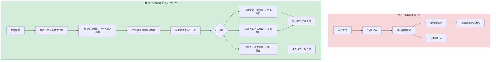
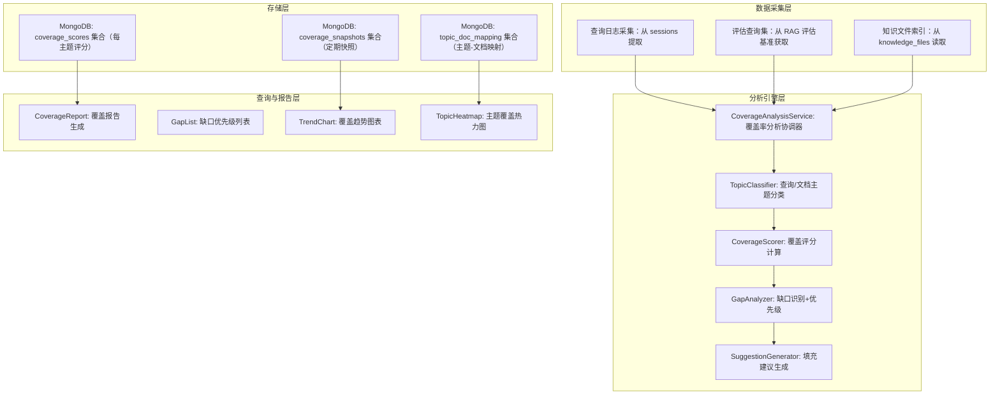
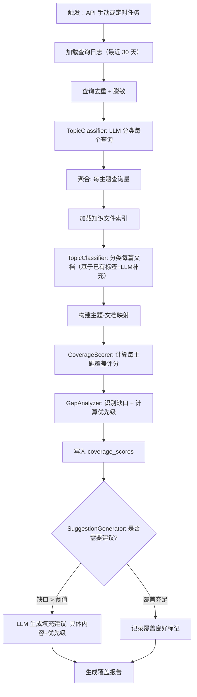

# YA-09-227: 知识覆盖率分析 — RAG 知识覆盖度评分、主题覆盖缺口识别、查询领域分类、缺口填充建议、覆盖率趋势追踪

> 需求编号：YA-09-227 · 优先级：P2 · 人天：0.3d · 状态：需求已编写
> 依赖：YA-09-14（RPC 路由基础设施）、现有 RAG 检索管道（llama_index）、YA-09-213（RAG 评估基准——提供评估框架复用）、YA-09-226（文档相似度矩阵——提供文档聚类基础）

## 背景

### 问题陈述

YiAi 的 RAG 系统通过检索知识库文档来回答问题，但系统缺乏对"知识库能回答哪些问题"的全局认知。知识覆盖率分析旨在回答三个核心问题：(1) 知识库在哪些主题领域有充足的覆盖？(2) 哪些主题领域存在明显缺口——用户会问但知识库没有相关内容？(3) 应该优先补充哪些内容来填补这些缺口？当前现状是：只有用户遇到"检索不到结果"时才被动发现知识缺失，缺乏系统化的覆盖评估。

1. **覆盖盲区未知**：知识库有 500 篇文档——但系统不知道在"Kubernetes 部署"或"Prompt 工程"领域是否有足够的覆盖
2. **内容补充无方向**：团队想扩充知识库——但不知道优先补充哪个领域——凭直觉而非数据驱动
3. **查询失败无追踪**：用户查询返回空结果或低质量结果时——系统不记录也不分析——失去了发现缺口的最佳信号
4. **文档与需求的映射缺失**：不知道"用户最常问的 20 个问题"有多少能被知识库覆盖——覆盖率缺失导致盲目扩充
5. **覆盖退化不可见**：知识库更新后——如果某些内容被误删或过时——覆盖率的下降无法被感知

**核心矛盾**：RAG 系统的价值取决于知识库的覆盖面，但覆盖面本身从未被衡量。覆盖率分析将"检索质量"从单次查询级别提升到知识库级别——从"这个查询答得好吗"到"我们这个知识库整体覆盖了哪些领域"。

### 影响范围

| # | 影响 | 严重程度 | 典型场景 |
|---|------|----------|----------|
| 1 | 知识覆盖盲区完全未知 | 高 | 某个重要领域在知识库中完全缺失 |
| 2 | 内容补充无数据支撑 | 高 | 团队争论先补充前端还是后端内容的优先级 |
| 3 | 查询失败信号被浪费 | 中 | 每天 50 次检索无结果——但无记录无分析 |
| 4 | 文档-查询的覆盖映射缺失 | 中 | 不知道 200 篇文档能覆盖 60 个常见问题中的几个 |
| 5 | 覆盖退化无法检测 | 低 | 关键文档被误删后覆盖评分下降 |

### 挑战

| 挑战 | 说明 |
|------|------|
| 主题/领域分类的粒度 | 太粗（如"技术"类别）没有意义；太细（如"Python 3.12 asyncio 的 TaskGroup"）不可维护。需要自动聚类 + 人工标注的混合方案 |
| 覆盖评分的定义 | 什么算"覆盖"？文档存在就算？检索能返回就算？答案质量高才算？不同定义导致完全不同的评分 |
| 查询日志的隐私和采样 | 分析需要用户查询日志——但需要脱敏 + 采样（不是所有查询都需要分析） |
| 缺口与建议的质量 | "缺少 Kubernetes 内容"太模糊——"缺少 Kubernetes 1.28 中 Sidecar 容器的部署指南"才有价值 |
| 覆盖趋势的比较基线 | 需要建立覆盖基线（如 2026-09 的快照），后续对比才能发现退化和改进 |

---

## 一、现状分析

### 1.1 当前覆盖率相关能力

```
现有相关能力:
├── RAG 检索（llama_index）
│   ├── 查询处理 ✅
│   ├── 检索结果返回（含相似度分数）✅
│   └── 检索失败/低质量标记 ❌
├── RAG 评估基准（YA-09-213）
│   ├── 预定义评估查询集 ✅
│   ├── 检索质量评分 ✅
│   └── 知识覆盖率评分 ❌
├── 知识监视器
│   ├── 文件变更检测 ✅
│   ├── 知识文件索引 ✅
│   └── 文件-领域分类 ❌
├── 会话管理（sessions 集合）
│   ├── 用户查询记录 ✅
│   └── 查询主题分类 ❌
└── 手动评估（人工判断）
    └── "这个领域我们好像没有文档"

缺失:
├── 查询领域自动分类                        # ❌ 不存在
├── 文档-主题覆盖矩阵                        # ❌ 不存在
├── 每主题覆盖评分                          # ❌ 不存在
├── 知识缺口识别算法                        # ❌ 不存在
├── 内容补充建议生成                        # ❌ 不存在
├── 覆盖率趋势追踪（时间序列）              # ❌ 不存在
├── 覆盖热力图（主题 × 时间）               # ❌ 不存在
└── 查询失败根因分析                        # ❌ 不存在
```

### 1.2 覆盖率分析流程（现状 vs 目标）



### 1.3 根因矩阵

| 症状 | 根因 | 触发条件 | 频率 |
|------|------|----------|------|
| 覆盖盲区未知 | 无覆盖分析模块 | 用户查询未覆盖领域 | 持续 |
| 内容补充无方向 | 无缺口识别+优先级排序 | 需要决策内容扩充 | 低 |
| 查询失败信号浪费 | 无 RAG 检索结果质量追踪 | 每次低质量检索 | 高 |
| 覆盖与需求脱节 | 未将查询需求与文档覆盖关联 | 知识库更新时 | 中 |
| 覆盖退化不可见 | 无覆盖趋势追踪 | 文档删除/过时 | 低 |

---

## 二、设计决策

### 决策 1：主题分类方法 — LLM 分类 vs 嵌入聚类 vs 关键词规则

| 选项 | 准确度 | 可解释性 | 成本 | 冷启动 |
|------|--------|----------|------|--------|
| LLM 分类（few-shot prompt） | 高（可理解上下文） | 高（自然语言标签） | 中（每次 LLM 调用） | 低 |
| 嵌入聚类（KMeans/HDBSCAN） | 中（依赖嵌入质量） | 低（簇标签需人工解释） | 低（批量聚类） | 中 |
| 关键词规则（主题词词典） | 低（覆盖面窄） | 高（确定性规则） | 极低 | 高（需维护词典） |

**选择：LLM 分类为主 + 嵌入聚类辅助。** 对于查询领域分类——使用 LLM few-shot（已有的分类标签体系：架构设计、前端、后端、AI/LLM、运维、数据、测试），每次分类成本低（~200 tokens）。对于文档主题聚类——使用嵌入聚类（HDBSCAN），在 LLM 分类标签基础上发现新兴主题和子主题。两者互补——LLM 提供准确的可读标签，嵌入聚类发现 LLM 未覆盖的模式。

### 决策 2：覆盖评分定义 — 二元（有/无）vs 检索成功率 vs 文档密度

| 选项 | 计算方法 | 粒度 | 敏感度 |
|------|----------|------|--------|
| 二元覆盖 | 主题是否有 >= 1 篇文档 | 粗 | 低（1 篇和 100 篇同分） |
| 检索成功率 | 该主题查询中分数 >= 阈值的比例 | 中 | 中（依赖查询采样） |
| 文档密度加权 | Σ(document_relevance × freshness) / topic_query_count | 细 | 高（综合考虑质量和时效） |

**选择：文档密度加权评分（Coverage Score）。** 对于每个主题：CoverageScore = 平均检索质量（该主题下文档的检索分数）× 文档数量归一化 × 文档新鲜度因子。二元覆盖太粗糙（1 篇和 100 篇无差别），纯检索成功率受查询质量影响大。文档密度加权综合考虑了"有多少文档"、"文档质量如何"、"文档是否过时"三个维度。

### 决策 3：缺口优先级排序 — 仅查询量 vs 查询量×缺口大小 vs 业务价值加权

| 选项 | 排序依据 | 公平性 | 实现复杂度 |
|------|----------|--------|-----------|
| 仅查询量 | 该主题查询频次 | 低（忽略缺口严重度） | 最低 |
| 查询量 × 缺口大小 | 频次 × (1 - 覆盖率) | 中 | 低 |
| 业务价值加权 | 频次 × 缺口 × 业务权重 | 高 | 中 |

**选择：查询量 × 缺口大小 + 可选业务权重。** GapPriority = query_frequency × (1 - coverage_score) × business_weight。默认 business_weight=1.0，用户可为特定主题设置更高权重（如"安全合规"主题权重 3.0）。此公式确保高频查询 + 低覆盖 + 高业务价值的缺口排在填充列表最前面。

### 决策 4：覆盖趋势存储 — MongoDB 时间序列 vs 快照集合 vs 内存

| 选项 | 查询灵活性 | 存储成本 | 数据持久性 |
|------|-----------|----------|-----------|
| MongoDB 时间序列集合 | 高（聚合管道） | 中（每日 1 条/主题） | 是 |
| 快照集合（定期全量快照） | 中 | 低 | 是 |
| 内存（仅最新值） | 低 | 极低 | 否 |

**选择：快照集合（每周全量 + 每日增量）。** 覆盖评分变化缓慢（通常以周为单位），每周生成一份完整快照（`coverage_snapshots` 集合），每日记录有变化的主题的增量数据。快照集合支持版本比较（如"对比 2026-09-01 和 2026-09-30 的覆盖率变化"）。

### 设计决策记录

| 决策 | 选项 A | 选项 B | 选项 C | 选择 | 理由 |
|------|--------|--------|--------|------|------|
| 主题分类 | LLM分类 | 嵌入聚类 | 关键词规则 | **LLM+聚类** | 准确+发现力 |
| 覆盖评分 | 二元 | 检索成功率 | 文档密度加权 | **密度加权** | 细粒度+多维度 |
| 缺口优先级 | 查询量 | 查询量×缺口 | 业务加权 | **查询量×缺口+权重** | 数据+业务 |
| 趋势存储 | 时间序列 | 快照 | 内存 | **快照集合** | 持久+可比较 |

---

## 三、目标架构

### 3.1 知识覆盖率分析系统架构



### 3.2 覆盖率分析执行流程



### 3.3 性能指标

| 指标 | 目标值 | 说明 |
|------|--------|------|
| 100 查询主题分类 | < 30s | LLM few-shot 批量 |
| 500 文档主题分类 | < 60s | 批量处理 |
| 覆盖评分计算（20 主题） | < 2s | 聚合统计 |
| 缺口分析 | < 1s | 排序+过滤 |
| 覆盖报告生成 | < 5s | 汇总+格式化 |
| 周快照存储 | < 100ms | MongoDB 批量写入 |

---

## 四、具体改动

### 4.1 覆盖率分析服务接口

```python
# services/ai/coverage_analysis_service.py (新增)

from dataclasses import dataclass, field
from enum import Enum
from typing import Optional
from datetime import datetime

class CoverageLevel(str, Enum):
    EXCELLENT = "excellent"    # coverage >= 0.8
    GOOD = "good"              # coverage >= 0.6
    FAIR = "fair"              # coverage >= 0.4
    POOR = "poor"              # coverage >= 0.2
    CRITICAL = "critical"      # coverage < 0.2

@dataclass
class TopicCoverage:
    topic_id: str
    topic_name: str                          # 中文主题名称
    topic_description: str                   # 主题描述
    query_count: int                         # 30 天内查询次数
    document_count: int                      # 该主题下文档数量
    coverage_score: float                    # 覆盖评分 (0-1)
    coverage_level: CoverageLevel
    avg_retrieval_quality: float             # 该主题文档的平均检索质量
    freshness_score: float                   # 文档新鲜度 (基于 updated 字段)
    trend_direction: str                     # "improving" / "declining" / "stable"
    top_gaps: list[str]                      # 该主题内的具体缺口描述

@dataclass
class KnowledgeGap:
    topic_id: str
    topic_name: str
    gap_description: str                     # 缺口具体描述
    severity: str                            # "critical" / "major" / "minor"
    priority_score: float                    # query_freq * (1-coverage) * biz_weight
    suggested_content: str                   # 建议补充的内容描述
    suggested_title: str                     # 建议的文章标题
    estimated_effort: str                    # "低" / "中" / "高"
    related_existing_docs: list[str]         # 相关已存在文档（用于参考）

@dataclass
class CoverageReport:
    generated_at: datetime
    analysis_period_days: int                # 分析周期
    total_topics: int
    total_queries_analyzed: int
    total_documents: int
    overall_coverage_score: float            # 全局覆盖评分
    topics: list[TopicCoverage]
    critical_gaps: list[KnowledgeGap]

@dataclass
class CoverageTrend:
    topic_id: str
    snapshots: list[dict]                    # [{date, score, doc_count, query_count}]
    trend_slope: float                       # 趋势斜率（正=改善，负=退化）
```

### 4.2 主题分类器

```python
# services/ai/topic_classifier.py (新增)

from typing import List, Dict

TOPIC_CATEGORIES = [
    {
        "id": "architecture",
        "name": "架构设计",
        "description": "系统架构、微服务、分布式、设计模式等方面的内容",
        "keywords": ["架构", "微服务", "分布式", "设计模式", "系统设计", "DDD"]
    },
    {
        "id": "frontend",
        "name": "前端开发",
        "description": "Vue、React、CSS、浏览器、UI 组件等方面的内容",
        "keywords": ["Vue", "React", "CSS", "组件", "前端", "浏览器"]
    },
    {
        "id": "backend",
        "name": "后端开发", 
        "description": "Python、FastAPI、数据库、API 设计等方面的内容",
        "keywords": ["Python", "FastAPI", "数据库", "API", "MongoDB", "REST"]
    },
    {
        "id": "ai_llm",
        "name": "AI/LLM",
        "description": "大语言模型、RAG、Prompt 工程、Agent、Embedding 等方面的内容",
        "keywords": ["LLM", "RAG", "Prompt", "Agent", "Embedding", "模型", "Ollama"]
    },
    {
        "id": "devops",
        "name": "运维与部署",
        "description": "Docker、Kubernetes、CI/CD、监控、日志等方面的内容",
        "keywords": ["Docker", "Kubernetes", "CI/CD", "部署", "监控", "日志"]
    },
    {
        "id": "data",
        "name": "数据与存储",
        "description": "数据库设计、数据迁移、缓存、索引优化等方面的内容",
        "keywords": ["数据库", "缓存", "索引", "迁移", "MongoDB", "Redis"]
    },
    {
        "id": "testing",
        "name": "测试与质量",
        "description": "单元测试、集成测试、性能测试、代码质量等方面的内容",
        "keywords": ["测试", "质量", "pytest", "覆盖率", "性能测试"]
    },
    {
        "id": "security",
        "name": "安全与合规",
        "description": "认证授权、数据安全、合规、加密等方面的内容",
        "keywords": ["安全", "认证", "授权", "加密", "合规", "JWT"]
    },
    {
        "id": "chrome_ext",
        "name": "Chrome 扩展",
        "description": "Chrome MV3、浏览器扩展开发、Content Script 等方面的内容",
        "keywords": ["Chrome", "扩展", "MV3", "Service Worker", "Content Script"]
    },
    {
        "id": "knowledge_mgmt",
        "name": "知识管理",
        "description": "知识库管理、RAG 数据源、YiKnowledge 等方面的内容",
        "keywords": ["知识库", "YiKnowledge", "frontmatter", "RAG", "标签"]
    }
]

class TopicClassifier:
    """查询和文档主题分类器"""
    
    def classify_queries(
        self,
        queries: List[str],
        llm_service=None
    ) -> Dict[str, List[str]]:
        """对查询列表进行主题分类"""
        if llm_service:
            return self._llm_classify(queries, llm_service)
        return self._keyword_classify(queries)
    
    def classify_documents(
        self,
        documents: List[dict]
    ) -> Dict[str, List[str]]:
        """对文档列表进行主题分类"""
        result = {cat['id']: [] for cat in TOPIC_CATEGORIES}
        
        for doc in documents:
            assigned = self._classify_single_doc(doc)
            for topic_id in assigned:
                result[topic_id].append(doc['_id'])
        
        return result
    
    def _classify_single_doc(self, doc: dict) -> List[str]:
        """对单篇文档分类（基于 frontmatter tags + 标题 + 内容关键词）"""
        assigned = []
        tags = doc.get('tags', [])
        title = doc.get('title', '')
        category = doc.get('category', '')
        
        combined = ' '.join(tags + [title, category]).lower()
        
        for cat in TOPIC_CATEGORIES:
            score = 0
            for kw in cat['keywords']:
                if kw.lower() in combined:
                    score += 1
            # 至少匹配 2 个关键词才认为属于该主题
            if score >= 2:
                assigned.append(cat['id'])
        
        return assigned if assigned else ['uncategorized']
    
    def _llm_classify(
        self,
        queries: List[str],
        llm_service
    ) -> Dict[str, List[str]]:
        """使用 LLM 进行分类（更准确）"""
        # 构建 few-shot prompt
        topics_desc = '\n'.join([
            f"- {cat['id']}: {cat['name']}（{cat['description']}）"
            for cat in TOPIC_CATEGORIES
        ])
        
        prompt = f"""将以下用户查询分类到对应的主题。每个查询可以属于多个主题。

可用主题：
{topics_desc}

分类规则：
- 一个查询可以同时属于多个主题
- 如果无法确定，使用 "uncategorized"
- 以 JSON 格式返回：{{"query_index": ["topic_id1", "topic_id2"]}}

查询列表：
{self._format_queries(queries)}

JSON 结果："""

        # 调用 LLM（实际实现调用 Ollama）
        # response = llm_service.complete(prompt)
        # return parse_json(response)
        return self._keyword_classify(queries)  # fallback
    
    def _format_queries(self, queries: List[str]) -> str:
        return '\n'.join([f"{i}. {q}" for i, q in enumerate(queries)])
    
    def _keyword_classify(self, queries: List[str]) -> Dict[str, List[str]]:
        """关键词匹配分类（fallback）"""
        result = {cat['id']: [] for cat in TOPIC_CATEGORIES}
        result['uncategorized'] = []
        
        for query in queries:
            matched = False
            for cat in TOPIC_CATEGORIES:
                if any(kw.lower() in query.lower() for kw in cat['keywords']):
                    result[cat['id']].append(query)
                    matched = True
            if not matched:
                result['uncategorized'].append(query)
        
        return result
```

### 4.3 文件变更清单

| 文件 | 操作 | 说明 |
|------|------|------|
| `services/ai/coverage_analysis_service.py` | 新增 | 覆盖率分析 RPC 入口 |
| `services/ai/topic_classifier.py` | 新增 | 查询/文档主题分类器 |
| `services/ai/coverage_scorer.py` | 新增 | 覆盖评分计算引擎 |
| `services/ai/gap_analyzer.py` | 新增 | 缺口识别与优先级排序 |
| `services/ai/suggestion_generator.py` | 新增 | 填充建议 LLM 生成 |
| `services/ai/__init__.py` | 修改 | 注册 coverage_analysis_service |
| `tests/test_coverage_analysis.py` | 新增 | 覆盖率分析测试 |

---

## 五、实施步骤

| 步骤 | 操作 | 路径 | 验证 | 人天 |
|------|------|------|------|------|
| 1 | 定义主题分类体系（10 大主题 + 关键词） | `topic_classifier.py` | 分类 prompt 正确 | 0.02 |
| 2 | 实现 TopicClassifier（关键词 + LLM 双模式） | `topic_classifier.py` | 查询和文档分类准确率 > 80% | 0.05 |
| 3 | 实现 CoverageScorer（密度加权评分） | `coverage_scorer.py` | 评分公式正确 | 0.04 |
| 4 | 实现 GapAnalyzer（优先级排序） | `gap_analyzer.py` | 高频低覆盖排前面 | 0.04 |
| 5 | 实现 SuggestionGenerator（LLM 生成建议） | `suggestion_generator.py` | 建议具体可执行 | 0.05 |
| 6 | 实现每周快照存储 | `coverage_analysis_service.py` | 快照数据完整 | 0.03 |
| 7 | 实现覆盖报告+趋势 API | `coverage_analysis_service.py` | 报告格式正确 | 0.04 |
| 8 | 测试 | `tests/test_coverage_analysis.py` | 全部测试通过 | 0.03 |

**总人天：0.3d**

---

## 六、测试规格

### 场景 1：查询主题分类准确性

**GIVEN** 20 条用户查询——其中 5 条关于 "Vue 组件通信"、5 条关于 "RAG 检索优化"、5 条关于 "Docker 部署"、5 条混合内容
**WHEN** 调用 TopicClassifier.classify_queries
**THEN** "Vue 组件通信" 查询全部归入 frontend 主题
**AND** "RAG 检索优化" 查询全部归入 ai_llm 主题
**AND** "Docker 部署" 查询归入 devops 主题
**AND** 分类准确率 >= 80%（关键词模式）或 >= 90%（LLM 模式）

### 场景 2：覆盖评分计算

**GIVEN** "前端开发" 主题有 15 篇文档——平均检索质量 0.75——平均新鲜度 0.8
**WHEN** 计算该主题的覆盖评分
**THEN** coverage_score 在 [0.5, 0.9] 范围（综合考虑文档数、质量、新鲜度）
**AND** coverage_level 为 "good" 或 "excellent"
**WHEN** "安全与合规" 主题只有 1 篇文档——质量 0.4——新鲜度 0.2
**THEN** coverage_level 为 "critical" 或 "poor"

### 场景 3：缺口优先级排序

**GIVEN** 三个缺口：A（AI/LLM, 查询量 100, 覆盖率 0.2）、B（安全, 查询量 50, 覆盖率 0.1）、C（测试, 查询量 10, 覆盖率 0.3）
**WHEN** 计算优先级：query_freq × (1-coverage)
**THEN** A 的优先级 = 100 × 0.8 = 80
**AND** B 的优先级 = 50 × 0.9 = 45
**AND** C 的优先级 = 10 × 0.7 = 7
**AND** 排序为 A > B > C

### 场景 4：缺口填充建议生成

**GIVEN** 识别到 "AI/LLM" 主题存在 "缺少 Prompt 模板管理" 缺口
**WHEN** SuggestionGenerator 生成填充建议
**THEN** suggested_title 为非空字符串（如 "Prompt 模板管理与版本控制最佳实践"）
**AND** suggested_content 包含具体章节建议
**AND** estimated_effort 为 "低" / "中" / "高" 之一
**AND** related_existing_docs 包含相关已存在文档（如 YA-09-15 Prompt 模板管理需求文档）

### 场景 5：覆盖趋势对比

**GIVEN** 2026-09-01 快照中 "前端开发" coverage_score=0.55
**WHEN** 2026-09-30 快照中 "前端开发" coverage_score=0.72
**THEN** trend_direction = "improving"
**AND** trend_slope 为正数
**WHEN** 另一主题 coverage_score 从 0.8 降到 0.5
**THEN** trend_direction = "declining"
**AND** 触发 WARNING 级别告警

### 场景 6：全局覆盖率报告

**GIVEN** 分析周期 30 天——10 个主题——500 次查询——200 篇文档
**WHEN** 生成覆盖报告
**THEN** overall_coverage_score 为各主题的加权平均值
**AND** critical_gaps 列表非空（至少包含覆盖最低的主题）
**AND** topics 数组包含所有 10 个主题的评分
**AND** generated_at 为当前时间戳

---

## 七、风险与缓解

| 风险 | 概率 | 影响 | 缓解措施 |
|------|------|------|----------|
| LLM 主题分类结果不稳定 | 中 | 中 | 关键词 fallback 保证基线；LLM 失败自动降级 |
| 查询日志不足（新部署无数据） | 高（新系统） | 中 | 使用 RAG 评估基准的预定义查询集作为种子数据 |
| 覆盖评分与用户实际感受不符 | 中 | 低 | 提供评分公式说明 + 用户可提供反馈修正 |
| 主题分类体系过时 | 低 | 中 | 支持人工添加/修改主题分类；嵌入聚类自动发现新主题候选 |
| 缺口建议质量差 | 中 | 低 | LLM 建议 + 人工审核；标记为"AI 建议"而非"最终决策" |

---

## 八、回滚策略

| 场景 | 回滚操作 | 影响 |
|------|----------|------|
| 分类准确率过低 | 切换至纯关键词模式 | 分类粒度变粗 |
| 覆盖评分导致错误决策 | 标记评分系统为"Beta" + 人工验证 | 评分仅供参考 |
| 快照数据损坏 | 从备份恢复 coverage_snapshots 集合 | 趋势历史丢失 |
| 分析服务不可用 | RPC 路由移除 coverage_analysis_service | 覆盖分析暂停 |

---

## 九、设计决策记录

### D-01：为什么覆盖评分不使用纯粹的检索成功率？

检索成功率（该主题查询返回高质量结果的比例）看似直接，但有两个陷阱：(1) 查询质量参差不齐——"帮我写代码"这种模糊查询不可能有高质量结果——导致评分被虚假压低；(2) 存在采样偏差——高频查询（如"RAG 怎么用"）主导统计，低频但重要的查询（如"数据库迁移回滚策略"）被边缘化。文档密度加权评分通过分析知识库本身（文档数量、质量、时效）来评估覆盖——独立于查询日志的不稳定性。

### D-02：为什么不用更复杂的层次化主题树？

层次化主题树（如"前端开发 > Vue > 组件通信"）确实更精确，但维护成本太高。10 个一级主题 + 嵌入聚类自动发现的子主题，在精确性和可维护性之间取得了平衡。嵌入聚类不需要人工定义子主题——从文档内容和查询中自动涌现。如果后续需要更细粒度分类，可以通过人工标注的层次化标签扩展——但不作为初始版本。

### D-03：覆盖评分的"新鲜度因子"如何计算？

新鲜度因子 = exp(-λ × (now - doc.updated).days)，其中 λ=0.02（约 50 天后新鲜度降至 0.37）。选择指数衰减而非线性衰减是因为：(1) 新文档的价值衰减速度近指数（30 天后可能已过时），(2) 非常旧的文档（> 180 天）仍有基础参考价值——指数衰减不会归零。λ 参数可配置以适应不同领域的知识更新速度（AI 领域 λ=0.05，架构领域 λ=0.01）。

### D-04：为什么缺口优先级放在前端计算而非数据库查询？

缺口优先级公式 `query_frequency × (1-coverage) × business_weight` 涉及三个数据源：查询日志（sessions）、覆盖评分（coverage_scores）、业务权重（配置）。在数据库层计算需要跨集合聚合管道——MongoDB 的跨集合 join 性能不佳。在应用层计算更简单——一次性加载所有相关数据后内存计算——100 个主题的数据量极小（< 100KB）。

---

## 十、可观测性

### 指标

| 指标 | 类型 | 说明 |
|------|------|------|
| `yiai.coverage.analysis.total` | Counter | 分析执行次数 |
| `yiai.coverage.score.{topic_id}` | Gauge | 每主题覆盖评分 |
| `yiai.coverage.overall_score` | Gauge | 全局覆盖评分 |
| `yiai.coverage.gap.critical_count` | Gauge | Critical 缺口数量 |
| `yiai.coverage.classify.accuracy` | Gauge | 分类准确率（人工抽查） |
| `yiai.coverage.snapshot.generation_time` | Histogram | 快照生成耗时 |

### 告警

| 告警 | 条件 | 级别 |
|------|------|------|
| 全局覆盖评分下降 > 0.2 | 对比上周 | WARNING |
| Critical 缺口数量增加 | 对比上周 | WARNING |
| 某主题覆盖评分连续 4 周下降 | 4 周趋势 | INFO |
| 快照生成失败 | 连续 2 次 | ERROR |

---

## 十一、代码审查检查清单

- [ ] 主题分类关键词列表覆盖所有 10 个主题领域
- [ ] LLM 分类失败时自动降级到关键词分类
- [ ] 覆盖评分中分母为零保护（query_count=0 时返回 None）
- [ ] 新鲜度因子中 updated 字段缺失的处理（默认使用 created）
- [ ] 缺口优先级排序时 business_weight 默认为 1.0
- [ ] 快照 collection 建立日期索引（用于趋势查询）
- [ ] 分类结果中 uncategorized 比例过高时的日志告警（> 30%）
- [ ] LLM 建议生成 prompt 模板防注入
- [ ] 覆盖评分参数可配置（λ, 质量权重, 数量权重）
- [ ] RPC 参数校验（analysis_period_days 7-90）

---

## 回归问题预测

| # | 预测问题 | 原因 | 验证方法 |
|---|---------|------|---------|
| 1 | 关键词分类时——查询"Vue 测试"同时匹配 frontend（Vue 关键词）和 testing（测试关键词）——导致该查询计入两个主题的 query_count——造成查询量重复计数（总计超过实际查询数） | 一个查询可以属于多个主题——但 query_count 应按主题独立计数——聚合时需注意"一查询多主题"的去重 | 验证 SUM(topic.query_count) >= total_queries（允许大于等于因为一查询多主题） |
| 2 | 文档分类中——仅依赖 frontmatter tags 可能漏掉大量没有 tags 的文档——这些文档可能属于某个主题但被归入 uncategorized | 知识库文档 tags 字段可能为空或稀疏——导致 classification recall 极低 | 对文档 title 和 content 也进行关键词匹配——而非仅依赖 tags |
| 3 | 覆盖评分计算中——如果某主题 query_count 为 0（新主题或从未被查询）——查询密度因子 `doc_count / query_count` 的分母为零 | 新发现的嵌入式聚类主题可能没有对应的查询历史——query_count=0 | 当 query_count=0 时——仅使用文档密度和新鲜度评分——标记 coverage_score 为"基于文档的估算" |
| 4 | 每周快照生成时——如果某周的 knowledge_files 集合恰好因维护被清空——快照会显示所有主题 coverage_score=0——导致趋势图中出现巨大的异常下降 | 知识监视器重新索引期间 knowledge_files 可能暂时为空——快照捕获了中间状态 | 快照生成前检查 knowledge_files 数量——如果较上次快照减少 > 50%——跳过并告警 |
| 5 | LLM 建议生成时——模型可能"发明"不存在的相关文档——在 suggested_content 中引用 `YA-09-999`（不存在的需求） | LLM 幻觉——特别是当建议格式中包含编号时——模型可能编造 | 对 suggested_content 中的引用编号做存在性校验——过滤不存在的 ID |
| 6 | 覆盖趋势计算中——如果快照日期不规律（如缺失某一周的 snap）——趋势斜率计算使用的数据点间隔不一致——导致 slope 计算错误 | 快照可能因服务中断而缺失——线性回归需要等间隔数据点 | 趋势计算前填充缺失快照（使用前后两周的线性插值）——标记插值数据点 |

---

## 性能分析

### 各阶段耗时

| 阶段 | 预估耗时 | 说明 |
|------|----------|------|
| 查询日志加载（30 天） | < 200ms | MongoDB 查询 sessions |
| 查询分类（100 条, LLM） | < 30s | Ollama 批量推理 |
| 文档分类（500 篇, 关键词） | < 100ms | 内存匹配 |
| 覆盖评分计算（10 主题） | < 50ms | 简单聚合 |
| 缺口优先级排序 | < 10ms | 排序算法 |
| 建议生成（3-5 缺口, LLM） | < 15s | Ollama 推理 |
| 快照写入 | < 100ms | MongoDB insert |

### 内存预估

| 阶段 | 内存 | 说明 |
|------|------|------|
| 查询日志（1000 条） | < 2MB | 内存中的查询列表 |
| 文档列表（500 篇元数据） | < 1MB | ID + tags + title |
| 主题-文档映射（10×50） | < 50KB | 小字典 |
| 覆盖评分（10 主题） | < 10KB | 小数列表 |
| 快照数据 | < 100KB | 序列化 JSON |

## 影响范围

- **影响模块**：待补充
- **涉及文件**：
- `coverage_scorer.py`
- `gap_analyzer.py`
- `coverage_analysis_service.py`
- `suggestion_generator.py`
- `topic_classifier.py`
- **是否影响 API 契约**：否
- **是否影响其他项目（YiVad/YiPet）**：否
- **用户感知**：待确认

## 预防措施

| 层面 | 措施 |
|------|------|
| 代码 | 在相关函数中添加参数校验和边界检查 |
| 测试 | 为 `coverage_scorer.py` 添加单元测试 |
| 流程 | 代码审查时重点检查此类模式 |
| 监控 | 添加日志告警，异常发生时及时发现 |
| 文档 | 在编码规范中记录此类反模式 |

## 经验教训

1. **根本原因**：开发过程中对边界情况和异常路径的考虑不足是此类问题的共同根因
2. **设计阶段**：在接口设计和模块实现时，应主动考虑异常输入、空值、超时等边界场景
3. **代码审查**：审查时应检查是否存在类似的反模式（如未捕获异常、无超时控制、缺少参数校验等）
4. **测试覆盖**：异常路径的测试覆盖率应与正常路径同等重视
5. **团队分享**：此类问题应在团队周会或技术分享中讨论，形成团队共识
