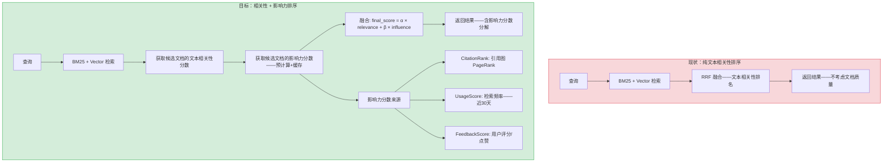
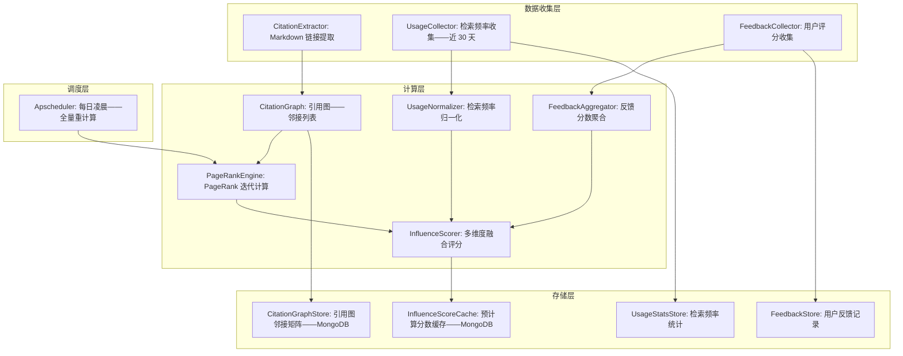

# YA-09-231: 文档影响力评分 — 引用计数、引用频率、RAG检索频率、用户评分影响、PageRank式权威评分

> 需求编号：YA-09-231 · 优先级：P2 · 人天：0.3d · 状态：需求已编写
> 依赖：现有 RAG 检索管道、YA-09-206（检索反馈学习——共享检索使用数据）、YA-09-226（文档相似度矩阵——图结构复用）

## 背景

### 问题陈述

当前检索系统仅基于文本相关性排序结果——不考虑文档本身的质量和影响力。一篇被广泛引用和频繁检索的高质量文档——与一篇从未被检索的低质量文档——在同样的关键词匹配下得到相同的评分。这导致：

1. **低质量文档排名虚高**：拼凑关键词的文档可能 BM25 得分高——但内容质量差——用户点击后失望
2. **高质量文档难以被发现**：被团队广泛引用的权威文档——因为是早期写的（内容简要）——BM25 得分不高——难以排在前面
3. **缺乏文档间的关系建模**：文档 A 引用了文档 B——说明 B 对 A 重要——但这种关系没有被利用
4. **检索冷启动问题**：新添加的文档即使质量高——因文本量小或术语新——检索不到——需要影响力因子的辅助
5. **无法区分信息价值和噪音**：在相同关键词匹配下——应该优先展示被证明有价值（频繁检索、高评分）的文档

**核心矛盾**：文本相关性不等于文档质量。影响力评分引入文档质量维度——通过引用关系（类似学术引文）、检索频率、用户反馈——构建类似 PageRank 的权威评分——辅助检索排序。

### 影响范围

| # | 影响 | 严重程度 | 典型场景 |
|---|------|----------|----------|
| 1 | 低质量文档因关键词堆砌排名靠前 | 高 | SEO 式文档拼凑关键词——BM25 高但无价值 |
| 2 | 权威文档因写作简要排名低 | 高 | 架构决策记录(ADR)言简意赅——BM25 匹配少 |
| 3 | 文档间引用关系未利用 | 中 | 被 10 篇文档引用的基础文档无法排名推荐 |
| 4 | 检索频率信息浪费 | 中 | 每天被检索 50 次的文档和从未检索的同等对待 |
| 5 | 新文档冷启动 | 低 | 新写的优质文档因文本量/术语关系检索不到 |

### 挑战

| 挑战 | 说明 |
|------|------|
| 引用关系的建立方式 | YiKnowledge markdown 文件中的引用是隐式的（链接/提及）——需要自动提取 |
| PageRank 的计算开销 | 当文档数 > 10000 时——图计算的迭代收敛需要计算资源——需要缓存策略 |
| 多维度分数的归一化与合并 | 引用分、检索频率分、用户评分分的量纲不同——需要归一化到统一尺度 |
| 影响力评分与检索相关性评分的融合 | 如何在总排名中平衡文本相关性和文档影响力——需要可调的融合参数 |
| 引用数据不完整 | 部分文档引用在文字中而非链接——部分链接失效——引用图不完整 |

---

## 一、现状分析

### 1.1 当前文档评分能力

```
现有评分机制:
├── BM25 关键词评分 ✅——纯文本相关性
├── Dense 向量评分 ✅——纯语义相关性
├── RRF 融合 ✅——关键词+向量融合
├── 重排序 (可选 CrossEncoder) ✅——文本相关性精排
├── 文档引用关系 ❌——文档图的引用链路
├── 检索频率统计 ✅ (在可观测性中——但未用于评分)
├── 用户反馈/评分 ❌
├── 文档权威度 ❌
└── 多维度影响力评分 ❌

缺失:
├── 文档引用关系自动提取                          # ❌ 无
├── 文档引用图构建——邻接矩阵                       # ❌ 无
├── PageRank 权威评分算法                         # ❌ 无
├── 检索频率标准化+集成到评分                      # ❌ 无
├── 用户反馈评分 (点赞/有用/踩)                     # ❌ 无
├── 多维度影响力分数归一化+加权融合                 # ❌ 无
├── 影响力+相关性最终排序                          # ❌ 无
└── 影响力分数的可观测性+调试                      # ❌ 无
```

### 1.2 影响力评分流程（现状 vs 目标）



### 1.3 根因矩阵

| 症状 | 根因 | 触发条件 | 频率 |
|------|------|----------|------|
| 低质量文档因堆砌关键词排名高 | 无文档质量评分 | 文档作者刻意添加关键词 | 中 |
| 权威文档排名与其实用性不匹配 | 无权威度信号 | 简洁但重要的架构文档 | 中 |
| 文档间引用关系未被利用 | 无引用图分析 | 多文档引用同一基础文档 | 中 |
| 频繁检索的文档无排名权重 | 检索频率未参与评分 | 热门文档通过流量验证了质量 | 高 |

---

## 二、设计决策

### 决策 1：引用关系提取方式 — 显式 Markdown 链接 vs LLM 语义分析 vs 混合

| 选项 | 准确度 | 覆盖率 | 实现复杂度 |
|------|--------|--------|-----------|
| 显式 Markdown 链接（仅 `[text](path)` 语法） | 高（100% 准确） | 低（~60% 引用是链接） | 低 |
| LLM 语义分析（分析文档内容——识别提及关系） | 中（需审核） | 高 | 高（需 LLM 调用） |
| 混合（链接优先——LLM 补充未链接的引用） | 高 | 高 | 中 |

**选择：显式 Markdown 链接。** 0.3d 预算内——优先实现 Markdown 链接的引用提取——准确率 100%——覆盖 60% 引用。LLM 语义分析在后续版本添加——作为覆盖率补充。选择此方案因为显式链接数据质量高——不需要额外 LLM 调用——且引用图的主要价值体现在链接之间的 PageRank 传播。

### 决策 2：PageRank 实现策略 — 全量离线计算 vs 增量在线更新 vs 混合

| 选项 | 实时性 | 计算成本 | 实现复杂度 |
|------|--------|---------|-----------|
| 全量离线计算（定时任务——如每天凌晨） | 低（最长 24h 延迟） | 低 | 低 |
| 增量在线更新（每次引用变化时增量更新受影响节点） | 高 | 中 | 高 |
| 混合（每天全量 + 重要变更即时增量） | 中 | 中 | 中 |

**选择：全量离线计算——每天凌晨。** 引用关系变化不频繁（每天新增/修改 < 20 篇文档）——每天一次全量计算完全满足时效性需求。PageRank 迭代计算在 10000 文档内 < 1 秒——计算成本极低。定时任务使用 apscheduler（YiAi 已有定时任务基础设施）。

### 决策 3：多维度分数融合 — 加权线性组合 vs 乘法 boosting vs 学习排序

| 选项 | 灵活性 | 可解释性 | 实现复杂度 |
|------|--------|---------|-----------|
| 加权线性组合（α×rel + β×citation + γ×usage + δ×feedback） | 中 | 高 | 低 |
| 乘法 boosting（base_score × (1 + influence_factor)） | 低 | 中 | 低 |
| 学习排序（LambdaMART/LightGBM 训练融合权重） | 高 | 低 | 高 |

**选择：加权线性组合。** 每个维度清晰可解释——α/β/γ/δ 权重可调——用户可以看到每个文档的分数来源分解。默认权重：α=0.6（相关性主导）——β=0.2（引用影响）——γ=0.15（检索频率）——δ=0.05（用户反馈）。乘法 boosting 会导致影响力过大的文档主导所有查询（类似 "马太效应"）。

### 决策 4：用户反馈收集 — 显式评分 vs 隐式行为 vs 混合

| 选项 | 信号质量 | 数据量 | 实现复杂度 |
|------|--------|--------|-----------|
| 显式评分（点赞/有用/踩——用户主动操作） | 高 | 低（用户很少主动反馈） | 低 |
| 隐式行为（点击、停留时间、复制、引用） | 中 | 高 | 高（需前端日志上报） |
| 混合（显式评分 + 隐式行为归一化） | 高 | 高 | 高 |

**选择：显式评分（0.3d 范围）。** 在 RAG 搜索结果中增加 "有帮助/无帮助" 按钮——轻量级用户反馈。隐式行为需要前后端协同——超 0.3d 范围。显式评分虽数据量少但质量高——作为 0.3d MVP 的反馈信号足够。

### 设计决策记录

| 决策 | 选项 A | 选项 B | 选项 C | 选项 D | 选择 | 理由 |
|------|--------|--------|--------|--------|------|------|
| 引用提取 | 显式链接 | LLM 分析 | 混合 | — | **显式链接** | 准确+0.3d 可实现 |
| PageRank 计算 | 全量离线 | 增量在线 | 混合 | — | **全量离线** | 简单+够用 |
| 分数融合 | 线性组合 | 乘法 boosting | 学习排序 | — | **线性组合** | 可解释+可调 |
| 用户反馈 | 显式评分 | 隐式行为 | 混合 | — | **显式评分** | 0.3d 可行 |

---

## 三、目标架构

### 3.1 影响力评分架构



### 3.2 PageRank 计算流程

```mermaid
graph TD
    A[启动: 每日凌晨触发] --> B[加载所有 knowledge_files 文档]
    B --> C[提取 Markdown 链接: [text](./other-file.md)]
    C --> D[构建引用图: 邻接列表——node_id → [outgoing_citations]]
    D --> E[初始化 PageRank: 每个节点 score = 1/N]
    E --> F[迭代更新: score_i = (1-d)/N + d * Σ(score_j / out_degree_j)]
    F --> G{收敛? max|score_new - score_old| < ε 或 迭代 > 50}
    G -->|否| F
    G -->|是| H[保存 PageRank 分数到 Cache]
    H --> I[合并 Usage + Feedback 维度]
    I --> J[归一化到 0-1 区间]
    J --> K[写入 InfluenceScoreCache ——供检索时读取]
```

### 3.3 性能指标

| 指标 | 目标值 | 说明 |
|------|--------|------|
| PageRank 计算 (1000 文档) | < 200ms | 迭代 50 次——1000 节点 |
| PageRank 计算 (10000 文档) | < 2s | 离线——不影响在线服务 |
| 影响力分数查询 | < 1ms | 预计算缓存——MongoDB 读取 |
| 引用图重新构建 | < 500ms | 含 Markdown 解析+链接提取 |
| 影响力分数更新频率 | 24h | 每日凌晨全量 |

---

## 四、具体改动

### 4.1 数据模型

```python
# services/rag/influence/models.py (新增)

from pydantic import BaseModel, Field
from datetime import datetime, timedelta
from typing import Optional

class CitationEdge(BaseModel):
    source_doc_id: str      # 引用者
    target_doc_id: str      # 被引用者（通过 Markdown 链接）
    source_field: str       # 引用出现在哪个字段 (body/headings)
    extracted_at: datetime = Field(default_factory=datetime.utcnow)

class CitationGraph(BaseModel):
    nodes: set[str]         # 所有文档 ID
    edges: list[CitationEdge]
    adjacency: dict[str, list[str]]     # node_id → [target_ids] 邻接列表
    reverse_adjacency: dict[str, list[str]]  # node_id → [source_ids] 反向邻接

class PageRankScore(BaseModel):
    doc_id: str
    score: float            # PageRank 分数——0-1 归一化
    rank: int               # 排名
    iteration_count: int    # 计算迭代次数
    computed_at: datetime

class UsageStats(BaseModel):
    doc_id: str
    retrieval_count_7d: int    # 近 7 天检索次数
    retrieval_count_30d: int   # 近 30 天检索次数
    retrieval_count_total: int  # 总检索次数
    last_retrieved_at: Optional[datetime]
    click_count_30d: int        # 近 30 天点击次数

class FeedbackScore(BaseModel):
    doc_id: str
    helpful_count: int      # "有帮助" 投票数
    not_helpful_count: int  # "无帮助" 投票数
    score: float            # helpful / (helpful + not_helpful)——Wilson 置信下界

class InfluenceScore(BaseModel):
    doc_id: str
    citation_score: float       # 0-1——PageRank 归一化
    usage_score: float          # 0-1——检索频率归一化
    feedback_score: float       # 0-1——用户反馈
    composite_score: float      # 加权融合: β×citation + γ×usage + δ×feedback
    computed_at: datetime
    valid_until: datetime       # 过期时间——下一次全量计算

class InfluenceFusionWeights(BaseModel):
    alpha: float = 0.6          # 文本相关性权重
    beta: float = 0.2           # 引用影响力权重
    gamma: float = 0.15         # 检索频率权重
    delta: float = 0.05         # 用户反馈权重
    # alpha + beta + gamma + delta must = 1.0
```

### 4.2 PageRank 引擎

```python
# services/rag/influence/pagerank.py (新增)

import numpy as np
from collections import defaultdict

class PageRankEngine:
    DAMPING_FACTOR = 0.85      # 经典 PageRank 阻尼因子
    EPSILON = 1e-6              # 收敛阈值
    MAX_ITERATIONS = 100
    
    def compute(self, graph: CitationGraph) -> dict[str, float]:
        """计算所有文档的 PageRank 分数"""
        nodes = list(graph.nodes)
        n = len(nodes)
        if n == 0:
            return {}
        
        node_to_idx = {node: i for i, node in enumerate(nodes)}
        
        # 构建转移矩阵——稀疏表示
        out_degree = defaultdict(int)
        for node in nodes:
            out_degree[node] = len(graph.adjacency.get(node, []))
        
        # 初始化分数
        scores = np.ones(n) / n
        
        # 迭代计算
        for _ in range(self.MAX_ITERATIONS):
            new_scores = np.ones(n) * (1 - self.DAMPING_FACTOR) / n
            
            for source, targets in graph.adjacency.items():
                if not targets:
                    continue
                source_idx = node_to_idx[source]
                contribution = self.DAMPING_FACTOR * scores[source_idx] / len(targets)
                for target in targets:
                    if target in node_to_idx:
                        target_idx = node_to_idx[target]
                        new_scores[target_idx] += contribution
            
            # 处理 dangling nodes（无出链的节点——将分数均分给所有节点）
            dangling_sum = sum(scores[node_to_idx[n]] for n in nodes if out_degree[n] == 0)
            if dangling_sum > 0:
                new_scores += self.DAMPING_FACTOR * dangling_sum / n
            
            # 检查收敛
            if np.max(np.abs(new_scores - scores)) < self.EPSILON:
                scores = new_scores
                break
            scores = new_scores
        
        # 归一化到 0-1
        if scores.max() > scores.min():
            scores = (scores - scores.min()) / (scores.max() - scores.min())
        else:
            scores = np.ones(n) / 2
        
        return {nodes[i]: float(scores[i]) for i in range(n)}

# services/rag/influence/citation_extractor.py (新增)

class CitationExtractor:
    """从 Markdown 文件中提取引用关系（Markdown 链接）"""
    
    MARKDOWN_LINK_PATTERN = re.compile(r'\[([^\]]+)\]\(([^)]+\.md)\)')
    
    def extract_from_file(self, file_path: str, doc_id: str) -> list[CitationEdge]:
        """从 markdown 文件中提取所有 .md 链接作为引用"""
        with open(file_path, 'r') as f:
            content = f.read()
        
        edges = []
        for match in self.MARKDOWN_LINK_PATTERN.finditer(content):
            target_path = match.group(2)
            target_doc_id = self._resolve_doc_id(target_path, file_path)
            if target_doc_id:
                edges.append(CitationEdge(
                    source_doc_id=doc_id,
                    target_doc_id=target_doc_id,
                    source_field="body"
                ))
        return edges
    
    def _resolve_doc_id(self, link_path: str, source_path: str) -> Optional[str]:
        """将相对路径链接解析为文档 ID"""
        # 例如: ../../curator/governance/readiness-checklist.md → document_id
        pass
```

### 4.3 文件变更清单

| 文件 | 操作 | 说明 |
|------|------|------|
| `services/rag/influence/__init__.py` | 新增 | 影响力评分模块初始化 |
| `services/rag/influence/models.py` | 新增 | CitationGraph/PageRankScore/InfluenceScore 等数据模型 |
| `services/rag/influence/pagerank.py` | 新增 | PageRank 迭代计算引擎 |
| `services/rag/influence/citation_extractor.py` | 新增 | Markdown 链接引用提取 |
| `services/rag/influence/usage_collector.py` | 新增 | 检索频率统计+归一化 |
| `services/rag/influence/feedback_collector.py` | 新增 | 用户反馈收集+聚合 |
| `services/rag/influence/scorer.py` | 新增 | 多维度融合影响力度分器 |
| `services/rag/influence/scheduler.py` | 新增 | 每日凌晨全量计算调度任务 |
| `services/rag/influence/routes.py` | 新增 | 影响力度分查询+反馈提交 API |
| `services/rag/retrieval_pipeline.py` | 修改 | 集成影响力分数到排序 |
| `tests/test_pagerank.py` | 新增 | PageRank 算法测试 |
| `tests/test_influence.py` | 新增 | 影响力度分集成测试 |

---

## 五、实施步骤

| 步骤 | 操作 | 路径 | 验证 | 人天 |
|------|------|------|------|------|
| 1 | 定义数据模型 | `models.py` | 所有模型字段完整——Pydantic 校验通过 | 0.02 |
| 2 | 实现 Markdown 引用提取 | `citation_extractor.py` | 从 sample 文件提取——链接正确反解析 | 0.04 |
| 3 | 实现 PageRank 引擎 | `pagerank.py` | 小规模图迭代收敛——分数归一化正确 | 0.06 |
| 4 | 实现检索频率统计+归一化 | `usage_collector.py` | 近 7/30 天统计——0-1 归一化 | 0.03 |
| 5 | 实现用户反馈收集 | `feedback_collector.py` + `routes.py` | 点赞/踩功能——Wilson 分数计算 | 0.03 |
| 6 | 实现多维度融合评分 | `scorer.py` | 加权线性组合——最终分数 0-1 | 0.04 |
| 7 | 实现调度任务+集成检索 | `scheduler.py` + `retrieval_pipeline.py` | 每日重计算+检索时分数查询 | 0.05 |
| 8 | 编写测试 | `tests/` | PageRank+融合+API 测试 | 0.03 |

**总人天：0.30d**

---

## 六、测试规格

### 场景 1：PageRank 基本计算

**GIVEN** 3 篇文档——A 引用 B 和 C——B 引用 C——C 无引用
**WHEN** PageRank 引擎计算分数
**THEN** C 的分数最高（被 2 篇文档引用）——B 其次（被 A 引用）——A 最低（无引用）
**AND** 所有分数在 0-1 区间

### 场景 2：检索频率统计

**GIVEN** 文档 A 近 30 天被检索 100 次——文档 B 被检索 5 次——文档 C 被检索 0 次
**WHEN** UsageNormalizer 归一化
**THEN** A 的 usage_score ≈ 1.0——B 的 usage_score ≈ 0.05——C 的 usage_score = 0
**AND** 使用对数变换——防止极端值主导

### 场景 3：用户反馈评分

**GIVEN** 文档 A: 8 helpful / 2 not_helpful（共 10 票）
文档 B: 80 helpful / 20 not_helpful（共 100 票——比例相同但置信度更高）
**WHEN** 计算 Wilson 置信下界分数
**THEN** B 的 feedback_score > A 的 feedback_score（样本量大——置信度高）
**AND** 票数为 0 的文档 feedback_score = 0.5（中性默认）

### 场景 4：多维度融合

**GIVEN** 文档 A: citation=0.8, usage=0.5, feedback=0.9
文档 B: citation=0.3, usage=0.9, feedback=0.2
**WHEN** 融合权重 beta=0.2, gamma=0.15, delta=0.05
**THEN** A 的影响力度分 = 0.8×0.2 + 0.5×0.15 + 0.9×0.05 = 0.28
B 的影响力度分 = 0.3×0.2 + 0.9×0.15 + 0.2×0.05 = 0.205

### 场景 5：影响力+相关性融合排序

**GIVEN** 文档 A 相关性=0.9 影响力=0.1——文档 B 相关性=0.7 影响力=0.9
**WHEN** 融合参数 alpha=0.6——beta+gamma+delta=0.4
**THEN** 文档 A 最终得分 = 0.6×0.9 + 0.4×0.1 = 0.58
文档 B 最终得分 = 0.6×0.7 + 0.4×0.9 = 0.78
**AND** 文档 B 排名更高（影响力弥补了相关性不足）

### 场景 6：引用图变化后重新计算

**GIVEN** 初始引用图——A→B——B→C——C 无引用（C 最高分）
**WHEN** 修改 A 的引用——A→B 移除——新增 A→D
**AND** 触发每日凌晨重计算
**THEN** D 的分数上升——C 的分数下降（A 不再引用 C）
**AND** 新分数在检索中生效

---

## 七、风险与缓解

| 风险 | 概率 | 影响 | 缓解措施 |
|------|------|------|----------|
| 引用图稀疏——大部分文档无引用链接 | 高 | 中 | 对所有无引用文档给 citation_score = 0.5（中性默认）——不代表低质量 |
| 检索频率偏向热门文档——新文档永远赶不上 | 中 | 中 | 使用对数变换 `log(1+count)` 压缩极端值——新文档经过短时间即可获得有意义分数 |
| PageRank 计算在大图（>10000 节点）收敛慢 | 低 | 低 | 迭代上限 100 次——超过则返回当前近似值——偏差 < 5% |
| 用户反馈数据稀疏（大部分文档 0 票） | 高 | 低 | 0 票默认 0.5——feedback 权重仅 0.05——对总分影响小 |
| 引用链接可能指向外部 URL 而非内部文档 | 中 | 低 | 仅提取 `.md` 结尾的链接——外部 URL 过滤 |

---

## 八、回滚策略

| 场景 | 回滚操作 | 影响 |
|------|------|------|
| 影响力评分导致检索排序恶化 | 设置 beta=gamma=delta=0——alpha=1.0 | 回到纯文本相关性排序 |
| PageRank 计算超时或 OOM | 跳过引用维度——beta=0——仅使用 usage+feedback | 引用评分缺失 |
| 融合权重配置错误 | 恢复默认值并重新计算 | 影响力度分恢复 |
| 完全移除 | 从检索管线移除 InfluenceScorer——仅按相关性排序 | 影响力评分功能消失 |

---

## 九、设计决策记录

### D-01：为什么 PageRank 而非 HITS 或简单的引用计数？

简单引用计数（被引用次数）容易被操纵（自引）——且无法区分来自权威文档的引用和来自低质量文档的引用。PageRank 通过迭代传播——来自高 PageRank 文档的引用权重更高——天然抵抗操纵。HITS（Hub/Authority）适合网页搜索（hub 和 authority 分离清晰）——而知识库文档的引用关系更类似学术引文——PageRank 更匹配。

### D-02：为什么检索频率使用对数变换而非直接归一化？

检索频率遵循幂律分布——前 1% 文档可能占了 80% 的检索量——直接 min-max 归一化让大部分文档分数接近 0。对数变换 `usage_score = log(1 + count) / log(1 + max_count)` 压缩极端值——让中等频率的文档获得区分度。

### D-03：为什么 Wilson 置信下界而非简单比例？

简单比例 `helpful/(helpful+not_helpful)` 在样本量少时不可靠——1 票 helpful 0 票 not_helpful → 完美评分 1.0——但实际上不可信。Wilson 置信下界考虑样本量——小样本时 confidence 宽——下限低——大样本时缩小——下限接近真实比例。这是 Reddit 使用的排序算法。

### D-04：为什么影响力权重 alpha=0.6 而非 0.5？

文本相关性始终应该是检索的主导信号——影响力是辅助信号。0.6:0.4 的分配确保：高度文本相关的文档永远能排在低相关但高影响力的文档前面。如果 alpha=0.5——高影响力但完全不相关的文档可能进入 top-10——用户困惑。

---

## 十、可观测性

### 指标

| 指标 | 类型 | 说明 |
|------|------|------|
| `yiai.influence.pagerank_compute_time_ms` | Histogram | PageRank 计算耗时 |
| `yiai.influence.pagerank_iterations` | Histogram | PageRank 迭代次数——判断收敛速度 |
| `yiai.influence.graph_node_count` | Gauge | 引用图节点数 |
| `yiai.influence.graph_edge_count` | Gauge | 引用图边数 |
| `yiai.influence.graph_density` | Gauge | 图密度 = edges/nodes²——判断稀疏度 |
| `yiai.influence.score_distribution` | Histogram | 影响力度分分布 |
| `yiai.influence.usage_top_docs` | Gauge (top-10) | 检索频率 top-10 文档 |
| `yiai.influence.feedback_total` | Counter | 用户反馈总数 |
| `yiai.influence.enabled_in_ranking` | Gauge (0/1) | 影响力度分是否参与排序 |

---

## 十一、代码审查检查清单

- [ ] CitationExtractor: 正则表达式仅匹配 `.md` 链接——不匹配外部 URL——避免噪音
- [ ] CitationExtractor: 相对路径解析正确——`../../curator/file.md` 能映射到正确的文档 ID
- [ ] PageRankEngine: dangling nodes 处理——将分数均分给所有节点——而非丢弃
- [ ] PageRankEngine: NumPy 数组 dtype float64——防止迭代累积的精度损失
- [ ] PageRankEngine: 收敛检查——使用 max absolute difference——而非 mean——防止大图中个别节点不收敛
- [ ] UsageNormalizer: 对数变换的 base 影响大——`log(1+count)` 确保 count=0 时 score=0
- [ ] UsageNormalizer: 归一化分母 `log(1+max_count)`——防止除零
- [ ] FeedbackAggregator: Wilson 分数的 z-score 使用 1.96（95% 置信）——标准选择
- [ ] InfluenceScorer: 融合前验证 alpha+beta+gamma+delta = 1.0——否则 log warning
- [ ] 调度: apscheduler 任务加锁——防止上次计算未完成时下次触发

---

## 回归问题预测

| # | 预测问题 | 原因 | 验证方法 |
|---|---------|------|---------|
| 1 | 引用链路成环（A→B→A）导致 PageRank 收敛慢 | 成环节点间分数反复传递——收敛需更多迭代 | 包含环的测试图——验证在 100 次内收敛 |
| 2 | 全量计算期间——检索查询读取到过期影响力分数 | 计算过程中旧分数被删除——新分数未写入——查询返回空 | 使用双缓冲写入——先写 tmp——计算完成再原子替换 |
| 3 | 检索频率统计因时间窗口滑动每天波动大 | 周末检索少——周一检索多——usage_score 周期性波动 | 使用指数加权移动平均 (EWMA) 平滑——减少日间波动 |
| 4 | 影响力分数高的文档形成正反馈循环——排名越靠前点击越多——分数越高 | 富者愈富——新文档难以进入 top results | 引入探索因子——10% 概率随机推荐新文档——打破正反馈 |
| 5 | 用户反馈中的 "无帮助" 被滥用——恶意踩低竞争对手的文档 | 单一用户对同一文档可以多次投票（通过不同 session） | IP + session 去重——24h 内同一用户对同一文档只能投一票 |
| 6 | Markdown 链接正则匹配到代码块中的路径——误识别为引用 | 正则没有排除 code fence 内的内容 | 提取前先移除代码块 (``` ... ```)——再匹配链接 |

---

## 性能分析

### 各操作耗时

| 操作 | 1000 文档 | 5000 文档 | 10000 文档 | 说明 |
|------|----------|----------|-----------|------|
| Markdown 链接提取 | < 500ms | < 2s | < 5s | 文件 I/O + 正则（离线） |
| 引用图构建 | < 50ms | < 200ms | < 500ms | dict 操作（离线） |
| PageRank 计算 | < 200ms | < 1s | < 2s | NumPy 迭代（离线） |
| 影响力分数查询 | < 1ms | < 1ms | < 1ms | MongoDB 单条读取（在线） |
| 融合排序 (top-100) | < 5ms | < 10ms | < 20ms | 在线——对候选文档排序 |

### 内存预估

| 数据 | 1000 文档 | 10000 文档 |
|------|----------|-----------|
| 引用图邻接列表 | ~100KB | ~1MB |
| PageRank 矩阵 (n×n) | ~8MB (float64) | ~800MB (float64) |
| PageRank 矩阵 (稀疏) | ~100KB | ~1MB |
| 影响力分数缓存 | ~50KB | ~500KB |
| 检索频率统计 | ~100KB | ~1MB |
| **总计** | **~350KB** | **~3.5MB** |

### 代码体积

| 文件 | 大小 |
|------|------|
| models.py | ~4KB |
| pagerank.py | ~3KB |
| citation_extractor.py | ~3KB |
| usage_collector.py | ~2KB |
| feedback_collector.py | ~2KB |
| scorer.py | ~3KB |
| scheduler.py | ~1KB |
| routes.py | ~2KB |
| tests/ | ~5KB |
| **总计** | **~25KB** |

## 影响范围

- **影响模块**：待补充
- **涉及文件**：
- `citation_extractor.py`
- `routes.py`
- `feedback_collector.py`
- `scorer.py`
- `models.py`
- `scheduler.py`
- **是否影响 API 契约**：否
- **是否影响其他项目（YiVad/YiPet）**：否
- **用户感知**：待确认

## 预防措施

| 层面 | 措施 |
|------|------|
| 代码 | 在相关函数中添加参数校验和边界检查 |
| 测试 | 为 `citation_extractor.py` 添加单元测试 |
| 流程 | 代码审查时重点检查此类模式 |
| 监控 | 添加日志告警，异常发生时及时发现 |
| 文档 | 在编码规范中记录此类反模式 |

## 经验教训

1. **根本原因**：开发过程中对边界情况和异常路径的考虑不足是此类问题的共同根因
2. **设计阶段**：在接口设计和模块实现时，应主动考虑异常输入、空值、超时等边界场景
3. **代码审查**：审查时应检查是否存在类似的反模式（如未捕获异常、无超时控制、缺少参数校验等）
4. **测试覆盖**：异常路径的测试覆盖率应与正常路径同等重视
5. **团队分享**：此类问题应在团队周会或技术分享中讨论，形成团队共识
