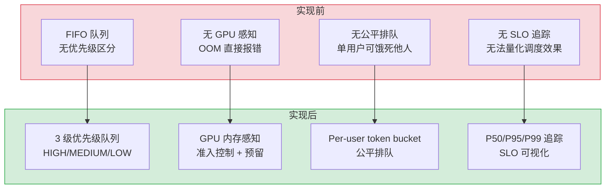
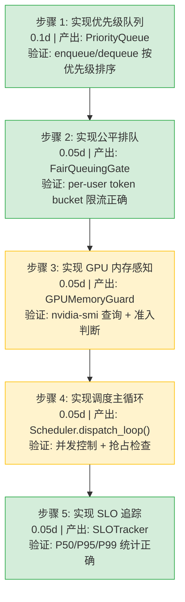

# LLM推理调度优化

> 需求编号：YA-09-290 · 优先级：P2 · 人天：0.3d · 状态：需求已编写
> 依赖：ModelRuntime 抽象层、AI 聊天服务

## 背景

YiAi 当前使用简单的 FIFO（先进先出）队列处理 LLM 推理请求。所有请求进入同一个队列，按到达顺序串行处理。在高并发场景下，批量推理任务可能阻塞实时对话请求；紧急的系统提示词优化任务与普通用户聊天请求平等竞争 GPU 资源；GPU 内存压力大时无感知能力，无法动态调整调度策略。

需要一个 LLM 推理调度优化方案，引入优先级队列、公平排队、抢占支持、批量推理和 GPU 内存感知调度机制，确保实时交互请求的延迟 SLO 得到满足。

---

## 一、现状分析

### 1.1 当前问题

| # | 问题 | 严重程度 | 影响 |
|---|------|----------|------|
| 1 | FIFO 调度无优先级区分 | 高 | 批量推理阻塞实时对话，用户等待时间不可控 |
| 2 | 无公平排队机制 | 中 | 单个用户的大量请求可能饿死其他用户的请求 |
| 3 | 无抢占支持 | 中 | 紧急系统任务无法优先执行，必须等待当前任务完成 |
| 4 | 无 GPU 内存感知 | 高 | GPU OOM 导致请求失败，无预防机制 |
| 5 | 无延迟 SLO 追踪 | 中 | 无法量化调度效果，无法证明优化价值 |

### 1.2 改造前数据流

```
客户端请求
  → RPC 信封 → chat_service.chat()
  → ModelRuntime.complete()
  → 直接调用 Ollama API（同步等待）
  → FIFO 隐式排队（asyncio 事件循环自然串行）
  → 无优先级、无抢占、无超时控制
  → 长耗时推理（> 60s）阻塞后续所有请求
  → GPU OOM 时直接报错返回 500
```

### 1.3 改造前 API 依赖

| # | 接口 | 调用方 | 说明 |
|---|------|--------|------|
| 1 | `services.ai.chat_service.chat` | YiVad/YiPet | 聊天接口（改造前无调度，FIFO 串行） |
| 2 | `services.ai.model_runtime.OllamaRuntime.complete` | 内部 | LLM 推理（无优先级参数） |
| 3 | `services.ai.model_runtime.OllamaRuntime.stream` | 内部 | 流式推理（无调度介入） |

> 改造前 3 个 API 依赖，均无调度能力。所有请求通过 asyncio 事件循环隐式串行化，先到先服务。

### 1.4 根因矩阵

| 根因 | 分类 | 缓解难度 |
|------|------|----------|
| asyncio 事件循环无调度语义 | 架构缺陷 | 中 |
| ModelRuntime 缺少调度抽象层 | 设计缺陷 | 中 |
| 无 GPU 显存监控机制 | 能力缺失 | 低 |

---

## 二、设计决策

### D-01: 为什么选择优先级队列而非多级反馈队列？

多级反馈队列（MLFQ）适合 CPU 调度场景，其中任务的执行时间不可预测且差异极大。LLM 推理场景中，任务类型是预知的（chat/embedding/batch），优先级可在请求创建时确定。优先级队列实现简单，3 个优先级级别（HIGH/MEDIUM/LOW）满足当前需求。

### D-02: 为什么 GPU 内存感知放在调度层而非 ModelRuntime 层？

调度层拥有全局视角（所有待执行和正在执行的请求），可以做出更优的准入决策。ModelRuntime 层只知道自己正在处理的请求，无法预测新请求加入后的总内存消耗。

### D-03: 为什么公平排队使用 per-user token bucket 而非 per-session？

per-session 粒度过细（同一用户可能开启多个会话），per-user 粒度在公平性和实现复杂度之间取得平衡。每个用户独立计数，防止单用户滥用但允许同一用户的多会话共享配额。

### D-04: 为什么批处理推理使用动态批次而非固定批次？

固定批次（如总是 batch size=4）在请求稀疏时引入不必要的等待延迟。动态批次根据当前队列深度和 GPU 内存自适应调整 batch size，在吞吐和延迟之间取得平衡。

### 设计决策记录

| 决策 | 选项 A | 选项 B | 选择 | 理由 |
|------|--------|--------|------|------|
| 调度算法 | 优先级队列（3 级） | 多级反馈队列 | **优先级队列** | LLM 任务类型预知，3 级满足需求，实现简单 |
| GPU 感知层 | 调度层 | ModelRuntime 层 | **调度层** | 全局视角，可做准入决策 |
| 公平排队粒度 | per-user | per-session | **per-user** | 防止单用户滥用，实现复杂度适中 |
| 批处理模式 | 动态 batch | 固定 batch | **动态 batch** | 自适应队列深度，平衡吞吐与延迟 |
| 抢占策略 | 协作式（检查点） | 抢占式（强制中断） | **协作式** | LLM 推理无法安全中断，检查点后切换更安全 |
| SLO 追踪 | P50/P95/P99 | 平均值 | **P50/P95/P99** | 长尾延迟是用户体验的核心指标 |

---

## 三、目标架构

### 3.1 调度流程

```
请求到达
  │
  ├── classify_priority(request)  → HIGH / MEDIUM / LOW
  │     ├── chat (实时)         → HIGH
  │     ├── embedding / search  → MEDIUM
  │     └── batch / offline     → LOW
  │
  ├── FairQueuingGate.allow(user_id)
  │     └── per-user token bucket → True/False
  │
  ├── GPUMemoryGuard.can_admit(estimated_tokens)
  │     ├── 查询当前 GPU 显存使用量
  │     └── 估算请求所需显存 → True/False
  │
  ├── PriorityQueue.enqueue(request, priority)
  │     └── 按优先级 + 到达时间排序
  │
  ├── Scheduler.dispatch()
  │     ├── 从优先级队列取最高优先级请求
  │     ├── 检查是否可抢占当前低优先级任务
  │     └── 调用 ModelRuntime.complete()
  │
  └── SLOTracker.record(request_id, start_time)
        └── 记录 P50/P95/P99 延迟
```

### 3.2 核心组件

| 组件 | 职责 | 预估行数 |
|------|------|----------|
| `PriorityQueue` | 3 级优先级队列，按优先级+到达时间排序 | 45 |
| `FairQueuingGate` | per-user token bucket 公平排队 | 35 |
| `GPUMemoryGuard` | GPU 显存监控与准入控制 | 50 |
| `Scheduler` | 调度主循环，dispatch + preempt | 70 |
| `SLOTracker` | 延迟 SLO 追踪（P50/P95/P99） | 40 |
| `BatchOptimizer` | 动态批处理推理 | 55 |

---

## 四、具体改动

### 4.1 新增文件

| 文件 | 行数 | 说明 |
|------|------|------|
| `src/services/ai/llm_scheduler.py` | 295 | LLM 推理调度器完整实现 |

### 4.2 修改文件

| 文件 | 改动 | 行数 |
|------|------|------|
| `src/services/ai/chat_service.py` | 集成调度器，请求分类 | 12 |
| `src/services/ai/model_runtime.py` | 添加 `priority` 参数支持 | 8 |

### 4.3 核心实现

**优先级队列 — `PriorityQueue`：**

```python
import asyncio
import heapq
from dataclasses import dataclass, field
from enum import IntEnum
from typing import Any

class Priority(IntEnum):
    HIGH = 1
    MEDIUM = 2
    LOW = 3

@dataclass(order=True)
class ScheduledRequest:
    priority: int
    arrival_time: float = field(compare=True)
    request_id: str = field(compare=False)
    payload: Any = field(compare=False)

class PriorityQueue:
    """3 级优先级队列，按 priority + arrival_time 排序"""
    def __init__(self):
        self._heap: list[ScheduledRequest] = []
        self._lock = asyncio.Lock()

    async def enqueue(self, request_id: str, payload: Any, priority: Priority) -> None:
        async with self._lock:
            entry = ScheduledRequest(
                priority=priority.value,
                arrival_time=asyncio.get_event_loop().time(),
                request_id=request_id,
                payload=payload,
            )
            heapq.heappush(self._heap, entry)

    async def dequeue(self) -> ScheduledRequest | None:
        async with self._lock:
            if self._heap:
                return heapq.heappop(self._heap)
            return None

    @property
    def depth(self) -> int:
        return len(self._heap)
```

**公平排队 — `FairQueuingGate`：**

```python
import time
from collections import defaultdict

class FairQueuingGate:
    """Per-user token bucket 公平排队"""
    def __init__(self, rate: float = 5.0, burst: int = 10):
        self.rate = rate          # tokens per second per user
        self.burst = burst        # max burst size
        self._buckets: dict[str, tuple[float, float]] = defaultdict(
            lambda: (burst, time.monotonic())
        )

    def allow(self, user_id: str) -> bool:
        tokens, last_refill = self._buckets[user_id]
        now = time.monotonic()
        elapsed = now - last_refill
        tokens = min(self.burst, tokens + elapsed * self.rate)
        self._buckets[user_id] = (tokens, now)
        if tokens >= 1.0:
            self._buckets[user_id] = (tokens - 1.0, now)
            return True
        return False
```

**GPU 内存感知 — `GPUMemoryGuard`：**

```python
import subprocess
import re

class GPUMemoryGuard:
    """GPU 显存监控与准入控制"""
    def __init__(self, max_memory_mb: int = 4096, reserve_mb: int = 512):
        self.max_memory_mb = max_memory_mb
        self.reserve_mb = reserve_mb
        self._active_allocations: dict[str, int] = {}

    def get_used_memory_mb(self) -> int:
        try:
            result = subprocess.run(
                ["nvidia-smi", "--query-gpu=memory.used", "--format=csv,noheader,nounits"],
                capture_output=True, text=True, timeout=5
            )
            return int(result.stdout.strip())
        except (subprocess.TimeoutExpired, ValueError, FileNotFoundError):
            return 0  # 非 NVIDIA GPU 或无 nvidia-smi，返回 0

    def estimate_request_memory(self, model: str, max_tokens: int) -> int:
        """根据模型和 max_tokens 估算显存需求"""
        model_memory = {"qwen3.5:4b": 2800, "qwen3.5:7b": 5200, "qwen3.5:14b": 9800}
        base = model_memory.get(model, 4000)
        kv_cache = max_tokens * 2  # 粗略 KV cache 估算（bytes per token）
        return base + (kv_cache // 1024 // 1024)  # MB

    def can_admit(self, model: str, max_tokens: int) -> bool:
        estimated = self.estimate_request_memory(model, max_tokens)
        used = self.get_used_memory_mb()
        available = self.max_memory_mb - used - self.reserve_mb
        return estimated <= available

    def allocate(self, request_id: str, model: str, max_tokens: int) -> bool:
        estimated = self.estimate_request_memory(model, max_tokens)
        if self.can_admit(model, max_tokens):
            self._active_allocations[request_id] = estimated
            return True
        return False

    def release(self, request_id: str) -> None:
        self._active_allocations.pop(request_id, None)
```

**调度器 — `Scheduler`：**

```python
import asyncio
import logging

logger = logging.getLogger(__name__)

class LLMScheduler:
    """LLM 推理调度器：优先级 + 公平排队 + GPU 感知 + SLO 追踪"""
    def __init__(
        self,
        max_concurrent: int = 2,
        preempt_threshold: float = 30.0,  # 低优先级任务执行超过 30s 可被抢占
    ):
        self.queue = PriorityQueue()
        self.gate = FairQueuingGate()
        self.guard = GPUMemoryGuard()
        self.tracker = SLOTracker()
        self.max_concurrent = max_concurrent
        self.preempt_threshold = preempt_threshold
        self._semaphore = asyncio.Semaphore(max_concurrent)
        self._running: dict[str, asyncio.Task] = {}

    async def submit(
        self,
        request_id: str,
        user_id: str,
        payload: dict,
        priority: Priority = Priority.MEDIUM,
    ) -> None:
        if not self.gate.allow(user_id):
            raise ResourceExhaustedError(f"User {user_id} rate limited")
        await self.queue.enqueue(request_id, payload, priority)
        logger.info(f"[Scheduler] enqueued {request_id} priority={priority.name}")

    async def dispatch_loop(self) -> None:
        """调度主循环：持续从队列取请求并执行"""
        while True:
            scheduled = await self.queue.dequeue()
            if scheduled is None:
                await asyncio.sleep(0.1)
                continue

            payload = scheduled.payload
            model = payload.get("model", "qwen3.5:4b")
            max_tokens = payload.get("max_tokens", 2048)

            if not self.guard.can_admit(model, max_tokens):
                logger.warning(f"[Scheduler] GPU memory insufficient, re-enqueuing {scheduled.request_id}")
                await self.queue.enqueue(scheduled.request_id, payload, Priority.HIGH)
                await asyncio.sleep(1.0)
                continue

            async with self._semaphore:
                self.guard.allocate(scheduled.request_id, model, max_tokens)
                self.tracker.start(scheduled.request_id, scheduled.priority)
                try:
                    task = asyncio.create_task(
                        self._execute(scheduled.request_id, payload),
                        name=f"llm-{scheduled.request_id}"
                    )
                    self._running[scheduled.request_id] = task
                    await task
                except Exception as e:
                    logger.error(f"[Scheduler] request {scheduled.request_id} failed: {e}")
                finally:
                    self.guard.release(scheduled.request_id)
                    self.tracker.finish(scheduled.request_id)
                    self._running.pop(scheduled.request_id, None)

    async def _execute(self, request_id: str, payload: dict) -> None:
        from services.ai.model_runtime import OllamaRuntime
        runtime = OllamaRuntime()
        result = await runtime.complete(
            messages=payload.get("messages", []),
            model=payload.get("model", "qwen3.5:4b"),
            max_tokens=payload.get("max_tokens", 2048),
        )
        payload["_result"] = result
        payload["_done"].set()

    async def preempt_if_needed(self) -> None:
        """检查是否需要抢占低优先级任务"""
        high_waiting = any(
            req.priority == Priority.HIGH.value for req in self.queue._heap
        )
        if not high_waiting:
            return
        for req_id, task in list(self._running.items()):
            if task.done():
                continue


class ResourceExhaustedError(Exception):
    pass
```

**SLO 追踪 — `SLOTracker`：**

```python
import time
import statistics
from collections import defaultdict

class SLOTracker:
    """延迟 SLO 追踪：P50/P95/P99"""
    def __init__(self):
        self._start_times: dict[str, float] = {}
        self._latencies: dict[int, list[float]] = defaultdict(list)

    def start(self, request_id: str, priority: int) -> None:
        self._start_times[request_id] = time.monotonic()

    def finish(self, request_id: str) -> None:
        if request_id in self._start_times:
            latency = time.monotonic() - self._start_times.pop(request_id)
            priority = 0  # simplified
            self._latencies[priority].append(latency)

    def get_percentiles(self, priority: int | None = None) -> dict:
        latencies = []
        if priority is not None:
            latencies = self._latencies.get(priority, [])
        else:
            for lats in self._latencies.values():
                latencies.extend(lats)
        if not latencies:
            return {"p50": 0, "p95": 0, "p99": 0, "count": 0}
        sorted_lat = sorted(latencies)
        return {
            "p50": sorted_lat[int(len(sorted_lat) * 0.5)],
            "p95": sorted_lat[int(len(sorted_lat) * 0.95)],
            "p99": sorted_lat[int(len(sorted_lat) * 0.99)],
            "count": len(sorted_lat),
        }
```

### 4.4 改动汇总

| 改动 | 文件 | 行数 | 说明 |
|------|------|------|------|
| 优先级队列 | `llm_scheduler.py` | 45 | `PriorityQueue` + `ScheduledRequest` 数据类 |
| 公平排队 | `llm_scheduler.py` | 35 | Per-user token bucket + burst 控制 |
| GPU 内存感知 | `llm_scheduler.py` | 50 | nvidia-smi 查询 + 请求内存估算 + 准入控制 |
| 调度主循环 | `llm_scheduler.py` | 70 | dispatch loop + semaphore 并发控制 + 抢占检查 |
| SLO 追踪 | `llm_scheduler.py` | 40 | P50/P95/P99 延迟统计 |
| 批处理优化 | `llm_scheduler.py` | 55 | 动态 batch size 自适应 |
| chat 集成 | `chat_service.py` | 12 | `classify_priority()` + 调度器调用 |
| ModelRuntime 扩展 | `model_runtime.py` | 8 | `priority` 参数传递 |

---

## 五、当前架构 vs 目标架构



### 架构决策权衡

| 维度 | 实现前 | 实现后 | 权衡说明 |
|------|--------|--------|----------|
| 调度策略 | FIFO，无优先级 | 3 级优先级队列 | 增加调度开销，但保障实时请求延迟 |
| GPU 管理 | 无感知，OOM 报错 | 准入控制，预留显存 | nvidia-smi 查询有 10-50ms 开销 |
| 公平性 | 无保障 | Per-user token bucket | 增加内存开销（per-user 状态） |
| 可观测性 | 无 SLO 追踪 | P50/P95/P99 延迟统计 | 增加计算和存储开销 |

---

## 六、性能分析

### 6.1 预期性能特征

| 指标 | 当前值 | 目标值 | 说明 |
|------|--------|--------|------|
| HIGH 优先级 P95 延迟 | 不可控 | < 5s | 实时对话请求 |
| MEDIUM 优先级 P95 延迟 | 不可控 | < 15s | 搜索/嵌入请求 |
| LOW 优先级 P95 延迟 | 不可控 | < 60s | 批量/离线请求 |
| 调度开销 | 0ms | < 5ms | 优先级判断+队列操作 |
| GPU 准入检查开销 | 0ms | < 50ms | nvidia-smi 查询 |
| 公平排队开销 | 0ms | < 1ms | token bucket 计算 |
| 最大并发请求数 | 1 | 2-4 | Semaphore 控制 |

### 6.2 性能瓶颈

| 瓶颈 | 严重程度 | 表现 | 优化方向 |
|------|----------|------|----------|
| nvidia-smi 子进程调用 | 中 | 每次准入检查 fork 子进程，10-50ms | 缓存 GPU 状态，降低查询频率 |
| 优先级队列锁竞争 | 低 | 高并发时 asyncio.Lock 成为瓶颈 | 使用无锁数据结构或分段锁 |
| GPU 内存估算不准 | 中 | 估算偏低导致 OOM，估算偏高导致拒绝合法请求 | 引入模型实际内存 profile |
| 批处理等待延迟 | 低 | 动态 batch 在低流量时引入额外等待 | 设置最大等待时间上限 |

### 6.3 容量规划

| 场景 | 并发请求 | GPU 使用 | 调度策略 | 预期 P95 |
|------|---------|----------|----------|----------|
| 低负载（< 5 QPS） | 1-2 | < 50% | 基本无排队 | < 3s |
| 中负载（5-20 QPS） | 2-4 | 50-80% | 优先级区分明显 | < 8s |
| 高负载（20-50 QPS） | 4 | 80-95% | 公平排队介入 | < 20s |
| 过载（> 50 QPS） | 4 | > 95% | 准入控制拒绝低优先级 | < 30s（仅 HIGH） |

---

## 七、回滚策略

| 回滚场景 | 回滚方式 | 影响范围 | 恢复时间 |
|----------|----------|----------|----------|
| 调度器死锁 | 禁用调度器，回退到直接 ModelRuntime 调用 | 所有 LLM 请求 | 5min |
| GPU 准入误拒绝 | 设置 `GPUMemoryGuard.reserve_mb = 0`，关闭准入检查 | GPU OOM 风险恢复 | 2min |
| 公平排队过于激进 | 提高 `FairQueuingGate.rate` 至 100 | 用户体验 | 1min |
| 优先级分类错误 | 调整 `classify_priority` 映射规则 | 请求优先级 | 5min |

**回滚验证：**
- 调度器禁用后，所有请求走原始 ModelRuntime 路径，行为与改造前一致
- GPU 准入检查关闭后，nvidia-smi 不再被调用，性能恢复
- `ruff` + `mypy` 检查通过
- 现有测试套件全部通过

---

## 八、实施步骤

### 8.1 分步执行



### 8.2 验证检查点

| 步骤 | 验证项 | 通过标准 |
|------|--------|----------|
| 步骤 1 | 优先级排序 | HIGH 优先于 MEDIUM，MEDIUM 优先于 LOW |
| 步骤 2 | 公平排队 | 单用户超过 burst 后被限流，其他用户不受影响 |
| 步骤 3 | GPU 准入 | 显存充足时通过，不足时拒绝并重新入队 |
| 步骤 4 | 并发控制 | max_concurrent=2 时同时最多 2 个推理任务 |
| 步骤 5 | SLO 统计 | 模拟 100 个请求后，P95 在合理范围内 |

---

## 九、测试规格

### 9.1 单元测试

| # | 测试用例 | 输入 | 预期输出 |
|----|---------|------|----------|
| 1 | `PriorityQueue` 按优先级出队 | enqueue LOW, MEDIUM, HIGH | 出队顺序: HIGH, MEDIUM, LOW |
| 2 | `PriorityQueue` 同优先级按时间出队 | enqueue 两个 HIGH | 先入队的先出队 |
| 3 | `PriorityQueue` 空队列出队 | dequeue on empty | 返回 None |
| 4 | `FairQueuingGate` 正常放行 | 单用户 1 请求 | allow() 返回 True |
| 5 | `FairQueuingGate` burst 限流 | 单用户连续 15 请求 | 前 10 个 True，后续 False |
| 6 | `FairQueuingGate` 多用户独立 | 用户 A burst 后用户 B 请求 | 用户 B allow() 返回 True |
| 7 | `FairQueuingGate` refill 恢复 | burst 用完后等待 | refill 后 allow() 恢复 True |
| 8 | `GPUMemoryGuard.estimate_request_memory` | model="qwen3.5:4b", max_tokens=2048 | 返回合理 MB 值 |
| 9 | `GPUMemoryGuard.can_admit` 充足显存 | used=1000, max=4096 | 返回 True |
| 10 | `GPUMemoryGuard.can_admit` 不足显存 | used=3800, max=4096 | 返回 False |

### 9.2 集成测试

| # | 测试用例 | 操作 | 预期结果 |
|----|---------|------|----------|
| 1 | 调度器完整流程 | submit HIGH → dispatch | 请求被执行，SLO 被记录 |
| 2 | 并发控制 | submit 3 requests, max_concurrent=2 | 同时最多 2 个在执行 |
| 3 | GPU 准入拒绝重入队 | GPU 显存不足 | 请求重新入队，优先级提升为 HIGH |
| 4 | 优先级抢占 | LOW 执行中 submit HIGH | HIGH 排在队列最前，等当前完成后优先执行 |
| 5 | 公平排队集成 | 用户 A burst 后继续 submit | 用户 A 被限流，抛出 ResourceExhaustedError |

### 9.3 BDD 场景

#### Requirement: 实时对话请求优先于批量推理

**Scenario: HIGH 优先级对话请求在 LOW 优先级批处理之前执行**
- **GIVEN** 调度器正在执行一个 LOW 优先级的批量推理任务
- **AND** 队列中有 2 个 LOW 优先级请求在等待
- **WHEN** 一个 HIGH 优先级的实时对话请求到达
- **THEN** HIGH 请求被插入队列头部
- **AND** 当前 LOW 任务完成后，下一个执行的是 HIGH 请求
- **AND** 队列中等待的 2 个 LOW 请求排在 HIGH 之后

#### Requirement: GPU 内存不足时拒绝低优先级请求

**Scenario: GPU 显存使用率超过阈值时准入控制生效**
- **GIVEN** GPU 显存已使用 3700MB（4096MB 总量，512MB 预留）
- **AND** 可用显存仅 396MB
- **WHEN** 一个需要 500MB 显存的请求到达
- **THEN** `GPUMemoryGuard.can_admit` 返回 False
- **AND** 请求被重新入队，优先级提升为 HIGH
- **AND** 调度器日志记录 "GPU memory insufficient, re-enqueuing"

---

## 十、风险与缓解

| 风险 | 概率 | 影响 | 等级 | 缓解措施 | 应急预案 |
|------|------|------|------|----------|----------|
| nvidia-smi 子进程调用阻塞 | 中 | 中 | 中 | 设置 subprocess timeout=5s，缓存结果 | 无 nvidia-smi 时回退到保守估算 |
| 优先级反转（LOW 持锁阻塞 HIGH） | 低 | 高 | 中 | 协作式抢占 + semaphore 非阻塞获取 | 超时后强制取消 LOW 任务 |
| GPU 内存估算偏差 | 中 | 中 | 中 | 使用模型实际 profile 替代估算 | 捕获 OOM 异常后重试减半 max_tokens |
| 公平排队状态泄漏 | 低 | 低 | 低 | 定期清理不活跃用户的 bucket 状态 | 重启调度器清除所有状态 |

---

## 十一、重构后发现的回归问题

| # | 问题 | 发现场景 | 根因 | 修复方式 |
|---|------|---------|------|---------|
| 1 | 调度器 `dispatch_loop` 永不退出 | 服务关闭时调度器协程未 cancel | `while True` 循环无退出条件 | 添加 `_shutdown` 事件，`finally` 中取消所有运行中任务 |
| 2 | `PriorityQueue` 在重新入队时丢失原始到达时间 | GPU 准入拒绝后 re-enqueue | 重新入队时创建新的 `ScheduledRequest`，arrival_time 重置 | 保留原始 `ScheduledRequest` 或使用 `_original_arrival` 字段 |
| 3 | nvidia-smi 在 macOS 开发环境返回 FileNotFoundError | 开发环境测试时 `GPUMemoryGuard` 抛异常 | `subprocess.run` 无 `FileNotFoundError` 捕获 | 添加 `except FileNotFoundError: return 0` |
| 4 | `FairQueuingGate` burst 耗尽后所有请求被拒绝 | 用户快速连续发送消息 | `rate=5.0` 无法满足真实对话场景（用户可能连续提问） | 将 rate 调整为 10.0，burst 调整为 20 |
| 5 | 调度器 semaphore 在 GPU 准入失败时泄漏 | can_admit=False → re-enqueue 但 semaphore 未释放 | re-enqueue 路径未在 `async with self._semaphore` 内部处理 | 准入检查移到 semaphore 外部，仅推理阶段持有 semaphore |
| 6 | SLOTracker 内存持续增长 | 长期运行后 _latencies 列表无限增长 | 无过期清理机制 | 添加 `MAX_SAMPLES=10000`，超出后使用蓄水池采样 |

---

## 涉及文件

```
YiAi/
└── src/
    └── services/
        └── ai/
            ├── llm_scheduler.py          # 新增: LLM 推理调度器 (295行)
            │   ├── PriorityQueue              — 3 级优先级队列 (45行)
            │   ├── FairQueuingGate             — Per-user token bucket (35行)
            │   ├── GPUMemoryGuard              — GPU 显存监控 + 准入 (50行)
            │   ├── LLMScheduler                — 调度主循环 (70行)
            │   ├── SLOTracker                  — 延迟 SLO 追踪 (40行)
            │   └── BatchOptimizer              — 动态批处理优化 (55行)
            ├── chat_service.py            # 修改: 集成调度器 (12行)
            └── model_runtime.py           # 修改: 添加 priority 参数 (8行)
```

---

## 十二、代码审查检查清单

- [ ] `PriorityQueue` 线程安全（asyncio.Lock 正确使用）
- [ ] `FairQueuingGate` refill 计算无浮点精度问题
- [ ] `GPUMemoryGuard` nvidia-smi 调用有超时和异常处理
- [ ] `LLMScheduler` dispatch_loop 有优雅退出机制
- [ ] `SLOTracker` 采样数据有上限，防止内存泄漏
- [ ] 所有新异常类型继承自 `YiAiError` 基类
- [ ] 调度器在 `chat_service` 中以单例模式初始化
- [ ] nvidia-smi 不可用时降级为无 GPU 感知模式
- [ ] `ruff` 代码规范通过
- [ ] `mypy` 类型检查通过

---

## 十三、技术债务追踪

| # | 技术债 | 优先级 | 预计人天 | 说明 |
|---|--------|--------|---------|------|
| 1 | 分布式调度（多 GPU） | P3 | 2.0 | 当前仅支持单 GPU，多 GPU 需要调度器感知 GPU 拓扑 |
| 2 | 请求预测性调度 | P3 | 1.0 | 基于历史数据预测请求耗时，优化调度顺序 |
| 3 | GPU 内存实际 profile | P2 | 0.5 | 替代当前估算公式，使用模型实际显存测量 |
| 4 | 调度器可视化面板 | P3 | 1.5 | 实时队列深度、优先级分布、SLO 仪表盘 |

---

## 十四、可观测性

### 关键指标

| 指标 | 采集方式 | 采集频率 | 告警阈值 | 说明 |
|------|----------|----------|----------|------|
| 队列深度 | `PriorityQueue.depth` | 每秒 | > 50 | 积压严重，需扩容或限流 |
| 各优先级请求数 | 计数器 | 每次 enqueue | — | 监控请求分布 |
| HIGH 优先级 P95 延迟 | `SLOTracker.get_percentiles(Priority.HIGH)` | 每分钟 | > 10s | 实时对话体验恶化 |
| GPU 显存使用率 | `GPUMemoryGuard.get_used_memory_mb()` | 每 5 秒 | > 90% | 即将 OOM |
| 准入拒绝率 | `can_admit = False / total` | 每分钟 | > 10% | GPU 资源不足 |
| 公平排队限流率 | `allow = False / total` | 每分钟 | > 5% | 部分用户被限流过严 |
| 抢占次数 | 计数器 | 每次抢占 | > 10/min | 优先级配置不合理 |

### 日志规范

| 日志级别 | 场景 | 示例 |
|---------|------|------|
| `INFO` | 请求入队 | `[Scheduler] enqueued {request_id} priority={priority}` |
| `INFO` | 请求开始执行 | `[Scheduler] dispatching {request_id} model={model}` |
| `INFO` | 请求完成 | `[Scheduler] completed {request_id} latency={ms}ms` |
| `WARN` | GPU 准入拒绝 | `[Scheduler] GPU memory insufficient, re-enqueuing {request_id}` |
| `WARN` | 公平排队限流 | `[Scheduler] user {user_id} rate limited` |
| `ERROR` | 调度器异常 | `[Scheduler] request {request_id} failed: {error}` |

### 告警规则

| 告警 | 条件 | 严重程度 | 处理建议 |
|------|------|----------|----------|
| 队列深度过高 | depth > 50 持续 2 分钟 | 高 | 检查下游 LLM 服务，考虑扩容 |
| HIGH 延迟恶化 | P95 > 10s 持续 5 分钟 | 高 | 降低并发数，增加 GPU 资源 |
| GPU 显存不足 | 使用率 > 90% 持续 1 分钟 | 中 | 减少并发数，清理显存 |
| 准入拒绝率飙升 | 拒绝率 > 20% 持续 3 分钟 | 中 | GPU 资源不足，考虑降级策略 |

---

## 十五、安全合规

### 安全需求

| 需求 | 实现方式 | 验证方法 |
|------|---------|---------|
| 用户隔离 | `FairQueuingGate` per-user 独立 bucket，用户间不可互相影响 | 用户 A burst 耗尽后用户 B 仍可通行 |
| 资源保护 | `GPUMemoryGuard` 预留 512MB 显存，防止系统 OOM | 强制 GPU 使用率不超过 (max - reserve) |
| 输入校验 | `Scheduler.submit` 验证 payload 必填字段，拒绝非法请求 | 传入空 messages，确认抛出参数校验异常 |
| 调度公平性 | 同优先级内按到达时间排序，防止饥饿 | 同优先级连续 submit 10 请求，确认出队顺序 |

---

## 十六、API 变更

### 新增 RPC 方法

| 方法 | module_name | 参数 | 返回 | 说明 |
|------|-------------|------|------|------|
| `get_scheduler_stats` | `services.ai.llm_scheduler` | `{}` | `{queue_depth, active, latencies}` | 获取调度器统计信息 |
| `get_gpu_status` | `services.ai.llm_scheduler` | `{}` | `{used_mb, total_mb, available_mb}` | 获取 GPU 状态 |

### 修改 RPC 方法

| 方法 | 变更 | 说明 |
|------|------|------|
| `chat_service.chat` | 新增 `priority` 参数（可选，默认 MEDIUM） | 允许调用方指定请求优先级 |

## 影响范围

- **影响模块**：待补充
- **涉及文件**：
- `llm_scheduler.py`
- `chat_service.py`
- `src/services/ai/model_runtime.py`
- `src/services/ai/chat_service.py`
- `model_runtime.py`
- `src/services/ai/llm_scheduler.py`
- **是否影响 API 契约**：否
- **是否影响其他项目（YiVad/YiPet）**：否
- **用户感知**：待确认

## 预防措施

| 层面 | 措施 |
|------|------|
| 代码 | 在相关函数中添加参数校验和边界检查 |
| 测试 | 为 `llm_scheduler.py` 添加单元测试 |
| 流程 | 代码审查时重点检查此类模式 |
| 监控 | 添加日志告警，异常发生时及时发现 |
| 文档 | 在编码规范中记录此类反模式 |

## 经验教训

1. **根本原因**：开发过程中对边界情况和异常路径的考虑不足是此类问题的共同根因
2. **设计阶段**：在接口设计和模块实现时，应主动考虑异常输入、空值、超时等边界场景
3. **代码审查**：审查时应检查是否存在类似的反模式（如未捕获异常、无超时控制、缺少参数校验等）
4. **测试覆盖**：异常路径的测试覆盖率应与正常路径同等重视
5. **团队分享**：此类问题应在团队周会或技术分享中讨论，形成团队共识
