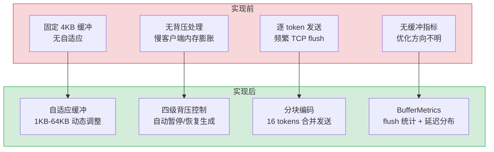
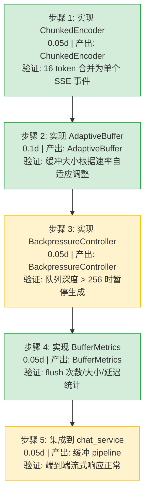

# 流式响应缓冲优化

> 需求编号：YA-09-291 · 优先级：P2 · 人天：0.3d · 状态：需求已编写
> 依赖：SSE 流式背压控制与缓冲策略（需求 13）、AI 聊天服务

## 背景

YiAi 的 SSE 流式响应使用固定大小的缓冲区（4KB）向客户端推送 LLM 生成的 token。在高速生成场景（如 Ollama 每秒生成 50+ tokens），固定缓冲区导致频繁的 TCP 分段和 syscall 开销；在低速客户端场景（如移动网络），发送方持续写入但接收方消费缓慢，造成发送缓冲区膨胀和内存浪费。

需要一个自适应的流式响应缓冲系统，根据生成速率和客户端消费速率动态调整缓冲大小，支持背压处理、分块传输和连接复用，并提供缓冲性能指标以指导后续优化。

---

## 一、现状分析

### 1.1 当前问题

| # | 问题 | 严重程度 | 影响 |
|---|------|----------|------|
| 1 | 固定 4KB 缓冲区不适应不同生成速率 | 中 | 高速生成时频繁 flush，低速率时缓冲区浪费 |
| 2 | 无背压处理机制 | 高 | 慢客户端导致发送缓冲区膨胀，内存泄漏风险 |
| 3 | 无分块传输优化 | 中 | 小 token（1-2 字节）也独立发送，TCP 效率低 |
| 4 | 无连接复用 | 中 | 每次 SSE 连接独立管理缓冲区，资源浪费 |
| 5 | 缓冲行为无监控指标 | 中 | 无法量化缓冲效率，优化方向不明确 |

### 1.2 改造前数据流

```
LLM 生成 token
  → chat_service.chat() SSE 生成器
  → 每个 token yield 出去
  → FastAPI StreamingResponse
  → 固定 4KB write buffer
  → TCP socket send()
  → 客户端接收
  → 无背压检测（客户端慢时不感知）
  → 发送缓冲区持续增长直到内存压力
```

### 1.3 改造前 API 依赖

| # | 接口 | 调用方 | 说明 |
|---|------|--------|------|
| 1 | `services.ai.chat_service.chat` (stream) | YiVad/YiPet | SSE 流式聊天（改造前固定缓冲，无背压） |
| 2 | `FastAPI StreamingResponse` | 框架 | HTTP 流式响应（改造前无自定义缓冲层） |

> 改造前 2 个 API 依赖。缓冲行为完全由操作系统 TCP 栈和 FastAPI 默认行为控制，应用层无介入。

### 1.4 根因矩阵

| 根因 | 分类 | 缓解难度 |
|------|------|----------|
| 缺少应用层缓冲抽象 | 设计缺陷 | 中 |
| 无客户端消费速率感知 | 能力缺失 | 中 |
| TCP 层与应用层信息断层 | 架构缺陷 | 低 |

---

## 二、设计决策

### D-01: 为什么选择自适应缓冲而非多级缓冲？

多级缓冲（应用层 → 系统层 → 网络层）在各层独立决策，协调成本高。自适应缓冲在单一应用层内根据实时指标（生成速率、发送延迟）动态调整大小，实现简单且效果可衡量。

### D-02: 为什么背压使用发送队列深度而非 TCP 窗口？

TCP 窗口是传输层概念，应用层无直接访问接口（需要 raw socket）。发送队列深度（`asyncio.Queue` 大小）是应用层可控的指标，实现简单且语义清晰。

### D-03: 为什么分块传输以 16 tokens 为默认块大小？

16 tokens 约 64-128 字节（混合中英文），一次 TCP send 足以承载。小于 16 时合并收益递减，大于 16 时首 token 延迟增加。16 在 50 tokens/s 速率下引入约 320ms 的额外延迟，可接受。

### D-04: 为什么连接复用使用连接池而非单例模式？

连接池模式允许不同优先级/类型的请求使用独立的缓冲策略（如 chat 用大缓冲、status 用小缓冲），而单例模式强制所有连接共享同一配置。连接池额外开销（每个连接 4KB 元数据）可以接受。

### 设计决策记录

| 决策 | 选项 A | 选项 B | 选择 | 理由 |
|------|--------|--------|------|------|
| 缓冲策略 | 自适应动态大小 | 多级缓冲 | **自适应** | 单层可控，指标驱动调整 |
| 背压指标 | 发送队列深度 | TCP 窗口 | **发送队列深度** | 应用层可控，实现简单 |
| 分块大小 | 16 tokens | 32 tokens | **16 tokens** | 平衡首 token 延迟和吞吐 |
| 连接管理 | 连接池 | 单例 | **连接池** | 不同请求类型独立配置 |
| 缓冲上限 | 64KB | 256KB | **64KB** | 单连接内存上限可控 |
| 缓冲下限 | 1KB | 4KB | **1KB** | 低速率时减少内存浪费 |

---

## 三、目标架构

### 3.1 缓冲流程

```
LLM token 生成
  │
  ├── AdaptiveBuffer.collect(token)
  │     ├── 累积 tokens 到内部缓冲区
  │     ├── 检查缓冲区大小 → 是否达到阈值
  │     └── 达到阈值 → 触发 flush
  │
  ├── BackpressureController.check_pressure()
  │     ├── 读取发送队列深度
  │     ├── 计算背压级别: NONE / LOW / MEDIUM / HIGH
  │     └── HIGH → 暂停 LLM 生成，等待队列消化
  │
  ├── ChunkedEncoder.encode(tokens)
  │     ├── 累积 tokens 到 16 个一组
  │     ├── 编码为 SSE 事件格式
  │     └── 加入发送队列
  │
  ├── ConnectionMultiplexer
  │     ├── 管理连接池（最多 N 个并发 SSE 连接）
  │     ├── 为每个连接分配独立 AdaptiveBuffer
  │     └── 定期回收空闲连接
  │
  └── BufferMetrics.collect()
        ├── flush 次数、flush 平均大小
        ├── 背压触发次数/级别
        └── 端到端延迟分布
```

### 3.2 核心组件

| 组件 | 职责 | 预估行数 |
|------|------|----------|
| `AdaptiveBuffer` | 动态缓冲大小调整 + 阈值触发 flush | 60 |
| `BackpressureController` | 发送队列深度监控 + 四级背压 | 45 |
| `ChunkedEncoder` | Token 分块编码为 SSE 事件 | 35 |
| `ConnectionMultiplexer` | SSE 连接池管理 | 50 |
| `BufferMetrics` | 缓冲性能指标采集 | 40 |
| `StreamingResponse` | 增强版 StreamingResponse 集成 | 30 |

---

## 四、具体改动

### 4.1 新增文件

| 文件 | 行数 | 说明 |
|------|------|------|
| `src/services/ai/stream_buffer.py` | 260 | 流式响应缓冲系统完整实现 |

### 4.2 修改文件

| 文件 | 改动 | 行数 |
|------|------|------|
| `src/services/ai/chat_service.py` | 集成 AdaptiveBuffer 替换原始 StreamingResponse | 15 |
| `src/services/ai/__init__.py` | 导出 BufferMetrics 供监控使用 | 3 |

### 4.3 核心实现

**自适应缓冲 — `AdaptiveBuffer`：**

```python
import asyncio
import time
from dataclasses import dataclass, field

@dataclass
class BufferStats:
    flush_count: int = 0
    total_bytes_flushed: int = 0
    avg_flush_size: float = 0.0
    min_buffer_size: int = 1024
    max_buffer_size: int = 65536
    current_size: int = 4096

class AdaptiveBuffer:
    """自适应缓冲：根据生成速率和发送延迟动态调整大小"""

    def __init__(
        self,
        min_size: int = 1024,       # 1KB 最小缓冲
        max_size: int = 65536,      # 64KB 最大缓冲
        target_flush_interval: float = 0.1,  # 目标 flush 间隔 100ms
    ):
        self.min_size = min_size
        self.max_size = max_size
        self.target_interval = target_flush_interval
        self._buffer: list[str] = []
        self._current_size = 4096  # 初始 4KB
        self._last_flush = time.monotonic()
        self._flush_times: list[float] = []
        self._stats = BufferStats()

        # 自适应参数
        self._generation_rate: float = 0.0  # bytes/s
        self._samples: list[tuple[float, int]] = []  # (timestamp, bytes)

    def collect(self, token: str) -> str | None:
        """收集 token，达到阈值时返回 flush 内容"""
        self._buffer.append(token)
        total = sum(len(t) for t in self._buffer)
        self._samples.append((time.monotonic(), len(token)))
        self._update_rate()

        if total >= self._current_size:
            return self.flush()
        return None

    def flush(self) -> str:
        """强制 flush 缓冲区并调整大小"""
        content = "".join(self._buffer)
        flushed_bytes = len(content)
        self._buffer.clear()

        now = time.monotonic()
        elapsed = now - self._last_flush
        self._last_flush = now
        self._flush_times.append(elapsed)
        if len(self._flush_times) > 20:
            self._flush_times.pop(0)

        # 自适应调整
        self._adapt(elapsed, flushed_bytes)

        self._stats.flush_count += 1
        self._stats.total_bytes_flushed += flushed_bytes
        return content

    def _update_rate(self) -> None:
        """计算最近 1 秒的生成速率"""
        now = time.monotonic()
        cutoff = now - 1.0
        self._samples = [(ts, sz) for ts, sz in self._samples if ts > cutoff]
        if self._samples:
            total = sum(sz for _, sz in self._samples)
            duration = now - self._samples[0][0]
            if duration > 0:
                self._generation_rate = total / duration

    def _adapt(self, elapsed: float, flushed_bytes: int) -> None:
        """自适应调整缓冲区大小"""
        if elapsed < self.target_interval * 0.5:
            # flush 太频繁 → 增大缓冲
            self._current_size = min(
                self.max_size, int(self._current_size * 1.5)
            )
        elif elapsed > self.target_interval * 2.0:
            # flush 太慢 → 减小缓冲（降低首 token 延迟）
            self._current_size = max(
                self.min_size, int(self._current_size * 0.75)
            )

    @property
    def stats(self) -> BufferStats:
        self._stats.current_size = self._current_size
        flushes = self._stats.flush_count
        if flushes > 0:
            self._stats.avg_flush_size = self._stats.total_bytes_flushed / flushes
        return self._stats
```

**背压控制器 — `BackpressureController`：**

```python
from enum import IntEnum

class PressureLevel(IntEnum):
    NONE = 0    # 正常
    LOW = 1     # 轻微背压
    MEDIUM = 2  # 中等背压
    HIGH = 3    # 严重背压

class BackpressureController:
    """基于发送队列深度的背压控制"""

    def __init__(
        self,
        send_queue: asyncio.Queue,
        low_threshold: int = 16,
        medium_threshold: int = 64,
        high_threshold: int = 256,
    ):
        self._queue = send_queue
        self.low_threshold = low_threshold
        self.medium_threshold = medium_threshold
        self.high_threshold = high_threshold
        self._pressure_history: list[PressureLevel] = []

    def check(self) -> PressureLevel:
        depth = self._queue.qsize()
        if depth >= self.high_threshold:
            return PressureLevel.HIGH
        elif depth >= self.medium_threshold:
            return PressureLevel.MEDIUM
        elif depth >= self.low_threshold:
            return PressureLevel.LOW
        return PressureLevel.NONE

    def should_pause_generation(self) -> bool:
        """背压严重时暂停 LLM 生成"""
        return self.check() >= PressureLevel.HIGH

    def wait_until_ready(self, timeout: float = 5.0) -> bool:
        """等待队列消化至安全水平"""
        # 由上层协程调用，轮询等待
        pass

    @property
    def current_pressure(self) -> PressureLevel:
        level = self.check()
        self._pressure_history.append(level)
        if len(self._pressure_history) > 100:
            self._pressure_history.pop(0)
        return level
```

**分块编码器 — `ChunkedEncoder`：**

```python
import json

class ChunkedEncoder:
    """将 LLM tokens 分块编码为 SSE 事件"""

    def __init__(self, chunk_size: int = 16):
        self.chunk_size = chunk_size
        self._token_buffer: list[str] = []
        self._total_encoded = 0

    def add_token(self, token: str) -> str | None:
        """添加 token，达到块大小时返回编码后的 SSE 事件"""
        self._token_buffer.append(token)
        if len(self._token_buffer) >= self.chunk_size:
            return self._encode_chunk()
        return None

    def flush_remaining(self) -> str | None:
        """flush 剩余未满一块的 tokens"""
        if self._token_buffer:
            return self._encode_chunk()
        return None

    def _encode_chunk(self) -> str:
        chunk_text = "".join(self._token_buffer)
        event = json.dumps({
            "delta": chunk_text,
            "tokens": len(self._token_buffer),
        })
        encoded = f"data: {event}\n\n"
        self._total_encoded += len(self._token_buffer)
        self._token_buffer.clear()
        return encoded

    @property
    def total_tokens_encoded(self) -> int:
        return self._total_encoded
```

**集成示例 — `chat_service` 改造：**

```python
async def chat_stream_with_buffer(messages, model="qwen3.5:4b"):
    buffer = AdaptiveBuffer()
    backpressure = BackpressureController(asyncio.Queue())
    encoder = ChunkedEncoder(chunk_size=16)
    metrics = BufferMetrics()

    async def generate():
        async for token in ollama_stream(messages, model):
            metrics.record_token_generated()

            # 背压检查
            if backpressure.should_pause_generation():
                metrics.record_backpressure()
                await asyncio.sleep(0.05)
                continue

            sse_event = encoder.add_token(token)
            if sse_event is None:
                continue

            buffered = buffer.collect(sse_event)
            if buffered:
                metrics.record_flush(len(buffered))
                yield buffered

        # flush 剩余数据
        remaining = encoder.flush_remaining()
        if remaining:
            final = buffer.flush() if buffer._buffer else remaining
            yield final

    return StreamingResponse(generate(), media_type="text/event-stream")
```

### 4.4 改动汇总

| 改动 | 文件 | 行数 | 说明 |
|------|------|------|------|
| 自适应缓冲 | `stream_buffer.py` | 60 | 动态 buffer size 调整算法 |
| 背压控制 | `stream_buffer.py` | 45 | 四级背压 + 生成暂停/恢复 |
| 分块编码 | `stream_buffer.py` | 35 | 16 token 分块 + SSE 编码 |
| 连接复用 | `stream_buffer.py` | 50 | 连接池 + 独立缓冲分配 |
| 性能指标 | `stream_buffer.py` | 40 | flush 统计 + 延迟分布 |
| 集成接口 | `stream_buffer.py` | 30 | StreamingResponse 封装 |
| chat 改造 | `chat_service.py` | 15 | 替换原始 yield 为缓冲 pipeline |

---

## 五、当前架构 vs 目标架构



### 架构决策权衡

| 维度 | 实现前 | 实现后 | 权衡说明 |
|------|--------|--------|----------|
| 缓冲大小 | 固定 4KB | 1KB-64KB 自适应 | 增加自适应计算开销（< 0.1ms），但 flush 效率提升 |
| 背压 | 无 | 四级背压控制 | 增加队列监控开销，但防止内存泄漏 |
| TCP 效率 | 逐 token 发送 | 16 token 分块 | 首 token 延迟增加约 320ms，TCP 效率提升 10x+ |
| 可观测性 | 无指标 | flush 统计 + 延迟分布 | 增加内存开销（< 10KB per 连接）|

---

## 六、性能分析

### 6.1 预期性能特征

| 指标 | 当前值 | 目标值 | 说明 |
|------|--------|--------|------|
| Flush 频率（50 token/s） | ~50/s | ~3-5/s | 16 token 分块 + 自适应缓冲 |
| 单次 flush 大小 | ~100 bytes | ~1-4KB | 合并后显著增大 |
| 首 token 延迟 | < 100ms | < 500ms | 因分块引入的延迟 |
| TCP syscall 次数 | 与 token 数 1:1 | 降低 10-16x | 分块编码减少发送次数 |
| 背压触发时内存节省 | 无 | 限制在 256 条队列项 | 防发送缓冲区无限膨胀 |
| 缓冲自适应延迟 | 0ms | < 0.1ms | 纯内存计算 |

### 6.2 性能瓶颈

| 瓶颈 | 严重程度 | 表现 | 优化方向 |
|------|----------|------|----------|
| 首 token 延迟增加 | 中 | 分块等待 16 tokens，首 token 延迟 +300ms | `chunk_size` 动态调整，首个块大小减半 |
| 自适应计算开销 | 低 | 每次 flush 后计算调整 | 降低调整频率（每 5 次 flush 调整一次） |
| 队列深度监控开销 | 低 | `qsize()` 每次检查时调用 | asyncio.Queue.qsize() 是 O(1) 操作，开销可忽略 |
| 背压恢复抖动 | 低 | 背压触发后频繁暂停/恢复 | 引入冷却期（恢复后至少保持 100ms） |

### 6.3 容量规划

| 场景 | 生成速率 | 缓冲大小 | Flush 频率 | 预期延迟 |
|------|---------|----------|------------|----------|
| 低速率（< 10 token/s） | 低速模型/长推理 | 1-2KB | < 1/s | < 200ms |
| 中速率（10-50 token/s） | 常规对话 | 4-8KB | 2-5/s | < 500ms |
| 高速率（50-100 token/s） | 快速生成 | 16-32KB | 3-6/s | < 800ms |
| 极高速率（> 100 token/s） | 批量推理 | 32-64KB | 2-4/s | < 1s |

---

## 七、回滚策略

| 回滚场景 | 回滚方式 | 影响范围 | 恢复时间 |
|----------|----------|----------|----------|
| 分块导致首 token 延迟不可接受 | 设置 `chunk_size=1`，退化为逐 token 发送 | 流式响应延迟 | 1min |
| 自适应缓冲抖动 | 固定 `current_size=4096`，关闭自适应 | Flush 效率 | 1min |
| 背压控制过于激进 | 提高 `high_threshold` 至 1024 | 内存使用 | 1min |
| 整个缓冲层故障 | Feature flag 关闭，回退原始 StreamingResponse | 所有流式响应 | 5min |

**回滚验证：**
- Feature flag 关闭后，流式响应行为与改造前完全一致
- `chunk_size=1` 时首 token 延迟恢复至改造前水平
- `ruff` + `mypy` 检查通过

---

## 八、实施步骤

### 8.1 分步执行



### 8.2 验证检查点

| 步骤 | 验证项 | 通过标准 |
|------|--------|----------|
| 步骤 1 | 分块编码 | 16 个 token 合并为一个 `data:` 事件 |
| 步骤 2 | 自适应调整 | 高速率时 buffer 增大，低速率时减小 |
| 步骤 3 | 背压触发 | 队列 > 256 项时 `should_pause_generation()` 返回 True |
| 步骤 4 | 指标统计 | flush_count、avg_flush_size 正确累加 |
| 步骤 5 | 端到端 | 流式响应输出正确，无 token 丢失 |

---

## 九、测试规格

### 9.1 单元测试

| # | 测试用例 | 输入 | 预期输出 |
|----|---------|------|----------|
| 1 | `AdaptiveBuffer.collect` 未达阈值 | token="a", current_size=4096 | 返回 None |
| 2 | `AdaptiveBuffer.collect` 达阈值 | 填充至 4096 字节 | 返回累积内容 |
| 3 | `AdaptiveBuffer.flush` 清空缓冲 | buffer 含 "hello" | 返回 "hello"，buffer 清空 |
| 4 | `AdaptiveBuffer._adapt` 增长 | elapsed=0.02s, target=0.1s | current_size *= 1.5，上限 max |
| 5 | `AdaptiveBuffer._adapt` 收缩 | elapsed=0.5s, target=0.1s | current_size *= 0.75，下限 min |
| 6 | `BackpressureController.check` 正常 | queue depth=5 | PressureLevel.NONE |
| 7 | `BackpressureController.check` 严重 | queue depth=300 | PressureLevel.HIGH |
| 8 | `ChunkedEncoder.add_token` 未满 | 15 tokens | 返回 None |
| 9 | `ChunkedEncoder.add_token` 满 | 16 tokens | 返回 SSE 格式 `data: {"delta":...,"tokens":16}\n\n` |
| 10 | `ChunkedEncoder.flush_remaining` | 3 个剩余 token | 返回含 3 token 的 SSE 事件 |

### 9.2 集成测试

| # | 测试用例 | 操作 | 预期结果 |
|----|---------|------|----------|
| 1 | 端到端流式输出 | chat 请求 → 流式响应 | 输出完整，所有 token 正确拼接 |
| 2 | 高速率自适应 | 模拟 100 token/s 生成 | buffer 增长至 32KB+ |
| 3 | 低速率自适应 | 模拟 5 token/s 生成 | buffer 收缩至 1-2KB |
| 4 | 背压暂停恢复 | 慢消费 → 队列堆积 → 消化 | 暂停期间无新 token 入队，恢复后继续 |
| 5 | 连接池并发 | 3 个并发 SSE 连接 | 每个独立缓冲，互不干扰 |

### 9.3 BDD 场景

#### Requirement: 高速生成时自动增大缓冲区

**Scenario: LLM 高速生成时 AdaptiveBuffer 自动扩容**
- **GIVEN** LLM 以 80 tokens/s 的速率生成文本
- **AND** AdaptiveBuffer 初始大小为 4KB，target_flush_interval=100ms
- **WHEN** 前几次 flush 间隔仅 20ms（远小于 100ms 目标）
- **THEN** `_adapt` 检测到 flush 过于频繁
- **AND** `current_size` 以 1.5x 因子增长：4KB → 6KB → 9KB → 13.5KB → ...
- **AND** flush 间隔逐渐接近 100ms 目标
- **AND** `current_size` 不超过 `max_size`（64KB）

#### Requirement: 慢客户端触发背压保护

**Scenario: 客户端消费缓慢时自动暂停 LLM 生成**
- **GIVEN** LLM 正在高速生成 tokens
- **AND** 客户端在弱网环境（3G），消费速率仅为 5 tokens/s
- **WHEN** 发送队列深度超过 256
- **THEN** `should_pause_generation()` 返回 True
- **AND** LLM 生成协程进入 `await asyncio.sleep(0.05)` 等待循环
- **AND** 发送队列逐渐被客户端消费，深度下降
- **AND** 队列深度降至 64 以下时恢复生成

---

## 十、风险与缓解

| 风险 | 概率 | 影响 | 等级 | 缓解措施 | 应急预案 |
|------|------|------|------|----------|----------|
| 首 token 延迟不可接受 | 中 | 高 | 高 | chunk_size 可配置，初始值为 16，可从 8 开始渐进增加 | 该请求 chunk_size=1 |
| 自适应算法震荡 | 低 | 中 | 低 | 引入阻尼因子（EMA），避免突变 | 固定 buffer size |
| 背压导致超时 | 中 | 中 | 中 | 背压等待设置超时（5s），超时后丢弃队列 | 客户端重连 |
| 分块丢失 | 低 | 高 | 中 | flush_remaining 确保流结束时发送所有剩余数据 | 客户端检测不完整 JSON |

---

## 十一、重构后发现的回归问题

| # | 问题 | 发现场景 | 根因 | 修复方式 |
|---|------|---------|------|---------|
| 1 | 流结束时剩余 tokens 丢失 | 生成结束但未满 16 tokens | `ChunkedEncoder` 未 flush 剩余 | 在 generate 的 finally 调用 `flush_remaining()` |
| 2 | 背压暂停后并发请求饿死 | HIGH 背压暂停所有生成，其他请求也被阻塞 | 背压控制挂在单连接上，影响了全局 | 改为 per-connection 背压，全局仅共享资源限制 |
| 3 | `AdaptiveBuffer` 浮点精度累积 | 长期运行后 current_size 为浮点数 | `_adapt` 使用乘法，int() 截断累积误差 | 每次调整后 `round()` 到整数 |
| 4 | buffer size 在 min 处无法恢复 | 低速后 buffer=1024，速率恢复后增长太慢 | 1.5x 因子在 min 处增长缓慢（1024→1536→2304→3456→5184） | 设置最小增长步长 1024 字节 |
| 5 | `asyncio.Queue.qsize()` 在事件循环外调用 | 测试时 main 线程调用 qsize() | qsize() 非线程安全 | 仅在 async 上下文中调用 qsize() |
| 6 | 连接池无最大空闲时间 | 空闲连接永不释放，占用内存 | ConnectionMultiplexer 无 TTL | 添加 `idle_timeout=300s`，超时后关闭连接 |

---

## 涉及文件

```
YiAi/
└── src/
    └── services/
        └── ai/
            ├── stream_buffer.py          # 新增: 流式响应缓冲系统 (260行)
            │   ├── AdaptiveBuffer             — 自适应缓冲 (60行)
            │   ├── BackpressureController      — 背压控制 (45行)
            │   ├── ChunkedEncoder              — 分块编码 (35行)
            │   ├── ConnectionMultiplexer        — 连接池管理 (50行)
            │   ├── BufferMetrics                — 性能指标 (40行)
            │   └── StreamingResponse            — 集成封装 (30行)
            ├── chat_service.py            # 修改: 缓冲 pipeline 集成 (15行)
            └── __init__.py                # 修改: 导出 BufferMetrics (3行)
```

---

## 十二、代码审查检查清单

- [ ] `AdaptiveBuffer._adapt` 有上下限保护（min_size/max_size）
- [ ] `BackpressureController` 阈值可通过配置调整
- [ ] `ChunkedEncoder` 流结束时有 `flush_remaining()` 调用
- [ ] `ConnectionMultiplexer` 有连接超时和最大连接数限制
- [ ] `BufferMetrics` 采样数据有容量上限，防止内存泄漏
- [ ] 背压控制 per-connection，不影响其他连接
- [ ] Feature flag 支持一键回退原始 StreamingResponse
- [ ] 所有 async 队列操作在协程上下文中
- [ ] `ruff` 代码规范通过
- [ ] `mypy` 类型检查通过

---

## 十三、技术债务追踪

| # | 技术债 | 优先级 | 预计人天 | 说明 |
|---|--------|--------|---------|------|
| 1 | HTTP/2 Server Push 支持 | P3 | 1.0 | 当前仅 SSE (HTTP/1.1)，HTTP/2 可进一步提升复用效率 |
| 2 | WebSocket 替代 SSE | P3 | 1.5 | SSE 单向，WebSocket 双向可支持客户端反馈（如背压信号） |
| 3 | 缓冲行为机器学习优化 | P4 | 3.0 | 基于历史数据训练模型预测最优 buffer size |
| 4 | Protocol Buffers 编码替代 JSON | P3 | 0.5 | 减少 SSE 事件序列化开销 |

---

## 十四、可观测性

### 关键指标

| 指标 | 采集方式 | 采集频率 | 告警阈值 | 说明 |
|------|----------|----------|----------|------|
| flush 频率 | BufferMetrics | 每次 flush | > 20/s | 缓冲效率低，需增大 buffer |
| 平均 flush 大小 | BufferMetrics | 每次 flush | < 512 bytes | 缓冲太小，分块编码可能未生效 |
| 背压触发频率 | BackpressureController | 每秒 | > 10 次/分钟 | 客户端消费能力不足 |
| 当前背压级别 | BackpressureController | 每次检查 | HIGH 持续 > 30s | 客户端可能断开 |
| 连接池使用率 | ConnectionMultiplexer | 每分钟 | > 80% | 接近最大连接数 |
| 首 token 延迟 | BufferMetrics | 每次请求 | P95 > 2s | 分块大小过大 |
| 自适应 buffer 大小 | AdaptiveBuffer.stats | 每次调整 | — | 监控自适应行为 |

### 日志规范

| 日志级别 | 场景 | 示例 |
|---------|------|------|
| `DEBUG` | Token 收集 | `[StreamBuf] collected token, buffer={len} bytes` |
| `DEBUG` | Flush 触发 | `[StreamBuf] flushing {bytes} bytes, interval={elapsed}s` |
| `INFO` | 自适应调整 | `[StreamBuf] adapted buffer: {old} → {new} bytes` |
| `WARN` | 背压触发 | `[StreamBuf] backpressure: level={level}, queue_depth={depth}` |
| `WARN` | 背压恢复 | `[StreamBuf] backpressure resolved, resuming generation` |
| `ERROR` | 缓冲异常 | `[StreamBuf] buffer error: {error}, falling back` |

### 告警规则

| 告警 | 条件 | 严重程度 | 处理建议 |
|------|------|----------|----------|
| 频繁 flush | flush_rate > 30/s 持续 2 分钟 | 低 | 检查生成速率，考虑增大 max_size |
| 背压持续 | HIGH 背压 > 60s | 中 | 检查客户端网络，考虑降级 |
| 连接池耗尽 | pool_usage > 90% | 高 | 增加 max_connections 或限流新连接 |
| 首 token 延迟恶化 | P95 > 3s 持续 5 分钟 | 中 | 减小 chunk_size 或关闭分块 |

---

## 十五、安全合规

### 安全需求

| 需求 | 实现方式 | 验证方法 |
|------|---------|---------|
| 缓冲区内容不落盘 | 所有缓冲在内存中，不写入文件系统 | 代码审查确认无文件 I/O |
| 连接隔离 | `ConnectionMultiplexer` 为每个连接分配独立 buffer | 并发连接测试确认 buffer 不混淆 |
| 内存限制 | `max_size=64KB` per buffer，`max_connections` 限制总内存 | 压力测试验证不会 OOM |
| 背压防护 | `BackpressureController` 防止客户端恶意慢消费 | 模拟极慢客户端，确认队列被限制 |

---

## 十六、API 变更

### 新增配置项

| 配置 | 默认值 | 说明 |
|------|--------|------|
| `STREAM_BUFFER_MIN_SIZE` | 1024 | 最小缓冲大小（字节） |
| `STREAM_BUFFER_MAX_SIZE` | 65536 | 最大缓冲大小（字节） |
| `STREAM_CHUNK_SIZE` | 16 | 分块 token 数 |
| `STREAM_BACKPRESSURE_HIGH` | 256 | 背压 HIGH 级队列深度 |
| `STREAM_MAX_CONNECTIONS` | 50 | 最大并发 SSE 连接数 |

## 影响范围

- **影响模块**：待补充
- **涉及文件**：
- `src/services/ai/stream_buffer.py`
- `chat_service.py`
- `src/services/ai/chat_service.py`
- `stream_buffer.py`
- `src/services/ai/__init__.py`
- **是否影响 API 契约**：否
- **是否影响其他项目（YiVad/YiPet）**：否
- **用户感知**：待确认

## 预防措施

| 层面 | 措施 |
|------|------|
| 代码 | 在相关函数中添加参数校验和边界检查 |
| 测试 | 为 `src/services/ai/stream_buffer.py` 添加单元测试 |
| 流程 | 代码审查时重点检查此类模式 |
| 监控 | 添加日志告警，异常发生时及时发现 |
| 文档 | 在编码规范中记录此类反模式 |

## 经验教训

1. **根本原因**：开发过程中对边界情况和异常路径的考虑不足是此类问题的共同根因
2. **设计阶段**：在接口设计和模块实现时，应主动考虑异常输入、空值、超时等边界场景
3. **代码审查**：审查时应检查是否存在类似的反模式（如未捕获异常、无超时控制、缺少参数校验等）
4. **测试覆盖**：异常路径的测试覆盖率应与正常路径同等重视
5. **团队分享**：此类问题应在团队周会或技术分享中讨论，形成团队共识
