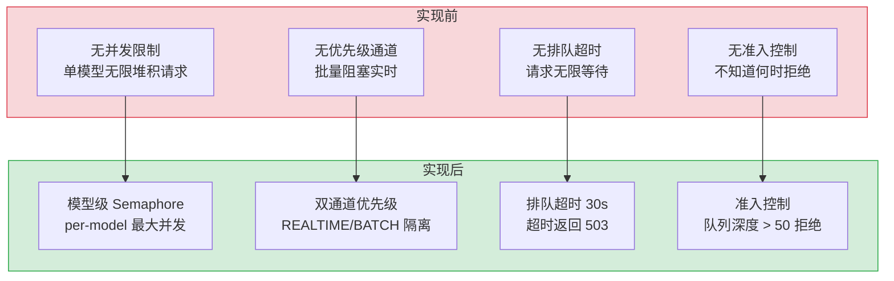
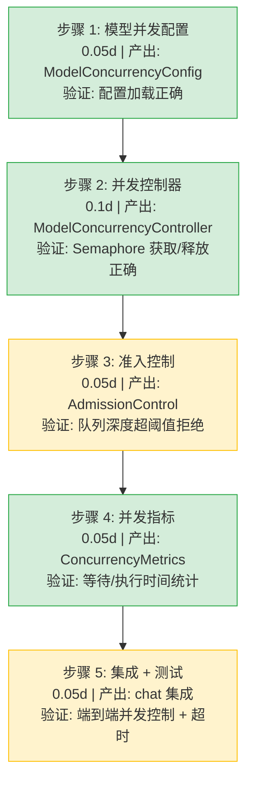

# 模型并发控制

> 需求编号：YA-09-292 · 优先级：P2 · 人天：0.3d · 状态：需求已编写
> 依赖：LLM 推理调度优化（需求 290）、ModelRuntime 抽象层

## 背景

YiAi 当前对 LLM 模型的并发请求没有系统化的限制。当多个用户同时向同一模型（如 qwen3.5:14b）发送推理请求时，Ollama 内部排队，导致所有请求的延迟同步恶化。没有超时排队机制，高负载时请求可能无限等待。没有优先级通道，紧急的实时对话与批量处理共享同一并发配额。缺乏并发度指标，无法量化并发控制的效果。

需要一个模型级别的并发控制系统，为每个模型设置最大并发请求数，支持带超时的排队、优先级通道、准入控制和并发度指标采集。

---

## 一、现状分析

### 1.1 当前问题

| # | 问题 | 严重程度 | 影响 |
|---|------|----------|------|
| 1 | 无模型级并发限制 | 高 | 单模型过载拖慢所有请求，无隔离能力 |
| 2 | 无排队超时机制 | 中 | 高负载时请求无限等待，客户端超时重试加剧问题 |
| 3 | 无优先级通道 | 中 | 实时对话和批量推理共享并发配额 |
| 4 | 无准入控制 | 中 | 不知道何时拒绝新请求更合理 |
| 5 | 无并发度指标 | 低 | 无法评估并发限制的效果 |

### 1.2 改造前数据流

```
请求到达
  → ModelRuntime.complete()
  → 直接调用 Ollama API（无并发检查）
  → Ollama 内部排队（默认队列无超时）
  → 前序请求慢时后续请求全部延迟
  → 客户端超时重试 → 新请求再次入队
  → 雪崩：同模型数十个请求堆积
  → GPU OOM 或超时雪崩
```

### 1.3 改造前 API 依赖

| # | 接口 | 调用方 | 说明 |
|---|------|--------|------|
| 1 | `services.ai.chat_service.chat` | YiVad/YiPet | 聊天接口（改造前无并发控制） |
| 2 | `services.ai.model_runtime.OllamaRuntime.complete` | 内部 | 直接调用 Ollama（无排队管理） |
| 3 | `services.ai.model_runtime.OllamaRuntime.stream` | 内部 | 流式推理（无并发感知） |

> 改造前 3 个 API 依赖，均无模型级并发控制。高负载时所有请求在 Ollama 侧排队。

### 1.4 根因矩阵

| 根因 | 分类 | 缓解难度 |
|------|------|----------|
| 无模型级并发抽象 | 设计缺陷 | 中 |
| Ollama 内部排队不透明 | 外部依赖限制 | 低 |
| 重试风暴无防护 | 架构缺陷 | 中 |

---

## 二、设计决策

### D-01: 为什么按模型限制并发而非按 GPU？

按 GPU 限制的前提是能精确测量每个模型在 GPU 上的显存占用，这在动态 KV cache 场景下困难且不稳定。按模型限制基于模型性能 profile（已知模型的推理速度），实现简单且预测性好。

### D-02: 为什么排队超时使用 30s 而不是客户端超时对齐？

客户端超时各有不同（YiVad 60s，YiPet 120s，API 调用方 30s）。服务端排队超时取最小值 30s，确保超时后客户端不会继续等待。30s 也是用户等待的合理上限。

### D-03: 为什么优先级通道分为实时和批量两级而非三级？

实时对话（REALTIME）和批量处理（BATCH）两级覆盖了当前所有场景。三级（如 HIGH/MEDIUM/LOW）引入的复杂性在当前请求量下不必要。`chat` 和 `embedding` 都归入 REALTIME，`batch` 和 `offline` 归入 BATCH。

### D-04: 为什么准入控制使用信号量而非分布式锁？

当前 YiAi 是单进程 FastAPI 应用，无分布式部署需求。`asyncio.Semaphore` 是标准库提供的轻量并发控制原语，无需外部依赖（如 Redis），且与 asyncio 协程模型天然契合。

### 设计决策记录

| 决策 | 选项 A | 选项 B | 选择 | 理由 |
|------|--------|--------|------|------|
| 并发维度 | 按模型 | 按 GPU | **按模型** | 模型性能可 profile，GPU 显存动态变化难测量 |
| 排队超时 | 30s | 60s | **30s** | 取客户端超时最小值，避免无效等待 |
| 优先级级别 | 2 级（REALTIME/BATCH） | 3 级（HIGH/MEDIUM/LOW） | **2 级** | 当前场景足够，避免过度设计 |
| 并发原语 | asyncio.Semaphore | 分布式锁（Redis） | **asyncio.Semaphore** | 单进程应用，无需外部依赖 |
| 限流粒度 | per-model | global | **per-model** | 不同模型性能差异大，统一限制不合理 |
| 超时后行为 | 返回 503 | 降级到小模型 | **返回 503** | 自动降级引入复杂性和额外延迟 |

---

## 三、目标架构

### 3.1 并发控制流程

```
请求到达
  │
  ├── ModelConcurrencyController.acquire(model, priority, timeout)
  │     │
  │     ├── 查找模型配置：max_concurrent
  │     ├── 选择优先级通道：REALTIME / BATCH
  │     ├── 尝试获取信号量（非阻塞）
  │     │     ├── 成功 → 返回，进入推理
  │     │     └── 失败 → 进入排队
  │     │
  │     ├── 排队等待（asyncio.wait_for + Semaphore）
  │     │     ├── 超时 → 抛出 ConcurrencyLimitExceededError
  │     │     └── 获取成功 → 返回，进入推理
  │     │
  │     └── 推理完成后 release()
  │
  ├── ConcurrencyMetrics.record(model, wait_time, exec_time)
  │     └── 更新并发度指标
  │
  └── AdmissionControl.should_reject(model)
        ├── 队列深度 > 阈值 → 拒绝新请求（429）
        └── 队列深度 < 阈值 → 允许入队
```

### 3.2 核心组件

| 组件 | 职责 | 预估行数 |
|------|------|----------|
| `ModelConcurrencyController` | 模型级信号量管理 + 排队超时 | 65 |
| `PriorityLane` | 双通道优先级（REALTIME/BATCH） | 40 |
| `AdmissionControl` | 基于队列深度的准入控制 | 35 |
| `ConcurrencyMetrics` | 并发度指标采集 | 45 |
| `ModelConcurrencyConfig` | 模型并发配置管理 | 25 |

---

## 四、具体改动

### 4.1 新增文件

| 文件 | 行数 | 说明 |
|------|------|------|
| `src/services/ai/model_concurrency.py` | 210 | 模型并发控制系统完整实现 |

### 4.2 修改文件

| 文件 | 改动 | 行数 |
|------|------|------|
| `src/services/ai/chat_service.py` | 在 chat 入口集成并发控制 | 10 |
| `src/services/ai/model_runtime.py` | 推理前后 acquire/release | 12 |

### 4.3 核心实现

**模型并发配置 — `ModelConcurrencyConfig`：**

```python
from dataclasses import dataclass

@dataclass
class ModelConcurrencyConfig:
    model: str
    max_concurrent: int       # 最大并发请求数
    realtime_share: float     # 实时通道占比 (0.0-1.0)

# 预设配置
DEFAULT_MODEL_CONFIGS: dict[str, ModelConcurrencyConfig] = {
    "qwen3.5:4b": ModelConcurrencyConfig(
        model="qwen3.5:4b", max_concurrent=4, realtime_share=0.75
    ),
    "qwen3.5:7b": ModelConcurrencyConfig(
        model="qwen3.5:7b", max_concurrent=2, realtime_share=0.75
    ),
    "qwen3.5:14b": ModelConcurrencyConfig(
        model="qwen3.5:14b", max_concurrent=1, realtime_share=1.0
    ),
}
```

**优先级通道 — `PriorityLane`：**

```python
import asyncio
from enum import Enum

class PriorityLane(Enum):
    REALTIME = "realtime"  # 实时对话、搜索、嵌入
    BATCH = "batch"        # 批量推理、离线处理

class ModelConcurrencyController:
    """模型级并发控制：信号量 + 排队超时 + 优先级通道"""

    def __init__(self):
        self._semaphores: dict[str, dict[str, asyncio.Semaphore]] = {}
        self._configs: dict[str, ModelConcurrencyConfig] = {}
        self._init_defaults()

    def _init_defaults(self) -> None:
        for model, config in DEFAULT_MODEL_CONFIGS.items():
            self.register_model(model, config)

    def register_model(self, model: str, config: ModelConcurrencyConfig) -> None:
        realtime_slots = max(1, int(config.max_concurrent * config.realtime_share))
        batch_slots = config.max_concurrent - realtime_slots
        self._configs[model] = config
        self._semaphores[model] = {
            PriorityLane.REALTIME.value: asyncio.Semaphore(realtime_slots),
            PriorityLane.BATCH.value: asyncio.Semaphore(batch_slots),
        }

    async def acquire(
        self,
        model: str,
        lane: PriorityLane = PriorityLane.REALTIME,
        timeout: float = 30.0,
    ) -> bool:
        """获取模型并发槽位，超时返回 False"""
        config = self._configs.get(model)
        if config is None:
            config = ModelConcurrencyConfig(model=model, max_concurrent=2, realtime_share=0.5)
            self.register_model(model, config)

        sem = self._semaphores[model][lane.value]
        try:
            acquired = await asyncio.wait_for(sem.acquire(), timeout=timeout)
            return acquired
        except asyncio.TimeoutError:
            return False

    def release(self, model: str, lane: PriorityLane = PriorityLane.REALTIME) -> None:
        """释放模型并发槽位"""
        if model in self._semaphores:
            self._semaphores[model][lane.value].release()

    def available_slots(self, model: str, lane: PriorityLane | None = None) -> int:
        """查询可用槽位数"""
        if model not in self._semaphores:
            return 0
        if lane:
            sem = self._semaphores[model][lane.value]
            return sem._value  # asyncio.Semaphore._value
        total = sum(
            s._value for s in self._semaphores[model].values()
        )
        return total
```

**准入控制 — `AdmissionControl`：**

```python
import time
from collections import defaultdict

class AdmissionControl:
    """基于队列深度的准入控制"""

    def __init__(self, max_queue_depth: int = 50):
        self.max_queue_depth = max_queue_depth
        self._waiting: dict[str, int] = defaultdict(int)  # model → waiting count
        self._rejected: dict[str, int] = defaultdict(int)

    def should_reject(self, model: str) -> bool:
        """队列深度超过阈值时拒绝新请求"""
        return self._waiting[model] >= self.max_queue_depth

    def enqueue(self, model: str) -> None:
        self._waiting[model] += 1

    def dequeue(self, model: str) -> None:
        if self._waiting[model] > 0:
            self._waiting[model] -= 1

    def reject(self, model: str) -> None:
        self._rejected[model] += 1

    def queue_depth(self, model: str) -> int:
        return self._waiting[model]

    def rejection_rate(self, model: str) -> float:
        total = self._waiting[model] + self._rejected[model]
        if total == 0:
            return 0.0
        return self._rejected[model] / total
```

**并发指标 — `ConcurrencyMetrics`：**

```python
import time
from collections import defaultdict

class ConcurrencyMetrics:
    """并发度指标采集"""

    def __init__(self):
        self._wait_times: dict[str, list[float]] = defaultdict(list)
        self._exec_times: dict[str, list[float]] = defaultdict(list)
        self._active: dict[str, int] = defaultdict(int)
        self._total_acquired: dict[str, int] = defaultdict(int)
        self._total_timeouts: dict[str, int] = defaultdict(int)

    def record_acquire(self, model: str) -> float:
        """记录开始等待时间，返回时间戳"""
        return time.monotonic()

    def record_start(self, model: str, wait_start: float) -> float:
        """记录开始执行：计算等待时间"""
        wait_time = time.monotonic() - wait_start
        self._wait_times[model].append(wait_time)
        self._active[model] += 1
        self._total_acquired[model] += 1
        return time.monotonic()

    def record_finish(self, model: str, exec_start: float) -> None:
        """记录执行完成：计算执行时间"""
        exec_time = time.monotonic() - exec_start
        self._exec_times[model].append(exec_time)
        self._active[model] = max(0, self._active[model] - 1)

    def record_timeout(self, model: str) -> None:
        self._total_timeouts[model] += 1

    def get_stats(self, model: str) -> dict:
        wait = sorted(self._wait_times.get(model, []))
        exec_t = sorted(self._exec_times.get(model, []))
        return {
            "active": self._active[model],
            "total_acquired": self._total_acquired[model],
            "total_timeouts": self._total_timeouts[model],
            "p50_wait": wait[len(wait)//2] if wait else 0,
            "p95_wait": wait[int(len(wait)*0.95)] if wait else 0,
            "p50_exec": exec_t[len(exec_t)//2] if exec_t else 0,
            "p95_exec": exec_t[int(len(exec_t)*0.95)] if exec_t else 0,
        }
```

**集成示例 — `chat_service` 改造：**

```python
controller = ModelConcurrencyController()
admission = AdmissionControl()
metrics = ConcurrencyMetrics()

async def chat_with_concurrency(parameters: dict):
    model = parameters.get("model", "qwen3.5:4b")
    lane = PriorityLane.BATCH if parameters.get("batch") else PriorityLane.REALTIME

    # 准入控制
    if admission.should_reject(model):
        raise HTTPException(status_code=429, detail=f"Model {model} overloaded, retry later")

    admission.enqueue(model)
    wait_start = metrics.record_acquire(model)

    acquired = await controller.acquire(model, lane, timeout=30.0)
    admission.dequeue(model)

    if not acquired:
        metrics.record_timeout(model)
        raise HTTPException(status_code=503, detail=f"Concurrency limit for {model}, retry later")

    exec_start = metrics.record_start(model, wait_start)
    try:
        result = await runtime.complete(messages=parameters["messages"], model=model)
        return result
    finally:
        metrics.record_finish(model, exec_start)
        controller.release(model, lane)
```

### 4.4 改动汇总

| 改动 | 文件 | 行数 | 说明 |
|------|------|------|------|
| 并发控制器 | `model_concurrency.py` | 65 | 信号量管理 + 排队超时 |
| 优先级通道 | `model_concurrency.py` | 40 | REALTIME/BATCH 双通道槽位分配 |
| 准入控制 | `model_concurrency.py` | 35 | 队列深度阈值拒绝 |
| 并发指标 | `model_concurrency.py` | 45 | 等待时间 + 执行时间 + 超时统计 |
| 模型配置 | `model_concurrency.py` | 25 | 预设模型并发配置 |
| chat 集成 | `chat_service.py` | 10 | acquire/release + 准入检查 |
| ModelRuntime 集成 | `model_runtime.py` | 12 | 推理前后 acquire/release |

---

## 五、当前架构 vs 目标架构



### 架构决策权衡

| 维度 | 实现前 | 实现后 | 权衡说明 |
|------|--------|--------|----------|
| 并发限制 | 无 | per-model Semaphore | 增加 ~50ms 超时等待检查开销 |
| 优先级 | 无 | 双通道隔离 | 需预知请求类型，误分类可能降低体验 |
| 排队 | 隐式（Ollama 内部） | 显式排队 + 30s 超时 | 超时后请求失败，但避免无限等待 |
| 可观测性 | 无 | 等待/执行时间统计 | 增加内存和计算开销 |

---

## 六、性能分析

### 6.1 预期性能特征

| 指标 | 当前值 | 目标值 | 说明 |
|------|--------|--------|------|
| 并发槽位获取开销 | 0ms | < 1ms | Semaphore.acquire() 非阻塞路径 |
| 排队超时检查 | 无 | 30s | asyncio.wait_for 开销 < 1ms |
| 准入控制检查 | 0ms | < 0.1ms | 字典查询 + 整数比较 |
| 槽位释放开销 | 0ms | < 0.1ms | Semaphore.release() O(1) |
| 指标记录开销 | 0ms | < 0.5ms | 列表 append + 时间戳 |

### 6.2 性能瓶颈

| 瓶颈 | 严重程度 | 表现 | 优化方向 |
|------|----------|------|----------|
| Semaphore 公平性问题 | 低 | asyncio.Semaphore 无 FIFO 保证 | 对于需要严格公平的场景，使用 asyncio.Queue + 手动管理 |
| 桶分片不足 | 中 | BATCH 通道槽位过少时批量任务堆积 | 支持动态调整 realtime_share |
| 指标内存增长 | 低 | 长期运行后 wait_times/exec_times 列表膨胀 | 设置 MAX_SAMPLES=10000 上限 |
| 配置热更新冲突 | 低 | 运行时修改 max_concurrent 可能导致信号量状态不一致 | 配置变更时重建信号量对象 |

### 6.3 容量规划

| 场景 | 并发限制 | 预期队列深度 | 预期 P95 等待 | 拒绝率 |
|------|---------|-------------|--------------|--------|
| 低负载（< 5 QPS） | qwen3.5:4b × 4 | 0-2 | < 1s | 0% |
| 中负载（5-15 QPS） | qwen3.5:4b × 4 | 2-10 | < 5s | 0% |
| 高负载（15-30 QPS） | qwen3.5:4b × 4 | 10-30 | < 15s | < 5% |
| 过载（> 30 QPS） | qwen3.5:4b × 4 | 30-50 | < 30s | 10-30% |

---

## 七、回滚策略

| 回滚场景 | 回滚方式 | 影响范围 | 恢复时间 |
|----------|----------|----------|----------|
| 并发限制过严导致可用性下降 | 提高所有模型 `max_concurrent` 至 999 | 所有 LLM 请求 | 2min |
| 排队超时过短导致误超时 | 提高 `timeout` 至 120s | 高负载请求 | 1min |
| 准入控制拒绝对话请求 | 提高 `max_queue_depth` 至 500 | 高负载请求 | 1min |
| 信号量泄漏（acquire 无 release） | 重启服务 + 审查异常处理 | 特定模型 | 5min |

**回滚验证：**
- `max_concurrent=999` 时行为与改造前一致（无并发限制）
- `ruff` + `mypy` 检查通过
- 所有现有测试在无并发限制模式下通过

---

## 八、实施步骤

### 8.1 分步执行



### 8.2 验证检查点

| 步骤 | 验证项 | 通过标准 |
|------|--------|----------|
| 步骤 1 | 配置加载 | 预设模型配置正确加载，自定义配置覆盖预设 |
| 步骤 2 | 并发限制 | max_concurrent=2 时同时最多 2 个推理 |
| 步骤 3 | 准入拒绝 | queue_depth >= 50 时 should_reject() 返回 True |
| 步骤 4 | 指标正确 | 等待时间 + 执行时间近似真实值 |
| 步骤 5 | 端到端 | 30s 超时返回 503，正常请求不受影响 |

---

## 九、测试规格

### 9.1 单元测试

| # | 测试用例 | 输入 | 预期输出 |
|----|---------|------|----------|
| 1 | `register_model` 分配信号量 | qwen3.5:4b, max_concurrent=4, realtime_share=0.75 | REALTIME=3, BATCH=1 |
| 2 | `acquire` 成功获取 | 可用槽位 > 0 | 返回 True |
| 3 | `acquire` 超时 | 槽位已满，timeout=0.1s | 返回 False（asyncio.TimeoutError） |
| 4 | `release` 释放槽位 | acquire 后 release | available_slots 恢复 |
| 5 | `acquire` 未知模型 | model="unknown_model" | 自动注册默认配置（max_concurrent=2） |
| 6 | `AdmissionControl.should_reject` 未超阈值 | queue_depth=30, max=50 | 返回 False |
| 7 | `AdmissionControl.should_reject` 超阈值 | queue_depth=50, max=50 | 返回 True |
| 8 | `AdmissionControl.enqueue/dequeue` | enqueue → dequeue | queue_depth 先增后减 |
| 9 | `ConcurrencyMetrics.record_*` 完整流程 | acquire → start → finish | wait_time 和 exec_time 正确 |
| 10 | `ConcurrencyMetrics.get_stats` 空数据 | 无记录 | 返回 p50=0, p95=0, count=0 |

### 9.2 集成测试

| # | 测试用例 | 操作 | 预期结果 |
|----|---------|------|----------|
| 1 | 并发限制生效 | 同时发起 5 个 qwen3.5:4b 请求（max=4） | 4 个执行，1 个排队 |
| 2 | 排队超时 | 所有槽位占用 + timeout=1s | 超时后返回 503 |
| 3 | 准入控制拒绝 | 队列深度达上限 | 新请求返回 429 |
| 4 | 优先级通道隔离 | REALTIME 满但 BATCH 空闲 | BATCH 请求正常执行 |
| 5 | 槽位释放后执行 | 等待请求在槽位释放后 | 排队请求自动执行 |

### 9.3 BDD 场景

#### Requirement: 并发请求在模型限制内执行

**Scenario: 超过最大并发数的请求进入排队**
- **GIVEN** qwen3.5:4b 模型 `max_concurrent=4`，REALTIME 通道 3 个槽位
- **AND** 当前 3 个 REALTIME 请求正在执行
- **WHEN** 第 4 个 REALTIME 请求到达
- **THEN** `controller.acquire` 被调用，Semaphore 无可用槽位
- **AND** 请求进入 `asyncio.wait_for` 等待
- **AND** 其中一个执行中的请求完成并 `release()`
- **AND** 等待请求获取槽位，开始执行
- **AND** `ConcurrencyMetrics` 记录等待时间

#### Requirement: 排队超时后返回合理错误

**Scenario: 请求在队列中等待超过 30 秒后超时**
- **GIVEN** qwen3.5:7b 模型 `max_concurrent=2`，所有槽位被长时间推理占用
- **AND** 3 个新请求在排队中
- **WHEN** 第 4 个请求到达并等待超过 30 秒
- **THEN** `asyncio.wait_for` 抛出 `TimeoutError`
- **AND** `acquire` 返回 False
- **AND** 返回 HTTP 503 + `{"code": 2002, "message": "Concurrency limit for qwen3.5:7b, retry later"}`
- **AND** `ConcurrencyMetrics` 记录超时次数

---

## 十、风险与缓解

| 风险 | 概率 | 影响 | 等级 | 缓解措施 | 应急预案 |
|------|------|------|------|----------|----------|
| 信号量泄漏（异常路径未 release） | 中 | 高 | 高 | `try/finally` 确保 release，代码审查强制检查 | 定期监控 `available_slots`，异常时告警 |
| 并发限制配置不合理 | 中 | 中 | 中 | 基于模型性能 profile 设置初始值，支持运行时调优 | 动态提高限制 |
| 优先级反转 | 低 | 中 | 低 | 独立 Semaphore 隔离通道 | REALTIME 通道耗尽时允许借用 BATCH 槽位 |
| 准入控制误拒 | 低 | 中 | 低 | 队列深度阈值可配置，初期设为较大值 | 调高阈值或关闭准入控制 |

---

## 十一、重构后发现的回归问题

| # | 问题 | 发现场景 | 根因 | 修复方式 |
|---|------|---------|------|---------|
| 1 | `asyncio.Semaphore._value` 在 Python 3.10+ 为私有属性 | mypy 类型检查报错 | 直接访问 `_value` 不被类型系统认可 | 使用 `sem._semaphore._value` 或通过计数器维护 |
| 2 | 获取槽位后推理异常未 release | 推理过程中 Ollama 返回错误 | `try/finally` 中 `release` 路径在 `except` 之外 | 确保 `finally` 块中 release，无论成功失败 |
| 3 | `admission.dequeue` 在 `acquire` 超时后被调用两次 | 超时时 dequeue 在 acquire 之后仍执行 | 超时路径未跳过 dequeue | 将 dequeue 移到 `if not acquired` 分支之前 |
| 4 | 频道独立导致的资源碎片 | REALTIME 满但 BATCH 空，REALTIME 请求排队 | 独立 Semaphore 无跨通道共享 | 添加 `borrow_from(lane)` 方法，允许 BATCH 空闲时借给 REALTIME |
| 5 | 配置热更新信号量竞态 | 运行时修改 `max_concurrent` | 旧 Semaphore 仍被持有 | 配置变更时标记旧信号量为 deprecated，新请求使用新 Semaphore |
| 6 | `ConcurrencyMetrics` 列表无限增长 | 长期运行后 wait_times 列表累积数万条 | 无数据过期或上限 | 添加 `MAX_SAMPLES=5000`，使用环形缓冲区 |

---

## 涉及文件

```
YiAi/
└── src/
    └── services/
        └── ai/
            ├── model_concurrency.py     # 新增: 模型并发控制系统 (210行)
            │   ├── ModelConcurrencyConfig    — 模型并发配置 (25行)
            │   ├── ModelConcurrencyController — 信号量 + 排队超时 (65行)
            │   ├── PriorityLane               — 优先级通道枚举 (40行)
            │   ├── AdmissionControl            — 准入控制 (35行)
            │   └── ConcurrencyMetrics          — 并发指标 (45行)
            ├── chat_service.py           # 修改: 集成并发控制 (10行)
            └── model_runtime.py          # 修改: acquire/release 绑定 (12行)
```

---

## 十二、代码审查检查清单

- [ ] 所有 `acquire` 都有对应的 `finally release`
- [ ] 超时后不执行推理（短路返回错误）
- [ ] `register_model` 验证 `realtime_share ∈ [0.0, 1.0]`
- [ ] 未知模型自动注册默认配置（防御性编程）
- [ ] 准入控制队列深度检查为 O(1) 复杂度
- [ ] 并发指标采集有容量上限
- [ ] 信号量状态异常时（_value < 0）记录 ERROR 日志
- [ ] 优先级通道槽位分配为整数且 ≥ 1
- [ ] `ruff` 代码规范通过
- [ ] `mypy` 类型检查通过

---

## 十三、技术债务追踪

| # | 技术债 | 优先级 | 预计人天 | 说明 |
|---|--------|--------|---------|------|
| 1 | 动态并发调整 | P2 | 0.3 | 基于 P95 延迟自动调整 max_concurrent |
| 2 | 分布式并发控制 | P3 | 2.0 | 多实例部署时需要 Redis-backed Semaphore |
| 3 | 优先级通道权重可配置 | P3 | 0.2 | 当前硬编码 0.75，应支持运行时调整 |
| 4 | 租户级并发限制 | P3 | 1.0 | 多租户场景下 per-tenant per-model 限制 |

---

## 十四、可观测性

### 关键指标

| 指标 | 采集方式 | 采集频率 | 告警阈值 | 说明 |
|------|----------|----------|----------|------|
| 活跃并发数 | `ConcurrencyMetrics.get_stats` active | 每分钟 | = max_concurrent 持续 | 模型满负荷 |
| 排队等待 P95 | `ConcurrencyMetrics.get_stats` p95_wait | 每分钟 | > 20s | 排队时间过长 |
| 执行时间 P95 | `ConcurrencyMetrics.get_stats` p95_exec | 每分钟 | > 60s | 推理性能下降 |
| 超时率 | `total_timeouts / total_acquired` | 每分钟 | > 5% | 并发限制过严 |
| 准入拒绝率 | `AdmissionControl.rejection_rate` | 每分钟 | > 10% | 需扩容或降级 |
| 可用槽位 | `available_slots(model)` | 每 10 秒 | 0 持续 > 30s | 模型可能卡死 |

### 日志规范

| 日志级别 | 场景 | 示例 |
|---------|------|------|
| `INFO` | 槽位获取 | `[Concurrency] acquired slot for {model}/{lane}, slots_left={n}` |
| `INFO` | 槽位释放 | `[Concurrency] released slot for {model}/{lane}, slots_left={n}` |
| `WARN` | 排队等待 | `[Concurrency] waiting for {model}/{lane}, queue_depth={n}` |
| `WARN` | 排队超时 | `[Concurrency] timeout acquiring {model}/{lane} after {t}s` |
| `WARN` | 准入拒绝 | `[Concurrency] rejected {model}: queue_depth={n} >= {max}` |
| `ERROR` | 信号量异常 | `[Concurrency] semaphore state anomaly for {model}: _value={v}` |

### 告警规则

| 告警 | 条件 | 严重程度 | 处理建议 |
|------|------|----------|----------|
| 槽位持续耗尽 | available_slots=0 持续 60s | 高 | 检查是否有推理卡死，增加并发限制 |
| 排队等待恶化 | P95_wait > 30s 持续 5 分钟 | 中 | 提高并发限制或降级到更快模型 |
| 超时率飙升 | timeout_rate > 10% | 高 | 检查 Ollama 服务状态，调整超时时间 |
| 准入拒绝率过高 | rejection_rate > 20% 持续 3 分钟 | 中 | 扩容或启用降级策略 |

---

## 十五、安全合规

### 安全需求

| 需求 | 实现方式 | 验证方法 |
|------|---------|---------|
| 资源隔离 | per-model 独立 Semaphore，模型间互不影响 | 耗尽模型 A 并发，确认模型 B 正常运行 |
| DoS 防护 | 准入控制拒绝过量请求，返回 429 | 压测超阈值场景，确认返回 429 |
| 公平性 | `asyncio.Semaphore` 默认非严格 FIFO 但在低并发场景近似公平 | 连续 acquire 顺序验证 |
| 错误处理 | 超时/拒绝返回标准化错误码（503/429），不暴露内部状态 | 检查错误响应格式符合 RPC 信封 |

## 影响范围

- **影响模块**：待补充
- **涉及文件**：
- `model_concurrency.py`
- `chat_service.py`
- `src/services/ai/model_runtime.py`
- `src/services/ai/chat_service.py`
- `model_runtime.py`
- `src/services/ai/model_concurrency.py`
- **是否影响 API 契约**：否
- **是否影响其他项目（YiVad/YiPet）**：否
- **用户感知**：待确认

## 预防措施

| 层面 | 措施 |
|------|------|
| 代码 | 在相关函数中添加参数校验和边界检查 |
| 测试 | 为 `model_concurrency.py` 添加单元测试 |
| 流程 | 代码审查时重点检查此类模式 |
| 监控 | 添加日志告警，异常发生时及时发现 |
| 文档 | 在编码规范中记录此类反模式 |

## 经验教训

1. **根本原因**：开发过程中对边界情况和异常路径的考虑不足是此类问题的共同根因
2. **设计阶段**：在接口设计和模块实现时，应主动考虑异常输入、空值、超时等边界场景
3. **代码审查**：审查时应检查是否存在类似的反模式（如未捕获异常、无超时控制、缺少参数校验等）
4. **测试覆盖**：异常路径的测试覆盖率应与正常路径同等重视
5. **团队分享**：此类问题应在团队周会或技术分享中讨论，形成团队共识
