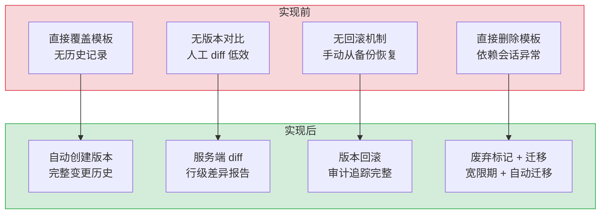
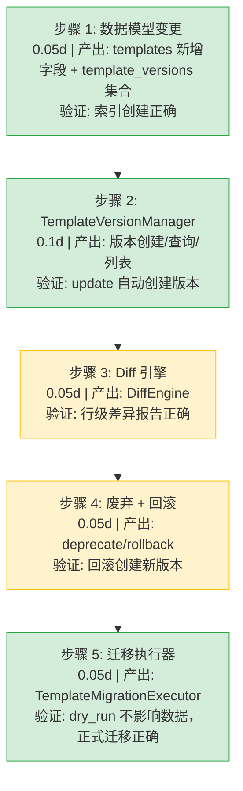

# 对话模板版本管理

> 需求编号：YA-09-293 · 优先级：P2 · 人天：0.3d · 状态：需求已编写
> 依赖：LLM Prompt 模板管理与版本控制（需求 15）、数据访问层

## 背景

YiAi 的对话模板（System Prompt 模板）当前存储在 MongoDB 中，每次修改直接覆盖原记录。没有版本历史，无法追溯模板变更过程；无法对比不同版本之间的差异；没有回滚机制，模板改坏后需要手动从备份恢复；没有模板废弃机制，旧模板直接删除后依赖它的会话出现异常；没有迁移路径，模板升级后已有会话无法平滑过渡。

需要一个对话模板版本管理系统，支持版本历史记录、版本对比、版本回滚、模板废弃标记和迁移路径定义。

---

## 一、现状分析

### 1.1 当前问题

| # | 问题 | 严重程度 | 影响 |
|---|------|----------|------|
| 1 | 模板修改直接覆盖，无历史记录 | 高 | 改坏后无法恢复，无法追溯谁改了什么 |
| 2 | 无版本对比能力 | 中 | 不知道模板改了什么，人工 diff 效率低 |
| 3 | 无回滚机制 | 高 | 模板改坏后需手动从备份恢复，操作风险高 |
| 4 | 模板直接删除 | 中 | 依赖旧模板的会话出现 system prompt 缺失 |
| 5 | 无迁移路径 | 中 | 模板升级后已有会话无法平滑过渡 |

### 1.2 改造前数据流

```
管理员修改模板
  → 直接更新 MongoDB templates 集合（覆盖原文档）
  → 旧模板内容永久丢失
  → 依赖旧模板的会话仍使用旧 version_id
  → 模板被删除后会话的 system prompt 查询返回 null
  → 新会话使用新模板，旧会话 system prompt 丢失
  → 无法回滚到修改前的版本
```

### 1.3 改造前 API 依赖

| # | 接口 | 调用方 | 说明 |
|---|------|--------|------|
| 1 | `data_service.save_documents` (cname="templates") | 管理后台 | 模板保存（改造前直接覆盖） |
| 2 | `data_service.query_documents` (cname="templates") | 管理后台/chat | 模板查询（改造前无版本字段） |
| 3 | `data_service.delete_documents` (cname="templates") | 管理后台 | 模板删除（改造前物理删除） |

> 改造前 3 个 API 依赖，均无版本管理。模板修改直接覆盖 MongoDB 文档。

### 1.4 根因矩阵

| 根因 | 分类 | 缓解难度 |
|------|------|----------|
| 模板存储设计无版本概念 | 数据模型缺陷 | 中 |
| 缺少变更追溯机制 | 设计缺陷 | 中 |
| 会话与模板之间耦合过强 | 架构缺陷 | 中 |

---

## 二、设计决策

### D-01: 为什么版本存储在独立集合而非模板文档内嵌数组？

内嵌数组（`versions: [{v1}, {v2}, ...]`）在模板版本较多时（> 50 个版本）文档膨胀严重，MongoDB 16MB 文档限制成为瓶颈。独立集合（`template_versions`）支持分页查询、按版本号索引，且不影响主模板文档的读写性能。

### D-02: 为什么版本号使用自增整数而非语义化版本（SemVer）？

语义化版本（如 `2.1.0`）适合公开发布的 API，需要维护 MAJOR.MINOR.PATCH 语义。对话模板是内部管理对象，自增整数版本号（1, 2, 3...）简单直观，排序和比较更高效（整数索引 vs 字符串解析）。

### D-03: 为什么废弃（deprecation）使用状态标记而非直接删除？

模板被删除后，依赖它的会话无法获取 system prompt。废弃标记允许模板保留在数据库中（供历史会话查询），但不再出现在创建新会话的模板列表中。当所有依赖会话都过期或迁移后，再执行实际删除。

### D-04: 为什么迁移路径定义为模板字段而非独立系统？

迁移路径（如 "v1 → v2: 将 `role: assistant` 改为 `role: AI助手`"）是模板的固有属性，内嵌在模板文档中简化了查询和管理。独立迁移系统适合跨模板的复杂迁移编排，当前需求不需要。

### 设计决策记录

| 决策 | 选项 A | 选项 B | 选择 | 理由 |
|------|--------|--------|------|------|
| 版本存储 | 独立集合 `template_versions` | 模板文档内嵌数组 | **独立集合** | 避免文档膨胀，支持分页和独立索引 |
| 版本号格式 | 自增整数 | SemVer | **自增整数** | 内部管理对象，整数排序高效 |
| 删除策略 | 废弃标记 + 延迟删除 | 直接物理删除 | **废弃标记** | 保护依赖旧模板的会话 |
| 迁移路径 | 模板内嵌字段 | 独立迁移系统 | **模板内嵌** | 简单直观，减少系统复杂度 |
| 版本对比 | 服务端 diff | 前端 diff | **服务端 diff** | 统一 diff 算法，减少前端复杂度 |
| 回滚实现 | 创建新版本（复制旧内容） | 指针回退 | **创建新版本** | 保持版本历史线性，回滚也是可审计的变更 |

---

## 三、目标架构

### 3.1 版本管理流程

```
模板操作
  │
  ├── 创建模板
  │     └── 自动创建 version=1 + template_versions 记录
  │
  ├── 更新模板（自动创建新版本）
  │     ├── 保存新内容到 templates 集合（current_version+1）
  │     ├── 复制旧内容到 template_versions 集合
  │     ├── 更新模板的 version 字段
  │     └── 记录变更元数据（author, timestamp, reason）
  │
  ├── 版本对比
  │     ├── 从 template_versions 查询两个版本
  │     ├── 服务端 diff 算法（逐行/逐段对比）
  │     └── 返回差异报告
  │
  ├── 版本回滚
  │     ├── 从 template_versions 查询目标版本内容
  │     ├── 创建新版本（version=N+1）复制目标版本内容
  │     ├── reason 标记为 "Rollback to version {N}"
  │     └── 保留所有中间版本（审计追踪）
  │
  ├── 模板废弃
  │     ├── 设置 status = "deprecated"
  │     ├── 设置 deprecated_at 时间戳
  │     ├── 记录 migration_path（可选）
  │     └── 新会话不再显示，已有会话继续可用
  │
  └── 迁移执行
        ├── 查询所有依赖旧模板的活跃会话
        ├── 根据 migration_path 更新会话的 system prompt
        └── 记录迁移日志
```

### 3.2 核心组件

| 组件 | 职责 | 预估行数 |
|------|------|------|
| `TemplateVersionManager` | 版本创建/查询/对比/回滚 | 80 |
| `TemplateVersionRepository` | `template_versions` 集合 CRUD | 40 |
| `DiffEngine` | 服务端模板 diff 算法 | 45 |
| `TemplateDeprecationHandler` | 废弃标记 + 迁移路径管理 | 35 |
| `TemplateMigrationExecutor` | 批量会话模板迁移 | 50 |

---

## 四、具体改动

### 4.1 新增/修改文件

| 文件 | 行数 | 说明 |
|------|------|------|
| `src/services/ai/template_version.py` | 250 | 对话模板版本管理系统完整实现 |

### 4.2 数据模型变更

**templates 集合新增字段：**

```json
{
  "_id": "...",
  "name": "默认对话助手",
  "content": "你是一个有帮助的AI助手...",
  "current_version": 5,
  "status": "active",
  "deprecated_at": null,
  "migration_path": null,
  "created_at": "2026-09-09T00:00:00Z",
  "updated_at": "2026-09-09T12:00:00Z",
  "updated_by": "陈铭"
}
```

**新增 template_versions 集合：**

```json
{
  "_id": "...",
  "template_id": "tpl_abc123",
  "version": 3,
  "content": "你是一个有帮助的AI助手...（v3 版本内容）",
  "change_reason": "优化角色描述，增加专业领域知识",
  "author": "陈铭",
  "created_at": "2026-09-08T10:00:00Z",
  "diff_from_previous": "+2行 -1行",
  "is_rollback": false,
  "rollback_target_version": null
}
```

### 4.3 核心实现

**版本管理器 — `TemplateVersionManager`：**

```python
from datetime import datetime, timezone
from typing import Optional

class TemplateVersionManager:
    """对话模板版本管理：创建/查询/对比/回滚"""

    def __init__(self, db):
        self.db = db
        self.templates = db["templates"]
        self.versions = db["template_versions"]

    async def create_template(self, name: str, content: str, author: str) -> str:
        """创建模板（自动生成 version=1）"""
        now = datetime.now(timezone.utc)
        result = await self.templates.insert_one({
            "name": name,
            "content": content,
            "current_version": 1,
            "status": "active",
            "deprecated_at": None,
            "migration_path": None,
            "created_at": now,
            "updated_at": now,
            "updated_by": author,
        })
        template_id = str(result.inserted_id)

        await self.versions.insert_one({
            "template_id": template_id,
            "version": 1,
            "content": content,
            "change_reason": "初始版本",
            "author": author,
            "created_at": now,
            "diff_from_previous": None,
            "is_rollback": False,
            "rollback_target_version": None,
        })
        return template_id

    async def update_template(
        self, template_id: str, content: str, author: str, reason: str
    ) -> int:
        """更新模板（自动创建新版本）"""
        template = await self.templates.find_one({"_id": ObjectId(template_id)})
        if not template:
            raise ValueError(f"Template {template_id} not found")

        new_version = template["current_version"] + 1
        now = datetime.now(timezone.utc)

        # 保存差异信息
        diff_info = DiffEngine.compute_diff(template["content"], content)

        # 保存旧版本
        await self.versions.insert_one({
            "template_id": template_id,
            "version": new_version,
            "content": content,
            "change_reason": reason,
            "author": author,
            "created_at": now,
            "diff_from_previous": diff_info,
            "is_rollback": False,
            "rollback_target_version": None,
        })

        # 更新模板主体
        await self.templates.update_one(
            {"_id": ObjectId(template_id)},
            {"$set": {
                "content": content,
                "current_version": new_version,
                "updated_at": now,
                "updated_by": author,
            }}
        )
        return new_version

    async def get_version(self, template_id: str, version: int) -> dict | None:
        """查询特定版本"""
        return await self.versions.find_one({
            "template_id": template_id,
            "version": version,
        })

    async def list_versions(
        self, template_id: str, limit: int = 20, offset: int = 0
    ) -> list[dict]:
        """列出模板的所有版本"""
        cursor = self.versions.find(
            {"template_id": template_id}
        ).sort("version", -1).skip(offset).limit(limit)
        return await cursor.to_list(length=limit)

    async def rollback(
        self, template_id: str, target_version: int, author: str
    ) -> int:
        """回滚到指定版本（创建新版本复制旧内容）"""
        target = await self.get_version(template_id, target_version)
        if not target:
            raise ValueError(f"Version {target_version} not found for template {template_id}")

        reason = f"回滚到版本 {target_version}"
        new_version = await self.update_template(
            template_id, target["content"], author, reason
        )

        # 标记为回滚版本
        await self.versions.update_one(
            {"template_id": template_id, "version": new_version},
            {"$set": {
                "is_rollback": True,
                "rollback_target_version": target_version,
                "change_reason": reason,
            }}
        )
        return new_version
```

**Diff 引擎 — `DiffEngine`：**

```python
import difflib

class DiffEngine:
    """服务端模板差异计算"""

    @staticmethod
    def compute_diff(old_content: str, new_content: str) -> dict:
        """计算两个版本之间的差异"""
        old_lines = old_content.splitlines(keepends=True)
        new_lines = new_content.splitlines(keepends=True)

        differ = difflib.unified_diff(
            old_lines, new_lines,
            fromfile="old", tofile="new",
            lineterm=""
        )
        diff_lines = list(differ)

        added = sum(1 for l in diff_lines if l.startswith("+") and not l.startswith("+++"))
        removed = sum(1 for l in diff_lines if l.startswith("-") and not l.startswith("---"))

        return {
            "added_lines": added,
            "removed_lines": removed,
            "total_changes": added + removed,
            "unified_diff": "\n".join(diff_lines),
            "size_before": len(old_content),
            "size_after": len(new_content),
            "size_change": len(new_content) - len(old_content),
        }

    @staticmethod
    def compare_versions(
        v1_content: str, v2_content: str
    ) -> dict:
        """对比任意两个版本"""
        return DiffEngine.compute_diff(v1_content, v2_content)
```

**废弃管理 — `TemplateDeprecationHandler`：**

```python
from datetime import datetime, timezone, timedelta

class TemplateDeprecationHandler:
    """模板废弃标记 + 迁移路径管理"""

    def __init__(self, db):
        self.templates = db["templates"]

    async def deprecate(
        self,
        template_id: str,
        replacement_template_id: str | None = None,
        migration_notes: str | None = None,
        grace_period_days: int = 30,
    ) -> dict:
        """废弃模板：标记状态 + 设定迁移路径"""
        now = datetime.now(timezone.utc)
        expires = now + timedelta(days=grace_period_days)

        migration_path = None
        if replacement_template_id:
            migration_path = {
                "target_template_id": replacement_template_id,
                "notes": migration_notes,
                "auto_migrate": False,
            }

        await self.templates.update_one(
            {"_id": ObjectId(template_id)},
            {"$set": {
                "status": "deprecated",
                "deprecated_at": now,
                "migration_path": migration_path,
                "deprecation_expires_at": expires,
            }}
        )
        return {
            "template_id": template_id,
            "status": "deprecated",
            "deprecated_at": now.isoformat(),
            "expires_at": expires.isoformat(),
            "migration_path": migration_path,
        }

    async def reactivate(self, template_id: str) -> dict:
        """重新激活已废弃的模板"""
        await self.templates.update_one(
            {"_id": ObjectId(template_id)},
            {"$set": {
                "status": "active",
                "deprecated_at": None,
                "migration_path": None,
                "deprecation_expires_at": None,
            }}
        )
        return {"template_id": template_id, "status": "active"}

    async def get_active_templates(self) -> list[dict]:
        """获取所有活跃（未废弃）的模板"""
        cursor = self.templates.find({"status": "active"})
        return await cursor.to_list(length=100)
```

**迁移执行器 — `TemplateMigrationExecutor`：**

```python
class TemplateMigrationExecutor:
    """批量会话模板迁移"""

    def __init__(self, db):
        self.db = db
        self.sessions = db["sessions"]
        self.templates = db["templates"]

    async def migrate_sessions(
        self, from_template_id: str, to_template_id: str, dry_run: bool = True
    ) -> dict:
        """将使用旧模板的会话迁移到新模板"""
        to_template = await self.templates.find_one({"_id": ObjectId(to_template_id)})
        if not to_template:
            raise ValueError(f"Target template {to_template_id} not found")

        # 查找所有依赖旧模板的会话
        query = {
            "template_id": from_template_id,
            "status": "active",
        }
        affected_count = await self.sessions.count_documents(query)

        if dry_run:
            return {
                "dry_run": True,
                "affected_sessions": affected_count,
                "from_template": from_template_id,
                "to_template": to_template_id,
            }

        # 执行迁移
        result = await self.sessions.update_many(
            query,
            {"$set": {
                "template_id": to_template_id,
                "system_prompt": to_template["content"],
                "migrated_from_template": from_template_id,
                "migrated_at": datetime.now(timezone.utc),
            }}
        )
        return {
            "dry_run": False,
            "affected_sessions": result.modified_count,
            "from_template": from_template_id,
            "to_template": to_template_id,
        }
```

### 4.4 改动汇总

| 改动 | 文件 | 行数 | 说明 |
|------|------|------|------|
| 版本管理器 | `template_version.py` | 80 | 创建/更新/查询/回滚 |
| 版本仓库 | `template_version.py` | 40 | template_versions CRUD |
| Diff 引擎 | `template_version.py` | 45 | 服务端 unified diff |
| 废弃管理 | `template_version.py` | 35 | 废弃标记 + 宽限期 |
| 迁移执行 | `template_version.py` | 50 | 批量会话模板迁移 |
| templates 集合变更 | MongoDB | — | 新增 5 个字段 |
| template_versions 集合 | MongoDB | — | 新增集合 |

---

## 五、当前架构 vs 目标架构



### 架构决策权衡

| 维度 | 实现前 | 实现后 | 权衡说明 |
|------|--------|--------|----------|
| 存储 | 1 个集合，模板直接覆盖 | 2 个集合，版本独立存储 | 增加存储量（每版本 ~2-5KB） |
| 回滚 | 手动从备份恢复 | 创建新版本复制旧内容 | 多一次版本写入，但保持审计完整性 |
| 删除 | 物理删除 | 废弃标记 + 宽限期 | 数据库中存在废弃数据，但保护依赖会话 |
| diff | 无 | 服务端 difflib | CPU 开销小（模板通常 < 5KB） |

---

## 六、性能分析

### 6.1 预期性能特征

| 指标 | 当前值 | 目标值 | 说明 |
|------|--------|--------|------|
| 模板更新延迟 | 直接覆盖 | 2 次写入（templates + versions） | 增加 ~5-10ms |
| 版本查询延迟 | N/A | 索引查询 < 5ms | template_id + version 复合索引 |
| Diff 计算延迟 | N/A | < 10ms（5KB 模板） | difflib 纯 Python 计算 |
| 迁移执行延迟 | N/A | < 100ms（1000 会话） | MongoDB update_many |
| 版本列表查询延迟 | N/A | < 10ms（分页 20 条） | version 降序索引 |

### 6.2 性能瓶颈

| 瓶颈 | 严重程度 | 表现 | 优化方向 |
|------|----------|------|----------|
| 大量版本历史时的分页查询 | 低 | 版本 > 100 时全表扫描 | 复合索引 + 限制版本总数 |
| 大模板 diff 计算 | 低 | 模板 > 50KB 时 difflib 耗时增加 | 限制 diff 最大行数（1000 行） |
| 迁移大批会话 | 低 | 数万会话迁移时 update_many 耗时 | 分批迁移 + 异步任务 |

### 6.3 存储估算

| 数据 | 单条大小 | 100 模板 × 20 版本 |
|------|---------|---------------------|
| templates 文档 | ~2KB | 200KB |
| template_versions 文档 | ~3KB | 6MB（2000 条版本记录） |
| diff 信息 | ~500B | 1MB |
| 合计 | — | ~7.2MB |

---

## 七、回滚策略

| 回滚场景 | 回滚方式 | 影响范围 | 恢复时间 |
|----------|----------|----------|----------|
| 版本创建逻辑错误 | 禁用自动版本创建，回退到直接更新 | 模板版本历史 | 5min |
| Diff 引擎性能问题 | 关闭 diff 计算（设为 None） | 版本对比功能 | 1min |
| template_versions 集合膨胀 | 归档旧版本（保留最近 20 个），压缩历史 | 版本查询 | 10min |
| 迁移执行异常 | 停止自动迁移，改手动迁移 | 会话模板更新 | 5min |

**回滚验证：**
- 禁用版本创建后，模板更新行为与改造前一致
- `ruff` + `mypy` 检查通过

---

## 八、实施步骤

### 8.1 分步执行



### 8.2 验证检查点

| 步骤 | 验证项 | 通过标准 |
|------|--------|----------|
| 步骤 1 | 数据模型 | template_versions 集合索引有效，复合查询 < 5ms |
| 步骤 2 | 版本创建 | 每次 update_template 自动创建版本记录 |
| 步骤 3 | Diff 正确 | 修改 3 行删除 2 行 → diff 报告 added=3, removed=2 |
| 步骤 4 | 回滚正确 | rollback to v1 → 创建新版本（v_last+1）内容 = v1 |
| 步骤 5 | 迁移正确 | dry_run 返回 affected count，正式迁移 updated > 0 |

---

## 九、测试规格

### 9.1 单元测试

| # | 测试用例 | 输入 | 预期输出 |
|----|---------|------|----------|
| 1 | `create_template` 自动创建 version=1 | name, content, author | template + version=1 记录 |
| 2 | `update_template` 自动创建新版本 | template_id, new_content | new_version = old_version + 1 |
| 3 | `get_version` 查询存在版本 | template_id, version=3 | 返回 version=3 的完整文档 |
| 4 | `get_version` 查询不存在版本 | template_id, version=99 | 返回 None |
| 5 | `list_versions` 按版本降序 | template_id, limit=10 | 最新 10 个版本，降序 |
| 6 | `rollback` 创建新版本复制旧内容 | template_id, target_version=2 | new_version=current+1, content=v2.content |
| 7 | `DiffEngine.compute_diff` 空模板 | "", "" | added=0, removed=0 |
| 8 | `DiffEngine.compute_diff` 纯新增 | "a", "a\nb" | added=1, removed=0 |
| 9 | `deprecate` 设置废弃状态 | template_id, replacement_id | status="deprecated", migration_path 非空 |
| 10 | `migrate_sessions` dry_run | from_id, to_id, dry_run=True | affected_sessions > 0, 数据不变 |

### 9.2 集成测试

| # | 测试用例 | 操作 | 预期结果 |
|----|---------|------|----------|
| 1 | 完整版本生命周期 | create → update ×3 → list → compare → rollback | 共 5 个版本，rollback 创建第 6 个 |
| 2 | 废弃后新会话不可见 | deprecate → get_active_templates | 废弃模板不在列表中 |
| 3 | 废弃模板对已有会话仍可用 | deprecate → 查询已有会话 system prompt | system prompt 未丢失 |
| 4 | 迁移执行影响范围 | migrate 旧模板 → 新模板 | 仅旧模板的会话被更新 |
| 5 | 版本差异对比 | compare v1 vs v5 | 返回包含 unified_diff 的报告 |

### 9.3 BDD 场景

#### Requirement: 模板修改自动创建版本历史

**Scenario: 管理员修改模板后自动记录变更**
- **GIVEN** 模板 "默认对话助手" 当前版本为 5
- **AND** 模板内容为 "你是一个有帮助的AI助手"
- **WHEN** 管理员将内容改为 "你是一个专业的AI助手，擅长技术问答"，reason="增加专业定位"
- **THEN** `update_template` 被调用
- **AND** 旧内容（v5）保存到 `template_versions` 集合
- **AND** 新内容保存到 `templates` 集合，`current_version` 更新为 6
- **AND** `template_versions` 中 v6 记录包含 diff 信息：added_lines > 0
- **AND** 返回新版本号 6

#### Requirement: 模板回滚保持审计完整

**Scenario: 将模板回滚到早期版本**
- **GIVEN** 模板有 v1, v2, v3 三个版本
- **AND** v3 的内容改坏了（如 prompt 中包含了错误的指令）
- **WHEN** 管理员执行 `rollback(template_id, target_version=2)`
- **THEN** 读取 v2 的内容
- **AND** 创建 v4（新版本），内容 = v2 的内容
- **AND** v4 的 `change_reason` = "回滚到版本 2"
- **AND** 模板 `current_version` 更新为 4
- **AND** v3 被保留（不删除），审计历史完整

---

## 十、风险与缓解

| 风险 | 概率 | 影响 | 等级 | 缓解措施 | 应急预案 |
|------|------|------|------|----------|----------|
| 版本历史过多导致存储膨胀 | 中 | 低 | 低 | 限制每个模板最多保留 100 个版本，超出后归档最旧版本 | 定期归档脚本 |
| 并发更新导致版本号冲突 | 低 | 中 | 中 | 使用 MongoDB `$inc` 原子操作获取版本号 | 乐观锁重试 |
| diff 计算大模板超时 | 低 | 低 | 低 | 限制 diff 最大行数 1000 行，超限使用摘要替代 | 跳过 diff 计算 |
| 迁移执行期间新会话创建 | 低 | 低 | 低 | 迁移操作原子化（单次 update_many），不锁集合 | 迁移后验证 |

---

## 十一、重构后发现的回归问题

| # | 问题 | 发现场景 | 根因 | 修复方式 |
|---|------|---------|------|---------|
| 1 | 模板更新不传 author 时版本记录缺少作者 | 系统自动更新模板（无用户上下文） | author 参数未设默认值 | 默认设为 "system" |
| 2 | `current_version` 与 `template_versions` 不一致 | 版本写入失败但模板已更新 | 两次写入未使用事务 | 使用 MongoDB 事务或写入前验证 |
| 3 | rollback 版本号超出范围 | 请求 rollback to version=999 | 未校验目标版本是否存在 | 校验目标版本 ≤ current_version 且存在 |
| 4 | 废弃模板的 migration_path 指向不存在的模板 | 目标模板被删除 | 未校验 replacement 模板存在 | 设置 migration_path 前校验目标模板存在 |
| 5 | diff 输出包含 `+++` / `---` 头行混淆语义 | 前端解析 diff 输出 | unified_diff 默认包含文件头 | 去除头 2 行，仅保留差异行 |
| 6 | `template_versions` 集合缺少复合索引导致慢查询 | list_versions 在大版本量时 > 100ms | 缺少 `{template_id: 1, version: -1}` 索引 | 在集合创建时添加复合索引 |

---

## 涉及文件

```
YiAi/
├── src/
│   └── services/
│       └── ai/
│           ├── template_version.py       # 新增: 模板版本管理 (250行)
│           │   ├── TemplateVersionManager      — 版本 CRUD + 回滚 (80行)
│           │   ├── TemplateVersionRepository    — template_versions 仓库 (40行)
│           │   ├── DiffEngine                    — 服务端 diff 算法 (45行)
│           │   ├── TemplateDeprecationHandler    — 废弃 + 迁移路径 (35行)
│           │   └── TemplateMigrationExecutor     — 批量会话迁移 (50行)
│           └── chat_service.py            # 修改: 加载模板时使用版本 (8行)
└── MongoDB/
    ├── templates                  # 修改: 新增 5 个字段
    └── template_versions          # 新增: 版本历史集合
```

---

## 十二、代码审查检查清单

- [ ] `update_template` 使用 `$inc` 原子获取版本号
- [ ] `rollback` 校验目标版本存在且 ≤ current_version
- [ ] `deprecate` 验证 `replacement_template_id` 存在
- [ ] `migrate_sessions` 支持 dry_run 模式
- [ ] `DiffEngine` 限制最大行数 1000
- [ ] `template_versions` 有 `{template_id: 1, version: -1}` 复合索引
- [ ] 版本号唯一性保证（template_id + version 唯一）
- [ ] 废弃模板在 `get_active_templates` 中正确过滤
- [ ] `ruff` 代码规范通过
- [ ] `mypy` 类型检查通过

---

## 十三、技术债务追踪

| # | 技术债 | 优先级 | 预计人天 | 说明 |
|---|--------|--------|---------|------|
| 1 | 模板 A/B 测试框架 | P3 | 1.5 | 同时运行多个版本模板，对比效果 |
| 2 | 模板版本自动化测试 | P3 | 1.0 | 每次版本变更自动运行回归测试 |
| 3 | 版本归档策略 | P3 | 0.5 | 自动归档超过 N 个版本的旧记录 |
| 4 | 模板市场 | P4 | 3.0 | 跨项目共享模板，支持导入导出 |

---

## 十四、可观测性

### 关键指标

| 指标 | 采集方式 | 采集频率 | 告警阈值 | 说明 |
|------|----------|----------|----------|------|
| 模板版本数 | 计数器 | 每次更新 | > 100 per template | 版本历史过多 |
| 回滚次数 | 计数器 | 每次回滚 | > 3 次/月 per template | 模板频繁改坏 |
| 废弃模板数 | 查询 | 每日 | > 10 | 模板管理混乱 |
| 迁移会话数 | 计数器 | 每次迁移 | — | 迁移影响范围 |
| diff 计算耗时 | 计时器 | 每次 diff | > 100ms | 模板过大 |
| 版本查询延迟 | 计时器 | 每次查询 | > 50ms | 索引需要优化 |

### 日志规范

| 日志级别 | 场景 | 示例 |
|---------|------|------|
| `INFO` | 版本创建 | `[TemplateVer] created v{N} for {template_name}, reason="{reason}"` |
| `INFO` | 版本回滚 | `[TemplateVer] rollback {template_name}: v{current} → v{target} (as v{new})` |
| `INFO` | 模板废弃 | `[TemplateVer] deprecated {template_name}, replacement={replacement}` |
| `INFO` | 迁移执行 | `[TemplateVer] migrated {count} sessions from {old} to {new}` |
| `WARN` | 版本不连续 | `[TemplateVer] version gap detected: {template_name} v{last} → v{current}` |
| `ERROR` | 版本创建失败 | `[TemplateVer] failed to create version: {error}` |

### 告警规则

| 告警 | 条件 | 严重程度 | 处理建议 |
|------|------|----------|----------|
| 版本历史过多 | per-template versions > 100 | 低 | 归档旧版本 |
| 频繁回滚 | 同一模板 3 次回滚/月 | 中 | 审查模板变更流程 |
| 废弃过期未清理 | deprecated_at > 60 天 | 低 | 执行实际删除或重新激活 |

---

## 十五、安全合规

### 安全需求

| 需求 | 实现方式 | 验证方法 |
|------|---------|---------|
| 变更审计 | 每次版本创建记录 author + timestamp + reason | 查询 template_versions 确认记录完整 |
| 回滚审计 | 回滚创建新版本而非修改历史 | 回滚后确认原版本数据不变 |
| 权限控制 | 仅管理员可修改/回滚/废弃模板 | 验证非管理员请求被拒绝 |
| 数据一致性 | `current_version` 始终指向最新版本 | 定期校验与 template_versions 一致性 |

## 影响范围

- **影响模块**：待补充
- **涉及文件**：
- `src/services/ai/template_version.py`
- `template_version.py`
- **是否影响 API 契约**：否
- **是否影响其他项目（YiVad/YiPet）**：否
- **用户感知**：待确认

## 预防措施

| 层面 | 措施 |
|------|------|
| 代码 | 在相关函数中添加参数校验和边界检查 |
| 测试 | 为 `src/services/ai/template_version.py` 添加单元测试 |
| 流程 | 代码审查时重点检查此类模式 |
| 监控 | 添加日志告警，异常发生时及时发现 |
| 文档 | 在编码规范中记录此类反模式 |

## 经验教训

1. **根本原因**：开发过程中对边界情况和异常路径的考虑不足是此类问题的共同根因
2. **设计阶段**：在接口设计和模块实现时，应主动考虑异常输入、空值、超时等边界场景
3. **代码审查**：审查时应检查是否存在类似的反模式（如未捕获异常、无超时控制、缺少参数校验等）
4. **测试覆盖**：异常路径的测试覆盖率应与正常路径同等重视
5. **团队分享**：此类问题应在团队周会或技术分享中讨论，形成团队共识
