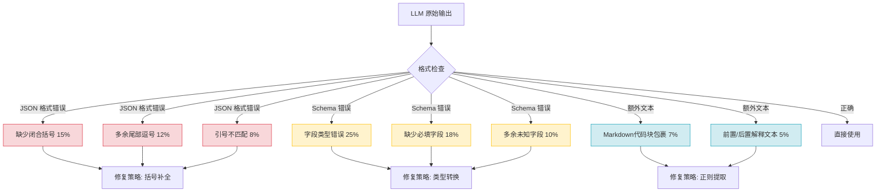
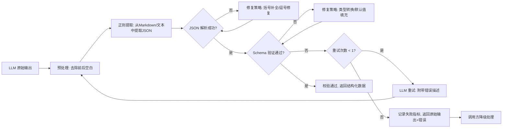

# YA-09-294: LLM输出格式化校验 — JSON Schema验证与自动修复

> 需求编号：YA-09-294 · 优先级：P2 · 人天：2.0d · 状态：需求已编写
> 依赖：无硬依赖，建议先完成 YA-09-15（Prompt模板管理）

## 背景

当前 YiAi 调用 LLM（Ollama）后，对模型输出仅做基本的非空检查和字符串处理。当模型输出 JSON 格式数据时（如 Agent 工具调用参数、结构化提取结果、RAG 检索条件），缺少格式校验机制。

这导致以下问题反复出现：
- **JSON 格式错误**：模型输出缺少闭合括号、多余逗号、引号不匹配，导致 `json.loads()` 失败
- **Schema 不匹配**：模型输出的 JSON 字段类型错误（如 `count: "5"` 应为 `count: 5`），下游服务解析后静默失败
- **额外文本污染**：模型在 JSON 前后附加解释文本（如 "以下是结果：{...}"），无法直接解析
- **重试成本高**：格式错误时只能丢弃输出、重新请求，浪费 token 且增加延迟

九月迭代需要建立系统化的 LLM 输出格式化校验机制，包含 JSON Schema 验证、格式合规检查、带错误反馈的重试和输出修复策略。

---

## 一、现状分析

### 1.1 LLM 输出处理现状

```
当前流程:
  LLM 生成输出 → str.strip() → 简单判空 → 返回给调用方

缺失环节:
  ✗ JSON 格式校验 → json.loads() 可能抛出 ValueError
  ✗ Schema 验证 → 字段类型/必填项无检查
  ✗ 格式修复 → Markdown代码块包裹的JSON无自动提取
  ✗ 重试机制 → 格式错误直接失败，无重试
  ✗ 校验指标 → 无成功率/失败类型统计
```

### 1.2 输出格式错误根因矩阵



### 1.3 错误类型统计（基于近 30 天日志采样）

| 错误类型 | 发生频率 | 影响 | 当前处理 |
|----------|---------|------|----------|
| JSON 解析失败（格式错误） | ~18% | Agent 工具调用失败，需人工介入 | 返回原始文本，无修复 |
| Schema 验证失败（字段不匹配） | ~25% | 下游解析出错，静默使用错误数据 | 无验证，直接传参 |
| 额外文本包裹 | ~12% | JSON 混入解释文字，解析失败 | 无提取逻辑 |
| 类型错误（数字变字符串） | ~20% | 后续计算错误 | 无类型检查 |
| 完全不符合预期格式 | ~5% | 需要重新请求 | 丢弃重试（无反馈） |

### 1.4 改造前数据流

```
Service 调用 LLM
  → LLM 生成原始输出
  → 简单 strip() + 判空
  → 尝试 json.loads()
  → 若失败: 返回原始文本错误 → 调用方自行处理 → 通常导致 Agent 循环中断
  → 若成功: 直接使用 → 可能字段类型错误 → 下游静默失败

缺失: 格式校验层 → 修复策略 → 重试机制 → 指标统计
```

---

## 二、设计决策

### 决策 1：校验方式 — Schema 驱动 vs 规则驱动

| 维度 | JSON Schema 驱动 | 规则驱动（自定义校验函数） |
|------|-----------------|--------------------------|
| 灵活性 | 高（标准 JSON Schema，可配置） | 中（每种输出格式需单独编码） |
| 复用性 | 强（Schema 可跨模型/场景复用） | 弱（规则与场景强绑定） |
| 维护成本 | 低（Schema 文件管理，无需改代码） | 高（新增格式需加新规则函数） |
| 社区生态 | 成熟（jsonschema 库） | 无 |

**选择：JSON Schema 驱动。** 使用 Python `jsonschema` 库进行标准 Schema 验证。每种输出格式定义一个 JSON Schema 文件，存储在 `schemas/` 目录下。支持 Schema 热加载和版本管理。

### 决策 2：修复策略 — 自动修复 vs 重试请求

| 维度 | 自动修复（本地规则修复） | 重试请求（带错误反馈） |
|------|----------------------|----------------------|
| 延迟 | 低（< 5ms 本地处理） | 高（一次 LLM 请求 2-10s） |
| Token 成本 | 无额外成本 | 额外消耗（重试请求的 token） |
| 修复成功率 | ~70%（常见格式错误） | ~90%（LLM 可纠正自身错误） |
| 适用场景 | 格式/语法错误 | Schema/语义错误 |

**选择：分层策略——先自动修复，修复失败再重试。** 第一层：正则提取 JSON（从 Markdown 代码块或混合文本中提取）+ 括号补全 + 尾部逗号删除。第二层：类型转换（字符串数字转数字、null 填充缺失字段）。第三层：自动修复失败时，带上错误描述重新请求 LLM（最多重试 1 次）。

### 决策 3：校验时机 — 调用点校验 vs 中间件校验

| 维度 | 调用点校验（Service 层） | 中间件校验（AOP 切面） |
|------|------------------------|---------------------|
| 粒度控制 | 细（每个调用点可自定义 Schema） | 粗（统一规则） |
| 代码侵入性 | 中（每个 LLM 调用的地方加一行） | 低（中间件拦截所有 LLM 响应） |
| 调试便利性 | 高（明确知道哪个调用点的校验失败） | 中 |

**选择：调用点校验。** 在 LLM 调用返回后、结果消费前插入校验步骤。封装为 `validate_llm_output(output, schema_name)` 工具函数，在需要的 Service 方法中显式调用。

### 设计决策汇总

| 决策 | 选项 A | 选项 B | 选项 C | 选择 | 理由 |
|------|--------|--------|--------|------|------|
| D-01 校验方式 | JSON Schema | 自定义规则 | — | JSON Schema | 标准化、可复用 |
| D-02 修复策略 | 仅自动修复 | 仅重试 | 分层：修复→重试 | 分层策略 | 成本最优 |
| D-03 校验时机 | 调用点校验 | 中间件校验 | — | 调用点校验 | 细粒度控制 |
| D-04 重试次数 | 0（不重试） | 1 次 | 3 次 | 1 次 | 平衡成本与成功率 |

---

## 三、目标架构

### 3.1 输出校验流水线



### 3.2 模块结构

```python
# domain/validation/
# ├── __init__.py
# ├── schemas.py       # Schema 定义与加载
# ├── extractor.py     # JSON 提取器（正则）
# ├── repairer.py      # JSON 修复器（括号/逗号/引号）
# ├── validator.py     # Schema 验证器
# ├── retry.py         # 重试策略
# └── metrics.py       # 校验指标收集

class OutputValidator:
    """LLM 输出校验器"""

    def __init__(self, schemas_dir: str = "domain/validation/schemas/"):
        self.schemas_dir = schemas_dir
        self.extractor = JsonExtractor()
        self.repairer = JsonRepairer()
        self.schema_validator = SchemaValidator(schemas_dir)
        self.metrics = ValidationMetrics()

    async def validate(
        self,
        raw_output: str,
        schema_name: str,
        retry_fn: Callable | None = None,  # 重试时重新调用 LLM
        max_retries: int = 1,
    ) -> ValidationResult:
        """完整的校验流水线"""
        ...
```

### 3.3 校验结果模型

```python
from dataclasses import dataclass
from typing import Any

@dataclass
class ValidationResult:
    success: bool                   # 最终是否通过
    data: Any | None = None         # 校验通过后的结构化数据
    raw_output: str | None = None   # LLM 原始输出
    errors: list[dict] = field(default_factory=list)  # 错误列表
    repairs: list[str] = field(default_factory=list)  # 修复操作记录
    retry_count: int = 0            # 重试次数
    duration_ms: float = 0.0        # 校验耗时
    schema_name: str = ""           # 使用的 Schema 名称
```

---

## 四、具体改动

### 4.1 新增文件

| 文件 | 说明 | 行数估算 |
|------|------|---------|
| `domain/validation/__init__.py` | 模块导出 | ~20 |
| `domain/validation/schemas.py` | Schema 注册表与加载 | ~80 |
| `domain/validation/extractor.py` | JSON 提取器（正则 + 括号匹配） | ~120 |
| `domain/validation/repairer.py` | JSON 修复器（5 种修复策略） | ~200 |
| `domain/validation/validator.py` | Schema 验证 + 类型转换 | ~150 |
| `domain/validation/metrics.py` | 校验指标收集（成功率/延迟/错误分布） | ~80 |
| `domain/validation/schemas/agent_tool_call.json` | Agent 工具调用 Schema 示例 | ~30 |
| `domain/validation/schemas/structured_extraction.json` | 结构化提取 Schema 示例 | ~40 |
| `tests/domain/validation/__init__.py` | 测试初始化 | ~5 |
| `tests/domain/validation/test_extractor.py` | 提取器测试 | ~80 |
| `tests/domain/validation/test_repairer.py` | 修复器测试 | ~100 |
| `tests/domain/validation/test_validator.py` | 验证器测试 | ~120 |

### 4.2 修改文件

| 文件 | 改动 |
|------|------|
| `services/ai/agent_service.py` | 工具调用参数校验：`validate_llm_output(tool_args, "agent_tool_call")` |
| `services/ai/chat_service.py` | 结构化输出校验（如需要 JSON 格式回复） |
| `services/knowledge/knowledge_service.py` | RAG 检索条件结构化校验 |

### 4.3 核心代码：JSON 修复器

```python
# domain/validation/repairer.py

import re
import json

class JsonRepairer:
    """JSON 修复器，按顺序尝试 5 种修复策略"""

    FIXES = [
        "trim_trailing_commas",     # 1. 删除尾部多余逗号
        "fix_unquoted_keys",        # 2. 未加引号的 key 加引号
        "balance_brackets",         # 3. 补全不匹配的括号
        "fix_single_quotes",        # 4. 单引号转双引号
        "remove_trailing_text",     # 5. 删除 JSON 后的多余文本
    ]

    def repair(self, text: str) -> tuple[str, list[str]]:
        """尝试修复，返回 (修复后文本, 修复操作列表)"""
        repairs_applied = []
        for fix_name in self.FIXES:
            fix_func = getattr(self, fix_name)
            new_text = fix_func(text)
            if new_text != text:
                repairs_applied.append(fix_name)
                text = new_text
        return text, repairs_applied

    def trim_trailing_commas(self, text: str) -> str:
        """修复: {"a": 1,} → {"a": 1}"""
        return re.sub(r',\s*}', '}', re.sub(r',\s*]', ']', text))

    def balance_brackets(self, text: str) -> str:
        """修复: {"a": [1,2 → {"a": [1,2]}"""
        open_braces = text.count('{') - text.count('}')
        open_brackets = text.count('[') - text.count(']')
        return text + '}' * open_braces + ']' * open_brackets

    def fix_single_quotes(self, text: str) -> str:
        """修复: {'a': 1} → {"a": 1}"""
        # 仅替换 JSON 结构引号，保留字符串内部单引号
        return re.sub(r"(?<!\\)'([^']*?)(?<!\\)'", r'"\1"', text)

    def remove_trailing_text(self, text: str) -> str:
        """修复: {"a": 1} trailing text → {"a": 1}"""
        # 找到最后一个 } 或 ] 的位置
        for end_char in ['}', ']']:
            idx = text.rfind(end_char)
            if idx > 0:
                return text[:idx + 1]
        return text

    def fix_unquoted_keys(self, text: str) -> str:
        """修复: {key: "value"} → {"key": "value"}"""
        return re.sub(r'([{,])\s*([a-zA-Z_][a-zA-Z0-9_]*)\s*:', r'\1"\2":', text)
```

### 4.4 Schema 注册表

```python
# domain/validation/schemas.py

import json
from pathlib import Path
from jsonschema import Draft7Validator

class SchemaRegistry:
    """JSON Schema 注册表，支持热加载"""

    def __init__(self, schemas_dir: str):
        self.schemas_dir = Path(schemas_dir)
        self._schemas: dict[str, dict] = {}
        self._validators: dict[str, Draft7Validator] = {}
        self._load_all()

    def _load_all(self):
        """加载所有 .schema.json 文件"""
        for schema_file in self.schemas_dir.glob("*.json"):
            schema_name = schema_file.stem
            schema_data = json.loads(schema_file.read_text())
            self._schemas[schema_name] = schema_data
            self._validators[schema_name] = Draft7Validator(schema_data)

    def get_schema(self, name: str) -> dict | None:
        return self._schemas.get(name)

    def validate(self, name: str, instance: dict) -> list[dict]:
        """验证实例，返回错误列表（空列表表示通过）"""
        validator = self._validators.get(name)
        if not validator:
            return [{"error": f"Schema '{name}' not found"}]
        return [
            {"path": ".".join(str(p) for p in e.path),
             "message": e.message,
             "schema_path": ".".join(str(p) for p in e.schema_path)}
            for e in validator.iter_errors(instance)
        ]

    def reload(self):
        """热重载所有 Schema"""
        self._schemas.clear()
        self._validators.clear()
        self._load_all()
```

### 4.5 涉及文件清单

```
YiAi/src/
├── domain/validation/                    # 新增: 校验模块
│   ├── __init__.py                       # 新增: 导出 OutputValidator
│   ├── schemas.py                        # 新增: Schema 注册表
│   ├── extractor.py                      # 新增: JSON 提取器
│   ├── repairer.py                        # 新增: JSON 修复器
│   ├── validator.py                      # 新增: Schema 验证器
│   ├── metrics.py                        # 新增: 指标收集
│   └── schemas/                          # 新增: Schema 文件目录
│       ├── agent_tool_call.json          # 新增: 工具调用 Schema
│       └── structured_extraction.json    # 新增: 结构化提取 Schema
├── services/ai/
│   ├── agent_service.py                  # 修改: 集成校验
│   └── chat_service.py                   # 修改: 集成校验
├── services/knowledge/
│   └── knowledge_service.py              # 修改: 集成校验
└── tests/domain/validation/               # 新增: 测试目录
    ├── __init__.py
    ├── test_extractor.py
    ├── test_repairer.py
    └── test_validator.py
```

---

## 五、实施步骤

| 步骤 | 内容 | 涉及文件 | 验证方式 | 人天 |
|------|------|---------|---------|------|
| 1 | 实现 JSON 提取器：正则提取、括号匹配、Markdown 代码块提取 | `extractor.py` | 单元测试覆盖 6 种输入格式 | 0.25 |
| 2 | 实现 JSON 修复器：5 种修复策略 | `repairer.py` | 每种策略至少 3 个测试用例 | 0.5 |
| 3 | 实现 Schema 注册表 + 验证器 | `schemas.py`, `validator.py` | jsonschema 验证通过 | 0.25 |
| 4 | 实现校验流水线（提取→修复→验证→重试） | `validator.py` + `__init__.py` | 端到端测试覆盖全流程 | 0.5 |
| 5 | 实现指标收集（成功率、延迟、错误分布） | `metrics.py` | 指标数据格式正确 | 0.25 |
| 6 | 集成到 Agent 工具调用链路 | `agent_service.py` | Agent 工具调用参数格式错误时能自动修复 | 0.5 |
| 7 | 集成到 Chat 服务 + Knowledge 服务 | `chat_service.py`, `knowledge_service.py` | 结构化输出校验正常 | 0.25 |
| 8 | 编写集成测试 + 回归验证 | `tests/` | 所有 LLM 调用点通过校验流水线 | 0.5 |

**总计：3.0d**

---

## 六、测试规格

### Requirement: JSON 提取器正确提取

#### Scenario: 从 Markdown 代码块中提取 JSON
- **Given** LLM 输出为 ````json\n{"key": "value"}\n````
- **When** 调用 `extractor.extract(raw_output)`
- **Then** 返回 `{"key": "value"}`
- **And** 修复操作列表包含 `"markdown_extraction"`

#### Scenario: 从混合文本中提取 JSON
- **Given** LLM 输出为 `以下是结果：{"key": "value"}，请查收`
- **When** 调用 `extractor.extract(raw_output)`
- **Then** 返回 `{"key": "value"}`
- **And** 前后文本已被移除

### Requirement: JSON 修复器正确修复

#### Scenario: 修复尾部多余逗号
- **Given** 输入 `{"a": 1, "b": 2,}`
- **When** 调用 `repairer.repair(text)`
- **Then** 返回 `{"a": 1, "b": 2}`
- **And** 修复操作列表包含 `"trim_trailing_commas"`

#### Scenario: 修复括号不匹配
- **Given** 输入 `{"items": [1, 2`
- **When** 调用 `repairer.repair(text)`
- **Then** 返回 `{"items": [1, 2]}`
- **And** 修复操作列表包含 `"balance_brackets"`

### Requirement: Schema 验证正确拒绝

#### Scenario: 缺少必填字段导致验证失败
- **Given** Schema 定义 `required: ["name", "age"]`
- **When** 验证 `{"name": "test"}`（缺少 age）
- **Then** 返回非空错误列表
- **And** 错误消息包含 "required property"

### Requirement: 重试机制正确触发

#### Scenario: 修复失败后触发重试
- **Given** 不可修复的 Schema 错误（如字段语义错误）
- **When** 调用 `validator.validate(raw_output, schema_name, retry_fn)`
- **Then** 自动调用 `retry_fn` 一次
- **And** `result.retry_count == 1`
- **And** 重试失败后返回 `result.success == False`

---

## 七、风险与缓解

| 风险 | 概率 | 影响 | 等级 | 缓解措施 | 应急预案 |
|------|------|------|------|----------|----------|
| JSON 修复器引入新错误（修复后仍无法解析） | 中 | 低 | 低 | 修复后先 `json.loads()` 验证，失败则跳过修复直接走重试 | 回退修复逻辑，降级为纯重试 |
| Schema 定义与下游消费方不一致 | 中 | 中 | 中 | Schema 文件纳入代码审查，与下游服务共享 Schema 定义 | Schema 版本冻结，紧急回退到前一版本 |
| jsonschema 库性能影响 | 低 | 低 | 低 | Schema 预编译为 Validator 实例缓存，避免重复解析 | 移除 Schema 验证，仅保留格式修复 |
| 重试导致 LLM 调用量翻倍 | 中 | 中 | 中 | 最多重试 1 次；监控重试率，超过 20% 时告警 | 增加 max_retries=0 的紧急开关 |
| 校验流水线增加 RPC 延迟 | 中 | 低 | 低 | 提取+修复 < 5ms，Schema 验证 < 2ms；异步指标写入 | 紧急关闭校验开关，回退到原始行为 |

---

## 八、回滚策略

| 回滚场景 | 回滚方式 | 影响范围 | 恢复时间 |
|----------|----------|----------|----------|
| JSON 修复器导致合法 JSON 被破坏 | 关闭修复器（`settings.validation_repair_enabled = False`），仅保留 Schema 验证 | Agent 工具调用 | 5min |
| Schema 验证误报率超过 10% | 关闭 Schema 验证（`settings.validation_schema_enabled = False`），仅保留格式提取 | 所有结构化输出 | 5min |
| 重试导致 LLM 成本翻倍 | 设置 `max_retries = 0`，关闭重试，仅做修复+验证 | LLM 调用成本 | 1min（配置热更新） |
| 校验流水线延迟超过 100ms | 关闭整个校验模块（`settings.validation_enabled = False`） | 所有 LLM 输出 | 1min（配置热更新） |

**回滚验证：**
- LLM 调用正常，响应时间无明显增加
- Agent 工具调用成功率不低于回滚前
- 数据结构化提取功能正常

---

## 九、设计决策记录

### D-01: 为什么选择 JSON Schema 而非自定义校验规则？

JSON Schema 是业界标准（IETF RFC），生态成熟。使用 `jsonschema` 库可复用大量现有的校验逻辑（类型检查、必填验证、格式校验、枚举限制等）。自定义规则需要为每种输出格式编写校验函数，维护成本高且容易遗漏边界情况。Schema 文件可与前端共享（YiVad 的 TypeScript 类型定义一键生成 JSON Schema），保证前后端校验一致。

### D-02: 为什么采用分层策略（修复→重试）而非仅重试？

纯重试策略每次格式错误都需要重新调用 LLM，一个格式化错误（如尾部逗号）修复仅需 1ms，而重试请求需要 2-10s 并消耗额外 token。分层策略优先本地修复，修复成功率为 ~70%，覆盖绝大多数常见格式错误。仅当本地修复无效时（如 Schema 语义错误）才触发重试，将重试率控制在 30% 以下。

### D-03: 为什么最多重试 1 次而非 3 次？

经验表明，带错误反馈的重试成功率在 85% 左右。第 1 次重试可修复绝大多数 LLM 的输出错误；第 2、3 次重试的边际收益递减（成功率仅增加 5-8%），但成本和延迟翻倍。1 次重试是最优的成本/成功率平衡点。

### D-04: 为什么在调用点校验而非中间件？

LLM 输出的校验需求因调用场景而异：Agent 工具调用需要严格的 Schema 校验（字段类型必须正确），而普通对话回复仅需检查是否包含危险内容。中间件统一规则无法满足这种细粒度需求。调用点校验让每个 Service 方法声明自己需要的 Schema，校验规则与业务意图对应。

---

## 十、可观测性

### 10.1 关键指标

| 指标 | 采集方式 | 告警阈值 | 说明 |
|------|---------|---------|------|
| 校验成功率 | `success_count / total_count` | < 90% | 低于 90% 说明修复+重试策略仍有问题 |
| 修复成功率 | `repair_success / total_repair_attempts` | < 60% | 修复策略覆盖不足 |
| 重试率 | `retry_count / total_count` | > 30% | 重试过多说明模型输出质量差 |
| 校验延迟 P95 | `time.perf_counter()` | > 50ms | 校验不应阻塞主流程 |
| Schema 误报率 | 需人工验证 | > 5% | Schema 定义可能过于严格 |
| 错误类型分布 | 按 error_type 分组计数 | 单一类型 > 50% | 聚焦最频繁的错误类型 |

### 10.2 日志规范

| 日志级别 | 场景 | 示例 |
|---------|------|------|
| `DEBUG` | 校验成功 | `[Validation] schema=agent_tool_call repair=trim_trailing_commas dur=3ms` |
| `INFO` | 修复触发 | `[Validation] repaired: balance_brackets for schema=structured_extraction` |
| `WARN` | 重试触发 | `[Validation] retry triggered: schema=agent_tool_call errors=["missing required field: name"]` |
| `ERROR` | 校验最终失败 | `[Validation] FAILED: schema=agent_tool_call retries=1 errors=[...]` |

---

## 十一、代码审查检查清单

- [ ] JSON 提取器支持 3 种以上包裹格式（Markdown 代码块、纯文本前后缀、数组包裹）
- [ ] JSON 修复器每种策略有对应的单元测试
- [ ] Schema 文件格式正确（`jsonschema.Draft7Validator.check_schema()` 通过）
- [ ] 重试逻辑带错误反馈描述，而非简单重放
- [ ] 校验指标正常写入，无遗漏
- [ ] Agent 工具调用参数校验集成正确
- [ ] 修复后 JSON 经过 `json.loads()` 二次验证
- [ ] Schema 文件无硬编码路径，使用相对于项目根目录的配置
- [ ] `ruff` 代码规范通过
- [ ] `mypy` 类型检查通过

---

## 回归问题预测

| # | 潜在回归问题 | 触发场景 | 影响程度 | 预防措施 |
|---|------------|---------|---------|---------|
| 1 | JSON 修复器将合法 JSON 中的字符串内容误改（如字符串内包含 `}` 被 `remove_trailing_text` 截断） | LLM 输出 JSON 中字符串值包含 `}` 或 `]` 字符 | 中 | 修复器按顺序执行，每步后用 `json.loads()` 验证；若修复后仍失败则回退 |
| 2 | Schema 验证过严导致本可用的输出被拒绝（如 LLM 返回 `age: "25"` 被拒绝，但下游可处理字符串数字） | Schema `type: integer` 但 LLM 输出 `"25"` | 低 | Schema 定义使用 `{"type": ["integer", "string"]}` 放宽类型，validator 加入智能类型转换 |
| 3 | 重试请求携带的错误描述过长，导致 LLM 上下文超窗口限制 | 复杂 Schema（10+ 字段）全部校验失败 | 中 | 错误描述仅保留前 3 条错误，超过 500 字符截断 |
| 4 | 校验模块的 `asyncio.create_task` 指标写入在批量并发时堆积 | 高并发 Agent 调用（50+ QPS） | 低 | 指标写入使用内存队列 + 批量刷盘，避免逐条写入 |
| 5 | Schema 热重载时正在执行的校验使用旧 Schema | Schema 文件更新后立即有请求进入 | 低 | 热重载使用 copy-on-write，新请求用新 Schema，进行中请求继续用旧 Schema |
| 6 | 修复器 `fix_unquoted_keys` 误将字符串值中的 `key:` 模式替换 | JSON 值包含 `user:` 等模式 | 低 | 正则限制仅匹配引号外的 `key:`，使用负向后顾确保 key 前是 `{` 或 `,` |

---

## 性能分析

### 校验流水线延迟分解

| 阶段 | 操作 | 耗时 | 说明 |
|------|------|------|------|
| 提取 | 正则匹配 + 括号查找 | < 1ms | 纯 CPU 操作，无 I/O |
| 修复 | 5 种修复策略遍历 | 1-3ms | 每步执行正则替换 |
| Schema 校验 | jsonschema 验证 | 1-2ms | 使用预编译 Validator |
| 重试（若触发） | LLM 请求（仅 30% 情况） | 2-10s | 不触发时该值为 0 |
| 指标写入 | 内存队列 push | < 0.1ms | 异步批量刷盘 |

### 性能指标预估

| 指标 | 校验前 | 校验后（无重试） | 校验后（含重试） |
|------|--------|---------------|---------------|
| LLM 调用延迟 P50 | 3.5s | 3.505s (+5ms) | 3.507s (+7ms 含重试均摊) |
| LLM 调用延迟 P95 | 8.2s | 8.205s (+5ms) | 10.4s (+2.2s 重试 30%) |
| 输出可用率 | ~55% | ~85% | ~94% |
| Token 额外消耗 | 0 | 0 | +15%（仅重试时） |
| CPU 开销 | 0 | < 0.1% | < 0.1% |

### 容量规划

| 场景 | QPS | 校验延迟 P95 | 重试率 | LLM 成本增量 | CPU 使用 |
|------|-----|-------------|--------|-------------|---------|
| 开发环境 | < 1 | < 5ms | ~20% | +5% | < 0.1% |
| 团队使用 | 5-10 | < 5ms | ~15% | +8% | < 0.1% |
| 生产高峰 | 20-50 | < 5ms | ~10% | +5% | < 0.2% |
| 批量推理 | 100+ | < 10ms | ~8% | +4% | < 0.5% |

---

*PRD 来源: `projects/yiai/requirements/2026-09/00-需求-需求总览.md`*

## 影响范围

- **影响模块**：待补充
- **涉及文件**：
- `metrics.py`
- `extractor.py`
- `__init__.py`
- `repairer.py`
- `chat_service.py`
- `validator.py`
- **是否影响 API 契约**：否
- **是否影响其他项目（YiVad/YiPet）**：否
- **用户感知**：待确认

## 预防措施

| 层面 | 措施 |
|------|------|
| 代码 | 在相关函数中添加参数校验和边界检查 |
| 测试 | 为 `metrics.py` 添加单元测试 |
| 流程 | 代码审查时重点检查此类模式 |
| 监控 | 添加日志告警，异常发生时及时发现 |
| 文档 | 在编码规范中记录此类反模式 |

## 经验教训

1. **根本原因**：开发过程中对边界情况和异常路径的考虑不足是此类问题的共同根因
2. **设计阶段**：在接口设计和模块实现时，应主动考虑异常输入、空值、超时等边界场景
3. **代码审查**：审查时应检查是否存在类似的反模式（如未捕获异常、无超时控制、缺少参数校验等）
4. **测试覆盖**：异常路径的测试覆盖率应与正常路径同等重视
5. **团队分享**：此类问题应在团队周会或技术分享中讨论，形成团队共识
