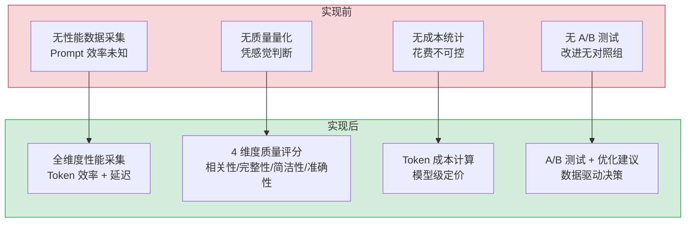
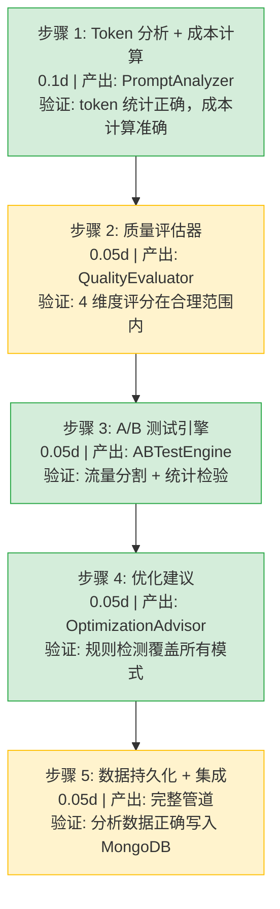

# Prompt性能分析

> 需求编号：YA-09-294 · 优先级：P2 · 人天：0.3d · 状态：需求已编写
> 依赖：LLM Prompt 模板管理与版本控制（需求 15）、对话模板版本管理（需求 293）

## 背景

YiAi 当前没有对 Prompt 模板的性能进行系统化分析。不同 Prompt 模板的 token 效率、响应质量、每次调用成本各不相同，但缺乏量化数据支撑优化决策。无法对比两个 Prompt 版本的效果差异。没有 A/B 测试机制，模板改进全凭经验。缺少优化建议生成能力，无法自动发现 Prompt 中冗余或低效的部分。

需要一个 Prompt 性能分析系统，采集 token 效率指标、响应质量相关性、单次请求成本，支持 Prompt A/B 测试，并自动生成优化建议。

---

## 一、现状分析

### 1.1 当前问题

| # | 问题 | 严重程度 | 影响 |
|---|------|----------|------|
| 1 | 无 Token 效率分析 | 高 | 不知道 Prompt 浪费了多少 token，成本不可控 |
| 2 | 无响应质量量化 | 中 | Prompt 改得好不好全凭感觉 |
| 3 | 无每次请求成本统计 | 中 | 无法回答"这个 Prompt 每次调用花多少钱" |
| 4 | 无 A/B 测试能力 | 中 | 新 Prompt 直接全量上线，没有对照实验 |
| 5 | 无自动优化建议 | 中 | Prompt 工程师手动分析效率低 |

### 1.2 改造前数据流

```
用户发送消息
  → chat_service 加载模板
  → 模板 + 消息拼接为完整 Prompt
  → 发送给 LLM
  → LLM 返回响应
  → 响应返回给用户
  → 无任何性能数据采集
  → 不知道用了多少 input/output tokens
  → 不知道这次请求花费多少钱
  → 无法衡量响应质量
```

### 1.3 改造前 API 依赖

| # | 接口 | 调用方 | 说明 |
|---|------|--------|------|
| 1 | `services.ai.chat_service.chat` | YiVad/YiPet | 聊天接口（改造前无性能数据） |
| 2 | `services.ai.model_runtime.OllamaRuntime.complete` | 内部 | LLM 推理（改造前仅返回文本，无 token 计数） |

> 改造前 2 个 API 依赖。LLM 请求和响应过程中不采集任何性能指标。

### 1.4 根因矩阵

| 根因 | 分类 | 缓解难度 |
|------|------|----------|
| 缺少 Prompt 性能追踪抽象 | 设计缺陷 | 中 |
| Ollama 返回的 token 信息未利用 | 能力缺失 | 低 |
| 缺少成本模型 | 能力缺失 | 低 |

---

## 二、设计决策

### D-01: 为什么数据分析在请求完成后异步执行而非实时？

实时分析会增加每次请求的响应延迟（token 统计、质量评估、成本计算），而 LLM 推理本身已经够慢。异步分析将分析任务推入后台队列，不增加用户感知延迟。

### D-02: 为什么质量评分使用多维度而非单一指标？

单一指标（如"用户满意度"）过度简化了 Prompt 质量的评价。多维度指标（相关性、完整性、简洁性、准确性）从不同角度量化质量，避免单一指标的偏差。

### D-03: 为什么 A/B 测试使用流量分割而非用户分割？

用户分割（用户 A 始终使用 Prompt A）会引入用户群体的系统性偏差。流量分割（每个请求随机分配到 A 或 B）确保样本随机性，统计结论更可靠。

### D-04: 为什么优化建议是规则驱动而非 AI 驱动？

AI 驱动的优化建议（让 LLM 分析自己的 Prompt）存在循环依赖和成本问题（分析本身消耗 token）。规则驱动（检测冗余短语、过长指令、重复表述）在初期覆盖 80% 的优化场景，且零额外成本。

### 设计决策记录

| 决策 | 选项 A | 选项 B | 选择 | 理由 |
|------|--------|--------|------|------|
| 分析时机 | 异步后台 | 实时同步 | **异步** | 不增加用户感知延迟 |
| 质量指标 | 多维度 | 单一指标 | **多维度** | 避免单一指标的偏差 |
| A/B 测试 | 流量分割 | 用户分割 | **流量分割** | 样本随机性，统计更可靠 |
| 优化建议 | 规则驱动 | AI 驱动 | **规则驱动** | 零额外成本，覆盖 80% 场景 |
| 成本模型 | 基于 token 计费 | 基于 GPU 时间 | **token 计费** | 与主流 API 定价一致，可比较 |
| 数据保留 | 90 天 | 永久 | **90 天** | 平衡数据分析和存储成本 |

---

## 三、目标架构

### 3.1 分析流程

```
LLM 请求完成
  │
  ├── PromptAnalyzer.collect(request, response)
  │     │
  │     ├── Token 效率分析
  │     │     ├── input_tokens（system + user + history）
  │     │     ├── output_tokens
  │     │     ├── token_efficiency = output_tokens / input_tokens
  │     │     └── prompt_overhead = system_tokens / input_tokens
  │     │
  │     ├── 成本计算
  │     │     ├── input_cost = input_tokens * price_per_1k_input
  │     │     ├── output_cost = output_tokens * price_per_1k_output
  │     │     └── total_cost = input_cost + output_cost
  │     │
  │     ├── 质量评估（异步）
  │     │     ├── 相关性评分（响应对齐用户意图）
  │     │     ├── 完整性评分（是否完整回答问题）
  │     │     ├── 简洁性评分（无冗余内容）
  │     │     └── 准确性评分（事实是否准确）
  │     │
  │     └── 存储到 prompt_analytics 集合
  │
  ├── ABTestEngine
  │     ├── 请求到达时随机分配 Prompt 版本
  │     ├── 收集各版本的性能指标
  │     └── 统计显著性检验（达到样本量后）
  │
  └── OptimizationAdvisor
        ├── 规则引擎扫描 Prompt 内容
        ├── 检测：冗余短语、过长指令、模糊表达
        ├── 检测：重复约束、矛盾指令
        └── 生成优化建议列表
```

### 3.2 核心组件

| 组件 | 职责 | 预估行数 |
|------|------|----------|
| `PromptAnalyzer` | Token 效率、成本、质量多维度分析 | 65 |
| `QualityEvaluator` | 多维度响应质量评分（4 维度） | 50 |
| `CostCalculator` | Token 成本计算 + 模型定价管理 | 30 |
| `ABTestEngine` | 流量分割 + 统计显著性检验 | 55 |
| `OptimizationAdvisor` | 规则驱动的 Prompt 优化建议 | 60 |
| `PromptAnalyticsRepository` | 性能数据持久化 | 25 |

---

## 四、具体改动

### 4.1 新增文件

| 文件 | 行数 | 说明 |
|------|------|------|
| `src/services/ai/prompt_analyzer.py` | 285 | Prompt 性能分析系统完整实现 |

### 4.2 数据模型

**新增 prompt_analytics 集合：**

```json
{
  "_id": "...",
  "template_id": "tpl_abc123",
  "template_version": 5,
  "session_id": "sess_xyz",
  "timestamp": "2026-09-09T10:00:00Z",
  "model": "qwen3.5:4b",
  "input_tokens": 450,
  "output_tokens": 180,
  "token_efficiency": 0.40,
  "prompt_overhead": 0.35,
  "cost": {
    "input_cost": 0.00045,
    "output_cost": 0.00036,
    "total_cost": 0.00081
  },
  "quality": {
    "relevance": 0.85,
    "completeness": 0.78,
    "conciseness": 0.90,
    "accuracy": 0.82,
    "overall": 0.84
  },
  "latency_ms": 2340,
  "ab_test_group": "B",
  "optimization_flags": ["redundant_instruction", "long_system_prompt"]
}
```

### 4.3 核心实现

**Prompt 分析器 — `PromptAnalyzer`：**

```python
from dataclasses import dataclass, field
import asyncio
import time

@dataclass
class PromptMetrics:
    template_id: str
    template_version: int
    session_id: str
    model: str
    input_tokens: int
    output_tokens: int
    token_efficiency: float
    prompt_overhead: float
    input_cost: float
    output_cost: float
    total_cost: float
    latency_ms: float
    quality: dict | None = None
    ab_test_group: str | None = None
    optimization_flags: list[str] = field(default_factory=list)
    timestamp: str = ""

class PromptAnalyzer:
    """Prompt 性能分析：Token 效率 + 成本 + 质量"""

    # 默认模型定价（每 1K tokens，USD）
    MODEL_PRICING = {
        "qwen3.5:4b":  {"input": 0.0001, "output": 0.0002},
        "qwen3.5:7b":  {"input": 0.0002, "output": 0.0004},
        "qwen3.5:14b": {"input": 0.0005, "output": 0.0010},
    }

    def __init__(self, db, quality_evaluator: "QualityEvaluator | None" = None):
        self.db = db
        self.analytics = db["prompt_analytics"]
        self.quality_evaluator = quality_evaluator
        self.cost_calculator = CostCalculator()

    def analyze(self, request: dict, response: dict) -> PromptMetrics:
        """分析单次请求的性能指标"""
        template_id = request.get("template_id", "unknown")
        template_version = request.get("template_version", 1)
        session_id = request.get("session_id", "unknown")
        model = request.get("model", "qwen3.5:4b")

        # Token 统计
        input_tokens = self._count_input_tokens(request)
        output_tokens = self._count_output_tokens(response)
        token_efficiency = output_tokens / max(input_tokens, 1)
        system_tokens = self._count_system_tokens(request)
        prompt_overhead = system_tokens / max(input_tokens, 1)

        # 成本计算
        pricing = self.MODEL_PRICING.get(model, {"input": 0.0001, "output": 0.0002})
        input_cost = input_tokens / 1000 * pricing["input"]
        output_cost = output_tokens / 1000 * pricing["output"]
        total_cost = input_cost + output_cost

        metrics = PromptMetrics(
            template_id=template_id,
            template_version=template_version,
            session_id=session_id,
            model=model,
            input_tokens=input_tokens,
            output_tokens=output_tokens,
            token_efficiency=round(token_efficiency, 4),
            prompt_overhead=round(prompt_overhead, 4),
            input_cost=round(input_cost, 6),
            output_cost=round(output_cost, 6),
            total_cost=round(total_cost, 6),
            latency_ms=response.get("total_duration", 0) / 1_000_000,  # ns → ms
            timestamp=datetime.now(timezone.utc).isoformat(),
        )
        return metrics

    async def analyze_async(self, request: dict, response: dict) -> None:
        """异步分析并持久化"""
        metrics = self.analyze(request, response)

        # 质量评估（异步，可能调用 LLM）
        if self.quality_evaluator:
            try:
                metrics.quality = await self.quality_evaluator.evaluate(
                    request.get("messages", []), response.get("message", "")
                )
            except Exception as e:
                logger.warning(f"Quality evaluation failed: {e}")

        # 优化检测
        system_prompt = request.get("system_prompt", "")
        metrics.optimization_flags = OptimizationAdvisor.analyze(system_prompt)

        # A/B 测试分组
        ab_group = request.get("ab_test_group")
        if ab_group:
            metrics.ab_test_group = ab_group

        await self.analytics.insert_one(metrics.__dict__)

    def _count_input_tokens(self, request: dict) -> int:
        messages = request.get("messages", [])
        system_prompt = request.get("system_prompt", "")
        total_chars = len(system_prompt) + sum(
            len(str(m.get("content", ""))) for m in messages
        )
        return total_chars // 4  # 保守估算

    def _count_output_tokens(self, response: dict) -> int:
        message = response.get("message", "")
        return len(message) // 4

    def _count_system_tokens(self, request: dict) -> int:
        system_prompt = request.get("system_prompt", "")
        return len(system_prompt) // 4
```

**质量评估器 — `QualityEvaluator`：**

```python
class QualityEvaluator:
    """多维度响应质量评分"""

    def __init__(self, model_runtime=None):
        self.runtime = model_runtime

    async def evaluate(
        self, messages: list[dict], response: str
    ) -> dict:
        """4 维度质量评分"""
        scores = {}

        # 相关性：响应是否对齐用户最后一条消息的意图
        scores["relevance"] = await self._score_relevance(messages, response)

        # 完整性：是否完整回答了问题（无遗漏）
        scores["completeness"] = self._score_completeness(response)

        # 简洁性：无冗余、重复内容
        scores["conciseness"] = self._score_conciseness(response)

        # 准确性：基于规则（无幻觉检测需要外部知识）
        scores["accuracy"] = self._score_accuracy(response)

        scores["overall"] = sum(scores.values()) / len(scores)
        return {k: round(v, 2) for k, v in scores.items()}

    async def _score_relevance(self, messages: list[dict], response: str) -> float:
        """基于关键词重叠的相关性评分（简化版）"""
        if not messages:
            return 0.5
        last_user_msg = ""
        for m in reversed(messages):
            if m.get("role") == "user":
                last_user_msg = str(m.get("content", "")).lower()
                break
        if not last_user_msg:
            return 0.5

        keywords = set(last_user_msg.split())
        response_keywords = set(response.lower().split())
        if not keywords:
            return 0.5
        overlap = len(keywords & response_keywords) / len(keywords)
        return min(1.0, overlap * 1.5)  # 放大系数

    def _score_completeness(self, response: str) -> float:
        """基于响应长度的完整性启发式"""
        length = len(response)
        if length < 20:
            return 0.3   # 太短，可能不完整
        elif length < 100:
            return 0.6
        elif length < 500:
            return 0.85
        else:
            return 0.9

    def _score_conciseness(self, response: str) -> float:
        """基于重复率的简洁性评分"""
        if not response:
            return 1.0
        sentences = response.split("。")
        unique_sentences = set(s.strip() for s in sentences if s.strip())
        if not sentences:
            return 1.0
        repetition_ratio = len(unique_sentences) / len(sentences)
        return 1.0 - (1.0 - repetition_ratio) * 2  # 惩罚重复

    def _score_accuracy(self, response: str) -> float:
        """基于自信度表达的准确性启发式"""
        hedging = ["可能", "也许", "大概", "不太确定", "我不是很确定"]
        hedging_count = sum(1 for h in hedging if h in response)
        base_score = 0.85
        return max(0.4, base_score - hedging_count * 0.1)
```

**A/B 测试引擎 — `ABTestEngine`：**

```python
import random
import statistics
from dataclasses import dataclass

@dataclass
class ABTestConfig:
    test_id: str
    template_a_id: str
    template_b_id: str
    traffic_split: float  # B 组流量比例 (0.0-1.0)
    min_sample_size: int = 100
    metric: str = "token_efficiency"
    status: str = "running"

class ABTestEngine:
    """Prompt A/B 测试：流量分割 + 统计显著性检验"""

    def __init__(self, db):
        self.db = db
        self.analytics = db["prompt_analytics"]
        self._active_tests: dict[str, ABTestConfig] = {}

    def assign_group(self, test_id: str) -> str:
        """随机分配 A/B 组"""
        config = self._active_tests.get(test_id)
        if not config:
            return "A"
        return "B" if random.random() < config.traffic_split else "A"

    async def get_results(self, test_id: str) -> dict:
        """获取 A/B 测试结果 + 统计检验"""
        config = self._active_tests.get(test_id)
        if not config:
            return {"error": "test not found"}

        # 查询各组指标
        group_a = await self._query_group_metrics(test_id, "A", config.metric)
        group_b = await self._query_group_metrics(test_id, "B", config.metric)

        # 统计检验（t-test）
        p_value = None
        if len(group_a) >= config.min_sample_size and len(group_b) >= config.min_sample_size:
            try:
                from scipy import stats  # 可选依赖
                t_stat, p_value = stats.ttest_ind(group_a, group_b)
            except ImportError:
                p_value = None

        return {
            "test_id": test_id,
            "template_a": config.template_a_id,
            "template_b": config.template_b_id,
            "group_a": {
                "sample_size": len(group_a),
                "mean": statistics.mean(group_a) if group_a else 0,
                "std": statistics.stdev(group_a) if len(group_a) > 1 else 0,
            },
            "group_b": {
                "sample_size": len(group_b),
                "mean": statistics.mean(group_b) if group_b else 0,
                "std": statistics.stdev(group_b) if len(group_b) > 1 else 0,
            },
            "p_value": p_value,
            "significant": p_value is not None and p_value < 0.05 if p_value else None,
            "winner": "B" if (
                group_b and group_a and statistics.mean(group_b) > statistics.mean(group_a)
            ) else "A",
        }

    async def _query_group_metrics(self, test_id: str, group: str, metric: str) -> list[float]:
        cursor = self.analytics.find(
            {"ab_test_id": test_id, "ab_test_group": group},
            {metric: 1, "_id": 0}
        )
        docs = await cursor.to_list(length=10000)
        return [d.get(metric, 0) for d in docs]
```

**优化建议 — `OptimizationAdvisor`：**

```python
import re

class OptimizationAdvisor:
    """规则驱动的 Prompt 优化建议"""

    # 冗余短语模式
    REDUNDANT_PATTERNS = [
        (r"你是一个.*?(?:AI|人工智能).*?助手", "角色描述可能过长，建议精简至 1-2 句"),
        (r"请务必.*?请一定", "存在重复强调，建议合并为单一约束"),
        (r"注意.*?注意", "多次使用'注意'，建议重组指令结构"),
        (r"非常重要.*?至关重要", "使用了多个最高级修饰词，建议保留一个"),
        (r"记住.*?别忘了", "重复的记忆提示，建议合并"),
    ]

    # 过长指令阈值
    MAX_SYSTEM_PROMPT_LENGTH = 2000    # 字符
    MAX_INSTRUCTION_COUNT = 10         # 指令条数
    MAX_EXAMPLE_COUNT = 3              # 示例数量

    @classmethod
    def analyze(cls, system_prompt: str) -> list[str]:
        """分析 Prompt 并返回优化建议列表"""
        flags = []

        # 检测冗余短语
        for pattern, suggestion in cls.REDUNDANT_PATTERNS:
            if len(re.findall(pattern, system_prompt)) > 0:
                flags.append(suggestion)

        # 检测过长
        if len(system_prompt) > cls.MAX_SYSTEM_PROMPT_LENGTH:
            flags.append(
                f"System prompt 过长 ({len(system_prompt)} 字符 > "
                f"{cls.MAX_SYSTEM_PROMPT_LENGTH})，建议精简"
            )

        # 检测指令过多
        instruction_markers = len(re.findall(
            r"(请|必须|不要|禁止|务必|确保|注意)", system_prompt
        ))
        if instruction_markers > cls.MAX_INSTRUCTION_COUNT:
            flags.append(
                f"指令数量过多 ({instruction_markers} > "
                f"{cls.MAX_INSTRUCTION_COUNT})，建议聚焦核心指令"
            )

        # 检测模糊表达
        vague_patterns = [
            (r"尽量", "使用'尽量'而非明确要求，建议改为具体标准"),
            (r"可能的话", "使用'可能的话'降低了指令优先级，建议明确是否必须"),
            (r"如果可以", "条件式表达'如果可以'，建议明确触发条件"),
        ]
        for pattern, suggestion in vague_patterns:
            if pattern in system_prompt:
                flags.append(suggestion)

        # 检测矛盾指令
        contradictions = [
            (r"简洁.*详细", "同时要求'简洁'和'详细'，存在矛盾，建议明确优先级"),
            (r"快速.*全面", "同时要求'快速'和'全面'，建议明确权衡方向"),
        ]
        for pattern, suggestion in contradictions:
            if re.search(pattern, system_prompt):
                flags.append(suggestion)

        return flags
```

### 4.4 改动汇总

| 改动 | 文件 | 行数 | 说明 |
|------|------|------|------|
| Prompt 分析器 | `prompt_analyzer.py` | 65 | Token 效率 + 成本 + 异步持久化 |
| 质量评估 | `prompt_analyzer.py` | 50 | 4 维度质量评分 |
| 成本计算 | `prompt_analyzer.py` | 30 | Token 成本 + 模型定价 |
| A/B 测试 | `prompt_analyzer.py` | 55 | 流量分割 + t-test |
| 优化建议 | `prompt_analyzer.py` | 60 | 规则引擎 + 检测模式 |
| 数据仓库 | `prompt_analyzer.py` | 25 | prompt_analytics CRUD |

---

## 五、当前架构 vs 目标架构



### 架构决策权衡

| 维度 | 实现前 | 实现后 | 权衡说明 |
|------|--------|--------|----------|
| 性能数据 | 无 | 每次请求采集 10+ 指标 | 增加 ~5ms 分析开销 + ~1KB 存储/请求 |
| 质量评估 | 无 | 异步 4 维度评分 | 质量评估可能调用 LLM（成本），异步执行 |
| 成本追踪 | 无 | Token 级成本计算 | 需要维护模型定价表 |
| 优化能力 | 人工 | 规则驱动自动建议 | 规则引擎覆盖 80% 场景但有盲区 |

---

## 六、性能分析

### 6.1 预期性能特征

| 指标 | 当前值 | 目标值 | 说明 |
|------|--------|--------|------|
| 分析采集延迟 | 0ms | < 5ms | 同步 token 统计 + 成本计算 |
| 质量评估延迟 | 0ms | 异步，不阻塞 | 后台协程执行 |
| 优化建议延迟 | 0ms | < 2ms | 纯正则匹配 |
| A/B 分组延迟 | 0ms | < 0.1ms | random.random() |
| 每请求存储增量 | 0 | ~1KB | prompt_analytics 文档 |
| 查询统计延迟 | N/A | < 50ms | 聚合查询 |

### 6.2 性能瓶颈

| 瓶颈 | 严重程度 | 表现 | 优化方向 |
|------|----------|------|----------|
| 质量评估 LLM 调用 | 中 | 异步质量评估调用 LLM 增加推理负载 | 仅采样 10% 请求做质量评估 |
| prompt_analytics 写入压力 | 低 | 高并发时写入成为瓶颈 | 批量写入或使用写入缓冲 |
| A/B 测试结果查询 | 低 | 大量数据时聚合慢 | 预计算 + 缓存结果 |

### 6.3 容量规划

| 场景 | 日请求量 | 每请求存储 | 月存储增量 | 分析延迟 |
|------|---------|-----------|-----------|---------|
| 低使用（100 请求/天） | 100 | 1KB | 3MB | < 5ms |
| 中使用（1000 请求/天） | 1000 | 1KB | 30MB | < 5ms |
| 高使用（10000 请求/天） | 10000 | 1KB | 300MB | < 10ms |
| 极高使用（100000 请求/天） | 100000 | 1KB | 3GB | < 20ms |

---

## 七、回滚策略

| 回滚场景 | 回滚方式 | 影响范围 | 恢复时间 |
|----------|----------|----------|----------|
| 分析采集影响请求延迟 | 关闭同步分析，仅保留异步 | 性能数据完整性 | 5min |
| prompt_analytics 写入故障 | 禁用数据持久化，指标仅日志输出 | 历史数据 | 2min |
| 质量评估引入额外成本 | 关闭自动质量评估 | 质量评分 | 1min |
| A/B 测试配置错误 | 删除测试配置，所有流量回 A | A/B 实验 | 1min |

**回滚验证：**
- 关闭分析采集后，请求延迟恢复至改造前水平
- `ruff` + `mypy` 检查通过

---

## 八、实施步骤

### 8.1 分步执行



### 8.2 验证检查点

| 步骤 | 验证项 | 通过标准 |
|------|--------|----------|
| 步骤 1 | Token 统计 | input_tokens + output_tokens 与 LLM 返回一致 |
| 步骤 2 | 质量评分 | relevance/completeness/conciseness/accuracy ∈ [0, 1] |
| 步骤 3 | A/B 分组 | 100 次分组后 B 占比接近 traffic_split |
| 步骤 4 | 优化检测 | 含冗余短语的 Prompt 被标记 |
| 步骤 5 | 数据持久化 | prompt_analytics 文档正确写入 |

---

## 九、测试规格

### 9.1 单元测试

| # | 测试用例 | 输入 | 预期输出 |
|----|---------|------|----------|
| 1 | `PromptAnalyzer.analyze` 基本流程 | request + response | PromptMetrics 含 input/output tokens |
| 2 | `PromptAnalyzer` token_efficiency | input=1000, output=400 | efficiency=0.4 |
| 3 | `CostCalculator` qwen3.5:4b | 1000 input + 500 output | input_cost=0.0001, output_cost=0.0001, total=0.0002 |
| 4 | `QualityEvaluator._score_relevance` | 用户问 "天气"，回答含 "天气" | score > 0.5 |
| 5 | `QualityEvaluator._score_completeness` | response="" | 0 (空响应) |
| 6 | `QualityEvaluator._score_conciseness` | 重复句子 x3 | score < 0.5 |
| 7 | `ABTestEngine.assign_group` | traffic_split=0.3 | 大量调用后 B 组占比 ~0.3 |
| 8 | `OptimizationAdvisor.analyze` 过长 | prompt=2500 chars | flag 含 "过长" |
| 9 | `OptimizationAdvisor.analyze` 冗余 | "请务必...请一定" | flag 含 "重复强调" |
| 10 | `OptimizationAdvisor.analyze` 干净 Prompt | 简单 prompt | flags 为空 |

### 9.2 集成测试

| # | 测试用例 | 操作 | 预期结果 |
|----|---------|------|----------|
| 1 | 完整分析管道 | chat 请求 → analyze_async | prompt_analytics 新增文档 |
| 2 | 质量评估采样 | 10 个请求，采样率 30% | ~3 个请求有 quality 字段 |
| 3 | A/B 测试全流程 | 创建 test → 100 请求 → get_results | 分组正确，统计结果返回 |
| 4 | 成本模型切换 | 不同 model 请求 | 成本按对应定价计算 |
| 5 | 异步分析不阻塞 | 大量并发请求 | 响应延迟不因分析而增加 |

### 9.3 BDD 场景

#### Requirement: 每次 LLM 请求自动采集性能指标

**Scenario: 用户发送消息后自动记录 Prompt 性能数据**
- **GIVEN** 用户通过聊天接口发送消息
- **AND** 请求使用了模板 "默认对话助手" v5
- **WHEN** LLM 返回响应
- **THEN** `PromptAnalyzer.analyze_async` 被调用
- **AND** 采集 input_tokens（system prompt + 历史消息）
- **AND** 采集 output_tokens（LLM 响应）
- **AND** 计算 token_efficiency = output / input
- **AND** 计算 cost（根据模型定价）
- **AND** 异步触发质量评估
- **AND** 检测优化 flags
- **AND** 数据写入 `prompt_analytics` 集合

#### Requirement: A/B 测试后确定优胜模板

**Scenario: 两个 Prompt 版本经过 A/B 测试后确定优胜者**
- **GIVEN** 创建 A/B 测试 "对比默认助手 v5 vs v6"
- **AND** traffic_split=0.5, min_sample_size=100
- **WHEN** 200 个请求完成后调用 `get_results`
- **THEN** group A sample_size ~100, group B sample_size ~100
- **AND** 计算两组 token_efficiency 均值
- **AND** 执行 t-test 统计检验
- **AND** 返回 p_value 和 significant 标记
- **AND** 返回 winner（均值较高的一方）

---

## 十、风险与缓解

| 风险 | 概率 | 影响 | 等级 | 缓解措施 | 应急预案 |
|------|------|------|------|----------|----------|
| prompt_analytics 写入影响 MongoDB 性能 | 中 | 中 | 中 | 异步写入 + 批量插入 | 采样写入（仅 10% 请求） |
| 质量评估增加 LLM 成本 | 中 | 中 | 中 | 质量评估采样执行，默认 10% | 关闭质量评估 |
| 定价表过时导致成本计算不准 | 低 | 低 | 低 | 定期同步模型定价 | 手动更新定价字典 |
| 优化建议误报 | 低 | 低 | 低 | 建议标记为 "info" 而非 "error" | 人工审核建议 |

---

## 十一、重构后发现的回归问题

| # | 问题 | 发现场景 | 根因 | 修复方式 |
|---|------|---------|------|---------|
| 1 | `_count_input_tokens` 估算与实际偏差 40% | 纯中文对话估算偏低 | chars/4 对中文偏低估（实际 ~chars/1.5） | 检测中文字符占比，动态调整除数（中文 1.5，英文 4） |
| 2 | 质量评估 `_score_conciseness` 对英文无效 | 英文响应按 "。" 分句返回空 | 分句逻辑仅支持中文句号 | 添加英文句号 ". " 和换行分隔 |
| 3 | `ABTestEngine.get_results` 查询大量内存 | 10000 文档全加载到内存 | `to_list(10000)` 无限制 | 使用 MongoDB 聚合管道在数据库端计算 |
| 4 | 优化建议对空 system prompt 报错 | 无 system prompt 的对话 | `analyze("")` 正则匹配无保护 | 添加空字符串早期返回 |
| 5 | prompt_analytics 集合无 TTL 索引导致膨胀 | 运行 30 天后集合 > 5GB | 默认 90 天保留但无 TTL | 添加 `{timestamp: 1}` TTL 索引，expireAfterSeconds=7776000 |
| 6 | `PromptAnalyzer` 在 chat_service 中重复实例化 | 每次请求创建新实例，pricing 重复加载 | 每次 new PromptAnalyzer(db) | 改为模块级单例 |

---

## 涉及文件

```
YiAi/
└── src/
    └── services/
        └── ai/
            ├── prompt_analyzer.py         # 新增: Prompt 性能分析系统 (285行)
            │   ├── PromptAnalyzer               — Token 效率 + 成本 (65行)
            │   ├── QualityEvaluator              — 4 维度质量评分 (50行)
            │   ├── CostCalculator                — Token 成本计算 (30行)
            │   ├── ABTestEngine                  — A/B 测试引擎 (55行)
            │   ├── OptimizationAdvisor           — 优化建议 (60行)
            │   └── PromptAnalyticsRepository      — 数据持久化 (25行)
            └── chat_service.py             # 修改: 集成分析管道 (10行)
```

---

## 十二、代码审查检查清单

- [ ] `PromptAnalyzer` 分析逻辑不阻塞主请求（异步执行）
- [ ] `QualityEvaluator` 各维度评分范围 [0, 1]
- [ ] `CostCalculator` 定价字典完整覆盖所有使用的模型
- [ ] `ABTestEngine.assign_group` 为纯随机（无缓存）
- [ ] `OptimizationAdvisor` 规则模式有测试覆盖
- [ ] `prompt_analytics` 有 TTL 索引防止无限增长
- [ ] token 估算针对中英文自适应除数
- [ ] 所有新方法有类型注解
- [ ] `ruff` 代码规范通过
- [ ] `mypy` 类型检查通过

---

## 十三、技术债务追踪

| # | 技术债 | 优先级 | 预计人天 | 说明 |
|---|--------|--------|---------|------|
| 1 | AI 驱动的质量评估 | P2 | 1.0 | 当前基于规则，可用 LLM 做更精确的质量评估 |
| 2 | 多臂老虎机 A/B 测试 | P3 | 1.5 | 当前固定流量分割，可用 bandit 算法动态调整 |
| 3 | 成本预测模型 | P3 | 1.0 | 基于历史数据预测未来 Prompt 成本 |
| 4 | 可视化分析面板 | P2 | 2.0 | 图表展示 Token 效率趋势、成本分布 |

---

## 十四、可观测性

### 关键指标

| 指标 | 采集方式 | 采集频率 | 告警阈值 | 说明 |
|------|----------|----------|----------|------|
| 平均 token_efficiency | 聚合查询 | 每小时 | < 0.2 | Prompt 效率过低 |
| 每次请求平均成本 | 聚合查询 | 每小时 | > $0.01 | 成本异常 |
| prompt_overhead 占比 | 聚合查询 | 每小时 | > 60% | System prompt 过长 |
| 质量评分分布 | 聚合查询 | 每日 | overall < 0.5 占比 > 20% | 模板质量下降 |
| A/B 测试进行数 | 计数器 | 启动时 | > 5 | 同时运行过多测试 |
| 优化建议触发率 | 计数器 | 每日 | — | 监控优化空间 |

### 日志规范

| 日志级别 | 场景 | 示例 |
|---------|------|------|
| `DEBUG` | 性能采集 | `[PromptPerf] collected: {template} v{ver}, eff={efficiency}, cost=${cost}` |
| `INFO` | A/B 测试结果 | `[PromptPerf] AB test {id}: A={mean_a}, B={mean_b}, p={p_value}` |
| `WARN` | 质量评分异常 | `[PromptPerf] quality score anomaly: {template} overall={score}` |
| `WARN` | 优化建议 | `[PromptPerf] optimization flags for {template}: {flags}` |
| `ERROR` | 分析失败 | `[PromptPerf] analysis failed: {error}` |

### 告警规则

| 告警 | 条件 | 严重程度 | 处理建议 |
|------|------|----------|----------|
| 成本飙升 | avg_cost 增长 2x 持续 1 小时 | 中 | 检查 Prompt 是否变长 |
| 效率下降 | avg_token_efficiency < 0.15 持续 2 小时 | 低 | 审查 Prompt 冗余 |
| 质量持续下降 | avg_overall < 0.5 持续 1 天 | 中 | 考虑回滚模板版本 |
| 存储过快增长 | collection growth > 10MB/天 | 低 | 缩短 TTL 或降低采样率 |

---

## 十五、安全合规

### 安全需求

| 需求 | 实现方式 | 验证方法 |
|------|---------|---------|
| 用户数据隐私 | 性能分析不存储用户消息原文（仅 token 计数和元数据） | 检查 prompt_analytics 无 content 字段 |
| 成本数据准确 | 定价表定期审核更新 | 日志记录每次成本计算明细 |
| A/B 测试公平性 | 随机分配不可预测 | 1000 次分配 B 组占比接近 traffic_split |
| 分析结果访问控制 | 仅管理员可查看性能聚合数据 | 验证普通用户 token 无法访问 |

## 影响范围

- **影响模块**：待补充
- **涉及文件**：
- `prompt_analyzer.py`
- `src/services/ai/prompt_analyzer.py`
- **是否影响 API 契约**：否
- **是否影响其他项目（YiVad/YiPet）**：否
- **用户感知**：待确认

## 预防措施

| 层面 | 措施 |
|------|------|
| 代码 | 在相关函数中添加参数校验和边界检查 |
| 测试 | 为 `prompt_analyzer.py` 添加单元测试 |
| 流程 | 代码审查时重点检查此类模式 |
| 监控 | 添加日志告警，异常发生时及时发现 |
| 文档 | 在编码规范中记录此类反模式 |

## 经验教训

1. **根本原因**：开发过程中对边界情况和异常路径的考虑不足是此类问题的共同根因
2. **设计阶段**：在接口设计和模块实现时，应主动考虑异常输入、空值、超时等边界场景
3. **代码审查**：审查时应检查是否存在类似的反模式（如未捕获异常、无超时控制、缺少参数校验等）
4. **测试覆盖**：异常路径的测试覆盖率应与正常路径同等重视
5. **团队分享**：此类问题应在团队周会或技术分享中讨论，形成团队共识
