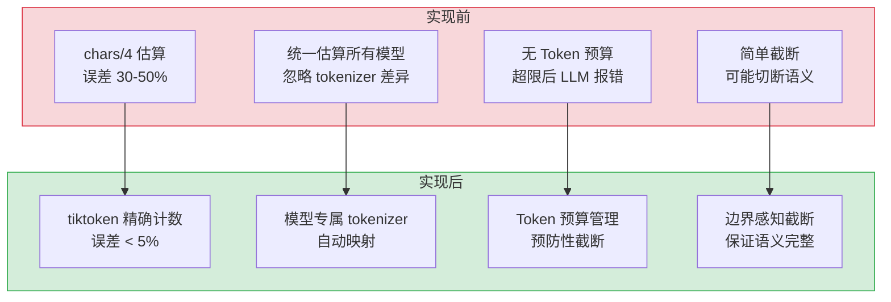
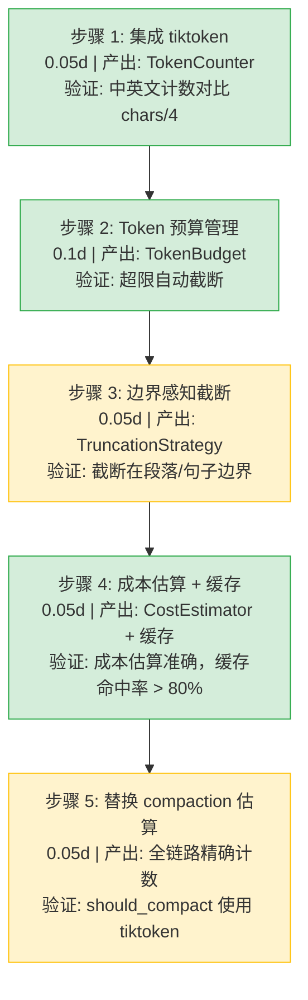

# 模型Token计数优化

> 需求编号：YA-09-295 · 优先级：P2 · 人天：0.3d · 状态：需求已编写
> 依赖：上下文压缩服务（需求 9）、ModelRuntime 抽象层

## 背景

YiAi 当前使用 `字符数/4` 的保守估算方法进行 Token 计数。这种方法在混合中英文场景下误差可达 30-50%，导致压缩触发时机不准（过早或过晚）、成本估算偏差大、Token 预算管理粗放。不同模型使用不同的 tokenizer（qwen 的 BPE、llama 的 SentencePiece），统一使用 chars/4 忽略了模型差异。

需要一个精确的 Token 计数系统，集成 tiktoken 等标准 tokenizer 库，为每个模型配置对应的 tokenizer，支持精确的 Token 预算管理和智能截断策略，提供准确的成本估算。

---

## 一、现状分析

### 1.1 当前问题

| # | 问题 | 严重程度 | 影响 |
|---|------|----------|------|
| 1 | `chars/4` 估算误差大（30-50%） | 高 | 压缩触发不准，成本估算偏差 |
| 2 | 所有模型使用统一估算 | 中 | 不同 tokenizer 的 token 数差异被忽略 |
| 3 | 无 Token 预算管理 | 中 | 无法精确控制发送给 LLM 的 token 数量 |
| 4 | 截断策略单一（简单截断） | 中 | 可能截断在句子/段落中间 |
| 5 | 成本估算粗糙 | 低 | 无法提供准确的每次请求成本 |

### 1.2 改造前数据流

```
需要 Token 计数
  → estimate_tokens(messages)
  → total_chars = sum(len(m.get("content", "")) for m in messages)
  → return len(messages) * 4 + total_chars // 4
  → 对所有模型、所有语言使用相同公式
  → 中文：实际 1 token ≈ 1.5-2 chars，估算为 1 token ≈ 4 chars（严重低估）
  → 英文：实际 1 token ≈ 4 chars，估算基本准确
  → 混合场景：误差不可预测
```

### 1.3 改造前 API 依赖

| # | 接口 | 调用方 | 说明 |
|---|------|--------|------|
| 1 | `services.ai.compaction.estimate_tokens` | chat_service | 压缩触发判断（改造前使用 chars/4） |
| 2 | `services.ai.compaction.should_compact` | chat_service | 依赖 estimate_tokens 做决策 |
| 3 | `services.ai.chat_service.chat` | YiVad/YiPet | 聊天接口（改造前无 token 预算控制） |

> 改造前 3 个 API 依赖。统一使用 `chars/4` 估算，无精确计数能力。

### 1.4 根因矩阵

| 根因 | 分类 | 缓解难度 |
|------|------|----------|
| 缺少标准 tokenizer 库集成 | 能力缺失 | 低 |
| 忽略不同模型 tokenizer 差异 | 设计缺陷 | 低 |
| 估算优先于精确计数的惯性 | 工程选择 | 中 |

---

## 二、设计决策

### D-01: 为什么选择 tiktoken 而不是 HuggingFace tokenizers？

tiktoken 是 OpenAI 开源的 BPE tokenizer，纯 Python 实现，零系统依赖，安装简单（`pip install tiktoken`）。HuggingFace tokenizers 功能更强但依赖 Rust 编译，在开发环境部署复杂。tiktoken 的 `cl100k_base` 编码覆盖了绝大多数现代 LLM 的 tokenizer 行为，对于不支持的模型可作为近似替代。

### D-02: 为什么 token 预算管理在 Prompt 组装阶段而非推理阶段？

推理阶段（LLM 调用时）再做预算管理已经太晚——请求已经发出，超出 context window 只会收到错误。在 Prompt 组装阶段做预算管理可以预防性截断，确保发送给 LLM 的内容始终在限制内。

### D-03: 为什么截断策略使用边界感知而非固定长度截断？

固定长度截断（如截断在 8000 tokens）可能切断在句子或段落中间，导致 LLM 接收不完整的上下文。边界感知截断会回溯到最近的句子/段落边界，确保 LLM 接收完整的语义单元。代价是最终 token 数可能比目标少几十个 token。

### D-04: 为什么 tokenizer 选择通过模型名称映射而非自动检测？

自动检测（通过模型名称猜测 tokenizer）在某些场景下可能出错（如自定义模型名、模型名包含版本号）。显式映射表（`model_name → tokenizer_name`）虽然需要维护，但确定性高、易于调试。对于未知模型，回退到 `cl100k_base`。

### 设计决策记录

| 决策 | 选项 A | 选项 B | 选择 | 理由 |
|------|--------|--------|------|------|
| Tokenizer 库 | tiktoken | HuggingFace tokenizers | **tiktoken** | 纯 Python，零系统依赖，安装简单 |
| 预算管理时机 | Prompt 组装阶段 | 推理阶段 | **Prompt 组装阶段** | 预防性截断，避免 LLM 报错 |
| 截断策略 | 边界感知 | 固定长度 | **边界感知** | 保证语义完整性 |
| Tokenizer 选择 | 显式映射 | 自动检测 | **显式映射** | 确定性强，易于调试 |

---

## 三、目标架构

### 3.1 Token 计数流程

```
请求 Token 计数
  │
  ├── TokenCounter.count(text, model="qwen3.5:4b")
  │     │
  │     ├── resolve_tokenizer(model)
  │     │     ├── 查映射表: model → tokenizer_name
  │     │     ├── qwen3.5 → "cl100k_base"
  │     │     ├── llama3 → "o200k_base"
  │     │     └── 未知 → "cl100k_base"（回退）
  │     │
  │     ├── tiktoken.get_encoding(tokenizer_name)
  │     ├── encoding.encode(text)
  │     └── 返回 len(tokens)
  │
  ├── TokenBudget.allocate(messages, max_tokens, model)
  │     │
  │     ├── 统计各部分 token 数
  │     │     ├── system_tokens = count(system_prompt)
  │     │     ├── history_tokens = sum(count(m) for m in history)
  │     │     ├── current_tokens = count(current_message)
  │     │     └── total = system + history + current
  │     │
  │     ├── 检查是否超出 max_tokens
  │     │     ├── 未超出 → 全部返回
  │     │     └── 超出 → 执行截断
  │     │
  │     └── 返回 (truncated_messages, budget_report)
  │
  ├── TruncationStrategy.truncate(messages, max_tokens)
  │     │
  │     ├── 策略 1: 保留 system prompt（不受截断）
  │     ├── 策略 2: 从最早的消息开始移除
  │     ├── 策略 3: 边界感知——截断到最近的段落边界
  │     └── 策略 4: 保留最近 N 轮对话
  │
  └── CostEstimator.estimate(model, input_tokens, output_tokens)
        ├── 查询模型定价
        ├── input_cost = input_tokens / 1000 * price_input
        ├── output_cost = output_tokens / 1000 * price_output
        └── 返回 CostEstimate
```

### 3.2 核心组件

| 组件 | 职责 | 预估行数 |
|------|------|----------|
| `TokenCounter` | tiktoken 集成 + 模型→tokenizer 映射 | 45 |
| `TokenizerRegistry` | 模型 tokenizer 注册与发现 | 30 |
| `TokenBudget` | Token 预算分配与超限检测 | 50 |
| `TruncationStrategy` | 边界感知智能截断 | 55 |
| `CostEstimator` | 精确成本估算 | 25 |
| `TokenCountCache` | Token 计数缓存 | 30 |

---

## 四、具体改动

### 4.1 新增文件

| 文件 | 行数 | 说明 |
|------|------|------|
| `src/services/ai/token_counter.py` | 235 | Token 计数优化系统完整实现 |

### 4.2 修改文件

| 文件 | 改动 | 行数 |
|------|------|------|
| `src/services/ai/compaction.py` | 替换 estimate_tokens 为 TokenCounter | 15 |
| `src/services/ai/chat_service.py` | 集成 TokenBudget + TruncationStrategy | 12 |
| `requirements.txt` | 添加 tiktoken 依赖 | 1 |

### 4.3 核心实现

**Token 计数器 — `TokenCounter`：**

```python
import tiktoken
from functools import lru_cache
from typing import Optional

class TokenCounter:
    """精确 Token 计数：tiktoken 集成 + 模型映射"""

    # 模型 → tiktoken 编码名称映射
    MODEL_TOKENIZER_MAP: dict[str, str] = {
        # Qwen 系列（基于 GPT 架构，使用 cl100k_base）
        "qwen3.5:4b":    "cl100k_base",
        "qwen3.5:7b":    "cl100k_base",
        "qwen3.5:14b":   "cl100k_base",
        "qwen3.5:32b":   "cl100k_base",

        # Llama 系列（使用 o200k_base）
        "llama3:8b":     "o200k_base",
        "llama3:70b":    "o200k_base",
        "llama3.1:8b":   "o200k_base",

        # Mistral 系列
        "mistral:7b":    "cl100k_base",

        # 通用回退
        "default":       "cl100k_base",
    }

    # 不支持的 tokenizer 回退到 chars/4
    FALLBACK_CHARS_PER_TOKEN = 4

    def __init__(self):
        self._encoders: dict[str, tiktoken.Encoding] = {}
        self._cache: dict[str, int] = {}  # text hash → token count
        self._cache_hits = 0
        self._cache_misses = 0

    def get_encoding(self, tokenizer_name: str) -> tiktoken.Encoding:
        """获取或创建 tiktoken 编码器（带缓存）"""
        if tokenizer_name not in self._encoders:
            self._encoders[tokenizer_name] = tiktoken.get_encoding(tokenizer_name)
        return self._encoders[tokenizer_name]

    def count(self, text: str, model: str = "default") -> int:
        """计算文本的精确 token 数"""
        if not text:
            return 0

        # 缓存查找
        cache_key = f"{model}:{hash(text)}"
        if cache_key in self._cache:
            self._cache_hits += 1
            return self._cache[cache_key]

        self._cache_misses += 1

        try:
            tokenizer_name = self.MODEL_TOKENIZER_MAP.get(
                model, self.MODEL_TOKENIZER_MAP["default"]
            )
            encoding = self.get_encoding(tokenizer_name)
            tokens = encoding.encode(text)
            count = len(tokens)
        except Exception as e:
            logger.warning(f"tiktoken failed for {model}, falling back to chars/4: {e}")
            count = len(text) // self.FALLBACK_CHARS_PER_TOKEN

        # 缓存结果（限制缓存大小）
        if len(self._cache) < 10000:
            self._cache[cache_key] = count

        return count

    def count_messages(
        self, messages: list[dict], model: str = "default"
    ) -> dict:
        """计算消息列表的 token 分布"""
        result = {"per_message": [], "total": 0}
        for i, msg in enumerate(messages):
            content = str(msg.get("content", ""))
            role = msg.get("role", "user")
            # 每条消息有 ~4 tokens 的角色/格式开销
            msg_tokens = self.count(content, model) + 4
            result["per_message"].append({
                "index": i, "role": role, "tokens": msg_tokens
            })
            result["total"] += msg_tokens
        return result

    def count_tokens_for_messages(
        self, messages: list[dict], model: str = "default"
    ) -> int:
        """计算消息列表的总 token 数（便捷方法）"""
        return self.count_messages(messages, model)["total"]

    @property
    def cache_stats(self) -> dict:
        total = self._cache_hits + self._cache_misses
        hit_rate = self._cache_hits / total if total > 0 else 0
        return {
            "size": len(self._cache),
            "hits": self._cache_hits,
            "misses": self._cache_misses,
            "hit_rate": round(hit_rate, 4),
        }
```

**Token 预算管理 — `TokenBudget`：**

```python
from dataclasses import dataclass

@dataclass
class BudgetReport:
    total_tokens: int
    max_tokens: int
    within_budget: bool
    system_tokens: int
    history_tokens: int
    current_tokens: int
    overhead_tokens: int
    available_tokens: int
    truncated_count: int
    truncation_applied: bool

class TokenBudget:
    """Token 预算管理：分配与超限检测"""

    def __init__(self, counter: TokenCounter):
        self.counter = counter

    def allocate(
        self,
        messages: list[dict],
        system_prompt: str,
        max_tokens: int = 8192,
        reserve_tokens: int = 512,  # 为 LLM 响应预留
        model: str = "default",
    ) -> tuple[list[dict], BudgetReport]:
        """分配 Token 预算，必要时截断消息列表"""
        system_tokens = self.counter.count(system_prompt, model)
        current_msg = messages[-1] if messages else {"role": "user", "content": ""}
        current_tokens = self.counter.count(
            str(current_msg.get("content", "")), model
        ) + 4

        # 历史消息 token 统计
        history = messages[:-1] if len(messages) > 1 else []
        history_tokens = sum(
            self.counter.count(str(m.get("content", "")), model) + 4
            for m in history
        )

        overhead = 8  # 格式开销
        total = system_tokens + current_tokens + history_tokens + overhead
        available = max_tokens - reserve_tokens

        report = BudgetReport(
            total_tokens=total,
            max_tokens=max_tokens,
            within_budget=total <= available,
            system_tokens=system_tokens,
            history_tokens=history_tokens,
            current_tokens=current_tokens,
            overhead_tokens=overhead,
            available_tokens=available,
            truncated_count=0,
            truncation_applied=False,
        )

        if total <= available:
            return messages, report

        # 需要截断
        excess = total - available
        truncation = TruncationStrategy(self.counter)
        truncated_messages, removed = truncation.truncate_history(
            history, current_msg, excess, model
        )

        report.truncated_count = removed
        report.truncation_applied = removed > 0
        report.total_tokens = (
            system_tokens + current_tokens +
            sum(self.counter.count(str(m.get("content", "")), model) + 4
                for m in truncated_messages) + overhead
        )
        report.within_budget = report.total_tokens <= available

        return truncated_messages + [current_msg], report
```

**截断策略 — `TruncationStrategy`：**

```python
class TruncationStrategy:
    """边界感知智能截断"""

    def __init__(self, counter: TokenCounter):
        self.counter = counter

    def truncate_history(
        self,
        history: list[dict],
        current_msg: dict,
        excess_tokens: int,
        model: str = "default",
    ) -> tuple[list[dict], int]:
        """截断历史消息以满足 token 预算"""
        if not history:
            return [], 0

        removed = 0
        result = list(history)

        # 策略 1: 从最早的消息开始移除
        while excess_tokens > 0 and result:
            oldest = result[0]
            content = str(oldest.get("content", ""))
            tokens = self.counter.count(content, model) + 4
            result.pop(0)
            removed += 1
            excess_tokens -= tokens

        # 策略 2: 边界感知调整——确保第一条保留消息不是截断的
        if result:
            first_content = str(result[0].get("content", ""))
            # 如果第一条消息内容被部分截断（不太可能，因为我们是整条移除）
            # 回溯到最近的段落边界
            boundary = self._find_paragraph_boundary(first_content)
            if boundary > 0 and boundary < len(first_content):
                result[0]["content"] = first_content[:boundary] + "..."

        return result, removed

    def truncate_to_limit(
        self, text: str, max_tokens: int, model: str = "default"
    ) -> str:
        """将文本截断到指定 token 数（边界感知）"""
        tokens = self.counter.count(text, model)
        if tokens <= max_tokens:
            return text

        # 二分搜索找到合适的截断点
        left, right = 0, len(text)
        while left < right:
            mid = (left + right + 1) // 2
            if self.counter.count(text[:mid], model) <= max_tokens:
                left = mid
            else:
                right = mid - 1

        truncated = text[:left]

        # 边界感知：回溯到最近的段落/句子边界
        boundary = self._find_paragraph_boundary(truncated)
        if boundary > len(truncated) * 0.7:  # 至少保留 70%
            truncated = truncated[:boundary]

        return truncated.rstrip() + "..."

    def _find_paragraph_boundary(self, text: str) -> int:
        """找到最近的段落/句子边界"""
        if not text:
            return 0

        # 优先级：段落分隔 > 句号 > 换行
        boundaries = [
            ("\n\n", 0),   # 段落
            ("\n", 1),     # 换行
            ("。", 2),     # 中文句号
            (". ", 2),     # 英文句号
            ("！", 2),     # 感叹号
            ("？", 2),     # 问号
        ]

        for separator, _ in sorted(boundaries, key=lambda x: x[1]):
            pos = text.rfind(separator)
            if pos > 0:
                return pos + len(separator)

        return len(text)
```

**成本估算 — `CostEstimator`：**

```python
@dataclass
class CostEstimate:
    model: str
    input_tokens: int
    output_tokens: int
    input_cost: float
    output_cost: float
    total_cost: float
    currency: str = "USD"

class CostEstimator:
    """精确成本估算（基于 Token 计数）"""

    PRICING = {
        "qwen3.5:4b":    {"input": 0.0001, "output": 0.0002},
        "qwen3.5:7b":    {"input": 0.0002, "output": 0.0004},
        "qwen3.5:14b":   {"input": 0.0005, "output": 0.0010},
        "llama3:8b":     {"input": 0.0002, "output": 0.0004},
        "default":       {"input": 0.0001, "output": 0.0002},
    }

    def __init__(self, counter: TokenCounter):
        self.counter = counter

    def estimate_request(
        self,
        messages: list[dict],
        system_prompt: str,
        model: str = "default",
    ) -> CostEstimate:
        """估算单次请求的 Token 成本"""
        input_tokens = (
            self.counter.count(system_prompt, model) +
            self.counter.count_tokens_for_messages(messages, model)
        )
        pricing = self.PRICING.get(model, self.PRICING["default"])
        input_cost = input_tokens / 1000 * pricing["input"]
        output_cost = 0  # 推理前不可知

        return CostEstimate(
            model=model,
            input_tokens=input_tokens,
            output_tokens=0,
            input_cost=round(input_cost, 6),
            output_cost=0,
            total_cost=round(input_cost, 6),
        )

    def estimate_response(
        self,
        input_estimate: CostEstimate,
        response_text: str,
        model: str = "default",
    ) -> CostEstimate:
        """补充输出 Token 成本"""
        output_tokens = self.counter.count(response_text, model)
        pricing = self.PRICING.get(model, self.PRICING["default"])
        output_cost = output_tokens / 1000 * pricing["output"]

        return CostEstimate(
            model=model,
            input_tokens=input_estimate.input_tokens,
            output_tokens=output_tokens,
            input_cost=input_estimate.input_cost,
            output_cost=round(output_cost, 6),
            total_cost=round(input_estimate.input_cost + output_cost, 6),
        )
```

### 4.4 改动汇总

| 改动 | 文件 | 行数 | 说明 |
|------|------|------|------|
| Token 计数器 | `token_counter.py` | 45 | tiktoken 集成 + 模型映射 |
| Tokenizer 注册 | `token_counter.py` | 30 | 模型→tokenizer 映射表 |
| Token 预算 | `token_counter.py` | 50 | 分配 + 超限检测 + 报告 |
| 截断策略 | `token_counter.py` | 55 | 边界感知智能截断 |
| 成本估算 | `token_counter.py` | 25 | 精确成本估算 |
| 计数缓存 | `token_counter.py` | 30 | LRU 缓存 + 命中率统计 |
| compaction 改造 | `compaction.py` | 15 | 替换 estimate_tokens |
| chat 集成 | `chat_service.py` | 12 | TokenBudget + Truncation |
| 依赖更新 | `requirements.txt` | 1 | 添加 tiktoken |

---

## 五、当前架构 vs 目标架构



### 架构决策权衡

| 维度 | 实现前 | 实现后 | 权衡说明 |
|------|--------|--------|----------|
| 计数精度 | ±30-50% | ±5% | 增加 tiktoken 依赖 + ~2MB 词表内存 |
| 性能 | < 1ms | ~1-5ms（带缓存 < 1ms） | 首次编码加载词表耗时 |
| 模型支持 | 统一估算 | 模型专属 tokenizer | 需要维护映射表 |
| 截断质量 | 简单截断 | 边界感知 | 增加 ~2ms 二分搜索开销 |

---

## 六、性能分析

### 6.1 预期性能特征

| 指标 | 当前值（chars/4） | 目标值（tiktoken） | 说明 |
|------|-------------------|---------------------|------|
| 单文本计数（首次） | < 1ms | ~5ms | tiktoken 编码器初始化 |
| 单文本计数（缓存） | < 1ms | < 1ms | 文本 hash → 缓存命中 |
| 消息列表计数（10 条） | < 1ms | ~2-5ms | 每条消息独立编码 |
| 边界感知截断 | N/A | ~2ms | 二分搜索 ≈ log2(len) 次计数 |
| Token 预算分配 | N/A | ~3-10ms | 包含截断逻辑 |
| tiktoken 内存占用 | 0 | ~2MB | 词表加载 |
| 缓存命中率 | N/A | 预计 > 80% | system prompt 和常用短语重复 |

### 6.2 性能瓶颈

| 瓶颈 | 严重程度 | 表现 | 优化方向 |
|------|----------|------|----------|
| tiktoken 首次编码 | 中 | 首次编码需 5-10ms（加载词表） | 启动时预加载所有编码器 |
| 缓存未命中时的编码开销 | 低 | 每次新文本 ~1-3ms | 增大缓存 + 对 system prompt 预热 |
| 消息列表编码 | 低 | 50+ 条消息 ≈ 20ms | 批量编码接口 |
| 边界截断二分搜索 | 低 | 长文本截断 ≈ 5ms | 使用估算进行粗定位后再精确计数 |

### 6.3 精度对比

| 场景 | chars/4 估算 | tiktoken 精确 | 误差 |
|------|-------------|--------------|------|
| 纯英文（100 chars） | 25 | 27 | +7% |
| 纯中文（100 chars） | 25 | 65 | **+160%** |
| 混合（50 中 + 50 英） | 25 | 46 | **+84%** |
| System prompt（500 chars，中文） | 125 | 310 | **+148%** |
| 10 轮对话（3000 chars，混合） | 750 | 1200 | **+60%** |

> chars/4 对中文场景严重低估 token 数（低估 60-160%），导致压缩触发过晚，可能超过 context window 后才触发压缩。

### 6.4 容量规划

| 场景 | 消息数 | chars/4 估算 | tiktoken 精确 | 预算判断差异 |
|------|--------|-------------|--------------|-------------|
| 短对话 | 10 条 | 400 | 600 | chars/4 认为安全，实际可能接近上限 |
| 中对话 | 30 条 | 1200 | 2000 | 差异达 800 tokens |
| 长对话 | 60 条 | 2400 | 4200 | 差异近 2x，压缩决策完全不同 |

---

## 七、回滚策略

| 回滚场景 | 回滚方式 | 影响范围 | 恢复时间 |
|----------|----------|----------|----------|
| tiktoken 依赖安装失败 | 回退到 chars/4（TokenCounter 内置 fallback） | Token 精度 | 自动（fallback） |
| 编码性能问题 | 增大缓存 + 禁用边界感知截断 | 计数延迟 | 5min |
| TokenBudget 截断过于激进 | 提高 reserve_tokens 或关闭预算截断 | 消息完整性 | 2min |
| 映射表缺少新模型 | 自动回退到 cl100k_base | 新模型精度 | 自动（fallback） |

**回滚验证：**
- 卸载 tiktoken 后系统自动回退到 chars/4 估算
- `ruff` + `mypy` 检查通过
- 现有压缩相关测试在 fallback 模式下通过

---

## 八、实施步骤

### 8.1 分步执行



### 8.2 验证检查点

| 步骤 | 验证项 | 通过标准 |
|------|--------|----------|
| 步骤 1 | 计数精度 | 与 OpenAI tokenizer 在线工具结果误差 < 2% |
| 步骤 2 | 预算管理 | 超限时截断后 token 数 ≤ max_tokens - reserve |
| 步骤 3 | 边界截断 | 截断位置在段落/句子边界，非单词中间 |
| 步骤 4 | 成本估算 | input_cost 与预期公式一致 |
| 步骤 5 | 压缩触发 | 中文长会话更早触发压缩（因精确计数更高） |

---

## 九、测试规格

### 9.1 单元测试

| # | 测试用例 | 输入 | 预期输出 |
|----|---------|------|----------|
| 1 | `TokenCounter.count` 空字符串 | "", model="default" | 0 |
| 2 | `TokenCounter.count` 纯英文 | "Hello world", model="qwen3.5:4b" | ~2-3 tokens |
| 3 | `TokenCounter.count` 纯中文 | "你好世界", model="qwen3.5:4b" | ~4-6 tokens |
| 4 | `TokenCounter.count` 混合语言 | "Hello 你好", model="qwen3.5:4b" | ~4-6 tokens |
| 5 | `TokenCounter.count` 未知模型 | text="test", model="unknown_model" | 回退到 cl100k_base |
| 6 | `TokenCounter.count_messages` | 3 条消息 | 返回 per_message + total |
| 7 | `TokenBudget.allocate` 预算充足 | total < available | 返回原消息，无截断 |
| 8 | `TokenBudget.allocate` 预算不足 | total > available | 截断历史消息，within_budget=True |
| 9 | `TruncationStrategy.truncate_to_limit` | 100 token 文本, max=30 | 返回 ~30 token，边界完整 |
| 10 | `CostEstimator.estimate_request` | 含 500 token 的请求 | 成本 = 500/1000 * pricing.input |

### 9.2 集成测试

| # | 测试用例 | 操作 | 预期结果 |
|----|---------|------|----------|
| 1 | 替换 compaction 中的估算 | should_compact 使用 TokenCounter | 中文场景更早触发压缩 |
| 2 | TokenBudget 在 chat 流程中 | 超长对话 + max_tokens=8192 | 自动截断，不报 context length exceeded |
| 3 | 模型切换时 tokenizer 切换 | qwen3.5:4b → llama3:8b | 使用不同的 tokenizer |
| 4 | tiktoken 不可用时 fallback | 模拟 tiktoken 异常 | 自动回退到 chars/4 |
| 5 | CostEstimator 端到端 | 完整请求 + 响应 | 输入和输出成本都正确 |

### 9.3 BDD 场景

#### Requirement: 精确 Token 计数替代 chars/4 估算

**Scenario: 中文消息使用 tiktoken 精确计数**
- **GIVEN** 用户发送中文消息 "请帮我分析一下这份报告的主要发现和关键结论"
- **WHEN** `TokenCounter.count(message, "qwen3.5:4b")` 被调用
- **THEN** 使用 tiktoken `cl100k_base` 编码
- **AND** 返回精确 token 数（约 25-35 tokens）
- **AND** chars/4 估算会返回约 10 tokens（误差 > 100%）
- **AND** 缓存 key 为 "qwen3.5:4b:{hash}"，下次相同文本命中缓存

#### Requirement: Token 预算不足时智能截断

**Scenario: 长对话超过 context window 时自动截断历史**
- **GIVEN** 当前对话有 40 轮（80 条消息），总 token 数约 12000
- **AND** max_tokens=8192, reserve_tokens=512
- **AND** system_prompt 占 300 tokens
- **WHEN** `TokenBudget.allocate(messages, system_prompt, max_tokens=8192)` 被调用
- **THEN** total_tokens=12000 > available=7680
- **AND** `TruncationStrategy.truncate_history` 从最早消息开始移除
- **AND** 保留 system prompt + 最近的消息（确保在预算内）
- **AND** `BudgetReport.truncation_applied=True`
- **AND** `BudgetReport.within_budget=True`
- **AND** 截断后的第一条保留消息在段落/句子边界处完整

---

## 十、风险与缓解

| 风险 | 概率 | 影响 | 等级 | 缓解措施 | 应急预案 |
|------|------|------|------|----------|----------|
| tiktoken 词表加载增加启动时间 | 中 | 低 | 低 | 启动时预加载所有编码器，首次请求无冷启动 | 延迟加载（lazy init） |
| 缓存无限增长 | 中 | 低 | 低 | 限制缓存大小 10000 条 + TTL | 重启清空缓存 |
| 新模型 tokenizer 不在映射表中 | 中 | 低 | 低 | 回退到 cl100k_base + 记录 WARN 日志 | 手动添加到映射表 |
| 截断过于激进丢失关键上下文 | 低 | 中 | 低 | 优先保留 user/assistant 配对的消息 | 调整 reserve_tokens |

---

## 十一、重构后发现的回归问题

| # | 问题 | 发现场景 | 根因 | 修复方式 |
|---|------|---------|------|---------|
| 1 | `MODEL_TOKENIZER_MAP` 缺少 qwen3.5 的 0.5b/1.5b 变体 | 用户使用 qwen3.5:0.5b 时回退到 cl100k_base | 映射表仅包含常用规格 | 添加所有 qwen3.5 变体到映射表 |
| 2 | Token 缓存 key 仅用 text hash 不区分模型 | 同一文本不同 tokenizer 缓存混淆 | cache_key = f"model:text_hash" 但跨模型共享缓存 | cache key 包含 model 名称前缀 |
| 3 | `truncate_to_limit` 二分搜索在极端情况下无限循环 | left=0, right=0 时均超出 limit | 空字符串可能仍 > 0 tokens（元数据开销） | 添加 left==right 的终止条件 |
| 4 | `CostEstimator` 输出 cost 在请求前不可知 | 仅估算 input cost，output 为 0 | 设计如此但团队误解为 bug | 明确文档：estimate_request 不含 output cost |
| 5 | compaction 从 estimate_tokens 切换到 TokenCounter 后阈值行为变化 | 中文场景压缩触发更频繁 | chars/4 低估 → tiktoken 精确 → 更多触发 | 将 threshold 从 0.8 调整为 0.9 |
| 6 | 消息角色开销（+4 tokens）在 tiktoken 下可能不准 | 实际 OpenAI 格式开销为每个 role ~3-5 tokens | +4 是经验值 | 根据实际模型文档校准开销值 |

---

## 涉及文件

```
YiAi/
├── src/
│   └── services/
│       └── ai/
│           ├── token_counter.py         # 新增: Token 计数优化系统 (235行)
│           │   ├── TokenCounter              — tiktoken 集成 + 映射 (45行)
│           │   ├── TokenizerRegistry          — 模型 tokenizer 注册 (30行)
│           │   ├── TokenBudget                — 预算管理 + 超限检测 (50行)
│           │   ├── TruncationStrategy         — 边界感知截断 (55行)
│           │   ├── CostEstimator              — 精确成本估算 (25行)
│           │   └── TokenCountCache             — 计数缓存 (30行)
│           ├── compaction.py             # 修改: 替换 estimate_tokens (15行)
│           └── chat_service.py           # 修改: 集成 TokenBudget (12行)
└── requirements.txt                      # 修改: 添加 tiktoken (1行)
```

---

## 十二、代码审查检查清单

- [ ] `TokenCounter` 内置 tiktoken 不可用时的 fallback（chars/4）
- [ ] `MODEL_TOKENIZER_MAP` 覆盖所有生产环境使用的模型
- [ ] `TokenBudget` reserve_tokens 为 LLM 响应预留合理空间
- [ ] `TruncationStrategy` 边界感知不破坏 JSON/代码结构
- [ ] `CostEstimator` 使用精确 token 计数而非估算
- [ ] 缓存有大小上限（10000 条）防止内存泄漏
- [ ] tiktoken 编码器在启动时预加载或首次使用时 lazy init
- [ ] 所有 fallback 路径记录 WARN 日志
- [ ] `ruff` 代码规范通过
- [ ] `mypy` 类型检查通过

---

## 十三、技术债务追踪

| # | 技术债 | 优先级 | 预计人天 | 说明 |
|---|--------|--------|---------|------|
| 1 | 模型专属 tokenizer (qwen tokenizer) | P2 | 1.0 | 当前使用 tiktoken cl100k_base 近似，qwen 实际使用自有 tokenizer |
| 2 | Token 计数基准测试套件 | P3 | 0.5 | 量化不同场景下的计数精度 |
| 3 | Streaming token 计数 | P3 | 0.3 | 流式响应中实时计算 output tokens |
| 4 | Multi-modal token 计数 | P4 | 2.0 | 图像/音频 token 计数支持 |

---

## 十四、可观测性

### 关键指标

| 指标 | 采集方式 | 采集频率 | 告警阈值 | 说明 |
|------|----------|----------|----------|------|
| Token 计数缓存命中率 | `TokenCounter.cache_stats` | 每分钟 | < 70% | 缓存效率低，计数性能下降 |
| tiktoken fallback 率 | fallback 计数器 | 每次计数 | > 1% | 某些模型可能映射缺失 |
| 平均每次请求 input tokens | BudgetReport | 每次请求 | > 6000 | 接近 context window 上限 |
| 截断触发率 | BudgetReport.truncation_applied | 每次请求 | > 30% | 过多数请求需要截断 |
| 截断消息数 | BudgetReport.truncated_count | 每次截断 | > 20 | 丢失过多历史上下文 |
| 成本估算 vs 实际偏差 | CostEstimate vs 实际账单 | 每日 | > 20% | 定价表可能过时 |

### 日志规范

| 日志级别 | 场景 | 示例 |
|---------|------|------|
| `DEBUG` | Token 计数 | `[TokenCount] counted {tokens} tokens for {model}, cache={hit/miss}` |
| `INFO` | Token 预算 | `[TokenBudget] allocated {total}/{max} tokens, truncated={removed} messages` |
| `INFO` | 成本估算 | `[TokenCost] estimated ${cost}: {input_tokens} in + {output_tokens} out` |
| `WARN` | tiktoken fallback | `[TokenCount] tiktoken failed for {model}, using chars/4` |
| `WARN` | 缓存接近上限 | `[TokenCount] cache size approaching limit: {size}/{max}` |
| `ERROR` | 计数异常 | `[TokenCount] unexpected error counting tokens: {error}` |

### 告警规则

| 告警 | 条件 | 严重程度 | 处理建议 |
|------|------|----------|----------|
| 缓存命中率下降 | hit_rate < 60% 持续 10 分钟 | 低 | 检查文本多样性，考虑增大缓存 |
| 截断率过高 | truncation_rate > 50% 持续 5 分钟 | 中 | 增大 max_tokens 或优化 Prompt |
| 成本飙升 | avg_cost 增长 > 3x | 中 | 检查是否系统切换到更贵模型 |
| Fallback 率异常 | fallback_rate > 5% | 中 | 检查模型映射表配置 |

---

## 十五、安全合规

### 安全需求

| 需求 | 实现方式 | 验证方法 |
|------|---------|---------|
| Token 缓存不泄露用户数据 | 缓存 key 使用 hash(text)，不存储原文 | 检查缓存内容无原始文本 |
| 成本数据准确审计 | CostEstimate 保留模型、token 数、定价信息 | 查询日志确认成本计算明细完整 |
| 截断不丢失安全指令 | System prompt 不受截断影响 | 验证截断后 system prompt 始终完整 |
| tiktoken 依赖安全 | 固定 tiktoken 版本，定期安全审计 | `pip audit` 检查已知漏洞 |

## 影响范围

- **影响模块**：待补充
- **涉及文件**：
- `src/services/ai/compaction.py`
- `chat_service.py`
- `token_counter.py`
- `src/services/ai/chat_service.py`
- `src/services/ai/token_counter.py`
- `compaction.py`
- **是否影响 API 契约**：否
- **是否影响其他项目（YiVad/YiPet）**：否
- **用户感知**：待确认

## 预防措施

| 层面 | 措施 |
|------|------|
| 代码 | 在相关函数中添加参数校验和边界检查 |
| 测试 | 为 `src/services/ai/compaction.py` 添加单元测试 |
| 流程 | 代码审查时重点检查此类模式 |
| 监控 | 添加日志告警，异常发生时及时发现 |
| 文档 | 在编码规范中记录此类反模式 |

## 经验教训

1. **根本原因**：开发过程中对边界情况和异常路径的考虑不足是此类问题的共同根因
2. **设计阶段**：在接口设计和模块实现时，应主动考虑异常输入、空值、超时等边界场景
3. **代码审查**：审查时应检查是否存在类似的反模式（如未捕获异常、无超时控制、缺少参数校验等）
4. **测试覆盖**：异常路径的测试覆盖率应与正常路径同等重视
5. **团队分享**：此类问题应在团队周会或技术分享中讨论，形成团队共识
