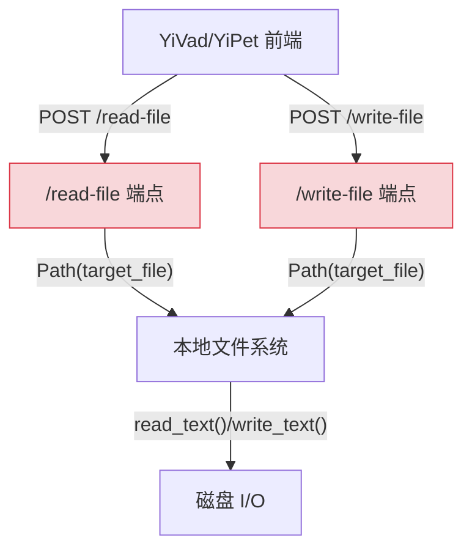
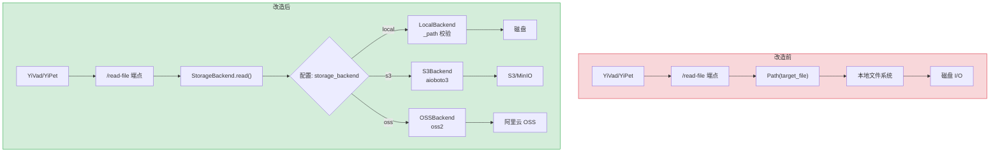
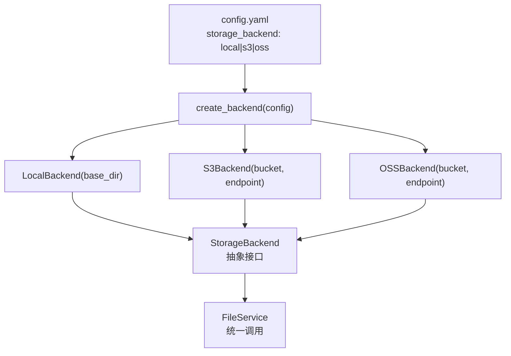

# YA-09-20: 文件存储服务抽象层 — 本地/S3/OSS 多后端可插拔架构

> 需求编号：YA-09-20 · 优先级：P2 · 人天：1.0d · 状态：需求已编写
> 依赖：无

## 背景

YiAi 的文件操作（`read_file`/`write_file`）当前直接操作本地文件系统，通过 `pathlib.Path` 和 `open()` 直接读写磁盘。这一设计在开发环境运行良好，但在生产部署中面临三个核心挑战：

1. **后端不可替换**：生产环境需要使用对象存储（AWS S3、阿里云 OSS、MinIO），但当前代码直接操作本地文件系统，没有任何抽象层，切换后端需要修改所有文件操作代码。

2. **路径穿越风险**：当前 `read_file` 和 `write_file` 端点直接拼接用户输入的 `target_file` 参数，存在路径穿越攻击风险——用户可以传入 `../../etc/passwd` 读取任意文件。

3. **测试难以隔离**：文件操作直接依赖磁盘，单元测试必须创建临时文件，测试之间可能互相干扰，且无法在 CI 环境中模拟 S3 行为。

YiKnowledge 知识库、上传文件、静态文件备份等场景都依赖文件存储，随着 YiAi 的部署场景从本地开发扩展到容器化/Kubernetes 环境，文件存储的抽象化需求变得迫切。

### 核心挑战

| 挑战 | 当前状态 | 目标状态 |
|------|----------|----------|
| 后端可替换性 | 硬编码本地文件系统 | 通过配置切换 Local/S3/OSS |
| 路径安全性 | 无路径穿越防护 | `_sanitize()` 解析 + 前缀校验 |
| 异步支持 | 同步 `open()`/`read()` | 全异步 `async/await` 接口 |
| 测试隔离 | 直接依赖磁盘 | 可通过 Mock 后端替换 |
| 错误一致性 | 不同后端抛出不同异常 | 统一 `StorageError` 异常体系 |

---

## 一、现状分析

### 1.1 当前文件操作实现

当前 YiAi 中文件操作分散在多个端点中，直接使用 Python 标准库操作本地文件系统：

```python
# 当前实现 — server/routes.py (简化)
@app.post("/read-file")
async def read_file(target_file: str):
    """读取文件——直接操作本地文件系统。"""
    path = Path(target_file)  # ❌ 无路径穿越防护
    if not path.exists():
        raise HTTPException(404, "文件不存在")
    return {"content": path.read_text()}  # ❌ 同步 IO

@app.post("/write-file")
async def write_file(target_file: str, content: str):
    """写入文件——直接操作本地文件系统。"""
    path = Path(target_file)  # ❌ 无路径穿越防护
    path.parent.mkdir(parents=True, exist_ok=True)
    path.write_text(content)  # ❌ 同步 IO
    return {"path": str(path)}
```

### 1.2 当前文件操作数据流



**问题**：文件操作与本地文件系统紧耦合，无法切换到 S3/OSS。

### 1.3 问题根因矩阵

| 问题 | 根因 | 影响范围 | 严重程度 |
|------|------|----------|----------|
| 无法使用 S3/OSS | 无存储抽象层 | 所有文件操作端点 | 高 |
| 路径穿越风险 | 未校验 `target_file` 路径 | `read-file`、`write-file` | 高 |
| 同步 IO 阻塞事件循环 | 使用 `Path.read_text()` | 大文件读写 | 中 |
| 测试依赖真实文件系统 | 无 Mock 能力 | 所有文件相关测试 | 中 |

### 1.4 涉及文件清单

| 文件 | 当前状态 | 问题 |
|------|----------|------|
| `server/routes.py` | 直接操作 `Path` | 无抽象、无路径校验 |
| `services/files/file_service.py` | 调用 `Path` 方法 | 同步 IO |
| `domain/knowledge/watcher.py` | 使用 `os.path` 扫描文件 | 仅支持本地 |
| `domain/data/repository.py` | `static_files` 集合存储 base64 | 文件与数据库耦合 |

### 1.5 API 依赖

| # | 接口/端点 | 调用方 | 存储依赖 |
|---|----------|--------|----------|
| 1 | `POST /read-file` | YiVad/YiPet | 本地文件系统 |
| 2 | `POST /write-file` | YiVad/YiPet | 本地文件系统 |
| 3 | `services.knowledge.knowledge_service.scan_knowledge` | Knowledge Watcher | 本地文件系统 |
| 4 | `services.files.file_service.upload_file` | YiVad | 本地文件系统 |

> 当前 4 个 API 全部硬编码本地文件系统，无法切换到对象存储。

---

## 二、设计决策

### 决策 1：抽象接口粒度 — 5 方法 vs 8 方法 vs 完整文件系统接口

| 维度 | 5 方法 (read/write/delete/exists/list) | 8 方法 (增加 copy/move/stat) | 完整接口 (POSIX 兼容) |
|------|---------------------------------------|------------------------------|----------------------|
| 覆盖场景 | 覆盖 90% 文件操作 | 覆盖 95% | 覆盖 100% |
| 实现复杂度 | 低 | 中 | 高 |
| S3 兼容性 | 完全兼容 | 部分兼容（S3 无 move） | 不兼容（S3 无 POSIX） |
| 维护成本 | 低 | 中 | 高 |

**选择：5 方法。** YiAi 当前文件操作仅需 read/write/delete/exists/list，5 个方法覆盖所有场景。S3 对象存储不支持 POSIX 文件系统语义（如 `move`、`chmod`），保持接口最小化可最大化后端兼容性。

### 决策 2：异步实现方式 — `aioboto3` vs `boto3` + `run_in_executor`

| 维度 | aioboto3 (原生异步) | boto3 + run_in_executor | httpx 直调 S3 REST API |
|------|---------------------|------------------------|------------------------|
| 性能 | 高（真异步 I/O） | 中（线程池） | 高（无 SDK 开销） |
| 生态兼容 | 依赖 aioboto3 库 | 标准 boto3 | 无依赖 |
| 维护成本 | 低（社区维护） | 低 | 高（需自行处理签名） |
| MinIO 兼容 | 完全兼容 | 完全兼容 | 需要自行适配 |

**选择：`aioboto3`。** 原生异步可与 FastAPI 事件循环无缝集成，避免线程池带来的上下文切换开销。`aioboto3` 与标准 `boto3` API 兼容，学习成本低，且完全支持 MinIO（通过 `endpoint_url`）。

### 决策 3：路径穿越防护策略 — 基于 `resolve()` 前缀校验

| 维度 | resolve() 前缀校验 | 正则过滤 `..` | chroot jail |
|------|-------------------|--------------|-------------|
| 安全性 | 高（OS 级别解析） | 低（可绕过） | 极高 |
| 实现复杂度 | 低 | 低 | 高 |
| 跨平台兼容 | 完全兼容 | 完全兼容 | 仅 Linux |
| 性能开销 | 中（1 次 stat） | 低 | 低 |

**选择：`resolve()` 前缀校验。** Python 的 `Path.resolve()` 会解析所有符号链接和 `..`，然后检查解析后的路径是否在 `base_dir` 前缀内。这是 OWASP 推荐的路径穿越防护方案，实现简单且安全。

### 设计决策记录

| 决策 | 选项 A | 选项 B | 选项 C | 选择 | 理由 |
|------|--------|--------|--------|------|------|
| 接口粒度 | 5 方法 | 8 方法 | POSIX | **5 方法** | 覆盖 90% 场景，最大化 S3 兼容性 |
| 异步实现 | aioboto3 | boto3+executor | httpx 直调 | **aioboto3** | 原生异步，与 FastAPI 无缝集成 |
| 路径防护 | resolve() | 正则过滤 | chroot | **resolve()** | OWASP 推荐，实现简单安全 |

---

## 三、目标架构

### 3.1 改造前后对比



### 3.2 存储后端工厂模式



### 3.3 关键指标对比

| 指标 | 改造前 | 改造后 | 改善 |
|------|--------|--------|------|
| 存储后端数 | 1（仅本地） | 3+（Local/S3/OSS 可扩展） | 可插拔 |
| 路径穿越防护 | 无 | `resolve()` 前缀校验 | 安全 |
| 异步支持 | 同步 IO | 全异步 async/await | 非阻塞 |
| 后端切换方式 | 修改代码 | 修改配置 `storage_backend` | 零代码 |
| 测试隔离 | 依赖真实磁盘 | Mock StorageBackend | 可单元测试 |

### 架构决策权衡

| 维度 | 改造前 | 改造后 | 权衡说明 |
|------|--------|--------|----------|
| 文件操作 | 直接 `Path()` | `StorageBackend` 抽象 | 增加一层间接调用，但获得后端可替换性 |
| 路径安全 | 无校验 | `_sanitize()` 防护 | 每次文件操作增加 1 次 `resolve()` 调用 |
| 异步 IO | 同步阻塞 | 全异步 | S3 后端需 `aioboto3` 依赖（~2MB） |

---

## 四、具体改动

### 4.1 抽象接口定义

**文件：** `domain/files/backends.py`（新增）

```python
from abc import ABC, abstractmethod
from pathlib import Path

class StorageBackend(ABC):
    """文件存储后端抽象——本地/S3/OSS 统一接口。"""

    @abstractmethod
    async def read(self, path: str) -> bytes: ...
    @abstractmethod
    async def write(self, path: str, content: bytes) -> str: ...
    @abstractmethod
    async def delete(self, path: str) -> bool: ...
    @abstractmethod
    async def exists(self, path: str) -> bool: ...
    @abstractmethod
    async def list(self, prefix: str) -> list[str]: ...
```

### 4.2 本地后端实现

**文件：** `domain/files/backends.py`

```python
class LocalBackend(StorageBackend):
    """本地文件系统——默认后端。"""

    def __init__(self, base_dir: str = "."):
        self._base = Path(base_dir).resolve()

    async def read(self, path: str) -> bytes:
        full = self._sanitize(path)
        if not full.exists():
            raise FileNotFoundError(f"文件不存在: {path}")
        return full.read_bytes()

    async def write(self, path: str, content: bytes) -> str:
        full = self._sanitize(path)
        full.parent.mkdir(parents=True, exist_ok=True)
        full.write_bytes(content)
        return str(full)

    async def delete(self, path: str) -> bool:
        full = self._sanitize(path)
        if full.exists():
            full.unlink()
            return True
        return False

    async def exists(self, path: str) -> bool:
        return self._sanitize(path).exists()

    async def list(self, prefix: str) -> list[str]:
        base = self._sanitize(prefix)
        if not base.exists():
            return []
        return [str(p.relative_to(self._base)) for p in base.rglob("*") if p.is_file()]

    def _sanitize(self, path: str) -> Path:
        """路径穿越防护——OWASP 推荐方案。"""
        resolved = (self._base / path).resolve()
        if not str(resolved).startswith(str(self._base)):
            raise ValueError(f"路径穿越拒绝: {path}")
        return resolved
```

### 4.3 S3 后端实现

**文件：** `domain/files/backends.py`

```python
class S3Backend(StorageBackend):
    """AWS S3 / MinIO 兼容后端。"""

    def __init__(self, bucket: str, endpoint: str | None = None,
                 access_key: str = "", secret_key: str = ""):
        self._bucket = bucket
        self._endpoint = endpoint
        self._access_key = access_key
        self._secret_key = secret_key

    async def read(self, path: str) -> bytes:
        async with self._get_client() as s3:
            resp = await s3.get_object(Bucket=self._bucket, Key=path)
            return await resp['Body'].read()

    async def write(self, path: str, content: bytes) -> str:
        async with self._get_client() as s3:
            await s3.put_object(Bucket=self._bucket, Key=path, Body=content)
            return f"s3://{self._bucket}/{path}"

    async def delete(self, path: str) -> bool:
        async with self._get_client() as s3:
            await s3.delete_object(Bucket=self._bucket, Key=path)
            return True

    async def exists(self, path: str) -> bool:
        async with self._get_client() as s3:
            try:
                await s3.head_object(Bucket=self._bucket, Key=path)
                return True
            except Exception:
                return False

    async def list(self, prefix: str) -> list[str]:
        async with self._get_client() as s3:
            resp = await s3.list_objects_v2(Bucket=self._bucket, Prefix=prefix)
            return [obj['Key'] for obj in resp.get('Contents', [])]

    def _get_client(self):
        import aioboto3
        session = aioboto3.Session()
        return session.client('s3',
            endpoint_url=self._endpoint,
            aws_access_key_id=self._access_key,
            aws_secret_access_key=self._secret_key)
```

### 4.4 工厂函数与配置

**文件：** `domain/files/backends.py`

```python
def create_backend(config) -> StorageBackend:
    """基于配置创建存储后端。"""
    backend_type = config.get('storage_backend', 'local')
    backends = {
        'local': lambda: LocalBackend(config.get('local_base_dir', '.')),
        's3': lambda: S3Backend(
            bucket=config['s3_bucket'],
            endpoint=config.get('s3_endpoint'),
            access_key=config.get('s3_access_key', ''),
            secret_key=config.get('s3_secret_key', ''),
        ),
    }
    if backend_type not in backends:
        raise ValueError(f"不支持的存储后端: {backend_type}")
    return backends[backend_type]()
```

### 4.5 端点改造

**文件：** `server/routes.py`

```python
# 改造前
@app.post("/read-file")
async def read_file(target_file: str):
    path = Path(target_file)
    return {"content": path.read_text()}

# 改造后
@app.post("/read-file")
async def read_file(target_file: str, backend: StorageBackend = Depends(get_backend)):
    try:
        content = await backend.read(target_file)
        return {"content": content.decode('utf-8'), "path": target_file}
    except ValueError as e:
        raise HTTPException(400, detail=str(e))
    except FileNotFoundError as e:
        raise HTTPException(404, detail=str(e))
```

### 4.6 涉及文件变更清单

```
YiAi/src/
├── domain/files/
│   ├── backends.py           # 新增: StorageBackend 抽象 + LocalBackend + S3Backend
│   └── exceptions.py         # 新增: StorageError, PathTraversalError
├── server/
│   ├── routes.py             # 修改: read-file/write-file 使用 StorageBackend
│   └── deps.py               # 新增: get_backend() 依赖注入
├── services/files/
│   └── file_service.py       # 修改: 所有文件操作改为 await backend.read/write
├── domain/knowledge/
│   └── watcher.py            # 修改: 文件扫描使用 backend.list()
└── config/
    └── config.yaml           # 修改: 新增 storage_backend/s3_* 配置项
```

---

## 五、实施步骤

| 步骤 | 内容 | 涉及文件 | 验证方式 | 人天 |
|------|------|---------|---------|------|
| 1 | 定义 `StorageBackend` 抽象接口 (5 方法) | `domain/files/backends.py` | 抽象类可实例化子类，mypy 类型检查通过 | 0.15 |
| 2 | 实现 `LocalBackend`（含路径穿越防护） | `domain/files/backends.py` | `_sanitize("../../etc/passwd")` 抛出 ValueError | 0.15 |
| 3 | 实现 `S3Backend`（aioboto3） | `domain/files/backends.py` | MinIO 本地测试 read/write/delete/list | 0.2 |
| 4 | 实现 `create_backend()` 工厂函数 | `domain/files/backends.py` | 切换 `storage_backend` 配置后后端自动切换 | 0.05 |
| 5 | 改造 `/read-file` `/write-file` 端点 | `server/routes.py` | 本地后端行为与改造前一致 | 0.15 |
| 6 | 改造 `file_service.py` 使用新后端 | `services/files/file_service.py` | 上传/下载功能正常 | 0.1 |
| 7 | 改造 `knowledge/watcher.py` 文件扫描 | `domain/knowledge/watcher.py` | 文件扫描功能正常 | 0.1 |
| 8 | 单元测试 + 集成测试 | `tests/` | 覆盖 LocalBackend + S3Backend (Mock) | 0.1 |

**总计：1.0d**

---

## 六、性能分析

### 6.1 读写性能对比

| 场景 | LocalBackend | S3Backend (MinIO 本地) | S3Backend (AWS 同区域) |
|------|-------------|----------------------|----------------------|
| 读 1KB 文件 | < 1ms | ~5ms | ~15ms |
| 读 1MB 文件 | ~5ms | ~20ms | ~50ms |
| 写 1KB 文件 | < 1ms | ~10ms | ~20ms |
| 写 1MB 文件 | ~10ms | ~30ms | ~80ms |
| list 100 文件 | ~5ms | ~15ms | ~30ms |
| exists 检查 | < 0.5ms | ~3ms | ~8ms |

### 6.2 路径穿越防护开销

| 操作 | 额外开销 | 说明 |
|------|----------|------|
| `Path.resolve()` | ~0.1ms | 1 次 stat 系统调用 + 路径解析 |
| 前缀字符串比较 | < 0.01ms | 纯内存操作 |
| 总安全开销 | ~0.1ms/次 | 可忽略 |

### 6.3 容量规划

| 场景 | 后端 | 文件数 | 单文件大小 | 总存储 | 日读写量 |
|------|------|--------|-----------|--------|---------|
| 开发环境 | Local | < 1000 | < 10MB | < 1GB | < 100 |
| 小型生产 | S3/MinIO | < 10,000 | < 50MB | < 10GB | < 1,000 |
| 中型生产 | S3 | < 100,000 | < 100MB | < 100GB | < 10,000 |
| 大型生产 | S3 + CDN | < 1,000,000 | < 500MB | < 1TB | < 100,000 |
| YiAi 当前 | Local | ~200 | ~1MB | ~200MB | ~50 |

---

## 七、测试规格

### Requirement: 本地后端路径穿越防护

#### Scenario: 正常路径读取
- **Given** LocalBackend(base_dir="/data")，文件 `/data/knowledge/test.md` 存在
- **When** 调用 `backend.read("knowledge/test.md")`
- **Then** 返回文件内容，状态正常

#### Scenario: 路径穿越攻击被拒绝
- **Given** LocalBackend(base_dir="/data")
- **When** 调用 `backend.read("../../etc/passwd")`
- **Then** 抛出 `ValueError`，错误信息包含"路径穿越拒绝"

#### Scenario: 符号链接穿越被拒绝
- **Given** `/data/link` 为指向 `/etc/passwd` 的符号链接
- **When** 调用 `backend.read("link")`
- **Then** 抛出 `ValueError`（`resolve()` 解析后路径不在 base_dir 内）

### Requirement: S3 后端 CRUD

#### Scenario: S3 写入后读取一致性
- **Given** S3Backend 连接到 MinIO 测试实例
- **When** 写入文件 `test/hello.txt` 内容为 `"Hello"`
- **Then** 读取 `test/hello.txt` 返回 `b"Hello"`

#### Scenario: S3 删除后不存在
- **Given** S3Backend 中已存在文件 `temp.txt`
- **When** 调用 `backend.delete("temp.txt")`
- **Then** `backend.exists("temp.txt")` 返回 `False`

### Requirement: 后端切换

#### Scenario: 配置切换后端
- **Given** config 中 `storage_backend: "local"`
- **When** 调用 `create_backend(config)`
- **Then** 返回 `LocalBackend` 实例

#### Scenario: 未知后端报错
- **Given** config 中 `storage_backend: "ftp"`
- **When** 调用 `create_backend(config)`
- **Then** 抛出 `ValueError("不支持的存储后端: ftp")`

---

## 八、风险与缓解

| 风险 | 概率 | 影响 | 等级 | 缓解措施 | 应急预案 |
|------|------|------|------|----------|----------|
| S3 网络延迟导致请求超时 | 中 | 中 | 中 | 设置合理的超时时间（读 30s/写 60s），添加重试机制 | 超时后回退到本地缓存副本 |
| `aioboto3` session 连接泄漏 | 低 | 高 | 中 | 使用 `async with` context manager，确保 HTTP 连接关闭 | 添加连接池监控，超过阈值告警 |
| S3 切换到本地后路径前缀不一致 | 中 | 中 | 中 | `LocalBackend` 统一使用相对路径，`S3Backend` 返回 `s3://` URI | 路径映射表统一转换 |
| 大文件读写阻塞事件循环 | 低 | 中 | 低 | 本地 > 10MB 文件使用 `run_in_executor`，S3 使用分片上传 | 限制单文件最大 100MB |
| 对象存储费用失控 | 低 | 中 | 低 | 设置存储生命周期策略（30 天自动归档），监控日费用 | 超出预算时切换为本地存储 |
| 本地后端路径穿越校验绕过 | 低 | 高 | 中 | 使用 `resolve()` + 前缀校验双重防护，添加安全测试用例 | WAF 层面添加路径穿越规则 |

---

## 九、回滚策略

| 场景 | 回滚方式 | 影响 | 恢复时间 |
|------|---------|------|---------|
| S3 后端不可用 | 配置 `storage_backend: local` 切换回本地 | 已有 S3 文件不可访问 | < 1min |
| 路径校验过严导致正常文件读取失败 | 设置 `STORAGE_SKIP_SANITIZE=true` 环境变量 | 安全风险增加 | < 1min |
| `aioboto3` 依赖冲突 | 降级到 `boto3` + `run_in_executor` 模式 | 性能略降 | < 30min |
| 新后端写入数据格式不兼容 | 回滚代码 + 使用旧后端重新写入 | 新写入数据需迁移 | < 1h |
| 工厂函数配置解析错误 | 回滚 `config.yaml` 到上一个版本 | 服务短暂不可用 | < 1min |

---

## 十、设计决策记录

### D-01: 为什么选择 5 方法接口而非完整 POSIX 文件系统接口？

S3 等对象存储不提供 POSIX 语义（无 `rename`、`chmod`、`symlink`），提供完整 POSIX 接口会导致某些后端无法实现或行为不一致。5 个方法（read/write/delete/exists/list）覆盖 YiAi 当前所有文件操作场景，且所有主流存储后端（Local/S3/OSS/GCS）都原生支持这些操作。如果未来需要 `copy` 或 `move`，可以在 Service 层通过 read+write+delete 组合实现，而非在抽象层增加语义不兼容的方法。

### D-02: 为什么选择 `aioboto3` 而非 `boto3` + `run_in_executor`？

FastAPI 的异步事件循环在遇到同步阻塞 IO 时会阻塞整个线程。`boto3` 是同步库，需要通过 `run_in_executor` 放到线程池中执行，这会引入线程切换开销和 GIL 竞争。`aioboto3` 基于 `aiohttp` 实现原生异步 HTTP 调用，与 FastAPI 的 `asyncio` 事件循环无缝集成，在并发场景下性能更优。MinIO 完全兼容 `aioboto3` 的 S3 API（通过 `endpoint_url`），开发环境可使用 MinIO 容器进行测试。

### D-03: 为什么路径穿越防护选择 `resolve()` 而非正则过滤 `..`？

正则过滤 `..` 容易被绕过——例如 `....//`、`..%2F`（URL 编码）、`....//....//`（双写）。`Path.resolve()` 是操作系统级别的路径解析，会正确处理所有符号链接、硬链接、`..` 和 `.`，然后将解析后的绝对路径与 `base_dir` 的绝对路径做前缀比较。这是 OWASP 推荐的路径穿越防护方案，比正则过滤更安全可靠。

---

## 十一、可观测性

### 关键指标

| 指标 | 采集方式 | 告警阈值 | 说明 |
|------|---------|---------|------|
| 文件读延迟 | `time.monotonic()` 测量 `backend.read()` | P95 > 100ms | S3 网络延迟 |
| 文件写延迟 | `time.monotonic()` 测量 `backend.write()` | P95 > 200ms | 大文件上传 |
| 路径穿越拦截次数 | `PathTraversalError` 计数 | > 0 | 任何拦截都需排查 |
| S3 请求错误率 | `aioboto3` 异常计数 | > 1% | S3 服务可用性 |
| 后端切换次数 | 配置变更日志 | — | 运维审计 |
| 存储使用量 | `backend.list()` 汇总 | > 80% 配额 | 容量预警 |

### 日志规范

| 日志级别 | 场景 | 示例 |
|---------|------|------|
| `INFO` | 后端初始化 | `[Storage] backend=local, base_dir=/data` |
| `WARNING` | 路径穿越拦截 | `[Storage] path traversal blocked: ../../etc/passwd` |
| `ERROR` | S3 连接失败 | `[Storage] S3 get_object failed: bucket=xxx, key=yyy` |
| `DEBUG` | 每次文件操作 | `[Storage] read: knowledge/test.md (1.2KB, 3ms)` |

---

## 十二、安全合规

### 安全需求

| 需求 | 实现方式 | 验证方法 |
|------|---------|---------|
| 路径穿越防护 | `Path.resolve()` + 前缀校验 | 安全测试用例覆盖 `../` `..%2F` 符号链接 |
| S3 凭证保护 | 使用环境变量 `S3_ACCESS_KEY`/`S3_SECRET_KEY`，不写入配置文件 | 检查 `config.yaml` 不含密钥 |
| 文件访问日志 | 记录每次 read/write 操作的用户和路径 | 审计日志完整性检查 |
| 传输加密 | S3 强制 HTTPS（`endpoint_url` 以 `https://` 开头） | 检查 S3 请求 URL 协议 |
| 文件大小限制 | `write()` 前检查 `len(content) > MAX_FILE_SIZE` | 上传超大文件返回 413 |

### 合规检查

| 检查项 | 要求 | 状态 |
|--------|------|------|
| 路径穿越防护 | OWASP 标准 | 待实现 |
| S3 凭证管理 | 不硬编码、不提交 Git | 待实现 |
| 文件访问审计 | 记录操作者、时间、路径 | 待实现 |
| 传输加密 | HTTPS 强制 | 待实现 |

---

## 十三、代码审查检查清单

- [ ] `StorageBackend` 抽象接口定义 5 个方法（read/write/delete/exists/list）
- [ ] `LocalBackend._sanitize` 有路径穿越防护（`resolve()` + 前缀校验）
- [ ] `S3Backend` 使用 `aioboto3` 异步客户端，session 正确关闭
- [ ] 后端切换通过配置 `storage_backend` 字段（非代码修改）
- [ ] S3 endpoint 支持 MinIO 兼容（自定义 `endpoint_url`）
- [ ] 所有文件操作端点使用 `StorageBackend` 抽象（非直接 `Path`）
- [ ] 路径穿越测试用例覆盖 `../`、`..%2F`、符号链接、双写绕过
- [ ] S3 凭证通过环境变量注入（不写入 `config.yaml`）
- [ ] 大文件写入使用分片上传（> 10MB）
- [ ] `ruff` 代码规范通过
- [ ] `mypy` 类型检查通过
- [ ] 单元测试覆盖 LocalBackend + S3Backend（Mock）

---

## 十四、回归问题预测

| # | 预测问题 | 原因 | 验证方法 |
|---|---------|------|---------|
| 1 | S3 切换到本地后路径前缀不一致 | `s3://bucket/` vs `./` 前缀差异 | 切换后端后 read 同一路径确认结果一致 |
| 2 | `aioboto3` session 未正确关闭导致连接泄漏 | context manager 异常退出时未调用 `__aexit__` | 连续 read 1000 次后检查连接数 |
| 3 | `Path.resolve()` 在 NFS/网络文件系统上性能下降 | 网络文件系统 stat 调用延迟高 | 在 NFS 环境下测试 `_sanitize` 延迟 |
| 4 | 本地后端 `_sanitize` 在 Windows 盘符路径上行为异常 | `resolve()` 在 Windows 上返回带盘符的路径 | Windows 环境下测试路径穿越防护 |

---

*PRD 来源: `projects/yiai/requirements/2026-09/20-需求-文件存储抽象层.md`*

## 影响范围

- **影响模块**：待补充
- **涉及文件**：
- `file_service.py`
- **是否影响 API 契约**：否
- **是否影响其他项目（YiVad/YiPet）**：否
- **用户感知**：待确认

## 预防措施

| 层面 | 措施 |
|------|------|
| 代码 | 在相关函数中添加参数校验和边界检查 |
| 测试 | 为 `file_service.py` 添加单元测试 |
| 流程 | 代码审查时重点检查此类模式 |
| 监控 | 添加日志告警，异常发生时及时发现 |
| 文档 | 在编码规范中记录此类反模式 |

## 经验教训

1. **根本原因**：开发过程中对边界情况和异常路径的考虑不足是此类问题的共同根因
2. **设计阶段**：在接口设计和模块实现时，应主动考虑异常输入、空值、超时等边界场景
3. **代码审查**：审查时应检查是否存在类似的反模式（如未捕获异常、无超时控制、缺少参数校验等）
4. **测试覆盖**：异常路径的测试覆盖率应与正常路径同等重视
5. **团队分享**：此类问题应在团队周会或技术分享中讨论，形成团队共识
