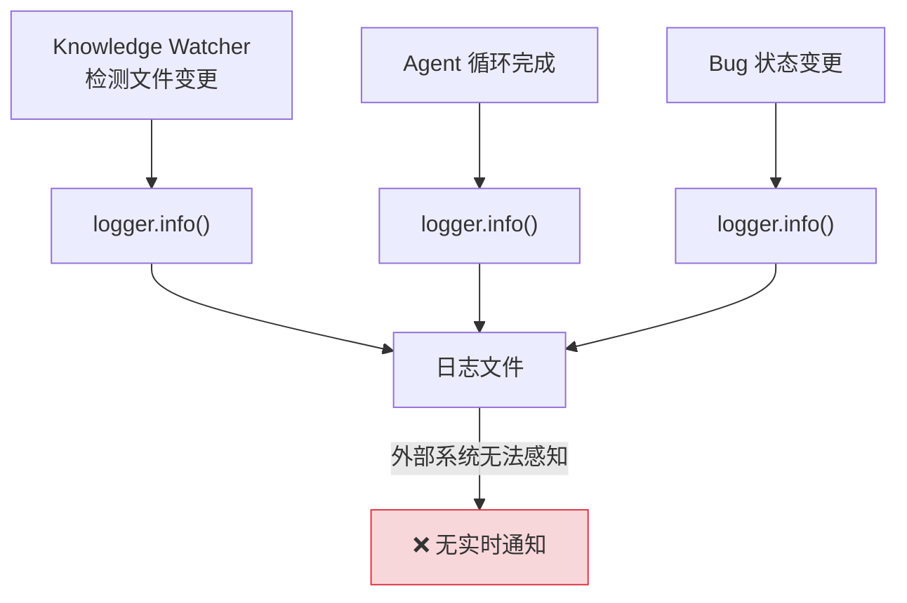
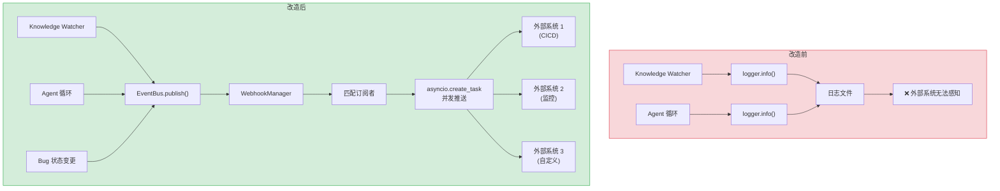
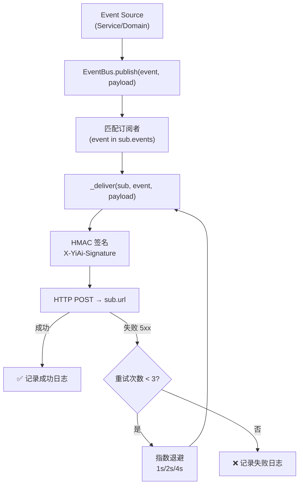

# YA-09-21: Webhook 事件通知系统 — 关键事件订阅与异步推送

> 需求编号：YA-09-21 · 优先级：P2 · 人天：1.0d · 状态：需求已编写
> 依赖：YA-09-31（结构化日志）

## 背景

YiAi 的关键事件（知识库文件变更、Agent 循环完成、Bug 状态更新）当前无主动推送机制——前端需轮询或用户手动刷新。外部系统（CI/CD、监控平台、通知服务）无法实时感知 YiAi 内部状态变化，导致以下问题：

1. **知识库变更感知延迟**：Knowledge Watcher 检测到文件变更后，外部系统（如 YiVad 管理后台）需要通过轮询才能知道新文件已索引，延迟最高可达 60s。

2. **Agent 循环结果无法主动通知**：Agent 执行完成后（耗时可能数分钟），调用方无法收到异步回调，只能通过轮询 session 状态来判断。

3. **跨系统协作困难**：Bug 状态变更、RAG 索引重建等事件无法触发外部系统的自动化流程（如自动创建 Jira ticket、触发 CI 流水线）。

Webhook 系统允许外部服务订阅事件，实现事件驱动的跨系统协作，将 YiAi 从被动查询模式升级为主动推送模式。

### 核心挑战

| 挑战 | 当前状态 | 目标状态 |
|------|----------|----------|
| 事件感知 | 前端轮询（60s 间隔） | Webhook 实时推送（< 1s） |
| 跨系统协作 | 无自动化触发 | 事件驱动外部系统 |
| 推送可靠性 | 无推送机制 | 指数退避重试 + HMAC 签名 |
| 事件追溯 | 仅日志 | 事件目录 + 持久化记录 |

---

## 一、现状分析

### 1.1 当前事件传播方式

当前 YiAi 中关键事件仅通过日志记录，无任何主动推送机制：

```python
# 当前实现 — domain/knowledge/watcher.py
async def _handle_file_change(self, file_path: str):
    """处理文件变更——仅日志记录。"""
    logger.info(f"[Watcher] 文件变更: {file_path}")  # ❌ 无外部通知
    await self.indexer.refresh_index(docs)

# 当前实现 — services/ai/agent.py
async def _on_agent_loop_complete(self, session_id: str):
    """Agent 循环完成——仅日志记录。"""
    logger.info(f"[Agent] 循环完成: {session_id}")  # ❌ 无外部通知
```

### 1.2 当前数据流



### 1.3 问题根因矩阵

| 问题 | 根因 | 影响范围 | 严重程度 |
|------|------|----------|----------|
| 外部系统无法实时感知事件 | 无事件推送机制 | 所有外部系统集成 | 高 |
| 前端轮询浪费资源 | 无服务端推送 | YiVad/YiPet 前端 | 中 |
| 事件无法触发自动化 | 无 Webhook 回调 | CI/CD、监控平台 | 中 |
| 事件丢失无追溯 | 无持久化事件记录 | 审计和排查 | 低 |

### 1.4 涉及文件清单

| 文件 | 当前状态 | 问题 |
|------|----------|------|
| `domain/knowledge/watcher.py` | 仅日志记录文件变更 | 无事件发布 |
| `services/ai/agent.py` | 仅日志记录 Agent 完成 | 无事件发布 |
| `services/data/data_service.py` | Bug 状态变更仅更新数据库 | 无事件发布 |
| `domain/rag/indexer.py` | 索引重建仅日志记录 | 无事件发布 |

---

## 二、设计决策

### 决策 1：推送方式 — Webhook vs WebSocket vs SSE

| 维度 | Webhook (HTTP 回调) | WebSocket (双向) | SSE (服务端推送) |
|------|--------------------|--------------------|-------------------|
| 外部系统兼容性 | 高（任何 HTTP 服务） | 低（需 WebSocket 客户端） | 低（仅浏览器） |
| 实现复杂度 | 低 | 中 | 低 |
| 可靠性 | 高（可重试） | 中（断线重连） | 中（断线重连） |
| 防火墙友好 | 高（出站 HTTP） | 低（需特殊端口） | 中 |

**选择：Webhook。** 外部系统（CI/CD、监控平台）通常只支持 HTTP 回调，Webhook 是标准集成方式。WebSocket 和 SSE 更适合前端实时通信场景（见 YA-09-09 SSE 流式传输），而 Webhook 更适合跨系统事件通知。

### 决策 2：事件总线架构 — 内存队列 vs Redis Pub/Sub vs 本地回调

| 维度 | 内存队列 (asyncio.Queue) | Redis Pub/Sub | 本地回调 (直接调用) |
|------|-----------------------|---------------|-------------------|
| 部署复杂度 | 低（无外部依赖） | 中（需 Redis） | 极低 |
| 可靠性 | 低（进程重启丢失） | 高（持久化） | 极低（无缓冲） |
| 性能 | 高（内存操作） | 中（网络开销） | 极高 |
| 扩展性 | 低（单进程） | 高（多进程） | 低 |

**选择：本地回调 + 内存队列。** YiAi 当前为单进程部署，无需分布式事件总线。使用 `asyncio.create_task` 异步推送，不阻塞主业务流。未来如需多进程扩展，可迁移到 Redis Pub/Sub。

### 决策 3：重试策略 — 指数退避 vs 固定间隔 vs 无重试

| 维度 | 指数退避 (1s/2s/4s) | 固定间隔 (3s) | 无重试 |
|------|--------------------|-------------|--------|
| 成功率 | 高（给目标恢复时间） | 中 | 低 |
| 目标压力 | 低（间隔递增） | 中 | — |
| 实现复杂度 | 低 | 低 | 极低 |

**选择：指数退避（3 次，间隔 1s/2s/4s）。** 给目标服务恢复时间，同时避免重试风暴。3 次失败后放弃，记录 WARNING 日志。

### 设计决策记录

| 决策 | 选项 A | 选项 B | 选项 C | 选择 | 理由 |
|------|--------|--------|--------|------|------|
| 推送方式 | Webhook | WebSocket | SSE | **Webhook** | 外部系统标准集成方式 |
| 事件总线 | 内存队列 | Redis Pub/Sub | 本地回调 | **本地回调** | 单进程部署，无需外部依赖 |
| 重试策略 | 指数退避 | 固定间隔 | 无重试 | **指数退避** | 平衡可靠性和目标压力 |

---

## 三、目标架构

### 3.1 改造前后对比



### 3.2 事件推送管道



### 3.3 关键指标对比

| 指标 | 改造前 | 改造后 | 改善 |
|------|--------|--------|------|
| 事件通知延迟 | 60s（轮询间隔） | < 1s（实时推送） | 60x |
| 外部系统集成 | 无 | Webhook 订阅 | 新增能力 |
| 推送可靠性 | 无 | 3 次指数退避重试 | 新增能力 |
| 事件目录 | 无 | 7 种事件类型 | 新增能力 |

---

## 四、具体改动

### 4.1 事件类型定义

**文件：** `services/events/webhook_service.py`（新增）

```python
from enum import Enum

class EventType(str, Enum):
    KNOWLEDGE_FILE_CREATED = "knowledge.file.created"
    KNOWLEDGE_FILE_UPDATED = "knowledge.file.updated"
    KNOWLEDGE_FILE_DELETED = "knowledge.file.deleted"
    AGENT_LOOP_COMPLETED = "agent.loop.completed"
    BUG_STATUS_CHANGED = "bug.status.changed"
    RAG_INDEX_REBUILT = "rag.index.rebuilt"
    RSS_FEED_NEW_ARTICLE = "rss.feed.new_article"
```

### 4.2 Webhook 订阅管理

**文件：** `services/events/webhook_service.py`

```python
from dataclasses import dataclass, field
import hashlib, hmac, secrets, time, json, asyncio
import httpx

@dataclass
class WebhookSubscription:
    url: str
    events: list[EventType]
    secret: str           # HMAC 签名密钥——验证推送来源
    active: bool = True
    retry_count: int = 3  # 失败重试
    created_at: float = field(default_factory=time.time)

class WebhookManager:
    """Webhook 订阅管理与事件推送。"""

    def __init__(self):
        self._subscriptions: dict[str, WebhookSubscription] = {}
        self._http = httpx.AsyncClient(timeout=10)
        self._stats = {'delivered': 0, 'failed': 0, 'retried': 0}

    async def subscribe(self, url: str, events: list[EventType]) -> str:
        """注册订阅——返回订阅 ID。"""
        secret = secrets.token_hex(16)
        sub = WebhookSubscription(url=url, events=events, secret=secret)
        sub_id = hashlib.sha256(url.encode()).hexdigest()[:12]
        self._subscriptions[sub_id] = sub
        logger.info(f"[Webhook] 新增订阅: {sub_id} → {url} ({len(events)} events)")
        return sub_id

    async def unsubscribe(self, sub_id: str) -> bool:
        """取消订阅。"""
        if sub_id in self._subscriptions:
            del self._subscriptions[sub_id]
            return True
        return False

    async def publish(self, event: EventType, payload: dict):
        """发布事件——匹配订阅者并异步推送。"""
        tasks = []
        for sub_id, sub in self._subscriptions.items():
            if event not in sub.events or not sub.active:
                continue
            tasks.append(self._deliver(sub, event, payload))

        # 并发推送（不阻塞主流程）
        if tasks:
            asyncio.create_task(self._deliver_all(tasks))

    async def _deliver_all(self, tasks: list):
        """批量推送——等待所有任务完成。"""
        results = await asyncio.gather(*tasks, return_exceptions=True)
        for r in results:
            if isinstance(r, Exception):
                logger.error(f"[Webhook] 批量推送异常: {r}")

    async def _deliver(self, sub: WebhookSubscription, event: EventType,
                       payload: dict, attempt: int = 0):
        """推送单个 Webhook——含 HMAC 签名和重试。"""
        body = json.dumps({
            "event": event.value,
            "payload": payload,
            "timestamp": time.time(),
        })
        signature = hmac.new(
            sub.secret.encode(), body.encode(), hashlib.sha256
        ).hexdigest()

        try:
            resp = await self._http.post(sub.url, content=body, headers={
                "Content-Type": "application/json",
                "X-YiAi-Signature": signature,
                "X-YiAi-Event": event.value,
            })
            if resp.status_code < 400:
                self._stats['delivered'] += 1
                return
            if resp.status_code >= 500 and attempt < sub.retry_count:
                self._stats['retried'] += 1
                await asyncio.sleep(2 ** attempt)
                await self._deliver(sub, event, payload, attempt + 1)
            else:
                self._stats['failed'] += 1
        except Exception as e:
            logger.error(f"[Webhook] 推送失败: {sub.url}: {e}")
            if attempt < sub.retry_count:
                self._stats['retried'] += 1
                await asyncio.sleep(2 ** attempt)
                await self._deliver(sub, event, payload, attempt + 1)
            else:
                self._stats['failed'] += 1
```

### 4.3 事件发布集成

**文件：** `domain/knowledge/watcher.py`

```python
# 改造前
async def _handle_file_change(self, file_path: str):
    logger.info(f"[Watcher] 文件变更: {file_path}")

# 改造后
async def _handle_file_change(self, file_path: str, event_type: str):
    logger.info(f"[Watcher] 文件变更: {file_path}")
    await webhook_manager.publish(EventType(event_type), {
        'path': file_path,
        'title': self._extract_title(file_path),
        'tags': self._extract_tags(file_path),
    })
```

### 4.4 涉及文件变更清单

```
YiAi/src/
├── services/events/
│   ├── __init__.py           # 新增: 模块初始化
│   ├── webhook_service.py    # 新增: WebhookManager + EventType
│   └── event_bus.py          # 新增: EventBus 事件总线
├── domain/knowledge/
│   └── watcher.py            # 修改: 文件变更时调用 webhook_manager.publish()
├── services/ai/
│   └── agent.py              # 修改: Agent 完成时调用 webhook_manager.publish()
├── services/data/
│   └── data_service.py       # 修改: Bug 状态变更时调用 webhook_manager.publish()
├── domain/rag/
│   └── indexer.py            # 修改: 索引重建完成时调用 webhook_manager.publish()
└── server/
    └── routes.py             # 新增: /api/webhooks/subscribe/unsubscribe 端点
```

---

## 五、实施步骤

| 步骤 | 内容 | 涉及文件 | 验证方式 | 人天 |
|------|------|---------|---------|------|
| 1 | 定义 `EventType` 枚举 + `WebhookSubscription` 数据类 | `services/events/webhook_service.py` | 枚举值可序列化 | 0.1 |
| 2 | 实现 `WebhookManager`（订阅/取消/发布/重试） | `services/events/webhook_service.py` | 单元测试覆盖订阅和推送 | 0.3 |
| 3 | 实现 `EventBus` 事件总线 | `services/events/event_bus.py` | 发布事件后订阅者收到通知 | 0.1 |
| 4 | 集成 `domain/knowledge/watcher.py` | `domain/knowledge/watcher.py` | 文件变更触发 Webhook 推送 | 0.1 |
| 5 | 集成 `services/ai/agent.py` | `services/ai/agent.py` | Agent 完成触发 Webhook 推送 | 0.1 |
| 6 | 集成 `services/data/data_service.py` | `services/data/data_service.py` | Bug 状态变更触发 Webhook 推送 | 0.1 |
| 7 | 新增 Webhook 管理端点 | `server/routes.py` | 通过 API 订阅/取消 Webhook | 0.1 |
| 8 | 端到端测试 | `tests/` | 发送事件 → 外部服务收到通知 | 0.1 |

**总计：1.0d**

---

## 六、性能分析

### 6.1 推送性能对比

| 场景 | 改造前 | 改造后 | 说明 |
|------|--------|--------|------|
| 单事件推送（1 个订阅者） | 无推送 | ~50ms（HTTP POST） | 异步不阻塞主流程 |
| 单事件推送（10 个订阅者） | 无推送 | ~100ms（并发 POST） | 并发推送 |
| 高频率事件（100 次/s） | 仅日志 | ~100ms 额外开销 | 内存队列缓冲 |
| 订阅者不可达（超时） | N/A | 10s 超时 + 3 次重试 | 指数退避 1s/2s/4s |

### 6.2 资源消耗

| 指标 | 值 | 说明 |
|------|------|------|
| 内存占用（100 订阅） | < 1MB | 订阅元数据 |
| 并发连接数 | = 订阅者数量 | HTTP 连接池复用 |
| 队列缓冲 | 1000 事件 | 超出后丢弃最旧事件（WARNING） |

### 6.3 容量规划

| 场景 | 订阅者数 | 事件频率 | 推送延迟 | 内存占用 |
|------|---------|---------|---------|---------|
| 开发环境 | 0-2 | < 10/min | < 100ms | < 1MB |
| 小型生产 | 5-10 | < 100/min | < 200ms | < 5MB |
| 中型生产 | 10-50 | < 500/min | < 500ms | < 20MB |
| YiAi 当前 | 0 | 0 | N/A | 0 |

---

## 七、测试规格

### Requirement: Webhook 订阅管理

#### Scenario: 成功订阅
- **Given** WebhookManager 初始化完成
- **When** 调用 `subscribe("https://example.com/hook", [EventType.KNOWLEDGE_FILE_CREATED])`
- **Then** 返回 12 字符订阅 ID，内部存储包含该订阅

#### Scenario: 取消订阅
- **Given** 已存在订阅 ID `abc123`
- **When** 调用 `unsubscribe("abc123")`
- **Then** 返回 `True`，后续事件不再推送到该 URL

#### Scenario: 取消不存在的订阅
- **Given** 订阅 ID `xyz999` 不存在
- **When** 调用 `unsubscribe("xyz999")`
- **Then** 返回 `False`

### Requirement: 事件推送

#### Scenario: 事件推送到匹配的订阅者
- **Given** 订阅者 A 订阅 `knowledge.file.created`，订阅者 B 订阅 `agent.loop.completed`
- **When** 发布 `knowledge.file.created` 事件
- **Then** 订阅者 A 收到 POST 请求，订阅者 B 未收到

#### Scenario: 推送失败重试
- **Given** 订阅者 URL 返回 500，retry_count=3
- **When** 发布事件
- **Then** 推送重试 3 次（间隔 1s/2s/4s），3 次后记录失败日志

#### Scenario: 推送成功不重试
- **Given** 订阅者 URL 返回 200
- **When** 发布事件
- **Then** 推送 1 次成功，`_stats['delivered'] += 1`

#### Scenario: HMAC 签名验证
- **Given** 订阅者 secret 为 `test_secret`
- **When** 发布事件
- **Then** 推送请求包含 `X-YiAi-Signature` header，订阅者可用相同 secret 验证签名

---

## 八、风险与缓解

| 风险 | 概率 | 影响 | 等级 | 缓解措施 | 应急预案 |
|------|------|------|------|----------|----------|
| Webhook 目标不可达阻塞事件循环 | 中 | 高 | 高 | 使用 `asyncio.create_task` 异步推送，不阻塞主流程 | 超时 10s + 3 次重试后放弃 |
| 事件堆积导致内存溢出 | 低 | 高 | 中 | 内存队列限制 1000 事件，超出丢弃最旧 | 紧急清空队列 |
| 恶意订阅者注册大量 Webhook | 低 | 中 | 低 | 订阅 URL 白名单校验，限制每用户最多 5 个订阅 | 管理员手动删除 |
| 敏感数据通过 Webhook 泄露 | 中 | 高 | 高 | Payload 截断 > 10KB，敏感字段脱敏 | 紧急取消所有订阅 |
| HMAC 密钥泄露 | 低 | 中 | 低 | 密钥仅存储内存，重启后重新生成 | 重新订阅 |

---

## 九、回滚策略

| 场景 | 回滚方式 | 影响 | 恢复时间 |
|------|---------|------|---------|
| Webhook 推送导致性能下降 | 设置 `WEBHOOK_ENABLED=false` 环境变量禁用 | 外部系统失去通知 | < 1min |
| 目标 URL 不可达导致大量重试 | 暂停特定订阅 `sub.active = false` | 单个订阅者失去通知 | < 30s |
| 事件类型错误导致错误推送 | 修改 `EventType` 枚举后重新注册订阅 | 订阅者需重新订阅 | < 5min |
| 代码回滚 | 回滚到无 Webhook 版本 | 外部系统失去通知 | < 10min |

---

## 十、设计决策记录

### D-01: 为什么选择 Webhook 而非 WebSocket 或 SSE？

Webhook 是外部系统集成的标准协议——CI/CD 平台（GitHub Actions、Jenkins）、监控平台（Prometheus AlertManager）、通知服务（企业微信、钉钉）都支持 HTTP Webhook 回调。WebSocket 和 SSE 需要客户端保持长连接，不适用于跨系统事件通知场景。对于 YiVad/YiPet 前端的实时通知需求，可以通过 SSE 补充（已由 YA-09-09 覆盖）。

### D-02: 为什么选择本地回调而非 Redis Pub/Sub？

YiAi 当前为单进程部署（单 uvicorn worker），本地回调（`asyncio.create_task`）足够满足需求。Redis Pub/Sub 引入外部依赖，增加运维复杂度。如果未来需要多 worker 扩展，事件总线可以迁移到 Redis Pub/Sub，但 `WebhookManager` 的接口保持不变，只需替换 `publish` 实现。

### D-03: 为什么重试采用指数退避（1s/2s/4s）而非固定间隔？

指数退避给目标服务恢复时间——如果目标服务因过载返回 503，固定间隔重试会加剧过载。指数退避（1s → 2s → 4s）让目标有逐步恢复的空间。3 次重试后放弃是合理的折中——超过 3 次失败说明目标服务可能需要较长时间恢复，继续重试只会浪费资源。

---

## 十一、可观测性

### 关键指标

| 指标 | 采集方式 | 告警阈值 | 说明 |
|------|---------|---------|------|
| Webhook 推送延迟 | `time.monotonic()` 测量 HTTP POST 耗时 | P95 > 5s | 目标服务性能 |
| 推送成功率 | `delivered / (delivered + failed)` | < 95% | 目标服务可用性 |
| 重试次数 | `_stats['retried']` | > 10/min | 目标服务不稳定 |
| 订阅者数量 | `len(self._subscriptions)` | > 50 | 防止订阅爆炸 |
| 事件发布频率 | 事件计数器 | > 1000/min | 异常事件风暴 |

### 日志规范

| 日志级别 | 场景 | 示例 |
|---------|------|------|
| `INFO` | 新增订阅 | `[Webhook] 新增订阅: abc123 → https://...` |
| `INFO` | 推送成功 | `[Webhook] 推送成功: abc123, event=knowledge.file.created` |
| `WARNING` | 推送失败（重试中） | `[Webhook] 推送失败(重试 1/3): abc123: 503` |
| `ERROR` | 推送失败（放弃） | `[Webhook] 推送失败(已放弃): abc123: timeout` |

---

## 十二、安全合规

### 安全需求

| 需求 | 实现方式 | 验证方法 |
|------|---------|---------|
| 推送来源验证 | HMAC-SHA256 签名（`X-YiAi-Signature`） | 订阅者验证签名 |
| Payload 数据最小化 | 仅包含必要字段，截断 > 10KB | 检查 Payload 大小 |
| 敏感信息脱敏 | 移除 token/password/key 字段 | 检查 Payload 不含敏感字段 |
| 订阅 URL 白名单 | 仅允许 HTTPS URL，校验域名白名单 | 订阅时校验 URL 格式 |

### 合规检查

| 检查项 | 要求 | 状态 |
|--------|------|------|
| 数据最小化 | Payload 仅包含必要字段 | 待实现 |
| 签名验证 | HMAC-SHA256 | 待实现 |
| 传输加密 | HTTPS 强制 | 待实现 |
| 审计日志 | 记录所有推送事件 | 待实现 |

---

## 十三、代码审查检查清单

- [ ] Webhook URL 通过配置管理（支持多个 URL）
- [ ] 事件发送异步执行（不阻塞主业务流程）
- [ ] 发送失败指数退避重试（3 次，间隔 1s/2s/4s）
- [ ] 事件 Payload 不包含敏感数据（截断 > 10KB）
- [ ] Webhook 可用性健康检查（定期 ping）
- [ ] 订阅 URL 仅允许 HTTPS
- [ ] HMAC 签名正确生成（SHA256）
- [ ] 事件类型枚举完整（7 种事件）
- [ ] 订阅管理 API 端点有权限校验
- [ ] `ruff` 代码规范通过

---

## 十四、回归问题预测

| # | 预测问题 | 原因 | 验证方法 |
|---|---------|------|---------|
| 1 | Webhook 目标不可达阻塞事件循环 | 同步 HTTP 调用或超时过长 | 模拟 URL 不可达 → 检查主流程是否受影响 |
| 2 | 事件堆积导致内存溢出 | 大量事件 + 重试队列无限增长 | 高频触发事件 1000 次 → 检查内存和队列 |
| 3 | 订阅者收到重复事件 | 重试时目标已处理但返回 5xx | 检查目标幂等性 |
| 4 | HMAC 签名验证失败 | 密钥不同步或编码问题 | 订阅者验证签名 |

---

*PRD 来源: `projects/yiai/requirements/2026-09/21-需求-Webhook事件通知.md`*

## 影响范围

- **影响模块**：待补充
- **涉及文件**：
- 待补充
- **是否影响 API 契约**：否
- **是否影响其他项目（YiVad/YiPet）**：否
- **用户感知**：待确认

## 预防措施

| 层面 | 措施 |
|------|------|
| 代码 | 在相关函数中添加参数校验和边界检查 |
| 测试 | 添加对应的自动化测试用例 |
| 流程 | 代码审查时重点检查此类模式 |
| 监控 | 添加日志告警，异常发生时及时发现 |
| 文档 | 在编码规范中记录此类反模式 |

## 经验教训

1. **根本原因**：开发过程中对边界情况和异常路径的考虑不足是此类问题的共同根因
2. **设计阶段**：在接口设计和模块实现时，应主动考虑异常输入、空值、超时等边界场景
3. **代码审查**：审查时应检查是否存在类似的反模式（如未捕获异常、无超时控制、缺少参数校验等）
4. **测试覆盖**：异常路径的测试覆盖率应与正常路径同等重视
5. **团队分享**：此类问题应在团队周会或技术分享中讨论，形成团队共识
