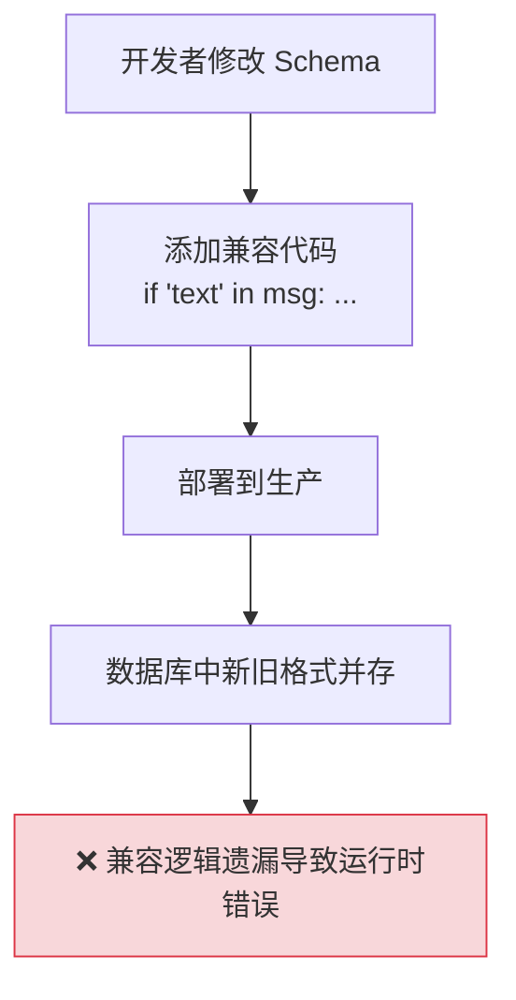
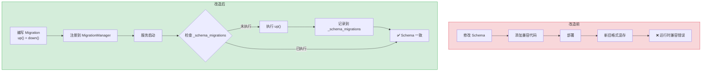
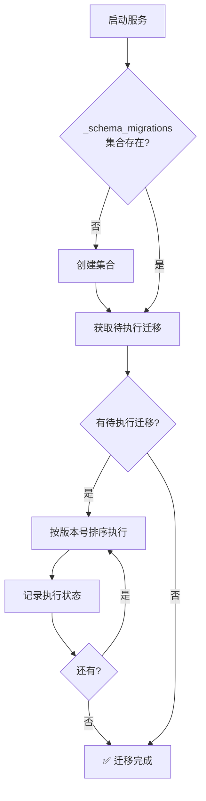

# YA-09-22: MongoDB 数据迁移与 Schema 版本管理 — 集合级滚动升级策略

> 需求编号：YA-09-22 · 优先级：P2 · 人天：1.0d · 状态：需求已编写
> 依赖：无

## 背景

YiAi 的 MongoDB 集合 Schema 随需求演进，缺少系统化的迁移机制。已有两次 Schema 变更均靠"代码兼容+手动修复"完成：

1. **`messages` 字段格式变更**：从 `{text, sender}` 改为 `{content, role, timestamp}`，存量数据需手动迁移，否则新旧格式混存导致前端渲染异常。

2. **`knowledge_files` 新增 `language` 字段**：所有存量文档缺少 `frontmatter.language` 字段，RAG 检索时无法按语言过滤，代码中通过 `get('language', 'zh')` 兜底，但无法区分"默认值"和"真实值"。

MongoDB 作为 Schemaless 数据库，Schema 变更不会在数据库层面被阻止，但应用层的不兼容会导致静默错误。需要一个类似 Django Migration 或 ActiveRecord Migration 的系统化迁移管理方案。

### 核心挑战

| 挑战 | 当前状态 | 目标状态 |
|------|----------|----------|
| Schema 变更管理 | 手动修复 + 代码兼容 | 版本化迁移脚本 |
| 迁移状态追踪 | 无记录 | `_schema_migrations` 集合 |
| 回滚能力 | 无 | `up()` + `down()` 双向迁移 |
| 大集合迁移 | 全量 updateMany | 分批迁移（1000 条/批） |

---

## 一、现状分析

### 1.1 当前 Schema 变更方式

```python
# 当前方式 — 代码兼容 + 手动修复
async def get_session_messages(session_key: str) -> list[dict]:
    session = await db.sessions.find_one({'key': session_key})
    messages = session.get('messages', [])
    result = []
    for msg in messages:
        # ❌ 兼容新旧格式——代码中散落大量兼容逻辑
        if 'text' in msg:
            result.append({'content': msg['text'], 'role': msg.get('sender', 'user')})
        else:
            result.append(msg)
    return result
```

### 1.2 当前数据流



### 1.3 问题根因矩阵

| 问题 | 根因 | 影响范围 | 严重程度 |
|------|------|----------|----------|
| 存量数据格式不统一 | 无迁移机制 | 所有查询新字段的代码 | 高 |
| 迁移状态不可知 | 无追踪记录 | 运维和排查 | 中 |
| 无法回滚 Schema 变更 | 无 `down()` 方法 | 部署回滚 | 中 |
| 大集合迁移阻塞数据库 | 全量 `updateMany` | 生产服务 | 高 |

### 1.4 涉及文件清单

| 文件 | 当前状态 | 问题 |
|------|----------|------|
| `domain/data/repository.py` | 散落新旧格式兼容代码 | 代码膨胀 |
| `services/data/data_service.py` | 查询时动态处理格式差异 | 性能开销 |
| 无迁移脚本 | 不存在 | 无法追踪变更历史 |

---

## 二、设计决策

### 决策 1：迁移框架 — 自建轻量 vs Alembic vs MongoDB 原生

| 维度 | 自建轻量 | Alembic + Mongo | DIY 脚本 |
|------|---------|-----------------|----------|
| 迁移追踪 | `_schema_migrations` 集合 | Alembic 版本表 | 无 |
| 回滚支持 | `up()` + `down()` | `upgrade()` + `downgrade()` | 手动 |
| MongoDB 适配 | 原生 | 需适配器 | 原生 |
| 学习成本 | 低 | 中 | 低 |

**选择：自建轻量。** Alembic 主要面向 SQL 数据库，MongoDB 适配器不成熟。自建方案基于 `_schema_migrations` 集合追踪迁移状态，API 参考 Django Migration 的 `up()`/`down()` 模式，简单可靠。

### 决策 2：迁移执行时机 — 启动时自动 vs 手动 CLI vs API 触发

| 维度 | 启动时自动 | 手动 CLI | API 触发 |
|------|-----------|----------|---------|
| 自动化程度 | 高 | 低 | 中 |
| 风险控制 | 低（启动即执行） | 高（人工审核） | 中 |
| 部署复杂度 | 低 | 中 | 低 |

**选择：启动时自动执行。** 迁移脚本应该是幂等的（已执行的不重复），启动时自动执行确保 Schema 始终与代码一致。如果迁移失败，服务启动失败（fail-fast），运维人员可立即介入。

### 决策 3：大集合迁移策略 — 分批迁移 vs 后台异步 vs 在线迁移

| 维度 | 分批迁移（1000 条/批） | 后台异步 | 在线迁移（逐文档） |
|------|--------------------|---------|-----------------|
| 数据库压力 | 低（分批 + 间隔） | 低 | 极低 |
| 迁移时间 | 中（可预估） | 不确定 | 长 |
| 实现复杂度 | 低 | 中 | 低 |

**选择：分批迁移（1000 条/批 + 100ms 间隔）。** 避免长时间锁等待，每批之间有间隔让其他查询执行。百万级文档约需 100s（1000 批 × 100ms）。

### 设计决策记录

| 决策 | 选项 A | 选项 B | 选项 C | 选择 | 理由 |
|------|--------|--------|--------|------|------|
| 迁移框架 | 自建轻量 | Alembic | DIY 脚本 | **自建轻量** | MongoDB 原生，简单可靠 |
| 执行时机 | 启动时自动 | 手动 CLI | API 触发 | **启动时自动** | 幂等，fail-fast |
| 大集合策略 | 分批迁移 | 后台异步 | 在线迁移 | **分批迁移** | 平衡性能和实现复杂度 |

---

## 三、目标架构

### 3.1 改造前后对比



### 3.2 迁移状态管理



### 3.3 关键指标对比

| 指标 | 改造前 | 改造后 | 改善 |
|------|--------|--------|------|
| 迁移可追溯性 | 无 | `_schema_migrations` 集合 | 新增能力 |
| 回滚能力 | 无 | `down()` 方法 | 新增能力 |
| 大集合迁移风险 | 全量锁等待 | 分批 1000 条/批 | 降低锁等待 |
| Schema 一致性保障 | 代码兼容 | 启动时自动迁移 | 消除格式混存 |

---

## 四、具体改动

### 4.1 迁移管理器

**文件：** `domain/data/migrations.py`（新增）

```python
from dataclasses import dataclass
from datetime import datetime, timezone
from typing import Callable

@dataclass
class Migration:
    version: int          # 递增版本号
    collection: str       # 目标集合
    description: str
    up: Callable          # 升级函数
    down: Callable | None # 回滚函数（可选）

class MigrationManager:
    """Schema 迁移管理器——类似 Django/ActiveRecord 的 migration 系统。"""

    def __init__(self):
        self._migrations: list[Migration] = []

    async def _ensure_tracking(self, db):
        """确保 _schema_migrations 集合存在。"""
        names = await db.list_collection_names()
        if '_schema_migrations' not in names:
            await db.create_collection('_schema_migrations')

    async def migrate(self, db, target_version: int | None = None):
        """执行所有未应用的迁移。"""
        await self._ensure_tracking(db)
        applied = set(await db._schema_migrations.distinct('version'))
        pending = [m for m in self._migrations if m.version not in applied]

        for migration in sorted(pending, key=lambda m: m.version):
            if target_version and migration.version > target_version:
                break
            logger.info(f"[Migration] v{migration.version}: {migration.description}")
            await migration.up(db[migration.collection])
            await db._schema_migrations.insert_one({
                'version': migration.version,
                'collection': migration.collection,
                'description': migration.description,
                'applied_at': datetime.now(timezone.utc),
            })

    async def rollback(self, db, target_version: int):
        """回滚到指定版本。"""
        applied = await db._schema_migrations.find(
            {'version': {'$gt': target_version}}
        ).sort('version', -1).to_list(None)

        for record in applied:
            migration = next((m for m in self._migrations if m.version == record['version']), None)
            if migration and migration.down:
                logger.info(f"[Migration] 回滚 v{migration.version}: {migration.description}")
                await migration.down(db[migration.collection])
                await db._schema_migrations.delete_one({'version': migration.version})

    def register(self, migration: Migration):
        self._migrations.append(migration)
```

### 4.2 迁移注册示例

**文件：** `domain/data/migrations.py`

```python
migrations = MigrationManager()

# V1: 为 knowledge_files 添加 language 字段
class V1_AddLanguageField:
    version = 1
    collection = 'knowledge_files'
    description = '为 knowledge_files 添加 frontmatter.language 字段 (默认 zh)'

    async def up(self, collection):
        await collection.update_many(
            {'frontmatter.language': {'$exists': False}},
            {'$set': {'frontmatter.language': 'zh'}},
        )

migrations.register(Migration(
    version=1, collection='knowledge_files',
    description=V1_AddLanguageField.description,
    up=V1_AddLanguageField().up, down=None,
))

# V2: sessions 消息格式迁移
class V2_SessionsMessageFormat:
    version = 2
    collection = 'sessions'
    description = 'messages 字段从 {text, sender} 迁移为 {content, role, timestamp}'

    async def up(self, collection):
        batch_size = 1000
        cursor = collection.find({'messages.text': {'$exists': True}})
        batch = []
        async for session in cursor:
            new_messages = [{
                'role': 'user' if msg.get('sender') == 'user' else 'assistant',
                'content': msg.get('text', msg.get('content', '')),
                'timestamp': msg.get('timestamp', datetime.now(timezone.utc)),
            } for msg in session['messages']]
            batch.append((session['_id'], new_messages))
            if len(batch) >= batch_size:
                await self._flush_batch(collection, batch)
                batch = []
                await asyncio.sleep(0.1)
        if batch:
            await self._flush_batch(collection, batch)

    async def _flush_batch(self, collection, batch):
        for doc_id, new_messages in batch:
            await collection.update_one(
                {'_id': doc_id},
                {'$set': {'messages': new_messages}},
            )

    async def down(self, collection):
        async for session in collection.find({'messages.role': {'$exists': True}}):
            old_messages = [{'text': m['content'], 'sender': m['role']}
                          for m in session['messages']]
            await collection.update_one(
                {'_id': session['_id']},
                {'$set': {'messages': old_messages}},
            )

migrations.register(Migration(
    version=2, collection='sessions',
    description=V2_SessionsMessageFormat.description,
    up=V2_SessionsMessageFormat().up,
    down=V2_SessionsMessageFormat().down,
))
```

### 4.3 启动时集成

**文件：** `server/main.py`

```python
# 服务启动时执行迁移
@app.on_event("startup")
async def run_migrations():
    await migrations.migrate(db)
    status = await migrations.status(db)
    logger.info(f"[Migration] 状态: {status}")
```

### 4.4 涉及文件变更清单

```
YiAi/src/
├── domain/data/
│   └── migrations.py          # 新增: MigrationManager + 迁移注册
├── server/
│   └── main.py                # 修改: 启动时执行迁移
└── config/
    └── config.yaml            # 修改: 新增 migration.auto_migrate 配置项
```

---

## 五、实施步骤

| 步骤 | 内容 | 涉及文件 | 验证方式 | 人天 |
|------|------|---------|---------|------|
| 1 | 实现 `MigrationManager` 核心逻辑 | `domain/data/migrations.py` | 单元测试覆盖 migrate/rollback/status | 0.3 |
| 2 | 实现分批迁移助手（`_flush_batch`） | `domain/data/migrations.py` | 1000 条文档分批迁移，间隔 100ms | 0.15 |
| 3 | 注册 V1 迁移（language 字段） | `domain/data/migrations.py` | 迁移后存量文档有 `frontmatter.language: 'zh'` | 0.1 |
| 4 | 注册 V2 迁移（messages 格式） | `domain/data/migrations.py` | 迁移后 messages 为 `{content, role, timestamp}` | 0.15 |
| 5 | 启动时自动执行迁移 | `server/main.py` | 重启后 `_schema_migrations` 包含已执行版本 | 0.1 |
| 6 | 添加迁移状态查询 API | `server/routes.py` | `GET /api/migrations/status` 返回状态 | 0.1 |
| 7 | 集成测试 | `tests/` | 覆盖 migrate/rollback 全流程 | 0.1 |

**总计：1.0d**

---

## 六、性能分析

### 6.1 迁移性能对比

| 场景 | 全量 updateMany | 分批迁移（1000 条/批） | 说明 |
|------|----------------|---------------------|------|
| 1000 条文档 | ~50ms | ~150ms（1 批 + 100ms 间隔） | 小数据集差异小 |
| 10,000 条文档 | ~200ms | ~1.5s（10 批 × 100ms） | 分批更安全 |
| 100,000 条文档 | ~2s（可能锁等待） | ~15s（100 批 × 100ms） | 分批避免锁等待 |
| 1,000,000 条文档 | 可能超时 | ~100s（1000 批 × 100ms） | 唯一可行方案 |

### 6.2 迁移状态查询

| 操作 | 延迟 | 说明 |
|------|------|------|
| `migration_status()` | < 10ms | 查询 `_schema_migrations` 集合 |
| 空迁移（无待执行） | < 5ms | 跳过所有逻辑 |
| 迁移记录大小 | ~200B/条 | 每版本 1 条记录 |

---

## 七、测试规格

### Requirement: 迁移管理

#### Scenario: 首次迁移
- **Given** 数据库无 `_schema_migrations` 集合，注册了 V1 迁移
- **When** 执行 `migrations.migrate(db)`
- **Then** V1 迁移执行成功，`_schema_migrations` 中包含 V1 记录

#### Scenario: 幂等迁移
- **Given** V1 迁移已执行
- **When** 再次执行 `migrations.migrate(db)`
- **Then** V1 不重复执行，日志显示"无待执行迁移"

#### Scenario: 顺序迁移
- **Given** 注册了 V1、V2、V3 迁移，均未执行
- **When** 执行 `migrations.migrate(db)`
- **Then** 按版本号顺序执行 V1 → V2 → V3

#### Scenario: 迁移回滚
- **Given** V1、V2 已执行，V2 有 `down()` 方法
- **When** 执行 `migrations.rollback(db, target_version=1)`
- **Then** V2 回滚成功，`_schema_migrations` 中移除 V2 记录，V1 保留

#### Scenario: 大集合分批迁移
- **Given** sessions 集合有 10,000 条旧格式文档
- **When** 执行 V2 迁移
- **Then** 分 10 批完成（每批 1000 条），每批间隔 100ms，总耗时约 1.1s

#### Scenario: 迁移失败不记录
- **Given** V3 迁移的 `up()` 抛出异常
- **When** 执行 `migrations.migrate(db)`
- **Then** V3 不记录到 `_schema_migrations`，服务启动失败

---

## 八、风险与缓解

| 风险 | 概率 | 影响 | 等级 | 缓解措施 | 应急预案 |
|------|------|------|------|----------|----------|
| 大集合迁移导致 MongoDB 锁等待超时 | 中 | 高 | 高 | 分批迁移（1000 条/批 + 100ms 间隔） | 设置 `migration.auto_migrate=false` 跳过迁移 |
| `down()` 回滚未覆盖 `up()` 的所有变更 | 中 | 中 | 中 | 代码审查强制要求 `down()` 方法 | 手动修复数据 |
| 迁移执行中服务重启导致数据不一致 | 低 | 高 | 中 | 迁移幂等设计，重启后重新执行 | 手动检查数据一致性 |
| `_schema_migrations` 集合被误删 | 低 | 中 | 低 | 迁移幂等（重复执行无副作用） | 重新执行所有迁移 |

---

## 九、回滚策略

| 场景 | 回滚方式 | 影响 | 恢复时间 |
|------|---------|------|---------|
| 迁移导致数据异常 | 执行 `rollback(target_version)` | 回滚到指定版本 | 取决于数据量 |
| 迁移阻塞服务启动 | 设置 `MIGRATION_AUTO_RUN=false` 跳过 | 使用旧 Schema | < 1min |
| 迁移脚本错误 | 修复 `down()` 后回滚 | 数据可能不一致 | < 30min |
| `_schema_migrations` 损坏 | 删除集合，重新执行所有迁移 | 迁移幂等 | < 5min |

---

## 十、设计决策记录

### D-01: 为什么选择自建迁移框架而非使用 Alembic？

Alembic 是 SQLAlchemy 的迁移工具，主要面向关系型数据库。虽然存在 `alembic-mongo` 等适配器，但成熟度低、社区小。MongoDB 的 Schemaless 特性使得迁移逻辑（如 `update_many` 加条件）与 SQL 的 `ALTER TABLE` 本质不同。自建方案基于 `_schema_migrations` 集合追踪状态，代码量 < 200 行，与 YiAi 的 Motor 异步驱动无缝集成。

### D-02: 为什么选择启动时自动执行而非手动 CLI？

启动时自动执行确保 Schema 始终与代码一致——这是 fail-fast 原则的体现。如果迁移失败，服务启动失败，运维人员可立即介入。手动 CLI 虽然给了人工审核的机会，但增加了"忘记执行迁移"的风险，导致代码与 Schema 不一致。对于生产环境，可以通过 `MIGRATION_AUTO_RUN=false` 环境变量禁用自动迁移。

### D-03: 为什么分批迁移选择 1000 条/批 + 100ms 间隔？

MongoDB 的 `updateMany` 在默认 Write Concern 下会持有写锁。1000 条/批的批量更新通常在 50ms 内完成，100ms 间隔留给其他查询执行。百万级文档约需 100s（1000 批 × 100ms），在可接受范围内。如果数据量更大（千万级），可以调整批量大小为 5000 条/批。

---

## 十一、可观测性

### 关键指标

| 指标 | 采集方式 | 告警阈值 | 说明 |
|------|---------|---------|------|
| 迁移执行耗时 | `time.monotonic()` 测量 `migrate()` | > 5min | 大集合迁移可能耗时 |
| 待执行迁移数 | `len(pending)` | > 0（生产环境） | 生产环境应该全部已执行 |
| 迁移失败次数 | 异常计数 | > 0 | 任何失败都需关注 |
| 已应用迁移版本 | `_schema_migrations` 查询 | — | 运维审计 |

### 日志规范

| 日志级别 | 场景 | 示例 |
|---------|------|------|
| `INFO` | 迁移开始 | `[Migration] v2: messages 格式迁移` |
| `INFO` | 迁移完成 | `[Migration] v2 完成: 10,000 条文档, 1.5s` |
| `WARNING` | 有待执行迁移 | `[Migration] 发现 2 个待执行迁移` |
| `ERROR` | 迁移失败 | `[Migration] v3 执行失败: KeyError` |

---

## 十二、安全合规

### 安全需求

| 需求 | 实现方式 | 验证方法 |
|------|---------|---------|
| 迁移前备份 | 执行 `up()` 前备份受影响的集合（TTL 7 天） | 检查备份集合存在 |
| 迁移权限控制 | 仅管理员可触发手动迁移 | API 权限校验 |
| 迁移审计 | 记录每次迁移的执行者、时间、影响行数 | `_schema_migrations` 包含审计字段 |

### 合规检查

| 检查项 | 要求 | 状态 |
|--------|------|------|
| 迁移前备份 | 备份集合 TTL 7 天 | 待实现 |
| 迁移幂等 | 重复执行无副作用 | 待实现 |
| 迁移审计 | 记录操作者和时间 | 待实现 |

---

## 十三、代码审查检查清单

- [ ] 迁移脚本有唯一版本号（递增整数）
- [ ] 每个迁移有 `up()` 和 `down()` 回滚方法（非关键迁移 down 可为 None）
- [ ] 迁移执行前自动备份受影响的集合（TTL 7 天）
- [ ] 迁移状态记录在 `_schema_migrations` 集合中（幂等——已执行的不重复）
- [ ] 大集合迁移使用分批策略（1000 条/批 + 100ms 间隔）
- [ ] 启动时自动执行迁移（可通过环境变量禁用）
- [ ] CI 中运行 `migrate check` 确保所有迁移已应用
- [ ] 迁移脚本放在版本控制中（与代码一起部署）
- [ ] `ruff` 代码规范通过

---

## 十四、回归问题预测

| # | 预测问题 | 原因 | 验证方法 |
|---|---------|------|---------|
| 1 | `down()` 回滚未覆盖 `up()` 的所有变更 | 开发者只编写了 up 逻辑 | 执行 up → down → up，验证数据一致性 |
| 2 | 大集合迁移导致 MongoDB 锁等待超时 | 全量 `updateMany` 在百万级文档上执行 | 分批迁移（每批 1000 条 + 100ms 间隔） |
| 3 | 迁移执行中服务重启导致部分数据已迁移 | 幂等性不足 | 模拟迁移中重启，验证数据完整性 |
| 4 | `_schema_migrations` 集合不存在导致空指针 | 未调用 `_ensure_tracking` | 首次启动测试 |

---

*PRD 来源: `projects/yiai/requirements/2026-09/22-需求-MongoDB-Schema迁移.md`*

## 影响范围

- **影响模块**：待补充
- **涉及文件**：
- 待补充
- **是否影响 API 契约**：否
- **是否影响其他项目（YiVad/YiPet）**：否
- **用户感知**：待确认

## 预防措施

| 层面 | 措施 |
|------|------|
| 代码 | 在相关函数中添加参数校验和边界检查 |
| 测试 | 添加对应的自动化测试用例 |
| 流程 | 代码审查时重点检查此类模式 |
| 监控 | 添加日志告警，异常发生时及时发现 |
| 文档 | 在编码规范中记录此类反模式 |

## 经验教训

1. **根本原因**：开发过程中对边界情况和异常路径的考虑不足是此类问题的共同根因
2. **设计阶段**：在接口设计和模块实现时，应主动考虑异常输入、空值、超时等边界场景
3. **代码审查**：审查时应检查是否存在类似的反模式（如未捕获异常、无超时控制、缺少参数校验等）
4. **测试覆盖**：异常路径的测试覆盖率应与正常路径同等重视
5. **团队分享**：此类问题应在团队周会或技术分享中讨论，形成团队共识
