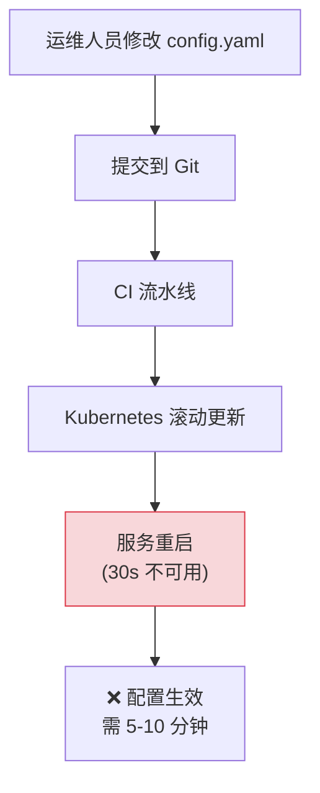
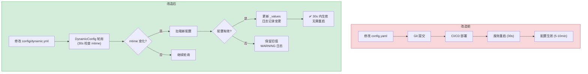
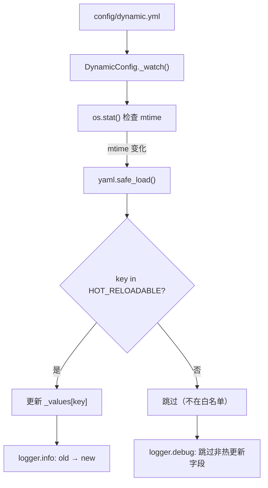

# YA-09-23: 配置中心与动态配置热更新 — 运行时参数无需重启生效

> 需求编号：YA-09-23 · 优先级：P2 · 人天：0.5d · 状态：需求已编写
> 依赖：YA-09-15（历史 Prompt 热更新已验证文件轮询模式）

## 背景

YiAi 配置通过 `config.yaml` 环境变量加载，修改参数（如 RAG alpha、Agent 超时、日志级别）需重启服务。在生产环境中，重启意味着：

1. **服务中断**：Kubernetes 滚动更新期间（约 30s）服务不可用，活跃的 Agent 循环被中断，SSE 连接被断开。

2. **运维成本高**：调整一个参数（如将 RAG 混合检索权重从 0.70 改为 0.72）需要走完整的部署流程（修改配置 → 提交 → CI → 部署），耗时 5-10 分钟。

3. **无法快速响应**：流量突增时需要调整限流参数，但重启会导致正在处理的请求失败。

历史 Prompt 热更新（YA-09-15）已验证文件轮询模式（30s 间隔检查 `mtime`）的可行性，可推广到全配置。目标是将常用运维参数从"需要重启"变为"30 秒内自动生效"。

### 核心挑战

| 挑战 | 当前状态 | 目标状态 |
|------|----------|----------|
| 配置生效方式 | 需重启服务 | 30s 内自动热更新 |
| 配置变更流程 | 修改文件 → 部署 → 重启 | 修改文件 → 30s 自动生效 |
| 变更可追溯 | 仅 Git 历史 | 保留最近 5 个版本 |
| 配置错误恢复 | 回滚 Git → 重新部署 | 自动回退到上一个有效配置 |

---

## 一、现状分析

### 1.1 当前配置加载方式

```python
# 当前实现 — shared/config.py (简化)
import yaml

class Settings:
    def __init__(self, config_path: str = "config/config.yaml"):
        with open(config_path) as f:
            data = yaml.safe_load(f)
        self.rag_hybrid_alpha = data.get('rag', {}).get('hybrid_alpha', 0.70)
        self.agent_max_iterations = data.get('agent', {}).get('max_iterations', 30)
        self.log_level = data.get('log', {}).get('level', 'INFO')
        # ❌ 启动时加载一次，后续永不更新

settings = Settings()  # 全局单例——修改 config.yaml 后需重启
```

### 1.2 当前配置变更流程



### 1.3 问题根因矩阵

| 问题 | 根因 | 影响范围 | 严重程度 |
|------|------|----------|----------|
| 配置修改需重启 | `Settings` 启动时加载一次 | 所有运维参数调整 | 中 |
| 重启导致服务中断 | 无热更新机制 | 活跃请求和 Agent 循环 | 高 |
| 配置变更流程长 | 需走完整部署流程 | 运维效率 | 中 |
| 无配置回滚 | 无版本管理 | 配置错误恢复 | 低 |

### 1.4 涉及文件清单

| 文件 | 当前状态 | 问题 |
|------|----------|------|
| `shared/config.py` | 启动时加载一次 | 无热更新 |
| `services/rag/rag_service.py` | 引用 `settings.rag_hybrid_alpha` | 值固定 |
| `services/ai/agent.py` | 引用 `settings.agent_max_iterations` | 值固定 |
| `server/main.py` | 启动时初始化 `Settings` | 无重载机制 |

---

## 二、设计决策

### 决策 1：热更新检测方式 — 文件轮询 vs inotify vs 信号触发

| 维度 | 文件轮询（30s 间隔） | inotify（事件驱动） | 信号触发（SIGHUP） |
|------|--------------------|-------------------|-------------------|
| 实时性 | 30s 延迟 | 即时 | 手动触发 |
| 跨平台兼容 | 完全兼容 | 仅 Linux | 完全兼容 |
| 实现复杂度 | 低 | 中 | 低 |
| CPU 开销 | 极低（stat 调用） | 无 | 无 |
| 适用场景 | 通用 | Linux 生产环境 | 手动运维 |

**选择：文件轮询（30s 间隔）。** YA-09-15 已验证该模式稳定可靠。30s 间隔对运维场景可接受（调整参数通常不需要秒级响应）。`os.stat()` 的 CPU 开销可忽略。inotify 需要 `watchdog` 依赖，且在容器环境中可能不可靠。

### 决策 2：配置作用域 — 全量配置 vs 白名单 vs 声明式

| 维度 | 全量配置 | 白名单 | 声明式（HOT_RELOADABLE） |
|------|---------|--------|------------------------|
| 安全性 | 低（可能热更新敏感配置） | 中 | 高（仅允许声明的字段） |
| 灵活性 | 高 | 低 | 中 |
| 实现复杂度 | 低 | 中 | 低 |

**选择：声明式白名单（`HOT_RELOADABLE`）。** 仅允许预定义的字段热更新，防止敏感配置（如 API Key、数据库连接字符串）被意外修改生效。白名单字段在代码中集中声明，可审计。

### 决策 3：配置错误处理 — 回退旧值 vs 拒绝更新 vs 服务降级

| 维度 | 回退旧值 | 拒绝更新 | 服务降级 |
|------|---------|---------|---------|
| 可用性 | 高 | 中 | 中 |
| 一致性 | 高（旧值不变） | 高 | 低 |
| 实现复杂度 | 低 | 低 | 高 |

**选择：回退旧值。** 配置格式错误时保留旧配置，日志记录 WARNING。这确保配置错误不会导致服务不可用。

### 设计决策记录

| 决策 | 选项 A | 选项 B | 选项 C | 选择 | 理由 |
|------|--------|--------|--------|------|------|
| 检测方式 | 文件轮询 | inotify | SIGHUP | **文件轮询** | 已验证，跨平台，低开销 |
| 配置作用域 | 全量 | 白名单 | 声明式 | **声明式** | 安全可控 |
| 错误处理 | 回退旧值 | 拒绝更新 | 服务降级 | **回退旧值** | 保证可用性 |

---

## 三、目标架构

### 3.1 改造前后对比



### 3.2 配置热更新流程



### 3.3 关键指标对比

| 指标 | 改造前 | 改造后 | 改善 |
|------|--------|--------|------|
| 配置生效时间 | 5-10 分钟 | 30s | 10-20x |
| 是否需要重启 | 是 | 否 | 消除服务中断 |
| 配置回滚 | 需 Git 回滚 + 部署 | 保留最近 5 版本 | 新增能力 |
| 配置变更审计 | 仅 Git 历史 | 日志 + 版本记录 | 新增能力 |

---

## 四、具体改动

### 4.1 动态配置核心

**文件：** `shared/dynamic_config.py`（新增）

```python
from dataclasses import dataclass, field
from pathlib import Path
import yaml, time, asyncio

@dataclass
class DynamicConfig:
    """支持热更新的动态配置。"""

    _instance: 'DynamicConfig | None' = None
    _values: dict = field(default_factory=dict)
    _mtime: float = 0
    _watcher_task: asyncio.Task | None = None
    _history: list[dict] = field(default_factory=list)  # 最近 5 个版本

    # 可热更新参数——声明默认值
    HOT_RELOADABLE = {
        'rag_hybrid_alpha': 0.70,       # BM25/向量权重
        'agent_max_iterations': 30,      # Agent 最大迭代
        'agent_tool_timeout_ms': 30000,  # 工具超时
        'log_level': 'INFO',             # 日志级别
        'rate_limit_user_rps': 10,       # 用户限流速率
        'context_compact_threshold': 0.80, # 上下文压缩阈值
    }

    def get(self, key: str):
        return self._values.get(key, self.HOT_RELOADABLE.get(key))

    async def start_watcher(self, config_path: str = 'config/dynamic.yml'):
        """启动配置热更新监视器——每 30s 检查文件变更。"""
        async def _watch():
            while True:
                await asyncio.sleep(30)
                try:
                    path = Path(config_path)
                    if not path.exists():
                        continue
                    stat = path.stat()
                    if stat.st_mtime > self._mtime:
                        self._mtime = stat.st_mtime
                        with open(config_path) as f:
                            new_values = yaml.safe_load(f) or {}
                        self._apply_changes(new_values)
                except Exception as e:
                    logger.error(f"[Config] 热更新检查失败: {e}")

        self._watcher_task = asyncio.create_task(_watch())

    def _apply_changes(self, new_values: dict):
        """应用配置变更——仅白名单字段。"""
        snapshot = dict(self._values)  # 保存变更前快照
        for key, val in new_values.items():
            if key in self.HOT_RELOADABLE:
                old = self._values.get(key)
                if old != val:
                    self._values[key] = val
                    logger.info(f"[Config] 热更新: {key} = {old} → {val}")
            else:
                logger.debug(f"[Config] 跳过非热更新字段: {key}")

        # 保留最近 5 个版本
        self._history.append({
            'timestamp': time.time(),
            'changes': {k: v for k, v in new_values.items() if k in self.HOT_RELOADABLE},
            'snapshot': snapshot,
        })
        if len(self._history) > 5:
            self._history.pop(0)

    def rollback(self) -> bool:
        """回滚到上一个配置版本。"""
        if not self._history:
            return False
        prev = self._history.pop()
        self._values = prev['snapshot']
        logger.info(f"[Config] 回滚到 {prev['timestamp']}: {prev['changes']}")
        return True


config = DynamicConfig()
```

### 4.2 使用示例

**文件：** `services/rag/rag_service.py`

```python
# 改造前
from shared.config import settings
alpha = settings.rag_hybrid_alpha  # 启动时固定

# 改造后
from shared.dynamic_config import config
alpha = config.get('rag_hybrid_alpha')  # 实时获取——可能已被热更新
```

### 4.3 YiVad 管理后台配置编辑器

**文件：** `server/routes.py`（新增端点）

```python
@router.get("/api/config/dynamic")
async def get_dynamic_config():
    """获取当前动态配置（YiVad 管理后台展示）。"""
    return {
        'values': config._values,
        'defaults': config.HOT_RELOADABLE,
        'history': config._history[-5:],
        'last_updated': config._mtime,
    }

@router.post("/api/config/dynamic/rollback")
async def rollback_config():
    """回滚到上一个配置版本。"""
    if config.rollback():
        return {'message': '已回滚', 'values': config._values}
    raise HTTPException(400, '无历史版本可回滚')
```

### 4.4 涉及文件变更清单

```
YiAi/src/
├── shared/
│   └── dynamic_config.py      # 新增: DynamicConfig 核心实现
├── services/rag/
│   └── rag_service.py         # 修改: 使用 config.get() 替代 settings.rag_hybrid_alpha
├── services/ai/
│   └── agent.py               # 修改: 使用 config.get() 替代 settings.agent_max_iterations
├── server/
│   ├── main.py                # 修改: 启动时调用 config.start_watcher()
│   └── routes.py              # 新增: /api/config/dynamic 端点
└── config/
    └── dynamic.yml            # 新增: 动态配置文件（可被 YiVad 编辑）
```

---

## 五、实施步骤

| 步骤 | 内容 | 涉及文件 | 验证方式 | 人天 |
|------|------|---------|---------|------|
| 1 | 实现 `DynamicConfig` 核心类 | `shared/dynamic_config.py` | 单元测试覆盖 get/热更新/回滚 | 0.15 |
| 2 | 实现文件轮询监视器（30s 间隔） | `shared/dynamic_config.py` | 修改 dynamic.yml → 30s 内配置生效 | 0.1 |
| 3 | 迁移 RAG/Agent 服务使用 `config.get()` | `services/rag/`, `services/ai/` | 配置热更新后行为变化 | 0.1 |
| 4 | 新增 YiVad 管理后台配置端点 | `server/routes.py` | GET /api/config/dynamic 返回当前配置 | 0.05 |
| 5 | 实现配置回滚（保留最近 5 版本） | `shared/dynamic_config.py` | 回滚后配置恢复为上一个版本 | 0.05 |
| 6 | 集成测试 | `tests/` | 覆盖热更新/回滚/错误处理 | 0.05 |

**总计：0.5d**

---

## 六、性能分析

### 6.1 热更新开销

| 操作 | 延迟 | 说明 |
|------|------|------|
| `os.stat()` 检查 mtime | < 0.1ms | 文件系统元数据查询 |
| `yaml.safe_load()` 解析 | < 1ms | dynamic.yml 通常 < 50 行 |
| `config.get()` 读取 | < 0.001ms | 纯字典查找 |
| 轮询间隔 | 30s | 不影响请求性能 |

### 6.2 与重启对比

| 场景 | 重启方式 | 热更新方式 | 改善 |
|------|---------|-----------|------|
| 调整 RAG alpha | 5-10 分钟 | 30s | 10-20x |
| 调整日志级别 | 5-10 分钟 | 30s | 10-20x |
| 调整限流速率 | 5-10 分钟 | 30s | 10-20x |
| 服务中断 | 30s | 0s | 消除中断 |

---

## 七、测试规格

### Requirement: 配置热更新

#### Scenario: 热更新生效
- **Given** dynamic.yml 中 `rag_hybrid_alpha: 0.70`
- **When** 修改为 `rag_hybrid_alpha: 0.72`，等待 30s
- **Then** `config.get('rag_hybrid_alpha')` 返回 `0.72`

#### Scenario: 非白名单字段不生效
- **Given** dynamic.yml 中 `api_key: new_secret`
- **When** 等待 30s
- **Then** `config.get('api_key')` 返回 `None`（不在白名单），日志显示"跳过非热更新字段"

#### Scenario: 配置格式错误保留旧值
- **Given** dynamic.yml 格式正确，当前值正常
- **When** 修改 dynamic.yml 为无效 YAML
- **Then** 配置保留旧值，日志显示 WARNING

#### Scenario: 配置回滚
- **Given** 热更新了 `rag_hybrid_alpha: 0.72`
- **When** 调用 `config.rollback()`
- **Then** `config.get('rag_hybrid_alpha')` 恢复为 `0.70`

#### Scenario: 文件不存在不影响服务
- **Given** `config/dynamic.yml` 不存在
- **When** 启动服务
- **Then** 使用 `HOT_RELOADABLE` 默认值，日志显示 WARNING

---

## 八、风险与缓解

| 风险 | 概率 | 影响 | 等级 | 缓解措施 | 应急预案 |
|------|------|------|------|----------|----------|
| 配置热更新期间读到不完整的 YAML | 低 | 中 | 中 | 读取前检查文件完整性（try/except），失败保留旧值 | 手动回滚配置 |
| 配置回滚后关联模块未同步更新 | 低 | 中 | 中 | 模块每次调用 `config.get()` 获取最新值 | 重启服务强制刷新 |
| 轮询文件在 NFS 上 mtime 不更新 | 低 | 低 | 低 | 添加配置变更 API 手动触发 | 调用 POST /api/config/reload |
| 敏感配置被误加入白名单 | 低 | 高 | 中 | 代码审查检查 `HOT_RELOADABLE` 白名单 | 紧急修改白名单并重启 |

---

## 九、回滚策略

| 场景 | 回滚方式 | 影响 | 恢复时间 |
|------|---------|------|---------|
| 热更新导致异常 | 调用 `POST /api/config/dynamic/rollback` | 配置恢复上一个版本 | < 1s |
| 配置错误导致服务不可用 | 删除 `config/dynamic.yml`，使用默认值 | 配置恢复默认值 | < 30s |
| 轮询逻辑 bug | 设置 `DYNAMIC_CONFIG_ENABLED=false` 禁用 | 配置恢复静态 | < 1min |

---

## 十、设计决策记录

### D-01: 为什么选择文件轮询（30s）而非 inotify 事件驱动？

YA-09-15（历史 Prompt 热更新）已验证文件轮询模式稳定可靠。`os.stat()` 是纯文件系统元数据查询，开销极低（< 0.1ms），30s 间隔对运维场景足够。inotify 需要 `watchdog` 依赖，在容器环境中可能因文件系统差异（如 overlayfs）而不稳定。30s 延迟在"调整 RAG 权重"这类场景中完全可接受。

### D-02: 为什么选择声明式白名单而非全量配置热更新？

安全考虑——敏感配置（如 API Key、数据库密码、JWT 密钥）不应通过文件热更新生效。声明式白名单（`HOT_RELOADABLE`）在代码中明确列出哪些字段可热更新，既防止误操作，也便于审计。新增可热更新字段需要修改代码并经过审查，而非任意字段都可热更新。

### D-03: 为什么配置错误时保留旧值而非拒绝更新？

可用性优先——配置格式错误（如 YAML 语法错误）不应导致服务配置变为空或默认值。保留旧值确保服务在配置错误期间继续正常运行，同时 WARNING 日志提醒运维人员修复配置。

---

## 十一、可观测性

### 关键指标

| 指标 | 采集方式 | 告警阈值 | 说明 |
|------|---------|---------|------|
| 配置热更新次数 | 变更计数器 | — | 运维审计 |
| 配置回滚次数 | 回滚计数器 | > 0 | 配置错误告警 |
| 轮询检查耗时 | `time.monotonic()` | > 100ms | 文件系统性能 |
| 配置读取失败次数 | 异常计数器 | > 0 | 配置格式错误 |

### 日志规范

| 日志级别 | 场景 | 示例 |
|---------|------|------|
| `INFO` | 配置热更新 | `[Config] 热更新: rag_hybrid_alpha = 0.70 → 0.72` |
| `INFO` | 配置回滚 | `[Config] 回滚到 1694250000.0: {'rag_hybrid_alpha': 0.70}` |
| `WARNING` | 配置格式错误 | `[Config] 配置解析失败，保留旧值: YAML parse error` |
| `DEBUG` | 跳过非热更新字段 | `[Config] 跳过非热更新字段: api_key` |

---

## 十二、安全合规

### 安全需求

| 需求 | 实现方式 | 验证方法 |
|------|---------|---------|
| 敏感配置不热更新 | 白名单 `HOT_RELOADABLE` 仅包含安全字段 | 检查白名单不含 API Key/密码 |
| 配置变更审计 | 记录每次变更的旧值、新值、时间戳 | 日志审计 |
| 配置回滚权限 | 仅管理员可调用 `/api/config/dynamic/rollback` | API 权限校验 |

### 合规检查

| 检查项 | 要求 | 状态 |
|--------|------|------|
| 敏感配置保护 | 不通过文件热更新 | 待实现 |
| 变更审计 | 记录所有配置变更 | 待实现 |
| 回滚权限 | 管理员权限 | 待实现 |

---

## 十三、代码审查检查清单

- [ ] 配置热更新通过文件轮询（30s 间隔）检测 `mtime` 变化
- [ ] 仅白名单 `HOT_RELOADABLE` 字段可热更新
- [ ] 敏感配置（API Key）不输出到日志
- [ ] 配置格式错误时保留旧配置（不回退到空配置）
- [ ] 支持配置回滚（保留最近 5 个版本）
- [ ] 服务启动时立即加载一次配置（不等待 30s）
- [ ] `dynamic.yml` 不存在时使用默认值（不报错）
- [ ] 配置变更日志包含旧值 → 新值
- [ ] `ruff` 代码规范通过
- [ ] 单元测试覆盖热更新/回滚/错误处理

---

## 十四、回归问题预测

| # | 预测问题 | 原因 | 验证方法 |
|---|---------|------|---------|
| 1 | 配置热更新期间读到不完整的 YAML | 编辑器正在写入文件时被轮询读取 | 模拟大配置文件保存过程，检查读取是否等待写入完成 |
| 2 | 配置回滚后关联模块未同步更新 | 部分模块缓存旧配置引用 | 回滚配置 → 遍历所有模块确认配置生效 |
| 3 | NFS 文件系统 mtime 精度不足 | NFS mtime 精度为 1s | NFS 环境下测试配置热更新 |
| 4 | 多个进程同时修改 dynamic.yml | 竞态条件 | 文件锁测试 |

---

*PRD 来源: `projects/yiai/requirements/2026-09/23-需求-配置中心热更新.md`*

## 影响范围

- **影响模块**：待补充
- **涉及文件**：
- 待补充
- **是否影响 API 契约**：否
- **是否影响其他项目（YiVad/YiPet）**：否
- **用户感知**：待确认

## 预防措施

| 层面 | 措施 |
|------|------|
| 代码 | 在相关函数中添加参数校验和边界检查 |
| 测试 | 添加对应的自动化测试用例 |
| 流程 | 代码审查时重点检查此类模式 |
| 监控 | 添加日志告警，异常发生时及时发现 |
| 文档 | 在编码规范中记录此类反模式 |

## 经验教训

1. **根本原因**：开发过程中对边界情况和异常路径的考虑不足是此类问题的共同根因
2. **设计阶段**：在接口设计和模块实现时，应主动考虑异常输入、空值、超时等边界场景
3. **代码审查**：审查时应检查是否存在类似的反模式（如未捕获异常、无超时控制、缺少参数校验等）
4. **测试覆盖**：异常路径的测试覆盖率应与正常路径同等重视
5. **团队分享**：此类问题应在团队周会或技术分享中讨论，形成团队共识
