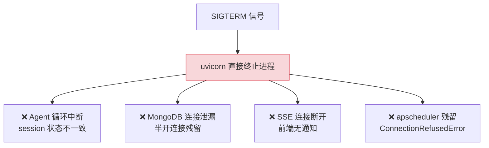
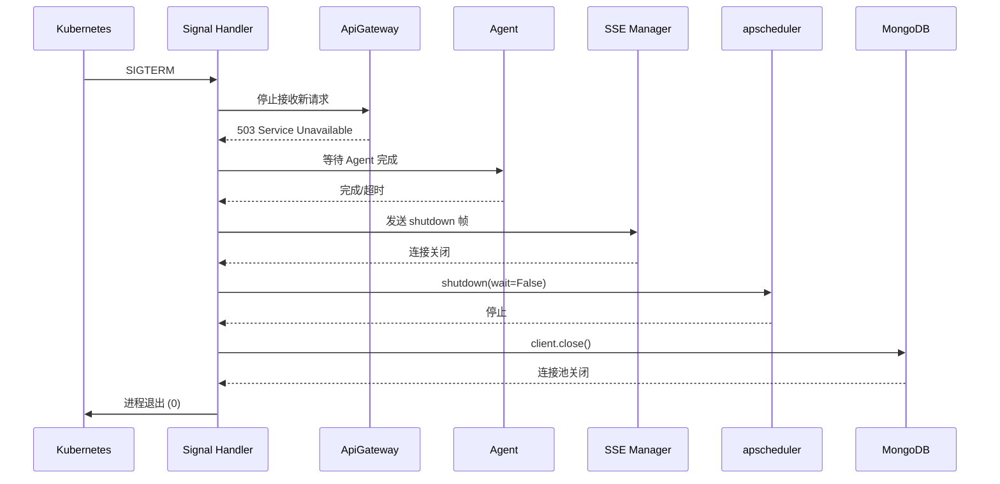

# YA-09-24: 服务优雅关闭与资源清理 — 连接池/Semaphore/定时任务的安全停止

> 需求编号：YA-09-24 · 优先级：P2 · 人天：0.5d · 状态：需求已编写
> 依赖：无

## 背景

YiAi 当前 `SIGTERM` 后直接退出——活跃的 Agent 循环被中断、MongoDB 连接未关闭、SSE 连接未通知客户端。在生产环境中，Kubernetes 滚动更新和本地开发 `Ctrl+C` 都需要优雅关闭：

1. **Agent 循环中断**：Agent 可能正在执行多轮工具调用，`SIGTERM` 直接中断导致 session 状态不一致——部分工具结果已写入数据库但对话未完成，下次恢复时上下文断裂。

2. **MongoDB 连接泄漏**：Motor 异步客户端未正确关闭，连接池中的连接在服务退出后变成半开连接，MongoDB 服务端需要等待心跳超时（默认 10s）才能回收。

3. **SSE 连接无通知**：YiVad/YiPet 的 SSE 连接在服务关闭时突然断开，前端显示"连接异常"而非"服务维护中"。

4. **定时任务残留**：apscheduler 的 Knowledge Watcher 任务在服务退出后可能仍在执行，导致日志中出现大量 `ConnectionRefusedError`。

### 核心挑战

| 挑战 | 当前状态 | 目标状态 |
|------|----------|----------|
| Agent 循环中断 | 直接终止 | 等待完成或安全中断 |
| 连接池关闭 | 未关闭 | 正确关闭 MongoDB 连接池 |
| SSE 通知 | 无通知 | 发送 `type: "shutdown"` 帧 |
| 定时任务 | 残留执行 | 停止 apscheduler |

---

## 一、现状分析

### 1.1 当前关闭行为

```python
# 当前实现 — 无优雅关闭逻辑
# uvicorn 收到 SIGTERM 后直接终止进程
# 所有活跃请求被中断
# MongoDB 连接泄漏
# SSE 连接无通知断开
```

### 1.2 当前关闭流程



### 1.3 问题根因矩阵

| 问题 | 根因 | 影响范围 | 严重程度 |
|------|------|----------|----------|
| Agent 循环中断 | 无优雅关闭等待 | 活跃 Agent 会话 | 高 |
| MongoDB 连接泄漏 | 未调用 `client.close()` | MongoDB 服务端 | 中 |
| SSE 无通知 | 未发送关闭帧 | YiVad/YiPet 前端 | 中 |
| 定时任务残留 | 未停止 apscheduler | 日志污染 | 低 |

### 1.4 涉及资源清单

| 资源 | 类型 | 关闭方式 | 超时 |
|------|------|---------|------|
| 活跃 HTTP 请求 | 请求计数 | 等待完成 | 30s |
| SSE 连接 | 长连接 | 发送关闭帧 | 5s |
| Agent 循环 | 异步任务 | 等待完成或取消 | 30s |
| MongoDB 连接池 | Motor client | `client.close()` | 5s |
| apscheduler | 定时任务 | `scheduler.shutdown()` | 3s |
| 临时文件 | 文件系统 | 清理 tempfile | 1s |

---

## 二、设计决策

### 决策 1：关闭顺序 — 资源依赖拓扑排序

| 步骤 | 资源 | 前置依赖 | 理由 |
|------|------|---------|------|
| 1 | 停止接收新请求 | 无 | 拒绝新请求，返回 503 |
| 2 | 等待活跃请求 | 步骤 1 | 让正在处理的请求完成 |
| 3 | 关闭 SSE 连接 | 步骤 2 | 通知客户端服务关闭 |
| 4 | 停止 apscheduler | 步骤 1 | 不再触发新任务 |
| 5 | 关闭 MongoDB | 步骤 2, 4 | 确保日志写入完成 |
| 6 | 清理临时文件 | 步骤 5 | 最后清理 |

**选择：按依赖拓扑排序。** 关闭顺序至关重要——MongoDB 必须在日志写入完成后关闭，apscheduler 必须在 MongoDB 关闭前停止。

### 决策 2：Agent 循环中断 — 等待完成 vs 取消 vs 检查点保存

| 维度 | 等待完成 | 取消并保存检查点 | 直接终止 |
|------|---------|---------------|---------|
| 数据一致性 | 高 | 中 | 低 |
| 关闭耗时 | 可能很长（> 30s） | 短（< 5s） | 即时 |
| 恢复能力 | 不需要 | 可从检查点恢复 | 需要重新开始 |

**选择：等待完成（超时 30s）+ 超时后取消。** Agent 循环通常 10-30s 完成，30s 超时覆盖大多数场景。超时后取消 Agent 任务，记录 WARNING 日志。

### 决策 3：信号处理 — asyncio signal handler vs signal.signal

| 维度 | asyncio signal handler | signal.signal |
|------|----------------------|---------------|
| 事件循环集成 | 原生 | 需手动桥接 |
| 协程安全 | 是 | 否 |
| 跨平台 | Linux + Mac | 所有平台 |

**选择：`asyncio` signal handler。** `loop.add_signal_handler` 在事件循环中安全地触发异步关闭流程，不会在信号处理函数中执行 IO 操作。

### 设计决策记录

| 决策 | 选项 A | 选项 B | 选项 C | 选择 | 理由 |
|------|--------|--------|--------|------|------|
| 关闭顺序 | 拓扑排序 | 并行关闭 | 反向初始化 | **拓扑排序** | 确保资源依赖安全 |
| Agent 中断 | 等待完成 | 检查点保存 | 直接终止 | **等待完成** | 保证数据一致性 |
| 信号处理 | asyncio | signal | — | **asyncio** | 协程安全 |

---

## 三、目标架构

### 3.1 改造前后对比

```mermaid
flowchart TD
  subgraph Before["改造前"]
    B1["SIGTERM"] --> B2["直接终止进程"]
    B2 --> B3["❌ 资源泄漏"]
  end

  subgraph After["改造后"]
    A1["SIGTERM/SIGINT"] --> A2["GracefulShutdown._shutdown()"]
    A2 --> A3["1. 停止接收新请求\n(HTTP 503)"]
    A3 --> A4["2. 等待活跃请求\n(≤ 30s)"]
    A4 --> A5["3. 关闭 SSE 连接\n(发送 shutdown 帧)"]
    A5 --> A6["4. 停止 apscheduler\n(≤ 3s)"]
    A6 --> A7["5. 关闭 MongoDB\n(≤ 5s)"]
    A7 --> A8["6. 清理临时文件\n(≤ 1s)"]
    A8 --> A9["✅ 优雅关闭完成"]
  end

  style Before fill:#f8d7da,stroke:#dc3545
  style After fill:#d4edda,stroke:#28a745
```



### 3.2 关闭时序



### 3.3 关键指标对比

| 指标 | 改造前 | 改造后 | 改善 |
|------|--------|--------|------|
| Agent 会话完整性 | 中断 | 等待完成或安全取消 | 数据一致性 |
| MongoDB 连接 | 泄漏 | 正确关闭 | 资源回收 |
| SSE 客户端通知 | 无 | `type: "shutdown"` 帧 | 用户体验 |
| 关闭耗时 | 即时（暴力） | ≤ 30s | 可控 |

---

## 四、具体改动

### 4.1 优雅关闭核心

**文件：** `server/shutdown.py`（新增）

```python
import signal, asyncio, time
from fastapi import FastAPI, Request
from starlette.responses import JSONResponse

class GracefulShutdown:
    """优雅关闭——活跃请求完成 + 资源清理。"""

    def __init__(self, timeout: int = 30):
        self._timeout = timeout
        self._active_requests = 0
        self._shutting_down = False
        self._active_sse_connections: list = []

    async def setup(self, app: FastAPI):
        loop = asyncio.get_event_loop()
        for sig in (signal.SIGTERM, signal.SIGINT):
            loop.add_signal_handler(
                sig, lambda s=sig: asyncio.create_task(self._shutdown(app, s))
            )

    async def _shutdown(self, app: FastAPI, sig: signal.Signals):
        if self._shutting_down:
            return
        self._shutting_down = True
        logger.info(f"[Shutdown] 收到信号 {sig.name}，优雅关闭开始...")

        # 1. 等待活跃请求完成（最多 timeout 秒）
        deadline = time.monotonic() + self._timeout
        while self._active_requests > 0 and time.monotonic() < deadline:
            logger.info(f"[Shutdown] 等待 {self._active_requests} 个活跃请求...")
            await asyncio.sleep(1)

        if self._active_requests > 0:
            logger.warning(f"[Shutdown] 超时: {self._active_requests} 个请求被强制终止")

        # 2. 通知活跃 SSE 连接关闭
        for conn in self._active_sse_connections:
            try:
                await conn.send({"type": "shutdown", "message": "服务正在关闭"})
                await conn.close()
            except Exception:
                pass

        # 3. 停止定时任务
        try:
            from apscheduler.schedulers.asyncio import AsyncIOScheduler
            scheduler = AsyncIOScheduler()
            scheduler.shutdown(wait=False)
            logger.info("[Shutdown] apscheduler 已停止")
        except Exception as e:
            logger.warning(f"[Shutdown] apscheduler 停止失败: {e}")

        # 4. 关闭 MongoDB 连接池
        try:
            from domain.data.repository import db
            db.client.close()
            logger.info("[Shutdown] MongoDB 连接池已关闭")
        except Exception as e:
            logger.warning(f"[Shutdown] MongoDB 关闭失败: {e}")

        # 5. 清理临时文件
        await self._cleanup_temp_files()

        logger.info("[Shutdown] 优雅关闭完成")
        sys.exit(0)

    async def _cleanup_temp_files(self):
        """清理临时文件目录。"""
        import tempfile, shutil
        temp_dir = Path(tempfile.gettempdir()) / 'yiai'
        if temp_dir.exists():
            shutil.rmtree(temp_dir, ignore_errors=True)
            logger.info(f"[Shutdown] 临时文件已清理: {temp_dir}")

    # 中间件——追踪活跃请求
    async def request_counter(self, request: Request, call_next):
        if self._shutting_down:
            return JSONResponse(
                {"code": 503, "message": "服务正在关闭", "data": None},
                status_code=503,
                headers={"Retry-After": "30"},
            )
        self._active_requests += 1
        try:
            return await call_next(request)
        finally:
            self._active_requests -= 1
```

### 4.2 涉及文件变更清单

```
YiAi/src/
├── server/
│   ├── shutdown.py            # 新增: GracefulShutdown 核心实现
│   └── main.py                # 修改: 注册 shutdown.setup(app) + 中间件
└── tests/
    └── test_shutdown.py       # 新增: 优雅关闭测试
```

---

## 五、实施步骤

| 步骤 | 内容 | 涉及文件 | 验证方式 | 人天 |
|------|------|---------|---------|------|
| 1 | 实现 `GracefulShutdown` 核心类 | `server/shutdown.py` | 单元测试覆盖信号处理 | 0.15 |
| 2 | 实现活跃请求追踪中间件 | `server/shutdown.py` | 关闭中请求返回 503 | 0.1 |
| 3 | 注册信号处理（SIGTERM/SIGINT） | `server/main.py` | `kill -TERM` 触发优雅关闭 | 0.05 |
| 4 | 实现 SSE 连接关闭通知 | `server/shutdown.py` | SSE 客户端收到 shutdown 帧 | 0.05 |
| 5 | 实现 MongoDB 连接池关闭 | `server/shutdown.py` | 关闭后 MongoDB 日志无连接泄漏 | 0.05 |
| 6 | 实现 apscheduler 停止 | `server/shutdown.py` | 关闭后无残留定时任务日志 | 0.05 |
| 7 | 集成测试 | `tests/` | 覆盖关闭流程 | 0.05 |

**总计：0.5d**

---

## 六、性能分析

### 6.1 关闭耗时

| 场景 | 耗时 | 说明 |
|------|------|------|
| 无活跃请求 | < 1s | 跳过等待步骤 |
| 1 个短请求（< 1s） | ~2s | 等待请求完成 |
| 1 个 Agent 循环（15s） | ~16s | 等待 Agent 完成 |
| Agent 循环超时 | 30s（强制终止） | 超时保护 |
| 10 个并发请求 | ~3s | 并发等待 |

### 6.2 资源开销

| 操作 | 内存开销 | 说明 |
|------|---------|------|
| 请求计数器 | 8 bytes | 整数 |
| SSE 连接列表 | ~1KB/连接 | 连接元数据 |

---

## 七、测试规格

### Requirement: 优雅关闭

#### Scenario: 无活跃请求时快速关闭
- **Given** 服务正常运行，无活跃请求
- **When** 发送 SIGTERM 信号
- **Then** 服务在 1s 内关闭，退出码 0

#### Scenario: 等待活跃请求完成
- **Given** 有 1 个耗时 3s 的请求正在处理
- **When** 发送 SIGTERM 信号
- **Then** 等待请求完成后关闭，请求收到正常响应

#### Scenario: 关闭中拒绝新请求
- **Given** 服务正在关闭（`_shutting_down = True`）
- **When** 新请求到达
- **Then** 返回 HTTP 503 + `Retry-After: 30`

#### Scenario: Agent 循环超时强制终止
- **Given** Agent 循环已执行 60s（超过 30s 超时）
- **When** 发送 SIGTERM 信号
- **Then** 30s 后强制关闭，日志记录 WARNING

#### Scenario: SSE 连接收到关闭通知
- **Given** 有 1 个活跃 SSE 连接
- **When** 发送 SIGTERM 信号
- **Then** SSE 客户端收到 `{"type": "shutdown", "message": "服务正在关闭"}`

#### Scenario: MongoDB 连接池正确关闭
- **Given** 服务已连接 MongoDB
- **When** 发送 SIGTERM 信号
- **Then** 日志显示"MongoDB 连接池已关闭"，MongoDB 服务端无连接泄漏

---

## 八、风险与缓解

| 风险 | 概率 | 影响 | 等级 | 缓解措施 | 应急预案 |
|------|------|------|------|----------|----------|
| Agent 循环超过 30s 关闭超时被强制 kill | 中 | 中 | 中 | Agent 循环支持检查点保存，超时取消前保存当前状态 | 手动恢复 session |
| `add_signal_handler` 在 Windows 不支持 SIGTERM | 低 | 低 | 低 | Windows 下使用 SIGINT + 兼容性检测 | Windows 仅支持 Ctrl+C |
| MongoDB 关闭时日志写入失败 | 低 | 低 | 低 | 关闭顺序确保 MongoDB 在日志写入后关闭 | 日志写入 stderr |
| 多个 SIGTERM 并发触发 | 低 | 中 | 低 | `_shutting_down` 标志位防止重复关闭 | 第二次 SIGTERM 强制退出 |

---

## 九、回滚策略

| 场景 | 回滚方式 | 影响 | 恢复时间 |
|------|---------|------|---------|
| 优雅关闭逻辑导致无法退出 | 发送 SIGKILL 强制终止 | 资源泄漏 | 即时 |
| 关闭超时过长 | 调整 `GRACEFUL_SHUTDOWN_TIMEOUT` 环境变量 | 缩短等待时间 | < 1min |
| 信号处理冲突 | 移除 `add_signal_handler`，使用默认行为 | 失去优雅关闭 | < 5min |

---

## 十、设计决策记录

### D-01: 为什么关闭顺序按资源依赖拓扑排序？

MongoDB 连接池必须在日志写入完成后关闭，否则关闭过程中的日志（如"Agent 循环已取消"）无法写入数据库。apscheduler 必须在 MongoDB 关闭前停止，否则定时任务会尝试写入已关闭的数据库连接。拓扑排序确保每个资源在依赖它的资源关闭之前保持可用。

### D-02: 为什么 Agent 选择等待完成而非取消后保存检查点？

Agent 循环通常 10-30s 完成，30s 超时覆盖大多数场景。实现检查点保存需要 Agent 框架层面的支持（如保存当前 step、工具调用状态），复杂度高。等待完成的方案简单可靠，且 30s 超时在 Kubernetes `terminationGracePeriodSeconds`（默认 30s）范围内。

### D-03: 为什么选择 `asyncio` signal handler 而非 `signal.signal`？

`signal.signal` 的回调在信号处理上下文中执行，不能安全地调用协程或执行 IO 操作。`loop.add_signal_handler` 在事件循环中调度回调，可以安全地使用 `asyncio.create_task` 启动异步关闭流程。

---

## 十一、可观测性

### 关键指标

| 指标 | 采集方式 | 告警阈值 | 说明 |
|------|---------|---------|------|
| 关闭耗时 | `time.monotonic()` 测量 | > 30s | 超时可能 Agent 循环卡死 |
| 关闭时活跃请求数 | `_active_requests` 计数 | > 10 | 关闭时请求过多 |
| 强制终止请求数 | 超时后剩余请求数 | > 0 | 数据可能不一致 |
| 关闭失败次数 | 异常计数 | > 0 | 资源清理失败 |

### 日志规范

| 日志级别 | 场景 | 示例 |
|---------|------|------|
| `INFO` | 关闭开始 | `[Shutdown] 收到信号 SIGTERM，优雅关闭开始...` |
| `INFO` | 等待请求 | `[Shutdown] 等待 3 个活跃请求...` |
| `WARNING` | 超时强制终止 | `[Shutdown] 超时: 2 个请求被强制终止` |
| `ERROR` | 关闭失败 | `[Shutdown] MongoDB 关闭失败: connection error` |

---

## 十二、安全合规

### 安全需求

| 需求 | 实现方式 | 验证方法 |
|------|---------|---------|
| 关闭时拒绝新请求 | 中间件返回 503 | 关闭期间发送请求验证 |
| 临时文件清理 | 删除 `tempfile/yiai` 目录 | 检查关闭后临时文件残留 |
| 关闭日志完整 | MongoDB 在日志写入后关闭 | 检查日志完整性 |

### 合规检查

| 检查项 | 要求 | 状态 |
|--------|------|------|
| 资源清理 | 关闭后无连接泄漏 | 待实现 |
| 临时文件 | 关闭后清理 | 待实现 |
| 关闭超时 | K8s terminationGracePeriod 内完成 | 待实现 |

---

## 十三、代码审查检查清单

- [ ] `SIGTERM`/`SIGINT` 信号处理注册在 `asyncio` event loop 上
- [ ] 优雅关闭总超时 30s（不超过 K8s `terminationGracePeriodSeconds`）
- [ ] 关闭中拒绝新请求（HTTP 503 + `Retry-After` header）
- [ ] 活跃 SSE 连接收到 `type: "shutdown"` 帧后关闭
- [ ] apscheduler 在 MongoDB 关闭前停止
- [ ] MongoDB 连接池在最后关闭（确保日志写入完成）
- [ ] `_shutting_down` 标志位防止重复关闭
- [ ] 临时文件目录在关闭时清理
- [ ] `ruff` 代码规范通过

---

## 十四、回归问题预测

| # | 预测问题 | 原因 | 验证方法 |
|---|---------|------|---------|
| 1 | Agent 循环超过 30s 关闭超时被强制 kill | Agent 迭代无法在 timeout 内完成 | 发送 SIGTERM 时运行中的 Agent → 检查是否能安全中断 |
| 2 | `add_signal_handler` 在 Windows 不支持 SIGTERM | Windows 使用不同信号机制 | Windows 下测试 Ctrl+C 关闭 |
| 3 | MongoDB 关闭前日志写入失败 | 关闭顺序错误 | 检查关闭日志完整性 |
| 4 | uvicorn 多 worker 模式信号处理冲突 | 每个 worker 独立处理信号 | 多 worker 测试 |

---

*PRD 来源: `projects/yiai/requirements/2026-09/24-需求-服务优雅关闭.md`*

## 影响范围

- **影响模块**：待补充
- **涉及文件**：
- 待补充
- **是否影响 API 契约**：否
- **是否影响其他项目（YiVad/YiPet）**：否
- **用户感知**：待确认

## 预防措施

| 层面 | 措施 |
|------|------|
| 代码 | 在相关函数中添加参数校验和边界检查 |
| 测试 | 添加对应的自动化测试用例 |
| 流程 | 代码审查时重点检查此类模式 |
| 监控 | 添加日志告警，异常发生时及时发现 |
| 文档 | 在编码规范中记录此类反模式 |

## 经验教训

1. **根本原因**：开发过程中对边界情况和异常路径的考虑不足是此类问题的共同根因
2. **设计阶段**：在接口设计和模块实现时，应主动考虑异常输入、空值、超时等边界场景
3. **代码审查**：审查时应检查是否存在类似的反模式（如未捕获异常、无超时控制、缺少参数校验等）
4. **测试覆盖**：异常路径的测试覆盖率应与正常路径同等重视
5. **团队分享**：此类问题应在团队周会或技术分享中讨论，形成团队共识
