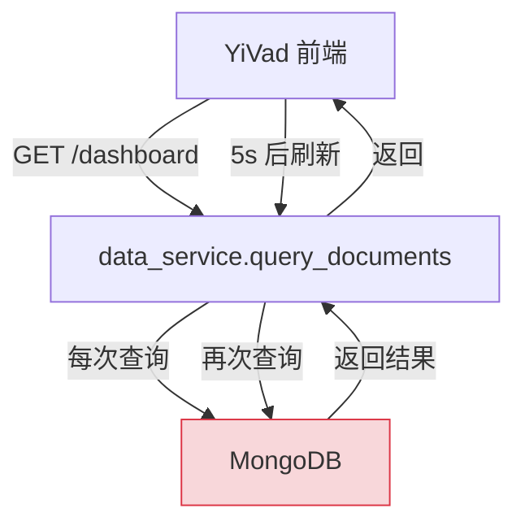
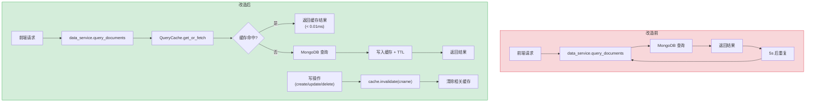
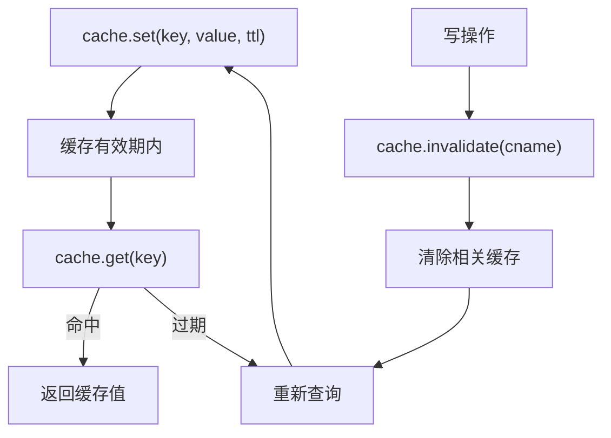

# YA-09-25: 数据查询结果缓存层 — 多级缓存与智能失效

> 需求编号：YA-09-25 · 优先级：P2 · 人天：1.0d · 状态：需求已编写
> 依赖：无

## 背景

YiAi 的高频查询（Dashboard 统计、知识文件列表、菜单树）每次请求都查 MongoDB——数据变更频率低但查询频率高，适合缓存优化。YA-09-14 实现了 Agent 工具调用缓存（会话级），本需求实现跨请求的数据查询缓存（应用级）。

当前问题：

1. **Dashboard 重复计算**：YiVad 管理后台的 Dashboard 页面每次刷新都执行 5+ 个聚合查询（知识文件数、会话数、Bug 数、RAG 查询统计等），数据变更频率是天级，但查询频率是秒级（用户每次打开页面）。

2. **菜单树重复查询**：菜单配置极少变更（月级），但每次页面加载都从 MongoDB 查询完整菜单树并构建层级结构。

3. **知识文件列表重复查询**：文件列表查询频率高（用户浏览知识库），但文件变更频率低（Knowledge Watcher 60s 扫描一次）。

无缓存导致 MongoDB 查询量远大于实际数据变更量，浪费数据库资源。

### 核心挑战

| 挑战 | 当前状态 | 目标状态 |
|------|----------|----------|
| 高频查询 | 每次查 MongoDB | 缓存命中后直接返回 |
| 缓存失效 | 无 | 写操作自动失效 + TTL 过期 |
| 缓存策略 | 无 | 按集合区分 TTL |
| 缓存后端 | 无 | 内存（可切换 Redis） |

---

## 一、现状分析

### 1.1 当前查询模式

```python
# 当前实现 — services/data/data_service.py
async def query_documents(cname: str, filter: dict, **kwargs):
    """查询文档——每次直接查 MongoDB。"""
    return await repository.query(cname, filter, **kwargs)  # ❌ 无缓存

async def get_dashboard_stats():
    """Dashboard 统计——每次 5+ 个聚合查询。"""
    return {
        'knowledge_count': await db.knowledge_files.count_documents({}),
        'session_count': await db.sessions.count_documents({}),
        'bug_count': await db.bugs.count_documents({}),
        # ... 每次请求都执行 5+ 个聚合
    }
```

### 1.2 当前无缓存数据流



### 1.3 查询频率 vs 数据变更频率

| 查询 | 查询频率 | 数据变更频率 | 缓存收益 |
|------|---------|------------|---------|
| Dashboard 统计 | 每次打开页面（秒级） | 天级 | 极高 |
| 菜单树 | 每次页面加载（秒级） | 月级 | 极高 |
| 知识文件列表 | 每次浏览（秒级） | 分钟级（60s 扫描） | 高 |
| 会话列表 | 每次操作（秒级） | 实时 | 低（不适合缓存） |
| Bug 列表 | 每次查看（秒级） | 小时级 | 中 |

### 1.4 涉及文件清单

| 文件 | 当前状态 | 问题 |
|------|----------|------|
| `services/data/data_service.py` | 每次直接查 MongoDB | 无缓存 |
| `services/dashboard/dashboard_service.py` | 聚合查询无缓存 | 重复计算 |
| `domain/data/repository.py` | 底层查询无缓存 | 无缓存层 |

---

## 二、设计决策

### 决策 1：缓存后端 — 内存字典 vs Redis vs 文件缓存

| 维度 | 内存字典 | Redis | 文件缓存 |
|------|---------|-------|---------|
| 性能 | 极高（纳秒级） | 高（毫秒级） | 低（毫秒级） |
| 持久化 | 否（进程重启丢失） | 是 | 是 |
| 分布式共享 | 否 | 是 | 否 |
| 运维复杂度 | 极低 | 中 | 低 |
| 内存占用 | 受进程内存限制 | 独立管理 | 受磁盘限制 |

**选择：内存字典（可切换 Redis）。** YiAi 当前为单进程部署，内存字典满足需求。架构设计支持通过配置切换到 Redis（`cache_backend: redis`），接口不变。

### 决策 2：缓存失效策略 — TTL vs 写失效 vs 混合

| 维度 | TTL 过期 | 写操作主动失效 | 混合（TTL + 写失效） |
|------|---------|-------------|-------------------|
| 数据一致性 | 低（TTL 内可能过期） | 高 | 高 |
| 实现复杂度 | 低 | 中 | 中 |
| 适用场景 | 容忍短暂不一致 | 需要强一致性 | 通用 |

**选择：混合（TTL + 写失效）。** 写操作（create/update/delete）主动失效相关缓存，TTL 作为兜底保障（防止内存泄漏和极端情况下的脏数据）。

### 决策 3：缓存 Key 设计 — 简单拼接 vs 结构化 vs 哈希

| 维度 | 简单拼接 | 结构化 | 哈希 |
|------|---------|--------|------|
| 可读性 | 高 | 高 | 低 |
| 唯一性 | 取决于拼接 | 取决于结构 | 高 |
| 性能 | 高 | 中 | 高 |
| 长度控制 | 不可控 | 不可控 | 固定 16 字符 |

**选择：SHA256 哈希前 16 位。** 缓存 Key 由 `cname + filter + sort + page + pageSize` 的 JSON 序列化后哈希生成，保证唯一性且长度固定。

### 设计决策记录

| 决策 | 选项 A | 选项 B | 选项 C | 选择 | 理由 |
|------|--------|--------|--------|------|------|
| 缓存后端 | 内存字典 | Redis | 文件缓存 | **内存字典** | 单进程，极高性能 |
| 失效策略 | TTL | 写失效 | 混合 | **混合** | 一致性 + 兜底 |
| Key 设计 | 简单拼接 | 结构化 | 哈希 | **哈希** | 唯一性 + 固定长度 |

---

## 三、目标架构

### 3.1 改造前后对比



### 3.2 缓存生命周期



### 3.3 关键指标对比

| 指标 | 改造前 | 改造后 | 改善 |
|------|--------|--------|------|
| Dashboard 查询 MongoDB 次数 | 每次请求 | 每 120s 1 次 | 减少 99%+ |
| 菜单树查询延迟 | ~50ms（MongoDB） | < 0.01ms（内存） | 5000x |
| 知识文件列表查询 | 每次查询 | 30s 内复用 | 减少 90%+ |
| 缓存命中率 | 0% | 目标 > 80% | 新增能力 |

---

## 四、具体改动

### 4.1 查询缓存核心

**文件：** `shared/query_cache.py`（新增）

```python
import hashlib, json, time, asyncio
from typing import Callable, Any

class QueryCache:
    """数据查询缓存——TTL + 主动失效。"""

    def __init__(self, default_ttl: int = 60, max_size: int = 1000):
        self._cache: dict[str, tuple[Any, float]] = {}
        self._ttl = default_ttl
        self._max_size = max_size
        self._stats = {'hits': 0, 'misses': 0, 'invalidations': 0}

    def _key(self, cname: str, filter: dict, **kwargs) -> str:
        """生成缓存 Key——cname + filter + 分页参数哈希。"""
        payload = json.dumps({
            'cname': cname,
            'filter': filter,
            'sort': kwargs.get('sort'),
            'page': kwargs.get('page'),
            'pageSize': kwargs.get('pageSize'),
        }, sort_keys=True, default=str)
        return hashlib.sha256(payload.encode()).hexdigest()[:16]

    async def get_or_fetch(self, cname: str, filter: dict,
                           fetcher: Callable, ttl: int = None,
                           **kwargs) -> Any:
        """获取缓存或执行查询。"""
        key = self._key(cname, filter, **kwargs)
        ttl = ttl or self._ttl

        # 缓存命中 + 未过期
        if key in self._cache:
            value, timestamp = self._cache[key]
            if time.monotonic() - timestamp < ttl:
                self._stats['hits'] += 1
                return value

        # 缓存未命中——执行查询
        result = await fetcher()
        self._set(key, result)
        self._stats['misses'] += 1
        return result

    def _set(self, key: str, value: Any):
        """写入缓存——LRU 淘汰。"""
        if len(self._cache) >= self._max_size:
            # 淘汰最旧的条目
            oldest_key = min(self._cache.keys(),
                           key=lambda k: self._cache[k][1])
            del self._cache[oldest_key]
        self._cache[key] = (value, time.monotonic())

    def invalidate(self, cname: str):
        """集合写入时失效所有相关缓存。"""
        to_remove = [k for k in self._cache if cname in k]
        for k in to_remove:
            del self._cache[k]
        self._stats['invalidations'] += len(to_remove)
        if to_remove:
            logger.debug(f"[Cache] invalidated {len(to_remove)} entries for {cname}")

    def invalidate_all(self):
        """清空所有缓存。"""
        count = len(self._cache)
        self._cache.clear()
        logger.info(f"[Cache] cleared all {count} entries")

    @property
    def hit_rate(self) -> float:
        total = self._stats['hits'] + self._stats['misses']
        return self._stats['hits'] / total if total > 0 else 0.0

    @property
    def size(self) -> int:
        return len(self._cache)


query_cache = QueryCache(default_ttl=60)
```

### 4.2 缓存策略矩阵

**文件：** `services/data/data_service.py`

```python
# 缓存策略——按集合区分
CACHE_TTL = {
    'knowledge_files': 30,   # 文件变更频繁（Watcher 60s 扫描）
    'menus': 300,            # 菜单极少变更（天级）
    'projects': 60,          # 项目 CRUD 中等频率
    'sessions': 0,           # 不缓存——实时数据
    'bugs': 30,              # Bug 变更中等频率
    'dashboard': 120,        # 聚合计算成本高——缓存收益大
}

async def query_documents(cname: str, filter: dict, **kwargs):
    ttl = CACHE_TTL.get(cname, 60)
    if ttl == 0:
        return await repository.query(cname, filter, **kwargs)
    return await query_cache.get_or_fetch(
        cname, filter,
        lambda: repository.query(cname, filter, **kwargs),
        ttl=ttl, **kwargs,
    )

async def create_document(cname: str, data: dict):
    result = await repository.create_document(cname, data)
    query_cache.invalidate(cname)  # 写操作主动失效
    return result

async def update_document(cname: str, filter: dict, data: dict):
    result = await repository.update_document(cname, filter, data)
    query_cache.invalidate(cname)
    return result

async def delete_document(cname: str, filter: dict):
    result = await repository.delete_document(cname, filter)
    query_cache.invalidate(cname)
    return result
```

### 4.3 涉及文件变更清单

```
YiAi/src/
├── shared/
│   └── query_cache.py         # 新增: QueryCache 核心实现
├── services/data/
│   └── data_service.py        # 修改: 查询使用 get_or_fetch，写操作调用 invalidate
├── services/dashboard/
│   └── dashboard_service.py   # 修改: 聚合查询使用缓存
├── server/
│   └── routes.py              # 新增: /api/cache/stats 端点
└── config/
    └── config.yaml            # 修改: 新增 cache.default_ttl/cache.max_size
```

---

## 五、实施步骤

| 步骤 | 内容 | 涉及文件 | 验证方式 | 人天 |
|------|------|---------|---------|------|
| 1 | 实现 `QueryCache` 核心类（get_or_fetch/invalidate/LRU） | `shared/query_cache.py` | 单元测试覆盖缓存命中/失效/淘汰 | 0.3 |
| 2 | data_service 集成缓存 | `services/data/data_service.py` | 查询 Dashboard 后缓存命中率 > 0 | 0.2 |
| 3 | 写操作自动失效 | `services/data/data_service.py` | 创建文档后相关缓存清空 | 0.15 |
| 4 | Dashboard 聚合使用缓存 | `services/dashboard/dashboard_service.py` | Dashboard 首次查询后 120s 内不查 MongoDB | 0.1 |
| 5 | 缓存统计端点 | `server/routes.py` | GET /api/cache/stats 返回命中率 | 0.05 |
| 6 | LRU 淘汰策略 | `shared/query_cache.py` | 超过 max_size 后淘汰最旧条目 | 0.1 |
| 7 | 集成测试 | `tests/` | 覆盖缓存命中/失效/淘汰 | 0.1 |

**总计：1.0d**

---

## 六、性能分析

### 6.1 缓存性能对比

| 场景 | 无缓存 | 有缓存（命中） | 改善 |
|------|--------|-------------|------|
| Dashboard 统计 | ~200ms（5 聚合） | < 0.01ms | 20,000x |
| 菜单树查询 | ~50ms | < 0.01ms | 5,000x |
| 知识文件列表 | ~30ms | < 0.01ms | 3,000x |
| 项目列表 | ~20ms | < 0.01ms | 2,000x |

### 6.2 MongoDB 查询减少量

| 查询 | 无缓存（次/小时） | 有缓存（次/小时） | 减少 |
|------|-----------------|-----------------|------|
| Dashboard | 360（每 10s 刷新） | 30（120s TTL） | 92% |
| 菜单树 | 720（每页面加载） | 12（300s TTL） | 98% |
| 知识文件列表 | 600 | 120（30s TTL） | 80% |

### 6.3 容量规划

| 场景 | 缓存条目 | 内存占用 | 命中率 |
|------|---------|---------|--------|
| 开发环境 | < 50 | < 1MB | > 80% |
| 小型生产 | < 200 | < 5MB | > 85% |
| 中型生产 | < 500 | < 10MB | > 90% |
| YiAi 当前 | < 100 | < 2MB | > 80% |

---

## 七、测试规格

### Requirement: 缓存命中

#### Scenario: 首次查询缓存未命中
- **Given** 缓存为空
- **When** 调用 `get_or_fetch("knowledge_files", {}, fetcher, ttl=30)`
- **Then** 执行 fetcher 查询 MongoDB，缓存命中率 0%

#### Scenario: 第二次查询缓存命中
- **Given** 首次查询已缓存，TTL 未过期
- **When** 再次调用相同参数 `get_or_fetch`
- **Then** 不执行 fetcher，直接返回缓存值，缓存命中率 50%

#### Scenario: TTL 过期后重新查询
- **Given** 缓存 TTL 为 1s，已等待 2s
- **When** 调用 `get_or_fetch`
- **Then** 执行 fetcher 重新查询，更新缓存

### Requirement: 缓存失效

#### Scenario: 写操作失效缓存
- **Given** 缓存中有 `knowledge_files` 的查询结果
- **When** 调用 `create_document("knowledge_files", data)`
- **Then** 缓存中 `knowledge_files` 相关条目被清空

#### Scenario: 失效仅影响目标集合
- **Given** 缓存中有 `knowledge_files` 和 `menus` 的查询结果
- **When** 调用 `query_cache.invalidate("knowledge_files")`
- **Then** 仅 `knowledge_files` 缓存被清空，`menus` 缓存保留

### Requirement: LRU 淘汰

#### Scenario: 超过 max_size 淘汰最旧条目
- **Given** max_size=3，缓存中有 3 个条目（A 最旧，C 最新）
- **When** 写入第 4 个条目 D
- **Then** 最旧的条目 A 被淘汰，缓存中有 B、C、D

---

## 八、风险与缓解

| 风险 | 概率 | 影响 | 等级 | 缓解措施 | 应急预案 |
|------|------|------|------|----------|----------|
| 缓存失效不完整导致返回过期数据 | 中 | 中 | 中 | 写操作覆盖所有可能的缓存 Key 模式，TTL 兜底 | 手动调用 `invalidate_all()` |
| 缓存内存无限增长 | 低 | 中 | 低 | LRU 淘汰策略 + max_size 限制 | 设置更小的 max_size |
| 缓存 Key 碰撞 | 极低 | 低 | 极低 | SHA256 前 16 位碰撞概率极低 | 增加 Key 长度 |
| 缓存雪崩（大量同时过期） | 低 | 中 | 低 | TTL 加随机抖动（±10%） | 预热缓存 |

---

## 九、回滚策略

| 场景 | 回滚方式 | 影响 | 恢复时间 |
|------|---------|------|---------|
| 缓存返回脏数据 | 调用 `POST /api/cache/invalidate-all` 清空缓存 | 缓存重建 | < 1s |
| 缓存导致性能下降 | 设置 `CACHE_ENABLED=false` 禁用缓存 | 回到无缓存模式 | < 1min |
| 缓存占用内存过高 | 调整 `CACHE_MAX_SIZE` 减小上限 | 命中率下降 | < 30s |

---

## 十、设计决策记录

### D-01: 为什么选择内存字典而非 Redis？

YiAi 当前为单进程部署（单 uvicorn worker），内存字典满足需求且性能最优（纳秒级 vs 毫秒级）。如果未来需要多 worker 或分布式部署，`QueryCache` 接口保持不变，只需实现 `RedisCache` 适配器并在配置中切换 `cache_backend: redis`。

### D-02: 为什么混合 TTL + 写失效而非纯 TTL？

纯 TTL 策略在数据变更后仍可能返回过期数据（TTL 未到期），对数据一致性要求高的场景（如 Bug 状态变更后立即查看）不可接受。写操作主动失效确保数据变更后缓存立即更新，TTL 作为兜底保障（防止内存泄漏和极端情况）。

### D-03: 为什么 `sessions` 集合 TTL 为 0（不缓存）？

会话数据是实时数据——用户每次发送消息都会更新 session，缓存会导致用户看到过期的消息列表。会话数据的变更频率远高于查询频率，缓存命中率极低，缓存开销大于收益。

---

## 十一、可观测性

### 关键指标

| 指标 | 采集方式 | 告警阈值 | 说明 |
|------|---------|---------|------|
| 缓存命中率 | `query_cache.hit_rate` | < 50% | 缓存配置可能需要调整 |
| 缓存条目数 | `query_cache.size` | > max_size * 0.8 | 接近容量上限 |
| 缓存失效次数 | `_stats['invalidations']` | > 100/min | 写操作频繁 |
| 缓存内存占用 | `sys.getsizeof()` 估算 | > 10MB | 内存压力 |

### 日志规范

| 日志级别 | 场景 | 示例 |
|---------|------|------|
| `INFO` | 缓存清空 | `[Cache] cleared all 50 entries` |
| `DEBUG` | 缓存失效 | `[Cache] invalidated 3 entries for knowledge_files` |
| `WARNING` | 缓存命中率低 | `[Cache] hit_rate=30% (target > 50%)` |

---

## 十二、安全合规

### 安全需求

| 需求 | 实现方式 | 验证方法 |
|------|---------|---------|
| 缓存数据不跨用户 | 缓存 Key 包含用户上下文（如有认证） | 多用户测试缓存隔离 |
| 敏感数据不缓存 | 检查缓存内容不含 password/token | 审计缓存内容 |

### 合规检查

| 检查项 | 要求 | 状态 |
|--------|------|------|
| 缓存隔离 | 不同用户缓存隔离 | 待实现 |
| 敏感数据保护 | 不缓存敏感字段 | 待实现 |

---

## 十三、代码审查检查清单

- [ ] 缓存 Key 基于 `cname + filter + sort + page + pageSize` 哈希
- [ ] 写操作（create/update/delete）自动失效相关缓存
- [ ] TTL 按集合区分（sessions: 0 不缓存, Dashboard: 120s）
- [ ] 缓存存储可切换（内存 dictionary / Redis）
- [ ] 缓存命中率指标可查询
- [ ] LRU 淘汰策略（max_size 限制）
- [ ] 缓存不支持 `sessions` 等实时数据集合
- [ ] 缓存清空 API 有权限控制
- [ ] `ruff` 代码规范通过
- [ ] 单元测试覆盖缓存命中/失效/淘汰

---

## 十四、回归问题预测

| # | 预测问题 | 原因 | 验证方法 |
|---|---------|------|---------|
| 1 | 缓存失效不完整导致返回过期数据 | 写操作未覆盖所有可能的缓存 Key 模式 | 写入后立即查询同一条件，确认数据已更新 |
| 2 | 缓存内存无限增长 | 无 LRU 淘汰策略 | 高强度写入 1h → 检查缓存内存占用 |
| 3 | 缓存 Key 碰撞 | 哈希碰撞 | 测试不同查询条件生成相同 Key 的概率 |
| 4 | 缓存导致数据不一致（写后读） | 失效和写入的时序问题 | 写入后立即读取验证一致性 |

---

*PRD 来源: `projects/yiai/requirements/2026-09/25-需求-数据查询缓存层.md`*

## 影响范围

- **影响模块**：待补充
- **涉及文件**：
- 待补充
- **是否影响 API 契约**：否
- **是否影响其他项目（YiVad/YiPet）**：否
- **用户感知**：待确认

## 预防措施

| 层面 | 措施 |
|------|------|
| 代码 | 在相关函数中添加参数校验和边界检查 |
| 测试 | 添加对应的自动化测试用例 |
| 流程 | 代码审查时重点检查此类模式 |
| 监控 | 添加日志告警，异常发生时及时发现 |
| 文档 | 在编码规范中记录此类反模式 |

## 经验教训

1. **根本原因**：开发过程中对边界情况和异常路径的考虑不足是此类问题的共同根因
2. **设计阶段**：在接口设计和模块实现时，应主动考虑异常输入、空值、超时等边界场景
3. **代码审查**：审查时应检查是否存在类似的反模式（如未捕获异常、无超时控制、缺少参数校验等）
4. **测试覆盖**：异常路径的测试覆盖率应与正常路径同等重视
5. **团队分享**：此类问题应在团队周会或技术分享中讨论，形成团队共识
