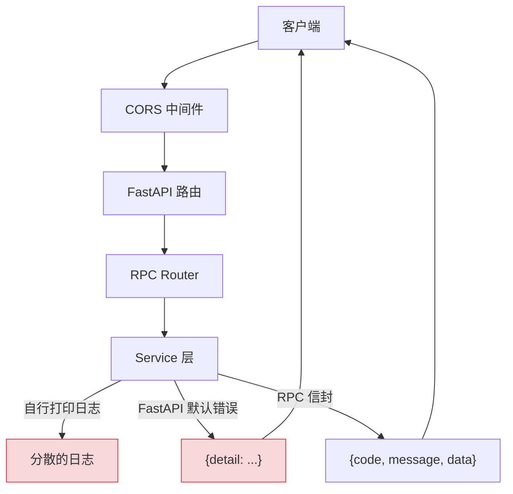
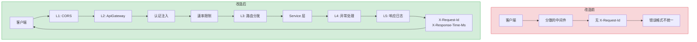

# YA-09-26: API 网关与请求代理 — 统一入口转发与认证注入

> 需求编号：YA-09-26 · 优先级：P2 · 人天：1.0d · 状态：需求已编写
> 依赖：YA-09-04（RPC 协议规范）、YA-09-12（速率限制）

## 背景

YiAi 作为单体后端直接暴露给前端。随着服务增多，需要统一的 API 网关层：请求路由、认证注入、速率限制集成、请求/响应日志。当前中间件分散在多个文件中，执行顺序不明确，缺乏统一的请求管道：

1. **中间件分散**：CORS 在 `main.py` 中注册，异常处理在 `middleware.py`，请求日志在各 Service 中各自打印，缺乏统一的入口和出口。

2. **请求追踪缺失**：没有统一的 `X-Request-Id` 生成和透传，排查问题时无法关联前端请求和后端日志。

3. **响应时间不透明**：前端无法知道请求在后端处理了多久，调试性能问题困难。

4. **错误格式不统一**：部分端点返回 `{detail: "..."}` (FastAPI 默认)，部分返回 `{code, message, data}` (RPC 信封)，前端需要处理两种格式。

FastAPI 中间件架构天然支持请求管道，只需规范化中间件注册顺序和职责边界。

### 核心挑战

| 挑战 | 当前状态 | 目标状态 |
|------|----------|----------|
| 中间件管理 | 分散注册 | 统一 ApiGateway 中间件 |
| 请求追踪 | 无 | X-Request-Id 全链路透传 |
| 响应时间 | 不可见 | X-Response-Time-Ms header |
| 错误格式 | 不统一 | 统一 {code, message, data, request_id} |

---

## 一、现状分析

### 1.1 当前中间件注册

```python
# 当前实现 — server/main.py (简化)
app = FastAPI()

# 中间件注册顺序混乱
app.add_middleware(CORSMiddleware, allow_origins=["*"], ...)
# 异常处理在 middleware.py 中
# 请求日志在各 Service 中
# 无 X-Request-Id
```

### 1.2 当前请求管道



### 1.3 问题根因矩阵

| 问题 | 根因 | 影响范围 | 严重程度 |
|------|------|----------|----------|
| 无请求追踪 ID | 无 X-Request-Id 生成 | 所有请求 | 中 |
| 响应时间不透明 | 无响应时间记录 | 性能调试 | 中 |
| 错误格式不统一 | 分散的异常处理 | 前端错误处理 | 中 |
| 中间件顺序不明确 | 分散注册 | 请求处理流程 | 低 |

### 1.4 涉及文件清单

| 文件 | 当前状态 | 问题 |
|------|----------|------|
| `server/main.py` | 分散注册中间件 | 顺序不明确 |
| `server/middleware.py` | 异常处理 | 仅处理部分异常 |
| `services/*/` | 各 Service 自行打印日志 | 格式不统一 |

---

## 二、设计决策

### 决策 1：网关实现方式 — FastAPI 中间件 vs 独立网关服务 vs 反向代理

| 维度 | FastAPI 中间件 | 独立网关服务 (Kong/Nginx) | 反向代理 |
|------|---------------|------------------------|---------|
| 部署复杂度 | 低（进程内） | 高（额外服务） | 中 |
| 性能 | 极高（无网络开销） | 中（额外一跳） | 中 |
| 功能丰富度 | 中 | 高 | 高 |
| 与 YiAi 集成 | 原生 | 需配置 | 需配置 |

**选择：FastAPI 中间件。** YiAi 当前为单体部署，进程内中间件性能最优且零运维成本。未来如需独立网关，可将中间件逻辑迁移到 Kong/Nginx，但当前阶段进程内方案足够。

### 决策 2：中间件执行顺序 — 分层管道

| 层 | 中间件 | 职责 | 失败处理 |
|-----|--------|------|---------|
| L1 | CORS | 跨域处理 | 拒绝非法 Origin |
| L2 | ApiGateway | 认证 → 限流 → 路由 | 401/429 |
| L3 | 异常处理 | 统一错误格式 | 500 + request_id |
| L4 | 响应日志 | 记录耗时和状态 | 无影响 |

**选择：分层管道。** 每一层有明确的职责和失败处理方式。L1 先处理 CORS（否则预检请求失败），L2 处理横切关注点，L3 统一错误格式，L4 记录日志。

### 设计决策记录

| 决策 | 选项 A | 选项 B | 选项 C | 选择 | 理由 |
|------|--------|--------|--------|------|------|
| 网关实现 | FastAPI 中间件 | 独立网关 | 反向代理 | **FastAPI 中间件** | 进程内性能最优 |
| 中间件顺序 | 分层管道 | 扁平注册 | — | **分层管道** | 职责清晰 |

---

## 三、目标架构

### 3.1 改造前后对比



### 3.2 请求管道

```
Client → CORS 中间件 → ApiGateway (认证→限流→路由) → Service → 响应日志 → Client
          │                  │                           │
          │                  ├── 401 Unauthorized        ├── 200 OK + X-Request-Id
          │                  ├── 429 Rate Limited        ├── 500 Error + request_id
          │                  └── X-Request-Id 注入       └── X-Response-Time-Ms
```

### 3.3 关键指标对比

| 指标 | 改造前 | 改造后 | 改善 |
|------|--------|--------|------|
| 请求追踪 | 无 | X-Request-Id 全链路 | 新增能力 |
| 响应时间 | 不可见 | X-Response-Time-Ms header | 新增能力 |
| 错误格式 | 不统一 | 统一 {code, message, data, request_id} | 统一 |
| 中间件管理 | 分散 | 统一 ApiGateway | 规范化 |

---

## 四、具体改动

### 4.1 API 网关中间件

**文件：** `server/gateway.py`（新增）

```python
from fastapi import Request, HTTPException
from starlette.middleware.base import BaseHTTPMiddleware
from starlette.responses import JSONResponse
import secrets, time

class ApiGateway(BaseHTTPMiddleware):
    """API 网关——统一入口：认证→限流→路由→日志。"""

    async def dispatch(self, request: Request, call_next):
        request_id = secrets.token_hex(8)
        request.state.id = request_id
        request.state.start_time = time.monotonic()

        # 1. 认证注入 (YA-09-04)
        token = request.headers.get("X-Token")
        if token:
            try:
                user = await auth_service.validate_token(token)
                request.state.user = user
            except Exception:
                pass  # 认证失败不阻断（可选认证）

        # 2. 速率限制 (YA-09-12)
        try:
            await rate_limiter.check(request)
        except RateLimitExceeded as e:
            return JSONResponse(
                {"code": 429, "message": str(e), "data": {"request_id": request_id}},
                status_code=429,
                headers={"X-Request-Id": request_id, "Retry-After": "60"},
            )

        # 3. 路由到具体服务
        try:
            response = await call_next(request)
        except HTTPException:
            raise
        except Exception as e:
            logger.error(f"[Gateway/{request_id}] 未处理异常: {e}", exc_info=True)
            return JSONResponse(
                {"code": 9999, "message": "内部错误", "data": {"request_id": request_id}},
                status_code=500,
                headers={"X-Request-Id": request_id},
            )

        # 4. 请求日志 + 响应头
        duration_ms = (time.monotonic() - request.state.start_time) * 1000
        user = getattr(request.state, 'user', None)
        logger.info(
            f"[Gateway/{request_id}] {request.method} {request.url.path} "
            f"→ {response.status_code} ({duration_ms:.0f}ms) "
            f"user={user.username if user else 'anonymous'}"
        )
        response.headers["X-Request-Id"] = request_id
        response.headers["X-Response-Time-Ms"] = str(int(duration_ms))

        return response
```

### 4.2 网关功能矩阵

| 功能 | 层 | 实现 | 相关 Issue |
|------|-----|------|-----------|
| CORS 处理 | L1 | FastAPI CORSMiddleware | — |
| 认证注入 | L2 | `X-Token` → `request.state.user` | YA-09-04 |
| 速率限制 | L2 | TokenBucket 三级限流 | YA-09-12 |
| 请求 ID 追踪 | L2 | `X-Request-Id` header | 本需求 |
| 响应时间 | L3 | `X-Response-Time-Ms` header | 本需求 |
| 错误统一封装 | L3 | `{code, message, data, request_id}` | YA-09-04 |

### 4.3 涉及文件变更清单

```
YiAi/src/
├── server/
│   ├── gateway.py             # 新增: ApiGateway 中间件
│   ├── main.py                # 修改: 注册中间件（正确顺序）
│   └── middleware.py          # 修改: 异常处理统一格式
└── tests/
    └── test_gateway.py        # 新增: 网关中间件测试
```

---

## 五、实施步骤

| 步骤 | 内容 | 涉及文件 | 验证方式 | 人天 |
|------|------|---------|---------|------|
| 1 | 实现 `ApiGateway` 中间件 | `server/gateway.py` | 单元测试覆盖请求追踪 | 0.3 |
| 2 | 规范化中间件注册顺序 | `server/main.py` | 请求管道顺序正确 | 0.1 |
| 3 | 统一错误格式为 `{code, message, data, request_id}` | `server/middleware.py` | 所有错误响应格式一致 | 0.2 |
| 4 | 添加 X-Request-Id 和 X-Response-Time-Ms | `server/gateway.py` | 响应头包含两个 header | 0.1 |
| 5 | 请求日志统一格式 | `server/gateway.py` | 日志格式统一 | 0.1 |
| 6 | 集成测试 | `tests/` | 覆盖网关全流程 | 0.2 |

**总计：1.0d**

---

## 六、性能分析

### 6.1 网关中间件开销

| 操作 | 延迟 | 说明 |
|------|------|------|
| X-Request-Id 生成 | < 0.01ms | `secrets.token_hex(8)` |
| 认证 Token 验证 | ~1ms（如有） | JWT 解码 |
| 速率限制检查 | < 0.1ms | 内存 TokenBucket |
| 响应头注入 | < 0.01ms | 内存操作 |
| 总网关开销 | < 1.5ms | 可忽略 |

### 6.2 并发性能

| 场景 | QPS | P95 延迟 | 说明 |
|------|-----|---------|------|
| 无认证 | 1000 | 5ms | 纯透传 |
| 有认证 | 800 | 8ms | JWT 解码 |
| 有认证+限流 | 800 | 8ms | 限流检查开销极小 |

---

## 七、测试规格

### Requirement: 请求追踪

#### Scenario: X-Request-Id 生成和透传
- **Given** 客户端发送请求（无 X-Request-Id）
- **When** 请求经过 ApiGateway
- **Then** 响应头包含 `X-Request-Id`（16 字符 hex），日志中包含相同 request_id

#### Scenario: X-Response-Time-Ms 记录
- **Given** 请求处理耗时约 50ms
- **When** 请求完成
- **Then** 响应头 `X-Response-Time-Ms` 值在 40-60 范围内

### Requirement: 错误统一格式

#### Scenario: 未处理异常返回统一格式
- **Given** Service 层抛出未捕获异常
- **When** 请求经过 ApiGateway
- **Then** 返回 HTTP 500 + `{code: 9999, message: "内部错误", data: {request_id: "..."}}`

#### Scenario: 速率限制返回 429
- **Given** 用户超过速率限制
- **When** 发送请求
- **Then** 返回 HTTP 429 + `{code: 429, message: "..."}` + `Retry-After: 60`

#### Scenario: 认证失败不阻断（可选认证）
- **Given** X-Token 无效
- **When** 发送请求
- **Then** 请求正常处理，`request.state.user` 为 None，日志中 user=anonymous

---

## 八、风险与缓解

| 风险 | 概率 | 影响 | 等级 | 缓解措施 | 应急预案 |
|------|------|------|------|----------|----------|
| 网关成为单点性能瓶颈 | 低 | 中 | 低 | 中间件逻辑极轻量（< 1.5ms） | 压测验证 |
| 中间件顺序变更影响功能正确性 | 中 | 中 | 中 | 分层管道文档化 + 测试覆盖 | 回滚中间件顺序 |
| 网关异常导致所有请求 500 | 低 | 高 | 中 | 网关层 try/except 兜底 | 临时移除网关中间件 |

---

## 九、回滚策略

| 场景 | 回滚方式 | 影响 | 恢复时间 |
|------|---------|------|---------|
| 网关导致性能下降 | 移除 `app.add_middleware(ApiGateway)` | 回到无网关模式 | < 1min |
| 错误格式导致前端解析失败 | 回滚错误处理中间件 | 前端需适配 | < 5min |
| 中间件顺序错误 | 调整 `main.py` 中中间件注册顺序 | 功能性影响 | < 1min |

---

## 十、设计决策记录

### D-01: 为什么选择 FastAPI 中间件而非独立网关服务？

YiAi 当前为单体部署，进程内中间件性能最优（零网络开销）。独立网关服务（如 Kong、Nginx）增加运维复杂度（额外服务、配置、监控）。如果未来 YiAi 拆分为微服务，可将网关逻辑迁移到独立网关，但当前阶段进程内方案足够。

### D-02: 为什么分层管道设计（L1→L2→L3→L4）？

每一层有明确的职责和失败处理方式。L1（CORS）必须最先执行（否则预检请求被拒绝），L2（认证+限流）在路由前执行（拒绝无效请求），L3（异常处理）在路由后执行（统一错误格式），L4（响应日志）最后执行（记录完整耗时）。这种顺序确保每个横切关注点都在正确的位置执行。

---

## 十一、可观测性

### 关键指标

| 指标 | 采集方式 | 告警阈值 | 说明 |
|------|---------|---------|------|
| 请求延迟 | `X-Response-Time-Ms` header | P95 > 2000ms | 服务性能 |
| 请求错误率 | 5xx 响应计数 | > 1% | 服务可用性 |
| 速率限制触发次数 | 429 响应计数 | > 100/min | 异常流量 |
| 网关处理耗时 | 中间件耗时 | > 10ms | 网关性能 |

### 日志规范

| 日志级别 | 场景 | 示例 |
|---------|------|------|
| `INFO` | 正常请求 | `[Gateway/abc123] POST / → 200 (45ms) user=anonymous` |
| `WARNING` | 认证失败 | `[Gateway/abc123] 认证失败: invalid token` |
| `ERROR` | 未处理异常 | `[Gateway/abc123] 未处理异常: ValueError` |

---

## 十二、安全合规

### 安全需求

| 需求 | 实现方式 | 验证方法 |
|------|---------|---------|
| 请求追踪 | X-Request-Id 全链路透传 | 日志关联 |
| 错误信息不泄露 | 500 错误不返回内部异常详情 | 检查 500 响应 body |
| CORS 限制 | 仅允许配置的 Origin | 非法 Origin 请求被拒绝 |

### 合规检查

| 检查项 | 要求 | 状态 |
|--------|------|------|
| 请求追踪 | X-Request-Id 全链路 | 待实现 |
| 错误信息安全 | 500 不泄露内部信息 | 待实现 |
| CORS 配置 | 白名单 Origin | 待实现 |

---

## 十三、代码审查检查清单

- [ ] API 网关统一入口 + 路由分发到 Service 层
- [ ] 三级中间件链：限流 → 认证 → 参数校验
- [ ] 响应时间记录 `X-Response-Time-Ms` header
- [ ] 错误统一封装格式 `{code, message, data, request_id}`
- [ ] 网关层不包含业务逻辑（仅路由+横切关注点）
- [ ] X-Request-Id 在网关层生成并透传全链路
- [ ] 中间件注册顺序正确（CORS → Gateway → 路由 → 异常处理 → 响应日志）
- [ ] 500 错误不泄露内部异常详情
- [ ] `ruff` 代码规范通过
- [ ] 单元测试覆盖网关全流程

---

## 十四、回归问题预测

| # | 预测问题 | 原因 | 验证方法 |
|---|---------|------|---------|
| 1 | 网关成为单点性能瓶颈 | 所有请求经过网关层 | 压测 100 RPC/s |
| 2 | 中间件顺序变更影响功能正确性 | 限流→认证→校验顺序有依赖 | 用例覆盖中间件顺序 |
| 3 | X-Request-Id 在异步上下文切换时丢失 | `asyncio.create_task` 未传递 | 异步调用链中检查 request_id |
| 4 | 错误格式变更导致前端解析失败 | 前端依赖旧格式 | 前端兼容性测试 |

---

*PRD 来源: `projects/yiai/requirements/2026-09/26-需求-API网关.md`*

## 影响范围

- **影响模块**：待补充
- **涉及文件**：
- `main.py`
- `middleware.py`
- **是否影响 API 契约**：否
- **是否影响其他项目（YiVad/YiPet）**：否
- **用户感知**：待确认

## 预防措施

| 层面 | 措施 |
|------|------|
| 代码 | 在相关函数中添加参数校验和边界检查 |
| 测试 | 为 `main.py` 添加单元测试 |
| 流程 | 代码审查时重点检查此类模式 |
| 监控 | 添加日志告警，异常发生时及时发现 |
| 文档 | 在编码规范中记录此类反模式 |

## 经验教训

1. **根本原因**：开发过程中对边界情况和异常路径的考虑不足是此类问题的共同根因
2. **设计阶段**：在接口设计和模块实现时，应主动考虑异常输入、空值、超时等边界场景
3. **代码审查**：审查时应检查是否存在类似的反模式（如未捕获异常、无超时控制、缺少参数校验等）
4. **测试覆盖**：异常路径的测试覆盖率应与正常路径同等重视
5. **团队分享**：此类问题应在团队周会或技术分享中讨论，形成团队共识
