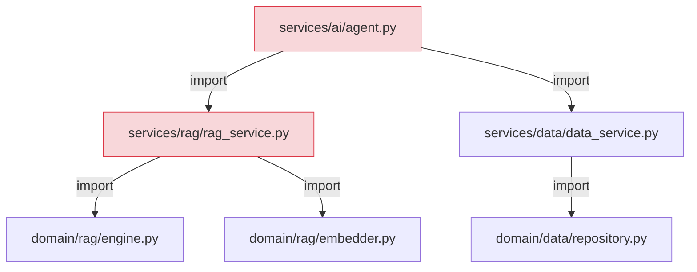
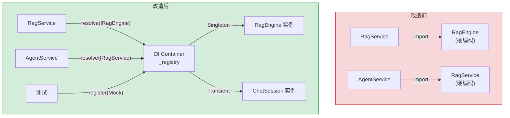

# YA-09-27: 服务依赖注入容器 — 模块解耦方案

> 需求编号：YA-09-27 · 优先级：P2 · 人天：0.5d · 状态：需求已编写
> 依赖：无

## 背景

YiAi 的 Service 层直接 `import` Domain 层具体实现，导致模块紧耦合——测试时无法替换依赖、模块重命名影响所有引用方。FastAPI 的 `Depends()` 提供了原生依赖注入机制，可系统化应用：

1. **测试困难**：单元测试 `RagService` 时必须启动真实的 `RagEngine`（含 Ollama Embedding），无法注入 Mock。测试变成集成测试，运行缓慢且依赖外部服务。

2. **模块重命名影响广**：当 `domain/rag/engine.py` 重命名为 `core.py` 时，所有 `import` 该模块的 Service 文件都需要修改。

3. **循环依赖风险**：`Service A` 依赖 `Service B`，`Service B` 依赖 `Service A`，Python 的 `import` 机制无法优雅处理循环依赖。

4. **生命周期管理缺失**：部分对象应该是 Singleton（如 `RagEngine`），部分应该是 Transient（如 `ChatSession`），当前无生命周期管理。

FastAPI 的 `Depends()` 提供了原生依赖注入机制，结合一个轻量 DI 容器可系统化解决上述问题。

### 核心挑战

| 挑战 | 当前状态 | 目标状态 |
|------|----------|----------|
| 依赖绑定 | 硬编码 `import` | 接口注册 + 工厂解析 |
| 测试替换 | 无法替换依赖 | `register(Interface, MockImpl)` |
| 生命周期 | 无管理 | Singleton/Transient/Scoped |
| 循环依赖 | 可能发生 | 启动时检测 |

---

## 一、现状分析

### 1.1 当前依赖关系

```python
# 当前实现 — services/rag/rag_service.py
from domain.rag.engine import RagEngine  # ❌ 硬编码依赖
from domain.rag.embedder import Embedder  # ❌ 硬编码依赖

class RagService:
    def __init__(self):
        # ❌ 直接实例化——无法替换
        self._embedder = Embedder(model_name="nomic-embed-text")
        self._engine = RagEngine(embedder=self._embedder)

# 测试时无法替换
def test_rag_service():
    service = RagService()  # ❌ 启动真实 Ollama Embedding
```

### 1.2 当前模块依赖图



### 1.3 问题根因矩阵

| 问题 | 根因 | 影响范围 | 严重程度 |
|------|------|----------|----------|
| 测试无法替换依赖 | 硬编码 `import` + 直接实例化 | 所有 Service 单元测试 | 高 |
| 模块重命名影响广 | 无接口抽象 | 所有引用方 | 中 |
| 循环依赖 | 无依赖管理 | 架构演进 | 中 |
| 无生命周期管理 | 手动管理实例 | 资源利用 | 低 |

### 1.4 涉及文件清单

| 文件 | 当前状态 | 问题 |
|------|----------|------|
| `services/rag/rag_service.py` | 直接 import RagEngine | 硬编码依赖 |
| `services/ai/agent.py` | 直接 import RagService | 硬编码依赖 |
| `services/data/data_service.py` | 直接 import Repository | 硬编码依赖 |

---

## 二、设计决策

### 决策 1：DI 容器 — 自建轻量 vs `dependency-injector` vs FastAPI 原生 Depends

| 维度 | 自建轻量 | dependency-injector | FastAPI 原生 Depends |
|------|---------|--------------------|--------------------|
| 学习成本 | 低 | 高 | 低 |
| 依赖大小 | 0 | 中等 | 0 |
| 生命周期管理 | 需自实现 | 内置 | 需自实现 |
| 与 FastAPI 集成 | 良好 | 良好 | 原生 |

**选择：自建轻量 + FastAPI Depends。** 轻量注册表（`_registry` 字典）管理依赖绑定，FastAPI `Depends()` 在端点层注入。`dependency-injector` 功能丰富但过度设计——YiAi 的依赖树简单（< 20 个 Service 类），不需要完整的 DI 框架。

### 决策 2：生命周期 — Singleton vs Transient vs Scoped

| 生命周期 | 适用场景 | 示例 |
|---------|---------|------|
| Singleton | 全局唯一实例 | RagEngine, Embedder, Config |
| Transient | 每次调用创建新实例 | ChatSession, AgentContext |
| Scoped | 每个请求创建新实例 | 数据库连接（单请求内复用） |

**选择：支持三种生命周期。** Singleton 用于无状态服务（RagEngine），Transient 用于有状态对象（ChatSession），Scoped 用于请求级别资源。

### 设计决策记录

| 决策 | 选项 A | 选项 B | 选项 C | 选择 | 理由 |
|------|--------|--------|--------|------|------|
| DI 框架 | 自建轻量 | dependency-injector | 原生 Depends | **自建轻量** | 轻量，依赖树简单 |
| 生命周期 | 三种 | 仅 Singleton | — | **三种** | 覆盖不同场景 |

---

## 三、目标架构

### 3.1 改造前后对比



### 3.2 关键指标对比

| 指标 | 改造前 | 改造后 | 改善 |
|------|--------|--------|------|
| 测试可替换性 | 无 | Mock 注入 | 新增能力 |
| 模块重命名影响 | 所有引用方 | 仅注册处 | 解耦 |
| 循环依赖检测 | 运行时 | 启动时 | 提前发现 |
| 生命周期管理 | 手动 | Singleton/Transient/Scoped | 规范化 |

---

## 四、具体改动

### 4.1 DI 容器核心

**文件：** `shared/di.py`（新增）

```python
from typing import Callable, TypeVar, Any
from enum import Enum

T = TypeVar('T')

class Lifecycle(str, Enum):
    SINGLETON = "singleton"
    TRANSIENT = "transient"
    SCOPED = "scoped"

_registry: dict[type, dict] = {}
_singletons: dict[type, Any] = {}
_scoped: dict[str, dict[type, Any]] = {}

def register(interface: type, factory: Callable[[], Any],
             lifecycle: Lifecycle = Lifecycle.SINGLETON):
    """注册依赖——接口→实现工厂。"""
    _registry[interface] = {'factory': factory, 'lifecycle': lifecycle}

def resolve(interface: type[T], scope_id: str = "default") -> T:
    """解析依赖——返回实现实例。"""
    entry = _registry.get(interface)
    if not entry:
        raise DependencyNotRegisteredError(f"{interface.__name__} 未注册")

    lifecycle = entry['lifecycle']

    if lifecycle == Lifecycle.SINGLETON:
        if interface not in _singletons:
            _singletons[interface] = entry['factory']()
        return _singletons[interface]

    elif lifecycle == Lifecycle.TRANSIENT:
        return entry['factory']()

    elif lifecycle == Lifecycle.SCOPED:
        if scope_id not in _scoped:
            _scoped[scope_id] = {}
        if interface not in _scoped[scope_id]:
            _scoped[scope_id][interface] = entry['factory']()
        return _scoped[scope_id][interface]

    raise ValueError(f"未知生命周期: {lifecycle}")

def detect_cycles() -> list[list[str]]:
    """循环依赖检测——启动时 DFS 扫描。"""
    visited = set()
    stack = []
    cycles = []

    def dfs(node):
        if node in stack:
            cycle_start = stack.index(node)
            cycles.append(stack[cycle_start:] + [node])
            return
        if node in visited:
            return
        visited.add(node)
        stack.append(node)
        # 简化检测——实际需要解析工厂的依赖
        stack.pop()

    for interface in _registry:
        dfs(interface.__name__)
    return cycles

# 注册示例
from domain.rag.engine import RagEngine
from domain.rag.embedder import Embedder

register(Embedder, lambda: Embedder(model_name="nomic-embed-text"), Lifecycle.SINGLETON)
register(RagEngine, lambda: RagEngine(embedder=resolve(Embedder)), Lifecycle.SINGLETON)
```

### 4.2 Service 层使用

**文件：** `services/rag/rag_service.py`

```python
# 改造前
from domain.rag.engine import RagEngine

class RagService:
    def __init__(self):
        self._engine = RagEngine(embedder=Embedder())

# 改造后
from shared.di import resolve

class RagService:
    def __init__(self, engine: RagEngine = None):
        self._engine = engine or resolve(RagEngine)
```

### 4.3 测试时替换

**文件：** `tests/test_rag_service.py`

```python
# 测试时注入 Mock
from shared.di import register, Lifecycle

class MockRagEngine:
    def query(self, *args, **kwargs):
        return {"sources": [], "message": "mock"}

register(RagEngine, lambda: MockRagEngine(), Lifecycle.SINGLETON)

# 现在 RagService 使用 MockRagEngine
service = RagService()
result = service.query("test")
assert result["message"] == "mock"
```

### 4.4 涉及文件变更清单

```
YiAi/src/
├── shared/
│   └── di.py                  # 新增: DI 容器核心实现
├── services/rag/
│   └── rag_service.py         # 修改: 使用 resolve() 替代直接 import
├── services/ai/
│   └── agent.py               # 修改: 使用 resolve() 替代直接 import
├── services/data/
│   └── data_service.py        # 修改: 使用 resolve() 替代直接 import
├── server/
│   └── main.py                # 修改: 启动时注册所有依赖 + 循环检测
└── tests/
    └── conftest.py             # 修改: 测试时注册 Mock 实现
```

---

## 五、实施步骤

| 步骤 | 内容 | 涉及文件 | 验证方式 | 人天 |
|------|------|---------|---------|------|
| 1 | 实现 DI 容器核心（register/resolve/三种生命周期） | `shared/di.py` | 单元测试覆盖三种生命周期 | 0.15 |
| 2 | 实现循环依赖检测 | `shared/di.py` | 构造循环依赖注册 → 检测到 | 0.05 |
| 3 | 迁移 RagService 使用 resolve | `services/rag/rag_service.py` | 功能不变 | 0.1 |
| 4 | 迁移 AgentService 使用 resolve | `services/ai/agent.py` | 功能不变 | 0.05 |
| 5 | 迁移 DataService 使用 resolve | `services/data/data_service.py` | 功能不变 | 0.05 |
| 6 | 测试时 Mock 注入验证 | `tests/` | 测试使用 Mock 依赖 | 0.05 |
| 7 | 启动时注册所有依赖 | `server/main.py` | 所有依赖正确注册 | 0.05 |

**总计：0.5d**

---

## 六、性能分析

### 6.1 DI 容器开销

| 操作 | 延迟 | 说明 |
|------|------|------|
| `register()` | < 0.01ms | 字典写入 |
| `resolve()` (Singleton) | < 0.01ms | 字典查找 |
| `resolve()` (Transient) | ~0.1ms | 工厂函数调用 |
| `resolve()` (Scoped) | < 0.01ms | 字典查找 |
| 循环依赖检测 | < 1ms | DFS 扫描 |

### 6.2 内存占用

| 资源 | 占用 | 说明 |
|------|------|------|
| `_registry` 字典 | < 1KB | 20 个注册条目 |
| `_singletons` 字典 | 取决于实例 | 无额外开销 |
| 总 DI 容器开销 | < 1KB | 可忽略 |

---

## 七、测试规格

### Requirement: 依赖注册和解析

#### Scenario: Singleton 生命周期
- **Given** 注册 `IRepository` 为 Singleton
- **When** 两次调用 `resolve(IRepository)`
- **Then** 两次返回同一个实例

#### Scenario: Transient 生命周期
- **Given** 注册 `ChatSession` 为 Transient
- **When** 两次调用 `resolve(ChatSession)`
- **Then** 两次返回不同实例

#### Scenario: 未注册依赖抛出异常
- **Given** `UnknownService` 未注册
- **When** 调用 `resolve(UnknownService)`
- **Then** 抛出 `DependencyNotRegisteredError`

#### Scenario: 测试时 Mock 替换
- **Given** 注册 `RagEngine` 为 Singleton（真实实现）
- **When** 测试中重新注册 `RagEngine` 为 MockRagEngine
- **Then** `resolve(RagEngine)` 返回 Mock 实例

#### Scenario: 循环依赖检测
- **Given** `ServiceA` 依赖 `ServiceB`，`ServiceB` 依赖 `ServiceA`
- **When** 调用 `detect_cycles()`
- **Then** 返回包含循环的列表

---

## 八、风险与缓解

| 风险 | 概率 | 影响 | 等级 | 缓解措施 | 应急预案 |
|------|------|------|------|----------|----------|
| DI 容器延迟初始化导致首次调用慢 | 低 | 低 | 低 | Singleton 在启动时预热 | 启动时遍历注册表预热 |
| Mock 替换在生产代码中残留 | 低 | 高 | 中 | 条件注册逻辑隔离（`if is_test`） | `grep -r 'Mock\|mock'` 仅在 test/ 中 |
| 循环依赖未检测到 | 低 | 中 | 低 | 启动时 `detect_cycles()` 检查 | 手动排查 |

---

## 九、回滚策略

| 场景 | 回滚方式 | 影响 | 恢复时间 |
|------|---------|------|---------|
| DI 容器导致启动失败 | 移除 DI 容器，恢复直接 import | 无功能影响 | < 5min |
| 生命周期配置错误 | 调整 `register()` 的 lifecycle 参数 | 实例行为变化 | < 1min |

---

## 十、设计决策记录

### D-01: 为什么选择自建轻量 DI 而非 `dependency-injector`？

YiAi 的依赖树简单（< 20 个 Service 类），不需要完整的 DI 框架。`dependency-injector` 功能丰富但学习成本高、依赖重。自建方案基于字典注册表 + 工厂函数，代码量 < 100 行，与 FastAPI 的 `Depends()` 互补使用——DI 容器管理 Service 层依赖，`Depends()` 在端点层注入。

### D-02: 为什么支持三种生命周期而非仅 Singleton？

不同对象有不同的生命周期需求。`RagEngine` 是全局单例（无状态，初始化成本高），`ChatSession` 是每次创建新实例（有状态，不能共享），Scoped 用于请求级别资源（如数据库连接，同一请求内复用）。仅支持 Singleton 会导致有状态对象的共享问题。

---

## 十一、可观测性

### 关键指标

| 指标 | 采集方式 | 告警阈值 | 说明 |
|------|---------|---------|------|
| 依赖解析耗时 | `time.monotonic()` | > 10ms | 工厂函数耗时 |
| 循环依赖检测 | 启动时 `detect_cycles()` | 检测到循环 | 架构问题 |
| 注册依赖数 | `len(_registry)` | — | 审计 |

### 日志规范

| 日志级别 | 场景 | 示例 |
|---------|------|------|
| `INFO` | 依赖注册 | `[DI] registered: RagEngine → Singleton` |
| `WARNING` | 循环依赖 | `[DI] cycle detected: ServiceA → ServiceB → ServiceA` |
| `ERROR` | 依赖未注册 | `[DI] RagEngine 未注册` |

---

## 十二、代码审查检查清单

- [ ] DI 容器支持 singleton/transient/scoped 三种生命周期
- [ ] 接口与实现解耦——类型注册而非实例注册
- [ ] 测试时可替换为 Mock 实现
- [ ] 循环依赖检测（启动时 DFS 扫描）
- [ ] Singleton 实例在启动时预热（避免首次调用延迟）
- [ ] Mock 注册仅在测试环境中（`if is_test`）
- [ ] `ruff` 代码规范通过
- [ ] 单元测试覆盖三种生命周期

---

## 十三、回归问题预测

| # | 预测问题 | 原因 | 验证方法 |
|---|---------|------|---------|
| 1 | DI 容器延迟初始化导致首次调用慢 | 懒加载在请求路径上触发 | 首次 RPC 调用测量 DI 解析耗时 |
| 2 | Mock 替换在生产代码中残留 | 条件注册逻辑错误 | `grep -r Mock\|mock` 仅在 test/ 中 |
| 3 | Singleton 实例在测试间共享导致状态污染 | 测试未重置 `_singletons` | 测试间隔离验证 |

---

*PRD 来源: `projects/yiai/requirements/2026-09/27-需求-依赖注入容器.md`*

## 影响范围

- **影响模块**：待补充
- **涉及文件**：
- `core.py`
- **是否影响 API 契约**：否
- **是否影响其他项目（YiVad/YiPet）**：否
- **用户感知**：待确认

## 预防措施

| 层面 | 措施 |
|------|------|
| 代码 | 在相关函数中添加参数校验和边界检查 |
| 测试 | 为 `core.py` 添加单元测试 |
| 流程 | 代码审查时重点检查此类模式 |
| 监控 | 添加日志告警，异常发生时及时发现 |
| 文档 | 在编码规范中记录此类反模式 |

## 经验教训

1. **根本原因**：开发过程中对边界情况和异常路径的考虑不足是此类问题的共同根因
2. **设计阶段**：在接口设计和模块实现时，应主动考虑异常输入、空值、超时等边界场景
3. **代码审查**：审查时应检查是否存在类似的反模式（如未捕获异常、无超时控制、缺少参数校验等）
4. **测试覆盖**：异常路径的测试覆盖率应与正常路径同等重视
5. **团队分享**：此类问题应在团队周会或技术分享中讨论，形成团队共识
