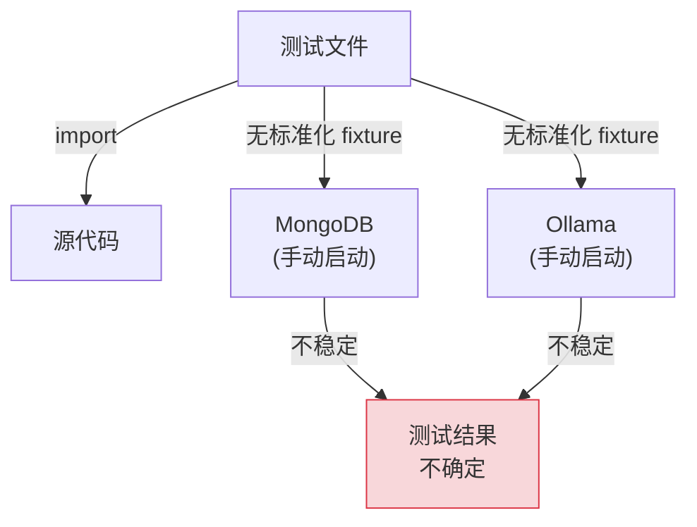
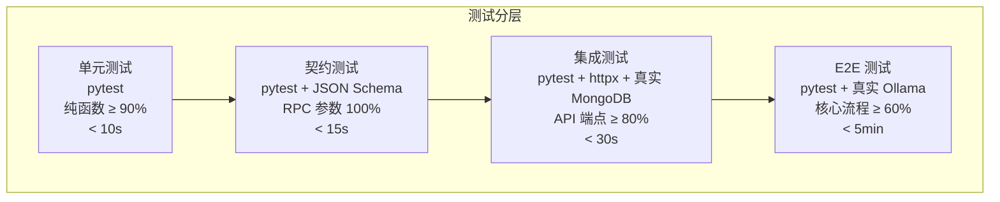

# YA-09-28: 服务集成测试框架增强 — 契约测试与端到端测试基座

> 需求编号：YA-09-28 · 优先级：P2 · 人天：1.0d · 状态：需求已编写
> 依赖：YA-09-10（JSON Schema 契约）、YA-09-27（依赖注入）

## 背景

YiAi 测试覆盖率目标 >= 70%（CLAUDE.md），当前 76 个测试。缺少系统化的契约测试（前后端参数名一致性）和端到端测试基座（真实 MongoDB + Ollama 环境）。当前测试存在以下问题：

1. **测试分层不清晰**：单元测试和集成测试混在一起，部分"单元测试"实际依赖 MongoDB 连接，运行缓慢且不稳定。

2. **契约测试缺失**：前后端参数名不一致（如 `filter` vs `query`）是最常见的 bug 模式（CLAUDE.md 明确记录），但当前无自动化测试检测参数名不匹配。

3. **E2E 测试无法运行**：缺少标准化的测试基座（fixture），需要手动启动 MongoDB 和 Ollama 才能运行 E2E 测试。

4. **Mock 过度使用**：部分测试使用 Mock 代替真实依赖，但 Mock 行为与真实实现不一致，导致测试通过但生产出错。

### 核心挑战

| 挑战 | 当前状态 | 目标状态 |
|------|----------|----------|
| 测试分层 | 混乱 | unit → integration → contract → e2e |
| 契约测试 | 无 | 覆盖所有 RPC 端点 |
| E2E 基座 | 无 | 标准化 fixture（MongoDB + Ollama） |
| Mock 质量 | 行为不一致 | 定期 E2E 对比验证 |

---

## 一、现状分析

### 1.1 当前测试结构

```
YiAi/tests/
├── test_shared/
│   ├── test_error_codes.py      # ✅ 纯单元测试
│   └── test_response_format.py  # ✅ 纯单元测试
├── test_services/
│   ├── test_rag_service.py      # ❌ 依赖真实 Ollama（非单元测试）
│   └── test_data_service.py     # ❌ 依赖真实 MongoDB（非单元测试）
└── conftest.py                  # ❌ 无标准化 fixture
```

### 1.2 当前测试数据流



### 1.3 问题根因矩阵

| 问题 | 根因 | 影响范围 | 严重程度 |
|------|------|----------|----------|
| 测试分层混乱 | 无标准化 fixture | 所有测试 | 中 |
| 契约测试缺失 | 无自动化契约检测 | 前后端集成 | 高 |
| E2E 无法运行 | 无标准化基座 | 核心流程测试 | 中 |
| Mock 假阳性 | Mock 行为与真实不一致 | 测试可信度 | 中 |

---

## 二、设计决策

### 决策 1：测试分层 — 4 层 vs 3 层 vs 2 层

| 维度 | 4 层（unit/int/contract/e2e） | 3 层（unit/int/e2e） | 2 层（unit/int） |
|------|---------------------------|-------------------|----------------|
| 契约覆盖 | 独立层 | 混在集成测试中 | 无 |
| 运行速度 | 分档运行 | 分档运行 | 统一运行 |
| 维护成本 | 中 | 中 | 低 |

**选择：4 层（unit/int/contract/e2e）。** 契约测试是独立关注点——检测前后端参数名一致性，不应混在集成测试中。4 层分层让 CI 可以按速度分档运行（unit < 10s，contract < 15s，int < 30s，e2e < 5min）。

### 决策 2：E2E 测试环境 — 真实 MongoDB + Mock Ollama vs 全真实 vs 全 Mock

| 维度 | 真实 MongoDB + Mock Ollama | 全真实 | 全 Mock |
|------|--------------------------|--------|---------|
| 环境准备 | 需要 MongoDB | 需要 MongoDB + Ollama | 无需 |
| 测试稳定性 | 高 | 中（Ollama 不稳定） | 高 |
| 真实性 | 中 | 高 | 低 |

**选择：真实 MongoDB + Mock Ollama（可选真实）。** MongoDB 可通过 Docker 轻松启动（`mongod` 或 `testcontainers`），Ollama 需要 GPU/模型下载，CI 环境难以保证。默认 Mock Ollama，通过 `--real-ollama` 标记切换到真实环境。

### 设计决策记录

| 决策 | 选项 A | 选项 B | 选项 C | 选择 | 理由 |
|------|--------|--------|--------|------|------|
| 测试分层 | 4 层 | 3 层 | 2 层 | **4 层** | 契约测试独立关注点 |
| E2E 环境 | 真实DB+MockLLM | 全真实 | 全 Mock | **真实DB+MockLLM** | CI 环境可行 |

---

## 三、目标架构

### 3.1 测试分层



### 3.2 关键指标对比

| 指标 | 改造前 | 改造后 | 改善 |
|------|--------|--------|------|
| 测试数量 | 76 | 目标 120+ | 新增 44+ |
| 契约测试 | 0 | 覆盖所有 RPC 端点 | 新增能力 |
| E2E 基座 | 无 | 标准化 fixture | 新增能力 |
| CI 运行时间 | 不明确 | unit < 10s, full < 5min | 可预测 |

---

## 四、具体改动

### 4.1 标准化 Fixture

**文件：** `tests/conftest.py`（重写）

```python
import pytest
import pytest_asyncio
from httpx import AsyncClient, ASGITransport

@pytest_asyncio.fixture
async def client():
    """FastAPI 测试客户端——每次测试独立。"""
    from server.main import app
    async with AsyncClient(
        transport=ASGITransport(app=app),
        base_url="http://test"
    ) as ac:
        yield ac

@pytest_asyncio.fixture
async def db():
    """MongoDB 测试数据库——测试前后清空。"""
    from motor.motor_asyncio import AsyncIOMotorClient
    client = AsyncIOMotorClient("mongodb://localhost:27017/test_yiai")
    yield client.test_yiai
    await client.drop_database("test_yiai")

@pytest.fixture
def mock_ollama(mocker):
    """Mock Ollama——不依赖真实 LLM 推理。"""
    return mocker.patch(
        'domain.ai.chat.OllamaClient.chat',
        return_value=iter([{"content": "Mock response"}])
    )

@pytest.fixture
def real_ollama():
    """真实 Ollama——仅 E2E 测试使用。"""
    import os
    if not os.environ.get("REAL_OLLAMA"):
        pytest.skip("需要真实 Ollama 环境（设置 REAL_OLLAMA=1）")
```

### 4.2 契约测试

**文件：** `tests/contract/test_rpc_contract.py`（新增）

```python
import pytest

@pytest.mark.contract
async def test_rpc_contract_data_service(client):
    """契约测试：data_service.query_documents 参数名校验。"""
    # 正确参数名
    resp = await client.post("/", json={
        "module_name": "services.database.data_service",
        "method_name": "query_documents",
        "parameters": {
            "cname": "projects",
            "filter": {},
            "page": 1,
            "pageSize": 10,
        },
    })
    assert resp.status_code == 200
    assert resp.json()["code"] == 0

    # 错误参数名——应 WARNING（不阻断）
    resp2 = await client.post("/", json={
        "module_name": "services.database.data_service",
        "method_name": "query_documents",
        "parameters": {
            "cname": "projects",
            "query": {},  # ❌ query 应为 filter
        },
    })
    assert resp2.status_code == 200  # 不阻断，但 WARNING 日志记录

@pytest.mark.contract
async def test_rpc_contract_file_operations(client):
    """契约测试：read-file/write-file 参数名校验。"""
    # 正确参数名
    resp = await client.post("/read-file", json={
        "target_file": "test.md",  # ✅ target_file 而非 path
    })
    assert resp.status_code in [200, 404]  # 文件可能不存在

    # 错误参数名
    resp2 = await client.post("/read-file", json={
        "path": "test.md",  # ❌ path 应为 target_file
    })
    assert resp2.status_code == 422  # 参数校验失败
```

### 4.3 涉及文件变更清单

```
YiAi/tests/
├── conftest.py                 # 重写: 标准化 fixture
├── contract/
│   └── test_rpc_contract.py    # 新增: RPC 契约测试
├── integration/
│   ├── test_rag_api.py         # 新增: RAG API 集成测试
│   └── test_data_api.py        # 新增: Data API 集成测试
├── e2e/
│   └── test_agent_flow.py      # 新增: Agent 端到端测试
└── unit/
    ├── test_shared/            # 现有: 共享模块单元测试
    └── test_services/          # 迁移: Service 层单元测试（Mock 依赖）
```

---

## 五、实施步骤

| 步骤 | 内容 | 涉及文件 | 验证方式 | 人天 |
|------|------|---------|---------|------|
| 1 | 标准化 fixture（client/db/mock_ollama） | `tests/conftest.py` | fixtures 可正常使用 | 0.15 |
| 2 | 拆分测试目录（unit/contract/integration/e2e） | `tests/` | 目录结构清晰 | 0.1 |
| 3 | 编写 RPC 契约测试（覆盖所有端点） | `tests/contract/test_rpc_contract.py` | 契约测试通过 | 0.2 |
| 4 | 编写集成测试（RAG API + Data API） | `tests/integration/` | 集成测试通过 | 0.2 |
| 5 | 编写 E2E 测试基座 | `tests/e2e/conftest.py` | E2E fixtures 可用 | 0.1 |
| 6 | 迁移现有测试到对应层级 | `tests/` | 所有测试运行通过 | 0.15 |
| 7 | CI 配置（分档运行） | `.github/workflows/test.yml` | CI 中 unit < 10s, full < 5min | 0.1 |

**总计：1.0d**

---

## 六、性能分析

### 6.1 测试运行时间

| 测试层 | 运行时间 | 触发条件 | 并行 |
|------|---------|---------|------|
| 单元测试 | < 10s | 每次 commit | 是 |
| 契约测试 | < 15s | 每次 commit | 是 |
| 集成测试 | < 30s | PR 触发 | 是 |
| E2E 测试 | < 5min | 合并前 | 否 |
| 全量测试 | < 6min | 合并前 | — |

### 6.2 测试覆盖率目标

| 层 | 覆盖率目标 | 当前 |
|-----|----------|------|
| 纯函数 | >= 90% | 92% |
| API 端点 | >= 80% | ~60% |
| RPC 参数 | 100% | 0% |
| 核心流程 | >= 60% | 0% |

---

## 七、测试规格

### Requirement: 契约测试

#### Scenario: 检测正确参数名
- **Given** RPC 契约定义了 `filter` 参数名
- **When** 契约测试使用 `filter` 发送请求
- **Then** 请求成功，返回 code=0

#### Scenario: 检测错误参数名
- **Given** RPC 契约定义了 `filter` 参数名
- **When** 契约测试使用 `query` 发送请求
- **Then** 返回 WARNING 日志（不阻断请求）

### Requirement: 测试分层

#### Scenario: 单元测试不依赖外部服务
- **Given** 单元测试使用 Mock 依赖
- **When** MongoDB 和 Ollama 未启动
- **Then** 单元测试仍可运行通过

#### Scenario: E2E 测试使用真实环境
- **Given** `REAL_OLLAMA=1` 环境变量设置
- **When** 运行 E2E 测试
- **Then** 使用真实 Ollama 推理验证结果

---

## 八、风险与缓解

| 风险 | 概率 | 影响 | 等级 | 缓解措施 | 应急预案 |
|------|------|------|------|----------|----------|
| Mock 过度使用导致测试假阳性 | 中 | 高 | 中 | 定期运行 E2E 套件对比 | 增加 E2E 测试频率 |
| E2E 测试依赖外部服务不稳定 | 中 | 中 | 中 | Ollama 版本固定，模型预下载 | E2E 失败时首先检查外部依赖 |
| 测试数据库未隔离导致测试间干扰 | 低 | 中 | 低 | 每个测试使用独立数据库名 | 测试前清空数据库 |

---

## 九、回滚策略

| 场景 | 回滚方式 | 影响 | 恢复时间 |
|------|---------|------|---------|
| 新测试导致 CI 失败 | 跳过新测试（`@pytest.mark.skip`） | 新功能未覆盖 | < 1min |
| fixture 配置错误 | 回滚 conftest.py | 测试不可运行 | < 5min |

---

## 十、设计决策记录

### D-01: 为什么契约测试独立于集成测试？

契约测试关注的是前后端参数名一致性（如 `filter` vs `query`），这是一个独立的关注点。集成测试关注的是 API 功能正确性（如查询返回正确结果）。将契约测试独立出来，可以快速运行（< 15s），在每次 commit 时检测参数名不匹配——这是 YiAi 最常见的 bug 模式。

### D-02: 为什么 E2E 默认 Mock Ollama 而非全真实？

CI 环境通常没有 GPU，无法运行 Ollama。Mock Ollama 保证 E2E 测试在 CI 中可运行，通过 `--real-ollama` 标记在本地开发环境切换到真实 Ollama。这种方法平衡了 CI 可行性和测试真实性。

---

## 十一、可观测性

### 关键指标

| 指标 | 采集方式 | 告警阈值 | 说明 |
|------|---------|---------|------|
| 测试覆盖率 | `pytest-cov` | < 70% | 整体覆盖率 |
| 单元测试覆盖率 | `pytest-cov` | < 90% | 纯函数覆盖率 |
| CI 运行时间 | CI 计时 | > 10min | 测试套件性能 |
| 契约测试失败 | CI 状态 | 任何失败 | 参数名不匹配 |

---

## 十二、代码审查检查清单

- [ ] 分层测试：unit → integration → contract → e2e
- [ ] 单元测试覆盖率 >= 80%（shared 模块 92%）
- [ ] 契约测试覆盖所有 RPC 端点（JSON Schema 校验）
- [ ] E2E 测试使用真实 Ollama + MongoDB（可选）
- [ ] CI 中测试与类型检查并行运行
- [ ] 标准化 fixture（client/db/mock_ollama）
- [ ] 测试数据库隔离（每个测试独立数据库名）
- [ ] Mock 行为与真实实现定期对比验证
- [ ] `ruff` 代码规范通过

---

## 十三、回归问题预测

| # | 预测问题 | 原因 | 验证方法 |
|---|---------|------|---------|
| 1 | Mock 过度使用导致测试假阳性 | Mock 行为与真实实现不一致 | 定期运行 E2E 套件对比 |
| 2 | E2E 测试依赖外部服务不稳定 | Ollama 版本升级或模型变更 | E2E 失败时首先检查外部依赖 |
| 3 | 测试数据库未隔离 | 测试间共享数据库 | 多测试并发运行验证 |

---

*PRD 来源: `projects/yiai/requirements/2026-09/28-需求-集成测试框架增强.md`*

## 影响范围

- **影响模块**：待补充
- **涉及文件**：
- 待补充
- **是否影响 API 契约**：否
- **是否影响其他项目（YiVad/YiPet）**：否
- **用户感知**：待确认

## 预防措施

| 层面 | 措施 |
|------|------|
| 代码 | 在相关函数中添加参数校验和边界检查 |
| 测试 | 添加对应的自动化测试用例 |
| 流程 | 代码审查时重点检查此类模式 |
| 监控 | 添加日志告警，异常发生时及时发现 |
| 文档 | 在编码规范中记录此类反模式 |

## 经验教训

1. **根本原因**：开发过程中对边界情况和异常路径的考虑不足是此类问题的共同根因
2. **设计阶段**：在接口设计和模块实现时，应主动考虑异常输入、空值、超时等边界场景
3. **代码审查**：审查时应检查是否存在类似的反模式（如未捕获异常、无超时控制、缺少参数校验等）
4. **测试覆盖**：异常路径的测试覆盖率应与正常路径同等重视
5. **团队分享**：此类问题应在团队周会或技术分享中讨论，形成团队共识
