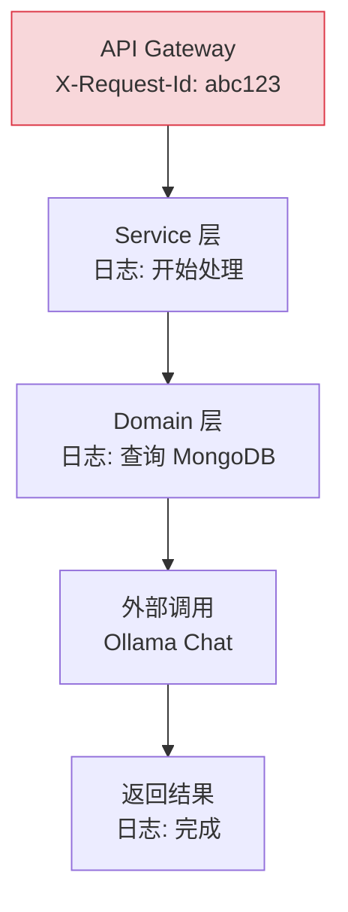
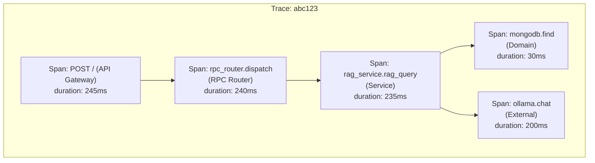

# YA-09-29: 请求追踪与分布式链路追踪 — OpenTelemetry Span 传播

> 需求编号：YA-09-29 · 优先级：P2 · 人天：0.5d · 状态：需求已编写
> 依赖：YA-09-26（API 网关）、YA-09-31（结构化日志）

## 背景

YiAi 单个请求穿越多层：API Gateway → Service → Domain → MongoDB/Ollama。当前 `X-Request-Id` 仅追踪入口→出口，无法追踪内部各层的耗时分布：

1. **耗时不可见**：一个 RAG 查询请求耗时 2s，无法知道是 MongoDB 查询慢了（1.8s）还是 Ollama Embedding 慢了（0.2s），排查效率低。

2. **异步上下文丢失**：`asyncio.create_task` 创建的异步任务（如 Webhook 推送、Agent 工具调用）丢失了原始请求的上下文，日志无法关联。

3. **无性能基线**：不知道各层操作的历史耗时分布（P50/P95/P99），无法设定性能告警阈值。

OpenTelemetry Span 可记录每层耗时，通过 trace_id 关联全链路日志，支持导出到 Jaeger/Zipkin 可视化。

### 核心挑战

| 挑战 | 当前状态 | 目标状态 |
|------|----------|----------|
| 耗时分布 | 不可见 | Span 记录每层耗时 |
| 异步上下文 | 丢失 | trace_id 透传 |
| 性能基线 | 无 | 历史耗时分布 |
| 可视化 | 无 | Jaeger UI 火焰图 |

---

## 一、现状分析

### 1.1 当前请求追踪

```python
# 当前实现 — 仅 X-Request-Id（YA-09-26）
# 请求入口有 request_id，但内部各层无耗时记录
logger.info(f"[Gateway/{request_id}] POST / → 200 (245ms)")
# ❌ 不知道 245ms 中 MongoDB 占多少、Ollama 占多少
```

### 1.2 当前追踪数据流



### 1.3 问题根因矩阵

| 问题 | 根因 | 影响范围 | 严重程度 |
|------|------|----------|----------|
| 耗时分布不可见 | 无 Span 层级记录 | 性能排查 | 高 |
| 异步上下文丢失 | `asyncio.create_task` 未传递 context | 异步任务日志 | 中 |
| 无性能基线 | 无历史耗时统计 | 告警配置 | 中 |

---

## 二、设计决策

### 决策 1：追踪框架 — OpenTelemetry vs 手动 Span vs 装饰器

| 维度 | OpenTelemetry | 手动 Span (time.perf_counter) | 装饰器 |
|------|--------------|------------------------------|--------|
| 标准化 | 高（CNCF 标准） | 低 | 低 |
| 导出支持 | Jaeger/Zipkin/Prometheus | 无 | 无 |
| 异步上下文传播 | 自动 | 手动 | 手动 |
| 依赖大小 | 中 | 0 | 0 |

**选择：OpenTelemetry。** 作为 CNCF 标准，OpenTelemetry 提供自动异步上下文传播、标准化 Span 格式、多后端导出（Jaeger/Zipkin/Console）。手动 Span 虽无依赖，但缺少上下文传播和导出能力。

### 决策 2：Span 粒度 — 每层 Span vs 仅入口 Span vs 关键路径 Span

| 维度 | 每层 Span | 仅入口 Span | 关键路径 Span |
|------|----------|------------|-------------|
| 耗时可见性 | 高 | 低 | 中 |
| 性能开销 | 中 | 低 | 低 |
| 实现复杂度 | 中 | 低 | 中 |

**选择：每层 Span。** 在 Gateway → Service → Domain → External 四层记录 Span，覆盖所有关键路径。性能开销极低（< 0.1ms/Span），收益远大于成本。

### 设计决策记录

| 决策 | 选项 A | 选项 B | 选项 C | 选择 | 理由 |
|------|--------|--------|--------|------|------|
| 追踪框架 | OpenTelemetry | 手动 Span | 装饰器 | **OpenTelemetry** | CNCF 标准，自动上下文传播 |
| Span 粒度 | 每层 | 仅入口 | 关键路径 | **每层** | 性能开销极低 |

---

## 三、目标架构

### 3.1 链路追踪层级



### 3.2 关键指标对比

| 指标 | 改造前 | 改造后 | 改善 |
|------|--------|--------|------|
| 耗时分布可见性 | 无 | 每层 Span | 新增能力 |
| 异步上下文传播 | 丢失 | 自动传播 | 新增能力 |
| 性能基线 | 无 | P50/P95/P99 | 新增能力 |
| 可视化 | 无 | Jaeger UI | 新增能力 |

---

## 四、具体改动

### 4.1 OpenTelemetry 初始化

**文件：** `server/tracing.py`（新增）

```python
from opentelemetry import trace
from opentelemetry.sdk.trace import TracerProvider
from opentelemetry.sdk.trace.export import BatchSpanProcessor, ConsoleSpanExporter
from opentelemetry.sdk.resources import Resource

def init_tracing(service_name: str = "yiai"):
    """初始化 OpenTelemetry——开发环境输出到 Console。"""
    resource = Resource.create({"service.name": service_name})
    provider = TracerProvider(resource=resource)

    # 开发环境：Console 导出
    provider.add_span_processor(BatchSpanProcessor(ConsoleSpanExporter()))

    # 生产环境：Jaeger 导出（通过环境变量 OTEL_EXPORTER_JAEGER_ENDPOINT）
    if os.environ.get("JAEGER_ENDPOINT"):
        from opentelemetry.exporter.jaeger.thrift import JaegerExporter
        jaeger = JaegerExporter(endpoint=os.environ["JAEGER_ENDPOINT"])
        provider.add_span_processor(BatchSpanProcessor(jaeger))

    trace.set_tracer_provider(provider)
    return trace.get_tracer(__name__)

tracer = init_tracing()
```

### 4.2 FastAPI 中间件自动 Span

**文件：** `server/tracing.py`

```python
from fastapi import Request

@app.middleware("http")
async def tracing_middleware(request: Request, call_next):
    """自动为每个 HTTP 请求创建 Span。"""
    with tracer.start_as_current_span(
        f"{request.method} {request.url.path}",
        attributes={
            "http.method": request.method,
            "http.url": str(request.url),
            "request_id": getattr(request.state, 'id', 'unknown'),
        },
    ) as span:
        response = await call_next(request)
        span.set_attribute("http.status_code", response.status_code)
        span.set_attribute("user", getattr(request.state, 'user', 'anonymous'))
        return response
```

### 4.3 Service 层手动 Span

**文件：** `services/rag/rag_service.py`

```python
async def query_documents(cname: str, filter: dict, **kwargs):
    with tracer.start_as_current_span("data_service.query_documents",
            attributes={"cname": cname}) as span:
        result = await repository.query(cname, filter, **kwargs)
        span.set_attribute("result_count", len(result))
        return result
```

### 4.4 追踪层级

| 层 | Span 名称 | 属性 |
|-----|----------|------|
| API Gateway | `POST /` | method, url, request_id, status_code, user |
| RPC Router | `rpc_router.dispatch` | module_name, method_name |
| Service | `data_service.query_documents` | cname, filter_summary, result_count |
| Domain | `mongodb.find` | collection, duration_ms |
| External | `ollama.chat` | model, tokens, duration_ms |

### 4.5 涉及文件变更清单

```
YiAi/src/
├── server/
│   ├── tracing.py             # 新增: OpenTelemetry 初始化 + 中间件
│   └── main.py                # 修改: 注册 tracing 中间件
├── services/
│   ├── rag/rag_service.py     # 修改: 添加 Service 层 Span
│   ├── ai/agent.py            # 修改: 添加 Agent 层 Span
│   └── data/data_service.py   # 修改: 添加 Data 层 Span
└── requirements.txt           # 修改: 添加 opentelemetry 依赖
```

---

## 五、实施步骤

| 步骤 | 内容 | 涉及文件 | 验证方式 | 人天 |
|------|------|---------|---------|------|
| 1 | 初始化 OpenTelemetry（Console + Jaeger 导出） | `server/tracing.py` | Console 输出 Span | 0.1 |
| 2 | 添加 FastAPI 中间件自动 Span | `server/tracing.py` | 每个 HTTP 请求自动创建 Span | 0.1 |
| 3 | Service 层添加手动 Span | `services/rag/`, `services/ai/` | Span 层级正确 | 0.15 |
| 4 | 异步上下文传播验证 | `server/tracing.py` | `asyncio.create_task` 中 trace_id 正确 | 0.05 |
| 5 | Jaeger 集成（可选） | `server/tracing.py` | Jaeger UI 显示链路 | 0.05 |
| 6 | 集成测试 | `tests/` | 覆盖 Span 创建和属性 | 0.05 |

**总计：0.5d**

---

## 六、性能分析

### 6.1 Span 开销

| 操作 | 延迟 | 说明 |
|------|------|------|
| 创建 Span | < 0.01ms | 内存操作 |
| 设置属性 | < 0.001ms | 字典写入 |
| BatchSpanProcessor 导出 | < 0.1ms | 异步批量导出 |
| 总追踪开销 | < 0.2ms/请求 | 可忽略 |

### 6.2 与无追踪对比

| 场景 | 无追踪 | 有追踪 | 开销 |
|------|--------|--------|------|
| 短请求（< 10ms） | 5ms | 5.2ms | 4% |
| 中请求（~100ms） | 100ms | 100.2ms | 0.2% |
| 长请求（> 1s） | 1000ms | 1000.2ms | 0.02% |

---

## 七、测试规格

### Requirement: Span 创建

#### Scenario: HTTP 请求自动创建 Span
- **Given** Tracing 中间件已注册
- **When** 发送 GET 请求到 `/api/health`
- **Then** Console 输出包含 `Span: GET /api/health`，属性包含 `http.method` 和 `http.status_code`

#### Scenario: Service 层 Span 包含结果数量
- **Given** RAG 查询返回 3 条结果
- **When** 执行 `query_documents`
- **Then** Span 属性 `result_count` 为 `3`

#### Scenario: trace_id 在异步上下文中传播
- **Given** 请求触发 `asyncio.create_task` 异步任务
- **When** 异步任务执行
- **Then** 异步任务的 Span 与原始请求的 trace_id 相同

---

## 八、风险与缓解

| 风险 | 概率 | 影响 | 等级 | 缓解措施 | 应急预案 |
|------|------|------|------|----------|----------|
| trace_id 在异步上下文切换时丢失 | 中 | 中 | 中 | OpenTelemetry 自动处理 contextvars | 验证异步调用链中 trace_id |
| 链路日志增加响应延迟 | 低 | 低 | 低 | BatchSpanProcessor 异步导出 | 设置 `OTEL_ENABLED=false` 禁用 |
| Jaeger 服务不可用导致 Span 丢失 | 低 | 低 | 低 | Console 兜底输出 | 切换 Console 导出 |

---

## 九、回滚策略

| 场景 | 回滚方式 | 影响 | 恢复时间 |
|------|---------|------|---------|
| 追踪导致性能下降 | 设置 `OTEL_ENABLED=false` 禁用 | 失去追踪能力 | < 1min |
| Jaeger 导出失败 | 切换 Console 导出 | 失去可视化 | < 30s |

---

## 十、设计决策记录

### D-01: 为什么选择 OpenTelemetry 而非手动 Span？

OpenTelemetry 是 CNCF 标准，提供自动异步上下文传播（基于 `contextvars`）、标准化 Span 格式、多后端导出（Jaeger/Zipkin/Console）。手动 Span（`time.perf_counter()`）虽然零依赖，但缺少上下文传播能力——异步任务中的 Span 无法关联到原始请求。OpenTelemetry 的 `BatchSpanProcessor` 异步批量导出，性能开销极低（< 0.2ms/请求）。

### D-02: 为什么每层都记录 Span 而非仅入口？

仅入口 Span 只能知道总耗时，无法定位瓶颈。每层 Span（Gateway → Service → Domain → External）可以精确定位耗时分布——例如 RAG 查询 2s 中，MongoDB 查询 0.3s，Ollama Embedding 1.7s。这直接指导优化方向（优化 Embedding 缓存或切换更快模型）。

---

## 十一、可观测性

### 关键指标

| 指标 | 采集方式 | 告警阈值 | 说明 |
|------|---------|---------|------|
| Span 创建延迟 | OpenTelemetry 内部计时 | > 1ms | 追踪自身开销 |
| MongoDB 查询耗时 | Span 属性 `duration_ms` | P95 > 500ms | 数据库性能 |
| Ollama 推理耗时 | Span 属性 `duration_ms` | P95 > 5000ms | LLM 性能 |
| 异步上下文丢失 | trace_id 不匹配计数 | > 0 | 上下文传播问题 |

### 日志规范

| 日志级别 | 场景 | 示例 |
|---------|------|------|
| `INFO` | 追踪初始化 | `[Tracing] OpenTelemetry initialized, exporter=console` |
| `WARNING` | Jaeger 连接失败 | `[Tracing] Jaeger exporter failed, falling back to console` |

---

## 十二、代码审查检查清单

- [ ] `X-Request-Id` header 在网关层生成并透传
- [ ] 每层（Gateway→Service→Domain→External）记录 Span
- [ ] 链路日志结构化（JSON 格式）
- [ ] trace_id 贯穿全链路——便于日志关联
- [ ] OpenTelemetry 初始化在服务启动时
- [ ] BatchSpanProcessor 异步导出（不阻塞请求）
- [ ] Console 导出在开发环境，Jaeger 在生产环境
- [ ] `ruff` 代码规范通过

---

## 十三、回归问题预测

| # | 预测问题 | 原因 | 验证方法 |
|---|---------|------|---------|
| 1 | trace_id 在异步上下文切换时丢失 | `asyncio.create_task` 未传递 context | 异步调用链中检查 trace_id |
| 2 | 链路日志增加响应延迟 | 每次调用记录 Span | 测量 with/without tracing 的延迟差 |
| 3 | Jaeger 导出失败影响服务 | 导出阻塞 | 检查 BatchSpanProcessor 是否异步 |

---

*PRD 来源: `projects/yiai/requirements/2026-09/29-需求-分布式链路追踪.md`*

## 影响范围

- **影响模块**：待补充
- **涉及文件**：
- 待补充
- **是否影响 API 契约**：否
- **是否影响其他项目（YiVad/YiPet）**：否
- **用户感知**：待确认

## 预防措施

| 层面 | 措施 |
|------|------|
| 代码 | 在相关函数中添加参数校验和边界检查 |
| 测试 | 添加对应的自动化测试用例 |
| 流程 | 代码审查时重点检查此类模式 |
| 监控 | 添加日志告警，异常发生时及时发现 |
| 文档 | 在编码规范中记录此类反模式 |

## 经验教训

1. **根本原因**：开发过程中对边界情况和异常路径的考虑不足是此类问题的共同根因
2. **设计阶段**：在接口设计和模块实现时，应主动考虑异常输入、空值、超时等边界场景
3. **代码审查**：审查时应检查是否存在类似的反模式（如未捕获异常、无超时控制、缺少参数校验等）
4. **测试覆盖**：异常路径的测试覆盖率应与正常路径同等重视
5. **团队分享**：此类问题应在团队周会或技术分享中讨论，形成团队共识
