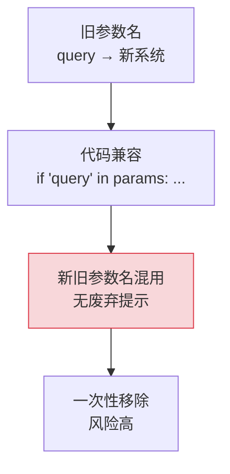
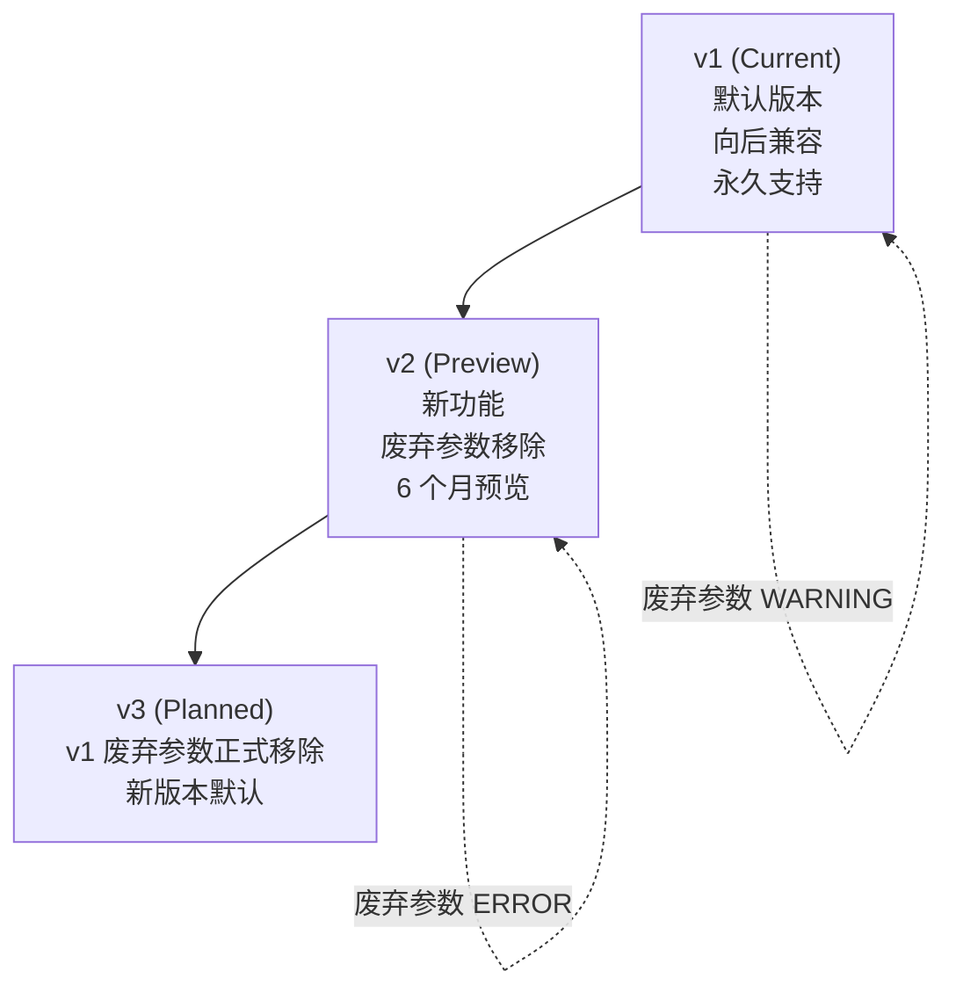

# YA-09-30: API 版本管理策略 — 向后兼容协议

> 需求编号：YA-09-30 · 优先级：P2 · 人天：0.5d · 状态：需求已编写
> 依赖：YA-09-04（RPC 协议规范）、YA-09-10（JSON Schema 契约）

## 背景

YiAi RPC 信封协议当前无版本标识——前端和后端部署不同步时可能因接口不兼容导致运行时错误。YA-09-04 的 WARNING 日志和 YA-09-10 的 JSON Schema 契约可检测参数名不匹配，但缺少系统化的 API 版本管理：

1. **部署不同步风险**：前端 YiVad 已升级到 v2 参数格式（使用 `filter` 而非 `query`），但后端 YiAi 尚未部署，导致前端请求参数被后端静默忽略。

2. **废弃参数无迁移路径**：`query` → `filter`、`collection_name` → `cname`、`path` → `target_file` 等参数重命名缺乏系统化的废弃→移除流程，新旧参数名长期共存。

3. **破坏性变更无缓冲期**：当需要移除废弃参数时，无法区分哪些前端版本仍在使用旧参数，只能一次性移除，风险高。

4. **版本协商缺失**：前端无法声明自己期望的 API 版本，后端无法根据版本提供不同行为。

### 核心挑战

| 挑战 | 当前状态 | 目标状态 |
|------|----------|----------|
| 版本标识 | 无 | RPC 信封 `version` 字段 |
| 废弃参数管理 | 无 | `DeprecatedParam` 声明式管理 |
| 破坏性变更 | 一次性移除 | 版本化渐进废弃 |
| 版本协商 | 无 | 前端声明版本，后端适配 |

---

## 一、现状分析

### 1.1 当前 RPC 信封

```python
# 当前 RPC 信封——无版本字段
POST / body: {
    "module_name": "services.database.data_service",
    "method_name": "query_documents",
    "parameters": {
        "cname": "projects",
        "filter": {},  # ✅ 正确参数名
        # "query": {},  # ❌ 废弃参数名——无提示
    }
}
```

### 1.2 当前参数演进



### 1.3 问题根因矩阵

| 问题 | 根因 | 影响范围 | 严重程度 |
|------|------|----------|----------|
| 部署不同步 | 无版本协商 | 前后端集成 | 高 |
| 废弃参数无提示 | 无声明式管理 | API 演进 | 中 |
| 破坏性变更无缓冲 | 无版本化流程 | 前端兼容性 | 中 |

---

## 二、设计决策

### 决策 1：版本控制方式 — RPC 信封 version 字段 vs URL 路径 vs Header

| 维度 | RPC 信封 version 字段 | URL 路径 `/v1/` | Header `X-API-Version` |
|------|---------------------|----------------|----------------------|
| 与 RPC 协议一致性 | 高 | 低 | 中 |
| 网关路由 | 不影响 | 需要路由重写 | 不影响 |
| 实现复杂度 | 低 | 中 | 低 |

**选择：RPC 信封 version 字段。** 与 YiAi 的 RPC 协议一致，不改变 URL 结构，不影响网关路由。`version` 字段可选，默认 `v1`。

### 决策 2：废弃参数处理 — Deprecation Warning vs 直接拒绝 vs 兼容过渡

| 维度 | Deprecation Warning | 直接拒绝 | 兼容过渡 |
|------|--------------------|---------|---------|
| 前端影响 | 无（仅日志） | 前端报错 | 无 |
| 迁移推动力 | 低 | 高 | 低 |
| 安全 | 中 | 高 | 低 |

**选择：v1 兼容 + Warning，v2 拒绝。** v1 作为默认版本保持向后兼容，使用废弃参数时发出 WARNING 日志。v2 拒绝废弃参数，推动前端迁移。

### 设计决策记录

| 决策 | 选项 A | 选项 B | 选项 C | 选择 | 理由 |
|------|--------|--------|--------|------|------|
| 版本控制 | RPC 信封 | URL 路径 | Header | **RPC 信封** | 与协议一致 |
| 废弃处理 | Warning | 直接拒绝 | 兼容过渡 | **v1 兼容, v2 拒绝** | 渐进迁移 |

---

## 三、目标架构

### 3.1 版本生命周期



### 3.2 关键指标对比

| 指标 | 改造前 | 改造后 | 改善 |
|------|--------|--------|------|
| 版本标识 | 无 | RPC 信封 version 字段 | 新增能力 |
| 废弃参数管理 | 无 | DeprecatedParam 声明式 | 新增能力 |
| 破坏性变更 | 一次性 | 版本化渐进 | 降低风险 |
| 版本协商 | 无 | 前端声明版本 | 新增能力 |

---

## 四、具体改动

### 4.1 RPC 版本路由

**文件：** `server/rpc_router.py`（修改）

```python
from enum import Enum

class ApiVersion(str, Enum):
    V1 = "v1"
    V2 = "v2"

# RPC 信封新增 version 字段（可选——默认 v1）
# POST / body: { module_name, method_name, parameters, version?: "v1"|"v2" }

RPC_VERSION_HANDLERS = {
    "v1": {
        "services.database.data_service.query_documents": query_documents_v1,
    },
    "v2": {
        "services.database.data_service.query_documents": query_documents_v2,
    },
}

async def route_rpc(request: dict):
    version = request.get("version", "v1")
    key = f"{request['module_name']}.{request['method_name']}"

    # 查找精确版本匹配
    handler = RPC_VERSION_HANDLERS.get(version, {}).get(key)
    if not handler:
        # 回退到 v1（默认版本）
        handler = RPC_VERSION_HANDLERS.get("v1", {}).get(key)
        if handler:
            logger.warning(f"[API] 版本 {version} 无 {key} 的 handler，回退到 v1")

    if not handler:
        raise RpcMethodNotFoundError(key)

    return await handler(request["parameters"])
```

### 4.2 废弃参数管理

**文件：** `server/rpc_router.py`

```python
@dataclass
class DeprecatedParam:
    name: str
    since_version: str     # 废弃版本
    removal_version: str   # 计划移除版本
    replacement: str       # 替代参数

DEPRECATED_PARAMS = [
    DeprecatedParam("query", "v1", "v3", "filter"),
    DeprecatedParam("collection_name", "v1", "v3", "cname"),
    DeprecatedParam("path", "v1", "v2", "target_file"),
]

# v1 handler——向后兼容（接受废弃参数，发出 Deprecation Warning）
async def query_documents_v1(params: dict):
    for dep in DEPRECATED_PARAMS:
        if dep.name in params and dep.since_version == "v1":
            logger.warning(
                f"[API] 废弃参数 '{dep.name}' 请改用 '{dep.replacement}'"
                f"——将在 {dep.removal_version} 移除"
            )
            # 自动转换——确保兼容
            if dep.name == "query" and "filter" not in params:
                params["filter"] = params.pop("query")
            elif dep.name == "collection_name" and "cname" not in params:
                params["cname"] = params.pop("collection_name")
    return await _query_documents(params)

# v2 handler——严格模式（拒绝废弃参数）
async def query_documents_v2(params: dict):
    for dep in DEPRECATED_PARAMS:
        if dep.name in params and dep.removal_version <= "v2":
            raise InvalidParameterError(
                f"'{dep.name}' 已在 v2 中移除，请使用 '{dep.replacement}'"
            )
    return await _query_documents(params)
```

### 4.3 涉及文件变更清单

```
YiAi/src/
├── server/
│   └── rpc_router.py          # 修改: 添加 version 路由 + 废弃参数管理
├── shared/
│   └── api_version.py         # 新增: ApiVersion 枚举 + DeprecatedParam 数据类
└── tests/
    └── test_api_version.py    # 新增: API 版本测试
```

---

## 五、实施步骤

| 步骤 | 内容 | 涉及文件 | 验证方式 | 人天 |
|------|------|---------|---------|------|
| 1 | 定义 `ApiVersion` 枚举 + `DeprecatedParam` 数据类 | `shared/api_version.py` | 枚举值可序列化 | 0.05 |
| 2 | 实现版本路由（`route_rpc` 支持 version 字段） | `server/rpc_router.py` | v1/v2 请求正确路由 | 0.15 |
| 3 | 实现 v1 废弃参数兼容（自动转换 + WARNING） | `server/rpc_router.py` | 废弃参数自动转换为新参数 | 0.1 |
| 4 | 实现 v2 严格模式（拒绝废弃参数） | `server/rpc_router.py` | v2 请求废弃参数返回错误 | 0.05 |
| 5 | 注册 `DEPRECATED_PARAMS` 列表 | `server/rpc_router.py` | 所有已知废弃参数在列表中 | 0.05 |
| 6 | 集成测试 | `tests/` | 覆盖 v1/v2/版本回退 | 0.1 |

**总计：0.5d**

---

## 六、性能分析

### 6.1 版本路由开销

| 操作 | 延迟 | 说明 |
|------|------|------|
| version 字段读取 | < 0.001ms | 字典查找 |
| 废弃参数检查 | < 0.01ms | 遍历 DEPRECATED_PARAMS（< 10 条） |
| Handler 查找 | < 0.001ms | 字典查找 |
| 总版本路由开销 | < 0.02ms | 可忽略 |

---

## 七、测试规格

### Requirement: 版本路由

#### Scenario: 默认版本 v1
- **Given** RPC 请求不包含 `version` 字段
- **When** 调用 `route_rpc`
- **Then** 使用 v1 handler 处理请求

#### Scenario: 指定版本 v2
- **Given** RPC 请求包含 `version: "v2"`
- **When** 调用 `route_rpc`
- **Then** 使用 v2 handler 处理请求

#### Scenario: 未知版本回退 v1
- **Given** RPC 请求包含 `version: "v99"`（不存在的版本）
- **When** 调用 `route_rpc`
- **Then** 回退到 v1 handler，日志记录 WARNING

### Requirement: 废弃参数处理

#### Scenario: v1 接受废弃参数并自动转换
- **Given** v1 请求使用 `query` 参数
- **When** 调用 `query_documents_v1`
- **Then** `query` 自动转换为 `filter`，日志记录 WARNING

#### Scenario: v2 拒绝废弃参数
- **Given** v2 请求使用 `query` 参数
- **When** 调用 `query_documents_v2`
- **Then** 抛出 `InvalidParameterError`

---

## 八、风险与缓解

| 风险 | 概率 | 影响 | 等级 | 缓解措施 | 应急预案 |
|------|------|------|------|----------|----------|
| 版本回退逻辑导致意外行为 | 低 | 中 | 低 | 回退仅到 v1，日志记录 | 修复版本路由 |
| 废弃参数列表不完整 | 中 | 低 | 低 | 定期审查参数使用情况 | 补充废弃参数声明 |
| v2 拒绝导致前端报错 | 中 | 中 | 中 | v2 预览期 6 个月 | 前端升级后切换 v2 |

---

## 九、回滚策略

| 场景 | 回滚方式 | 影响 | 恢复时间 |
|------|---------|------|---------|
| v2 导致前端大量报错 | 前端切换回 `version: "v1"` | v1 兼容 | < 1min |
| 版本路由错误 | 回滚 `rpc_router.py` | 无版本支持 | < 5min |

---

## 十、设计决策记录

### D-01: 为什么选择 RPC 信封 version 字段而非 URL 路径？

YiAi 的所有 API 调用都通过统一的 RPC 信封（`POST /`），URL 路径版本化（如 `/v1/`、`/v2/`）会破坏这一统一入口。RPC 信封的 `version` 字段与协议一致，前端只需在请求 body 中添加一个字段即可切换版本。

### D-02: 为什么 v1 永久支持而非设定期限？

v1 是默认版本，所有未声明版本的前端都使用 v1。强制移除 v1 会导致所有旧前端版本不可用。v1 保持向后兼容，新功能通过 v2+ 版本提供，旧版本前端可以继续使用 v1 而不受影响。

---

## 十一、可观测性

### 关键指标

| 指标 | 采集方式 | 告警阈值 | 说明 |
|------|---------|---------|------|
| v1 废弃参数使用次数 | 日志计数 | > 100/min | 推动前端迁移 |
| v2 请求比例 | version 字段统计 | — | 版本迁移进度 |
| 版本回退次数 | 回退 v1 日志计数 | > 0 | 版本路由配置问题 |

---

## 十二、代码审查检查清单

- [ ] RPC 信封支持 `version` 字段（可选，默认 `v1`）
- [ ] 废弃参数通过 `DeprecatedParam` 声明式管理
- [ ] v1 接受废弃参数并自动转换（WARNING 日志）
- [ ] v2 拒绝废弃参数（返回错误）
- [ ] 未知版本回退到 v1（WARNING 日志）
- [ ] 废弃参数列表包含所有已知参数重命名
- [ ] `ruff` 代码规范通过

---

## 十三、回归问题预测

| # | 预测问题 | 原因 | 验证方法 |
|---|---------|------|---------|
| 1 | v1 自动转换逻辑与预期不符 | 参数重命名映射错误 | 契约测试覆盖所有已知参数重命名 |
| 2 | v2 拒绝导致前端功能异常 | 前端未适配 v2 | 前端升级 v2 后回归测试 |
| 3 | 版本回退导致意外行为 | 回退逻辑与直接 v1 行为不一致 | 版本回退测试 |

---

*PRD 来源: `projects/yiai/requirements/2026-09/30-需求-API版本管理.md`*

## 影响范围

- **影响模块**：待补充
- **涉及文件**：
- `rpc_router.py`
- **是否影响 API 契约**：否
- **是否影响其他项目（YiVad/YiPet）**：否
- **用户感知**：待确认

## 预防措施

| 层面 | 措施 |
|------|------|
| 代码 | 在相关函数中添加参数校验和边界检查 |
| 测试 | 为 `rpc_router.py` 添加单元测试 |
| 流程 | 代码审查时重点检查此类模式 |
| 监控 | 添加日志告警，异常发生时及时发现 |
| 文档 | 在编码规范中记录此类反模式 |

## 经验教训

1. **根本原因**：开发过程中对边界情况和异常路径的考虑不足是此类问题的共同根因
2. **设计阶段**：在接口设计和模块实现时，应主动考虑异常输入、空值、超时等边界场景
3. **代码审查**：审查时应检查是否存在类似的反模式（如未捕获异常、无超时控制、缺少参数校验等）
4. **测试覆盖**：异常路径的测试覆盖率应与正常路径同等重视
5. **团队分享**：此类问题应在团队周会或技术分享中讨论，形成团队共识
