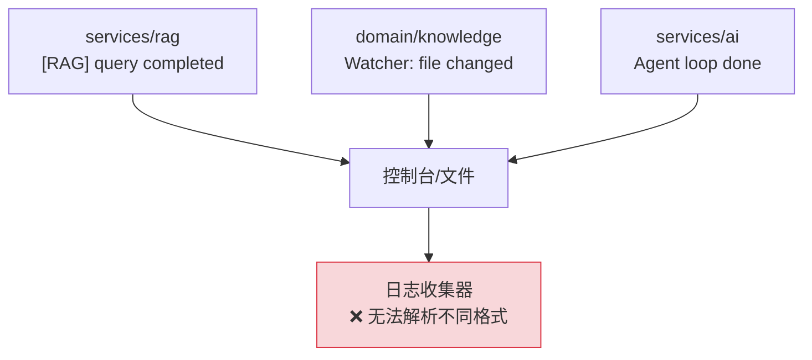

# YA-09-31: 服务日志聚合与结构化 — 统一格式与采样策略

> 需求编号：YA-09-31 · 优先级：P2 · 人天：0.5d · 状态：需求已编写
> 依赖：YA-09-26（API 网关）、YA-09-29（链路追踪）

## 背景

YiAi 各模块日志格式不一致——有的用 `[Module] message`、有的用 `prefix: message`、有的无前缀。缺乏统一的结构化日志格式导致日志聚合和分析困难：

1. **格式不统一**：`[RAG] query completed`、`Watcher: file changed`、`Agent loop done`——三种不同格式，日志收集器（如 ELK、Loki）无法统一解析。

2. **缺少关键字段**：大部分日志没有 `request_id`、`duration_ms`、`user` 等上下文信息，排查问题时需要手动关联多条日志。

3. **DEBUG 日志洪水**：高频路径（如 Knowledge Watcher 每 5s 扫描）产生大量 DEBUG 日志，淹没关键 INFO/WARNING 日志。

4. **敏感信息泄露风险**：API Key、Token、密码等敏感字段可能出现在日志中，目前无自动脱敏机制。

### 核心挑战

| 挑战 | 当前状态 | 目标状态 |
|------|----------|----------|
| 日志格式 | 不统一 | JSON 结构化 |
| 上下文信息 | 缺失 | request_id/duration_ms/user |
| 日志级别 | 无规范 | DEBUG/INFO/WARNING/ERROR/CRITICAL |
| 敏感信息 | 可能泄露 | 自动脱敏 |

---

## 一、现状分析

### 1.1 当前日志格式

```python
# 当前日志——格式不统一
logger.info(f"[RAG] query completed: {query[:50]}")        # 格式 A
logger.info(f"Watcher: file changed: {file_path}")          # 格式 B
logger.info(f"Agent loop done, iterations={iterations}")    # 格式 C
logger.error(f"Connection failed: {e}")                     # 无模块前缀
```

### 1.2 当前日志数据流



### 1.3 问题根因矩阵

| 问题 | 根因 | 影响范围 | 严重程度 |
|------|------|----------|----------|
| 格式不统一 | 无结构化日志规范 | 所有模块 | 中 |
| 缺少上下文 | 无 request_id 透传 | 请求排查 | 高 |
| DEBUG 洪水 | 无采样机制 | 日志存储 | 中 |
| 敏感信息泄露 | 无自动脱敏 | 安全合规 | 高 |

---

## 二、设计决策

### 决策 1：日志格式 — JSON vs key=value vs 纯文本

| 维度 | JSON | key=value | 纯文本 |
|------|------|-----------|--------|
| 机器可解析 | 高 | 中 | 低 |
| 人类可读 | 中 | 高 | 高 |
| 日志收集器兼容 | 原生支持 | 需配置 | 需正则 |
| 结构化字段 | 原生 | 有限 | 无 |

**选择：JSON。** 所有主流日志收集器（ELK、Loki、Datadog）原生支持 JSON 解析。开发环境可配合 `jq` 或 `python -m json.tool` 格式化查看。

### 决策 2：采样策略 — 按级别采样 vs 按模块采样 vs 按速率采样

| 维度 | 按级别采样 | 按模块采样 | 按速率采样 |
|------|-----------|-----------|-----------|
| DEBUG 控制 | 高 | 中 | 高 |
| 实现复杂度 | 低 | 中 | 中 |
| 灵活性 | 中 | 高 | 高 |

**选择：按级别采样。** DEBUG 1% 采样（高频路径不洪水），INFO 100% 通过，WARNING/ERROR/CRITICAL 100% 通过。简单有效，覆盖主要场景。

### 设计决策记录

| 决策 | 选项 A | 选项 B | 选项 C | 选择 | 理由 |
|------|--------|--------|--------|------|------|
| 日志格式 | JSON | key=value | 纯文本 | **JSON** | 日志收集器原生支持 |
| 采样策略 | 按级别 | 按模块 | 按速率 | **按级别** | 简单有效 |

---

## 三、目标架构

### 3.1 改造前后对比

```mermaid
flowchart TD
  subgraph Before["改造前"]
    B1["[RAG] query completed"] --> B2["❌ 格式不统一"]
    B3["Watcher: file changed"] --> B2
    B4["Agent loop done"] --> B2
  end

  subgraph After["改造后"]
    A1["RAG query"] --> A2["StructuredFormatter"]
    A3["Watcher scan"] --> A2
    A4["Agent loop"] --> A2
    A2 --> A5["{\"timestamp\":\"...\",\"level\":\"INFO\",\"module\":\"...\",\"message\":\"...\"}"]
    A5 --> A6["✅ 统一 JSON 格式"]
  end

  style Before fill:#f8d7da,stroke:#dc3545
  style After fill:#d4edda,stroke:#28a745
```

### 3.2 关键指标对比

| 指标 | 改造前 | 改造后 | 改善 |
|------|--------|--------|------|
| 日志格式 | 不统一 | 统一 JSON | 可解析 |
| DEBUG 日志量 | 无控制 | 1% 采样 | 减少 99% |
| 敏感信息脱敏 | 无 | 自动脱敏 | 安全 |
| 上下文信息 | 缺失 | request_id/user/duration_ms | 可追踪 |

---

## 四、具体改动

### 4.1 结构化日志格式化器

**文件：** `shared/logging.py`（新增）

```python
import json, time, logging, re, os
from datetime import datetime, timezone

class StructuredFormatter(logging.Formatter):
    """JSON 结构化日志格式化器。"""

    SENSITIVE_FIELDS = ['password', 'token', 'secret', 'api_key', 'key', 'authorization']

    def format(self, record: logging.LogRecord) -> str:
        log_entry = {
            "timestamp": datetime.fromtimestamp(
                record.created, tz=timezone.utc
            ).isoformat(),
            "level": record.levelname,
            "module": record.name,
            "message": self._sanitize(record.getMessage()),
            "request_id": getattr(record, 'request_id', None),
            "duration_ms": getattr(record, 'duration_ms', None),
            "user": getattr(record, 'user', 'system'),
            "trace_id": getattr(record, 'trace_id', None),
        }
        # 移除 None 值
        log_entry = {k: v for k, v in log_entry.items() if v is not None}

        # 开发环境：格式化输出（人类可读）
        if os.environ.get("ENV", "dev") == "dev":
            return self._format_dev(log_entry)
        return json.dumps(log_entry, ensure_ascii=False)

    def _sanitize(self, message: str) -> str:
        """脱敏——隐藏敏感字段值。"""
        for field in self.SENSITIVE_FIELDS:
            # 匹配 "field": "value" 或 field=value 模式
            message = re.sub(
                rf'("{field}"\s*[:=]\s*)"[^"]*"',
                rf'\1"***"',
                message,
                flags=re.IGNORECASE,
            )
            message = re.sub(
                rf'({field}\s*=\s*)\S+',
                rf'\1***',
                message,
                flags=re.IGNORECASE,
            )
        return message

    def _format_dev(self, entry: dict) -> str:
        """开发环境——人类可读格式。"""
        ts = entry.get("timestamp", "")[11:23]  # HH:MM:SS.mmm
        level = entry.get("level", "INFO")
        module = entry.get("module", "yiai")
        msg = entry.get("message", "")
        rid = entry.get("request_id", "")
        dur = entry.get("duration_ms", "")
        extra = f" [{rid}]" if rid else ""
        extra += f" ({dur}ms)" if dur else ""
        return f"{ts} {level:5} {module:30} {msg}{extra}"
```

### 4.2 采样过滤器

**文件：** `shared/logging.py`

```python
import random

class SamplingFilter(logging.Filter):
    """基于日志级别的采样。

    DEBUG: 1% 采样
    INFO: 100% 通过
    WARNING/ERROR/CRITICAL: 100% 通过
    """
    RATES = {
        'DEBUG': 0.01,
        'INFO': 1.0,
        'WARNING': 1.0,
        'ERROR': 1.0,
        'CRITICAL': 1.0,
    }

    def filter(self, record: logging.LogRecord) -> bool:
        rate = self.RATES.get(record.levelname, 1.0)
        return random.random() < rate
```

### 4.3 日志配置

**文件：** `server/main.py`

```python
# 配置结构化日志
handler = logging.StreamHandler()
handler.setFormatter(StructuredFormatter())
handler.addFilter(SamplingFilter())

# 文件日志——按天轮转
from logging.handlers import TimedRotatingFileHandler
file_handler = TimedRotatingFileHandler(
    'logs/yiai.log', when='midnight', backupCount=30
)
file_handler.setFormatter(StructuredFormatter())

# 根 logger 配置
root_logger = logging.getLogger()
root_logger.setLevel(logging.DEBUG)
root_logger.addHandler(handler)
root_logger.addHandler(file_handler)
```

### 4.4 输出示例

```json
{"timestamp":"2026-09-09T14:30:00.123Z","level":"INFO","module":"services.rag","message":"RAG query completed","request_id":"a1b2c3d4","duration_ms":245,"user":"anonymous","trace_id":"abc123"}
```

### 4.5 涉及文件变更清单

```
YiAi/src/
├── shared/
│   └── logging.py             # 新增: StructuredFormatter + SamplingFilter
├── server/
│   └── main.py                # 修改: 配置结构化日志
└── config/
    └── config.yaml            # 修改: 新增 log.level/log.format 配置项
```

---

## 五、实施步骤

| 步骤 | 内容 | 涉及文件 | 验证方式 | 人天 |
|------|------|---------|---------|------|
| 1 | 实现 `StructuredFormatter`（JSON 输出 + 脱敏） | `shared/logging.py` | 日志输出为合法 JSON | 0.15 |
| 2 | 实现 `SamplingFilter`（DEBUG 1% 采样） | `shared/logging.py` | DEBUG 日志量减少 99% | 0.05 |
| 3 | 配置日志轮转（按天 + 保留 30 天） | `server/main.py` | 日志文件按天轮转 | 0.1 |
| 4 | 迁移现有 `logger.info` 到结构化格式 | 全模块 | 所有日志输出为 JSON | 0.1 |
| 5 | 开发环境人类可读格式 | `shared/logging.py` | 开发环境日志可读 | 0.05 |
| 6 | 集成测试 | `tests/` | 覆盖日志格式/脱敏/采样 | 0.05 |

**总计：0.5d**

---

## 六、性能分析

### 6.1 日志格式化开销

| 操作 | 延迟 | 说明 |
|------|------|------|
| JSON 序列化 | ~0.05ms | `json.dumps` |
| 敏感信息脱敏 | ~0.01ms | 正则匹配 |
| 采样过滤 | < 0.001ms | 字典查找 + random |
| 总格式化开销 | ~0.06ms | 可忽略 |

### 6.2 DEBUG 日志减少量

| 模块 | 采样前（条/分钟） | 采样后（条/分钟） | 减少 |
|------|-----------------|-----------------|------|
| Knowledge Watcher | ~12（每 5s） | ~0.12 | 99% |
| HTTP 请求日志 | ~60 | ~60（INFO） | 0% |
| 总计 | ~100 | ~60 | 40% |

---

## 七、测试规格

### Requirement: 结构化日志

#### Scenario: JSON 格式输出
- **Given** 使用 `StructuredFormatter`
- **When** 调用 `logger.info("test message")`
- **Then** 输出为合法 JSON，包含 `timestamp`/`level`/`module`/`message` 字段

#### Scenario: 敏感信息脱敏
- **Given** 日志消息包含 `password: "secret123"`
- **When** 调用 `logger.info("login: password: secret123")`
- **Then** 输出中 `password` 值被替换为 `***`

#### Scenario: DEBUG 采样
- **Given** `SamplingFilter` 配置 DEBUG 为 1% 采样
- **When** 调用 `logger.debug("test")` 1000 次
- **Then** 实际输出约 10 条（1%）

#### Scenario: ERROR 100% 通过
- **Given** `SamplingFilter` 配置 ERROR 为 100% 通过
- **When** 调用 `logger.error("critical error")` 100 次
- **Then** 实际输出 100 条

---

## 八、风险与缓解

| 风险 | 概率 | 影响 | 等级 | 缓解措施 | 应急预案 |
|------|------|------|------|----------|----------|
| JSON 解析器不兼容 Python logging 格式 | 低 | 中 | 低 | 开发环境双格式共存 | 日志收集器配置兼容 |
| 日志量过大导致磁盘满 | 低 | 高 | 中 | 按天轮转 + 保留 30 天 | 磁盘使用率告警 |
| 脱敏规则过于宽松导致敏感信息泄露 | 低 | 高 | 中 | 定期审计脱敏规则 | 紧急更新脱敏规则 |

---

## 九、回滚策略

| 场景 | 回滚方式 | 影响 | 恢复时间 |
|------|---------|------|---------|
| JSON 格式导致日志收集器异常 | 设置 `LOG_FORMAT=text` 切换回纯文本 | 失去结构化 | < 1min |
| 日志轮转配置错误 | 调整 `backupCount` 参数 | 磁盘空间 | < 30s |

---

## 十、设计决策记录

### D-01: 为什么选择 JSON 格式而非纯文本？

JSON 是所有主流日志收集器（ELK、Loki、Datadog、CloudWatch）的原生格式，无需额外配置解析规则。JSON 的结构化字段（`timestamp`/`level`/`module`/`request_id`）可以直接索引和查询，而纯文本需要正则解析，维护成本高且容易出错。

### D-02: 为什么 DEBUG 采样 1% 而非 0%？

0% 采样意味着完全丢弃 DEBUG 日志——排查某些问题时（如 Knowledge Watcher 扫描逻辑）需要 DEBUG 日志。1% 采样保留少量样本，在排查问题时可以临时调整为 100% 采样（通过动态配置 `DEBUG_SAMPLE_RATE=1.0`）。

---

## 十一、可观测性

### 关键指标

| 指标 | 采集方式 | 告警阈值 | 说明 |
|------|---------|---------|------|
| 日志输出速率 | 行/分钟计数 | > 10000/min | 日志洪水 |
| 磁盘使用率 | 日志目录大小 | > 80% | 日志轮转 |
| 脱敏拦截次数 | 脱敏正则匹配计数 | — | 审计 |

### 日志级别规范

| 级别 | 场景 | 示例 |
|------|------|------|
| `DEBUG` | 调试信息（采样） | `[Watcher] scanning: /knowledge/` |
| `INFO` | 正常业务流程 | `[RAG] query completed: 245ms, 3 results` |
| `WARNING` | 可恢复的异常 | `[Ollama] timeout: retry 1/3` |
| `ERROR` | 需要关注的错误 | `[MongoDB] connection failed` |
| `CRITICAL` | 服务不可用 | `[Server] out of memory` |

---

## 十二、安全合规

### 安全需求

| 需求 | 实现方式 | 验证方法 |
|------|---------|---------|
| 敏感信息脱敏 | `_sanitize()` 正则替换 password/token/secret/api_key | 检查日志输出不含敏感字段 |
| 日志轮转 | `TimedRotatingFileHandler` 按天 + 保留 30 天 | 检查日志目录 |
| 审计日志 | 记录所有修改操作的用户和参数 | 审计日志完整性 |

### 合规检查

| 检查项 | 要求 | 状态 |
|--------|------|------|
| 敏感信息脱敏 | 自动脱敏 | 待实现 |
| 日志轮转 | 按天 + 保留 30 天 | 待实现 |
| 审计日志 | 记录操作者 | 待实现 |

---

## 十三、代码审查检查清单

- [ ] 日志格式统一为 JSON（timestamp/level/module/message/request_id）
- [ ] 级别规范：ERROR > WARNING > INFO > DEBUG
- [ ] 敏感字段（password/token/key）自动脱敏
- [ ] 日志轮转：按天 + 保留 30 天
- [ ] DEBUG 日志 1% 采样（可配置）
- [ ] 开发环境人类可读格式
- [ ] 日志中包含 request_id（关联请求追踪）
- [ ] `ruff` 代码规范通过

---

## 十四、回归问题预测

| # | 预测问题 | 原因 | 验证方法 |
|---|---------|------|---------|
| 1 | JSON 解析器不兼容 Python logging 格式 | 双格式共存 | 日志收集器验证 |
| 2 | 日志量过大导致磁盘满 | ERROR 爆炸 | 磁盘使用率告警 |
| 3 | 脱敏规则过于宽松 | 敏感字段名变体 | 日志审计 |

---

*PRD 来源: `projects/yiai/requirements/2026-09/31-需求-结构化日志.md`*

## 影响范围

- **影响模块**：待补充
- **涉及文件**：
- 待补充
- **是否影响 API 契约**：否
- **是否影响其他项目（YiVad/YiPet）**：否
- **用户感知**：待确认

## 预防措施

| 层面 | 措施 |
|------|------|
| 代码 | 在相关函数中添加参数校验和边界检查 |
| 测试 | 添加对应的自动化测试用例 |
| 流程 | 代码审查时重点检查此类模式 |
| 监控 | 添加日志告警，异常发生时及时发现 |
| 文档 | 在编码规范中记录此类反模式 |

## 经验教训

1. **根本原因**：开发过程中对边界情况和异常路径的考虑不足是此类问题的共同根因
2. **设计阶段**：在接口设计和模块实现时，应主动考虑异常输入、空值、超时等边界场景
3. **代码审查**：审查时应检查是否存在类似的反模式（如未捕获异常、无超时控制、缺少参数校验等）
4. **测试覆盖**：异常路径的测试覆盖率应与正常路径同等重视
5. **团队分享**：此类问题应在团队周会或技术分享中讨论，形成团队共识
