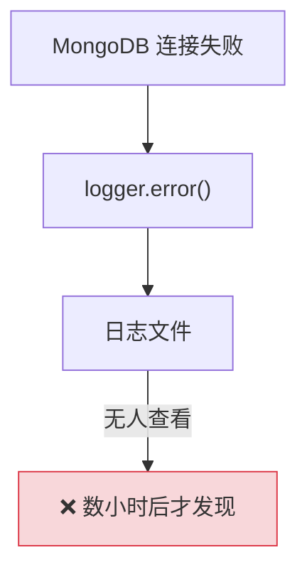
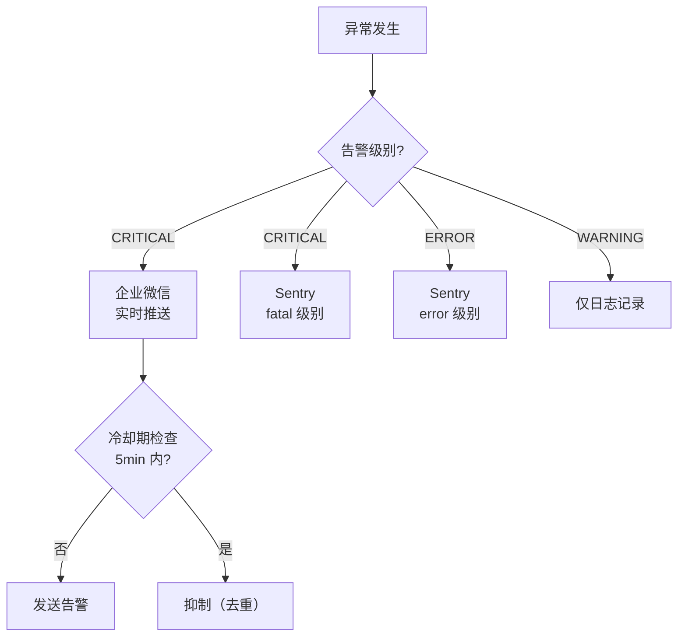
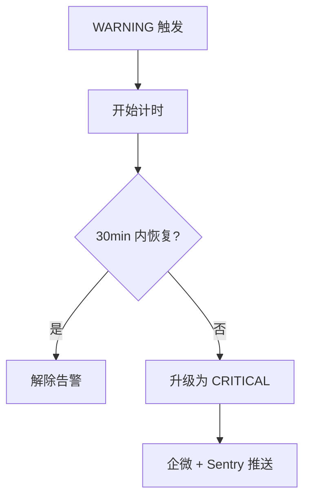

# YA-09-32: 服务异常监控与告警路由 — 企微/Sentry 双通道

> 需求编号：YA-09-32 · 优先级：P2 · 人天：0.5d · 状态：需求已编写
> 依赖：YA-09-31（结构化日志）

## 背景

YiAi 的异常分散在 WARNING/ERROR 日志中，运维人员无法主动感知。需要分级告警系统：CRITICAL 推企业微信（实时）、ERROR 上报 Sentry（聚合分析）、WARNING 仅日志：

1. **被动发现问题**：当前依赖运维人员主动查看日志或用户反馈才能发现异常。MongoDB 连接失败可能在数小时后才被发现。

2. **告警风暴**：单点故障（如 MongoDB 全宕）可能触发数十个模块同时报错，产生大量重复告警，淹没真正的关键信息。

3. **无告警升级**：WARNING 级别的问题（如 RAG 空结果率升高）持续 30 分钟未恢复，应该升级为 CRITICAL 告警，但当前无此机制。

4. **通道单点故障**：如果告警通道（如企业微信 Webhook）本身不可用，告警无法送达，形成"监控盲区"。

### 核心挑战

| 挑战 | 当前状态 | 目标状态 |
|------|----------|----------|
| 告警感知 | 被动（人工查看日志） | 主动推送（企微 + Sentry） |
| 告警聚合 | 无 | 相同告警 5min 去重 |
| 告警升级 | 无 | WARNING 持续 30min → CRITICAL |
| 通道冗余 | 无 | 企微 + Sentry 双通道 |

---

## 一、现状分析

### 1.1 当前告警方式

```python
# 当前——异常仅记录日志，无主动通知
try:
    await db.client.admin.command('ping')
except Exception as e:
    logger.error(f"[MongoDB] 连接失败: {e}")  # ❌ 仅日志，运维人员不知道
```

### 1.2 当前告警数据流



### 1.3 问题根因矩阵

| 问题 | 根因 | 影响范围 | 严重程度 |
|------|------|----------|----------|
| 被动发现 | 无主动推送 | 所有异常 | 高 |
| 告警风暴 | 无聚合去重 | 运维效率 | 中 |
| 无告警升级 | 无持续监控 | 问题恶化 | 中 |
| 通道单点 | 无冗余 | 告警可靠性 | 中 |

---

## 二、设计决策

### 决策 1：告警通道 — 企微 + Sentry 双通道 vs 单一通道 vs 多通道

| 维度 | 企微 + Sentry 双通道 | 仅企微 | 仅 Sentry |
|------|--------------------|--------|----------|
| 实时性 | 高（企微即时） | 高 | 中（需打开页面） |
| 聚合分析 | 高（Sentry） | 低 | 高 |
| 通道冗余 | 是 | 否 | 否 |
| 运维成本 | 中 | 低 | 低 |

**选择：企微 + Sentry 双通道。** CRITICAL 同时推企微和 Sentry（双保险），ERROR 仅推 Sentry（聚合分析），WARNING 仅日志。企微用于实时通知，Sentry 用于聚合分析和趋势追踪。

### 决策 2：告警聚合 — 冷却期 vs 滑动窗口 vs 令牌桶

| 维度 | 冷却期（5min） | 滑动窗口（5min 内 N 次） | 令牌桶 |
|------|-------------|---------------------|--------|
| 实现复杂度 | 低 | 中 | 中 |
| 告警延迟 | 首次立即，后续 5min 抑制 | 累积 N 次后告警 | 速率控制 |
| 适用场景 | 同类型重复告警 | 频率异常检测 | 速率限制 |

**选择：冷却期（5min）。** 同 title 告警 5 分钟内不重复发送。简单有效，防止告警风暴。

### 设计决策记录

| 决策 | 选项 A | 选项 B | 选项 C | 选择 | 理由 |
|------|--------|--------|--------|------|------|
| 告警通道 | 企微+Sentry | 仅企微 | 仅 Sentry | **企微+Sentry** | 双保险 |
| 告警聚合 | 冷却期 | 滑动窗口 | 令牌桶 | **冷却期** | 简单有效 |

---

## 三、目标架构

### 3.1 告警路由矩阵



### 3.2 告警升级流程



### 3.3 关键指标对比

| 指标 | 改造前 | 改造后 | 改善 |
|------|--------|--------|------|
| 告警感知 | 被动 | 主动推送 | 新增能力 |
| 告警重复 | 无控制 | 5min 冷却去重 | 新增能力 |
| 告警升级 | 无 | WARNING → CRITICAL | 新增能力 |
| 通道冗余 | 无 | 企微 + Sentry | 新增能力 |

---

## 四、具体改动

### 4.1 告警路由器

**文件：** `shared/alerting.py`（新增）

```python
from enum import Enum
import time

class AlertLevel(str, Enum):
    CRITICAL = "critical"   # 企微 + Sentry
    ERROR = "error"         # Sentry
    WARNING = "warning"     # 仅日志

class AlertRouter:
    """分级告警路由器。"""

    def __init__(self):
        self._sentry = sentry_sdk.Hub.current
        self._wework = WeWorkNotifier()
        self._cooldown: dict[str, float] = {}  # 冷却期
        self._warning_timers: dict[str, float] = {}  # 告警升级计时

    async def alert(self, level: AlertLevel, title: str, detail: str,
                    tags: dict | None = None):
        """分级告警——按告警级别选择通道。"""
        # 冷却检查——同 title 5 分钟内不重复发送
        if title in self._cooldown:
            if time.monotonic() - self._cooldown[title] < 300:
                return
        self._cooldown[title] = time.monotonic()

        if level == AlertLevel.CRITICAL:
            await self._wework.send(f"[CRITICAL] {title}\n{detail}")
            self._sentry.capture_message(detail, level='fatal', tags=tags)

        elif level == AlertLevel.ERROR:
            self._sentry.capture_message(detail, level='error', tags=tags)

        elif level == AlertLevel.WARNING:
            logger.warning(f"[Alert/{title}] {detail}")
            # 启动告警升级计时
            self._warning_timers[title] = time.monotonic()

    async def check_escalation(self):
        """检查告警升级——WARNING 持续 30min 升级为 CRITICAL。"""
        now = time.monotonic()
        for title, start in list(self._warning_timers.items()):
            if now - start > 1800:  # 30min
                await self.alert(AlertLevel.CRITICAL, title,
                    f"WARNING 持续 30min 未恢复，升级为 CRITICAL")
                del self._warning_timers[title]

    # 预定义告警规则
    async def on_mongodb_unavailable(self, duration_ms: int):
        await self.alert(AlertLevel.CRITICAL, "MongoDB 不可用",
            f"MongoDB 连接失败超过 {duration_ms}ms",
            tags={"component": "mongodb"})

    async def on_ollama_timeout(self, model: str, timeout_ms: int):
        await self.alert(AlertLevel.ERROR, "Ollama 推理超时",
            f"模型 {model} 超时 {timeout_ms}ms",
            tags={"component": "ollama", "model": model})

    async def on_disk_space_low(self, path: str, free_gb: float):
        await self.alert(AlertLevel.CRITICAL, "磁盘空间不足",
            f"{path} 剩余 {free_gb:.1f}GB",
            tags={"component": "disk"})

    async def on_rag_empty_rate_high(self, rate: float):
        await self.alert(AlertLevel.WARNING, "RAG 空结果率偏高",
            f"RAG 空结果率 {rate:.1%}（阈值 10%）",
            tags={"component": "rag"})
```

### 4.2 告警路由矩阵

| 场景 | 级别 | 企微 | Sentry | 日志 | 冷却 |
|------|------|------|--------|------|------|
| MongoDB 不可用 | CRITICAL | true | true | true | 5min |
| 磁盘空间 < 1GB | CRITICAL | true | true | true | 30min |
| Ollama 推理超时 | ERROR | false | true | true | 5min |
| RAG 空结果率 > 10% | WARNING | false | false | true | 15min |
| Agent 工具调用失败 | WARNING | false | false | true | 5min |

### 4.3 涉及文件变更清单

```
YiAi/src/
├── shared/
│   └── alerting.py            # 新增: AlertRouter + 预定义告警规则
├── services/
│   ├── rag/rag_service.py     # 修改: RAG 空结果率告警
│   ├── ai/agent.py            # 修改: Agent 工具调用失败告警
│   └── data/data_service.py   # 修改: MongoDB 连接告警
├── server/
│   └── main.py                # 修改: 启动告警升级检查定时任务
└── config/
    └── config.yaml            # 修改: 新增 alerting.wework_webhook/sentry_dsn
```

---

## 五、实施步骤

| 步骤 | 内容 | 涉及文件 | 验证方式 | 人天 |
|------|------|---------|---------|------|
| 1 | 实现 `AlertRouter` 核心（分级路由 + 冷却） | `shared/alerting.py` | 单元测试覆盖告警路由 | 0.15 |
| 2 | 实现企业微信通知器 | `shared/alerting.py` | 企微收到测试消息 | 0.1 |
| 3 | 实现 Sentry 集成 | `shared/alerting.py` | Sentry 收到测试事件 | 0.05 |
| 4 | 注册预定义告警规则（5 个场景） | `shared/alerting.py` | 触发条件满足时告警 | 0.1 |
| 5 | 实现告警升级定时检查 | `server/main.py` | WARNING 30min 后升级为 CRITICAL | 0.05 |
| 6 | 集成测试 | `tests/` | 覆盖告警路由/冷却/升级 | 0.05 |

**总计：0.5d**

---

## 六、性能分析

### 6.1 告警开销

| 操作 | 延迟 | 说明 |
|------|------|------|
| 冷却检查 | < 0.001ms | 字典查找 |
| 企微推送 | ~100ms | HTTP POST |
| Sentry 上报 | ~50ms | HTTP POST |
| 告警升级检查 | < 0.01ms | 遍历计时器 |

### 6.2 告警容量

| 场景 | 限制 | 说明 |
|------|------|------|
| 企微消息频率 | 20 条/分钟 | 企微机器人限制 |
| Sentry 事件频率 | 无限制 | Sentry SaaS |
| 冷却期 | 5min 去重 | 防止告警风暴 |

---

## 七、测试规格

### Requirement: 告警路由

#### Scenario: CRITICAL 推企微 + Sentry
- **Given** MongoDB 连接失败
- **When** 调用 `alert(CRITICAL, "MongoDB 不可用", "...")`
- **Then** 企微收到消息，Sentry 收到 fatal 事件

#### Scenario: ERROR 仅推 Sentry
- **Given** Ollama 推理超时
- **When** 调用 `alert(ERROR, "Ollama 超时", "...")`
- **Then** Sentry 收到 error 事件，企微未收到消息

#### Scenario: WARNING 仅日志
- **Given** RAG 空结果率 > 10%
- **When** 调用 `alert(WARNING, "RAG 空结果", "...")`
- **Then** 日志记录 WARNING，企微和 Sentry 未收到消息

### Requirement: 告警聚合

#### Scenario: 冷却期去重
- **Given** 同 title 告警在 5 分钟内触发 2 次
- **When** 第二次触发
- **Then** 第二次被抑制，仅发送第一次

#### Scenario: 冷却期过后重新发送
- **Given** 同 title 告警在 6 分钟后再次触发
- **When** 触发
- **Then** 正常发送告警

### Requirement: 告警升级

#### Scenario: WARNING 持续 30min 升级
- **Given** WARNING 告警触发，30min 内未恢复
- **When** `check_escalation()` 执行
- **Then** 升级为 CRITICAL 告警，推企微 + Sentry

---

## 八、风险与缓解

| 风险 | 概率 | 影响 | 等级 | 缓解措施 | 应急预案 |
|------|------|------|------|----------|----------|
| 告警风暴——单点故障触发 100+ 告警 | 中 | 高 | 高 | 5min 冷却期去重 + 告警聚合 | 手动暂停告警 |
| 企微 Webhook 失效告警自身无法送达 | 低 | 中 | 中 | 双通道冗余（Sentry 兜底） | 独立的健康检查心跳 |
| 告警升级误报 | 低 | 低 | 低 | 30min 阈值（避免瞬时波动） | 手动解除告警 |

---

## 九、回滚策略

| 场景 | 回滚方式 | 影响 | 恢复时间 |
|------|---------|------|---------|
| 告警风暴 | 设置 `ALERTING_ENABLED=false` 禁用 | 失去告警 | < 1min |
| 企微通道异常 | 仅使用 Sentry 通道 | 失去实时通知 | < 30s |
| 告警升级误报 | 调整 `ESCALATION_TIMEOUT` 参数 | 调整升级阈值 | < 30s |

---

## 十、设计决策记录

### D-01: 为什么选择企微 + Sentry 双通道而非单一通道？

企微用于实时通知（运维人员手机即时收到），Sentry 用于聚合分析（按组件/错误类型分组，趋势追踪，issue 管理）。双通道冗余确保一个通道失效时另一个仍可送达。CRITICAL 同时推两个通道（双保险），ERROR 仅推 Sentry（减少打扰），WARNING 仅日志。

### D-02: 为什么冷却期选择 5min 而非更短或更长？

太短（如 1min）无法有效抑制告警风暴，太长（如 30min）可能错过真正的重复故障。5min 是业界常用的告警冷却期，平衡了告警及时性和抑制效果。

---

## 十一、可观测性

### 关键指标

| 指标 | 采集方式 | 告警阈值 | 说明 |
|------|---------|---------|------|
| 告警发送次数 | 告警计数器 | > 50/min | 告警风暴 |
| 告警抑制次数 | 冷却期拦截计数 | > 100/min | 异常频率 |
| 告警升级次数 | 升级计数器 | > 0 | 需要人工介入 |
| 企微/Sentry 送达率 | 发送成功/失败 | < 95% | 通道可用性 |

### 日志规范

| 日志级别 | 场景 | 示例 |
|---------|------|------|
| `INFO` | 告警发送 | `[Alert] CRITICAL → 企微 + Sentry: MongoDB 不可用` |
| `INFO` | 告警抑制 | `[Alert] 冷却期抑制: Ollama 超时` |
| `WARNING` | 告警升级 | `[Alert] WARNING 升级为 CRITICAL: RAG 空结果` |

---

## 十二、安全合规

### 安全需求

| 需求 | 实现方式 | 验证方法 |
|------|---------|---------|
| 告警内容不泄露敏感信息 | 告警 payload 仅包含组件名和错误描述 | 检查告警消息 |
| 企微 Webhook 密钥保护 | 通过环境变量注入 | 检查 config.yaml 不含密钥 |

### 合规检查

| 检查项 | 要求 | 状态 |
|--------|------|------|
| 告警历史 | 记录所有告警 | 待实现 |
| 密钥保护 | 环境变量注入 | 待实现 |

---

## 十三、代码审查检查清单

- [ ] 告警按严重级别路由（CRITICAL→企微+Sentry/WARNING→日志/INFO→日志）
- [ ] 告警聚合——相同告警 5min 内去重
- [ ] 告警静默——维护窗口期自动抑制
- [ ] 告警升级——WARNING 持续 30min 升级为 CRITICAL
- [ ] 企微 + Sentry 双通道冗余
- [ ] 预定义告警规则覆盖 5 个关键场景
- [ ] 告警通道配置通过环境变量注入
- [ ] `ruff` 代码规范通过

---

## 十四、回归问题预测

| # | 预测问题 | 原因 | 验证方法 |
|---|---------|------|---------|
| 1 | 告警风暴——单点故障触发 100+ 告警 | 无聚合和抑制 | 模拟 MongoDB 全宕 → 检查告警数 |
| 2 | 企微 Webhook 失效告警自身无法送达 | 告警通道依赖被监控系统 | 独立的健康检查心跳 |
| 3 | 告警升级误报 | 瞬时 WARNING 波动 | 30min 阈值测试 |

---

*PRD 来源: `projects/yiai/requirements/2026-09/32-需求-告警路由.md`*

## 影响范围

- **影响模块**：待补充
- **涉及文件**：
- 待补充
- **是否影响 API 契约**：否
- **是否影响其他项目（YiVad/YiPet）**：否
- **用户感知**：待确认

## 预防措施

| 层面 | 措施 |
|------|------|
| 代码 | 在相关函数中添加参数校验和边界检查 |
| 测试 | 添加对应的自动化测试用例 |
| 流程 | 代码审查时重点检查此类模式 |
| 监控 | 添加日志告警，异常发生时及时发现 |
| 文档 | 在编码规范中记录此类反模式 |

## 经验教训

1. **根本原因**：开发过程中对边界情况和异常路径的考虑不足是此类问题的共同根因
2. **设计阶段**：在接口设计和模块实现时，应主动考虑异常输入、空值、超时等边界场景
3. **代码审查**：审查时应检查是否存在类似的反模式（如未捕获异常、无超时控制、缺少参数校验等）
4. **测试覆盖**：异常路径的测试覆盖率应与正常路径同等重视
5. **团队分享**：此类问题应在团队周会或技术分享中讨论，形成团队共识
