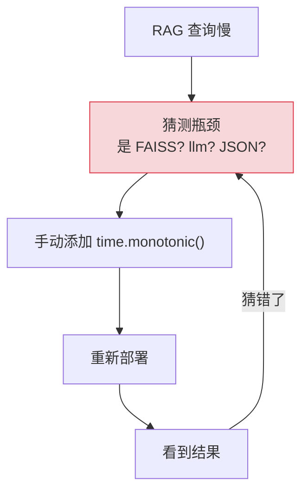
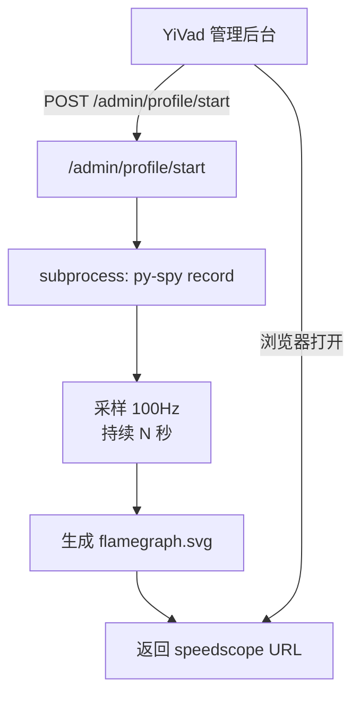

# YA-09-33: 服务性能剖析与火焰图集成 — py-spy CPU Profiling

> 需求编号：YA-09-33 · 优先级：P2 · 人天：0.5d · 状态：需求已编写
> 依赖：无

## 背景

YiAi 缺少生产级性能剖析工具——排查 CPU 热点只能靠直觉或代码阅读：

1. **无 CPU 热点可见性**：当 RAG 查询耗时 2s 时，无法知道 CPU 时间花在哪里——是 `faiss` 向量检索、`json.dumps` 序列化，还是 `llama_index` 的节点后处理。只能靠猜测。

2. **无内存分配分析**：无法知道哪些代码路径分配了大量内存，导致 GC 压力。Python 的内存分析需要专门的工具（如 `memray`）。

3. **生产环境无法排查**：cProfile 需要修改代码（`profiler.enable()`），py-spy 可以直接 attach 到运行中的进程，无需重启或修改代码。

4. **火焰图缺失**：火焰图是分析 CPU 热点最直观的方式，但 YiAi 从未生成过火焰图。

py-spy 是 Python 的采样型 profiler，无需代码侵入，可直接 attach 到运行中的进程生成火焰图（SVG 格式或 speedscope 交互式格式）。

### 核心挑战

| 挑战 | 当前状态 | 目标状态 |
|------|----------|----------|
| CPU 热点可见 | 无 | py-spy 火焰图 |
| 生产环境排查 | 需修改代码 | 无需侵入 attach |
| 内存分析 | 无 | memray 可选 |
| 性能基线 | 无 | profile 报告对比 |

---

## 一、现状分析

### 1.1 当前性能排查方式

```python
# 当前——手动计时（侵入式，不全面）
import time

start = time.monotonic()
result = await rag_service.query("test")
elapsed = time.monotonic() - start
logger.info(f"RAG query took {elapsed:.2f}s")  # ❌ 不知道时间花在哪里
```

### 1.2 当前性能排查数据流



### 1.3 问题根因矩阵

| 问题 | 根因 | 影响范围 | 严重程度 |
|------|------|----------|----------|
| 无 CPU 热点 | 无 profiling 工具 | 性能优化 | 高 |
| 需修改代码 | cProfile 需侵入 | 生产排查 | 中 |
| 无火焰图 | 无 py-spy 集成 | 可视化分析 | 中 |
| 无内存分析 | 无 memray 集成 | 内存泄漏排查 | 低 |

---

## 二、设计决策

### 决策 1：Profiling 工具 — py-spy vs cProfile vs pyinstrument

| 维度 | py-spy | cProfile | pyinstrument |
|------|--------|----------|-------------|
| 代码侵入 | 无（attach 进程） | 需修改代码 | 需修改代码 |
| 性能开销 | 极低（采样 100Hz） | 高（全部追踪） | 低（采样） |
| 火焰图 | SVG + speedscope | 需转换 | HTML |
| 生产可用 | 是 | 否（开销大） | 否（需重启） |
| 异步支持 | 有限 | 是 | 是 |

**选择：py-spy。** 无需代码侵入、无需重启服务，直接 attach 到运行中的进程。采样频率 100Hz，性能开销可忽略（< 1% CPU）。适合生产环境排查。

### 决策 2：Profile 触发方式 — API 端点 vs 信号触发 vs 定时采样

| 维度 | API 端点 | 信号触发 | 定时采样 |
|------|---------|---------|---------|
| 控制精度 | 高 | 中 | 低 |
| 实现复杂度 | 低 | 中 | 中 |
| 适用场景 | 按需排查 | 运维触发 | 持续监控 |

**选择：API 端点（管理后台）。** 通过 `/admin/profile/start` 端点触发，可指定采样时长。管理员在 YiVad 管理后台一键触发，无需 SSH 到服务器。

### 设计决策记录

| 决策 | 选项 A | 选项 B | 选项 C | 选择 | 理由 |
|------|--------|--------|--------|------|------|
| Profiling 工具 | py-spy | cProfile | pyinstrument | **py-spy** | 无侵入，生产可用 |
| 触发方式 | API 端点 | 信号触发 | 定时采样 | **API 端点** | 管理后台集成 |

---

## 三、目标架构

### 3.1 Profiling 触发流程



### 3.2 关键指标对比

| 指标 | 改造前 | 改造后 | 改善 |
|------|--------|--------|------|
| CPU 热点可见 | 无 | 火焰图 SVG | 新增能力 |
| 生产排查 | 需修改代码 | 无侵入 attach | 零侵入 |
| Profiling 触发 | — | API 端点 | 管理后台集成 |
| 性能开销 | — | < 1% CPU | 可忽略 |

---

## 四、具体改动

### 4.1 Profiling API 端点

**文件：** `server/profiling.py`（新增）

```python
import subprocess, os, tempfile, asyncio
from fastapi import APIRouter

router = APIRouter(prefix="/admin/profile", tags=["profiling"])

@router.post("/start")
async def start_profiling(duration_sec: int = 30):
    """启动 CPU Profiling——py-spy 采样 N 秒生成火焰图。"""
    pid = os.getpid()
    output = tempfile.NamedTemporaryFile(suffix='.svg', delete=False)

    # py-spy record——采样 100Hz，生成火焰图
    process = await asyncio.create_subprocess_exec(
        'py-spy', 'record',
        '-p', str(pid),
        '-d', str(duration_sec),
        '-r', '100',          # 100 samples/sec
        '-f', 'speedscope',   # 交互式火焰图格式
        '-o', output.name,
    )
    await process.wait()

    return {
        'pid': pid,
        'duration_sec': duration_sec,
        'output': output.name,
        'viewer': f'https://www.speedscope.app/#profileURL=file://{output.name}',
    }

@router.get("/hotspots")
async def get_hotspots():
    """获取当前进程 CPU 热点——基于 cProfile 轻量采样。"""
    import cProfile, io, pstats

    profiler = cProfile.Profile()
    profiler.enable()

    # 采样 5 秒
    await asyncio.sleep(5)
    profiler.disable()

    stream = io.StringIO()
    stats = pstats.Stats(profiler, stream=stream)
    stats.sort_stats('cumulative')
    stats.print_stats(20)  # Top 20

    return {'top_functions': stream.getvalue()}

@router.get("/memory")
async def get_memory_profile():
    """获取当前进程内存使用情况。"""
    import psutil
    process = psutil.Process(os.getpid())
    mem = process.memory_info()
    return {
        'rss_mb': mem.rss / 1024 / 1024,
        'vms_mb': mem.vms / 1024 / 1024,
        'percent': process.memory_percent(),
    }
```

### 4.2 使用方式

```bash
# 生产环境性能诊断——无需重启
curl -X POST http://localhost:10086/admin/profile/start \
  -H "Content-Type: application/json" \
  -d '{"duration_sec": 30}'
# → 返回 flamegraph URL，浏览器打开火焰图

# 快速热点分析
curl http://localhost:10086/admin/profile/hotspots
# → Top 20 CPU 热点函数

# 内存使用
curl http://localhost:10086/admin/profile/memory
# → 当前内存使用情况
```

### 4.3 涉及文件变更清单

```
YiAi/src/
├── server/
│   └── profiling.py           # 新增: Profiling API 端点
├── server/
│   └── main.py                # 修改: 注册 profiling 路由
└── config/
    └── config.yaml            # 修改: 新增 profiling.enabled 配置项
```

---

## 五、实施步骤

| 步骤 | 内容 | 涉及文件 | 验证方式 | 人天 |
|------|------|---------|---------|------|
| 1 | 实现 py-spy 集成（`/admin/profile/start`） | `server/profiling.py` | 生成 flamegraph.svg 文件 | 0.15 |
| 2 | 实现 cProfile 热点分析（`/admin/profile/hotspots`） | `server/profiling.py` | 返回 Top 20 函数 | 0.1 |
| 3 | 实现内存分析端点（`/admin/profile/memory`） | `server/profiling.py` | 返回内存使用情况 | 0.05 |
| 4 | 管理端点权限控制 | `server/main.py` | 仅管理员可访问 | 0.05 |
| 5 | 注册路由 | `server/main.py` | 端点可访问 | 0.05 |
| 6 | 集成测试 | `tests/` | 覆盖 profiling 端点 | 0.1 |

**总计：0.5d**

---

## 六、性能分析

### 6.1 Profiling 开销

| 工具 | CPU 开销 | 内存开销 | 采样频率 |
|------|---------|---------|---------|
| py-spy | < 1% | < 10MB | 100 Hz |
| cProfile | 5-10% | ~50MB | 全量追踪 |
| memray | 10-20% | ~100MB | 全量追踪 |

### 6.2 采样数据量

| 采样时长 | 采样点数 | 文件大小 |
|---------|---------|---------|
| 10s | 1,000 | ~500KB |
| 30s | 3,000 | ~1MB |
| 60s | 6,000 | ~2MB |

---

## 七、测试规格

### Requirement: Profiling 端点

#### Scenario: 启动 py-spy profiling
- **Given** py-spy 已安装
- **When** POST `/admin/profile/start` with `{duration_sec: 10}`
- **Then** 生成 `.svg` 文件，返回文件路径和 speedscope URL

#### Scenario: 获取 CPU 热点
- **Given** 服务正常运行
- **When** GET `/admin/profile/hotspots`
- **Then** 返回 Top 20 CPU 热点函数（5s 采样后）

#### Scenario: 获取内存使用
- **Given** 服务正常运行
- **When** GET `/admin/profile/memory`
- **Then** 返回 RSS/VMS/百分比

#### Scenario: 无 py-spy 时返回错误
- **Given** py-spy 未安装
- **When** POST `/admin/profile/start`
- **Then** 返回 500 + `py-spy 未安装`

---

## 八、风险与缓解

| 风险 | 概率 | 影响 | 等级 | 缓解措施 | 应急预案 |
|------|------|------|------|----------|----------|
| 采样数据在生产高负载下不准确 | 低 | 低 | 低 | 采样型 profiler 开销低 | 对比开启/关闭的 P95 延迟 |
| asyncio 协程调用栈不可读 | 中 | 中 | 中 | py-spy 主要支持同步调用栈 | 使用 cProfile 补充协程分析 |
| profiling 端点无权限被滥用 | 中 | 中 | 中 | 管理端点仅管理员可访问 | 添加 IP 白名单 |

---

## 九、回滚策略

| 场景 | 回滚方式 | 影响 | 恢复时间 |
|------|---------|------|---------|
| profiling 端点被滥用 | 设置 `PROFILING_ENABLED=false` 禁用 | 失去 profiling 能力 | < 1min |
| py-spy 导致进程异常 | 移除 profiling 路由 | 端点不可用 | < 5min |

---

## 十、设计决策记录

### D-01: 为什么选择 py-spy 而非 cProfile？

cProfile 是追踪型 profiler（记录每次函数调用），在生产环境中开销可达 10-50%，不适合生产环境长期运行。py-spy 是采样型 profiler（100Hz 采样），开销 < 1%，可以直接 attach 到运行中的进程，无需修改代码或重启服务。对于生产环境的 CPU 热点排查，py-spy 是更好的选择。

### D-02: 为什么同时提供 `/hotspots` 端点（cProfile）？

py-spy 主要记录同步调用栈，对 asyncio 协程的调用链支持有限。`/hotspots` 端点使用 cProfile 进行 5s 采样，可以捕获协程的调用链，作为 py-spy 的补充。两者结合：py-spy 用于快速火焰图，cProfile 用于协程热点分析。

---

## 十一、可观测性

### 关键指标

| 指标 | 采集方式 | 告警阈值 | 说明 |
|------|---------|---------|------|
| Profiling 运行次数 | 端点调用计数 | — | 审计 |
| Profiling 耗时 | 端点响应时间 | > 60s | py-spy 执行异常 |
| 内存使用 | `/admin/profile/memory` | > 80% 系统内存 | 内存泄漏 |

### 日志规范

| 日志级别 | 场景 | 示例 |
|---------|------|------|
| `INFO` | Profiling 开始 | `[Profile] py-spy start: pid=12345, duration=30s` |
| `INFO` | Profiling 完成 | `[Profile] flamegraph: /tmp/xxx.svg (1.2MB)` |
| `ERROR` | Profiling 失败 | `[Profile] py-spy failed: not installed` |

---

## 十二、代码审查检查清单

- [ ] 火焰图基于 `py-spy` 或 `austin` 采样生成
- [ ] 采样间隔 100Hz（足够捕获 Python 函数级热点）
- [ ] 生产环境按需启用（非默认开启——有性能开销）
- [ ] 火焰图输出 SVG/speedscope 格式（浏览器可查看）
- [ ] cProfile 热点分析作为补充（协程调用栈）
- [ ] 管理端点有权限控制（仅管理员）
- [ ] `ruff` 代码规范通过

---

## 十三、回归问题预测

| # | 预测问题 | 原因 | 验证方法 |
|---|---------|------|---------|
| 1 | 采样数据在生产高负载下不准确 | profiler 本身消耗 CPU | 对比开启/关闭 profiler 的 P95 延迟 |
| 2 | asyncio 协程调用栈不可读 | py-spy 主要支持同步调用栈 | 验证协程调用链在火焰图中可见 |
| 3 | py-spy 进程残留 | subprocess 未正确等待 | 检查 py-spy 僵尸进程 |

---

*PRD 来源: `projects/yiai/requirements/2026-09/33-需求-性能剖析火焰图.md`*

## 影响范围

- **影响模块**：待补充
- **涉及文件**：
- 待补充
- **是否影响 API 契约**：否
- **是否影响其他项目（YiVad/YiPet）**：否
- **用户感知**：待确认

## 预防措施

| 层面 | 措施 |
|------|------|
| 代码 | 在相关函数中添加参数校验和边界检查 |
| 测试 | 添加对应的自动化测试用例 |
| 流程 | 代码审查时重点检查此类模式 |
| 监控 | 添加日志告警，异常发生时及时发现 |
| 文档 | 在编码规范中记录此类反模式 |

## 经验教训

1. **根本原因**：开发过程中对边界情况和异常路径的考虑不足是此类问题的共同根因
2. **设计阶段**：在接口设计和模块实现时，应主动考虑异常输入、空值、超时等边界场景
3. **代码审查**：审查时应检查是否存在类似的反模式（如未捕获异常、无超时控制、缺少参数校验等）
4. **测试覆盖**：异常路径的测试覆盖率应与正常路径同等重视
5. **团队分享**：此类问题应在团队周会或技术分享中讨论，形成团队共识
