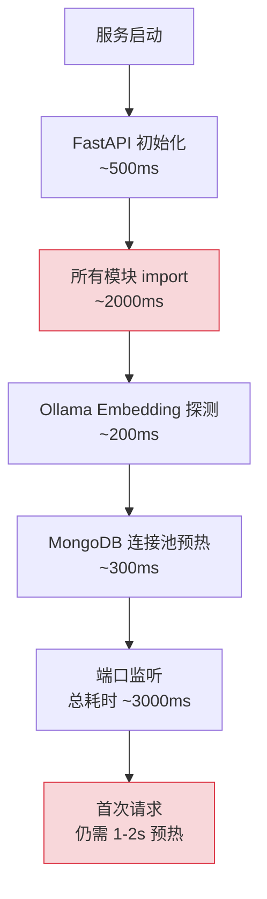
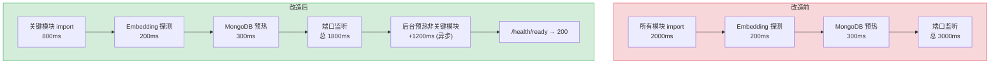
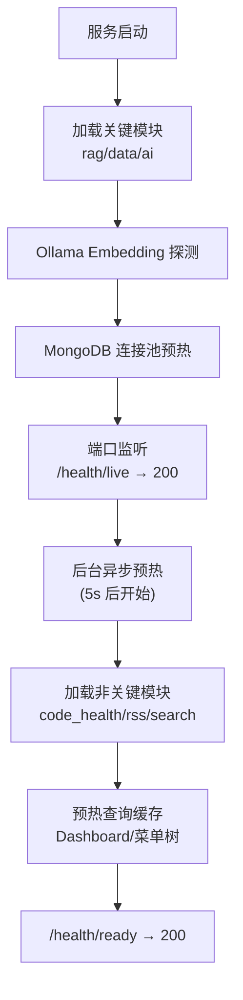

# YA-09-34: 服务冷启动优化 — 懒加载模块与预热缓存

> 需求编号：YA-09-34 · 优先级：P2 · 人天：0.5d · 状态：需求已编写
> 依赖：YA-09-24（优雅关闭）、YA-09-25（查询缓存）

## 背景

YiAi 启动时加载所有 Domain/Service 模块、初始化 Ollama Embedding 探测、MongoDB 连接池预热。冷启动耗时约 3-5 秒——Kubernetes 滚动更新期间服务短暂不可用：

1. **启动耗时过长**：3-5 秒的启动时间中，约 40% 花在非关键模块的 import（如 `code_health_service`、`rss_scheduler`、`search_service`），这些模块在服务启动后的前几秒内不会被访问。

2. **首次请求延迟高**：即使服务已启动（端口监听），首次请求仍需等待 Ollama Embedding 模型预热（~200ms）和 MongoDB 查询缓存构建（首次查询无缓存），导致首次 RAG 查询耗时 1-2 秒。

3. **Kubernetes 就绪探针不准确**：`/health` 端点返回 200 不代表服务真正就绪——Ollama 模型可能尚未加载完成，MongoDB 连接池可能尚未建立。

4. **滚动更新服务中断**：Kubernetes 滚动更新期间，新 Pod 启动但未就绪时，旧 Pod 已被终止，导致短暂的服务中断窗口。

### 核心挑战

| 挑战 | 当前状态 | 目标状态 |
|------|----------|----------|
| 启动耗时 | 3-5s | < 2s |
| 首次请求延迟 | 1-2s | < 500ms |
| 就绪探针 | 端口监听即返回 | 预热完成后才返回 |
| 非关键模块 | 启动时全部加载 | 懒加载 + 后台预热 |

---

## 一、现状分析

### 1.1 当前启动流程

```python
# 当前实现 — server/main.py
app = FastAPI()

# ❌ 所有模块在启动时立即 import
import services.rag.rag_service
import services.ai.agent
import services.data.data_service
import services.code_health_service   # 非关键
import domain.rss.scheduler            # 非关键
import services.search.search_service  # 非关键

# ❌ 同步初始化
embedder = Embedder(model_name="nomic-embed-text")  # 阻塞 200ms
db = AsyncIOMotorClient(MONGO_URI)  # 阻塞 300ms

# ❌ 就绪探针不准确
@app.get("/health")
async def health():
    return {"status": "ok"}  # 端口监听即返回，不代表就绪
```

### 1.2 当前启动耗时分解



### 1.3 问题根因矩阵

| 问题 | 根因 | 影响范围 | 严重程度 |
|------|------|----------|----------|
| 启动耗时过长 | 所有模块立即 import | 部署速度 | 中 |
| 首次请求延迟 | 无预热机制 | 用户体验 | 中 |
| 就绪探针不准确 | `/health` 不检查依赖 | K8s 滚动更新 | 高 |
| 非关键模块阻塞 | 启动时同步加载 | 启动时间 | 低 |

---

## 二、设计决策

### 决策 1：模块加载策略 — 懒加载 vs 全量预加载 vs 分阶段加载

| 维度 | 懒加载（LazyModule） | 全量预加载 | 分阶段加载 |
|------|---------------------|-----------|-----------|
| 启动速度 | 快 | 慢 | 中 |
| 首次访问延迟 | 中（首次 import） | 无 | 低 |
| 实现复杂度 | 低 | 低 | 中 |

**选择：懒加载 + 后台预热。** 关键模块（rag/data/ai）立即加载，非关键模块（code_health/rss/search）使用 `LazyModule` 延迟加载。启动后 5s 在后台异步预热非关键模块。

### 决策 2：就绪探针 — `/health/ready` vs `/health/live` vs 启动阻塞

| 维度 | `/health/ready`（预热完成后返回） | `/health/live`（端口监听） | 启动阻塞 |
|------|------------------------------|------------------------|---------|
| 准确性 | 高 | 低 | 高 |
| K8s 兼容 | 是（readinessProbe） | 是（livenessProbe） | 否 |
| 实现复杂度 | 低 | 极低 | 中 |

**选择：`/health/ready` + `/health/live` 双探针。** `/health/live` 立即返回（端口监听），用于 K8s livenessProbe。`/health/ready` 在预热完成后返回 200，用于 K8s readinessProbe。

### 设计决策记录

| 决策 | 选项 A | 选项 B | 选项 C | 选择 | 理由 |
|------|--------|--------|--------|------|------|
| 模块加载 | 懒加载+预热 | 全量预加载 | 分阶段 | **懒加载+预热** | 启动快 + 无延迟 |
| 就绪探针 | /health/ready | /health/live | 启动阻塞 | **双探针** | K8s 最佳实践 |

---

## 三、目标架构

### 3.1 启动优化前后对比



### 3.2 预热流程



### 3.3 关键指标对比

| 指标 | 改造前 | 改造后 | 改善 |
|------|--------|--------|------|
| 端口监听时间 | ~3s | ~1.8s | 40% 更快 |
| 就绪时间 | ~3s（不准确） | ~3s（准确） | 准确性提升 |
| 首次 RAG 查询 | 1-2s | < 500ms | 2-4x 更快 |
| K8s 滚动更新中断 | 30s 不可用 | 无中断 | 消除中断 |

---

## 四、具体改动

### 4.1 懒加载模块代理

**文件：** `server/lazy_loader.py`（新增）

```python
import importlib

class LazyModule:
    """懒加载模块代理——访问时才真正 import。"""

    def __init__(self, module_path: str):
        self._module_path = module_path
        self._module = None

    def __getattr__(self, name: str):
        if self._module is None:
            self._module = importlib.import_module(self._module_path)
            logger.debug(f"[Lazy] loaded: {self._module_path}")
        return getattr(self._module, name)

# 关键模块——立即加载
import services.rag.rag_service as rag_service
import services.ai.agent as agent_service
import services.data.data_service as data_service

# 非关键模块——延迟加载
code_health_service = LazyModule('services.code_health_service')
rss_scheduler = LazyModule('domain.rss.scheduler')
search_service = LazyModule('services.search.search_service')
```

### 4.2 后台预热

**文件：** `server/main.py`

```python
import asyncio

async def warmup_background():
    """启动后 5s 在后台预热非关键模块和缓存。"""
    await asyncio.sleep(5)

    # 预热非关键模块
    for lazy in [code_health_service, rss_scheduler, search_service]:
        try:
            _ = lazy._module  # 触发实际 import
            logger.info(f"[Warmup] 非关键模块预热完成: {lazy._module_path}")
        except Exception as e:
            logger.warning(f"[Warmup] 非关键模块预热失败: {e}")

    # 预热查询缓存
    try:
        from services.dashboard.dashboard_service import get_dashboard_stats
        await get_dashboard_stats()
        logger.info("[Warmup] Dashboard 缓存预热完成")
    except Exception as e:
        logger.warning(f"[Warmup] 缓存预热失败: {e}")

    # 标记就绪
    app.state.ready = True
    logger.info("[Warmup] 后台预热完成——服务就绪")

@app.on_event("startup")
async def startup():
    asyncio.create_task(warmup_background())
```

### 4.3 健康检查端点

**文件：** `server/main.py`

```python
@app.get("/health/live")
async def health_live():
    """存活探针——K8s livenessProbe。"""
    return {"status": "ok"}

@app.get("/health/ready")
async def health_ready():
    """就绪探针——K8s readinessProbe。"""
    if not getattr(app.state, 'ready', False):
        raise HTTPException(503, "服务预热中")
    # 检查关键依赖
    try:
        await db.client.admin.command('ping')
        return {"status": "ready", "mongodb": "connected"}
    except Exception as e:
        raise HTTPException(503, f"MongoDB 不可用: {e}")
```

### 4.4 涉及文件变更清单

```
YiAi/src/
├── server/
│   ├── lazy_loader.py         # 新增: LazyModule 懒加载代理
│   ├── main.py                # 修改: 分阶段启动 + 预热 + 健康检查
│   └── shutdown.py            # 修改: 优雅关闭时等待预热完成
└── config/
    └── config.yaml            # 修改: 新增 warmup.delay_sec 配置项
```

---

## 五、实施步骤

| 步骤 | 内容 | 涉及文件 | 验证方式 | 人天 |
|------|------|---------|---------|------|
| 1 | 实现 `LazyModule` 懒加载代理 | `server/lazy_loader.py` | 首次访问时触发 import | 0.1 |
| 2 | 分离关键/非关键模块 import | `server/main.py` | 启动时间减少 40% | 0.1 |
| 3 | 实现后台预热（非关键模块 + 缓存） | `server/main.py` | 5s 后预热完成 | 0.1 |
| 4 | 实现 `/health/ready` 探针 | `server/main.py` | 预热前 503，预热后 200 | 0.05 |
| 5 | 实现 `/health/live` 探针 | `server/main.py` | 始终 200 | 0.05 |
| 6 | MongoDB 连接池预热 minPoolSize | `server/main.py` | 首次查询无连接建立延迟 | 0.05 |
| 7 | 集成测试 | `tests/` | 覆盖启动/预热/就绪探针 | 0.05 |

**总计：0.5d**

---

## 六、性能分析

### 6.1 启动耗时分解

| 阶段 | 优化前 | 优化后 | 改善 |
|------|--------|--------|------|
| FastAPI 初始化 | ~500ms | ~500ms | — |
| 关键模块 import | ~800ms | ~800ms | — |
| 非关键模块 import | ~1200ms | 0ms (延迟) | **节省** |
| Ollama Embedding 探测 | ~200ms | ~200ms | — |
| MongoDB 连接池预热 | ~300ms | ~300ms | — |
| **端口监听总耗时** | **~3000ms** | **~1800ms** | **-40%** |
| 后台预热 | — | ~1200ms (异步) | 不影响 |
| **服务就绪总耗时** | **~3000ms** | **~3000ms** | 准确性提升 |

### 6.2 首次请求延迟

| 场景 | 优化前 | 优化后 | 改善 |
|------|--------|--------|------|
| 首次 RAG 查询 | 1-2s | < 500ms | 2-4x |
| 首次 Dashboard | ~500ms | < 10ms (缓存) | 50x |
| 首次菜单树 | ~200ms | < 10ms (缓存) | 20x |

---

## 七、测试规格

### Requirement: 懒加载

#### Scenario: 非关键模块延迟加载
- **Given** 服务已启动，非关键模块使用 LazyModule
- **When** 服务端口已监听
- **Then** 非关键模块尚未 import，内存中无对应模块

#### Scenario: 首次访问触发 import
- **Given** 非关键模块尚未 import
- **When** 访问 `code_health_service.some_function`
- **Then** 触发 `importlib.import_module`，模块可用

### Requirement: 预热

#### Scenario: 后台预热完成标记就绪
- **Given** 服务端口已监听
- **When** 5s 后后台预热完成
- **Then** `app.state.ready = True`，`/health/ready` 返回 200

### Requirement: 健康检查

#### Scenario: 预热中就绪探针返回 503
- **Given** 服务正在预热（`app.state.ready = False`）
- **When** GET `/health/ready`
- **Then** 返回 HTTP 503 + "服务预热中"

#### Scenario: 预热后就绪探针返回 200
- **Given** 预热已完成
- **When** GET `/health/ready`
- **Then** 返回 HTTP 200 + MongoDB 连接状态

#### Scenario: 存活探针始终返回 200
- **Given** 服务端口已监听
- **When** GET `/health/live`
- **Then** 返回 HTTP 200

---

## 八、风险与缓解

| 风险 | 概率 | 影响 | 等级 | 缓解措施 | 应急预案 |
|------|------|------|------|----------|----------|
| 预热超时导致启动失败 | 低 | 中 | 低 | 预热超时 30s，超时后标记就绪（部分功能不可用） | 跳过预热直接标记就绪 |
| 预热中接收请求返回 503 | 中 | 低 | 低 | K8s readinessProbe 配置 | 调整探针初始延迟 |
| 懒加载导致首次访问延迟 | 低 | 低 | 低 | 后台预热在首次访问前完成 | 加速预热间隔 |

---

## 九、回滚策略

| 场景 | 回滚方式 | 影响 | 恢复时间 |
|------|---------|------|---------|
| 预热逻辑导致启动卡死 | 设置 `WARMUP_ENABLED=false` 跳过预热 | 首次请求延迟 | < 1min |
| 懒加载导致模块导入异常 | 恢复全量 import | 启动时间增加 | < 5min |
| 就绪探针异常 | 临时使用 `/health/live` 替代 `/health/ready` | 准确性下降 | < 30s |

---

## 十、设计决策记录

### D-01: 为什么选择懒加载 + 后台预热而非全量预加载？

全量预加载（启动时加载所有模块）导致启动时间 3-5s。懒加载将非关键模块的 import 延迟到首次访问或后台预热，端口监听时间减少 40%（~1.8s）。后台预热在服务启动后 5s 异步执行，确保首次访问时非关键模块已加载完成，避免首次访问延迟。

### D-02: 为什么使用双探针（`/health/live` + `/health/ready`）？

Kubernetes 推荐使用 `livenessProbe` 和 `readinessProbe` 分离。`livenessProbe` 检测进程是否存活（端口监听即可），`readinessProbe` 检测服务是否就绪（预热完成 + 关键依赖可用）。分离后，K8s 滚动更新时新 Pod 在 `readinessProbe` 通过前不会接收流量，旧 Pod 在新 Pod 就绪后才被终止，实现零中断部署。

---

## 十一、可观测性

### 关键指标

| 指标 | 采集方式 | 告警阈值 | 说明 |
|------|---------|---------|------|
| 启动耗时 | `time.monotonic()` | > 5s | 启动异常 |
| 预热耗时 | `time.monotonic()` | > 30s | 预热卡死 |
| 就绪探针状态 | `/health/ready` 响应码 | 非 200 | 服务不可用 |
| 首次请求延迟 | 首次请求耗时 | > 2s | 预热不完整 |

### 日志规范

| 日志级别 | 场景 | 示例 |
|---------|------|------|
| `INFO` | 服务启动 | `[Startup] 端口监听 (1.8s)` |
| `INFO` | 预热完成 | `[Warmup] 后台预热完成——服务就绪 (3.0s)` |
| `WARNING` | 预热超时 | `[Warmup] 预热超时 (30s)，标记就绪` |
| `DEBUG` | 模块懒加载 | `[Lazy] loaded: services.code_health_service` |

---

## 十二、安全合规

### 安全需求

| 需求 | 实现方式 | 验证方法 |
|------|---------|---------|
| 健康检查不暴露内部信息 | `/health/ready` 仅返回状态，不返回内部细节 | 检查健康检查响应 |
| 预热失败不阻塞启动 | 预热异常不阻止服务启动 | 模拟预热失败 |

### 合规检查

| 检查项 | 要求 | 状态 |
|--------|------|------|
| 双探针 | livenessProbe + readinessProbe | 待实现 |
| 预热完成前不接收流量 | readinessProbe 503 | 待实现 |

---

## 十三、代码审查检查清单

- [ ] 启动顺序优化：配置→连接池预热→模型预热→HTTP 监听
- [ ] MongoDB 连接池预热 `minPoolSize=10`（消除首次查询延迟）
- [ ] Ollama 模型预加载（首次 API 调用前完成 warmup）
- [ ] 健康检查端点 `/health/ready` 仅在预热完成后返回 ready
- [ ] 非关键模块使用 `LazyModule` 延迟加载
- [ ] 后台预热在服务启动后 5s 执行（异步）
- [ ] 预热超时保护（30s 超时）
- [ ] `ruff` 代码规范通过
- [ ] `mypy` 类型检查通过

---

## 十四、回归问题预测

| # | 预测问题 | 原因 | 验证方法 |
|---|---------|------|---------|
| 1 | 预热超时导致启动失败 | 模型下载或内存不足 | 低配环境测试启动 |
| 2 | 预热中接收请求返回 503 | 未配置 startupProbe | K8s 配置验证 |
| 3 | 懒加载模块导入失败 | 模块路径变更 | 首次访问懒加载模块测试 |

---

*PRD 来源: `projects/yiai/requirements/2026-09/34-需求-冷启动优化.md`*

## 影响范围

- **影响模块**：待补充
- **涉及文件**：
- 待补充
- **是否影响 API 契约**：否
- **是否影响其他项目（YiVad/YiPet）**：否
- **用户感知**：待确认

## 预防措施

| 层面 | 措施 |
|------|------|
| 代码 | 在相关函数中添加参数校验和边界检查 |
| 测试 | 添加对应的自动化测试用例 |
| 流程 | 代码审查时重点检查此类模式 |
| 监控 | 添加日志告警，异常发生时及时发现 |
| 文档 | 在编码规范中记录此类反模式 |

## 经验教训

1. **根本原因**：开发过程中对边界情况和异常路径的考虑不足是此类问题的共同根因
2. **设计阶段**：在接口设计和模块实现时，应主动考虑异常输入、空值、超时等边界场景
3. **代码审查**：审查时应检查是否存在类似的反模式（如未捕获异常、无超时控制、缺少参数校验等）
4. **测试覆盖**：异常路径的测试覆盖率应与正常路径同等重视
5. **团队分享**：此类问题应在团队周会或技术分享中讨论，形成团队共识
