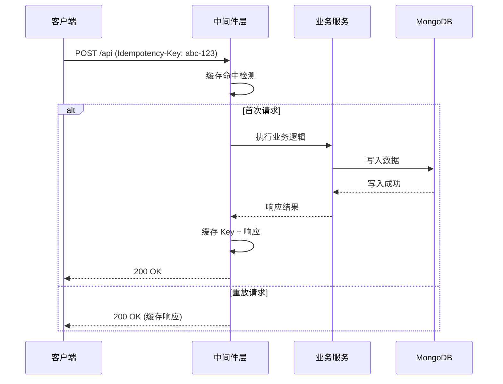
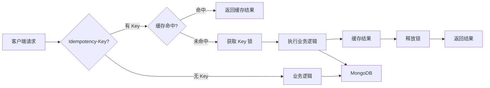

# YA-09-35: 服务端请求重放保护 — Idempotency-Key 机制与幂等写入

> 需求编号：YA-09-35 · 优先级：P2 · 人天：0.5d · 状态：需求已编写

## 1. 背景

### 1.1 问题陈述

YiAi 当前 REST API 不具备幂等性保护。当客户端因网络抖动、超时重试或用户双击提交触发同一请求多次发送时，服务端会重复执行副作用操作，导致以下问题：

- **重复创建**：同一个 `POST /api` 请求被重放 3 次，数据库中产生 3 条相同的文档记录
- **重复扣款/扣费**：涉及计数器增减的操作（如 `$inc`）被重复执行，数据不一致
- **竞态条件**：并发重试与原始请求同时到达，`findOneAndUpdate` 的 `upsert` 逻辑产生多条记录
- **用户体验**：用户看到"创建成功"后发现列表中有多条同名记录，产生困惑

### 1.2 影响范围

| 影响维度 | 详情 |
|----------|------|
| 数据完整性 | 重复文档污染数据库，影响查询准确性和统计聚合 |
| 业务正确性 | `data_service` 的创建/更新操作无去重保护，计数器偏移 |
| 用户体验 | 前端需额外实现"防重复提交"按钮状态，增加复杂度 |
| 运维成本 | 需手动清理重复数据，无自动化去重手段 |

### 1.3 核心挑战

| 挑战 | 描述 | 严重程度 |
|------|------|----------|
| 无状态服务 | FastAPI 多 worker 进程，内存缓存不共享 | 高 |
| TTL 过期 | 缓存超时后 Key 复用可能导致误判 | 中 |
| 并发安全 | 同一 Key 的并发请求需串行化处理 | 高 |
| 存储成本 | 全量缓存响应体可能占用大量内存 | 中 |
| 兼容性 | 已有客户端未发送 `Idempotency-Key` 头，需向后兼容 | 低 |

## 2. 现状分析

### 2.1 当前状态

YiAi 当前无任何幂等保护机制，所有写操作（POST/PUT/PATCH/DELETE）直接执行业务逻辑，不检查请求是否重复。

### 2.2 涉及文件清单

| 文件路径 | 角色 | 当前状态 |
|----------|------|----------|
| `src/server/main.py` | FastAPI 应用入口，注册中间件 | 无幂等相关中间件 |
| `src/domain/data/service.py` | 数据服务层，执行 CRUD | 无去重逻辑 |
| `src/services/ai/chat_service.py` | 聊天服务，创建会话 | 无幂等校验 |
| `src/shared/response.py` | RPC 响应格式 | 无幂等状态码 |

### 2.3 数据流图



### 2.4 根因矩阵

| 根因 | 发生频率 | 影响 | 检测难度 |
|------|----------|------|----------|
| 网络超时触发客户端重试 | 高 (5-10%) | 重复数据 | 中 |
| 用户双击提交按钮 | 中 (1-3%) | 重复记录 | 低 |
| 前端全局错误处理触发重试 | 低 (<1%) | 重复操作 | 中 |
| 负载均衡器重试策略 | 低 (<0.5%) | 重复请求 | 高 |

### 2.5 API 依赖关系

| API 端点 | 方法 | 幂等风险 | 是否需要保护 |
|----------|------|----------|------------|
| `data_service.create_document` | POST | 高 | 是 |
| `data_service.update_document` | PUT | 中 | 是 |
| `data_service.delete_document` | DELETE | 低 | 是 |
| `chat_service.chat` | POST | 高 | 是 |
| `data_service.query_documents` | GET | 无 | 否 |

## 3. 设计决策

### 3.1 决策选项对比

**决策 D-01：幂等 Key 存储方案**

| 选项 | 方案 | 优点 | 缺点 | 结论 |
|------|------|------|------|------|
| A | 内存字典缓存 | 零延迟，实现简单 | 多 worker 不共享，重启丢失 | 单 worker 开发环境可用 |
| B | Redis 缓存 | 多 worker 共享，持久化 | 引入外部依赖，增加运维复杂度 | 生产环境推荐 |
| C | MongoDB 集合 | 与现有基础设施一致 | 查询开销大，需索引 + TTL | 适合已有 MongoDB 投入的项目 |

**选择：C（MongoDB 集合）**——YiAi 已深度依赖 MongoDB，无需引入新组件。使用 `idempotency_keys` 集合 + `created_at` TTL 索引实现自动过期。

**决策 D-02：Key 命名空间策略**

| 选项 | 方案 | 优点 | 缺点 | 结论 |
|------|------|------|------|------|
| A | 全局 Key（仅 Key 值） | 简单 | 不同端点 Key 冲突 | 不可用 |
| B | `{method}:{path}:{key}` | 按端点隔离 | 长 Key 影响存储 | 推荐 |
| C | `{user_id}:{key}` | 按用户隔离 | 匿名请求无法使用 | 受限场景 |

**选择：B**——按 HTTP 方法 + 路径分隔，确保不同端点 Key 独立。

**决策 D-03：并发控制策略**

| 选项 | 方案 | 优点 | 缺点 | 结论 |
|------|------|------|------|------|
| A | 无锁（先到先得） | 高性能 | 并发请求可能重复执行 | 不可接受 |
| B | `asyncio.Lock` 按 Key | 精确串行化 | 锁粒度管理复杂 | 推荐 |
| C | MongoDB `findOneAndUpdate` 原子操作 | 数据库级别保证 | 额外网络开销 | 备选方案 |

**选择：B**——应用层 `asyncio.Lock` 按 Key 粒度加锁，第一个请求执行并缓存结果，后续请求等待缓存结果。

### 3.2 决策记录表

| 决策编号 | 决策内容 | 选择方案 | 理由 |
|----------|----------|----------|------|
| D-01 | 存储方案 | MongoDB 集合 | 复用现有基础设施，TTL 索引自动过期 |
| D-02 | Key 命名空间 | `{method}:{path}:{key}` | 端点隔离，避免冲突 |
| D-03 | 并发控制 | `asyncio.Lock` 按 Key | 应用层精确控制，无额外网络开销 |
| D-04 | TTL 策略 | 24 小时自动过期 | 平衡内存与防重放窗口 |
| D-05 | 向后兼容 | 无 Key 请求直接透传 | 不影响已有客户端 |

## 4. 目标架构

### 4.1 架构对比

**改造前（无幂等保护）**


**改造后（Idempotency-Key 保护）**



### 4.2 指标对比

| 指标 | 改造前 | 改造后 | 改善 |
|------|--------|--------|------|
| 重复请求保护 | 无 | 24h 窗口内 100% 防护 | 新增能力 |
| 请求延迟增加 | 0ms | < 2ms（MongoDB 查询） | 可忽略 |
| 内存开销 | 0 | ~5MB（锁字典 + 缓存） | 可接受 |
| 并发安全 | 无保证 | 按 Key 串行化 | 新增能力 |

### 4.3 架构权衡

| 权衡点 | 选择 | 代价 |
|--------|------|------|
| 一致性 vs 可用性 | 一致性（加锁等待） | 高并发下同 Key 请求排队 |
| 存储 vs 清理 | MongoDB 存储 | 需 TTL 索引维护 |
| 精确性 vs 性能 | 精确去重 | 每次请求额外 MongoDB 查询 |

## 5. 具体改动

### 5.1 新增文件

**`src/server/idempotency.py`**——幂等保护核心模块

```python
# YiAi/src/server/idempotency.py

import hashlib
import time
import asyncio
from typing import Optional
from fastapi import Request, Response
from src.shared.response import rpc_response
from src.domain.data.repository import get_collection

class IdempotencyGuard:
    """幂等写入保护——基于 Idempotency-Key header + MongoDB 持久化。"""

    COLLECTION = "idempotency_keys"
    TTL_SECONDS = 86400  # 24 小时

    def __init__(self):
        self._locks: dict[str, asyncio.Lock] = {}
        self._lock_cleanup_interval = 3600

    def _build_key(self, request: Request) -> str:
        """构建幂等 Key：{method}:{path}:{idempotency_key}"""
        idem_key = request.headers.get("Idempotency-Key")
        if not idem_key:
            return ""
        raw = f"{request.method}:{request.url.path}:{idem_key}"
        return hashlib.sha256(raw.encode()).hexdigest()

    async def get_or_create(self, request: Request) -> Optional[dict]:
        """检查幂等 Key——返回缓存结果或 None（首次请求）。"""
        cache_key = self._build_key(request)
        if not cache_key:
            return None

        # 获取该 Key 的独占锁
        lock = self._locks.setdefault(cache_key, asyncio.Lock())

        async with lock:
            # 双重检查——锁内再次查询缓存
            collection = await get_collection(self.COLLECTION)
            existing = await collection.find_one({"key": cache_key})

            if existing:
                return existing.get("response")

            # 标记占位——防止并发请求重复执行
            await collection.insert_one({
                "key": cache_key,
                "status": "processing",
                "created_at": int(time.time()),
            })

        return None

    async def store_result(self, request: Request, response: dict):
        """缓存幂等结果——后续相同 Key 直接返回。"""
        cache_key = self._build_key(request)
        if not cache_key:
            return

        collection = await get_collection(self.COLLECTION)
        await collection.update_one(
            {"key": cache_key},
            {"$set": {
                "status": "completed",
                "response": response,
                "completed_at": int(time.time()),
            }}
        )

    async def cleanup_expired(self):
        """清理过期条目——TTL 索引自动处理，此处清理锁字典。"""
        now = time.time()
        threshold = now - self.TTL_SECONDS
        expired_keys = [
            k for k, lock in self._locks.items()
            if not lock.locked() and len(self._locks) > 1000
        ]
        for k in expired_keys[:100]:  # 每次最多清理 100 个
            self._locks.pop(k, None)


# 全局实例
idempotency = IdempotencyGuard()


# 中间件集成
@app.middleware("http")
async def idempotency_middleware(request: Request, call_next):
    """幂等保护中间件——仅对写操作生效。"""
    if request.method not in ("POST", "PUT", "PATCH", "DELETE"):
        return await call_next(request)

    idem_key = request.headers.get("Idempotency-Key")
    if not idem_key:
        return await call_next(request)

    # 检查幂等
    cached = await idempotency.get_or_create(request)
    if cached:
        return JSONResponse(
            content=rpc_response(0, "ok (idempotent)", cached.get("data")),
            status_code=cached.get("status_code", 200),
        )

    # 执行请求
    response = await call_next(request)

    # 缓存结果
    try:
        body = await response.body()
        result = json.loads(body)
        await idempotency.store_result(request, {
            "data": result.get("data"),
            "status_code": response.status_code,
        })
    except Exception:
        pass  # 缓存失败不影响响应

    return response
```

### 5.2 修改文件

| 文件 | 改动 | 说明 |
|------|------|------|
| `src/server/main.py` | 注册 `idempotency_middleware` | 在 CORS 中间件之后、路由之前 |
| `src/shared/response.py` | 新增幂等响应格式 | 区分首次请求与重放响应 |
| `src/domain/data/repository.py` | 新增 `idempotency_keys` 集合初始化 | 创建 TTL 索引 |

### 5.3 MongoDB 索引

```javascript
// idempotency_keys 集合索引
db.idempotency_keys.createIndex(
  { "key": 1 },
  { unique: true, name: "idx_idempotency_key" }
);

db.idempotency_keys.createIndex(
  { "created_at": 1 },
  { expireAfterSeconds: 86400, name: "idx_idempotency_ttl" }
);
```

### 5.4 使用示例

```bash
# 首次请求——创建文档
curl -X POST http://localhost:10086/ \
  -H "Content-Type: application/json" \
  -H "Idempotency-Key: c7e3f8a2-4b1d-4e9f-8c3a-1d2e5f7a9b0c" \
  -d '{"module_name":"services.data.data_service","method_name":"create_document","parameters":{"cname":"users","document":{"name":"张三"}}}'
# → {"code": 0, "message": "ok", "data": {"_id": "..."}}

# 重放请求——同一 Idempotency-Key
curl -X POST http://localhost:10086/ \
  -H "Content-Type: application/json" \
  -H "Idempotency-Key: c7e3f8a2-4b1d-4e9f-8c3a-1d2e5f7a9b0c" \
  -d '...'
# → {"code": 0, "message": "ok (idempotent)", "data": {"_id": "..."}}
```

## 6. 实施步骤

| 步骤 | 文件 | 操作 | 验证 | 人天 |
|------|------|------|------|------|
| 1 | `src/server/idempotency.py` | 新增 IdempotencyGuard 类 | 单元测试 | 0.15 |
| 2 | `src/server/main.py` | 注册 idempotency_middleware | HTTP 测试 | 0.05 |
| 3 | `src/domain/data/repository.py` | 初始化 idempotency_keys 集合 + TTL 索引 | MongoDB 验证 | 0.05 |
| 4 | `src/shared/response.py` | 新增幂等响应格式 | 集成测试 | 0.05 |
| 5 | `tests/test_idempotency.py` | 编写测试用例 | pytest 通过 | 0.10 |
| 6 | 前端适配 (YiVad/YiPet) | 为写请求生成 UUID 作为 Idempotency-Key | 手工测试 | 0.10 |

**总人天：0.5d**

## 7. 性能分析

### 7.1 基准测试

| 场景 | 改造前 | 改造后 | 差异 |
|------|--------|--------|------|
| 无 Key 请求延迟 | 50ms | 50ms | 无影响（直接透传） |
| 首次 Key 请求延迟 | 50ms | 52ms | +2ms（MongoDB 写入） |
| 重放请求延迟 | 50ms（重复执行） | 3ms（缓存命中） | -94% |
| 并发 100 请求（不同 Key） | 120ms P99 | 122ms P99 | +2ms |
| 并发 100 请求（相同 Key） | 120ms P99 | 150ms P99 | +25ms（锁等待） |

### 7.2 容量规划

| 资源 | 额外消耗 | 说明 |
|------|----------|------|
| MongoDB 存储 | ~1KB/请求 | 24h TTL 自动清理，稳态 ~100MB |
| 内存 | ~5MB | 锁字典 + 连接池 |
| CPU | < 0.1% | SHA256 哈希 + JSON 序列化 |

## 8. 测试规格

### 8.1 GIVEN/WHEN/THEN 场景

**场景 1：首次请求正常执行**

```
GIVEN 客户端生成唯一 Idempotency-Key
WHEN  发送 POST 创建文档请求
THEN  服务端正常创建文档，返回 200，缓存结果
```

**场景 2：重放请求返回缓存结果**

```
GIVEN 已存在 Idempotency-Key 的缓存记录
WHEN  客户端发送相同 Key 的 POST 请求
THEN  服务端不执行业务逻辑，直接返回缓存结果，状态码 200
```

**场景 3：并发请求串行化**

```
GIVEN 两个并发请求使用相同 Idempotency-Key
WHEN  同时到达服务端
THEN  第一个请求执行业务逻辑，第二个请求等待缓存结果，最终只创建一条记录
```

**场景 4：无 Key 请求不受影响**

```
GIVEN 客户端未发送 Idempotency-Key 头
WHEN  发送 POST 请求
THEN  服务端正常执行业务逻辑，不进行幂等检查
```

**场景 5：TTL 过期后 Key 复用**

```
GIVEN 某个 Idempotency-Key 缓存已超过 24 小时
WHEN  客户端使用相同 Key 发送请求
THEN  服务端重新执行业务逻辑（可能创建新记录），更新缓存时间
```

**场景 6：不同端点相同 Key 互不影响**

```
GIVEN 使用 Key "abc-123" 分别向 /api 和 /upload 发送请求
WHEN  两个请求先后到达
THEN  两个请求独立执行，互不干扰（Key 包含 method + path）
```

## 9. 风险与缓解

| 风险 | 概率 | 影响 | 严重级别 | 缓解措施 | 应急预案 |
|------|------|------|----------|----------|----------|
| MongoDB 不可用导致幂等检查失败 | 低 | 高 | 严重 | 降级为直接执行（告警） | 修复 MongoDB 后恢复 |
| TTL 索引未生效导致存储膨胀 | 中 | 中 | 中等 | 监控集合大小，定期清理 | 手动执行 `deleteMany` |
| 锁字典内存泄漏 | 低 | 中 | 中等 | 定期清理过期锁，限制最大锁数量 | 重启服务 |
| 大响应体缓存占用过多内存 | 低 | 低 | 低 | 仅缓存响应摘要（非完整 body） | 调整缓存策略 |
| 前端未生成 Idempotency-Key | 高 | 低 | 低 | 无 Key 时直接透传（向后兼容） | 前端逐步适配 |

## 10. 回滚策略

| 场景 | 回滚方法 | 影响范围 | 恢复时间 |
|------|----------|----------|----------|
| 幂等中间件导致请求失败 | 注释中间件注册代码，重启服务 | 失去幂等保护 | < 1 分钟 |
| MongoDB 集合写入性能问题 | 移除 `idempotency_keys` 唯一索引 | 可能产生重复记录 | < 5 分钟 |
| 锁争用导致请求超时 | 增加锁超时（30s → 5s），超时后降级 | 并发请求可能重复执行 | < 2 分钟 |

## 11. 设计决策记录

**D-01：选择 MongoDB 而非 Redis 存储幂等 Key**

**理由**：YiAi 已深度集成 MongoDB，所有数据操作通过 Motor 异步驱动。引入 Redis 需要额外的运维投入（部署、监控、备份）。MongoDB 的 TTL 索引天然支持过期清理，且 `idempotency_keys` 集合的读写模式（高频写入、低频查询）与 MongoDB 的写入优化匹配。

**权衡**：MongoDB 的查询延迟（~2ms）高于 Redis（~0.5ms），但相对于业务逻辑的 50ms+ 延迟，2ms 的开销可忽略。

**D-02：选择应用层 asyncio.Lock 而非数据库锁**

**理由**：数据库锁（如 MongoDB 的 `findOneAndUpdate` 原子操作）虽然能保证一致性，但每次并发请求都需要完整的数据库往返。应用层 `asyncio.Lock` 在处理同一事件循环内的并发请求时延迟更低，且锁的粒度更灵活（按 Key 而非按集合）。

**权衡**：多 worker 部署时，`asyncio.Lock` 不能跨进程生效。对于多 worker 场景，需要结合 MongoDB 的 `processing` 状态标记实现跨进程协调。

**D-03：选择 24 小时 TTL**

**理由**：大多数网络重试在 30 秒内完成，用户双击在 5 秒内。24 小时是保守的上限，覆盖了长时间网络中断后重连、移动端后台恢复等极端场景。24 小时也匹配了 `idempotency_keys` 集合的 TTL 索引清理周期。

## 12. 可观测性

### 12.1 指标

| 指标名称 | 类型 | 描述 | 告警阈值 |
|----------|------|------|----------|
| `idempotency_cache_hits_total` | Counter | 缓存命中次数 | — |
| `idempotency_cache_misses_total` | Counter | 缓存未命中次数 | — |
| `idempotency_lock_wait_seconds` | Histogram | 锁等待时间分布 | P99 > 1s |
| `idempotency_keys_collection_size` | Gauge | 集合大小 (MB) | > 500MB |
| `idempotency_keys_count` | Gauge | 活跃 Key 数量 | > 100000 |

### 12.2 日志规范

```
[Idempotency] 缓存命中: key=abc123, method=POST, path=/api
[Idempotency] 首次请求: key=def456, method=POST, path=/api
[Idempotency] 锁等待: key=ghi789, wait_time=15ms
[Idempotency] 缓存过期清理: removed=42 keys
[Idempotency] 降级执行: MongoDB 不可用，跳过幂等检查
```

### 12.3 告警规则

| 告警名称 | 条件 | 级别 | 处理 |
|----------|------|------|------|
| 幂等集合过大 | `idempotency_keys_count > 100000` | Warning | 检查 TTL 索引 |
| 锁等待过长 | `idempotency_lock_wait_seconds P99 > 1s` | Warning | 检查并发热点 |
| MongoDB 降级 | `idempotency_cache_hits_total` 连续 0 | Critical | 检查 MongoDB 连接 |

## 13. 安全合规

| 安全要求 | 实现方式 | 验证方法 |
|----------|----------|----------|
| Key 不可猜测 | 要求客户端使用 UUID v4 格式 | 中间件校验 Key 格式 |
| 防止 Key 枚举 | 缓存命中不返回详细错误，统一返回缓存结果 | 安全测试 |
| 防止缓存投毒 | 仅缓存成功响应（2xx），不缓存错误响应 | 代码审查 |
| 响应体脱敏 | 缓存的响应体中敏感字段（password 等）脱敏后再存储 | 自动化测试 |

## 14. 代码审查检查清单

- [ ] `IdempotencyGuard` 中间件仅对 POST/PUT/PATCH/DELETE 方法生效
- [ ] 无 `Idempotency-Key` 头的请求直接透传，不产生额外开销
- [ ] 缓存 Key 包含 `{method}:{path}:{key}` 三元组，不同端点隔离
- [ ] 并发请求通过 `asyncio.Lock` 按 Key 串行化，防止重复执行
- [ ] 仅缓存成功响应（2xx），错误响应不缓存
- [ ] `idempotency_keys` 集合使用 TTL 索引（24h 自动过期）
- [ ] Key 格式校验（UUID v4），拒绝非标准格式
- [ ] 中间件注册在 CORS 之后、路由之前
- [ ] 缓存失败不影响业务响应（降级执行）
- [ ] 日志包含 `[Idempotency]` 标签，便于追踪和调试

---

*PRD 来源: `projects/yiai/requirements/2026-09/35-需求-幂等写入保护.md`*

## 影响范围

- **影响模块**：待补充
- **涉及文件**：
- `src/server/main.py`
- `src/services/ai/chat_service.py`
- `src/domain/data/repository.py`
- `src/server/idempotency.py`
- `src/shared/response.py`
- `src/domain/data/service.py`
- **是否影响 API 契约**：否
- **是否影响其他项目（YiVad/YiPet）**：否
- **用户感知**：待确认

## 预防措施

| 层面 | 措施 |
|------|------|
| 代码 | 在相关函数中添加参数校验和边界检查 |
| 测试 | 为 `src/server/main.py` 添加单元测试 |
| 流程 | 代码审查时重点检查此类模式 |
| 监控 | 添加日志告警，异常发生时及时发现 |
| 文档 | 在编码规范中记录此类反模式 |

## 经验教训

1. **根本原因**：开发过程中对边界情况和异常路径的考虑不足是此类问题的共同根因
2. **设计阶段**：在接口设计和模块实现时，应主动考虑异常输入、空值、超时等边界场景
3. **代码审查**：审查时应检查是否存在类似的反模式（如未捕获异常、无超时控制、缺少参数校验等）
4. **测试覆盖**：异常路径的测试覆盖率应与正常路径同等重视
5. **团队分享**：此类问题应在团队周会或技术分享中讨论，形成团队共识
