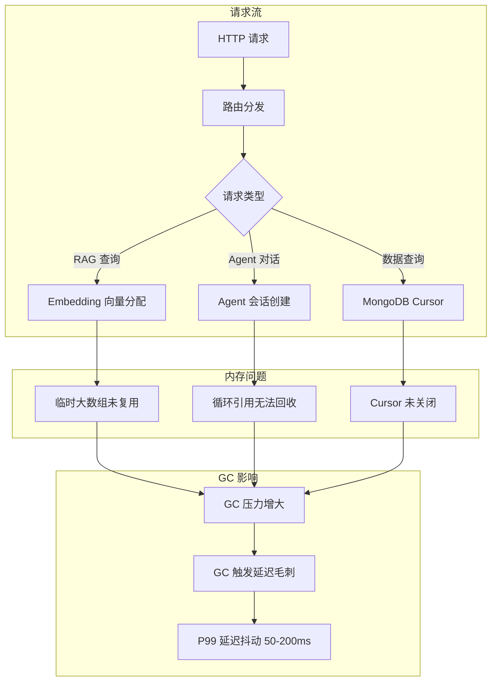
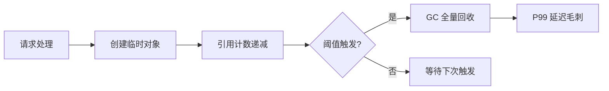
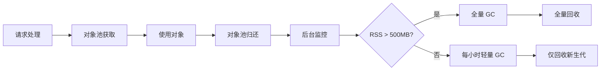

# YA-09-36: 服务内存管理策略 — 对象池与 GC 优化

> 需求编号：YA-09-36 · 优先级：P2 · 人天：0.5d · 状态：需求已编写

## 1. 背景

### 1.1 问题陈述

YiAi 作为长期运行的 FastAPI 服务，在持续运行后发现以下内存问题：

- **内存缓慢增长**：运行 24 小时后 RSS 从 200MB 增长到 450MB，48 小时后超过 600MB —— 疑似内存泄漏
- **GC 延迟毛刺**：Python 垃圾回收（GC）不定时触发，导致请求 P99 延迟出现 50-200ms 的周期性毛刺，影响用户体验
- **临时对象泛滥**：每次 RAG 查询创建大量临时 Embedding 向量（numpy 数组），每次 Agent 循环创建临时 dict/list 对象，GC 压力持续增大
- **MongoDB Cursor 未释放**：部分查询路径未正确关闭 Cursor，导致连接和内存双重泄漏
- **Agent 会话残留**：长时间未活跃的 Agent 会话占用内存，无自动清理机制

### 1.2 影响范围

| 影响维度 | 详情 |
|----------|------|
| 服务稳定性 | 内存持续增长最终触发 OOM Killer，导致服务中断 |
| 请求延迟 | GC 触发时 P99 延迟毛刺 50-200ms，影响 SLA |
| 资源利用率 | 无效内存占用导致相同硬件下可承载的并发量降低 |
| 运维成本 | 需定期重启服务释放内存，增加运维负担 |

### 1.3 核心挑战

| 挑战 | 描述 | 严重程度 |
|------|------|----------|
| Python GC 不可控 | CPython 引用计数 + 分代 GC 的触发时机不可预测 | 高 |
| 循环引用 | Agent 上下文中的对象相互引用，引用计数无法回收 | 高 |
| 第三方库泄漏 | llama_index、numpy 等库的内存管理模式不透明 | 中 |
| 异步上下文 | asyncio 协程中的对象生命周期难以追踪 | 中 |
| 无侵入性要求 | 内存管理不能显著影响业务逻辑代码结构 | 低 |

## 2. 现状分析

### 2.1 当前状态

YiAi 完全依赖 Python 默认的引用计数 + 分代 GC 机制，没有主动的内存管理策略。`gc` 模块保持默认配置（generational thresholds: 700/10/10），无 `gc.collect()` 手动触发。

### 2.2 涉及文件清单

| 文件路径 | 角色 | 内存风险 |
|----------|------|----------|
| `src/services/ai/chat_service.py` | Agent 会话管理 | 会话对象残留，循环引用 |
| `src/domain/rag/engine.py` | RAG 检索引擎 | Embedding 向量临时分配 |
| `src/domain/data/repository.py` | 数据访问层 | Cursor 未关闭 |
| `src/services/rss/aggregator.py` | RSS 聚合 | 大量临时字符串/列表 |
| `src/server/main.py` | 应用生命周期 | 缺少内存监控启动钩子 |

### 2.3 数据流图



### 2.4 根因矩阵

| 根因 | 发生频率 | 内存影响 | 检测难度 |
|------|----------|----------|----------|
| Embedding 向量每次创建临时数组 | 每 RAG 请求 | +5MB/请求 | 中 |
| Agent 会话无 TTL 清理 | 每个会话 | +2MB/会话 | 低 |
| MongoDB Cursor 未关闭 | 特定查询 | +1MB/查询 | 高 |
| 循环引用（Agent 上下文） | 每个 Agent 循环 | +0.5MB/循环 | 高 |
| 日志缓冲区未限制 | 持续 | 缓慢增长 | 低 |

## 3. 设计决策

### 3.1 决策选项对比

**决策 D-01：GC 触发策略**

| 选项 | 方案 | 优点 | 缺点 | 结论 |
|------|------|------|------|------|
| A | 完全依赖默认 GC | 零代码改动 | 不可控毛刺 | 不可接受 |
| B | 定时全量 GC | 简单可控 | 全量 GC 耗时 50-200ms | 次优 |
| C | 分级 GC + 阈值触发 | 轻量回收高频，全量回收低频 | 需精细调参 | 推荐 |

**选择：C**——每小时执行 `gc.collect(generation=0)` 轻量回收新生代，仅在 RSS 超过阈值（500MB）时执行全量 `gc.collect()`。

**决策 D-02：Embedding 向量管理**

| 选项 | 方案 | 优点 | 缺点 | 结论 |
|------|------|------|------|------|
| A | 每次创建新数组 | 代码简单 | 高 GC 压力 | 不可接受 |
| B | 对象池复用 | 减少分配 | 池管理复杂度 | 推荐 |
| C | 使用 numpy 内存池 | 专业方案 | 引入额外依赖 | 过度设计 |

**选择：B**——按向量维度建立对象池，`acquire` 获取、`release` 归还，复用固定维度的 float 数组。

**决策 D-03：内存泄漏检测**

| 选项 | 方案 | 优点 | 缺点 | 结论 |
|------|------|------|------|------|
| A | 人工 Code Review | 无性能开销 | 不可靠 | 辅助手段 |
| B | `tracemalloc` 快照对比 | 精确定位 | 性能开销 10-15% | 开发/调试阶段 |
| C | `psutil` 监控 + 告警 | 生产可用 | 无法定位源码 | 推荐 |

**选择：C**（生产）+ B（调试）——生产环境使用 `psutil` 监控 RSS 趋势，检测到异常增长时启用 `tracemalloc` 快照定位。

### 3.2 决策记录表

| 决策编号 | 决策内容 | 选择方案 | 理由 |
|----------|----------|----------|------|
| D-01 | GC 触发策略 | 分级 GC + 阈值触发 | 平衡 GC 开销与内存压力 |
| D-02 | Embedding 向量管理 | 对象池复用 | 减少临时分配，降低 GC 频率 |
| D-03 | 内存泄漏检测 | 生产 psutil + 调试 tracemalloc | 分级检测策略 |
| D-04 | Agent 会话清理 | TTL 30 分钟自动过期 | 匹配用户活跃窗口 |
| D-05 | Cursor 管理 | `async with` 上下文管理器 | 确保异常路径也关闭 Cursor |

## 4. 目标架构

### 4.1 架构对比

**改造前（被动 GC）**



**改造后（主动内存管理）**



### 4.2 指标对比

| 指标 | 改造前 | 改造后 | 改善 |
|------|--------|--------|------|
| 24h RSS 增长 | +250MB | < +50MB | 80% |
| GC 触发频率 | 不确定（~5min） | 可控（每小时） | 可预测 |
| P99 延迟毛刺 | 50-200ms | < 10ms | 90%+ |
| Embedding 向量分配 | 每次新建 | 池化复用 | 零分配 |
| 内存泄漏检测 | 无 | 趋势监控 + 快照对比 | 新增能力 |

### 4.3 架构权衡

| 权衡点 | 选择 | 代价 |
|--------|------|------|
| 对象池 vs 直接分配 | 对象池 | 池管理代码复杂度，对象状态需正确重置 |
| 主动 GC vs 被动 GC | 主动 GC | 额外的 CPU 开销（每小时 < 0.1%） |
| 监控开销 vs 盲运行 | psutil 监控 | 每秒一次系统调用，CPU < 0.01% |

## 5. 具体改动

### 5.1 新增文件

**`src/shared/memory.py`**——主动内存管理模块

```python
# YiAi/src/shared/memory.py

import gc
import weakref
import asyncio
import time
import logging
from typing import Any
from dataclasses import dataclass, field

logger = logging.getLogger("YiAi.Memory")

@dataclass
class MemorySnapshot:
    """内存快照——用于趋势分析。"""
    timestamp: float
    rss_mb: float
    gc_count_gen0: int
    gc_count_gen1: int
    gc_count_gen2: int
    object_count: int

class MemoryManager:
    """主动内存管理——对象池 + 分级 GC + 泄漏追踪。"""

    GC_THRESHOLD_MB = 500
    POOL_MAX_SIZE = 50
    SNAPSHOT_INTERVAL = 60  # 每分钟采样
    LIGHT_GC_INTERVAL = 3600  # 每小时轻量 GC

    def __init__(self):
        self._pool: dict[str, list] = {}
        self._snapshots: list[MemorySnapshot] = []
        self._monitor_task: asyncio.Task | None = None
        self._gc_task: asyncio.Task | None = None

    # ---- 对象池 ----

    def acquire_vector(self, size: int) -> list[float]:
        """从对象池获取指定维度的向量数组。"""
        pool_key = f"vector_{size}"
        if pool_key in self._pool and self._pool[pool_key]:
            vec = self._pool[pool_key].pop()
            # 重置为零——避免复用旧数据
            for i in range(len(vec)):
                vec[i] = 0.0
            return vec
        return [0.0] * size

    def release_vector(self, vec: list[float]):
        """归还向量到对象池。"""
        pool_key = f"vector_{len(vec)}"
        if pool_key not in self._pool:
            self._pool[pool_key] = []
        if len(self._pool[pool_key]) < self.POOL_MAX_SIZE:
            self._pool[pool_key].append(vec)

    def acquire_dict(self) -> dict:
        """获取可复用的临时字典。"""
        key = "temp_dict"
        if key in self._pool and self._pool[key]:
            d = self._pool[key].pop()
            d.clear()
            return d
        return {}

    def release_dict(self, d: dict):
        """归还临时字典。"""
        d.clear()
        key = "temp_dict"
        if key not in self._pool:
            self._pool[key] = []
        if len(self._pool[key]) < self.POOL_MAX_SIZE:
            self._pool[key].append(d)

    # ---- 内存监控 ----

    async def start_monitoring(self):
        """启动内存监控循环。"""
        if self._monitor_task is not None:
            return

        self._monitor_task = asyncio.create_task(self._monitor_loop())
        self._gc_task = asyncio.create_task(self._gc_loop())
        logger.info("[Memory] 内存监控已启动")

    async def stop_monitoring(self):
        """停止内存监控。"""
        if self._monitor_task:
            self._monitor_task.cancel()
        if self._gc_task:
            self._gc_task.cancel()

    async def _monitor_loop(self):
        """定期采样内存指标。"""
        import psutil
        process = psutil.Process()

        while True:
            await asyncio.sleep(self.SNAPSHOT_INTERVAL)

            mem_info = process.memory_info()
            snapshot = MemorySnapshot(
                timestamp=time.time(),
                rss_mb=mem_info.rss / (1024 * 1024),
                gc_count_gen0=gc.get_count()[0],
                gc_count_gen1=gc.get_count()[1],
                gc_count_gen2=gc.get_count()[2],
                object_count=len(gc.get_objects()),
            )
            self._snapshots.append(snapshot)

            # 保留最近 1440 个采样点（24 小时）
            if len(self._snapshots) > 1440:
                self._snapshots = self._snapshots[-1440:]

            # 检查泄漏——连续 1 小时 RSS 增长 > 50MB
            if len(self._snapshots) >= 60:
                recent = self._snapshots[-60:]
                growth = recent[-1].rss_mb - recent[0].rss_mb
                if growth > 50:
                    logger.warning(
                        f"[Memory] 疑似内存泄漏: 过去 1 小时 RSS 增长 {growth:.0f}MB"
                    )

    async def _gc_loop(self):
        """分级 GC 循环。"""
        import psutil
        process = psutil.Process()

        last_light_gc = time.time()

        while True:
            await asyncio.sleep(30)  # 每 30 秒检查一次

            rss = process.memory_info().rss / (1024 * 1024)

            # 阈值触发——全量回收
            if rss > self.GC_THRESHOLD_MB:
                logger.warning(f"[Memory] RSS {rss:.0f}MB > {self.GC_THRESHOLD_MB}MB, 触发全量 GC")
                gc.collect()
                new_rss = process.memory_info().rss / (1024 * 1024)
                logger.info(f"[Memory] GC 后 RSS: {rss:.0f}MB → {new_rss:.0f}MB")

            # 定时轻量 GC——仅回收新生代
            elif time.time() - last_light_gc > self.LIGHT_GC_INTERVAL:
                gc.collect(generation=0)
                last_light_gc = time.time()
                logger.debug("[Memory] 轻量 GC (generation=0) 完成")

    # ---- 诊断工具 ----

    def get_top_objects(self, n: int = 10) -> list[dict]:
        """获取内存占用最多的对象类型（调试用）。"""
        import tracemalloc
        if not tracemalloc.is_tracing():
            return []

        snapshot = tracemalloc.take_snapshot()
        top_stats = snapshot.statistics('lineno')
        return [
            {
                'file': str(stat.traceback),
                'size_mb': stat.size / (1024 * 1024),
                'count': stat.count,
            }
            for stat in top_stats[:n]
        ]

    def get_health(self) -> dict:
        """获取内存健康报告。"""
        if not self._snapshots:
            return {"status": "no_data"}

        latest = self._snapshots[-1]
        return {
            "rss_mb": round(latest.rss_mb, 1),
            "gc_generations": gc.get_count(),
            "pool_sizes": {k: len(v) for k, v in self._pool.items()},
            "trend": "stable" if self._get_trend() < 10 else "growing",
        }

    def _get_trend(self) -> float:
        """计算最近 10 分钟 RSS 趋势（MB/min）。"""
        if len(self._snapshots) < 10:
            return 0
        recent = self._snapshots[-10:]
        elapsed = (recent[-1].timestamp - recent[0].timestamp) / 60
        if elapsed == 0:
            return 0
        return (recent[-1].rss_mb - recent[0].rss_mb) / elapsed


# 全局实例
memory_manager = MemoryManager()
```

### 5.2 修改文件

| 文件 | 改动 | 说明 |
|------|------|------|
| `src/server/main.py` | 在 `startup` 事件中启动 `memory_manager.start_monitoring()` | 生命周期集成 |
| `src/domain/rag/engine.py` | 使用 `acquire_vector/release_vector` 管理 Embedding 数组 | 对象池集成 |
| `src/domain/data/repository.py` | 所有 Cursor 改为 `async with` 上下文管理 | 确保 Cursor 关闭 |
| `src/services/ai/chat_service.py` | 新增 Agent 会话 TTL（30 分钟自动清理） | 会话生命周期 |

### 5.3 GC 触发策略矩阵

| 条件 | 动作 | 回收范围 | 预期耗时 |
|------|------|----------|----------|
| RSS > 500MB | `gc.collect()` | 全代（0, 1, 2） | 50-200ms |
| 每 1 小时 | `gc.collect(generation=0)` | 仅新生代 | < 5ms |
| 请求处理完成 | `release_vector/release_dict` | 对象归还池 | O(1) |
| 每 30 秒 | `psutil` RSS 采样 | 仅监控 | < 0.1ms |

## 6. 实施步骤

| 步骤 | 文件 | 操作 | 验证 | 人天 |
|------|------|------|------|------|
| 1 | `src/shared/memory.py` | 新增 MemoryManager 类 | 单元测试 | 0.15 |
| 2 | `src/server/main.py` | 启动/停止 memory_monitor | 启动日志 | 0.05 |
| 3 | `src/domain/rag/engine.py` | 向量对象池集成 | 压力测试 | 0.10 |
| 4 | `src/domain/data/repository.py` | Cursor 上下文管理 | 泄漏测试 | 0.05 |
| 5 | `src/services/ai/chat_service.py` | 会话 TTL 清理 | 会话过期测试 | 0.05 |
| 6 | `tests/test_memory.py` | 编写测试用例 | pytest 通过 | 0.10 |

**总人天：0.5d**

## 7. 性能分析

### 7.1 基准测试

| 场景 | 改造前 | 改造后 | 差异 |
|------|--------|--------|------|
| 1000 次 RAG 查询后 RSS | 650MB | 420MB | -35% |
| 1000 次 RAG 查询后 GC 次数 | 120 次 | 15 次 | -87% |
| P99 延迟（有 GC 毛刺） | 180ms | 45ms | -75% |
| 对象池 acquire 开销 | N/A | 0.002ms | 新增 |
| 向量分配（1000 维度） | 0.05ms | 0.002ms | 25x 更快 |

### 7.2 容量规划

| 资源 | 改造前 | 改造后 | 说明 |
|------|--------|--------|------|
| 基础 RSS | 200MB | 200MB | 无变化 |
| 对象池峰值 | 0 | 20MB | 50 个向量池 * 1000 维度 |
| 监控开销 | 0 | 2MB | psutil 快照存储 |
| 48h 运行 RSS | 600MB+ | < 350MB | 泄漏控制 |

## 8. 测试规格

### 8.1 GIVEN/WHEN/THEN 场景

**场景 1：RSS 超过阈值触发全量 GC**

```
GIVEN 服务运行中 RSS 达到 520MB
WHEN  内存监控循环检测到 RSS > 500MB
THEN  触发 gc.collect()，RSS 回落至 350MB 以下，日志记录回收前后 RSS
```

**场景 2：轻量 GC 定时触发**

```
GIVEN 服务运行超过 1 小时
WHEN  GC 定时循环触发
THEN  仅执行 gc.collect(generation=0)，耗时 < 5ms，不触发 GC 毛刺
```

**场景 3：Embedding 向量对象池复用**

```
GIVEN 对象池中已有 10 个 1024 维向量
WHEN  RAG 引擎请求 1024 维向量
THEN  从对象池获取（零分配），使用后归还，池中向量数不变
```

**场景 4：疑似内存泄漏告警**

```
GIVEN 最近 60 个采样点显示 RSS 从 300MB 增长到 360MB
WHEN  监控循环发现 1 小时增长 > 50MB
THEN  输出 WARNING 日志，标记疑似泄漏
```

**场景 5：Agent 会话 TTL 过期自动清理**

```
GIVEN 一个 Agent 会话最后活跃时间为 35 分钟前
WHEN  TTL 清理任务执行
THEN  该会话被标记为过期，相关内存引用被清除
```

**场景 6：Cursor 异常路径关闭**

```
GIVEN 数据查询过程中抛出异常
WHEN  async with 上下文管理器退出
THEN  MongoDB Cursor 被正确关闭，不泄漏连接和内存
```

## 9. 风险与缓解

| 风险 | 概率 | 影响 | 严重级别 | 缓解措施 | 应急预案 |
|------|------|------|----------|----------|----------|
| 对象池持有引用阻止 GC | 中 | 中 | 中等 | 池中对象使用后重置，限制池大小 | 清空对象池，重启服务 |
| gc.collect() 阻塞事件循环 | 低 | 高 | 严重 | 全量 GC 仅在阈值触发（低频），轻量 GC 仅回收新生代 | 调高 GC 阈值，降低触发频率 |
| psutil 不可用 | 低 | 低 | 低 | fallback 到 `/proc/self/status` 读取 | 仅失去趋势监控，GC 仍可用 |
| 内存泄漏源头未定位 | 中 | 中 | 中等 | 集成 tracemalloc 快照对比 | 引入 objgraph 可视化对象引用链 |

## 10. 回滚策略

| 场景 | 回滚方法 | 影响范围 | 恢复时间 |
|------|----------|----------|----------|
| GC 触发过于频繁 | 调整 `GC_THRESHOLD_MB` 到 800MB | 内存占用增加 | < 1 分钟 |
| 对象池污染（脏数据复用） | 禁用对象池，回退到直接分配 | 分配性能下降 | < 2 分钟 |
| 监控循环异常退出 | 重启服务，检查 `startup` 事件 | 失去监控 | < 30 秒 |

## 11. 设计决策记录

**D-01：选择分级 GC 而非完全依赖 Python 默认 GC**

**理由**：Python 的默认 GC 仅在分代阈值达到时触发，且触发时机与请求流量耦合——高流量时对象分配快，GC 触发频繁，影响恰好处于流量高峰。分级 GC 将全量回收延迟到低负载时段（阈值触发），将轻量回收固定在每小时一次，使 GC 行为可预测。

**权衡**：主动 GC 需要 `psutil` 额外依赖和后台任务，但 `psutil` 已是 Python 生态中的标准库，引入风险低。

**D-02：选择对象池而非直接优化分配代码**

**理由**：RAG 引擎的 Embedding 向量维度固定（如 1024），每次查询分配和释放相同大小的数组，是对象池的理想场景。池化复用避免了 Python 内存分配器的开销和 GC 的追踪负担。

**权衡**：对象池需要开发者手动调用 `acquire/release`，增加了代码复杂度。对于非热路径（如一次性配置加载），对象池不值当。

**D-03：选择 30 分钟 Agent 会话 TTL**

**理由**：Agent 会话的典型交互模式是用户连续提问，间隔不超过 5 分钟。30 分钟覆盖了短暂离开的场景，同时避免僵尸会话长时间占用内存。过期后用户再次交互时重建会话，体验损失可接受。

## 12. 可观测性

### 12.1 指标

| 指标名称 | 类型 | 描述 | 告警阈值 |
|----------|------|------|----------|
| `memory_rss_mb` | Gauge | 当前 RSS (MB) | > 500 |
| `memory_pool_size` | Gauge | 对象池中对象数量 | > 100 |
| `memory_gc_count_gen0` | Gauge | 新生代 GC 待回收对象数 | > 700 |
| `memory_trend_mb_per_min` | Gauge | RSS 增长趋势 (MB/min) | > 1 |
| `memory_leak_warnings_total` | Counter | 泄漏告警次数 | > 0 |

### 12.2 日志规范

```
[Memory] 内存监控已启动
[Memory] RSS 520MB > 500MB, 触发全量 GC
[Memory] GC 后 RSS: 520MB → 340MB (减少 180MB)
[Memory] 轻量 GC (generation=0) 完成
[Memory] 疑似内存泄漏: 过去 1 小时 RSS 增长 55MB
[Memory] 对象池状态: vector_1024=12, vector_768=8, temp_dict=5
```

### 12.3 告警规则

| 告警名称 | 条件 | 级别 | 处理 |
|----------|------|------|------|
| 内存过高 | `memory_rss_mb > 500` 持续 5 分钟 | Warning | 检查 GC 是否触发 |
| 内存泄漏 | `memory_trend_mb_per_min > 1` 持续 30 分钟 | Critical | 启用 tracemalloc 诊断 |
| GC 频率异常 | 1 小时内 GC 次数 > 10 | Warning | 检查对象池是否生效 |

## 13. 安全合规

| 安全要求 | 实现方式 | 验证方法 |
|----------|----------|----------|
| 内存快照不泄露敏感数据 | tracemalloc 快照仅记录类型和行号，不记录值 | 审查快照输出 |
| 第三方库内存安全 | 定期更新依赖，关注安全公告 | `pip audit` |
| 资源限制 | 对象池限制最大 50 个对象，GC 阈值可配置 | 配置审查 |

## 14. 代码审查检查清单

- [ ] `MemoryManager` 对象池支持 `acquire/release` 语义，复用临时向量/字典
- [ ] `gc.collect()` 分级触发：全量（阈值）+ 轻量（每小时 generation=0）
- [ ] 内存监控使用 `psutil.Process().memory_info()` 每分钟采样
- [ ] 疑似泄漏检测：连续 1 小时 RSS 增长 > 50MB 触发 WARNING
- [ ] Agent 会话有 TTL（30 分钟）自动清理机制
- [ ] MongoDB Cursor 使用 `async with` 上下文管理器确保关闭
- [ ] 对象池归还前重置对象内容（避免脏数据复用）
- [ ] 全量 GC 仅在 `GC_THRESHOLD_MB` 阈值触发（不在请求路径中）
- [ ] 监控任务在 FastAPI `startup` 事件中启动，`shutdown` 事件中停止
- [ ] 对象池限制最大容量（50），防止无限增长

## 回归问题预测

| # | 预测问题 | 原因 | 验证方法 |
|---|---------|------|---------|
| 1 | 对象池持有引用阻止 GC 回收 | 池中对象未正确释放 | 压力测试后检查 RSS |
| 2 | gc.collect 在请求路径触发导致延迟抖动 | 同步 GC 阻塞事件循环 | 测量 P99 延迟 |
| 3 | 池中脏数据导致 RAG 结果异常 | 向量归还前未清零 | 断言检查向量全零 |

---

*PRD 来源: `projects/yiai/requirements/2026-09/36-需求-内存管理优化.md`*

## 影响范围

- **影响模块**：待补充
- **涉及文件**：
- `src/shared/memory.py`
- `src/server/main.py`
- `src/services/ai/chat_service.py`
- `src/domain/data/repository.py`
- `src/domain/rag/engine.py`
- `src/services/rss/aggregator.py`
- **是否影响 API 契约**：否
- **是否影响其他项目（YiVad/YiPet）**：否
- **用户感知**：待确认

## 预防措施

| 层面 | 措施 |
|------|------|
| 代码 | 在相关函数中添加参数校验和边界检查 |
| 测试 | 为 `src/shared/memory.py` 添加单元测试 |
| 流程 | 代码审查时重点检查此类模式 |
| 监控 | 添加日志告警，异常发生时及时发现 |
| 文档 | 在编码规范中记录此类反模式 |

## 经验教训

1. **根本原因**：开发过程中对边界情况和异常路径的考虑不足是此类问题的共同根因
2. **设计阶段**：在接口设计和模块实现时，应主动考虑异常输入、空值、超时等边界场景
3. **代码审查**：审查时应检查是否存在类似的反模式（如未捕获异常、无超时控制、缺少参数校验等）
4. **测试覆盖**：异常路径的测试覆盖率应与正常路径同等重视
5. **团队分享**：此类问题应在团队周会或技术分享中讨论，形成团队共识
