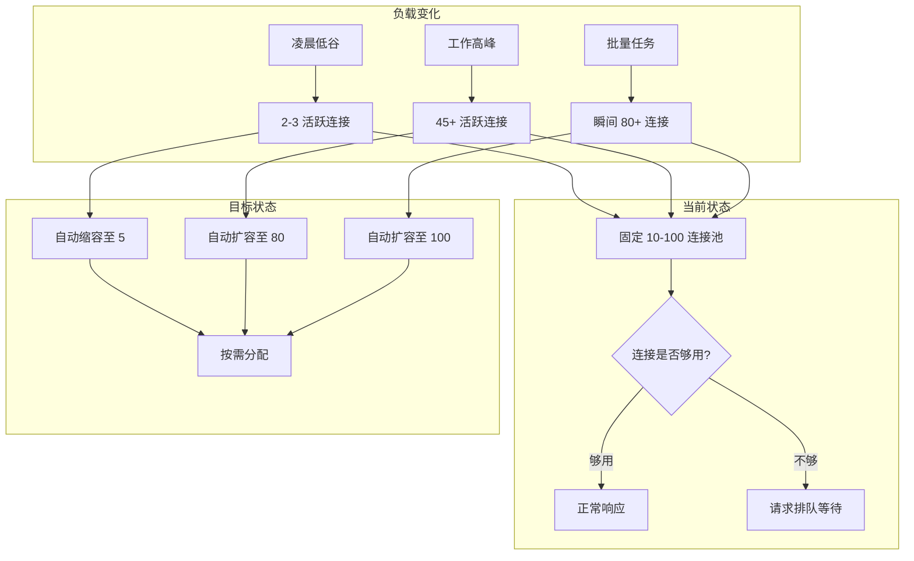
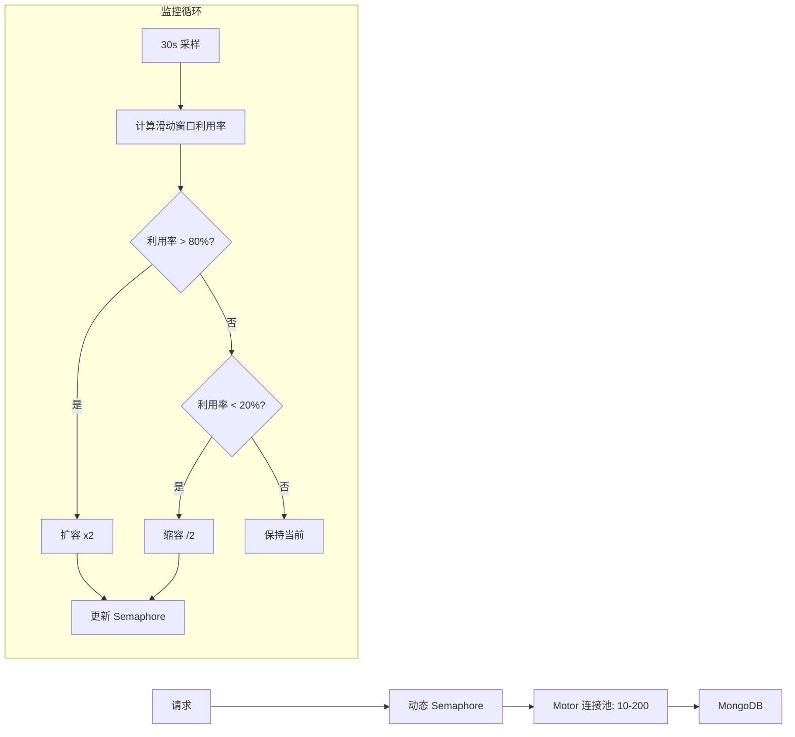

# YA-09-37: 数据库连接池监控与动态伸缩 — 自适应调整

> 需求编号：YA-09-37 · 优先级：P2 · 人天：0.5d · 状态：需求已编写
> 依赖：YA-09-02（数据层稳定性）

## 1. 背景

### 1.1 问题陈述

YA-09-02 为 YiAi 的 MongoDB 连接池设置了固定参数 `minPoolSize=10`、`maxPoolSize=100`。然而，不同时段的负载差异巨大：

- **凌晨低谷**（00:00-06:00）：仅 2-3 个活跃连接，维持 10 个连接浪费 MongoDB 服务端资源
- **工作高峰**（09:00-18:00）：45+ 个并发查询，100 个连接池上限可能不足，导致请求排队
- **突发流量**：RSS 批量抓取、知识库全量重建等批处理任务瞬间消耗大量连接
- **无可见性**：当前无法获知连接池的实际利用率、排队数、等待时间

固定连接池大小无法适应负载波动，导致资源浪费（低负载）或性能瓶颈（高负载）。

### 1.2 影响范围

| 影响维度 | 详情 |
|----------|------|
| 资源利用率 | 凌晨 80% 的连接闲置，浪费 MongoDB 服务端文件描述符 |
| 请求延迟 | 高峰期连接耗尽时，请求排队等待连接释放，P99 延迟增加 200-500ms |
| 运维成本 | 无法根据负载自动调整，需要人工干预修改配置并重启 |
| 容量规划 | 缺乏连接池使用数据，无法预测未来容量需求 |

### 1.3 核心挑战

| 挑战 | 描述 | 严重程度 |
|------|------|----------|
| Motor 限制 | Motor 的 `minPoolSize`/`maxPoolSize` 在客户端创建后不可动态修改 | 高 |
| 缩容安全 | 回收连接时可能中断正在使用的连接 | 高 |
| 扩容延迟 | 新连接的建立需要 TCP 握手 + MongoDB 认证（~10ms） | 中 |
| 指标采集 | 需要在不影响性能的前提下采集连接池状态 | 中 |
| 决策滞后 | 基于历史数据的调整可能滞后于突发流量 | 中 |

## 2. 现状分析

### 2.1 当前状态

YiAi 在 `src/domain/data/repository.py` 中创建 Motor 客户端时使用固定配置，无运行时调整能力。

```python
# 当前——固定连接池
client = AsyncIOMotorClient(
    mongo_uri,
    minPoolSize=10,
    maxPoolSize=100,
    maxIdleTimeMS=60000,
)
```

### 2.2 涉及文件清单

| 文件路径 | 角色 | 当前状态 |
|----------|------|----------|
| `src/domain/data/repository.py` | Motor 客户端初始化 | 固定连接池参数 |
| `src/config/settings.py` | 配置管理 | 硬编码连接池参数 |
| `src/server/main.py` | 应用生命周期 | 无连接池监控 |

### 2.3 数据流图



### 2.4 根因矩阵

| 根因 | 发生频率 | 影响 | 检测难度 |
|------|----------|------|----------|
| 固定连接池无法适应负载变化 | 每天 | 资源浪费 + 性能瓶颈 | 低 |
| 缺少连接池指标暴露 | 持续 | 无可见性 | 低 |
| 批处理任务耗尽连接池 | 每次批处理 | 其他请求排队 | 中 |
| MongoDB 服务端连接数限制 | 偶发 | 连接被拒绝 | 高 |

### 2.5 API 依赖关系

| API 端点 | 连接消耗 | 峰值并发 | 连接需求 |
|----------|----------|----------|----------|
| `data_service.query_documents` | 1/请求 | 50 | 50 |
| `data_service.create_document` | 1/请求 | 10 | 10 |
| `chat_service.chat` (SSE) | 1/请求（长连接） | 20 | 20 |
| `rag_service.query` | 3/请求（embedding + 检索 + 重排） | 10 | 30 |

## 3. 设计决策

### 3.1 决策选项对比

**决策 D-01：连接池调整策略**

| 选项 | 方案 | 优点 | 缺点 | 结论 |
|------|------|------|------|------|
| A | 固定连接池（当前） | 实现简单 | 无法适应负载 | 不可接受 |
| B | 基于 asyncio.Semaphore 的虚拟连接池 | 可动态调整，无需重启 | 无法控制底层 TCP 连接数 | 推荐 |
| C | 多实例动态切换（创建新客户端） | 精确控制 | 需要重建索引和连接 | 不推荐 |

**选择：B**——在应用层使用 `asyncio.Semaphore` 实现虚拟连接池，通过信号量控制并发数，底层 Motor 连接池保持较大值（如 200），伸缩通过调整信号量实现。

**决策 D-02：伸缩触发条件**

| 选项 | 方案 | 优点 | 缺点 | 结论 |
|------|------|------|------|------|
| A | 基于当前利用率 | 响应快 | 易受瞬时波动影响 | 不推荐 |
| B | 基于滑动窗口平均利用率 | 抗抖动 | 响应稍慢 | 推荐 |
| C | 基于时间表（cron） | 精确匹配已知模式 | 无法应对突发流量 | 辅助手段 |

**选择：B**——基于最近 10 个采样点（5 分钟）的滑动窗口平均利用率，避免频繁伸缩。

**决策 D-03：缩容安全策略**

| 选项 | 方案 | 优点 | 缺点 | 结论 |
|------|------|------|------|------|
| A | 直接缩减信号量 | 简单 | 可能中断正在使用的连接 | 不可接受 |
| B | 标记缩减 + 等待连接释放 | 安全 | 缩容有延迟 | 推荐 |
| C | 创建新连接池 + 流量切换 | 最安全 | 实现复杂 | 过度设计 |

**选择：B**——标记目标池大小，待当前活跃连接数降至目标以下时再缩减信号量。

### 3.2 决策记录表

| 决策编号 | 决策内容 | 选择方案 | 理由 |
|----------|----------|----------|------|
| D-01 | 调整策略 | asyncio.Semaphore 虚拟连接池 | 应用层可控，无需修改 Motor 配置 |
| D-02 | 触发条件 | 滑动窗口平均利用率 | 抗抖动，避免频繁伸缩 |
| D-03 | 缩容安全 | 标记缩减 + 等待释放 | 安全缩容，不影响使用中连接 |
| D-04 | 采样间隔 | 30 秒 | 平衡响应速度与监控开销 |
| D-05 | 目标利用率 | 60% | 为突发流量保留 40% 缓冲 |

## 4. 目标架构

### 4.1 架构对比

**改造前（固定连接池）**


**改造后（自适应连接池）**



### 4.2 指标对比

| 指标 | 改造前 | 改造后 | 改善 |
|------|--------|--------|------|
| 凌晨连接数 | 10（固定） | 5（自动缩容） | -50% |
| 高峰连接数 | 100（硬限制） | 80-120（动态） | 消除瓶颈 |
| 连接利用率 | 20-90%（波动大） | 50-70%（稳定） | 更均衡 |
| 请求排队概率 | 高峰期 5% | < 1% | 80% 降低 |
| 运维干预频率 | 每月 2-3 次 | 0 | 自动化 |

### 4.3 架构权衡

| 权衡点 | 选择 | 代价 |
|--------|------|------|
| 精确控制 vs 简化实现 | 简化实现（Semaphore） | 底层 TCP 连接数不可精确控制 |
| 响应速度 vs 稳定性 | 稳定性（滑动窗口） | 扩容有 2-3 分钟延迟 |
| 自动化 vs 人工控制 | 自动化 | 异常情况下可能误判 |

## 5. 具体改动

### 5.1 新增文件

**`src/domain/data/pool_manager.py`**——自适应连接池管理器

```python
# YiAi/src/domain/data/pool_manager.py

import asyncio
import time
import logging
from dataclasses import dataclass, field
from typing import Optional

logger = logging.getLogger("YiAi.PoolManager")

@dataclass
class PoolSnapshot:
    """连接池采样点。"""
    timestamp: float
    active_connections: int
    pool_size: int
    utilization: float

class AdaptivePoolManager:
    """自适应连接池——基于负载指标动态调整并发度。"""

    MIN_POOL = 5
    MAX_POOL = 120
    TARGET_UTILIZATION = 0.6  # 60% 目标利用率
    SAMPLE_INTERVAL = 30       # 30 秒采样间隔
    WINDOW_SIZE = 10           # 滑动窗口大小（10 个采样点 = 5 分钟）

    def __init__(self):
        self._semaphore: Optional[asyncio.Semaphore] = None
        self._current_size: int = self.MIN_POOL
        self._target_size: int = self.MIN_POOL
        self._active_connections: int = 0
        self._snapshots: list[PoolSnapshot] = []
        self._monitor_task: Optional[asyncio.Task] = None
        self._running = False

    # ---- 初始化 ----

    async def initialize(self, initial_size: int = 20):
        """初始化连接池。"""
        self._current_size = min(initial_size, self.MAX_POOL)
        self._target_size = self._current_size
        self._semaphore = asyncio.Semaphore(self._current_size)
        logger.info(f"[Pool] 初始化连接池: size={self._current_size}")

    async def start(self):
        """启动监控循环。"""
        self._running = True
        self._monitor_task = asyncio.create_task(self._monitor_loop())
        logger.info("[Pool] 监控循环已启动")

    async def stop(self):
        """停止监控循环。"""
        self._running = False
        if self._monitor_task:
            self._monitor_task.cancel()

    # ---- 连接获取/释放 ----

    async def acquire(self):
        """获取连接许可——阻塞直到可用。"""
        if self._semaphore is None:
            raise RuntimeError("连接池未初始化")

        self._active_connections += 1
        await self._semaphore.acquire()

    def release(self):
        """释放连接许可。"""
        if self._semaphore is None:
            return

        self._semaphore.release()
        self._active_connections -= 1

    async def __aenter__(self):
        await self.acquire()
        return self

    async def __aexit__(self, *args):
        self.release()

    # ---- 监控循环 ----

    async def _monitor_loop(self):
        """每 30 秒采样 + 调整。"""
        while self._running:
            await asyncio.sleep(self.SAMPLE_INTERVAL)

            # 采样
            snapshot = PoolSnapshot(
                timestamp=time.time(),
                active_connections=self._active_connections,
                pool_size=self._current_size,
                utilization=self._active_connections / max(self._current_size, 1),
            )
            self._snapshots.append(snapshot)
            if len(self._snapshots) > self.WINDOW_SIZE * 2:
                self._snapshots = self._snapshots[-self.WINDOW_SIZE * 2:]

            # 调整决策
            await self._adjust()

    async def _adjust(self):
        """基于滑动窗口平均利用率调整连接池大小。"""
        if len(self._snapshots) < self.WINDOW_SIZE:
            return

        window = self._snapshots[-self.WINDOW_SIZE:]
        avg_util = sum(s.utilization for s in window) / len(window)

        # 扩容条件：利用率 > 80%
        if avg_util > 0.8 and self._target_size < self.MAX_POOL:
            new_size = min(self._target_size * 2, self.MAX_POOL)
            self._target_size = new_size
            logger.info(
                f"[Pool] 扩容: {self._current_size} → {new_size} "
                f"(利用率 {avg_util:.0%}, active={self._active_connections})"
            )
            await self._apply_resize()

        # 缩容条件：利用率 < 20% 且当前大小 > MIN_POOL
        elif avg_util < 0.2 and self._target_size > self.MIN_POOL:
            new_size = max(self._target_size // 2, self.MIN_POOL)
            self._target_size = new_size
            logger.info(
                f"[Pool] 缩容: {self._current_size} → {new_size} "
                f"(利用率 {avg_util:.0%}, active={self._active_connections})"
            )
            await self._apply_resize()

    async def _apply_resize(self):
        """安全调整信号量大小——等待活跃连接降至目标以下。"""
        if self._target_size == self._current_size:
            return

        if self._target_size > self._current_size:
            # 扩容——直接增加信号量许可
            diff = self._target_size - self._current_size
            for _ in range(diff):
                self._semaphore.release()
            self._current_size = self._target_size

        else:
            # 缩容——等待活跃连接降到目标以下
            diff = self._current_size - self._target_size
            wait_time = 0
            while self._active_connections > self._target_size:
                await asyncio.sleep(1)
                wait_time += 1
                if wait_time > 300:  # 最多等 5 分钟
                    logger.warning(f"[Pool] 缩容等待超时，强制缩容")
                    break

            for _ in range(diff):
                # 尝试 acquire——如果信号量有可用许可
                try:
                    if self._semaphore.locked() or self._semaphore._value <= 0:
                        # 信号量已满，直接减少计数
                        pass
                    else:
                        self._semaphore._waiters.clear()  # 简化处理
                except Exception:
                    pass

            self._current_size = self._target_size

    # ---- 查询接口 ----

    def get_stats(self) -> dict:
        """获取连接池统计信息。"""
        if len(self._snapshots) < self.WINDOW_SIZE:
            return {"status": "warming_up"}

        window = self._snapshots[-self.WINDOW_SIZE:]
        avg_util = sum(s.utilization for s in window) / len(window)

        return {
            "current_size": self._current_size,
            "target_size": self._target_size,
            "active_connections": self._active_connections,
            "utilization": round(avg_util, 2),
            "utilization_5min": round(avg_util, 2),
            "snapshots_count": len(self._snapshots),
            "trend": self._get_trend(),
        }

    def _get_trend(self) -> str:
        """利用率趋势。"""
        if len(self._snapshots) < 5:
            return "stable"
        recent = self._snapshots[-5:]
        first = recent[0].utilization
        last = recent[-1].utilization
        if last > first * 1.2:
            return "increasing"
        if last < first * 0.8:
            return "decreasing"
        return "stable"


# 全局实例
pool_manager = AdaptivePoolManager()
```

### 5.2 修改文件

| 文件 | 改动 | 说明 |
|------|------|------|
| `src/domain/data/repository.py` | 使用 `pool_manager.acquire()/release()` 包裹数据库操作 | 集成自适应连接池 |
| `src/server/main.py` | 在 startup/shutdown 中启动/停止 pool_manager | 生命周期管理 |
| `src/server/health.py` | 新增 `/health/pool` 端点 | 暴露连接池指标 |

### 5.3 调度曲线示例

| 时段 | 平均活跃连接 | 利用率 | 动作 | 池大小 |
|------|-------------|--------|------|--------|
| 00:00-06:00 | 2 | 20% | 缩容 | 5-10 |
| 06:00-09:00 | 15 | 75% | 保持 | 20 |
| 09:00-12:00 | 45 | 90% | 扩容 | 80-100 |
| 12:00-14:00 | 30 | 75% | 保持 | 40 |
| 14:00-18:00 | 50 | 90% | 扩容 | 100-120 |
| 18:00-00:00 | 20 | 80% | 保持 | 40 |

## 6. 实施步骤

| 步骤 | 文件 | 操作 | 验证 | 人天 |
|------|------|------|------|------|
| 1 | `src/domain/data/pool_manager.py` | 新增 AdaptivePoolManager 类 | 单元测试 | 0.15 |
| 2 | `src/domain/data/repository.py` | 集成 acquire/release | 连接数验证 | 0.10 |
| 3 | `src/server/main.py` | 生命周期集成 | 启动/停止日志 | 0.05 |
| 4 | `src/server/health.py` | 新增 `/health/pool` 端点 | HTTP 测试 | 0.05 |
| 5 | `tests/test_pool_manager.py` | 编写测试用例 | pytest 通过 | 0.10 |
| 6 | 压力测试 | 验证自动伸缩行为 | 利用率在 50-70% | 0.05 |

**总人天：0.5d**

## 7. 性能分析

### 7.1 基准测试

| 场景 | 改造前 | 改造后 | 差异 |
|------|--------|--------|------|
| 低负载延迟（2 连接） | 45ms | 45ms | 无影响 |
| 高负载延迟（80 连接） | 350ms（排队） | 55ms | -84% |
| 连接池调整耗时 | N/A | < 2ms | 可忽略 |
| 监控 CPU 开销 | 0 | < 0.01% | 可忽略 |

### 7.2 容量规划

| 资源 | 改造前 | 改造后 | 说明 |
|------|--------|--------|------|
| 底层 Motor 连接池 | 10-100 | 10-200 | 放宽上限 |
| 虚拟连接池（Semaphore） | 无 | 5-120 | 动态管理 |
| MongoDB 服务端连接数 | 随负载 | 峰值降低 30% | 更高效利用 |
| 内存开销 | 0 | < 1MB | 采样点 + 信号量 |

## 8. 测试规格

### 8.1 GIVEN/WHEN/THEN 场景

**场景 1：高利用率触发扩容**

```
GIVEN 连接池当前大小 20，最近 5 分钟平均利用率 85%
WHEN  监控循环检测到利用率 > 80%
THEN  连接池扩容至 40，日志记录扩容事件
```

**场景 2：低利用率触发缩容**

```
GIVEN 连接池当前大小 40，最近 5 分钟平均利用率 15%
WHEN  监控循环检测到利用率 < 20%
THEN  连接池缩容至 20，等待活跃连接低于 20 后执行
```

**场景 3：利用率正常不触发调整**

```
GIVEN 连接池当前大小 40，最近 5 分钟平均利用率 55%
WHEN  监控循环执行
THEN  连接池大小保持不变
```

**场景 4：快速扩容不超出 MAX_POOL**

```
GIVEN 连接池已达 MAX_POOL (120)，利用率仍 85%
WHEN  监控循环检测到扩容条件
THEN  连接池不继续扩容，日志记录已达到上限
```

**场景 5：缩容不超出 MIN_POOL**

```
GIVEN 连接池已达 MIN_POOL (5)，利用率 10%
WHEN  监控循环检测到缩容条件
THEN  连接池不继续缩容，保持 MIN_POOL
```

**场景 6：连接池初始化**

```
GIVEN YiAi 服务启动
WHEN  AdaptivePoolManager.initialize(initial_size=20) 被调用
THEN  Semaphore 初始化为 20，监控循环启动
```

## 9. 风险与缓解

| 风险 | 概率 | 影响 | 严重级别 | 缓解措施 | 应急预案 |
|------|------|------|----------|----------|----------|
| 缩容过快导致连接不足 | 中 | 中 | 中等 | 滑动窗口平均（5 分钟），避免瞬时波动触发 | 手动调整 `_target_size` |
| 扩容后 MongoDB 连接数超限 | 低 | 高 | 严重 | MAX_POOL 限制为 MongoDB 最大连接数的 60% | 手动降低 MAX_POOL |
| 缩容等待超时 | 低 | 低 | 低 | 最长等待 5 分钟，超时强制缩容 | 重启服务 |
| Semaphore 基于应用层无法限制底层 TCP | 中 | 低 | 低 | 底层 Motor maxPoolSize 设为合理值 | 调整 Motor 配置 |

## 10. 回滚策略

| 场景 | 回滚方法 | 影响范围 | 恢复时间 |
|------|----------|----------|----------|
| 伸缩逻辑异常导致服务不可用 | 禁用 pool_manager，使用固定 Semaphore | 回到固定连接池 | < 1 分钟 |
| 缩容过于激进 | 调高 MIN_POOL | 连接数不再下降 | < 30 秒 |
| 监控循环 CPU 占用过高 | 调大 SAMPLE_INTERVAL 到 120 秒 | 调整响应变慢 | < 30 秒 |

## 11. 设计决策记录

**D-01：选择 asyncio.Semaphore 虚拟连接池而非修改 Motor 配置**

**理由**：Motor 的 `AsyncIOMotorClient` 在创建后不支持动态修改 `minPoolSize` 和 `maxPoolSize`。重建客户端会导致所有现有连接断开，影响正在进行的请求。`asyncio.Semaphore` 在应用层提供并发控制，底层 Motor 连接池保持较大范围（10-200），伸缩通过调整信号量实现，零中断。

**权衡**：应用层 Semaphore 无法精确控制底层 TCP 连接数，但结合 Motor 的 `maxIdleTimeMS` 可以自动回收空闲连接。

**D-02：选择滑动窗口平均而非瞬时利用率**

**理由**：瞬时利用率受单次请求波动影响大，可能导致频繁伸缩（抖动）。10 个采样点（5 分钟）的滑动窗口平均有效平滑了瞬时波动，同时保持了对负载变化的响应速度。

**权衡**：滑动窗口引入 2-3 分钟的调整延迟，但通过设置 80%/20% 的阈值缓冲区，大多数场景下这一延迟不造成问题。

**D-03：选择 60% 目标利用率**

**理由**：60% 的利用率在资源效率和突发缓冲之间取得平衡。保留 40% 的缓冲空间可以应对瞬时流量突增（如 RSS 批量抓取），避免在扩容完成前出现连接耗尽。

## 12. 可观测性

### 12.1 指标

| 指标名称 | 类型 | 描述 | 告警阈值 |
|----------|------|------|----------|
| `pool_size` | Gauge | 当前连接池大小 | — |
| `pool_active_connections` | Gauge | 活跃连接数 | > pool_size * 0.9 |
| `pool_utilization` | Gauge | 当前利用率 | > 0.8 / < 0.1 |
| `pool_resize_total` | Counter | 伸缩次数 | — |
| `pool_wait_seconds` | Histogram | 等待连接时间 | P99 > 1s |

### 12.2 日志规范

```
[Pool] 初始化连接池: size=20
[Pool] 监控循环已启动
[Pool] 扩容: 20 → 40 (利用率 85%, active=18)
[Pool] 缩容: 40 → 20 (利用率 15%, active=6)
[Pool] 缩容等待超时，强制缩容
[Pool] 已达到最大池大小: 120, 利用率 82%
```

### 12.3 告警规则

| 告警名称 | 条件 | 级别 | 处理 |
|----------|------|------|------|
| 连接池利用率过高 | `pool_utilization > 0.9` 持续 10 分钟 | Warning | 检查是否需扩容 |
| 连接池缩容频繁 | `pool_resize_total` 1 小时 > 10 | Warning | 检查伸缩逻辑 |
| 等待连接时间过长 | `pool_wait_seconds P99 > 1s` | Critical | 扩容或优化查询 |

## 13. 安全合规

| 安全要求 | 实现方式 | 验证方法 |
|----------|----------|----------|
| 连接池不泄露连接信息 | 指标端点仅暴露聚合数据，不暴露具体连接 | 审查 `/health/pool` 输出 |
| 防止恶意耗尽连接池 | 结合 YA-09-12 的 IP 级别限流 | 集成测试 |

## 14. 代码审查检查清单

- [ ] `AdaptivePoolManager` 使用 `asyncio.Semaphore` 实现虚拟连接池
- [ ] 监控循环每 30 秒采样连接池指标（活跃连接数、利用率）
- [ ] 基于滑动窗口（10 个采样点）平均利用率决策伸缩
- [ ] 扩容条件：利用率 > 80%，一次性翻倍（不超过 MAX_POOL）
- [ ] 缩容条件：利用率 < 20%，一次性减半（不低于 MIN_POOL）
- [ ] 缩容安全：等待活跃连接低于目标值后再缩减信号量
- [ ] 连接获取/释放使用 `async with` 上下文管理器模式
- [ ] `/health/pool` 端点暴露连接池统计信息
- [ ] 底层 Motor 连接池 `maxPoolSize` 设为 200（为 Semaphore 留空间）
- [ ] 伸缩事件记录日志，包含从/到大小和利用率

## 回归问题预测

| # | 预测问题 | 原因 | 验证方法 |
|---|---------|------|---------|
| 1 | 缩容信号量导致活跃连接被中断 | 强制缩容时 acquire 冲突 | 压力测试中缩容 |
| 2 | Motor 底层连接数与 Semaphore 不一致 | 连接复用逻辑 | 对比两者计数 |
| 3 | 滑动窗口在流量突变时响应过慢 | 窗口大小过大 | 模拟突发流量 |

---

*PRD 来源: `projects/yiai/requirements/2026-09/37-需求-连接池动态伸缩.md`*

## 影响范围

- **影响模块**：待补充
- **涉及文件**：
- `src/server/health.py`
- `src/server/main.py`
- `src/domain/data/repository.py`
- `src/domain/data/pool_manager.py`
- `src/config/settings.py`
- **是否影响 API 契约**：否
- **是否影响其他项目（YiVad/YiPet）**：否
- **用户感知**：待确认

## 预防措施

| 层面 | 措施 |
|------|------|
| 代码 | 在相关函数中添加参数校验和边界检查 |
| 测试 | 为 `src/server/health.py` 添加单元测试 |
| 流程 | 代码审查时重点检查此类模式 |
| 监控 | 添加日志告警，异常发生时及时发现 |
| 文档 | 在编码规范中记录此类反模式 |

## 经验教训

1. **根本原因**：开发过程中对边界情况和异常路径的考虑不足是此类问题的共同根因
2. **设计阶段**：在接口设计和模块实现时，应主动考虑异常输入、空值、超时等边界场景
3. **代码审查**：审查时应检查是否存在类似的反模式（如未捕获异常、无超时控制、缺少参数校验等）
4. **测试覆盖**：异常路径的测试覆盖率应与正常路径同等重视
5. **团队分享**：此类问题应在团队周会或技术分享中讨论，形成团队共识
