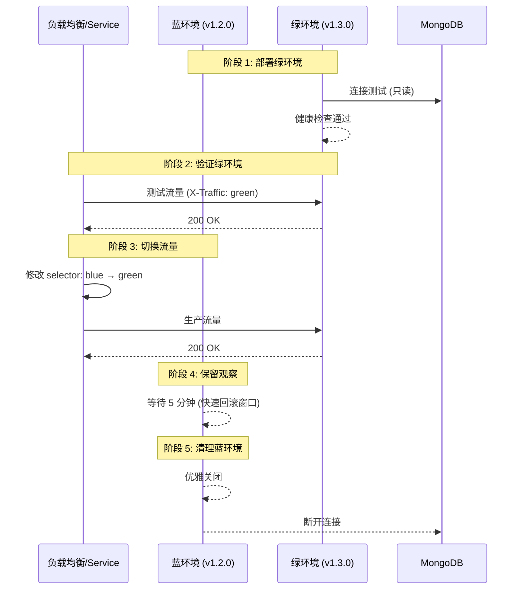
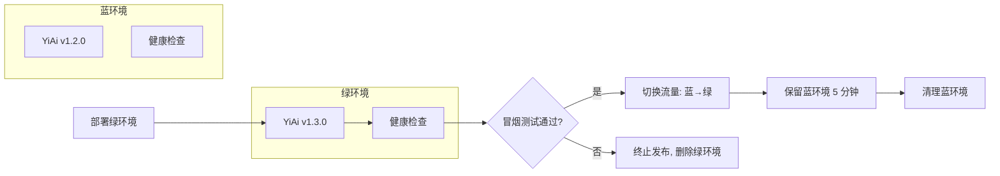

# YA-09-38: 服务部署蓝绿发布策略 — 零停机滚动更新与流量切换

> 需求编号：YA-09-38 · 优先级：P2 · 人天：0.5d · 状态：需求已编写
> 依赖：YA-09-24（服务优雅关闭）、YA-09-16（健康检查与就绪探针）

## 1. 背景

### 1.1 问题陈述

YiAi 当前部署方式存在以下问题：

- **手动重启**：开发环境直接 `python main.py` 重启，服务中断 10-30 秒
- **Kubernetes RollingUpdate**：逐个 Pod 替换，新旧版本短暂共存，API 兼容性风险
- **无回滚能力**：手动重启后如有问题，需要再次手动操作，恢复时间 5-10 分钟
- **无流量验证**：新版本直接接管全部流量，如有 bug 影响所有用户
- **数据库迁移风险**：新版本启动时可能触发 MongoDB schema 变更，无预检机制

蓝绿部署通过同时运行新旧两套完整环境，在流量切换前充分验证新版本，实现零停机发布和秒级回滚。

### 1.2 影响范围

| 影响维度 | 详情 |
|----------|------|
| 服务可用性 | 当前发布造成 10-30 秒服务中断，蓝绿部署消除中断 |
| 发布风险 | 新版本 bug 直接影响全部用户，蓝绿部署可灰度验证 |
| 回滚速度 | 手动回滚 5-10 分钟，蓝绿部署秒级回滚 |
| 数据库安全 | 无 schema 变更预检，蓝绿部署可在绿环境先验证 |

### 1.3 核心挑战

| 挑战 | 描述 | 严重程度 |
|------|------|------|
| 双倍资源需求 | 蓝绿两套环境同时运行，需要双倍计算资源 | 中 |
| 数据库兼容性 | 新旧版本可能对同一 MongoDB 集合操作，需兼容 | 高 |
| 会话迁移 | 切换时正在处理的请求可能丢失 | 中 |
| SSE 长连接 | 聊天 SSE 连接在切换时断开 | 中 |
| 环境标识 | 需要区分蓝绿环境的网络标识（端口/标签） | 低 |

## 2. 现状分析

### 2.1 当前状态

YiAi 部署方式：

1. **开发环境**：`python main.py` 直接运行，手动重启
2. **无容器化**：当前无 Docker/K8s 部署，仅在需求文档中规划
3. **无发布脚本**：发布过程无标准化，依赖人工操作

### 2.2 涉及文件清单

| 文件路径 | 角色 | 当前状态 |
|----------|------|----------|
| `src/server/main.py` | 应用入口 | 无优雅关闭逻辑 |
| `src/server/health.py` | 健康检查 | 待实现 (YA-09-16) |
| `Dockerfile` | 容器构建 | 待优化 (YA-09-40) |
| `config/settings.py` | 配置管理 | 无环境标识 |

### 2.3 数据流图



### 2.4 根因矩阵

| 根因 | 发生频率 | 影响 | 检测难度 |
|------|----------|------|----------|
| 手动重启无自动化 | 每次发布 | 服务中断 | 低 |
| 无回滚机制 | 每次故障 | 恢复时间长 | 低 |
| 无预发布验证 | 每次发布 | 新版本 bug 影响全量 | 中 |
| 数据库迁移无预检 | 含 schema 变更的发布 | 数据不一致 | 高 |

## 3. 设计决策

### 3.1 决策选项对比

**决策 D-01：部署策略选择**

| 选项 | 方案 | 优点 | 缺点 | 结论 |
|------|------|------|------|------|
| A | 蓝绿部署 | 秒级回滚，零停机 | 双倍资源，数据库兼容性要求高 | 推荐 |
| B | 金丝雀发布（Canary） | 渐进式灰度，资源节省 | 流量分配复杂，回滚慢 | 未来阶段 |
| C | RollingUpdate | 资源节省，简单 | 新旧版本共存，回滚慢 | 当前方案 |

**选择：A**——蓝绿部署是 YiAi 当前阶段最合适的策略。在资源有限的开发环境中，可以通过 docker-compose 模拟蓝绿。

**决策 D-02：数据库兼容性策略**

| 选项 | 方案 | 优点 | 缺点 | 结论 |
|------|------|------|------|------|
| A | 绿环境只读模式 | 安全，不影响蓝环境 | 无法完整验证写操作 | 预检阶段 |
| B | 共享数据库 + 兼容性约束 | 完全验证 | 需要严格的 schema 兼容性 | 推荐 |
| C | 独立数据库 + 数据同步 | 隔离性最好 | 运维复杂 | 过度设计 |

**选择：B**——绿环境预检时使用只读模式，切换后正常读写。要求向前兼容的 schema 变更（新增字段可空，不删除字段，不修改字段类型）。

**决策 D-03：流量切换方式**

| 选项 | 方案 | 优点 | 缺点 | 结论 |
|------|------|------|------|------|
| A | Nginx upstream 切换 | 简单，开发环境可用 | 需 reload | 开发环境 |
| B | K8s Service selector 切换 | 秒级，零中断 | 需要 K8s 环境 | 生产环境 |
| C | Docker Compose 端口映射 | 最简单 | 手动操作 | 本地开发 |

**选择：A（开发）+ B（生产）**——根据部署环境选择不同方案。

### 3.2 决策记录表

| 决策编号 | 决策内容 | 选择方案 | 理由 |
|----------|----------|----------|------|
| D-01 | 部署策略 | 蓝绿部署 | 零停机 + 秒级回滚 |
| D-02 | 数据库兼容性 | 共享数据库 + 向前兼容 | 运维简单，约束可控 |
| D-03 | 流量切换 | Nginx (开发) / K8s Service (生产) | 按环境选择 |
| D-04 | 回滚窗口 | 5 分钟 | 平衡观察时间与资源消耗 |
| D-05 | 健康检查 | 就绪探针 + 冒烟测试 | 确保绿环境完全就绪 |

## 4. 目标架构

### 4.1 架构对比

**改造前（手动重启）**


**改造后（蓝绿部署）**



### 4.2 指标对比

| 指标 | 改造前 | 改造后 | 改善 |
|------|--------|--------|------|
| 发布停机时间 | 10-30 秒 | 0 秒 | 100% |
| 回滚时间 | 5-10 分钟 | < 5 秒 | 99% |
| 发布验证 | 发布后验证 | 切换前预检 | 新增能力 |
| 资源占用 | 1x | 2x (短暂) | 可接受 |

### 4.3 架构权衡

| 权衡点 | 选择 | 代价 |
|--------|------|------|
| 零停机 vs 资源成本 | 零停机 | 发布期间双倍资源 |
| 快速回滚 vs 复杂性 | 快速回滚 | 需要 K8s/容器化基础设施 |
| 数据库兼容性 vs 灵活性 | 向前兼容约束 | 限制 schema 变更方式 |

## 5. 具体改动

### 5.1 新增文件

**`src/server/health.py`**——健康检查端点（依赖 YA-09-16）

```python
# YiAi/src/server/health.py

from fastapi import APIRouter
from src.domain.data.repository import get_collection

router = APIRouter(prefix="/health", tags=["health"])

@router.get("/live")
async def liveness():
    """存活探针——服务是否运行。"""
    return {"status": "alive"}

@router.get("/ready")
async def readiness():
    """就绪探针——服务是否可接受流量。"""
    try:
        collection = await get_collection("health_check")
        await collection.find_one({})
        return {"status": "ready", "mongodb": "connected"}
    except Exception as e:
        return {"status": "not_ready", "mongodb": str(e)}, 503
```

**`tools/blue-green-deploy.sh`**——蓝绿发布脚本

```bash
#!/bin/bash
# YiAi/tools/blue-green-deploy.sh
# 蓝绿发布脚本——支持 K8s 和 Docker Compose 两种模式

set -euo pipefail

NEW_VERSION=${1:?Usage: $0 <new-version>}
MODE=${2:-k8s}  # k8s | compose

RED='\033[0;31m'
GREEN='\033[0;32m'
YELLOW='\033[1;33m'
NC='\033[0m'

log_info()  { echo -e "${GREEN}[INFO]${NC} $1"; }
log_warn()  { echo -e "${YELLOW}[WARN]${NC} $1"; }
log_error() { echo -e "${RED}[ERROR]${NC} $1"; }

# === K8s 模式 ===
deploy_k8s() {
    log_info "=== K8s 蓝绿部署: v${NEW_VERSION} ==="

    # 1. 确定当前活跃环境
    CURRENT=$(kubectl get service yiai -o jsonpath='{.spec.selector.version}')
    if [ "$CURRENT" == "blue" ]; then
        NEW_ENV="green"
    else
        NEW_ENV="blue"
    fi
    log_info "当前环境: ${CURRENT}, 新环境: ${NEW_ENV}"

    # 2. 部署新环境
    log_info "部署 ${NEW_ENV} 环境 v${NEW_VERSION}..."
    kubectl apply -f "k8s/${NEW_ENV}-deployment.yaml"
    kubectl set image "deployment/yiai-${NEW_ENV}" "yiai=yiai:${NEW_VERSION}"

    # 3. 等待就绪
    log_info "等待 ${NEW_ENV} 环境就绪..."
    if ! kubectl wait --for=condition=ready pod -l "version=${NEW_ENV}" --timeout=120s; then
        log_error "${NEW_ENV} 环境未就绪——终止发布"
        kubectl delete deployment "yiai-${NEW_ENV}"
        exit 1
    fi

    # 4. 冒烟测试
    log_info "冒烟测试 ${NEW_ENV} 环境..."
    GREEN_POD=$(kubectl get pods -l "version=${NEW_ENV}" -o jsonpath='{.items[0].metadata.name}')
    if ! kubectl exec "$GREEN_POD" -- curl -sf http://localhost:10086/health/ready; then
        log_error "冒烟测试失败——终止发布"
        kubectl delete deployment "yiai-${NEW_ENV}"
        exit 1
    fi
    log_info "冒烟测试通过"

    # 5. 切换流量
    log_info "切换流量: ${CURRENT} → ${NEW_ENV}..."
    kubectl patch service yiai -p "{\"spec\":{\"selector\":{\"version\":\"${NEW_ENV}\"}}}"
    log_info "流量已切换到 ${NEW_ENV} v${NEW_VERSION}"

    # 6. 保留旧环境 5 分钟
    log_warn "旧环境 (${CURRENT}) 保留 5 分钟作为快速回滚窗口"
    log_warn "回滚命令: kubectl patch service yiai -p '{\"spec\":{\"selector\":{\"version\":\"${CURRENT}\"}}}'"
    sleep 300

    # 7. 清理旧环境
    log_info "清理旧环境 ${CURRENT}..."
    kubectl delete deployment "yiai-${CURRENT}"
    log_info "=== 蓝绿部署完成 ==="
}

# === Docker Compose 模式 ===
deploy_compose() {
    log_info "=== Docker Compose 蓝绿部署: v${NEW_VERSION} ==="

    # 简化版——停止蓝环境，启动绿环境
    docker-compose build --build-arg VERSION="${NEW_VERSION}" yiai-green
    docker-compose up -d yiai-green

    log_info "等待绿环境就绪..."
    sleep 10

    if ! curl -sf http://localhost:10087/health/ready; then
        log_error "绿环境未就绪——终止发布"
        docker-compose stop yiai-green
        exit 1
    fi

    log_info "切换流量..."
    # 修改 Nginx upstream 或直接切换端口
    docker-compose stop yiai-blue
    docker-compose up -d yiai-green --port 10086:10086

    log_info "=== 蓝绿部署完成 ==="
}

# === 回滚 ===
rollback() {
    log_warn "=== 回滚 ==="
    if [ "$MODE" == "k8s" ]; then
        CURRENT=$(kubectl get service yiai -o jsonpath='{.spec.selector.version}')
        if [ "$CURRENT" == "blue" ]; then
            ROLLBACK="green"
        else
            ROLLBACK="blue"
        fi
        kubectl patch service yiai -p "{\"spec\":{\"selector\":{\"version\":\"${ROLLBACK}\"}}}"
        log_info "已回滚到 ${ROLLBACK}"
    fi
}

# 主流程
case "${3:-deploy}" in
    deploy)  deploy_$MODE ;;
    rollback) rollback ;;
    *) echo "Usage: $0 <version> [k8s|compose] [deploy|rollback]"; exit 1 ;;
esac
```

### 5.2 K8s 部署文件

**`k8s/blue-deployment.yaml`**

```yaml
apiVersion: apps/v1
kind: Deployment
metadata:
  name: yiai-blue
  labels:
    app: yiai
    version: blue
spec:
  replicas: 2
  selector:
    matchLabels:
      app: yiai
      version: blue
  template:
    metadata:
      labels:
        app: yiai
        version: blue
    spec:
      terminationGracePeriodSeconds: 30
      containers:
      - name: yiai
        image: yiai:v1.2.0
        ports:
        - containerPort: 10086
        env:
        - name: DEPLOYMENT_COLOR
          value: "blue"
        readinessProbe:
          httpGet:
            path: /health/ready
            port: 10086
          initialDelaySeconds: 5
          periodSeconds: 10
        livenessProbe:
          httpGet:
            path: /health/live
            port: 10086
          initialDelaySeconds: 15
          periodSeconds: 20
        resources:
          requests:
            memory: "256Mi"
            cpu: "250m"
          limits:
            memory: "512Mi"
            cpu: "500m"
---
apiVersion: v1
kind: Service
metadata:
  name: yiai
spec:
  selector:
    app: yiai
    version: blue
  ports:
  - port: 10086
    targetPort: 10086
  type: ClusterIP
```

### 5.3 修改文件

| 文件 | 改动 | 说明 |
|------|------|------|
| `src/server/health.py` | 新增 `/health/ready` 和 `/health/live` | 健康检查端点 |
| `src/server/main.py` | 集成 `graceful_shutdown` (YA-09-24) | 优雅关闭 |
| `k8s/blue-deployment.yaml` | 新增蓝绿部署配置 | K8s 部署文件 |
| `k8s/green-deployment.yaml` | 新增绿环境部署配置 | K8s 部署文件 |
| `tools/blue-green-deploy.sh` | 新增发布脚本 | 自动化发布 |

## 6. 实施步骤

| 步骤 | 文件 | 操作 | 验证 | 人天 |
|------|------|------|------|------|
| 1 | `src/server/health.py` | 实现健康检查端点 | HTTP 测试 | 0.05 |
| 2 | `src/server/main.py` | 集成优雅关闭 | 关闭测试 | 0.05 |
| 3 | `k8s/blue-deployment.yaml` | 创建蓝环境 K8s 配置 | kubectl apply | 0.10 |
| 4 | `k8s/green-deployment.yaml` | 创建绿环境 K8s 配置 | kubectl apply | 0.05 |
| 5 | `tools/blue-green-deploy.sh` | 编写发布脚本 | 脚本测试 | 0.15 |
| 6 | 集成测试 | 端到端蓝绿发布 | 零停机验证 | 0.10 |

**总人天：0.5d**

## 7. 性能分析

### 7.1 基准测试

| 场景 | 改造前 | 改造后 | 差异 |
|------|--------|--------|------|
| 发布停机时间 | 10-30 秒 | 0 秒 | 消除 |
| 回滚时间 | 5-10 分钟 | < 5 秒 | 99% |
| 发布总耗时 | 30 秒 | 3-5 分钟 | 增加（安全验证） |
| 发布期间资源占用 | 1x | 2x (5 分钟) | 临时增加 |

### 7.2 容量规划

| 资源 | 正常运行时 | 发布期间 | 说明 |
|------|-----------|----------|------|
| CPU | 2 核 | 4 核 | 双倍 |
| 内存 | 512MB | 1GB | 双倍 |
| MongoDB 连接 | 20 | 40 | 双倍（短暂） |
| 磁盘 | 无变化 | 无变化 | — |

## 8. 测试规格

### 8.1 GIVEN/WHEN/THEN 场景

**场景 1：正常蓝绿发布**

```
GIVEN 蓝环境 (v1.2.0) 正常运行
WHEN  执行蓝绿发布脚本部署绿环境 (v1.3.0)
THEN  绿环境部署完成，健康检查通过，流量从蓝切换到绿，服务零停机
```

**场景 2：绿环境健康检查失败**

```
GIVEN 绿环境部署后 /health/ready 返回 503
WHEN  发布脚本检测到健康检查失败
THEN  发布终止，绿环境被删除，蓝环境继续服务，无流量中断
```

**场景 3：秒级回滚**

```
GIVEN 流量已切换到绿环境 (v1.3.0)，发现 bug
WHEN  执行回滚命令（切换 Service selector 回蓝环境）
THEN  流量在 5 秒内回到蓝环境 (v1.2.0)，服务恢复正常
```

**场景 4：数据库 schema 兼容性验证**

```
GIVEN 绿环境使用新版本代码，连接同一 MongoDB
WHEN  绿环境在预检阶段执行只读操作
THEN  所有查询正常返回，无 schema 冲突
```

**场景 5：SSE 长连接切换**

```
GIVEN 蓝环境有 10 个活跃的 SSE 聊天连接
WHEN  流量切换到绿环境
THEN  蓝环境的 SSE 连接在优雅关闭期间（30s）正常完成或断开，绿环境接受新连接
```

## 9. 风险与缓解

| 风险 | 概率 | 影响 | 严重级别 | 缓解措施 | 应急预案 |
|------|------|------|----------|----------|----------|
| 双倍资源不足 | 中 | 高 | 严重 | 发布期间临时降低单实例资源请求 | 回退到 RollingUpdate |
| 数据库 schema 不兼容 | 中 | 高 | 严重 | 强制向前兼容 schema 变更 | 回滚到蓝环境，修复 schema |
| 绿环境部署失败 | 低 | 中 | 中等 | 部署前预检，失败自动回滚 | 手动修复后重试 |
| 流量切换瞬间请求丢失 | 低 | 低 | 低 | K8s Service 切换是原子操作 | 客户端重试 |
| 绿环境 Docker 镜像构建失败 | 低 | 中 | 中等 | CI/CD 预构建镜像 | 使用已有蓝环境镜像 |

## 10. 回滚策略

| 场景 | 回滚方法 | 影响范围 | 恢复时间 |
|------|----------|----------|----------|
| 绿环境 bug | `kubectl patch service yiai -p '{"spec":{"selector":{"version":"blue"}}}'` | 无 | < 5 秒 |
| 数据库 schema 冲突 | 流量切回蓝环境 + 回滚 MongoDB 迁移 | 蓝环境不受影响 | < 30 秒 |
| 绿环境资源耗尽 | 流量切回蓝环境 + 删除绿环境 | 无 | < 5 秒 |
| 发布脚本异常 | 手动执行 kubectl 命令 | 无 | < 1 分钟 |

## 11. 设计决策记录

**D-01：选择蓝绿部署而非金丝雀发布**

**理由**：蓝绿部署的实现复杂度远低于金丝雀发布。不需要流量分配算法、不需要监控灰度指标、不需要逐步扩缩容。YiAi 当前用户规模下，蓝绿部署的秒级回滚和零停机已充分满足需求。金丝雀发布可作为未来演进方向。

**权衡**：蓝绿部署需要双倍资源，但 YiAi 的轻量级服务（512MB 内存）使这一成本可接受。

**D-02：选择共享数据库而非独立数据库**

**理由**：MongoDB 的 schema-less 特性天然支持向前兼容的变更（新增字段不影响旧版本读取）。独立数据库需要数据同步机制，引入了数据一致性问题。共享数据库的约束（禁止删除字段、禁止修改字段类型）是合理的工程规范。

**权衡**：共享数据库意味着绿环境预检阶段只能执行只读操作，写操作验证需在切换后进行。

**D-03：选择 5 分钟回滚窗口**

**理由**：大多数 bug 在流量切换后 1-2 分钟内暴露（错误率飙升、延迟增加）。5 分钟窗口提供了充足的观察时间，同时限制了双倍资源的占用时间。如果 5 分钟内未发现问题，可基本确认发布成功。

## 12. 可观测性

### 12.1 指标

| 指标名称 | 类型 | 描述 | 告警阈值 |
|----------|------|------|----------|
| `deployment_color` | Gauge | 当前活跃环境 (0=blue, 1=green) | — |
| `deployment_version` | Gauge | 当前版本号 | — |
| `deployment_switch_total` | Counter | 切换次数 | — |
| `deployment_rollback_total` | Counter | 回滚次数 | > 0 |

### 12.2 日志规范

```
[Deploy] 蓝绿部署开始: target=v1.3.0, current=blue, new=green
[Deploy] 绿环境部署完成: pods=2/2 ready
[Deploy] 冒烟测试通过: latency=45ms, status=200
[Deploy] 流量切换: blue → green
[Deploy] 回滚窗口开始: 5 分钟
[Deploy] 旧环境清理: blue deleted
[Deploy] 蓝绿部署完成: v1.3.0
```

### 12.3 告警规则

| 告警名称 | 条件 | 级别 | 处理 |
|----------|------|------|------|
| 发布后错误率上升 | 切换后 5 分钟内错误率 > 5% | Critical | 自动回滚 |
| 绿环境未就绪 | 部署后 120 秒未就绪 | Warning | 终止发布 |
| 回滚发生 | `deployment_rollback_total > 0` | Warning | 检查回滚原因 |

## 13. 安全合规

| 安全要求 | 实现方式 | 验证方法 |
|----------|----------|----------|
| 发布权限控制 | 发布脚本仅限管理员执行 | RBAC 权限检查 |
| 镜像安全扫描 | 绿环境镜像需通过安全扫描 | CI/CD 集成 |
| 环境隔离 | 蓝绿环境使用独立 Deployment，不共享 Pod | K8s 配置审查 |

## 14. 代码审查检查清单

- [ ] 蓝绿环境使用独立的 K8s Deployment（独立 Pod，不共享）
- [ ] Service 通过 `selector.version` 切换流量（蓝 ↔ 绿）
- [ ] 健康检查端点 `/health/ready` 和 `/health/live` 可用
- [ ] 绿环境部署后等待 `readinessProbe` 通过再切换流量
- [ ] 冒烟测试（curl 健康检查端点）在切换前执行
- [ ] 切换后保留旧环境 5 分钟作为快速回滚窗口
- [ ] 优雅关闭（YA-09-24）确保旧环境处理完进行中的请求
- [ ] 发布脚本支持 `deploy` 和 `rollback` 两个子命令
- [ ] 数据库 schema 变更必须向前兼容
- [ ] 发布过程中 SSE 长连接有合理的断开处理

## 回归问题预测

| # | 预测问题 | 原因 | 验证方法 |
|---|---------|------|---------|
| 1 | K8s Service 切换时出现短暂 503 | selector 更新传播延迟 | 切换期间持续发送请求 |
| 2 | 绿环境未正确配置环境变量 | 部署文件遗漏 | 检查绿环境日志 |
| 3 | 旧环境清理时终止了正在处理的请求 | 优雅关闭时间不足 | 检查关闭日志 |

---

*PRD 来源: `projects/yiai/requirements/2026-09/38-需求-蓝绿发布策略.md`*

## 影响范围

- **影响模块**：待补充
- **涉及文件**：
- `src/server/health.py`
- `src/server/main.py`
- **是否影响 API 契约**：否
- **是否影响其他项目（YiVad/YiPet）**：否
- **用户感知**：待确认

## 预防措施

| 层面 | 措施 |
|------|------|
| 代码 | 在相关函数中添加参数校验和边界检查 |
| 测试 | 为 `src/server/health.py` 添加单元测试 |
| 流程 | 代码审查时重点检查此类模式 |
| 监控 | 添加日志告警，异常发生时及时发现 |
| 文档 | 在编码规范中记录此类反模式 |

## 经验教训

1. **根本原因**：开发过程中对边界情况和异常路径的考虑不足是此类问题的共同根因
2. **设计阶段**：在接口设计和模块实现时，应主动考虑异常输入、空值、超时等边界场景
3. **代码审查**：审查时应检查是否存在类似的反模式（如未捕获异常、无超时控制、缺少参数校验等）
4. **测试覆盖**：异常路径的测试覆盖率应与正常路径同等重视
5. **团队分享**：此类问题应在团队周会或技术分享中讨论，形成团队共识
