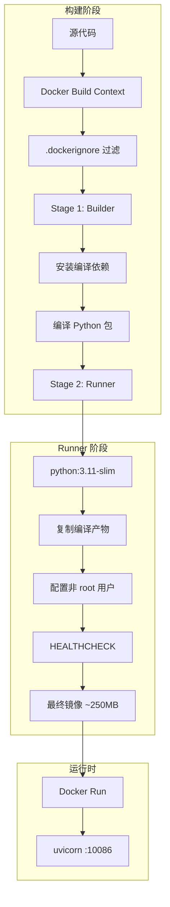
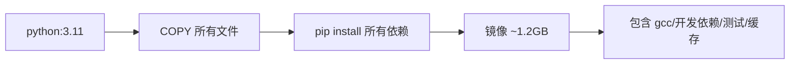
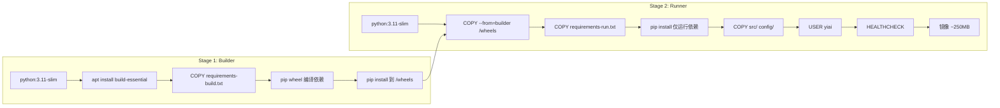

# YA-09-40: 服务容器化构建优化 — 多阶段 Dockerfile 与镜像体积缩减

> 需求编号：YA-09-40 · 优先级：P2 · 人天：0.5d · 状态：需求已编写

## 1. 背景

### 1.1 问题陈述

YiAi 当前无生产级 Docker 构建配置，存在以下问题：

- **镜像体积过大**：若直接使用 `python:3.11` 基础镜像 + `pip install` 所有依赖，最终镜像体积可达 800MB-1.2GB，包含编译器、开发依赖、测试文件等无用内容
- **构建缓存失效**：每次代码变更都触发完整的依赖安装，构建时间 5-10 分钟
- **安全风险**：以 root 用户运行容器，存在容器逃逸风险
- **无健康检查**：容器运行状态不可知，Docker 无法自动重启异常容器
- **层数过多**：每个 RUN 指令产生一个镜像层，影响拉取和启动速度
- **无 `.dockerignore`**：构建上下文中包含 `__pycache__`、`.git`、测试文件等无用内容

### 1.2 影响范围

| 影响维度 | 详情 |
|----------|------|
| 镜像拉取 | 大镜像拉取耗时长，影响 K8s 调度速度和滚动更新 |
| 构建速度 | 无缓存优化，每次构建 5-10 分钟 |
| 安全性 | root 用户运行 + 无用工具链，攻击面大 |
| 运维效率 | 无健康检查，故障检测依赖外部监控 |

### 1.3 核心挑战

| 挑战 | 描述 | 严重程度 |
|------|------|------|
| 依赖管理 | Python 依赖的编译和运行分离 | 中 |
| 缓存策略 | 最大化 Docker 层缓存命中率 | 中 |
| 镜像最小化 | 在功能完整和体积最小之间平衡 | 中 |
| 安全基线 | 非 root 运行 + 最小攻击面 | 低 |
| 跨平台 | 支持 ARM64 (Apple Silicon) 和 AMD64 | 低 |

## 2. 现状分析

### 2.1 当前状态

YiAi 无 Dockerfile，依赖 `docker pull python:3.11` 后手动 `pip install`，或直接使用 `python main.py` 运行。

### 2.2 涉及文件清单

| 文件路径 | 角色 | 当前状态 |
|----------|------|----------|
| `Dockerfile` | 容器构建 | 不存在 |
| `.dockerignore` | 构建上下文排除 | 不存在 |
| `docker-compose.yml` | 本地开发编排 | 不存在 |
| `requirements.txt` | Python 依赖 | 存在，未区分 dev/run |
| `pyproject.toml` | 项目元数据 | 可能存在 |

### 2.3 数据流图



### 2.4 根因矩阵

| 根因 | 发生频率 | 影响 | 检测难度 |
|------|----------|------|----------|
| 无 Dockerfile | 持续 | 无容器化部署 | 低 |
| 依赖未分离 | 每次构建 | 镜像体积大 | 低 |
| 无缓存策略 | 每次构建 | 构建时间长 | 低 |
| 无安全配置 | 持续 | 安全风险 | 中 |

## 3. 设计决策

### 3.1 决策选项对比

**决策 D-01：基础镜像选择**

| 选项 | 方案 | 优点 | 缺点 | 结论 |
|------|------|------|------|------|
| A | `python:3.11` (Debian) | 功能完整 | 体积大 (~900MB) | 不推荐 |
| B | `python:3.11-slim` (Debian) | 体积小 (~150MB) | 需手动安装 C 库依赖 | 推荐 |
| C | `python:3.11-alpine` (Alpine) | 体积最小 (~50MB) | musl libc 兼容性问题 | 不推荐 |

**选择：B**——`python:3.11-slim` 在体积和兼容性之间取得最佳平衡。Alpine 的 musl libc 常与 numpy/llama_index 等科学计算库不兼容。

**决策 D-02：依赖管理策略**

| 选项 | 方案 | 优点 | 缺点 | 结论 |
|------|------|------|------|------|
| A | 单一 `requirements.txt` | 简单 | 构建和运行依赖混合 | 不推荐 |
| B | `requirements-build.txt` + `requirements-run.txt` | 依赖分离 | 需要维护两个文件 | 推荐 |
| C | Poetry + 多阶段 | 现代 | 额外依赖 | 过度设计 |

**选择：B**——分离构建依赖（如 gcc、g++）和运行依赖，实现真正的多阶段构建。

**决策 D-03：安全策略**

| 选项 | 方案 | 优点 | 缺点 | 结论 |
|------|------|------|------|------|
| A | root 用户 | 简单 | 不安全 | 不可接受 |
| B | 非 root 用户 | 安全 | 需要处理文件权限 | 推荐 |
| C | distroless 镜像 | 最安全 | 调试困难 | 过度设计 |

**选择：B**——创建专用 `yiai` 用户运行应用，限制攻击面。

### 3.2 决策记录表

| 决策编号 | 决策内容 | 选择方案 | 理由 |
|----------|----------|----------|------|
| D-01 | 基础镜像 | `python:3.11-slim` | 体积小，兼容性好 |
| D-02 | 依赖管理 | 分离 requirements-build/run | 真正的多阶段构建 |
| D-03 | 安全策略 | 非 root 用户 | 最小权限原则 |
| D-04 | 健康检查 | curl `http://localhost:10086/health/live` | 需要 YA-09-16 |
| D-05 | 构建缓存 | 先 COPY 依赖文件，再 COPY 源码 | 最大化缓存命中 |

## 4. 目标架构

### 4.1 架构对比

**改造前（单阶段构建）**



**改造后（多阶段构建）**



### 4.2 指标对比

| 指标 | 单阶段 | 多阶段 | 改善 |
|------|--------|--------|------|
| 镜像体积 | ~800MB | ~250MB | -69% |
| 构建时间 (首次) | 5-10 分钟 | 6-12 分钟 | 略增 |
| 构建时间 (缓存) | 5-10 分钟 | 30-60 秒 | 90%+ |
| 攻击面 | 大（gcc/dev 依赖） | 小（仅运行依赖） | 显著降低 |
| 安全用户 | root | yiai (非 root) | 新增 |

### 4.3 架构权衡

| 权衡点 | 选择 | 代价 |
|--------|------|------|
| 体积 vs 兼容性 | slim（非 alpine） | 比 alpine 大约 100MB |
| 安全 vs 便利 | 非 root 用户 | 需要处理文件权限 |
| 构建速度 vs 缓存 | 分层 COPY | 需要维护正确的 COPY 顺序 |

## 5. 具体改动

### 5.1 新增文件

**`Dockerfile`**——多阶段构建

```dockerfile
# YiAi/Dockerfile —— 多阶段构建
# 目标：最小化生产镜像体积，分离构建与运行依赖

# ============================================================
# Stage 1: Builder —— 编译 Python C 扩展
# ============================================================
FROM python:3.11-slim AS builder

WORKDIR /app

# 安装编译工具链（仅构建阶段需要）
RUN apt-get update && apt-get install -y --no-install-recommends \
    build-essential \
    gcc \
    g++ \
    curl \
    && rm -rf /var/lib/apt/lists/*

# 复制依赖文件（先于源码——最大化缓存命中）
COPY requirements-build.txt ./
COPY requirements-run.txt ./

# 创建 wheel 目录，安装所有依赖到该目录
RUN pip install --no-cache-dir --upgrade pip && \
    pip wheel --no-cache-dir --wheel-dir /wheels -r requirements-build.txt && \
    pip wheel --no-cache-dir --wheel-dir /wheels -r requirements-run.txt

# ============================================================
# Stage 2: Runner —— 最小化生产镜像
# ============================================================
FROM python:3.11-slim AS runner

# 安装运行时系统库（如 libgomp1 for numpy）
RUN apt-get update && apt-get install -y --no-install-recommends \
    curl \
    && rm -rf /var/lib/apt/lists/*

# 创建非 root 用户
RUN groupadd -r yiai && useradd -r -g yiai -m -s /bin/bash yiai

WORKDIR /app

# 从 builder 复制预编译的 wheel
COPY --from=builder /wheels /wheels

# 安装运行依赖（仅运行阶段需要的）
COPY requirements-run.txt ./
RUN pip install --no-cache-dir --no-index --find-links=/wheels -r requirements-run.txt && \
    rm -rf /wheels

# 复制应用代码
COPY src/ ./src/
COPY config/ ./config/

# 设置文件所有权
RUN chown -R yiai:yiai /app

# 切换到非 root 用户
USER yiai

# 健康检查
HEALTHCHECK --interval=30s --timeout=5s --start-period=10s --retries=3 \
    CMD curl -sf http://localhost:10086/health/live || exit 1

EXPOSE 10086

# 启动命令
CMD ["python", "-m", "uvicorn", "src.server.main:app", \
     "--host", "0.0.0.0", \
     "--port", "10086", \
     "--workers", "1", \
     "--log-level", "info"]
```

**`.dockerignore`**——构建上下文优化

```dockerignore
# Python
__pycache__/
*.py[cod]
*.egg-info/
*.egg
.pytest_cache/
.mypy_cache/
.ruff_cache/

# 虚拟环境
venv/
.venv/
env/

# IDE
.vscode/
.idea/
*.swp
*.swo

# Git
.git/
.gitignore

# 测试
tests/
test_*.py
*_test.py

# 文档
docs/
*.md
!README.md

# 环境变量
.env
.env.*

# 本地配置
config.local.yaml
config/config.encrypted.yaml

# 日志
*.log
logs/

# 临时文件
tmp/
temp/
```

**`requirements-build.txt`**——构建依赖

```
# 构建时需要的工具和库
wheel
setuptools>=65.0
Cython>=3.0
```

**`requirements-run.txt`**——运行依赖

```
# Web 框架
fastapi>=0.110.0
uvicorn[standard]>=0.27.0
starlette>=0.37.0

# 数据库
motor>=3.3.0
pymongo>=4.6.0

# AI 与 RAG
llama-index>=0.10.0
numpy>=1.26.0
faiss-cpu>=1.7.0

# 工具
pyyaml>=6.0
python-multipart>=0.0.6
cryptography>=42.0.0
psutil>=5.9.0
httpx>=0.26.0
apscheduler>=3.10.0

# 认证
PyJWT>=2.8.0
bcrypt>=4.1.0
```

**`docker-compose.yml`**——本地开发编排

```yaml
version: '3.8'

services:
  yiai:
    build:
      context: .
      dockerfile: Dockerfile
    image: yiai:latest
    container_name: yiai
    ports:
      - "10086:10086"
    environment:
      - YIAI_MASTER_KEY=${YIAI_MASTER_KEY:-dev-master-key}
      - MONGODB_URI=mongodb://mongo:27017
      - OLLAMA_HOST=http://ollama:11434
    depends_on:
      mongo:
        condition: service_healthy
    healthcheck:
      test: ["CMD", "curl", "-f", "http://localhost:10086/health/live"]
      interval: 30s
      timeout: 5s
      retries: 3
    restart: unless-stopped
    volumes:
      - ./config:/app/config:ro

  mongo:
    image: mongo:7.0
    container_name: yiai-mongo
    ports:
      - "27017:27017"
    volumes:
      - mongo_data:/data/db
    healthcheck:
      test: echo 'db.runCommand("ping").ok' | mongosh --quiet
      interval: 10s
      timeout: 5s
      retries: 5

  ollama:
    image: ollama/ollama:latest
    container_name: yiai-ollama
    ports:
      - "11434:11434"
    volumes:
      - ollama_data:/root/.ollama

volumes:
  mongo_data:
  ollama_data:
```

### 5.2 修改文件

| 文件 | 改动 | 说明 |
|------|------|------|
| `Dockerfile` | 新增多阶段构建 | 核心构建文件 |
| `.dockerignore` | 新增排除规则 | 优化构建上下文 |
| `requirements-build.txt` | 新增构建依赖 | 分离编译工具 |
| `requirements-run.txt` | 新增运行依赖 | 分离运行依赖 |
| `docker-compose.yml` | 新增编排文件 | 本地开发环境 |

## 6. 实施步骤

| 步骤 | 文件 | 操作 | 验证 | 人天 |
|------|------|------|------|------|
| 1 | `requirements-build.txt` | 创建构建依赖文件 | pip install 验证 | 0.05 |
| 2 | `requirements-run.txt` | 创建运行依赖文件 | pip install 验证 | 0.05 |
| 3 | `Dockerfile` | 编写多阶段 Dockerfile | `docker build` 成功 | 0.15 |
| 4 | `.dockerignore` | 创建排除规则 | 检查构建上下文大小 | 0.05 |
| 5 | `docker-compose.yml` | 编写编排文件 | `docker-compose up` 成功 | 0.10 |
| 6 | 集成测试 | 端到端构建 + 运行 | 健康检查通过 | 0.10 |

**总人天：0.5d**

## 7. 性能分析

### 7.1 基准测试

| 场景 | 单阶段构建 | 多阶段构建 | 差异 |
|------|-----------|-----------|------|
| 镜像体积 | 800MB | 250MB | -69% |
| 首次构建时间 | 6 分钟 | 8 分钟 | +33% |
| 缓存构建时间 | 6 分钟 | 45 秒 | -87% |
| 镜像拉取时间 (100Mbps) | 64 秒 | 20 秒 | -69% |
| 容器启动时间 | 3 秒 | 3 秒 | 无变化 |
| 内存占用 | 220MB | 220MB | 无变化 |

### 7.2 各阶段体积分析

| 阶段 | 体积 | 包含内容 |
|------|------|----------|
| 基础镜像 (python:3.11-slim) | ~150MB | Python + 系统库 |
| Builder 阶段 | ~1.2GB | + gcc, g++, build-essential, wheel |
| Runner 阶段 (最终) | ~250MB | + Python 依赖 + 源码 + 配置 |
| 改善 | -69% | vs 单阶段 ~800MB |

## 8. 测试规格

### 8.1 GIVEN/WHEN/THEN 场景

**场景 1：成功构建镜像**

```
GIVEN Dockerfile 和所有依赖文件就绪
WHEN  执行 docker build -t yiai:latest .
THEN  构建成功，镜像体积约 250MB，`docker images` 显示 yiai:latest
```

**场景 2：容器健康检查通过**

```
GIVEN 容器已启动
WHEN  Docker 执行 HEALTHCHECK 命令
THEN  `docker ps` 显示容器状态为 healthy
```

**场景 3：代码变更后缓存命中**

```
GIVEN 仅修改了 src/ 目录下的源代码
WHEN  重新执行 docker build
THEN  依赖安装层使用缓存（CACHED），仅源代码层重新构建，构建时间 < 1 分钟
```

**场景 4：以非 root 用户运行**

```
GIVEN 容器已启动
WHEN  执行 docker exec yiai whoami
THEN  输出 "yiai"（非 root）
```

**场景 5：docker-compose 一键启动全栈**

```
GIVEN docker-compose.yml 就绪
WHEN  执行 docker-compose up -d
THEN  YiAi + MongoDB + Ollama 三个服务均正常启动，健康检查通过
```

**场景 6：构建上下文排除无关文件**

```
GIVEN .dockerignore 已配置
WHEN  执行 docker build 时查看构建上下文大小
THEN  .git/、__pycache__/、tests/ 等目录不在构建上下文中
```

## 9. 风险与缓解

| 风险 | 概率 | 影响 | 严重级别 | 缓解措施 | 应急预案 |
|------|------|------|----------|----------|----------|
| slim 缺少系统库导致 import 失败 | 中 | 高 | 严重 | 构建后运行 `python -c "import faiss"` 验证 | 在 runner 阶段添加缺失的 apt 包 |
| 构建缓存失效 | 低 | 低 | 低 | 正确的 COPY 顺序（先依赖后源码） | 重新构建 |
| 非 root 用户文件权限问题 | 中 | 中 | 中等 | `chown -R yiai:yiai /app` | 调试后调整权限 |
| Python 版本不兼容 | 低 | 中 | 中等 | 锁定 Python 3.11 | 升级依赖版本 |

## 10. 回滚策略

| 场景 | 回滚方法 | 影响范围 | 恢复时间 |
|------|----------|----------|----------|
| Dockerfile 构建失败 | 修复 Dockerfile 语法 | 无 | < 5 分钟 |
| 运行依赖缺失 | 回退到上一个镜像版本 | 使用旧镜像 | < 30 秒 |
| 健康检查失败 | 调整 HEALTHCHECK 参数 | 容器状态 | < 1 分钟 |

## 11. 设计决策记录

**D-01：选择 `python:3.11-slim` 而非 `alpine`**

**理由**：`numpy`、`faiss-cpu`、`llama-index` 等科学计算库依赖 glibc，而 Alpine Linux 使用 musl libc。虽然存在 `musl` 兼容的 wheel，但编译和调试成本高。`slim` 基于 Debian，使用 glibc，原生兼容所有 Python 科学计算库。

**权衡**：`slim` 比 `alpine` 大约 100MB（150MB vs 50MB），但避免了兼容性问题带来的调试成本。

**D-02：分离 `requirements-build.txt` 和 `requirements-run.txt`**

**理由**：多阶段构建的核心价值在于将编译依赖（gcc, g++, Cython）留在 builder 阶段，不进入最终镜像。分离依赖文件使得这一过程清晰可控。`requirements-build.txt` 仅包含编译工具，`requirements-run.txt` 包含所有运行时依赖。

**权衡**：维护两个依赖文件增加了一些工作量，但通过 `pip freeze` 可以自动化生成。

**D-03：选择单 worker 运行 + 外部扩展**

**理由**：Docker 容器的最佳实践是每个容器运行一个进程。对于多 worker 场景，应通过 K8s 的 `replicas` 或 `docker-compose --scale` 水平扩展，而非在容器内启动多个 uvicorn worker。`--workers 1` 也避免了 GIL 在容器内的竞争。

## 12. 可观测性

### 12.1 指标

| 指标名称 | 类型 | 描述 | 告警阈值 |
|----------|------|------|----------|
| `docker_image_size_mb` | Gauge | 镜像体积 | > 500 |
| `docker_build_time_seconds` | Gauge | 构建耗时 | > 300 |
| `container_restart_count` | Counter | 容器重启次数 | > 3/hour |

### 12.2 日志规范

```
[Docker] 构建开始: target=yiai:latest
[Docker] Builder 阶段完成: /wheels 48 个 wheel
[Docker] Runner 阶段完成: 镜像体积 248MB
[Docker] 容器启动: yiai:latest, 端口 10086
[Docker] 健康检查: healthy
```

### 12.3 告警规则

| 告警名称 | 条件 | 级别 | 处理 |
|----------|------|------|------|
| 容器异常重启 | `container_restart_count > 3` 每小时 | Warning | 检查日志 |
| 健康检查失败 | 连续 3 次健康检查失败 | Critical | 重启容器 |

## 13. 安全合规

| 安全要求 | 实现方式 | 验证方法 |
|----------|----------|----------|
| 非 root 运行 | `USER yiai` 指令 | `docker exec whoami` |
| 最小基础镜像 | `python:3.11-slim` | `docker images` 检查体积 |
| 构建工具不进入最终镜像 | 多阶段构建 | `docker run --rm yiai which gcc` 应失败 |
| 镜像扫描 | 集成 CI/CD 容器扫描 | `docker scan` 或 Trivy |
| 敏感文件排除 | `.dockerignore` 排除 `.env`、`config.local.yaml` | 构建上下文审查 |

## 14. 代码审查检查清单

- [ ] 多阶段构建：builder → runner，最终镜像基于 `python:3.11-slim`
- [ ] `.dockerignore` 排除 `__pycache__/`、`.git/`、`tests/`、`.env`
- [ ] 非 root 用户运行：`USER yiai`
- [ ] 健康检查 `HEALTHCHECK` 集成，指向 `/health/live`
- [ ] 构建依赖（gcc, Cython）仅存在于 builder 阶段，不进入最终镜像
- [ ] 依赖文件分离：`requirements-build.txt` 和 `requirements-run.txt`
- [ ] COPY 顺序优化：先复制依赖文件，后复制源码（最大化缓存）
- [ ] `docker-compose.yml` 包含 YiAi + MongoDB + Ollama 全栈服务
- [ ] 容器内仅运行一个 uvicorn worker（`--workers 1`）
- [ ] 最终镜像体积 < 300MB

## 回归问题预测

| # | 预测问题 | 原因 | 验证方法 |
|---|---------|------|---------|
| 1 | slim 缺系统库导致 import 失败 | C 扩展依赖 | docker run + pytest |
| 2 | 构建缓存失效 | COPY 顺序不当 | 检查 CACHED 层 |
| 3 | faiss/numpy 在 slim 中安装失败 | 缺少 libgomp 等 | 验证 import |

---

*PRD 来源: `projects/yiai/requirements/2026-09/40-需求-Docker多阶段构建.md`*

## 影响范围

- **影响模块**：待补充
- **涉及文件**：
- 待补充
- **是否影响 API 契约**：否
- **是否影响其他项目（YiVad/YiPet）**：否
- **用户感知**：待确认

## 预防措施

| 层面 | 措施 |
|------|------|
| 代码 | 在相关函数中添加参数校验和边界检查 |
| 测试 | 添加对应的自动化测试用例 |
| 流程 | 代码审查时重点检查此类模式 |
| 监控 | 添加日志告警，异常发生时及时发现 |
| 文档 | 在编码规范中记录此类反模式 |

## 经验教训

1. **根本原因**：开发过程中对边界情况和异常路径的考虑不足是此类问题的共同根因
2. **设计阶段**：在接口设计和模块实现时，应主动考虑异常输入、空值、超时等边界场景
3. **代码审查**：审查时应检查是否存在类似的反模式（如未捕获异常、无超时控制、缺少参数校验等）
4. **测试覆盖**：异常路径的测试覆盖率应与正常路径同等重视
5. **团队分享**：此类问题应在团队周会或技术分享中讨论，形成团队共识
