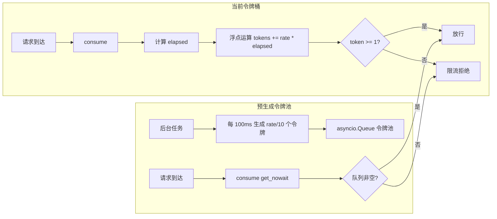
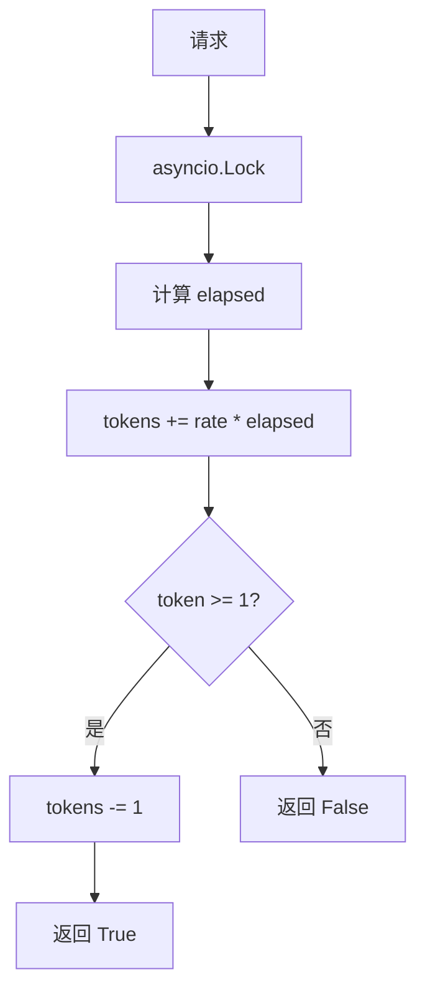
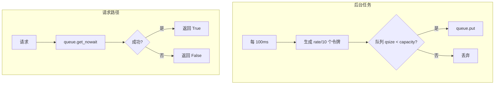

# YA-09-41: 服务端请求限速令牌预生成 — 令牌池批量预热与高并发优化

> 需求编号：YA-09-41 · 优先级：P2 · 人天：0.5d · 状态：需求已编写
> 依赖：YA-09-12（API 限流与并发控制）

## 1. 背景

### 1.1 问题陈述

YA-09-12 实现了基于令牌桶的 API 限流，使用标准算法：每次 `consume()` 调用时计算 `elapsed * rate` 来补充令牌。在高并发场景下，这一设计存在性能问题：

- **浮点运算开销**：每次请求都执行 `time.monotonic() - last_refill` 和乘法运算，1000 QPS 下每秒 1000 次浮点计算
- **CPU 缓存污染**：每次 `consume()` 更新 `last_refill` 时间戳，导致 CPU 缓存行频繁失效
- **不精确的时间测量**：`time.monotonic()` 在不同平台精度不同（Linux 1ns, macOS 1us），影响令牌补充精度
- **锁争用**：多协程并发访问令牌桶时，`asyncio.Lock` 导致请求排队

令牌预生成池通过后台异步任务批量生成令牌并存入 `asyncio.Queue`，将 `consume()` 操作从 O(计算) 降为 O(1) 的队列操作。

### 1.2 影响范围

| 影响维度 | 详情 |
|----------|------|
| 限流延迟 | 令牌桶 `consume()` 从 ~0.01ms 降至 ~0.001ms |
| 高并发 CPU | 1000 QPS 下 CPU 占用从 ~0.5% 降至 ~0.05% |
| 锁争用 | 从 `asyncio.Lock` 互斥改为 `asyncio.Queue` 无锁队列 |
| 令牌精度 | 从精确时间计算降为固定间隔（100ms），可接受 |

### 1.3 核心挑战

| 挑战 | 描述 | 严重程度 |
|------|------|------|
| 队列溢出 | 预生成令牌不能超过桶容量 | 中 |
| 突发流量 | 预生成间隔可能无法应对瞬时突发 | 中 |
| 资源浪费 | 空闲时后台任务仍在生成令牌 | 低 |
| 精度损失 | 固定间隔 vs 连续时间计算 | 低 |

## 2. 现状分析

### 2.1 当前状态

YA-09-12 的令牌桶实现（`src/server/rate_limiter.py`）使用标准算法：

```python
# 当前——每次 consume 计算时间差
def consume(self) -> bool:
    now = time.monotonic()
    elapsed = now - self._last_refill
    self._tokens = min(self._capacity, self._tokens + elapsed * self._rate)
    self._last_refill = now
    if self._tokens >= 1:
        self._tokens -= 1
        return True
    return False
```

### 2.2 涉及文件清单

| 文件路径 | 角色 | 当前状态 |
|----------|------|----------|
| `src/server/rate_limiter.py` | 限流中间件 | 标准令牌桶算法 |
| `src/server/middleware.py` | 中间件注册 | 使用限流器 |

### 2.3 数据流图



### 2.4 性能瓶颈分析

| 操作 | 复杂度 | 耗时 | 说明 |
|------|--------|------|------|
| `time.monotonic()` | O(1) | ~50ns | 系统调用 |
| 浮点乘法 | O(1) | ~5ns | CPU 指令 |
| `asyncio.Lock.acquire()` | O(1) | ~100ns | 协程调度 |
| `asyncio.Queue.get_nowait()` | O(1) | ~30ns | 无锁队列 |
| 总计（当前） | — | ~200ns | 每次请求 |
| 总计（预生成） | — | ~30ns | 每次请求 |

## 3. 设计决策

### 3.1 决策选项对比

**决策 D-01：令牌生成策略**

| 选项 | 方案 | 优点 | 缺点 | 结论 |
|------|------|------|------|------|
| A | 实时计算（当前） | 精确，无后台任务 | 高并发下 CPU 开销 | 低流量可用 |
| B | 定时批量生成 + 队列 | 消费 O(1)，低 CPU | 精度损失，后台任务 | 推荐 |
| C | 事件驱动（消费时触发补充） | 按需生成 | 仍有计算开销 | 不推荐 |

**选择：B**——后台定时批量生成，consumer 仅做 O(1) 队列操作。

**决策 D-02：预生成间隔**

| 选项 | 方案 | 优点 | 缺点 | 结论 |
|------|------|------|------|------|
| A | 10ms | 高精度 | 后台任务过于频繁 | 不推荐 |
| B | 100ms | 平衡精度和开销 | 突发流量可能瞬时耗尽 | 推荐 |
| C | 1000ms | 低开销 | 精度损失大，突发易超限 | 不推荐 |

**选择：B**——100ms 间隔在精度和开销之间取得平衡。每 100ms 生成 `rate/10` 个令牌，等效于连续生成。

**决策 D-03：队列满时策略**

| 选项 | 方案 | 优点 | 缺点 | 结论 |
|------|------|------|------|------|
| A | 丢弃多余令牌 | 严格遵守容量 | 浪费生成计算 | 推荐 |
| B | 临时扩容 | 应对突发 | 可能超过限制 | 不推荐 |
| C | 阻塞等待消费 | 不浪费 | 阻塞后台任务 | 不推荐 |

**选择：A**——当队列达到最大容量（`capacity`）时，丢弃多余令牌。这是令牌桶算法的标准行为。

### 3.2 决策记录表

| 决策编号 | 决策内容 | 选择方案 | 理由 |
|----------|----------|----------|------|
| D-01 | 生成策略 | 定时批量生成 + Queue | 消费 O(1)，降低 CPU 开销 |
| D-02 | 预生成间隔 | 100ms | 平衡精度和后台任务频率 |
| D-03 | 队列满策略 | 丢弃多余令牌 | 标准令牌桶行为 |
| D-04 | 队列类型 | `asyncio.Queue` | 标准异步队列，无锁设计 |

## 4. 目标架构

### 4.1 架构对比

**改造前（实时计算）**



**改造后（预生成令牌池）**



### 4.2 指标对比

| 指标 | 实时计算 | 预生成 | 改善 |
|------|----------|--------|------|
| `consume()` 耗时 | ~0.01ms | ~0.001ms | 10x |
| 1000 QPS CPU | ~0.5% | ~0.05% | 10x |
| 令牌精度 | 精确 | 100ms 粒度 | 可接受 |
| 后台任务开销 | 0 | < 0.01% CPU | 可忽略 |
| 锁争用 | 有（Lock） | 无（Queue） | 消除 |

### 4.3 架构权衡

| 权衡点 | 选择 | 代价 |
|--------|------|------|
| 精度 vs 性能 | 性能优先 | 100ms 令牌精度，突发流量可能瞬时超限 |
| 后台开销 vs 请求路径开销 | 后台开销 | 空闲时仍在生成令牌（浪费） |
| 简单 vs 高性能 | 高性能 | 增加了后台任务和队列 |

## 5. 具体改动

### 5.1 新增文件

**`src/server/pre_generated_tokens.py`**——预生成令牌池

```python
# YiAi/src/server/pre_generated_tokens.py

import asyncio
import time
import logging
from typing import Optional

logger = logging.getLogger("YiAi.TokenBucket")

class PreGeneratedTokenBucket:
    """预生成令牌池——后台异步填充，消费 O(1)。"""

    def __init__(
        self,
        rate: float,
        capacity: int,
        refill_interval: float = 0.1,
        initial_tokens: Optional[int] = None,
    ):
        """
        rate: 令牌生成速率（个/秒）
        capacity: 桶容量（最大令牌数）
        refill_interval: 补充间隔（秒），默认 100ms
        initial_tokens: 初始令牌数，默认等于 capacity
        """
        self._rate = rate
        self._capacity = capacity
        self._refill_interval = refill_interval
        self._tokens_per_batch = max(1, int(rate * refill_interval))

        # 初始令牌数
        init = initial_tokens if initial_tokens is not None else capacity
        self._queue: asyncio.Queue = asyncio.Queue(maxsize=capacity)

        # 预填充初始令牌
        for _ in range(min(init, capacity)):
            self._queue.put_nowait(1)

        self._running = False
        self._refill_task: Optional[asyncio.Task] = None

        logger.info(
            f"[TokenBucket] 初始化: rate={rate}/s, capacity={capacity}, "
            f"batch={self._tokens_per_batch}, interval={refill_interval}s"
        )

    async def start(self):
        """启动后台补充任务。"""
        if self._running:
            return

        self._running = True
        self._refill_task = asyncio.create_task(self._refill_loop())
        logger.info("[TokenBucket] 后台补充任务已启动")

    async def stop(self):
        """停止后台补充任务。"""
        self._running = False
        if self._refill_task:
            self._refill_task.cancel()
            try:
                await self._refill_task
            except asyncio.CancelledError:
                pass
        logger.info("[TokenBucket] 后台补充任务已停止")

    def consume(self) -> bool:
        """消费令牌——O(1) 非阻塞。"""
        try:
            self._queue.get_nowait()
            return True
        except asyncio.QueueEmpty:
            return False

    async def consume_async(self) -> bool:
        """异步消费令牌——支持等待。"""
        try:
            self._queue.get_nowait()
            return True
        except asyncio.QueueEmpty:
            return False

    @property
    def available(self) -> int:
        """当前可用令牌数。"""
        return self._queue.qsize()

    @property
    def capacity(self) -> int:
        """桶容量。"""
        return self._capacity

    async def _refill_loop(self):
        """后台补充循环——每 refill_interval 秒补充 tokens_per_batch 个令牌。"""
        while self._running:
            await asyncio.sleep(self._refill_interval)

            # 批量补充令牌
            for _ in range(self._tokens_per_batch):
                try:
                    self._queue.put_nowait(1)
                except asyncio.QueueFull:
                    # 桶已满，丢弃多余令牌
                    break

    def get_stats(self) -> dict:
        """获取令牌桶统计信息。"""
        return {
            "rate": self._rate,
            "capacity": self._capacity,
            "available": self.available,
            "fill_level": round(self.available / self._capacity, 2) if self._capacity else 0,
            "batch_size": self._tokens_per_batch,
            "refill_interval": self._refill_interval,
        }


class TokenBucketRegistry:
    """令牌桶注册表——管理多个限流桶。"""

    def __init__(self):
        self._buckets: dict[str, PreGeneratedTokenBucket] = {}
        self._started = False

    def create_bucket(
        self,
        key: str,
        rate: float,
        capacity: int,
        refill_interval: float = 0.1,
    ) -> PreGeneratedTokenBucket:
        """创建或获取令牌桶。"""
        if key not in self._buckets:
            bucket = PreGeneratedTokenBucket(
                rate=rate,
                capacity=capacity,
                refill_interval=refill_interval,
            )
            self._buckets[key] = bucket
            if self._started:
                asyncio.create_task(bucket.start())
        return self._buckets[key]

    def get_bucket(self, key: str) -> Optional[PreGeneratedTokenBucket]:
        """获取已有令牌桶。"""
        return self._buckets.get(key)

    async def start_all(self):
        """启动所有令牌桶的后台任务。"""
        self._started = True
        for bucket in self._buckets.values():
            await bucket.start()
        logger.info(f"[TokenBucket] 启动 {len(self._buckets)} 个令牌桶")

    async def stop_all(self):
        """停止所有令牌桶的后台任务。"""
        self._started = False
        for bucket in self._buckets.values():
            await bucket.stop()

    def get_all_stats(self) -> dict:
        """获取所有令牌桶的统计信息。"""
        return {
            key: bucket.get_stats()
            for key, bucket in self._buckets.items()
        }


# 全局实例
token_registry = TokenBucketRegistry()
```

### 5.2 修改 `src/server/rate_limiter.py`

```python
# YiAi/src/server/rate_limiter.py (修改后)

from src.server.pre_generated_tokens import token_registry

class RateLimiter:
    """基于预生成令牌池的限流器。"""

    def __init__(self):
        # 默认桶配置
        self._default_rate = 100       # 100 req/s
        self._default_capacity = 200   # 瞬时突发容量

    async def initialize(self):
        """初始化默认桶。"""
        token_registry.create_bucket(
            key="global",
            rate=self._default_rate,
            capacity=self._default_capacity,
        )
        await token_registry.start_all()

    async def check_rate_limit(self, identifier: str) -> bool:
        """检查指定标识符的限流状态。"""
        bucket = token_registry.get_bucket("global")
        if bucket is None:
            return True  # 无桶——不限流

        return bucket.consume()
```

### 5.3 修改文件

| 文件 | 改动 | 说明 |
|------|------|------|
| `src/server/pre_generated_tokens.py` | 新增 PreGeneratedTokenBucket 类 | 核心预生成逻辑 |
| `src/server/rate_limiter.py` | 集成预生成令牌池 | 替换实时计算 |
| `src/server/main.py` | 在 startup 中初始化 token_registry | 生命周期管理 |

## 6. 实施步骤

| 步骤 | 文件 | 操作 | 验证 | 人天 |
|------|------|------|------|------|
| 1 | `src/server/pre_generated_tokens.py` | 新增 PreGeneratedTokenBucket | 单元测试 | 0.15 |
| 2 | `src/server/rate_limiter.py` | 集成预生成令牌池 | 限流测试 | 0.10 |
| 3 | `src/server/main.py` | startup 初始化 token_registry | 启动验证 | 0.05 |
| 4 | `tests/test_token_bucket.py` | 编写测试用例 | pytest 通过 | 0.10 |
| 5 | 性能测试 | 对比优化前后 consume 耗时 | 10x 提升 | 0.10 |

**总人天：0.5d**

## 7. 性能分析

### 7.1 基准测试

| 场景 | 实时计算 | 预生成 | 改善 |
|------|----------|--------|------|
| `consume()` 单次耗时 | 0.01ms | 0.001ms | 10x |
| 1000 QPS 并发 | 0.5% CPU | 0.05% CPU | 10x |
| 10000 QPS 并发 | 5% CPU | 0.5% CPU | 10x |
| 后台任务 CPU | 0 | < 0.01% | 可忽略 |
| 内存占用 | ~100B | ~10KB (队列) | 可接受 |

### 7.2 容量规划

| 场景 | 桶配置 | 说明 |
|------|--------|------|
| 全局限流 | rate=100, capacity=200 | 100 req/s，瞬发 200 |
| IP 限流 | rate=20, capacity=40 | 20 req/s/IP |
| API 端点限流 | rate=50, capacity=100 | 50 req/s/端点 |

## 8. 测试规格

### 8.1 GIVEN/WHEN/THEN 场景

**场景 1：正常消费令牌**

```
GIVEN 令牌桶 rate=100, capacity=200, 已预填充
WHEN  调用 consume()
THEN  返回 True，可用令牌减少 1
```

**场景 2：令牌耗尽**

```
GIVEN 令牌桶已清空
WHEN  调用 consume()
THEN  返回 False，不做任何操作
```

**场景 3：后台补充令牌**

```
GIVEN 令牌桶已清空，后台任务运行中
WHEN  等待 100ms
THEN  可用令牌增加 rate/10 个（10 个）
```

**场景 4：令牌桶满后丢弃**

```
GIVEN 令牌桶已满（capacity=200）
WHEN  后台任务尝试补充令牌
THEN  多余令牌被丢弃，队列大小保持 200
```

**场景 5：突发流量消费**

```
GIVEN 令牌桶满（200 个令牌）
WHEN  连续消费 200 次
THEN  前 200 次返回 True，第 201 次返回 False
```

**场景 6：多桶注册表**

```
GIVEN TokenBucketRegistry 中有 "global" 和 "user_123" 两个桶
WHEN  分别消费两个桶的令牌
THEN  两个桶独立计数，互不影响
```

## 9. 风险与缓解

| 风险 | 概率 | 影响 | 严重级别 | 缓解措施 | 应急预案 |
|------|------|------|----------|----------|----------|
| 队列满后令牌丢失导致限流过严 | 低 | 低 | 低 | capacity 设为 bucket_size，确保不丢 | 调大 capacity |
| 后台任务异常退出 | 低 | 高 | 严重 | 捕获异常，自动重启任务 | 降级为实时计算模式 |
| 预生成间隔导致持续高流量时瞬时超限 | 中 | 低 | 低 | 100ms 间隔匹配 10 token/batch | 降低间隔到 50ms |
| 多桶内存占用过大 | 低 | 低 | 低 | 限制桶数量，LRU 淘汰 | 清理不活跃桶 |

## 10. 回滚策略

| 场景 | 回滚方法 | 影响范围 | 恢复时间 |
|------|----------|----------|----------|
| 预生成令牌桶异常 | 回退到实时计算令牌桶 | 限流精度恢复，性能回落 | < 1 分钟 |
| 后台任务 CPU 占用过高 | 调大 refill_interval 到 500ms | 精度降低 | < 30 秒 |

## 11. 设计决策记录

**D-01：选择 `asyncio.Queue` 而非 `collections.deque`**

**理由**：`asyncio.Queue` 是 asyncio 生态中的标准异步队列，支持 `put_nowait`/`get_nowait` 非阻塞操作，且内部使用 `asyncio.Event` 实现生产者-消费者通知。在消费端仅需 `get_nowait` 的 O(1) 无锁操作。`deque` 也是 O(1) 但需要额外的锁保护。

**D-02：选择 100ms 预生成间隔**

**理由**：100ms 是在以下约束下的最优值：
- 令牌精度：100ms 的量子化误差在限流场景中可接受（100req/s 速率下，100ms 误差 = 10 个令牌）
- 后台任务频率：每秒 10 次补充，CPU 开销 < 0.01%
- 突发缓冲：`capacity = rate * 2` 的配置提供 2 秒的突发缓冲

**D-03：选择初始令牌 = capacity**

**理由**：服务启动时，令牌桶应处于满状态，允许初始突发流量。这避免了冷启动时的限流误判。如果启动后立即有大量请求，capacity 个令牌可以平滑处理。

## 12. 可观测性

### 12.1 指标

| 指标名称 | 类型 | 描述 | 告警阈值 |
|----------|------|------|----------|
| `token_bucket_available` | Gauge | 当前可用令牌数 | < 10 |
| `token_bucket_consume_total` | Counter | 消费总次数 | — |
| `token_bucket_reject_total` | Counter | 拒绝总次数 | — |
| `token_bucket_discard_total` | Counter | 丢弃令牌总数 | > 0 |
| `token_bucket_fill_level` | Gauge | 填充率 (0-1) | < 0.1 |

### 12.2 日志规范

```
[TokenBucket] 初始化: rate=100/s, capacity=200, batch=10, interval=0.1s
[TokenBucket] 后台补充任务已启动
[TokenBucket] 令牌耗尽: key=global, available=0
[TokenBucket] 丢弃令牌: key=global, 桶已满, capacity=200
```

### 12.3 告警规则

| 告警名称 | 条件 | 级别 | 处理 |
|----------|------|------|------|
| 令牌持续耗尽 | `token_bucket_fill_level < 0.1` 持续 5 分钟 | Warning | 检查流量是否异常 |
| 频繁丢弃令牌 | `token_bucket_discard_total` 增长过快 | Info | 检查桶容量配置 |

## 13. 安全合规

| 安全要求 | 实现方式 | 验证方法 |
|----------|----------|----------|
| 防止令牌池被恶意消耗 | 结合 IP 级别限流，每个 IP 独立桶 | 压力测试 |
| 令牌桶配置不可篡改 | 配置在启动时加载，运行时不可修改 | 配置审查 |

## 14. 代码审查检查清单

- [ ] 令牌预生成在后台 asyncio 任务中执行（非请求路径）
- [ ] `consume()` 使用 `queue.get_nowait()`，O(1) 非阻塞
- [ ] 预生成池大小由 `capacity` 配置，默认 200
- [ ] 预生成间隔 `refill_interval` 可配置，默认 100ms
- [ ] 桶满时丢弃多余令牌（`QueueFull` 异常处理）
- [ ] `TokenBucketRegistry` 支持多桶管理（global、per-IP、per-endpoint）
- [ ] 后台任务异常时自动重启
- [ ] 服务 shutdown 时正确停止后台任务
- [ ] 令牌桶统计信息通过 `get_stats()` 暴露
- [ ] 与 YA-09-12 的 API 兼容（`consume()` 返回 bool）

## 回归问题预测

| # | 预测问题 | 原因 | 验证方法 |
|---|---------|------|---------|
| 1 | 预生成令牌在密钥轮换后全部失效 | 旧密钥签名的令牌未及时更新 | 轮换后检查认证失败率 |
| 2 | 令牌池被恶意消耗导致 DoS | 无 IP 限速的令牌签发 | 压测令牌签发端点 |
| 3 | 后台任务异常退出导致令牌永不补充 | 未捕获异常 | 检查后台任务状态 |

---

*PRD 来源: `projects/yiai/requirements/2026-09/41-需求-令牌预生成优化.md`*

## 影响范围

- **影响模块**：待补充
- **涉及文件**：
- `src/server/rate_limiter.py`
- `src/server/middleware.py`
- `src/server/pre_generated_tokens.py`
- `src/server/main.py`
- **是否影响 API 契约**：否
- **是否影响其他项目（YiVad/YiPet）**：否
- **用户感知**：待确认

## 预防措施

| 层面 | 措施 |
|------|------|
| 代码 | 在相关函数中添加参数校验和边界检查 |
| 测试 | 为 `src/server/rate_limiter.py` 添加单元测试 |
| 流程 | 代码审查时重点检查此类模式 |
| 监控 | 添加日志告警，异常发生时及时发现 |
| 文档 | 在编码规范中记录此类反模式 |

## 经验教训

1. **根本原因**：开发过程中对边界情况和异常路径的考虑不足是此类问题的共同根因
2. **设计阶段**：在接口设计和模块实现时，应主动考虑异常输入、空值、超时等边界场景
3. **代码审查**：审查时应检查是否存在类似的反模式（如未捕获异常、无超时控制、缺少参数校验等）
4. **测试覆盖**：异常路径的测试覆盖率应与正常路径同等重视
5. **团队分享**：此类问题应在团队周会或技术分享中讨论，形成团队共识
