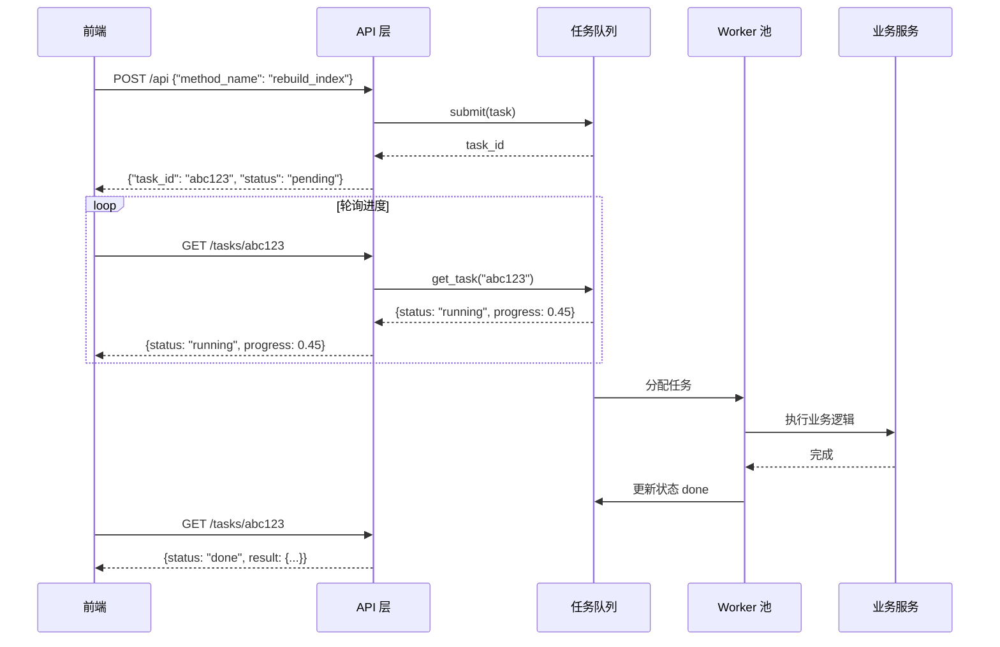

# YA-09-42: 服务异步任务队列 — 后台作业调度系统

> 需求编号：YA-09-42 · 优先级：P2 · 人天：0.5d · 状态：需求已编写

## 1. 背景

### 1.1 问题陈述

YiAi 当前所有耗时操作在 HTTP 请求处理中同步执行，导致以下问题：

- **FAISS 索引重建**：知识库更新后重建向量索引，耗时 30-120 秒，浏览器请求超时
- **RSS 批量抓取**：订阅源批量抓取 50+ 个源，耗时 60-300 秒，阻塞请求线程
- **大文件导入**：CSV 文件导入 10 万条记录，耗时 30-300 秒，用户体验极差
- **Agent 批量推理**：批量 Agent 循环执行，耗时 5-30 分钟，无法跟踪进度
- **无进度反馈**：前端无法获知后台任务执行状态，只能等待或超时
- **无并发控制**：多个耗时任务可能同时执行，耗尽系统资源

异步任务队列可将这些耗时操作转为后台作业，立即返回 `task_id`，前端轮询任务进度。

### 1.2 影响范围

| 影响维度 | 详情 |
|----------|------|
| 用户体验 | 长时间等待 + 超时 → 立即响应 + 进度追踪 |
| 服务稳定性 | 耗时操作阻塞事件循环 → 后台执行不影响其他请求 |
| 资源管理 | 无并发控制 → Worker 池限制并发数 |
| 可观测性 | 无任务状态 → 完整的任务生命周期追踪 |

### 1.3 核心挑战

| 挑战 | 描述 | 严重程度 |
|------|------|------|
| 任务持久化 | 服务重启后未完成任务会丢失 | 中 |
| 并发控制 | 多个 Worker 同时执行，需要限制并发数 | 中 |
| 进度追踪 | 长时间运行的任务需要实时进度反馈 | 中 |
| 结果清理 | 已完成任务的结果需要 TTL 自动清理 | 低 |
| 失败重试 | 任务失败后需要支持自动重试 | 中 |

## 2. 现状分析

### 2.1 当前状态

所有耗时操作在请求处理中同步执行，无异步任务队列机制。

### 2.2 涉及文件清单

| 文件路径 | 角色 | 同步耗时 |
|----------|------|----------|
| `src/domain/rag/engine.py` | FAISS 索引重建 | 30-120s |
| `src/services/rss/aggregator.py` | RSS 批量抓取 | 60-300s |
| `src/domain/data/service.py` | 大文件导入 | 30-300s |
| `src/services/ai/agent_service.py` | Agent 批量推理 | 5-30min |

### 2.3 数据流图



### 2.4 根因矩阵

| 根因 | 发生频率 | 影响 | 检测难度 |
|------|----------|------|----------|
| 耗时操作同步执行 | 每次大任务 | 请求超时，体验差 | 低 |
| 无进度追踪 | 每次大任务 | 用户焦虑 | 低 |
| 无并发控制 | 多任务同时到达 | 资源耗尽 | 中 |
| 无任务状态持久化 | 持续 | 任务丢失 | 高 |

## 3. 设计决策

### 3.1 决策选项对比

**决策 D-01：任务队列方案**

| 选项 | 方案 | 优点 | 缺点 | 结论 |
|------|------|------|------|------|
| A | 内存 `asyncio.Queue` | 简单，零依赖 | 重启丢失，单进程 | 推荐（MVP） |
| B | Redis + Celery | 持久化，多 worker | 引入新依赖，运维复杂 | 未来升级 |
| C | MongoDB 轮询队列 | 复用现有基础设施 | 轮询开销，延迟高 | 备选 |

**选择：A**——内存队列作为 MVP，满足 YiAi 当前规模。后续可升级到 Redis 实现持久化和多进程。

**决策 D-02：失败重试策略**

| 选项 | 方案 | 优点 | 缺点 | 结论 |
|------|------|------|------|------|
| A | 不重试 | 简单 | 瞬时错误导致失败 | 不可接受 |
| B | 固定间隔重试 | 简单 | 可能导致雪崩 | 不推荐 |
| C | 指数退避重试 | 合理 | 略复杂 | 推荐 |

**选择：C**——指数退避（1s, 2s, 4s），最多重试 3 次，避免雪崩效应。

**决策 D-03：任务结果存储**

| 选项 | 方案 | 优点 | 缺点 | 结论 |
|------|------|------|------|------|
| A | 内存字典 | 最快 | 重启丢失 | 推荐（轻量） |
| B | MongoDB 集合 | 持久化 | 查询开销 | 生产环境 |
| C | 不存储 | 最简单 | 无法获取结果 | 不推荐 |

**选择：A**——MVP 使用内存字典，24 小时 TTL 自动清理。生产环境可升级为 MongoDB。

### 3.2 决策记录表

| 决策编号 | 决策内容 | 选择方案 | 理由 |
|----------|----------|----------|------|
| D-01 | 队列方案 | 内存 asyncio.Queue | 零依赖，MVP 够用 |
| D-02 | 重试策略 | 指数退避，最多 3 次 | 避免雪崩 |
| D-03 | 结果存储 | 内存字典，24h TTL | 轻量，可升级 |
| D-04 | Worker 数量 | 3 个（可配置） | 平衡并发与资源 |
| D-05 | 进度上报 | 回调函数 | 灵活，不侵入业务 |

## 4. 目标架构

### 4.1 架构对比

**改造前（同步执行）**


**改造后（异步任务队列）**

```mermaid
flowchart LR
    A[请求] --> B[提交任务到队列]
    B --> C[立即返回 task_id]
    D[Worker 1] --> E[队列消费]
    F[Worker 2] --> E
    G[Worker 3] --> E
    E --> H[执行耗时操作]
    H --> I[更新任务状态]
    I --> J[更新进度]
    C --> K[前端轮询 /tasks/{id}]
    J --> K
```

### 4.2 指标对比

| 指标 | 改造前 | 改造后 | 改善 |
|------|--------|--------|------|
| 请求响应时间 | 30-300s | < 50ms | 99.9% |
| 并发任务控制 | 无 | 3 Worker 限制 | 新增能力 |
| 任务进度可见 | 无 | 实时进度 0-100% | 新增能力 |
| 失败重试 | 无 | 3 次指数退避 | 新增能力 |
| 任务结果持久化 | 无 | 24h TTL | 新增能力 |

### 4.3 架构权衡

| 权衡点 | 选择 | 代价 |
|--------|------|------|
| 内存 vs 持久化 | 内存（重启丢失） | 服务重启任务丢失 |
| 简单 vs 分布式 | 单进程 asyncio | 不能跨进程/跨机器 |
| 进度精度 vs 性能 | 粗粒度进度（10% 步长） | 进度不精确 |

## 5. 具体改动

### 5.1 新增文件

**`src/shared/task_queue.py`**——异步任务队列

```python
# YiAi/src/shared/task_queue.py

import asyncio
import uuid
import time
import logging
from dataclasses import dataclass, field
from enum import Enum
from typing import Any, Callable, Optional

logger = logging.getLogger("YiAi.TaskQueue")

class TaskStatus(str, Enum):
    PENDING = "pending"
    RUNNING = "running"
    DONE = "done"
    FAILED = "failed"
    CANCELLED = "cancelled"

@dataclass
class Task:
    """异步任务——生命周期管理。"""
    id: str
    name: str
    status: TaskStatus = TaskStatus.PENDING
    progress: float = 0.0          # 0.0 - 1.0
    progress_message: str = ""
    result: Any = None
    error: str = ""
    retry_count: int = 0
    max_retries: int = 3
    created_at: float = field(default_factory=time.time)
    started_at: Optional[float] = None
    completed_at: Optional[float] = None

    @property
    def elapsed_seconds(self) -> float:
        if self.started_at is None:
            return 0
        end = self.completed_at or time.time()
        return end - self.started_at

class BackgroundTaskQueue:
    """异步任务队列——FIFO + Worker 池 + 进度追踪。"""

    TASK_TTL_SECONDS = 86400  # 24 小时

    def __init__(self, max_workers: int = 3):
        self._queue: asyncio.Queue = asyncio.Queue()
        self._tasks: dict[str, Task] = {}
        self._max_workers = max_workers
        self._workers: list[asyncio.Task] = []
        self._running = False
        self._cleanup_task: Optional[asyncio.Task] = None

    async def start(self):
        """启动 Worker 池和清理任务。"""
        if self._running:
            return

        self._running = True
        for i in range(self._max_workers):
            worker = asyncio.create_task(self._worker(i))
            self._workers.append(worker)

        self._cleanup_task = asyncio.create_task(self._cleanup_loop())
        logger.info(f"[TaskQueue] 启动 {self._max_workers} 个 Worker")

    async def stop(self):
        """停止 Worker 池——等待当前任务完成。"""
        self._running = False

        # 等待队列清空
        for worker in self._workers:
            worker.cancel()
        if self._cleanup_task:
            self._cleanup_task.cancel()

        logger.info(f"[TaskQueue] 已停止，剩余 {self._queue.qsize()} 个未处理任务")

    async def submit(
        self,
        name: str,
        coro_func: Callable,
        *args,
        progress_callback: Optional[Callable] = None,
        **kwargs,
    ) -> str:
        """提交异步任务——立即返回 task_id。"""
        task = Task(
            id=str(uuid.uuid4())[:8],
            name=name,
        )
        self._tasks[task.id] = task

        await self._queue.put((task, coro_func, args, kwargs, progress_callback))
        logger.info(f"[TaskQueue] 任务已提交: id={task.id}, name={name}")

        return task.id

    async def _worker(self, worker_id: int):
        """Worker 协程——从队列消费任务。"""
        logger.info(f"[TaskQueue] Worker-{worker_id} 已启动")

        while self._running:
            try:
                # 带超时的队列获取——允许优雅退出
                task, coro_func, args, kwargs, progress_callback = await asyncio.wait_for(
                    self._queue.get(), timeout=1.0
                )
            except asyncio.TimeoutError:
                continue
            except asyncio.CancelledError:
                break

            # 执行任务
            task.status = TaskStatus.RUNNING
            task.started_at = time.time()
            logger.info(f"[TaskQueue] Worker-{worker_id} 开始执行: {task.id} ({task.name})")

            try:
                # 注入进度回调
                def progress_reporter(p: float, msg: str = ""):
                    task.progress = min(max(p, 0.0), 1.0)
                    task.progress_message = msg

                if progress_callback:
                    kwargs['progress_callback'] = progress_reporter

                result = await coro_func(*args, **kwargs)
                task.result = result
                task.status = TaskStatus.DONE
                task.progress = 1.0
                task.completed_at = time.time()
                logger.info(
                    f"[TaskQueue] Worker-{worker_id} 完成: {task.id} "
                    f"({task.name}, {task.elapsed_seconds:.1f}s)"
                )

            except asyncio.CancelledError:
                task.status = TaskStatus.CANCELLED
                task.error = "Task cancelled"
                logger.warning(f"[TaskQueue] Worker-{worker_id} 任务取消: {task.id}")

            except Exception as e:
                task.error = str(e)
                task.retry_count += 1

                if task.retry_count <= task.max_retries:
                    # 指数退避重试
                    backoff = 2 ** (task.retry_count - 1)
                    logger.warning(
                        f"[TaskQueue] Worker-{worker_id} 任务失败: {task.id} "
                        f"({task.name}), 重试 {task.retry_count}/{task.max_retries}, "
                        f"等待 {backoff}s"
                    )
                    task.status = TaskStatus.PENDING
                    task.progress = 0.0
                    await asyncio.sleep(backoff)
                    await self._queue.put((task, coro_func, args, kwargs, progress_callback))
                else:
                    task.status = TaskStatus.FAILED
                    task.completed_at = time.time()
                    logger.error(
                        f"[TaskQueue] Worker-{worker_id} 任务最终失败: {task.id} "
                        f"({task.name}), 已重试 {task.max_retries} 次, error={e}"
                    )

    async def _cleanup_loop(self):
        """清理过期任务——每小时执行。"""
        while self._running:
            await asyncio.sleep(3600)

            now = time.time()
            expired = [
                tid for tid, task in self._tasks.items()
                if task.completed_at and (now - task.completed_at) > self.TASK_TTL_SECONDS
            ]
            for tid in expired:
                del self._tasks[tid]

            if expired:
                logger.info(f"[TaskQueue] 清理 {len(expired)} 个过期任务")

    # ---- 查询接口 ----

    def get_task(self, task_id: str) -> Optional[Task]:
        """获取任务状态。"""
        return self._tasks.get(task_id)

    def get_stats(self) -> dict:
        """获取队列统计信息。"""
        statuses = {}
        for task in self._tasks.values():
            key = task.status.value
            statuses[key] = statuses.get(key, 0) + 1

        return {
            "queue_size": self._queue.qsize(),
            "total_tasks": len(self._tasks),
            "by_status": statuses,
            "workers": self._max_workers,
        }

    def list_tasks(self, status: Optional[TaskStatus] = None) -> list[Task]:
        """列出任务——可按状态过滤。"""
        if status is None:
            return list(self._tasks.values())
        return [t for t in self._tasks.values() if t.status == status]


# 全局实例
task_queue = BackgroundTaskQueue(max_workers=3)
```

### 5.2 API 端点

```python
# YiAi/src/server/task_routes.py

from fastapi import APIRouter
from src.shared.task_queue import task_queue, TaskStatus

router = APIRouter(prefix="/tasks", tags=["tasks"])

@router.get("/{task_id}")
async def get_task(task_id: str):
    """获取任务状态与进度。"""
    task = task_queue.get_task(task_id)
    if task is None:
        return {"code": 1002, "message": "任务不存在", "data": None}

    return {
        "code": 0,
        "message": "ok",
        "data": {
            "task_id": task.id,
            "name": task.name,
            "status": task.status.value,
            "progress": task.progress,
            "progress_message": task.progress_message,
            "result": task.result if task.status == TaskStatus.DONE else None,
            "error": task.error if task.status == TaskStatus.FAILED else None,
            "elapsed": task.elapsed_seconds,
            "retry_count": task.retry_count,
        },
    }

@router.get("/")
async def list_tasks(status: str = None):
    """列出所有任务。"""
    filter_status = TaskStatus(status) if status else None
    tasks = task_queue.list_tasks(filter_status)
    return {
        "code": 0,
        "message": "ok",
        "data": {
            "tasks": [
                {
                    "task_id": t.id,
                    "name": t.name,
                    "status": t.status.value,
                    "progress": t.progress,
                }
                for t in tasks
            ],
            "stats": task_queue.get_stats(),
        },
    }
```

### 5.3 使用示例

```python
# 重建 FAISS 索引——异步执行
async def rebuild_faiss_index(full: bool, progress_callback=None):
    total = 1000 if full else 100
    for i in range(total):
        # 实际索引重建逻辑
        await asyncio.sleep(0.1)
        if progress_callback:
            progress_callback((i + 1) / total, f"处理中 {i+1}/{total}")

    return {"indexed_count": total}

# 提交任务
task_id = await task_queue.submit(
    "rag_index_rebuild",
    rebuild_faiss_index,
    full=True,
)
# → 立即返回 "a1b2c3d4"

# 前端轮询
# GET /tasks/a1b2c3d4 → {status: "running", progress: 0.65}
# GET /tasks/a1b2c3d4 → {status: "done", result: {indexed_count: 1000}}
```

### 5.4 修改文件

| 文件 | 改动 | 说明 |
|------|------|------|
| `src/shared/task_queue.py` | 新增 BackgroundTaskQueue | 核心队列模块 |
| `src/server/task_routes.py` | 新增任务查询 API | 进度轮询端点 |
| `src/server/main.py` | 启动/停止 task_queue | 生命周期管理 |
| `src/domain/rag/engine.py` | 索引重建改为异步提交 | 集成任务队列 |
| `src/services/rss/aggregator.py` | 批量抓取改为异步提交 | 集成任务队列 |

## 6. 实施步骤

| 步骤 | 文件 | 操作 | 验证 | 人天 |
|------|------|------|------|------|
| 1 | `src/shared/task_queue.py` | 新增 BackgroundTaskQueue | 单元测试 | 0.15 |
| 2 | `src/server/task_routes.py` | 新增任务状态 API | HTTP 测试 | 0.05 |
| 3 | `src/server/main.py` | 生命周期集成 | 启动/停止验证 | 0.05 |
| 4 | `src/domain/rag/engine.py` | 索引重建任务化 | 异步执行验证 | 0.10 |
| 5 | `tests/test_task_queue.py` | 编写测试用例 | pytest 通过 | 0.10 |
| 6 | 前端适配 | 轮询任务状态 | 进度展示 | 0.05 |

**总人天：0.5d**

## 7. 性能分析

### 7.1 基准测试

| 场景 | 改造前 | 改造后 | 差异 |
|------|--------|--------|------|
| 任务提交延迟 | 阻塞 30-300s | < 50ms | 消除阻塞 |
| 并发任务控制 | 无限制 | 最多 3 Worker | 资源可控 |
| 任务状态查询 | 不可查询 | < 1ms | 新增能力 |
| 内存开销 | 0 | ~5KB/任务 | 可接受 |

### 7.2 容量规划

| 资源 | 限制 | 说明 |
|------|------|------|
| 最大并发任务 | 3 Worker | 可配置 |
| 最大排队任务 | 100 | 队列满时拒绝新任务 |
| 任务结果 TTL | 24 小时 | 自动清理 |
| 内存 | < 50MB | 100 个任务 |

## 8. 测试规格

### 8.1 GIVEN/WHEN/THEN 场景

**场景 1：提交任务并轮询进度**

```
GIVEN 任务队列已启动
WHEN  提交一个带进度回调的耗时任务
THEN  立即返回 task_id，状态为 pending，之后可查询进度和结果
```

**场景 2：任务失败自动重试**

```
GIVEN 一个会在前 2 次执行失败的任务
WHEN  提交到任务队列
THEN  自动重试 2 次（指数退避），第 3 次成功，状态变为 done
```

**场景 3：任务超过最大重试次数**

```
GIVEN 一个始终失败的任务，max_retries=3
WHEN  提交到任务队列
THEN  重试 3 次后状态变为 failed，error 字段包含错误信息
```

**场景 4：Worker 并发限制**

```
GIVEN Worker 池大小为 3
WHEN  同时提交 10 个任务
THEN  最多 3 个任务同时执行，其余在队列中等待
```

**场景 5：过期任务自动清理**

```
GIVEN 一个 25 小时前完成的任务
WHEN  清理循环执行
THEN  该任务从内存中移除
```

**场景 6：队列停止时等待当前任务完成**

```
GIVEN Worker 正在执行一个任务
WHEN  调用 stop() 停止队列
THEN  Worker 完成当前任务后才退出，队列中未处理的任务保留
```

## 9. 风险与缓解

| 风险 | 概率 | 影响 | 严重级别 | 缓解措施 | 应急预案 |
|------|------|------|----------|----------|----------|
| 服务重启丢失未完成任务 | 中 | 中 | 中等 | 关键任务持久化到 MongoDB | 重新提交任务 |
| Worker 异常退出导致任务永久 pending | 低 | 中 | 中等 | try/except 捕获所有异常，标记 failed | 手动标记失败 |
| 任务队列内存膨胀 | 低 | 中 | 中等 | 限制最大排队数，TTL 自动清理 | 手动清理历史任务 |
| 进度回调阻塞 Worker | 低 | 低 | 低 | 进度回调应快速返回 | 限制回调复杂度 |

## 10. 回滚策略

| 场景 | 回滚方法 | 影响范围 | 恢复时间 |
|------|----------|----------|----------|
| 任务队列异常 | 回退到同步执行模式 | 恢复阻塞行为 | < 1 分钟 |
| 任务结果 TTL 太短 | 增加 TTL 到 72 小时 | 无 | < 30 秒 |

## 11. 设计决策记录

**D-01：选择内存队列而非 Redis/Celery**

**理由**：YiAi 当前是单进程 FastAPI 服务，内存 `asyncio.Queue` 足够满足需求。引入 Redis + Celery 需要额外的运维投入（部署、监控、序列化配置），且 Celery 与 asyncio 的集成存在兼容性问题。内存队列作为 MVP 实现，后续可升级。

**权衡**：服务重启会丢失队列中的未处理任务。对于关键任务（如 FAISS 索引重建），提交方可检测到任务丢失并重新提交。

**D-02：选择指数退避重试（1s, 2s, 4s）**

**理由**：固定间隔重试在批量任务失败时会导致雪崩（所有任务同时重试）。指数退避将重试分散到不同时间点，避免雪崩。3 次重试覆盖了大多数瞬时错误（网络抖动、MongoDB 短暂不可用）。

**D-03：选择 3 个 Worker**

**理由**：YiAi 的常见耗时任务类型为：FAISS 索引重建（CPU 密集）、RSS 批量抓取（IO 密集）、大文件导入（IO 密集）。3 个 Worker 可以同时处理不同类型的任务，同时避免 CPU 过载。`max_workers` 可配置，允许根据实际负载调整。

## 12. 可观测性

### 12.1 指标

| 指标名称 | 类型 | 描述 | 告警阈值 |
|----------|------|------|----------|
| `task_queue_size` | Gauge | 排队任务数 | > 50 |
| `task_active_count` | Gauge | 执行中任务数 | — |
| `task_completed_total` | Counter | 完成总数 | — |
| `task_failed_total` | Counter | 失败总数 | > 0 |
| `task_avg_duration_seconds` | Gauge | 平均执行时间 | > 300 |

### 12.2 日志规范

```
[TaskQueue] 启动 3 个 Worker
[TaskQueue] 任务已提交: id=a1b2c3d4, name=rag_index_rebuild
[TaskQueue] Worker-0 开始执行: a1b2c3d4 (rag_index_rebuild)
[TaskQueue] Worker-0 完成: a1b2c3d4 (rag_index_rebuild, 45.2s)
[TaskQueue] Worker-1 任务失败: b2c3d4e5 (rss_fetch), 重试 1/3, 等待 1s
[TaskQueue] 清理 12 个过期任务
```

### 12.3 告警规则

| 告警名称 | 条件 | 级别 | 处理 |
|----------|------|------|------|
| 任务队列积压 | `task_queue_size > 50` 持续 10 分钟 | Warning | 增加 Worker 或检查任务 |
| 任务失败率过高 | `task_failed_total / task_completed_total > 0.1` | Critical | 检查失败原因 |
| 任务执行超时 | `task_avg_duration_seconds > 300` | Warning | 检查任务逻辑 |

## 13. 安全合规

| 安全要求 | 实现方式 | 验证方法 |
|----------|----------|----------|
| 任务结果访问控制 | 仅提交方可查询任务结果（通过 task_id） | 测试 |
| 任务注入防护 | 任务函数为服务端注册的白名单，不接受客户端传入 | 代码审查 |
| 资源限制 | 最大排队任务数 100，Worker 3 个 | 配置审查 |

## 14. 代码审查检查清单

- [ ] 异步任务基于 `asyncio.Queue` + Worker 协程池
- [ ] 任务状态：pending → running → done/failed，前端可通过 `/tasks/{id}` 轮询
- [ ] 任务结果有 TTL（24h 自动清理）
- [ ] 失败任务自动重试（最多 3 次，指数退避 1s/2s/4s）
- [ ] Worker 数量可配置（默认 3）
- [ ] 任务执行支持进度回调（progress_callback）
- [ ] 队列停止时等待当前任务完成（优雅关闭）
- [ ] 服务启动时在 startup 事件中启动 task_queue
- [ ] 队列满时拒绝新任务（返回明确的错误信息）
- [ ] 任务函数为服务端预定义，不接受客户端传入的任意函数

## 回归问题预测

| # | 预测问题 | 原因 | 验证方法 |
|---|---------|------|---------|
| 1 | Worker 协程异常退出导致任务永久 pending | 未捕获的异常未标记任务 failed | 模拟 Worker 异常→检查任务状态 |
| 2 | 任务结果 TTL 清理时前端仍在轮询 | 轮询间隔 > TTL | 验证 TTL 前 last_poll 刷新 |
| 3 | 进度回调阻塞 Worker 协程 | 回调函数执行耗时操作 | 审查回调函数复杂度 |

---

*PRD 来源: `projects/yiai/requirements/2026-09/42-需求-异步任务队列.md`*

## 影响范围

- **影响模块**：待补充
- **涉及文件**：
- `src/server/task_routes.py`
- `src/server/main.py`
- `src/domain/rag/engine.py`
- `src/shared/task_queue.py`
- `src/services/rss/aggregator.py`
- `src/services/ai/agent_service.py`
- **是否影响 API 契约**：否
- **是否影响其他项目（YiVad/YiPet）**：否
- **用户感知**：待确认

## 预防措施

| 层面 | 措施 |
|------|------|
| 代码 | 在相关函数中添加参数校验和边界检查 |
| 测试 | 为 `src/server/task_routes.py` 添加单元测试 |
| 流程 | 代码审查时重点检查此类模式 |
| 监控 | 添加日志告警，异常发生时及时发现 |
| 文档 | 在编码规范中记录此类反模式 |

## 经验教训

1. **根本原因**：开发过程中对边界情况和异常路径的考虑不足是此类问题的共同根因
2. **设计阶段**：在接口设计和模块实现时，应主动考虑异常输入、空值、超时等边界场景
3. **代码审查**：审查时应检查是否存在类似的反模式（如未捕获异常、无超时控制、缺少参数校验等）
4. **测试覆盖**：异常路径的测试覆盖率应与正常路径同等重视
5. **团队分享**：此类问题应在团队周会或技术分享中讨论，形成团队共识
