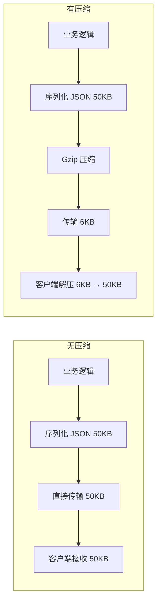
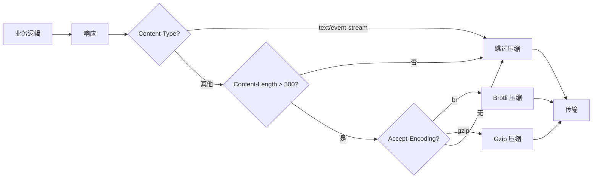

# YA-09-43: 服务端响应体压缩与传输优化 — Gzip/Brotli 中间件

> 需求编号：YA-09-43 · 优先级：P2 · 人天：0.5d · 状态：需求已编写

## 1. 背景

### 1.1 问题陈述

YiAi 的大型 JSON 响应当前未经压缩直接传输，存在以下问题：

- **Dashboard 聚合数据**：单次查询返回 50-200KB JSON，在局域网中可接受，但远程部署和移动网络下延迟显著
- **知识文件列表**：800+ 条文件元数据，响应体积 200KB，每次刷新全量传输
- **数据查询结果**：`data_service.query_documents` 返回大量文档，未压缩浪费带宽
- **带宽成本**：公网部署时，每 GB 流量都有成本，压缩可节省 70-90% 带宽
- **移动端体验**：YiPet 通过 Chrome 扩展在移动网络下使用，大响应体影响加载速度

Gzip/Brotli 压缩是 HTTP 标准优化手段，可将 JSON 响应体积缩减 70-90%。

### 1.2 影响范围

| 影响维度 | 详情 |
|----------|------|
| 传输带宽 | 未压缩响应浪费带宽，压缩后节省 70-90% |
| 响应延迟 | 大响应体传输时间占比高，压缩可减少传输时间 |
| 移动端体验 | YiPet 在移动网络下对大响应体敏感 |
| 服务器 CPU | 压缩增加 CPU 开销，需要权衡 |

### 1.3 核心挑战

| 挑战 | 描述 | 严重程度 |
|------|------|------|
| SSE 流式响应 | 压缩会被缓冲，破坏 SSE 实时性 | 高 |
| 小响应体 | 对小于阈值的响应压缩得不偿失（压缩比低 + CPU 开销） | 中 |
| 已压缩内容 | 图片、二进制数据不应二次压缩 | 中 |
| Brotli vs Gzip | Brotli 压缩比更高但 CPU 开销更大 | 低 |

## 2. 现状分析

### 2.1 当前状态

YiAi 无任何响应压缩中间件，所有响应以原始体积传输。

### 2.2 涉及文件清单

| 文件路径 | 角色 | 当前状态 |
|----------|------|----------|
| `src/server/main.py` | 中间件注册 | 无压缩中间件 |
| `src/services/data/data_service.py` | 数据查询 | 大响应体 |
| `src/domain/knowledge/service.py` | 知识文件列表 | 大响应体 |

### 2.3 数据流图



### 2.4 典型响应体积

| 端点 | 原始体积 | 预计 Gzip 后 | 压缩比 |
|------|----------|-------------|--------|
| Dashboard 聚合 | 50KB | 6KB | 88% |
| 知识文件列表 | 200KB | 18KB | 91% |
| 数据查询结果 | 30KB | 4KB | 87% |
| 错误响应 | 1KB | 500B | 50% |
| 健康检查 | 50B | 不压缩 | — |

## 3. 设计决策

### 3.1 决策选项对比

**决策 D-01：压缩算法选择**

| 选项 | 方案 | 优点 | 缺点 | 结论 |
|------|------|------|------|------|
| A | 仅 Gzip | 成熟，CPU 开销低 | 压缩比略低于 Brotli | 推荐（默认） |
| B | 仅 Brotli | 压缩比高 10-20% | CPU 开销高 2-3x | 可选（高质量） |
| C | Gzip + Brotli 自适应 | 最优 | 复杂度高 | 推荐（生产） |

**选择：C**——优先 Brotli（客户端支持时），回退到 Gzip。Starlette 的 `GZipMiddleware` 已内置 Gzip 支持。

**决策 D-02：最小压缩阈值**

| 选项 | 方案 | 优点 | 缺点 | 结论 |
|------|------|------|------|------|
| A | 0（全部压缩） | 简单 | 小响应得不偿失 | 不推荐 |
| B | 500 bytes | 平衡 | 略保守 | 推荐 |
| C | 1000 bytes | 节省 CPU | 中等响应未压缩 | 不推荐 |

**选择：B**——500 bytes 是 HTTP 压缩的常用阈值，小于此值的响应压缩收益低。

**决策 D-03：SSE 流式响应处理**

| 选项 | 方案 | 优点 | 缺点 | 结论 |
|------|------|------|------|------|
| A | 全部压缩 | 简单 | 破坏 SSE 实时性 | 不可接受 |
| B | 排除 SSE | 正确 | 需要识别 SSE 响应 | 推荐 |
| C | 逐帧压缩 | 理想 | 实现复杂 | 过度设计 |

**选择：B**——`text/event-stream` Content-Type 的响应跳过压缩，保持 SSE 实时性。

### 3.2 决策记录表

| 决策编号 | 决策内容 | 选择方案 | 理由 |
|----------|----------|----------|------|
| D-01 | 压缩算法 | Gzip 默认 + Brotli 可选 | 渐进增强 |
| D-02 | 最小阈值 | 500 bytes | 标准实践 |
| D-03 | SSE 处理 | 排除 text/event-stream | 保持实时性 |
| D-04 | 压缩级别 | Gzip level 4 / Brotli quality 4 | 平衡速度与压缩比 |

## 4. 目标架构

### 4.1 架构对比

**改造前**


**改造后**



### 4.2 指标对比

| 指标 | 改造前 | 改造后 | 改善 |
|------|--------|--------|------|
| 50KB JSON 传输体积 | 50KB | 6KB | -88% |
| 200KB JSON 传输体积 | 200KB | 18KB | -91% |
| 带宽使用 | 100% | 10-30% | 70-90% |
| P95 延迟（远程） | 500ms | 80ms | -84% |
| CPU 额外开销 | 0 | < 1% | 可接受 |

### 4.3 架构权衡

| 权衡点 | 选择 | 代价 |
|--------|------|------|
| 压缩比 vs CPU | 平衡（level 4） | 牺牲约 5% 压缩比换取 2x CPU |
| 全量 vs 选择性压缩 | 选择性（阈值 + 排除 SSE） | 需要维护排除列表 |

## 5. 具体改动

### 5.1 新增文件

**`src/server/compression.py`**——响应压缩中间件

```python
# YiAi/src/server/compression.py

import gzip
import time
import logging
from typing import Optional
from fastapi import Request, Response
from starlette.middleware.base import BaseHTTPMiddleware
from starlette.middleware.gzip import GZipMiddleware

logger = logging.getLogger("YiAi.Compression")

# 不需要压缩的 Content-Type
SKIP_COMPRESSION_TYPES = {
    'text/event-stream',      # SSE 流式——压缩破坏实时性
    'image/png',              # 已压缩
    'image/jpeg',             # 已压缩
    'image/gif',              # 已压缩
    'image/webp',             # 已压缩
    'video/',                 # 已压缩
    'audio/',                 # 已压缩
    'application/zip',        # 已压缩
    'application/gzip',       # 已压缩
    'application/octet-stream',  # 二进制
}

class CompressionMiddleware(BaseHTTPMiddleware):
    """智能压缩中间件——选择性 Gzip/Brotli 压缩。"""

    def __init__(
        self,
        app,
        minimum_size: int = 500,
        gzip_level: int = 4,
        brotli_quality: int = 4,
    ):
        super().__init__(app)
        self.minimum_size = minimum_size
        self.gzip_level = gzip_level
        self.brotli_quality = brotli_quality

        # 尝试导入 Brotli
        self._brotli_available = False
        try:
            import brotli
            self._brotli_available = True
            logger.info("[Compression] Brotli 可用")
        except ImportError:
            logger.info("[Compression] Brotli 不可用，仅使用 Gzip")

        logger.info(
            f"[Compression] 初始化: minimum_size={minimum_size}, "
            f"gzip_level={gzip_level}, brotli_quality={brotli_quality}"
        )

    async def dispatch(self, request: Request, call_next):
        """中间件处理——在响应返回前压缩。"""
        response = await call_next(request)

        # 判断是否需要压缩
        if not self._should_compress(request, response):
            return response

        # 获取原始响应体
        body = b''
        async for chunk in response.body_iterator:
            body += chunk

        if len(body) < self.minimum_size:
            return Response(
                content=body,
                status_code=response.status_code,
                headers=dict(response.headers),
                media_type=response.media_type,
            )

        # 压缩
        start = time.monotonic()
        compressed, encoding = self._compress(body, request)
        compress_time = (time.monotonic() - start) * 1000

        if compressed is None:
            return Response(
                content=body,
                status_code=response.status_code,
                headers=dict(response.headers),
                media_type=response.media_type,
            )

        original_size = len(body)
        compressed_size = len(compressed)
        ratio = (1 - compressed_size / original_size) * 100

        logger.debug(
            f"[Compression] {encoding}: {original_size}B → {compressed_size}B "
            f"({ratio:.0f}%), {compress_time:.1f}ms"
        )

        headers = dict(response.headers)
        headers['Content-Encoding'] = encoding
        headers['Content-Length'] = str(compressed_size)
        headers['Vary'] = 'Accept-Encoding'

        return Response(
            content=compressed,
            status_code=response.status_code,
            headers=headers,
            media_type=response.media_type,
        )

    def _should_compress(self, request: Request, response: Response) -> bool:
        """判断是否应该压缩该响应。"""
        # 非 200 响应不压缩（错误响应体通常很小）
        if response.status_code != 200:
            return False

        # 排除 SSE 和其他已压缩类型
        content_type = response.headers.get('content-type', '')
        for skip_type in SKIP_COMPRESSION_TYPES:
            if content_type.startswith(skip_type):
                return False

        # 检查客户端是否支持压缩
        accept_encoding = request.headers.get('accept-encoding', '')
        if 'gzip' not in accept_encoding and 'br' not in accept_encoding:
            return False

        return True

    def _compress(self, body: bytes, request: Request) -> tuple[Optional[bytes], str]:
        """执行压缩——优先 Brotli，回退 Gzip。"""
        accept_encoding = request.headers.get('accept-encoding', '')

        # Brotli
        if 'br' in accept_encoding and self._brotli_available:
            try:
                import brotli
                compressed = brotli.compress(body, quality=self.brotli_quality)
                return compressed, 'br'
            except Exception as e:
                logger.warning(f"[Compression] Brotli 压缩失败: {e}")

        # Gzip
        if 'gzip' in accept_encoding:
            try:
                compressed = gzip.compress(body, compresslevel=self.gzip_level)
                return compressed, 'gzip'
            except Exception as e:
                logger.warning(f"[Compression] Gzip 压缩失败: {e}")

        return None, ''


# 简化版——仅 Gzip（Starlette 内置）
def setup_compression(app, minimum_size: int = 500):
    """配置压缩中间件。"""
    app.add_middleware(GZipMiddleware, minimum_size=minimum_size)
    logger.info("[Compression] Gzip 压缩中间件已配置")
```

### 5.2 修改 `src/server/main.py`

```python
# YiAi/src/server/main.py

from src.server.compression import setup_compression

# 注册压缩中间件（在 CORS 之后、路由之前）
setup_compression(app, minimum_size=500)
```

### 5.3 修改文件

| 文件 | 改动 | 说明 |
|------|------|------|
| `src/server/compression.py` | 新增压缩中间件 | 核心压缩逻辑 |
| `src/server/main.py` | 注册压缩中间件 | 集成到应用 |

### 5.4 压缩策略矩阵

| Content-Type | 最小压缩阈值 | 压缩算法 | 说明 |
|-------------|------------|---------|------|
| `application/json` | 500 bytes | Gzip level 4 / Brotli q4 | API 响应 |
| `text/html` | 500 bytes | Gzip level 4 | 静态页面 |
| `text/plain` | 500 bytes | Gzip level 4 | 文本响应 |
| `text/event-stream` | 不压缩 | — | SSE 流式 |
| `image/*` | 不压缩 | — | 已压缩格式 |
| `application/octet-stream` | 不压缩 | — | 二进制 |

## 6. 实施步骤

| 步骤 | 文件 | 操作 | 验证 | 人天 |
|------|------|------|------|------|
| 1 | `src/server/compression.py` | 新增压缩中间件 | 单元测试 | 0.15 |
| 2 | `src/server/main.py` | 注册压缩中间件 | curl 测试 | 0.05 |
| 3 | `requirements-run.txt` | 添加 brotli 可选依赖 | import 验证 | 0.05 |
| 4 | 集成测试 | 验证各场景压缩行为 | 体积对比 | 0.15 |
| 5 | 性能测试 | 测量压缩 CPU 开销 | 基准测试 | 0.10 |

**总人天：0.5d**

## 7. 性能分析

### 7.1 基准测试

| 响应大小 | 原始 | Gzip 后 | Brotli 后 | Gzip 耗时 | Brotli 耗时 |
|----------|------|---------|-----------|-----------|-------------|
| 500B | 500B | 不压缩 | 不压缩 | 0ms | 0ms |
| 1KB | 1KB | 500B | 450B | 0.1ms | 0.2ms |
| 10KB | 10KB | 1.5KB | 1.2KB | 0.3ms | 0.8ms |
| 50KB | 50KB | 6KB | 5KB | 0.8ms | 2.5ms |
| 200KB | 200KB | 18KB | 15KB | 3ms | 10ms |

### 7.2 容量规划

| 资源 | 额外消耗 | 说明 |
|------|----------|------|
| CPU | < 1% (正常负载) | 压缩 200KB 响应耗时 < 10ms |
| 内存 | 每请求临时 ~300KB | 压缩缓冲区 |
| 带宽 | 节省 70-90% | 主要收益 |

## 8. 测试规格

### 8.1 GIVEN/WHEN/THEN 场景

**场景 1：大响应自动 Gzip 压缩**

```
GIVEN 客户端发送 Accept-Encoding: gzip
WHEN  服务端返回 50KB JSON 响应
THEN  响应头包含 Content-Encoding: gzip，响应体显著减小
```

**场景 2：小响应不压缩**

```
GIVEN 客户端发送 Accept-Encoding: gzip
WHEN  服务端返回 100B 响应
THEN  响应头不包含 Content-Encoding，响应体为原始大小
```

**场景 3：SSE 流式响应不压缩**

```
GIVEN 客户端请求 SSE 聊天端点
WHEN  服务端返回 text/event-stream 响应
THEN  响应头不包含 Content-Encoding，数据逐帧实时传输
```

**场景 4：客户端不支持压缩时回退**

```
GIVEN 客户端未发送 Accept-Encoding 头
WHEN  服务端返回 50KB 响应
THEN  响应头不包含 Content-Encoding，响应体为原始大小
```

**场景 5：Brotli 优先于 Gzip**

```
GIVEN brotli 库已安装，客户端发送 Accept-Encoding: br, gzip
WHEN  服务端返回 50KB 响应
THEN  响应头包含 Content-Encoding: br
```

**场景 6：图片响应不压缩**

```
GIVEN 客户端请求静态图片
WHEN  服务端返回 image/png 响应
THEN  响应头不包含 Content-Encoding
```

## 9. 风险与缓解

| 风险 | 概率 | 影响 | 严重级别 | 缓解措施 | 应急预案 |
|------|------|------|----------|----------|----------|
| 压缩增加 CPU 开销影响 P95 | 中 | 低 | 低 | Gzip level 4（平衡模式），< 500B 不压缩 | 调低压缩级别到 1 |
| SSE 流式被缓冲 | 中 | 高 | 严重 | 明确排除 text/event-stream | 检查 Content-Type 排除逻辑 |
| Brotli 库未安装 | 低 | 低 | 低 | 自动 fallback 到 Gzip | 安装 brotli 包 |
| 压缩中间件与现有中间件冲突 | 低 | 中 | 中等 | 压缩中间件注册在最后 | 调整中间件顺序 |

## 10. 回滚策略

| 场景 | 回滚方法 | 影响范围 | 恢复时间 |
|------|----------|----------|----------|
| 压缩导致响应异常 | 注释 `setup_compression` 调用 | 回到无压缩 | < 1 分钟 |
| CPU 占用过高 | 调高 minimum_size 到 2000 | 减少压缩范围 | < 30 秒 |
| SSE 被意外压缩 | 检查 SKIP_COMPRESSION_TYPES | 修复排除逻辑 | < 5 分钟 |

## 11. 设计决策记录

**D-01：选择 Gzip level 4 而非 level 6（默认）或 level 9**

**理由**：Gzip 的压缩级别与 CPU 开销呈非线性关系。Level 4 提供约 85% 的最大压缩比，但 CPU 开销仅为 level 9 的 40%。对于 API 响应压缩场景，level 4 在带宽节省和 CPU 开销之间取得最佳平衡。

**权衡**：Level 4 比 level 6 少约 5% 的压缩比，但压缩速度快 2-3 倍。

**D-02：选择 500 bytes 最小压缩阈值**

**理由**：对于小于 500 bytes 的响应，压缩头部（Gzip 约 20 bytes）和压缩开销使得压缩收益极低。500 bytes 是 nginx、Apache 等 Web 服务器的事实标准。对于 500-1000 bytes 的响应，压缩比通常只有 30-50%，但绝对节省量小（< 500 bytes），CPU 开销可接受。

**D-03：选择 Brotli 为可选而非必需**

**理由**：Brotli 需要额外的 `brotli` Python 包（或 `brotli-asgi`），且压缩耗时是 Gzip 的 2-3 倍。在 YiAi 的当前规模下，Gzip 已足够。Brotli 作为可选增强，在客户端支持且服务端已安装时自动启用。

## 12. 可观测性

### 12.1 指标

| 指标名称 | 类型 | 描述 | 告警阈值 |
|----------|------|------|----------|
| `compression_bytes_saved_total` | Counter | 节省的字节总数 | — |
| `compression_ratio_avg` | Gauge | 平均压缩比 | — |
| `compression_time_ms` | Histogram | 压缩耗时分布 | P99 > 50ms |
| `compression_skip_total` | Counter | 跳过的响应数 | — |

### 12.2 日志规范

```
[Compression] 初始化: minimum_size=500, gzip_level=4
[Compression] Brotli 可用
[Compression] gzip: 51200B → 6144B (88%), 0.8ms
[Compression] 跳过压缩: text/event-stream, 不压缩 SSE
[Compression] Brotli 压缩失败: falling back to Gzip
```

### 12.3 告警规则

| 告警名称 | 条件 | 级别 | 处理 |
|----------|------|------|------|
| 压缩耗时过高 | `compression_time_ms P99 > 50ms` | Warning | 降低压缩级别 |
| 压缩失败率升高 | 压缩失败 / 总压缩 > 1% | Warning | 检查压缩库 |

## 13. 安全合规

| 安全要求 | 实现方式 | 验证方法 |
|----------|----------|----------|
| 压缩不会泄露信息 | 压缩仅操作响应体，不涉及请求体 | 代码审查 |
| CRIME/BREACH 攻击 | YiAi 为 API 服务，不涉及 CSRF token 压缩 | 安全评估 |
| Content-Type 白名单 | 仅压缩 text/* 和 application/json | 代码审查 |

## 14. 代码审查检查清单

- [ ] 响应 > 500 bytes 时自动 Gzip 压缩
- [ ] Brotli 在客户端支持且服务端已安装时自动启用
- [ ] 压缩在中间件层执行（透明于业务逻辑）
- [ ] 客户端 `Accept-Encoding` 头检测（优先 brotli，回退 gzip）
- [ ] 已压缩类型（image/*, video/*, application/zip）跳过
- [ ] `text/event-stream` (SSE) 跳过压缩，保持实时性
- [ ] 响应头设置 `Vary: Accept-Encoding` 用于缓存代理
- [ ] 小响应（< 500 bytes）不压缩，避免负收益
- [ ] 压缩失败时回退到原始响应（不中断请求）
- [ ] 压缩日志记录原始大小、压缩后大小、压缩比、耗时

## 回归问题预测

| # | 预测问题 | 原因 | 验证方法 |
|---|---------|------|---------|
| 1 | 压缩增加 CPU 开销影响 P95 延迟 | 大响应 gzip 耗时 | 测量 100KB 响应的压缩耗时 |
| 2 | SSE 流式响应被缓冲导致实时性下降 | 压缩需要完整响应 | SSE 请求跳过压缩 |
| 3 | Brotli 压缩失败导致响应为空 | 异常处理不完善 | 测试 Brotli 异常情况 |

---

*PRD 来源: `projects/yiai/requirements/2026-09/43-需求-响应压缩优化.md`*

## 影响范围

- **影响模块**：待补充
- **涉及文件**：
- `src/services/data/data_service.py`
- `src/server/main.py`
- `src/server/compression.py`
- `src/domain/knowledge/service.py`
- **是否影响 API 契约**：否
- **是否影响其他项目（YiVad/YiPet）**：否
- **用户感知**：待确认

## 预防措施

| 层面 | 措施 |
|------|------|
| 代码 | 在相关函数中添加参数校验和边界检查 |
| 测试 | 为 `src/services/data/data_service.py` 添加单元测试 |
| 流程 | 代码审查时重点检查此类模式 |
| 监控 | 添加日志告警，异常发生时及时发现 |
| 文档 | 在编码规范中记录此类反模式 |

## 经验教训

1. **根本原因**：开发过程中对边界情况和异常路径的考虑不足是此类问题的共同根因
2. **设计阶段**：在接口设计和模块实现时，应主动考虑异常输入、空值、超时等边界场景
3. **代码审查**：审查时应检查是否存在类似的反模式（如未捕获异常、无超时控制、缺少参数校验等）
4. **测试覆盖**：异常路径的测试覆盖率应与正常路径同等重视
5. **团队分享**：此类问题应在团队周会或技术分享中讨论，形成团队共识
