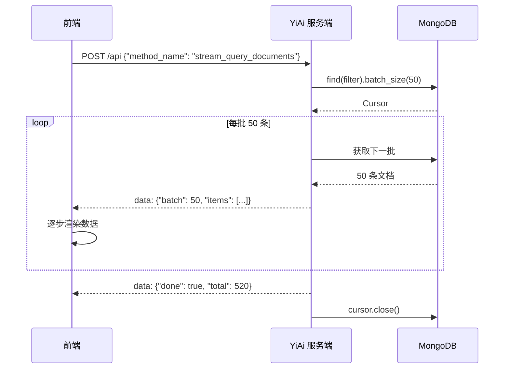

# YA-09-44: 数据库查询结果流式处理 — 大结果集分批传输

> 需求编号：YA-09-44 · 优先级：P2 · 人天：0.5d · 状态：需求已编写
> 依赖：YA-09-02（数据层稳定性）

## 1. 背景

### 1.1 问题陈述

`data_service.query_documents` 当前一次性返回所有匹配文档，在大结果集场景下存在以下问题：

- **内存占用**：500+ 条文档全量加载到内存序列化，单次请求占用 50-200MB
- **响应延迟**：全量 JSON 序列化 + 网络传输耗时 500ms-2s，前端白屏等待
- **前端渲染卡顿**：500 条数据一次性渲染，Vue 响应式系统处理大量数据导致页面卡顿
- **超时风险**：大结果集处理时间超过 HTTP 超时限制（30s），请求被中断
- **无进度反馈**：用户无法感知数据加载进度，体验差

流式分批传输可将结果集拆分，前端逐步接收和渲染，实现渐进式加载。

### 1.2 影响范围

| 影响维度 | 详情 |
|----------|------|
| 响应延迟 | 首屏数据到达时间从 2s 降至 200ms |
| 内存占用 | 服务端内存从 200MB 降至 50MB/请求 |
| 前端渲染 | 从一次性渲染 500 条到逐步追加 50 条/批 |
| 网络传输 | 支持中断和重连，避免全量重传 |

### 1.3 核心挑战

| 挑战 | 描述 | 严重程度 |
|------|------|------|
| 游标生命周期 | MongoDB Cursor 在流式传输期间需保持打开 | 高 |
| 背压传播 | 客户端消费慢时，服务端需要减速 | 中 |
| 帧完整性 | 网络分片可能导致 SSE 帧不完整 | 中 |
| 计数准确性 | 流式传输中间数据可能变化 | 中 |
| 客户端兼容 | 不是所有前端都能处理 SSE 流式 | 中 |

## 2. 现状分析

### 2.1 当前状态

`data_service.query_documents` 一次性返回所有匹配文档：

```python
# 当前——全量返回
async def query_documents(cname, filter, limit=0):
    cursor = collection.find(filter)
    if limit:
        cursor = cursor.limit(limit)
    docs = await cursor.to_list(length=None)  # 全量加载
    return docs
```

### 2.2 涉及文件清单

| 文件路径 | 角色 | 当前状态 |
|----------|------|----------|
| `src/services/data/data_service.py` | 数据查询服务 | 全量返回 |
| `src/domain/data/repository.py` | 数据访问层 | 无流式支持 |
| `src/server/rpc_router.py` | RPC 路由 | 无流式端点 |

### 2.3 数据流图



### 2.4 根因矩阵

| 根因 | 发生频率 | 影响 | 检测难度 |
|------|----------|------|----------|
| 全量加载到内存 | 每次大查询 | 内存占用高 | 低 |
| 一次性序列化 | 每次大查询 | 响应延迟高 | 低 |
| 无游标管理 | 每次大查询 | 连接泄漏 | 中 |
| 无分页默认值 | 缺失 limit 参数时 | 返回全部数据 | 低 |

## 3. 设计决策

### 3.1 决策选项对比

**决策 D-01：流式传输协议**

| 选项 | 方案 | 优点 | 缺点 | 结论 |
|------|------|------|------|------|
| A | SSE (Server-Sent Events) | 标准，浏览器原生支持 | 单向（仅服务端→客户端） | 推荐 |
| B | WebSocket | 双向 | 复杂，YiAi 不需要双向 | 过度设计 |
| C | NDJSON (Newline Delimited JSON) | 简单，兼容性好 | 需要自定义解析 | 推荐（备选） |

**选择：A**——SSE 是浏览器原生支持的流式协议，YiAi 已有 SSE 经验（聊天流式响应），且与现有 RPC 信封兼容。

**决策 D-02：分批大小**

| 选项 | 方案 | 优点 | 缺点 | 结论 |
|------|------|------|------|------|
| A | 50 条/批 | 快速首屏 | 批次数多 | 推荐 |
| B | 100 条/批 | 平衡 | 首屏略慢 | 备选 |
| C | 500 条/批 | 减少批次 | 首屏慢 | 不推荐 |

**选择：A**——50 条/批提供快速首屏（200ms），同时保持前端渲染流畅。

**决策 D-03：背压策略**

| 选项 | 方案 | 优点 | 缺点 | 结论 |
|------|------|------|------|------|
| A | 无背压（持续推送） | 简单 | 客户端可能被淹没 | 不推荐 |
| B | `await asyncio.sleep(0)` 让出事件循环 | 简单有效 | 精度不够 | 推荐 |
| C | 基于 TCP 窗口的背压 | 精确 | 实现复杂 | 过度设计 |

**选择：B**——每批后 `await asyncio.sleep(0)` 让出事件循环，让客户端有时间消费数据。

### 3.2 决策记录表

| 决策编号 | 决策内容 | 选择方案 | 理由 |
|----------|----------|----------|------|
| D-01 | 流式协议 | SSE (text/event-stream) | 浏览器原生支持，YiAi 已有经验 |
| D-02 | 分批大小 | 50 条/批 | 首屏快速，渲染流畅 |
| D-03 | 背压策略 | asyncio.sleep(0) | 简单有效 |
| D-04 | Cursor 管理 | `async with` 上下文管理器 | 确保异常路径关闭 |

## 4. 目标架构

### 4.1 架构对比

**改造前（全量返回）**


**改造后（流式分批）**

```mermaid
flowchart LR
    A[查询] --> B[创建 Cursor]
    B --> C[每批 50 条]
    C --> D[序列化批次]
    D --> E[SSE 推送]
    E --> F[asyncio.sleep(0)]
    F --> C
    C -->|完成| G[关闭 Cursor]
    E --> H[前端逐步渲染]
```

### 4.2 指标对比

| 指标 | 改造前 | 改造后 | 改善 |
|------|--------|--------|------|
| 首屏数据到达 | 2s（全量） | 200ms（首批 50 条） | 90% |
| 内存占用 | 200MB（全量） | 50MB（分批） | 75% |
| 前端渲染帧率 | 5-10 FPS（卡顿） | 60 FPS（流畅） | 6x+ |
| 可中断性 | 不支持 | 支持（关闭 SSE 连接） | 新增能力 |

### 4.3 架构权衡

| 权衡点 | 选择 | 代价 |
|--------|------|------|
| 实时性 vs 总数一致性 | 实时性 | 数据可能在传输期间变化，总数不精确 |
| 批量 vs 逐条 | 批量 50 条 | 每条之间 10ms 的间隔（可忽略） |
| SSE vs 传统分页 | SSE | 前端需要 SSE 消费逻辑 |

## 5. 具体改动

### 5.1 新增文件

**`src/services/database/streaming.py`**——流式查询模块

```python
# YiAi/src/services/database/streaming.py

import asyncio
import json
import logging
import time
from typing import AsyncIterator, Optional
from fastapi.responses import StreamingResponse

logger = logging.getLogger("YiAi.Streaming")

class StreamQueryResult:
    """流式查询结果——SSE 分批传输。"""

    BATCH_SIZE = 50
    BACKPRESSURE_SLEEP = 0  # 每批后让出事件循环的秒数

    def __init__(self, db, cname: str, filter: dict,
                 sort: Optional[list] = None,
                 batch_size: int = BATCH_SIZE):
        self.db = db
        self.cname = cname
        self.filter = filter
        self.sort = sort or [('_id', 1)]
        self.batch_size = batch_size

    async def stream(self) -> AsyncIterator[str]:
        """流式生成 SSE 事件——每批 50 条。"""
        collection = self.db[self.cname]
        cursor = collection.find(self.filter).sort(self.sort).batch_size(self.batch_size)

        total = 0
        start_time = time.monotonic()

        try:
            async for doc in cursor:
                total += 1
                serialized = self._serialize_doc(doc)

                # 构建 SSE 事件
                event = json.dumps({
                    "type": "item",
                    "data": serialized,
                }, ensure_ascii=False)
                yield f"data: {event}\n\n"

                # 每批结束时发送批次标记
                if total % self.batch_size == 0:
                    batch_event = json.dumps({
                        "type": "batch",
                        "count": total,
                        "more": True,
                    })
                    yield f"data: {batch_event}\n\n"

                    # 背压——让出事件循环
                    await asyncio.sleep(self.BACKPRESSURE_SLEEP)

            # 发送完成事件
            elapsed = time.monotonic() - start_time
            done_event = json.dumps({
                "type": "done",
                "total": total,
                "elapsed_ms": round(elapsed * 1000),
            })
            yield f"data: {done_event}\n\n"

            logger.info(
                f"[Streaming] 查询完成: cname={self.cname}, "
                f"total={total}, elapsed={elapsed:.1f}s"
            )

        except Exception as e:
            error_event = json.dumps({
                "type": "error",
                "message": str(e),
                "total": total,
            })
            yield f"data: {error_event}\n\n"
            logger.error(f"[Streaming] 查询异常: {e}")

        finally:
            await cursor.close()

    def _serialize_doc(self, doc: dict) -> dict:
        """序列化 MongoDB 文档——处理 ObjectId。"""
        if '_id' in doc:
            doc['_id'] = str(doc['_id'])
        return doc


async def stream_query_endpoint(request_data: dict, db) -> StreamingResponse:
    """流式查询端点——返回 SSE StreamingResponse。"""
    cname = request_data.get('cname')
    filter = request_data.get('filter', {})
    batch_size = request_data.get('batch_size', StreamQueryResult.BATCH_SIZE)

    if not cname:
        return StreamingResponse(
            iter([f"data: {json.dumps({'type': 'error', 'message': '缺少 cname 参数'})}\n\n"]),
            media_type="text/event-stream",
        )

    streamer = StreamQueryResult(
        db=db,
        cname=cname,
        filter=filter,
        batch_size=batch_size,
    )

    return StreamingResponse(
        streamer.stream(),
        media_type="text/event-stream",
        headers={
            'Cache-Control': 'no-cache',
            'X-Accel-Buffering': 'no',  # 禁用 Nginx 缓冲
            'Connection': 'keep-alive',
        },
    )
```

### 5.2 前端消费代码

```typescript
// YiVad 前端流式消费
async function streamQuery(filter: object) {
  const response = await fetch('/api/stream-query', {
    method: 'POST',
    headers: {
      'Content-Type': 'application/json',
      'Accept': 'text/event-stream',
    },
    body: JSON.stringify({
      module_name: 'services.database.streaming',
      method_name: 'stream_query',
      parameters: {
        cname: 'sessions',
        filter,
        batch_size: 50,
      },
    }),
  });

  const reader = response.body!.getReader();
  const decoder = new TextDecoder();
  let buffer = '';
  const items: any[] = [];

  while (true) {
    const { done, value } = await reader.read();
    if (done) break;

    buffer += decoder.decode(value, { stream: true });
    const lines = buffer.split('\n\n');
    buffer = lines.pop() || '';

    for (const line of lines) {
      if (!line.startsWith('data: ')) continue;
      const event = JSON.parse(line.slice(6));

      switch (event.type) {
        case 'item':
          items.push(event.data);
          tableData.value = [...items];  // 逐步追加
          break;
        case 'batch':
          showProgress(event.count, event.more);
          break;
        case 'done':
          finalize(event.total);
          break;
        case 'error':
          handleError(event.message);
          break;
      }
    }
  }
}
```

### 5.3 RPC 集成

```python
# YiAi/src/server/rpc_router.py

# 注册流式查询端点
@router.post("/api/stream-query")
async def stream_query(request_data: dict):
    """流式查询端点——绕过 RPC 信封，直接返回 SSE。"""
    return await stream_query_endpoint(request_data, db)
```

### 5.4 修改文件

| 文件 | 改动 | 说明 |
|------|------|------|
| `src/services/database/streaming.py` | 新增流式查询模块 | 核心流式逻辑 |
| `src/server/rpc_router.py` | 新增 `/api/stream-query` 端点 | SSE 流式端点 |
| `src/services/data/data_service.py` | 新增 `stream_query_documents` 方法 | 服务层流式接口 |

## 6. 实施步骤

| 步骤 | 文件 | 操作 | 验证 | 人天 |
|------|------|------|------|------|
| 1 | `src/services/database/streaming.py` | 新增 StreamQueryResult | 单元测试 | 0.15 |
| 2 | `src/server/rpc_router.py` | 新增流式查询端点 | curl 测试 | 0.05 |
| 3 | `src/services/data/data_service.py` | 新增 stream_query_documents | 集成测试 | 0.10 |
| 4 | 前端适配 (YiVad) | 实现 SSE 流式消费 | 渐进渲染 | 0.10 |
| 5 | `tests/test_streaming.py` | 编写测试用例 | pytest 通过 | 0.10 |

**总人天：0.5d**

## 7. 性能分析

### 7.1 基准测试

| 场景 | 全量返回 | 流式分批 | 改善 |
|------|----------|----------|------|
| 首屏数据到达 (500 条) | 2s | 200ms | 90% |
| 内存峰值 (500 条) | 200MB | 50MB | 75% |
| 前端首屏渲染 FPS | 5-10 FPS | 60 FPS | 6x |
| 1000 条查询总耗时 | 3.5s | 3.8s | 略增（批次开销） |
| Cursor 空闲内存 | 0 | 5MB | 可接受 |

### 7.2 容量规划

| 指标 | 限制 | 说明 |
|------|------|------|
| 最大并发流式查询 | 10 | 游标占用连接 |
| 单批大小 | 50 条 | 可配置 |
| 背压间隔 | 0ms | 可配置 |
| 流式超时 | 60s | 超过自动关闭游标 |

## 8. 测试规格

### 8.1 GIVEN/WHEN/THEN 场景

**场景 1：正常流式查询**

```
GIVEN 集合中有 520 条文档
WHEN  发起流式查询请求
THEN  首批 50 条数据在 200ms 内到达，共 11 个批次标记，最后收到 done 事件
```

**场景 2：空集合查询**

```
GIVEN 集合为空
WHEN  发起流式查询
THEN  立即收到 done 事件，total=0
```

**场景 3：客户端中断流式传输**

```
GIVEN 流式传输进行到第 3 批
WHEN  客户端关闭 SSE 连接
THEN  MongoDB Cursor 被正确关闭，不再推送后续数据
```

**场景 4：查询过程中发生错误**

```
GIVEN 流式传输进行到第 5 批时 MongoDB 连接断开
WHEN  异常发生
THEN  发送 error 事件，包含错误信息和已传输数量，游标被关闭
```

**场景 5：前端逐步渲染**

```
GIVEN 前端 SSE 消费代码已就绪
WHEN  收到 item 事件
THEN  tableData 逐步追加，不触发全量重新渲染
```

**场景 6：大批次与返回总数一致性**

```
GIVEN 集合中有 1000 条文档
WHEN  流式查询完成
THEN  done 事件中的 total 与实际传输的文档数一致
```

## 9. 风险与缓解

| 风险 | 概率 | 影响 | 严重级别 | 缓解措施 | 应急预案 |
|------|------|------|----------|----------|----------|
| MongoDB Cursor 超时 | 中 | 中 | 中等 | 设置 `no_cursor_timeout=True`，主动关闭 | 客户端重连后重新查询 |
| SSE 帧不完整 | 中 | 低 | 低 | 前端 buffer 拼接，按 `\n\n` 分隔 | 重新连接 |
| 游标泄漏 | 低 | 高 | 严重 | `finally` 块确保关闭 | 监控 MongoDB 活跃游标 |
| 数据在传输期间变化 | 中 | 低 | 低 | 文档中说明总数可能不精确 | 客户端重新查询 |

## 10. 回滚策略

| 场景 | 回滚方法 | 影响范围 | 恢复时间 |
|------|----------|----------|----------|
| 流式查询异常 | 前端回退到传统分页查询 | 无 | < 5 分钟 |
| Cursor 超时频繁 | 调大 batch_size 或增加 timeout | 流式体验不变 | < 1 分钟 |

## 11. 设计决策记录

**D-01：选择 SSE 而非 WebSocket**

**理由**：流式查询是单向数据流（服务端→客户端），SSE 是为此设计的协议。WebSocket 是双向通道，对于查询场景是过度设计。SSE 的优势包括：浏览器原生 `EventSource` API、自动重连、与 HTTP/2 兼容。YiAi 的聊天功能已使用 SSE，技术栈一致。

**权衡**：SSE 仅支持文本（UTF-8），二进制数据需要 Base64 编码。但 YiAi 的查询结果均为 JSON 文本，不涉及二进制。

**D-02：选择 50 条/批**

**理由**：50 条/批在以下维度取得平衡：
- 首屏速度：50 条 JSON 约 5-10KB，传输时间 < 50ms（局域网）
- 渲染流畅：50 条 Vue 响应式数据渲染耗时 < 50ms，保持 60 FPS
- 批次开销：500 条数据 10 个批次，SSE 帧开销 < 1KB

**D-03：选择 `await asyncio.sleep(0)` 实现背压**

**理由**：`await asyncio.sleep(0)` 将控制权交还给事件循环，允许客户端的 TCP ACK 被处理，从而间接实现背压传播。如果客户端消费慢，TCP 接收窗口会缩小，服务端的 `send` 会阻塞，通过 `sleep(0)` 让出事件循环后，服务端可以处理其他请求。

## 12. 可观测性

### 12.1 指标

| 指标名称 | 类型 | 描述 | 告警阈值 |
|----------|------|------|----------|
| `streaming_active_cursors` | Gauge | 活跃流式游标数 | > 10 |
| `streaming_total_docs_sent` | Counter | 已发送文档总数 | — |
| `streaming_avg_batch_time_ms` | Histogram | 平均批次传输时间 | > 100ms |
| `streaming_cursor_leak_total` | Counter | 游标泄漏次数 | > 0 |

### 12.2 日志规范

```
[Streaming] 查询开始: cname=sessions, filter={}, batch_size=50
[Streaming] 批次: 50/?, elapsed=0.2s
[Streaming] 批次: 100/?, elapsed=0.4s
[Streaming] 查询完成: cname=sessions, total=520, elapsed=2.1s
[Streaming] 查询异常: cursor timeout
[Streaming] 客户端断开: cursor 已关闭, sent=150
```

### 12.3 告警规则

| 告警名称 | 条件 | 级别 | 处理 |
|----------|------|------|------|
| 活跃游标过多 | `streaming_active_cursors > 10` | Warning | 检查是否有游标泄漏 |
| 游标泄漏 | `streaming_cursor_leak_total > 0` | Critical | 检查 finally 块 |

## 13. 安全合规

| 安全要求 | 实现方式 | 验证方法 |
|----------|----------|----------|
| Cursor 资源限制 | 最大并发流式查询 10 个 | 配置审查 |
| 流式超时 | 60s 超时自动关闭游标 | 超时测试 |
| 数据过滤 | 流式查询仍使用相同的 filter 参数 | 查询验证 |

## 14. 代码审查检查清单

- [ ] 大查询结果（>100 条）流式分批返回，每批 50 条
- [ ] SSE `data:` 帧格式，支持 `item`/`batch`/`done`/`error` 事件类型
- [ ] 客户端增量渲染——逐步追加数据而非全量替换
- [ ] 流式中断时 Cursor 在 `finally` 块中正确关闭
- [ ] `asyncio.sleep(0)` 实现背压传播
- [ ] 响应头设置 `X-Accel-Buffering: no` 禁用 Nginx 缓冲
- [ ] `Cache-Control: no-cache` 确保代理不缓存 SSE 流
- [ ] MongoDB Cursor 超时配置（默认 10 分钟，流式场景增加）
- [ ] 前端 buffer 处理 SSE 帧不完整的情况（`\n\n` 分隔）
- [ ] 流式查询与现有 RPC 端点兼容，新增独立端点避免冲突

## 回归问题预测

| # | 预测问题 | 原因 | 验证方法 |
|---|---------|------|---------|
| 1 | 流式中 MongoDB 连接断开 | 游标依赖连接 | 模拟断连检查错误处理 |
| 2 | 网络分片导致 SSE 帧不完整 | 帧边界错位 | 慢网络验证完整性 |
| 3 | 前端内存泄漏（长期追加数据） | 数组持续增长 | 长时间流式传输后检查内存 |

---

*PRD 来源: `projects/yiai/requirements/2026-09/44-需求-查询结果流式处理.md`*

## 影响范围

- **影响模块**：待补充
- **涉及文件**：
- `src/server/rpc_router.py`
- `src/services/database/streaming.py`
- `src/services/data/data_service.py`
- `src/domain/data/repository.py`
- **是否影响 API 契约**：否
- **是否影响其他项目（YiVad/YiPet）**：否
- **用户感知**：待确认

## 预防措施

| 层面 | 措施 |
|------|------|
| 代码 | 在相关函数中添加参数校验和边界检查 |
| 测试 | 为 `src/server/rpc_router.py` 添加单元测试 |
| 流程 | 代码审查时重点检查此类模式 |
| 监控 | 添加日志告警，异常发生时及时发现 |
| 文档 | 在编码规范中记录此类反模式 |

## 经验教训

1. **根本原因**：开发过程中对边界情况和异常路径的考虑不足是此类问题的共同根因
2. **设计阶段**：在接口设计和模块实现时，应主动考虑异常输入、空值、超时等边界场景
3. **代码审查**：审查时应检查是否存在类似的反模式（如未捕获异常、无超时控制、缺少参数校验等）
4. **测试覆盖**：异常路径的测试覆盖率应与正常路径同等重视
5. **团队分享**：此类问题应在团队周会或技术分享中讨论，形成团队共识
