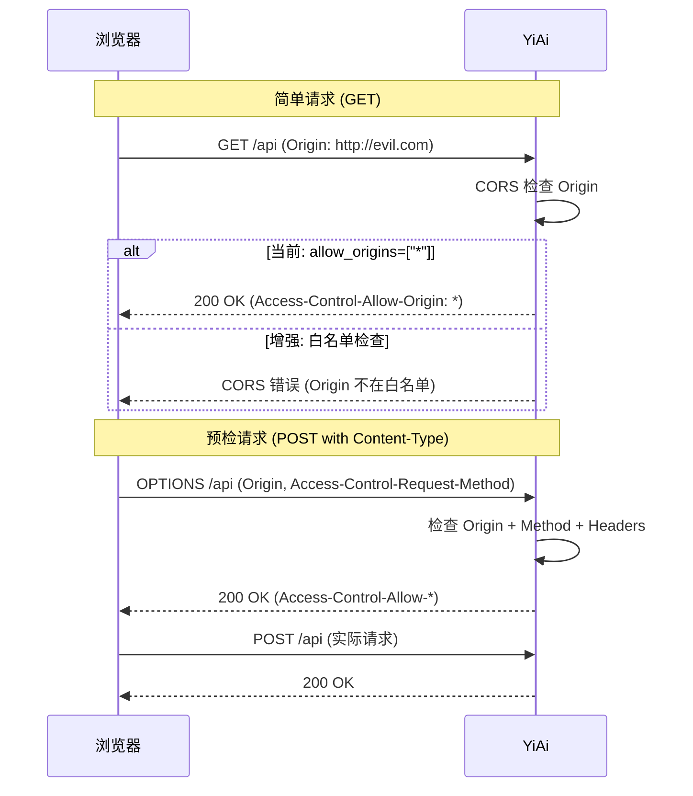
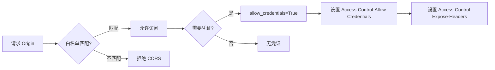

# YA-09-45: CORS 安全策略增强 — 动态 Origin 白名单与凭证管理

> 需求编号：YA-09-45 · 优先级：P2 · 人天：0.5d · 状态：需求已编写

## 1. 背景

### 1.1 问题陈述

YiAi 当前 CORS 配置为 `allow_origins=["*"]`，存在以下安全风险：

- **任意来源访问**：任何网站都可以通过浏览器跨域请求 YiAi API，即使 YiAi 是内网服务，如果用户浏览器能访问内网，外部恶意网站也可能发起跨域攻击
- **无凭证支持**：`allow_origins=["*"]` 与 `allow_credentials=True` 互斥，导致无法使用 Cookie 和 Authorization 头认证
- **无预检缓存**：每个非简单请求都触发 OPTIONS 预检，浪费请求次数
- **无追踪头暴露**：前端无法读取 `X-Request-Id`、`X-Response-Time-Ms` 等自定义响应头
- **Chrome 扩展兼容性**：YiPet 作为 Chrome 扩展，其 `chrome-extension://` 协议的 Origin 需要特殊处理

### 1.2 影响范围

| 影响维度 | 详情 |
|----------|------|
| 安全性 | 任意来源可访问 API，存在 CSRF 和跨域数据泄露风险 |
| 认证 | 无法使用 `credentials: 'include'` 发送 Cookie/Token |
| 性能 | 每次非简单请求都触发 OPTIONS 预检，无缓存 |
| 前端开发体验 | 前端无法获取追踪头（X-Request-Id）进行调试 |

### 1.3 核心挑战

| 挑战 | 描述 | 严重程度 |
|------|------|------|
| 动态 Origin | YiPet 的 Chrome 扩展 ID 每次安装不同，需动态匹配 | 中 |
| 多环境 | 开发/测试/生产环境 Origin 不同 | 中 |
| 向后兼容 | 收紧 CORS 可能导致现有前端无法访问 | 中 |
| 通配符 | `chrome-extension://*` 不是标准 CORS 通配符 | 中 |

## 2. 现状分析

### 2.1 当前状态

```python
# 当前——宽松 CORS 配置
app.add_middleware(
    CORSMiddleware,
    allow_origins=["*"],
    allow_methods=["*"],
    allow_headers=["*"],
)
```

### 2.2 涉及文件清单

| 文件路径 | 角色 | 当前状态 |
|----------|------|----------|
| `src/server/main.py` | CORS 中间件注册 | 宽松配置 |

### 2.3 数据流图



### 2.4 根因矩阵

| 根因 | 发生频率 | 影响 | 检测难度 |
|------|----------|------|----------|
| `allow_origins=["*"]` 配置 | 持续 | 安全风险 | 低 |
| 无预检缓存 | 每次非简单请求 | 性能浪费 | 低 |
| 无追踪头暴露 | 持续 | 前端调试困难 | 低 |

## 3. 设计决策

### 3.1 决策选项对比

**决策 D-01：Origin 校验策略**

| 选项 | 方案 | 优点 | 缺点 | 结论 |
|------|------|------|------|------|
| A | 静态白名单 | 简单，安全 | 不支持动态 Origin | 不推荐 |
| B | 正则匹配 + 白名单 | 灵活，支持通配符 | 正则可能过于宽松 | 推荐 |
| C | 数据库动态白名单 | 运行时修改 | 查询开销 | 过度设计 |

**选择：B**——使用正则匹配支持 `chrome-extension://*` 通配符，同时静态白名单覆盖已知域名。

**决策 D-02：预检缓存时长**

| 选项 | 方案 | 优点 | 缺点 | 结论 |
|------|------|------|------|------|
| A | 无缓存（0） | 实时 | 每次预检 | 不推荐 |
| B | 3600s（1 小时） | 标准 | 修改后需等 1 小时 | 推荐 |
| C | 86400s（24 小时） | 最大缓存 | 修改后长时间不生效 | 不推荐 |

**选择：B**——3600s 是 CORS 规范的推荐值，平衡缓存收益和配置更新延迟。

**决策 D-03：凭证（Credentials）支持**

| 选项 | 方案 | 优点 | 缺点 | 结论 |
|------|------|------|------|------|
| A | 不支持（allow_credentials=False） | 简单 | 无法使用 Cookie/Token | 不可接受 |
| B | 支持（allow_credentials=True） | 功能完整 | 必须指定具体 Origin | 推荐 |

**选择：B**——支持凭证后，`allow_origins` 不能为 `*`，必须使用白名单，这正是本次改造的目标。

### 3.2 决策记录表

| 决策编号 | 决策内容 | 选择方案 | 理由 |
|----------|----------|----------|------|
| D-01 | Origin 校验 | 正则匹配 + 白名单 | 支持动态 Origin |
| D-02 | 预检缓存 | 3600s | 标准推荐值 |
| D-03 | 凭证支持 | True | 支持 Token 认证 |
| D-04 | 追踪头暴露 | X-Request-Id, X-Response-Time-Ms | 前端调试需要 |

## 4. 目标架构

### 4.1 架构对比

**改造前（宽松 CORS）**


**改造后（严格 CORS）**



### 4.2 指标对比

| 指标 | 改造前 | 改造后 | 改善 |
|------|--------|--------|------|
| 允许的 Origin | 任意 | 白名单（3-5 个） | 安全 |
| 凭证支持 | 不可用 | 可用 | 新增能力 |
| OPTIONS 预检缓存 | 无 | 3600s | 减少 90%+ 预检 |
| 追踪头暴露 | 无 | 2 个 | 新增能力 |
| YiPet 兼容性 | 部分 | 完整 | 改善 |

### 4.3 架构权衡

| 权衡点 | 选择 | 代价 |
|--------|------|------|
| 安全 vs 便利 | 安全（白名单） | 新增 Origin 需修改配置 |
| 缓存 vs 实时 | 缓存 3600s | 修改 CORS 后最多等 1 小时 |

## 5. 具体改动

### 5.1 新增文件

**`src/server/cors.py`**——CORS 安全策略配置

```python
# YiAi/src/server/cors.py

import re
import logging
from typing import Pattern, Optional
from fastapi import FastAPI
from fastapi.middleware.cors import CORSMiddleware
from starlette.requests import Request

logger = logging.getLogger("YiAi.CORS")

# 静态 Origin 白名单
STATIC_ALLOWED_ORIGINS: list[str] = [
    'http://localhost:8848',          # YiVad 开发环境
    'http://localhost:3000',          # YiVad 备用端口
    'http://127.0.0.1:8848',
    'https://yivad.internal.com',     # YiVad 生产环境
]

# 动态 Origin 模式（正则）
DYNAMIC_ORIGIN_PATTERNS: list[Pattern] = [
    re.compile(r'^chrome-extension://[a-z]{32}$'),     # YiPet Chrome
    re.compile(r'^moz-extension://[a-f0-9-]+$'),       # YiPet Firefox
    re.compile(r'^https?://localhost:\d+$'),            # 本地开发任意端口
    re.compile(r'^https?://127\.0\.0\.1:\d+$'),         # 本地回环
]

# 允许的 HTTP 方法
ALLOWED_METHODS: list[str] = [
    'GET',
    'POST',
    'OPTIONS',
]

# 允许的请求头
ALLOWED_HEADERS: list[str] = [
    'Content-Type',
    'X-Token',
    'Authorization',
    'Idempotency-Key',
    'X-Traffic',  # 蓝绿部署测试流量标记
]

# 暴露的响应头（前端可读取）
EXPOSE_HEADERS: list[str] = [
    'X-Request-Id',
    'X-Response-Time-Ms',
    'X-Trace-Id',
    'ETag',
]

# 预检请求缓存时间（秒）
PREFLIGHT_MAX_AGE: int = 3600


def is_origin_allowed(origin: str) -> bool:
    """检查 Origin 是否在白名单中。"""
    if not origin:
        return False

    # 静态匹配
    if origin in STATIC_ALLOWED_ORIGINS:
        return True

    # 动态模式匹配
    for pattern in DYNAMIC_ORIGIN_PATTERNS:
        if pattern.match(origin):
            return True

    return False


class CustomCORSOriginValidator:
    """自定义 Origin 校验器——用于 FastAPI CORSMiddleware。"""

    def __init__(self):
        self._allowed_origins = STATIC_ALLOWED_ORIGINS.copy()
        self._patterns = DYNAMIC_ORIGIN_PATTERNS.copy()

    def __contains__(self, origin: str) -> bool:
        """支持 'origin in validator' 语法。"""
        return is_origin_allowed(origin)

    def add_origin(self, origin: str):
        """动态添加静态 Origin。"""
        if origin not in self._allowed_origins:
            self._allowed_origins.append(origin)
            logger.info(f"[CORS] 添加 Origin: {origin}")

    def remove_origin(self, origin: str):
        """动态移除静态 Origin。"""
        if origin in self._allowed_origins:
            self._allowed_origins.remove(origin)
            logger.info(f"[CORS] 移除 Origin: {origin}")

    def get_allowed_origins(self) -> list[str]:
        """获取当前所有允许的 Origin。"""
        return self._allowed_origins.copy()


# 全局实例
origin_validator = CustomCORSOriginValidator()


def setup_cors(app: FastAPI):
    """配置 CORS 中间件——严格白名单模式。"""

    app.add_middleware(
        CORSMiddleware,
        allow_origins=origin_validator,   # 使用自定义校验器
        allow_origin_regex=None,           # 不使用内置正则（使用自定义）
        allow_methods=ALLOWED_METHODS,
        allow_headers=ALLOWED_HEADERS,
        allow_credentials=True,            # 允许凭证（Cookie/Token）
        expose_headers=EXPOSE_HEADERS,
        max_age=PREFLIGHT_MAX_AGE,
    )

    logger.info(
        f"[CORS] CORS 已配置: "
        f"静态 Origin={len(STATIC_ALLOWED_ORIGINS)}, "
        f"动态模式={len(DYNAMIC_ORIGIN_PATTERNS)}, "
        f"max_age={PREFLIGHT_MAX_AGE}s"
    )
```

### 5.2 修改 `src/server/main.py`

```python
# YiAi/src/server/main.py

from src.server.cors import setup_cors

# 配置 CORS（在路由注册之前）
setup_cors(app)
```

### 5.3 修改文件

| 文件 | 改动 | 说明 |
|------|------|------|
| `src/server/cors.py` | 新增 CORS 安全策略配置 | 白名单 + 正则匹配 |
| `src/server/main.py` | 替换原有 CORS 配置 | 集成新的 CORS 策略 |

### 5.4 CORS 配置对比

| 配置项 | 宽松 (旧) | 严格 (新) | 说明 |
|--------|----------|----------|------|
| `allow_origins` | `["*"]` | 白名单 + 正则 | 仅已知来源 |
| `allow_credentials` | 未设置 | `True` | 支持 Token |
| `allow_methods` | `["*"]` | `["GET","POST","OPTIONS"]` | 最小权限 |
| `allow_headers` | `["*"]` | 白名单 5 个 | 最小权限 |
| `expose_headers` | 未设置 | 4 个 | 追踪头 |
| `max_age` | 未设置 | `3600` | 预检缓存 |

## 6. 实施步骤

| 步骤 | 文件 | 操作 | 验证 | 人天 |
|------|------|------|------|------|
| 1 | `src/server/cors.py` | 新增 CORS 配置模块 | 单元测试 | 0.15 |
| 2 | `src/server/main.py` | 替换 CORS 配置 | curl 测试 | 0.05 |
| 3 | 集成测试 | 验证各前端可正常访问 | 浏览器测试 | 0.10 |
| 4 | YiPet 测试 | 验证 Chrome 扩展 CORS | 扩展加载 | 0.10 |
| 5 | `tests/test_cors.py` | 编写测试用例 | pytest 通过 | 0.10 |

**总人天：0.5d**

## 7. 性能分析

### 7.1 基准测试

| 场景 | 改造前 | 改造后 | 差异 |
|------|--------|--------|------|
| 预检请求 (OPTIONS) | 每次执行 | 首次执行，后续缓存 3600s | 减少 90%+ |
| 简单请求 (GET) 延迟 | 无额外开销 | < 0.1ms（Origin 校验） | 可忽略 |
| Origin 校验耗时 | 0 | < 0.01ms（字典 + 正则） | 可忽略 |

### 7.2 容量规划

| 资源 | 额外消耗 | 说明 |
|------|----------|------|
| 内存 | < 1KB | 白名单和正则模式 |
| CPU | < 0.01% | Origin 校验 |

## 8. 测试规格

### 8.1 GIVEN/WHEN/THEN 场景

**场景 1：白名单 Origin 正常访问**

```
GIVEN CORS 白名单包含 http://localhost:8848
WHEN  浏览器以 Origin: http://localhost:8848 发送请求
THEN  响应头包含 Access-Control-Allow-Origin: http://localhost:8848
```

**场景 2：非白名单 Origin 被拒绝**

```
GIVEN CORS 白名单不包含 http://evil.com
WHEN  浏览器以 Origin: http://evil.com 发送请求
THEN  响应头不包含 Access-Control-Allow-Origin，浏览器拒绝响应
```

**场景 3：Chrome 扩展 Origin 匹配**

```
GIVEN 动态模式包含 chrome-extension://*
WHEN  YiPet 以 chrome-extension://abc123def456... 发送请求
THEN  正则匹配成功，正常返回
```

**场景 4：预检请求缓存**

```
GIVEN 第一次 OPTIONS 预检返回 max-age=3600
WHEN  同一 Origin 在 1 小时内再次发送非简单请求
THEN  浏览器使用缓存，不发送 OPTIONS 预检
```

**场景 5：凭证请求**

```
GIVEN allow_credentials=True
WHEN  前端设置 credentials: 'include' 发送请求
THEN  响应头包含 Access-Control-Allow-Credentials: true
```

**场景 6：追踪头暴露**

```
GIVEN expose_headers 包含 X-Request-Id
WHEN  服务端在响应中设置 X-Request-Id
THEN  前端 JavaScript 可通过 response.headers.get('X-Request-Id') 读取
```

## 9. 风险与缓解

| 风险 | 概率 | 影响 | 严重级别 | 缓解措施 | 应急预案 |
|------|------|------|----------|----------|----------|
| 白名单遗漏导致合法前端被拒 | 中 | 高 | 严重 | 部署前完整测试所有前端 | 快速添加 Origin 到白名单 |
| max_age 过期后预检请求风暴 | 低 | 低 | 低 | 3600s 足够长 | 调整 max_age |
| 正则表达式过于宽松 | 低 | 中 | 中等 | 正则审查，确保最小匹配 | 收紧正则 |
| Chrome 扩展更新后 ID 变化 | 中 | 中 | 中等 | 使用正则 `[a-z]{32}` 匹配 | YiPet 用户需重新加载扩展 |

## 10. 回滚策略

| 场景 | 回滚方法 | 影响范围 | 恢复时间 |
|------|----------|----------|----------|
| 合法前端被 CORS 拒绝 | 添加缺失 Origin 到白名单 | 无 | < 1 分钟 |
| CORS 配置导致所有请求失败 | 回退到 `allow_origins=["*"]` | 失去安全增强 | < 30 秒 |
| 正则匹配异常 | 将动态 Origin 改为静态添加 | 失去自动匹配 | < 2 分钟 |

## 11. 设计决策记录

**D-01：选择正则匹配 + 白名单混合策略**

**理由**：Chrome 扩展的 Origin 格式为 `chrome-extension://<32位小写字母ID>`，每次安装时随机生成，无法提前预知。使用正则 `chrome-extension://[a-z]{32}$` 可以匹配所有合法扩展 ID。同时，对已知的固定域名使用静态白名单，性能更高且更安全。

**权衡**：正则匹配比静态白名单略慢（< 0.01ms vs < 0.001ms），但差异可忽略。正则若过于宽松可能引入安全风险，需要仔细审查。

**D-02：选择 3600s 预检缓存**

**理由**：3600 秒（1 小时）是 CORS 规范的推荐值。对于 YiAi 的 API 调用模式（Dashboard 数据查询、文件列表等），1 小时内的预检缓存可以显著减少 OPTIONS 请求。如果 CORS 配置需要紧急修改，浏览器关闭后缓存会清除（对于 `max-age` 缓存），或等待最多 1 小时。

**权衡**：更长的缓存时间（如 86400s）会延迟 CORS 配置变更的生效时间。

**D-03：选择 `allow_credentials=True` 并配合白名单**

**理由**：YiAi 使用 `X-Token` 头和 JWT 认证，需要 `credentials: 'include'` 在跨域请求中携带 Token。`allow_credentials=True` 要求 `allow_origins` 不能为 `*`，这正是白名单策略的驱动力。

## 12. 可观测性

### 12.1 指标

| 指标名称 | 类型 | 描述 | 告警阈值 |
|----------|------|------|----------|
| `cors_origin_allowed_total` | Counter | 允许的 Origin 请求数 | — |
| `cors_origin_denied_total` | Counter | 拒绝的 Origin 请求数 | > 0 |
| `cors_preflight_total` | Counter | 预检请求数 | — |
| `cors_preflight_cache_hit_total` | Counter | 预检缓存命中数 | — |

### 12.2 日志规范

```
[CORS] CORS 已配置: 静态 Origin=4, 动态模式=4, max_age=3600s
[CORS] 拒绝 Origin: http://unknown.com (不在白名单中)
[CORS] 添加 Origin: http://new-frontend.example.com
[CORS] 预检请求: Origin=http://localhost:8848, Method=POST
```

### 12.3 告警规则

| 告警名称 | 条件 | 级别 | 处理 |
|----------|------|------|------|
| CORS 拒绝 | `cors_origin_denied_total > 0` | Warning | 检查是否有合法前端被误拒 |
| 预检请求过多 | `cors_preflight_total` 每分钟 > 100 | Info | 检查 max_age 是否生效 |

## 13. 安全合规

| 安全要求 | 实现方式 | 验证方法 |
|----------|----------|----------|
| 最小 Origin 原则 | 仅白名单 Origin 可访问 | CORS 测试 |
| 最小方法原则 | 仅 GET/POST/OPTIONS | CORS 测试 |
| 最小头部原则 | 仅 5 个必要请求头 | CORS 测试 |
| 凭证安全 | allow_credentials=true 配合精确 Origin | 安全审查 |
| 无敏感头暴露 | 仅暴露追踪头，不暴露内部头 | 代码审查 |

## 14. 代码审查检查清单

- [ ] CORS 白名单仅允许已知前端域名（YiVad、YiPet）
- [ ] Chrome 扩展 Origin 使用正则 `chrome-extension://[a-z]{32}$` 匹配
- [ ] `allow_credentials=True` 配合精确 Origin（非 `*`）
- [ ] `allow_methods` 限制为 GET/POST/OPTIONS（最小权限）
- [ ] `allow_headers` 白名单仅包含必要的 5 个请求头
- [ ] `expose_headers` 暴露追踪头（X-Request-Id, X-Response-Time-Ms）
- [ ] `max_age=3600` 缓存预检请求，减少 OPTIONS 开销
- [ ] 开发环境允许 localhost 和 127.0.0.1 的任意端口
- [ ] 日志记录被拒绝的 Origin（用于排查误拒）
- [ ] CORS 中间件注册在路由之前

## 回归问题预测

| # | 预测问题 | 原因 | 验证方法 |
|---|---------|------|---------|
| 1 | 白名单遗漏导致合法前端被拒 | 新域名未注册 | 新环境部署后 CORS 测试 |
| 2 | max_age 过期后预检请求风暴 | 浏览器缓存到期 | 监控 OPTIONS 请求频率 |
| 3 | Chrome 扩展 ID 格式变化 | Chrome 更新 ID 格式 | 检查 Chrome 扩展文档 |

---

*PRD 来源: `projects/yiai/requirements/2026-09/45-需求-CORS安全策略增强.md`*

## 影响范围

- **影响模块**：待补充
- **涉及文件**：
- `src/server/main.py`
- `src/server/cors.py`
- **是否影响 API 契约**：否
- **是否影响其他项目（YiVad/YiPet）**：否
- **用户感知**：待确认

## 预防措施

| 层面 | 措施 |
|------|------|
| 代码 | 在相关函数中添加参数校验和边界检查 |
| 测试 | 为 `src/server/main.py` 添加单元测试 |
| 流程 | 代码审查时重点检查此类模式 |
| 监控 | 添加日志告警，异常发生时及时发现 |
| 文档 | 在编码规范中记录此类反模式 |

## 经验教训

1. **根本原因**：开发过程中对边界情况和异常路径的考虑不足是此类问题的共同根因
2. **设计阶段**：在接口设计和模块实现时，应主动考虑异常输入、空值、超时等边界场景
3. **代码审查**：审查时应检查是否存在类似的反模式（如未捕获异常、无超时控制、缺少参数校验等）
4. **测试覆盖**：异常路径的测试覆盖率应与正常路径同等重视
5. **团队分享**：此类问题应在团队周会或技术分享中讨论，形成团队共识
