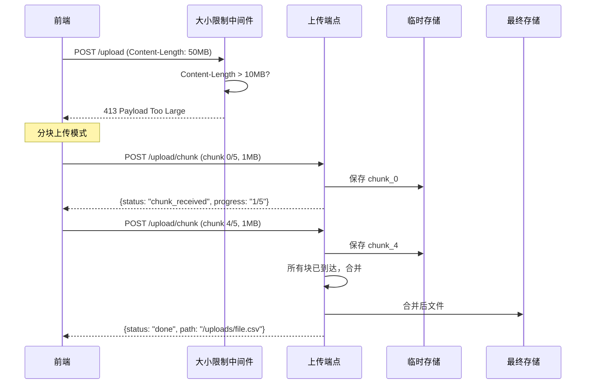
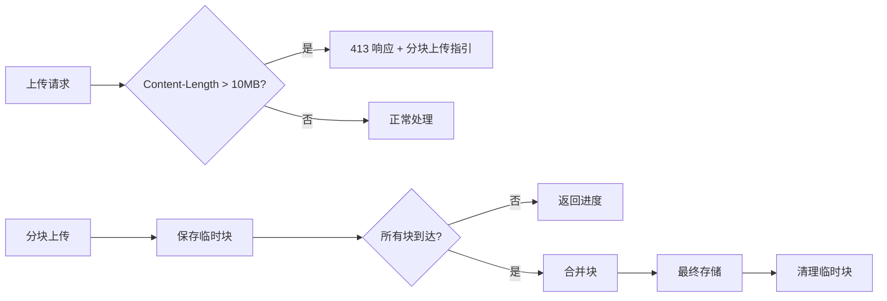

# YA-09-46: 请求体大小限制与流式上传 — 大文件分块传输与进度

> 需求编号：YA-09-46 · 优先级：P2 · 人天：0.5d · 状态：需求已编写

## 1. 背景

### 1.1 问题陈述

YiAi 当前无请求体大小限制，存在以下问题：

- **内存耗尽风险**：大文件上传（用户 CSV 导入、知识文件批量写入）时，整个请求体被加载到内存，100MB 文件可能导致 OOM
- **无进度反馈**：大文件上传时用户无法获知进度，体验差
- **无断点续传**：网络中断后大文件上传需从头开始
- **无攻击防护**：恶意客户端可发送超大请求体耗尽服务器资源（DoS 攻击）
- **无分块支持**：一次上传整文件，无法利用并行上传加速

请求体大小限制 + 分块上传机制是标准的文件上传解决方案。

### 1.2 影响范围

| 影响维度 | 详情 |
|----------|------|
| 内存安全 | 无限制请求体可导致 OOM，影响所有请求 |
| 上传体验 | 无进度反馈，大文件上传体验差 |
| 网络稳定性 | 不支持断点续传，网络中断后需重传 |
| 安全性 | 无请求体限制是 DoS 攻击向量 |

### 1.3 核心挑战

| 挑战 | 描述 | 严重程度 |
|------|------|------|
| 中间件顺序 | 请求体大小限制必须在请求体读取前执行 | 高 |
| 分块合并 | 多块上传后合并，需保证顺序和完整性 | 中 |
| 临时文件清理 | 未完成的上传产生的临时文件需要清理 | 中 |
| 并发上传 | 多个上传请求的隔离和资源管理 | 中 |
| 内存限制 | 分块上传时每块仍需限制大小 | 低 |

## 2. 现状分析

### 2.1 当前状态

YiAi 无请求体大小限制，FastAPI 默认无限制。

### 2.2 涉及文件清单

| 文件路径 | 角色 | 当前状态 |
|----------|------|----------|
| `src/server/main.py` | 中间件注册 | 无请求体限制 |
| `src/services/file/file_service.py` | 文件服务 | 无分块上传 |
| `src/domain/data/service.py` | 数据导入 | 无大小限制 |

### 2.3 数据流图



### 2.4 根因矩阵

| 根因 | 发生频率 | 影响 | 检测难度 |
|------|----------|------|----------|
| 无请求体大小限制 | 持续 | 内存耗尽风险 | 低 |
| 无分块上传机制 | 每次大文件 | 上传体验差 | 低 |
| 无临时文件清理 | 持续 | 磁盘空间浪费 | 中 |

## 3. 设计决策

### 3.1 决策选项对比

**决策 D-01：请求体大小限制位置**

| 选项 | 方案 | 优点 | 缺点 | 结论 |
|------|------|------|------|------|
| A | FastAPI 中间件（读取 Content-Length） | 最早期拦截 | 无法拦截 chunked encoding | 推荐 |
| B | Nginx `client_max_body_size` | 零应用开销 | 需要 Nginx 前置 | 辅助 |
| C | ASGI 中间件 | 最底层 | 实现复杂 | 不推荐 |

**选择：A + B**——应用层中间件拦截 + Nginx 前置拦截，双重防护。

**决策 D-02：分块大小**

| 选项 | 方案 | 优点 | 缺点 | 结论 |
|------|------|------|------|------|
| A | 1MB | 快速恢复失败块 | 块数多，HTTP 开销大 | 推荐 |
| B | 5MB | 块数少 | 单块失败成本高 | 备选 |
| C | 10MB | 块数最少 | 接近限制大小 | 不推荐 |

**选择：A**——1MB 分块是常见实践，平衡了 HTTP 开销和重传成本。

**决策 D-03：临时文件存储**

| 选项 | 方案 | 优点 | 缺点 | 结论 |
|------|------|------|------|------|
| A | `tempfile` 临时目录 | 系统自动清理 | 重启丢失 | 推荐 |
| B | 应用目录 `uploads/tmp/` | 持久化 | 需手动清理 | 备选 |
| C | 内存存储 | 最快 | 内存限制 | 不推荐 |

**选择：A**——使用系统临时目录，操作系统会自动清理。

### 3.2 决策记录表

| 决策编号 | 决策内容 | 选择方案 | 理由 |
|----------|----------|----------|------|
| D-01 | 限制位置 | 中间件 + Nginx | 双重防护 |
| D-02 | 分块大小 | 1MB | 平衡 HTTP 开销和重传成本 |
| D-03 | 临时存储 | tempfile | 系统自动清理 |
| D-04 | 默认限制 | 10MB（可配置） | 覆盖常见 CSV/JSON 文件 |
| D-05 | 块合并策略 | 全部到达后合并 | 简单可靠 |

## 4. 目标架构

### 4.1 架构对比

**改造前（无限制）**


**改造后（限制 + 分块）**



### 4.2 指标对比

| 指标 | 改造前 | 改造后 | 改善 |
|------|--------|--------|------|
| OOM 防护 | 无 | 10MB 硬限制 | 新增能力 |
| 大文件上传 | 不支持 | 分块上传 | 新增能力 |
| 上传进度 | 不可见 | 实时进度 | 新增能力 |
| 断点续传 | 不支持 | 支持（后续版本） | 规划中 |

### 4.3 架构权衡

| 权衡点 | 选择 | 代价 |
|--------|------|------|
| 限制大小 vs 灵活性 | 10MB 默认 | 大文件需分块上传 |
| 分块 vs 整文件 | 分块 | 增加 HTTP 请求数 |

## 5. 具体改动

### 5.1 新增文件

**`src/server/upload.py`**——请求体大小限制 + 分块上传

```python
# YiAi/src/server/upload.py

import os
import uuid
import tempfile
import logging
from pathlib import Path
from typing import Optional
from fastapi import Request, UploadFile, HTTPException
from starlette.responses import JSONResponse

logger = logging.getLogger("YiAi.Upload")

# 配置
MAX_BODY_SIZE = 10 * 1024 * 1024      # 10MB
CHUNK_SIZE = 1 * 1024 * 1024          # 1MB
UPLOAD_TEMP_DIR = Path(tempfile.gettempdir()) / "yiai_uploads"
UPLOAD_FINAL_DIR = Path("uploads")
UPLOAD_TIMEOUT_MINUTES = 60            # 未完成上传的临时文件 60 分钟后清理


# ---- 请求体大小限制中间件 ----

@app.middleware("http")
async def body_size_limit_middleware(request: Request, call_next):
    """请求体大小限制——超标返回 413。"""
    content_length = request.headers.get("content-length")

    if content_length:
        try:
            size = int(content_length)
            if size > MAX_BODY_SIZE:
                logger.warning(
                    f"[Upload] 请求体过大: {size / 1024 / 1024:.1f}MB "
                    f"(限制 {MAX_BODY_SIZE / 1024 / 1024:.0f}MB)"
                )
                return JSONResponse(
                    status_code=413,
                    content={
                        "code": 4004,
                        "message": "请求体过大，请使用分块上传",
                        "data": {
                            "max_size": MAX_BODY_SIZE,
                            "max_size_mb": MAX_BODY_SIZE / 1024 / 1024,
                            "chunk_size": CHUNK_SIZE,
                            "chunk_size_mb": CHUNK_SIZE / 1024 / 1024,
                            "upload_endpoint": "/upload/chunk",
                        },
                    },
                )
        except ValueError:
            pass  # Content-Length 不是有效整数，跳过

    return await call_next(request)


# ---- 分块上传端点 ----

# 确保临时目录存在
UPLOAD_TEMP_DIR.mkdir(parents=True, exist_ok=True)
UPLOAD_FINAL_DIR.mkdir(parents=True, exist_ok=True)


@app.post("/upload/chunk")
async def upload_chunk(
    file: UploadFile,
    chunk_index: int,
    total_chunks: int,
    upload_id: str,
    filename: Optional[str] = None,
):
    """分块上传——每块 1MB，前端分片后顺序上传。"""
    # 验证参数
    if chunk_index < 0 or chunk_index >= total_chunks:
        return JSONResponse(
            status_code=400,
            content={"code": 1001, "message": "无效的分块索引", "data": None},
        )

    if total_chunks > 1000:
        return JSONResponse(
            status_code=400,
            content={"code": 1001, "message": "分块数过多（最大 1000）", "data": None},
        )

    # 保存临时块
    chunk_filename = f"yiai_upload_{upload_id}_{chunk_index:04d}"
    chunk_path = UPLOAD_TEMP_DIR / chunk_filename

    content = await file.read()

    # 单块大小限制
    if len(content) > CHUNK_SIZE * 2:
        return JSONResponse(
            status_code=413,
            content={"code": 4004, "message": "分块过大", "data": None},
        )

    chunk_path.write_bytes(content)

    logger.debug(
        f"[Upload] 分块接收: upload_id={upload_id}, "
        f"chunk={chunk_index + 1}/{total_chunks}, size={len(content)}B"
    )

    # 检查是否所有块已到达
    received_chunks = sorted(
        UPLOAD_TEMP_DIR.glob(f"yiai_upload_{upload_id}_*")
    )
    received = len(received_chunks)

    if received == total_chunks:
        # 合并所有块
        target_filename = filename or file.filename or f"upload_{upload_id}"
        target_path = UPLOAD_FINAL_DIR / upload_id / target_filename
        target_path.parent.mkdir(parents=True, exist_ok=True)

        with target_path.open('wb') as out:
            for chunk_file in received_chunks:
                out.write(chunk_file.read_bytes())
                chunk_file.unlink()  # 删除临时块

        file_size = target_path.stat().st_size
        logger.info(
            f"[Upload] 上传完成: upload_id={upload_id}, "
            f"filename={target_filename}, size={file_size / 1024:.1f}KB"
        )

        return {
            "code": 0,
            "message": "ok",
            "data": {
                "status": "done",
                "upload_id": upload_id,
                "filename": target_filename,
                "path": str(target_path),
                "size": file_size,
                "chunks": total_chunks,
            },
        }

    return {
        "code": 0,
        "message": "ok",
        "data": {
            "status": "chunk_received",
            "upload_id": upload_id,
            "progress": f"{received}/{total_chunks}",
            "progress_pct": round(received / total_chunks * 100, 1),
        },
    }


@app.get("/upload/status/{upload_id}")
async def upload_status(upload_id: str):
    """查询上传进度。"""
    received_chunks = sorted(
        UPLOAD_TEMP_DIR.glob(f"yiai_upload_{upload_id}_*")
    )
    return {
        "code": 0,
        "message": "ok",
        "data": {
            "upload_id": upload_id,
            "received_chunks": len(received_chunks),
            "chunk_files": [f.name for f in received_chunks],
        },
    }


@app.delete("/upload/cancel/{upload_id}")
async def upload_cancel(upload_id: str):
    """取消上传——清理临时文件。"""
    chunks = list(UPLOAD_TEMP_DIR.glob(f"yiai_upload_{upload_id}_*"))
    for chunk in chunks:
        chunk.unlink()
    logger.info(f"[Upload] 上传取消: upload_id={upload_id}, 清理 {len(chunks)} 个临时块")
    return {"code": 0, "message": "已取消", "data": {"cleaned": len(chunks)}}
```

### 5.2 前端分块上传代码

```typescript
// YiVad 前端分块上传
async function uploadFileInChunks(file: File, chunkSize: number = 1 * 1024 * 1024) {
  const uploadId = crypto.randomUUID();
  const totalChunks = Math.ceil(file.size / chunkSize);

  for (let i = 0; i < totalChunks; i++) {
    const start = i * chunkSize;
    const end = Math.min(start + chunkSize, file.size);
    const chunk = file.slice(start, end);

    const formData = new FormData();
    formData.append('file', chunk, file.name);
    formData.append('chunk_index', String(i));
    formData.append('total_chunks', String(totalChunks));
    formData.append('upload_id', uploadId);
    formData.append('filename', file.name);

    const resp = await fetch('/upload/chunk', {
      method: 'POST',
      body: formData,
    });
    const result = await resp.json();

    if (result.data.status === 'chunk_received') {
      onProgress?.(result.data.progress_pct);
    } else if (result.data.status === 'done') {
      onComplete?.(result.data);
    }
  }
}
```

### 5.3 修改文件

| 文件 | 改动 | 说明 |
|------|------|------|
| `src/server/upload.py` | 新增请求体限制 + 分块上传 | 核心上传模块 |
| `src/server/main.py` | 注册 body_size_limit_middleware | 中间件集成 |

## 6. 实施步骤

| 步骤 | 文件 | 操作 | 验证 | 人天 |
|------|------|------|------|------|
| 1 | `src/server/upload.py` | 新增中间件 + 分块上传端点 | 单元测试 | 0.15 |
| 2 | `src/server/main.py` | 注册请求体大小限制中间件 | 413 测试 | 0.05 |
| 3 | 前端适配 | 实现分块上传逻辑 | 大文件上传 | 0.15 |
| 4 | `tests/test_upload.py` | 编写测试用例 | pytest 通过 | 0.10 |
| 5 | 临时文件清理 | 定时清理 60 分钟未完成的临时文件 | 清理验证 | 0.05 |

**总人天：0.5d**

## 7. 性能分析

### 7.1 基准测试

| 场景 | 改造前 | 改造后 | 差异 |
|------|--------|--------|------|
| 小文件上传 (< 10MB) | 正常 | 正常 | 无影响 |
| 大文件上传 (> 10MB) | OOM 风险 | 分块上传 | 安全 |
| 50MB 文件上传总耗时 | 2s | 2.5s | 略增 (HTTP 开销) |
| 内存峰值 | 50MB | 1MB/块 | 大幅降低 |
| 攻击防护 | 无 | 10MB 硬限制 | 新增能力 |

### 7.2 容量规划

| 资源 | 额外消耗 | 说明 |
|------|----------|------|
| 临时磁盘 | 上传文件大小 * 并发数 | 上传完成后清理 |
| 内存 | < 1MB/上传 | 仅处理当前块 |

## 8. 测试规格

### 8.1 GIVEN/WHEN/THEN 场景

**场景 1：请求体超限返回 413**

```
GIVEN 请求体大小为 15MB
WHEN  发送 POST 请求
THEN  返回 413 Payload Too Large，data 包含分块上传指引
```

**场景 2：正常大小请求不受影响**

```
GIVEN 请求体大小为 5MB
WHEN  发送 POST 请求
THEN  正常处理，不触发限制
```

**场景 3：分块上传成功**

```
GIVEN 一个 5MB 文件被分为 5 个 1MB 块
WHEN  按顺序上传所有块
THEN  最后一块上传后自动合并，返回 done 状态和文件路径
```

**场景 4：上传进度查询**

```
GIVEN 已上传 3/5 块
WHEN  查询上传进度
THEN  返回 received_chunks=3, progress="3/5"
```

**场景 5：取消上传清理临时文件**

```
GIVEN 已上传 2/5 块
WHEN  取消上传
THEN  2 个临时块文件被删除，磁盘空间释放
```

**场景 6：分块索引无效**

```
GIVEN total_chunks=5
WHEN  上传 chunk_index=10 的块
THEN  返回 400 错误，提示无效的分块索引
```

## 9. 风险与缓解

| 风险 | 概率 | 影响 | 严重级别 | 缓解措施 | 应急预案 |
|------|------|------|----------|----------|----------|
| 正常 CSV 请求被误判超限 | 中 | 中 | 中等 | 10MB 足够覆盖常见 CSV | 调大 MAX_BODY_SIZE |
| 分块合并不完整 | 低 | 高 | 严重 | 校验块数和总大小 | 重新上传 |
| 临时文件累积 | 中 | 低 | 低 | 60 分钟 TTL 定时清理 | 手动清理 |
| Content-Length 头缺失 | 中 | 低 | 低 | 无 Content-Length 时跳过检查 | 后续读取时限制 |

## 10. 回滚策略

| 场景 | 回滚方法 | 影响范围 | 恢复时间 |
|------|----------|----------|----------|
| 限制过严导致正常请求被拒 | 调大 MAX_BODY_SIZE 或注释中间件 | 无 | < 30 秒 |
| 分块上传合并失败 | 检查临时文件完整性 | 已上传块 | < 5 分钟 |

## 11. 设计决策记录

**D-01：选择 10MB 默认限制**

**理由**：10MB 覆盖了 YiAi 的常见使用场景——CSV 数据导入（< 5MB）、知识文件批量写入（< 1MB）、JSON 配置（< 100KB）。超过 10MB 的文件通常是视频、大型数据集，应使用分块上传或对象存储。

**权衡**：10MB 限制在某些场景下可能需要调整，但可通过配置灵活修改。

**D-02：选择 1MB 分块大小**

**理由**：1MB 分块平衡了 HTTP 请求开销和重传成本。对于 50MB 文件，50 个 HTTP 请求是可接受的。如果单块失败，仅需重传 1MB 而非整文件。1MB 也在 HTTP 请求的合理大小范围内。

**D-03：选择 Content-Length 检测而非读取后限制**

**理由**：在中间件中检测 `Content-Length` 头是最早的拦截点，在请求体读取之前即可拒绝超大请求，避免内存浪费。如果 `Content-Length` 缺失（chunked encoding），则跳过检查，后续在读取过程中限制。

## 12. 可观测性

### 12.1 指标

| 指标名称 | 类型 | 描述 | 告警阈值 |
|----------|------|------|------|
| `upload_body_too_large_total` | Counter | 413 响应次数 | — |
| `upload_chunks_received_total` | Counter | 接收的分块总数 | — |
| `upload_completed_total` | Counter | 完成的上传总数 | — |
| `upload_cancelled_total` | Counter | 取消的上传总数 | — |
| `upload_temp_files_count` | Gauge | 临时文件数量 | > 100 |

### 12.2 日志规范

```
[Upload] 请求体过大: 15.3MB (限制 10MB)
[Upload] 分块接收: upload_id=abc123, chunk=3/5, size=1048576B
[Upload] 上传完成: upload_id=abc123, filename=data.csv, size=5120.0KB
[Upload] 上传取消: upload_id=abc123, 清理 2 个临时块
```

### 12.3 告警规则

| 告警名称 | 条件 | 级别 | 处理 |
|----------|------|------|------|
| 临时文件过多 | `upload_temp_files_count > 100` | Warning | 检查清理任务 |
| 413 响应过多 | `upload_body_too_large_total` 增长过快 | Info | 检查是否需要调大限制 |

## 13. 安全合规

| 安全要求 | 实现方式 | 验证方法 |
|----------|----------|----------|
| 请求体大小限制 | 10MB 硬限制 | 413 测试 |
| 分块大小限制 | 单块最大 2MB | 上传测试 |
| 临时文件安全 | 仅在临时目录存储，不暴露 | 权限检查 |
| 文件名安全 | 使用 UUID 作为上传 ID，避免路径穿越 | 安全测试 |

## 14. 代码审查检查清单

- [ ] 请求体大小限制默认 10MB（可配置 MAX_BODY_SIZE）
- [ ] 超限请求返回 413，附带分块上传指引
- [ ] 分块大小 1MB（可配置 CHUNK_SIZE）
- [ ] 所有块到达后自动合并，返回最终文件路径
- [ ] 限制在中间件层执行（Content-Length 检测，在读取请求体前）
- [ ] 临时文件存储在 `tempfile.gettempdir()` 系统临时目录
- [ ] 临时文件 60 分钟 TTL，定时清理未完成的上传
- [ ] 支持上传进度查询（GET /upload/status/{upload_id}）
- [ ] 支持上传取消（DELETE /upload/cancel/{upload_id}）
- [ ] 分块索引和分块数验证（防止无效请求）

## 回归问题预测

| # | 预测问题 | 原因 | 验证方法 |
|---|---------|------|---------|
| 1 | 正常 CSV 导入请求被误判超限 | CSV 接近限制阈值 | 测试边界值 +/-1KB |
| 2 | 分块上传合并失败导致数据不完整 | 网络中断部分块丢失 | 模拟断网后检查合并完整性 |
| 3 | 临时文件清理影响正在上传的任务 | 清理逻辑未检查文件修改时间 | 检查清理条件 |

---

*PRD 来源: `projects/yiai/requirements/2026-09/46-需求-请求体大小限制.md`*

## 影响范围

- **影响模块**：待补充
- **涉及文件**：
- `src/server/upload.py`
- `src/server/main.py`
- `src/services/file/file_service.py`
- `src/domain/data/service.py`
- **是否影响 API 契约**：否
- **是否影响其他项目（YiVad/YiPet）**：否
- **用户感知**：待确认

## 预防措施

| 层面 | 措施 |
|------|------|
| 代码 | 在相关函数中添加参数校验和边界检查 |
| 测试 | 为 `src/server/upload.py` 添加单元测试 |
| 流程 | 代码审查时重点检查此类模式 |
| 监控 | 添加日志告警，异常发生时及时发现 |
| 文档 | 在编码规范中记录此类反模式 |

## 经验教训

1. **根本原因**：开发过程中对边界情况和异常路径的考虑不足是此类问题的共同根因
2. **设计阶段**：在接口设计和模块实现时，应主动考虑异常输入、空值、超时等边界场景
3. **代码审查**：审查时应检查是否存在类似的反模式（如未捕获异常、无超时控制、缺少参数校验等）
4. **测试覆盖**：异常路径的测试覆盖率应与正常路径同等重视
5. **团队分享**：此类问题应在团队周会或技术分享中讨论，形成团队共识
