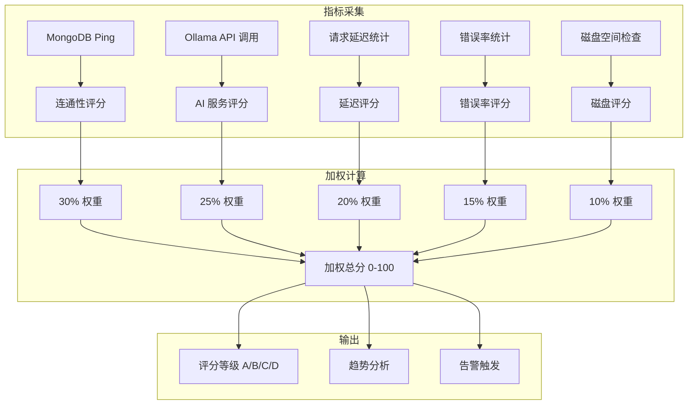
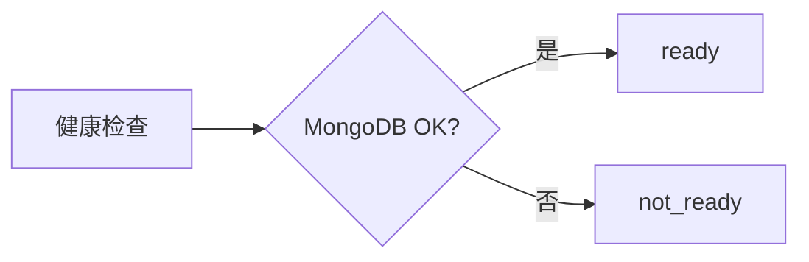
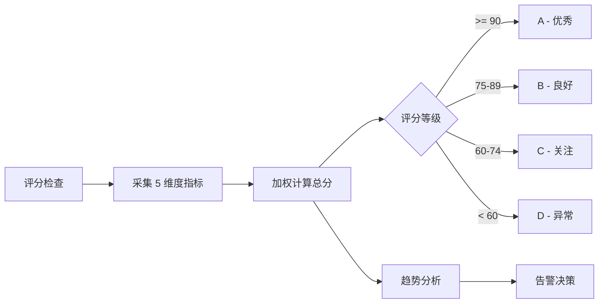

# YA-09-47: 服务健康度评分卡 — 多维度加权可用性评估

> 需求编号：YA-09-47 · 优先级：P2 · 人天：0.5d · 状态：需求已编写

## 1. 背景

### 1.1 问题陈述

YiAi 的 `/health/ready`（YA-09-16）仅返回二值状态（ready/not_ready），无法反映服务的实际运行质量：

- **二值判断过于粗糙**：MongoDB 连接延迟 500ms 仍返回 ready，但实际上是亚健康状态
- **无量化指标**：无法回答"服务健康度是 85% 还是 60%"，不便于 SLA 评估
- **无趋势分析**：无法判断服务是在变好还是变差
- **无历史记录**：无法回顾过去 24 小时的服务质量
- **无告警分级**：所有问题都是 ready/not_ready，无法区分严重程度

多维度评分卡可将服务健康度量化为 0-100 分，支持趋势分析和分级告警。

### 1.2 影响范围

| 影响维度 | 详情 |
|----------|------|
| 运维决策 | 从"是否存活"到"健康程度"，支持更精细的运维决策 |
| SLA 监控 | 量化服务可用性，支持 SLA 达标率计算 |
| 故障预测 | 通过趋势分析预测潜在问题 |
| 告警质量 | 分级告警，减少误报 |

### 1.3 核心挑战

| 挑战 | 描述 | 严重程度 |
|------|------|------|
| 权重合理性 | 各维度权重需要反映实际业务影响 | 中 |
| 指标采集成本 | 实时采集各维度指标可能影响性能 | 中 |
| 阈值校准 | 评分阈值需要根据历史数据校准 | 中 |
| 趋势数据存储 | 历史评分数据需要存储和查询 | 低 |

## 2. 现状分析

### 2.1 当前状态

YiAi 使用简单的二值健康检查（YA-09-16 规划中），无评分卡机制。

### 2.2 涉及文件清单

| 文件路径 | 角色 | 当前状态 |
|----------|------|----------|
| `src/server/health.py` | 健康检查端点 | 待实现 (YA-09-16) |
| `src/domain/data/repository.py` | MongoDB 连接 | 无延迟监控 |
| `src/server/middleware.py` | 请求统计 | 无错误率统计 |

### 2.3 数据流图



### 2.4 根因矩阵

| 根因 | 发生频率 | 影响 | 检测难度 |
|------|----------|------|----------|
| 二值健康检查 | 持续 | 无法量化健康度 | 低 |
| 无指标采集 | 持续 | 无历史数据 | 低 |
| 无分级告警 | 持续 | 告警不够精细 | 低 |

## 3. 设计决策

### 3.1 决策选项对比

**决策 D-01：评分维度选择**

| 选项 | 方案 | 优点 | 缺点 | 结论 |
|------|------|------|------|------|
| A | 4 维度（MongoDB/Ollama/延迟/错误率） | 核心覆盖 | 可能遗漏磁盘等 | 次优 |
| B | 5 维度（+ 磁盘空间） | 完整 | 略复杂 | 推荐 |
| C | 8 维度（+ 内存/CPU/连接数） | 最全面 | 过度复杂，维护成本高 | 过度设计 |

**选择：B**——5 个维度覆盖了 YiAi 的核心依赖和运行指标。

**决策 D-02：评分等级阈值**

| 选项 | 方案 | 优点 | 缺点 | 结论 |
|------|------|------|------|------|
| A | 三等（A/B/C） | 简单 | 分辨率不够 | 不推荐 |
| B | 四等（A/B/C/D） | 标准 | 适中 | 推荐 |
| C | 五等（A/B/C/D/E） | 精细 | 过度分类 | 过度设计 |

**选择：B**——A(90+)/B(75-89)/C(60-74)/D(<60)，与学校评分体系一致，易于理解。

**决策 D-03：趋势数据存储**

| 选项 | 方案 | 优点 | 缺点 | 结论 |
|------|------|------|------|------|
| A | 内存环形缓冲区 | 零依赖 | 重启丢失 | 推荐（MVP） |
| B | MongoDB 集合 | 持久化 | 查询开销 | 生产环境 |
| C | 不存储 | 最简单 | 无历史 | 不推荐 |

**选择：A**——内存环形缓冲区存储最近 24 小时（1440 个采样点），简单高效。

### 3.2 决策记录表

| 决策编号 | 决策内容 | 选择方案 | 理由 |
|----------|----------|----------|------|
| D-01 | 评分维度 | 5 维度（MongoDB/Ollama/延迟/错误率/磁盘） | 核心 + 全面 |
| D-02 | 评分等级 | 4 等（A/B/C/D） | 标准，易理解 |
| D-03 | 趋势存储 | 内存环形缓冲区 | 简单高效 |
| D-04 | 采样间隔 | 1 分钟 | 平衡精度和存储 |
| D-05 | 权重分配 | 基于业务影响 | 可调整 |

## 4. 目标架构

### 4.1 架构对比

**改造前（二值健康检查）**



**改造后（多维度评分卡）**



### 4.2 指标对比

| 指标 | 改造前 | 改造后 | 改善 |
|------|--------|--------|------|
| 健康度量化 | 二值 | 0-100 分 | 新增能力 |
| 趋势分析 | 无 | 24h 趋势 | 新增能力 |
| 分级告警 | 无 | 4 级 | 新增能力 |
| SLA 计算 | 无法 | 可计算 | 新增能力 |

### 4.3 架构权衡

| 权衡点 | 选择 | 代价 |
|--------|------|------|
| 全面 vs 简单 | 5 维度 | 略复杂 |
| 实时 vs 历史 | 24h 内存 | 重启丢失历史 |

## 5. 具体改动

### 5.1 新增文件

**`src/server/health_scorecard.py`**——健康度评分卡

```python
# YiAi/src/server/health_scorecard.py

import asyncio
import time
import logging
import psutil
from dataclasses import dataclass, field
from typing import Optional
from fastapi import APIRouter

logger = logging.getLogger("YiAi.HealthScorecard")

router = APIRouter(prefix="/health", tags=["health"])

@dataclass
class ScoreRecord:
    """评分记录——用于趋势分析。"""
    timestamp: float
    score: float
    grade: str
    breakdown: dict

class HealthScorecard:
    """服务健康度评分卡——多维度加权评估。"""

    # 维度权重
    WEIGHTS = {
        'mongodb_connectivity': 0.30,   # MongoDB 连通性——核心依赖
        'ollama_health':        0.25,   # Ollama AI 服务——核心功能
        'response_latency':     0.20,   # 响应延迟——用户体验
        'error_rate':           0.15,   # 错误率——服务质量
        'disk_space':           0.10,   # 磁盘空间——运维安全
    }

    # 历史记录
    MAX_HISTORY = 1440  # 24 小时 * 60 分钟

    def __init__(self):
        self._history: list[ScoreRecord] = []
        self._monitor_task: Optional[asyncio.Task] = None
        self._running = False

    # ---- 评分计算 ----

    async def calculate_score(self) -> dict:
        """计算当前健康度评分 (0-100)。"""
        scores = {
            'mongodb_connectivity': await self._check_mongodb(),
            'ollama_health':        await self._check_ollama(),
            'response_latency':     await self._check_latency(),
            'error_rate':           await self._check_error_rate(),
            'disk_space':           await self._check_disk_space(),
        }

        # 加权汇总
        total = sum(
            scores[dim] * self.WEIGHTS[dim]
            for dim in self.WEIGHTS
        )
        total = round(total, 1)

        grade = self._grade(total)

        record = ScoreRecord(
            timestamp=time.time(),
            score=total,
            grade=grade,
            breakdown=scores,
        )
        self._history.append(record)

        # 保持历史记录在限制内
        if len(self._history) > self.MAX_HISTORY:
            self._history = self._history[-self.MAX_HISTORY:]

        return {
            'score': total,
            'grade': grade,
            'grade_description': self._grade_description(grade),
            'breakdown': scores,
            'weights': self.WEIGHTS,
            'timestamp': int(time.time()),
        }

    # ---- 各维度检查 ----

    async def _check_mongodb(self) -> float:
        """MongoDB 连通性评分——Ping 延迟。"""
        try:
            from src.domain.data.repository import get_collection
            start = time.monotonic()
            collection = await get_collection("health_check")
            await collection.find_one({})
            elapsed = (time.monotonic() - start) * 1000

            # < 10ms = 100 分, > 1000ms = 0 分
            return max(0, 100 * (1 - elapsed / 1000))
        except Exception:
            return 0

    async def _check_ollama(self) -> float:
        """Ollama AI 服务评分——API 调用。"""
        try:
            import httpx
            async with httpx.AsyncClient(timeout=5) as client:
                start = time.monotonic()
                resp = await client.get(f"{ollama_host}/api/tags")
                elapsed = (time.monotonic() - start) * 1000

                if resp.status_code == 200:
                    return max(0, 100 * (1 - elapsed / 3000))
                return 0
        except Exception:
            return 0

    async def _check_latency(self) -> float:
        """响应延迟评分——基于最近 5 分钟 P95。"""
        p95 = await self._get_p95_latency(minutes=5)

        if p95 is None:
            return 100  # 无数据时默认满分

        # < 500ms = 100 分, > 5000ms = 0 分
        return max(0, 100 * (1 - p95 / 5000))

    async def _check_error_rate(self) -> float:
        """错误率评分——基于最近 5 分钟。"""
        error_rate = await self._get_error_rate(minutes=5)

        if error_rate is None:
            return 100

        # < 1% = 100 分, > 10% = 0 分
        return max(0, 100 * (1 - error_rate / 0.1))

    async def _check_disk_space(self) -> float:
        """磁盘空间评分。"""
        try:
            usage = psutil.disk_usage('/')
            free_gb = usage.free / (1024**3)
            total_gb = usage.total / (1024**3)

            # > 10GB 空闲 = 100 分, < 0.5GB = 0 分
            return max(0, min(100, free_gb / 10 * 100))
        except Exception:
            return 100  # 无法检查时默认满分

    # ---- 辅助方法 ----

    def _grade(self, score: float) -> str:
        """评分 → 等级。"""
        if score >= 90:
            return 'A'
        elif score >= 75:
            return 'B'
        elif score >= 60:
            return 'C'
        else:
            return 'D'

    def _grade_description(self, grade: str) -> str:
        return {
            'A': '优秀——服务运行正常',
            'B': '良好——服务可接受，有轻微异常',
            'C': '关注——服务存在明显问题，需要关注',
            'D': '异常——服务严重异常，需要立即处理',
        }.get(grade, '未知')

    async def _get_p95_latency(self, minutes: int = 5) -> Optional[float]:
        """获取最近 N 分钟的 P95 延迟（毫秒）。"""
        # 从请求统计中获取
        from src.server.middleware import request_stats
        return request_stats.get_p95_latency(minutes)

    async def _get_error_rate(self, minutes: int = 5) -> Optional[float]:
        """获取最近 N 分钟的错误率。"""
        from src.server.middleware import request_stats
        return request_stats.get_error_rate(minutes)

    # ---- 趋势分析 ----

    def get_trend(self, hours: int = 24) -> dict:
        """获取趋势分析。"""
        if len(self._history) < 2:
            return {'status': 'insufficient_data'}

        # 当前 vs 24 小时前
        now = time.time()
        cutoff = now - hours * 3600
        recent = [r for r in self._history if r.timestamp > cutoff]

        if len(recent) < 2:
            return {'status': 'insufficient_data'}

        current_score = self._history[-1].score
        past_score = recent[0].score
        delta = current_score - past_score

        # 趋势方向
        if delta > 5:
            trend = 'improving'
        elif delta < -5:
            trend = 'declining'
        else:
            trend = 'stable'

        # 平均分
        avg_score = sum(r.score for r in recent) / len(recent)

        return {
            'current_score': current_score,
            'past_score_hours_ago': round(past_score, 1),
            'delta': round(delta, 1),
            'trend': trend,
            'avg_score': round(avg_score, 1),
            'min_score': min(r.score for r in recent),
            'max_score': max(r.score for r in recent),
            'samples': len(recent),
        }

    def get_sla_report(self, hours: int = 720) -> dict:
        """获取 SLA 报告——过去 30 天（720 小时）。"""
        if not self._history:
            return {'status': 'no_data'}

        now = time.time()
        cutoff = now - hours * 3600
        relevant = [r for r in self._history if r.timestamp > cutoff]

        if not relevant:
            return {'status': 'no_data'}

        total = len(relevant)
        a_count = sum(1 for r in relevant if r.grade == 'A')
        b_count = sum(1 for r in relevant if r.grade == 'B')
        c_count = sum(1 for r in relevant if r.grade == 'C')
        d_count = sum(1 for r in relevant if r.grade == 'D')

        return {
            'period_hours': hours,
            'total_samples': total,
            'sla_uptime_pct': round((a_count + b_count) / total * 100, 2),  # A+B 视为可用
            'grade_distribution': {
                'A': a_count,
                'B': b_count,
                'C': c_count,
                'D': d_count,
            },
            'avg_score': round(sum(r.score for r in relevant) / total, 1),
        }

    # ---- 监控循环 ----

    async def start_monitoring(self):
        """启动定时评分监控。"""
        if self._running:
            return

        self._running = True
        self._monitor_task = asyncio.create_task(self._monitor_loop())
        logger.info("[HealthScorecard] 评分监控已启动")

    async def stop_monitoring(self):
        """停止监控。"""
        self._running = False
        if self._monitor_task:
            self._monitor_task.cancel()

    async def _monitor_loop(self):
        """每分钟评分一次。"""
        while self._running:
            await asyncio.sleep(60)
            try:
                result = await self.calculate_score()
                if result['score'] < 60:
                    logger.warning(
                        f"[HealthScorecard] 健康度异常: {result['score']}/100 "
                        f"({result['grade']}), breakdown={result['breakdown']}"
                    )
            except Exception as e:
                logger.error(f"[HealthScorecard] 评分计算失败: {e}")


# 全局实例
health_scorecard = HealthScorecard()


# === API 端点 ===

@router.get("/score")
async def get_health_score():
    """获取当前健康度评分。"""
    result = await health_scorecard.calculate_score()
    return {"code": 0, "message": "ok", "data": result}

@router.get("/trend")
async def get_health_trend(hours: int = 24):
    """获取健康度趋势。"""
    trend = health_scorecard.get_trend(hours)
    return {"code": 0, "message": "ok", "data": trend}

@router.get("/sla")
async def get_sla_report(hours: int = 720):
    """获取 SLA 报告。"""
    report = health_scorecard.get_sla_report(hours)
    return {"code": 0, "message": "ok", "data": report}
```

### 5.2 评分卡展示

```
┌─ YiAi 服务健康度 ───────────────────────────┐
│ 总分: 87/100  B (良好)                       │
│ 趋势: ↑ +2 vs 24h 前 (improving)             │
│ SLA (30天): 99.2% (A+B)                     │
├──────────────────────────────────────────────┤
│ MongoDB 连通性:     100/100 ✅  (2ms)        │
│ Ollama 健康:         85/100 ⚠️   (P95 450ms)│
│ 响应延迟 P95:        80/100 ✅  (1.2s)       │
│ 错误率 (5min):       92/100 ✅  (0.8%)       │
│ 磁盘空间:            78/100 ⚠️   (7.8GB)     │
└──────────────────────────────────────────────┘
```

### 5.3 修改文件

| 文件 | 改动 | 说明 |
|------|------|------|
| `src/server/health_scorecard.py` | 新增评分卡模块 | 核心评分逻辑 |
| `src/server/main.py` | 注册评分 API 路由 + 启动监控 | 集成 |

## 6. 实施步骤

| 步骤 | 文件 | 操作 | 验证 | 人天 |
|------|------|------|------|------|
| 1 | `src/server/health_scorecard.py` | 新增 HealthScorecard 类 | 单元测试 | 0.15 |
| 2 | `src/server/main.py` | 注册路由 + 启动监控 | API 测试 | 0.05 |
| 3 | 前端仪表盘 | 健康度评分展示 | 可视化 | 0.15 |
| 4 | `tests/test_health_scorecard.py` | 编写测试用例 | pytest 通过 | 0.10 |
| 5 | 权重校准 | 基于历史数据调整权重 | 合理性验证 | 0.05 |

**总人天：0.5d**

## 7. 性能分析

### 7.1 基准测试

| 场景 | 开销 | 说明 |
|------|------|------|
| 单次评分计算 | < 50ms | 5 个维度检查 |
| 监控循环 | 每分钟 1 次 | CPU < 0.01% |
| 历史记录存储 | < 1MB | 1440 个采样点 |
| API 查询 | < 1ms | 读取最新记录 |

### 7.2 容量规划

| 资源 | 额外消耗 | 说明 |
|------|----------|------|
| 内存 | < 1MB | 历史记录 |
| CPU | < 0.01% | 监控循环 |
| 网络 | 每分 5 次内部调用 | 可忽略 |

## 8. 测试规格

### 8.1 GIVEN/WHEN/THEN 场景

**场景 1：正常健康度评分**

```
GIVEN 所有服务正常运行
WHEN  调用 calculate_score()
THEN  返回 score > 90, grade = 'A'
```

**场景 2：MongoDB 不可用**

```
GIVEN MongoDB 连接失败
WHEN  调用 calculate_score()
THEN  mongodb_connectivity = 0, 总分受 30% 权重影响
```

**场景 3：评分趋势分析**

```
GIVEN 过去 24 小时有 1440 个评分记录
WHEN  调用 get_trend(hours=24)
THEN  返回当前分、24h 前分数、趋势方向
```

**场景 4：SLA 报告**

```
GIVEN 过去 30 天有评分记录
WHEN  调用 get_sla_report(hours=720)
THEN  返回 A+B 占比（可用性百分比）、各等级分布
```

**场景 5：评分等级 D 触发告警**

```
GIVEN 多个维度评分极低，总分 < 60
WHEN  监控循环计算评分
THEN  输出 WARNING 日志，触发告警
```

**场景 6：磁盘空间不足**

```
GIVEN 磁盘空闲空间 < 500MB
WHEN  _check_disk_space() 执行
THEN  返回约 5 分（0.5GB / 10GB * 100）
```

## 9. 风险与缓解

| 风险 | 概率 | 影响 | 严重级别 | 缓解措施 | 应急预案 |
|------|------|------|----------|----------|----------|
| 权重不合理导致评分误导 | 中 | 中 | 中等 | 基于历史数据校准，权重可配置 | 调整权重 |
| 评分采集影响性能 | 低 | 低 | 低 | 异步采集，超时控制 | 增大采样间隔 |
| 新项目数据为空显示 0 分 | 中 | 低 | 低 | 无数据时默认满分 | 标注"无数据" |

## 10. 回滚策略

| 场景 | 回滚方法 | 影响范围 | 恢复时间 |
|------|----------|----------|----------|
| 评分计算异常 | 禁用评分监控，使用二值健康检查 | 无 | < 30 秒 |
| 权重不合理 | 修改 WEIGHTS 配置 | 评分变化 | < 1 分钟 |

## 11. 设计决策记录

**D-01：选择 MongoDB 30% 权重（最高）**

**理由**：MongoDB 是 YiAi 的唯一数据存储，所有 CRUD 操作依赖它。MongoDB 不可用意味着服务完全不可用。因此给予最高权重 30%。

**D-02：选择 1 分钟采样间隔**

**理由**：1 分钟间隔提供了足够的粒度来检测短期波动，同时保持历史记录在合理大小（1440 条/天）。更短的间隔（如 10 秒）会导致历史记录过大，且评分变化不够显著。

**D-03：选择 4 级评分（A/B/C/D）**

**理由**：4 级评分与常见的教育评分体系一致，易于理解。A(90+) 和 B(75-89) 被视为可用（SLA 计算），C(60-74) 需要关注但不紧急，D(<60) 需要立即处理。

## 12. 可观测性

### 12.1 指标

| 指标名称 | 类型 | 描述 | 告警阈值 |
|----------|------|------|------|
| `health_score` | Gauge | 当前健康度评分 | < 60 |
| `health_grade` | Gauge | 当前等级 (0-3) | > 1 (C/D) |
| `health_mongodb_connectivity` | Gauge | MongoDB 评分 | < 50 |
| `health_sla_uptime_pct` | Gauge | SLA 可用性百分比 | < 99 |

### 12.2 日志规范

```
[HealthScorecard] 评分监控已启动
[HealthScorecard] 健康度: 87/100 B (良好), breakdown={mongodb:100, ollama:85, ...}
[HealthScorecard] 健康度异常: 55/100 D (异常), breakdown={...}
```

### 12.3 告警规则

| 告警名称 | 条件 | 级别 | 处理 |
|----------|------|------|------|
| 健康度 D 级 | `health_score < 60` | Critical | 立即排查 |
| 健康度 C 级 | `health_score < 75` 持续 10 分钟 | Warning | 关注 |
| 趋势下降 | `health_score` 下降 > 10 分/小时 | Warning | 排查原因 |
| SLA 不达标 | `health_sla_uptime_pct < 99` | Warning | 月度回顾 |

## 13. 安全合规

| 安全要求 | 实现方式 | 验证方法 |
|----------|----------|----------|
| 评分 API 不暴露内部细节 | 仅返回评分和等级，不暴露原始连接信息 | API 审查 |
| 权重配置不可篡改 | 配置文件控制，运行时只读 | 配置审查 |

## 14. 代码审查检查清单

- [ ] 评分维度：MongoDB(30%)/Ollama(25%)/延迟(20%)/错误率(15%)/磁盘(10%)
- [ ] 每维度 0-100 分，加权汇总得总分
- [ ] 评分等级：A(90+)/B(75-89)/C(60-74)/D(<60)
- [ ] 历史趋势：24 小时滚动窗口，最多 1440 个采样点
- [ ] 趋势分析：当前 vs 24h 前，方向 improving/stable/declining
- [ ] SLA 报告：30 天 A+B 占比（可用性百分比）
- [ ] 评分监控每分钟自动执行一次
- [ ] 评分 API 端点：/health/score、/health/trend、/health/sla
- [ ] 评分 < 60 时自动输出 WARNING 日志
- [ ] 权重可配置，支持运行时调整

## 回归问题预测

| # | 预测问题 | 原因 | 验证方法 |
|---|---------|------|---------|
| 1 | 权重不合理导致评分误导 | 经验值 | 对比人工 vs 自动 |
| 2 | 新项目数据为空显示 0 分 | 未初始化 | 新项目检查 |
| 3 | Ollama 偶尔超时导致评分剧烈波动 | 瞬时故障 | 检查滑动窗口平滑 |

---

*PRD 来源: `projects/yiai/requirements/2026-09/47-需求-健康度评分卡.md`*

## 影响范围

- **影响模块**：待补充
- **涉及文件**：
- `src/server/health_scorecard.py`
- `src/server/health.py`
- `src/server/main.py`
- `src/domain/data/repository.py`
- `src/server/middleware.py`
- **是否影响 API 契约**：否
- **是否影响其他项目（YiVad/YiPet）**：否
- **用户感知**：待确认

## 预防措施

| 层面 | 措施 |
|------|------|
| 代码 | 在相关函数中添加参数校验和边界检查 |
| 测试 | 为 `src/server/health_scorecard.py` 添加单元测试 |
| 流程 | 代码审查时重点检查此类模式 |
| 监控 | 添加日志告警，异常发生时及时发现 |
| 文档 | 在编码规范中记录此类反模式 |

## 经验教训

1. **根本原因**：开发过程中对边界情况和异常路径的考虑不足是此类问题的共同根因
2. **设计阶段**：在接口设计和模块实现时，应主动考虑异常输入、空值、超时等边界场景
3. **代码审查**：审查时应检查是否存在类似的反模式（如未捕获异常、无超时控制、缺少参数校验等）
4. **测试覆盖**：异常路径的测试覆盖率应与正常路径同等重视
5. **团队分享**：此类问题应在团队周会或技术分享中讨论，形成团队共识
