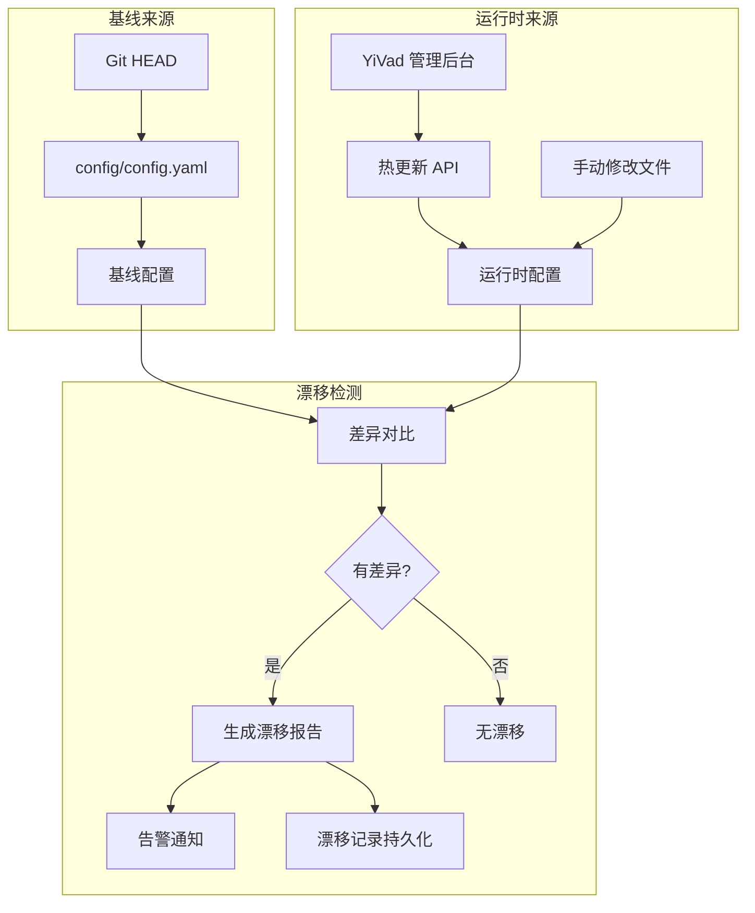
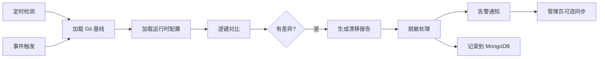

# YA-09-48: 服务配置漂移检测 — 运行时与期望状态差异告警

> 需求编号：YA-09-48 · 优先级：P2 · 人天：0.5d · 状态：需求已编写
> 依赖：YA-09-23（配置中心与动态配置热更新）

## 1. 背景

### 1.1 问题陈述

引入配置热更新后，运行时配置可能偏离 Git 版本控制的基线配置：

- **手动修改漂移**：通过 YiVad 管理后台修改配置后，与 Git 基线产生差异，下次重启可能丢失修改或引入不一致
- **热更新未持久化**：通过 YA-09-23 热更新的配置未同步到 Git 仓库，导致配置版本混乱
- **无法追溯**：不知道配置何时、被谁、从什么值改成了什么值
- **环境不一致**：开发/测试/生产环境的配置可能不一致，但缺乏检测手段
- **历史版本丢失**：配置变更无版本记录，无法回滚到历史配置

配置漂移检测可自动发现运行时配置与基线（Git HEAD）之间的差异，并生成告警。

### 1.2 影响范围

| 影响维度 | 详情 |
|----------|------|
| 配置一致性 | 运行时配置与 Git 基线不一致，重启后可能丢失修改 |
| 故障排查 | 不知道配置何时变更，增加排查难度 |
| 合规审计 | 配置变更无记录，不符合变更管理要求 |
| 部署安全 | 配置漂移可能导致新版本部署后行为异常 |

### 1.3 核心挑战

| 挑战 | 描述 | 严重程度 |
|------|------|------|
| 基线定义 | 什么算"基线"——Git HEAD? 最后一次部署? | 中 |
| 检测时效 | 漂移发生后多久能检测到 | 中 |
| 敏感信息 | 漂移报告中可能泄露敏感配置值 | 高 |
| 误报处理 | 有意的配置修改不应被标记为漂移 | 中 |

## 2. 现状分析

### 2.1 当前状态

YiAi 使用静态配置文件 `config/config.yaml`，无热更新机制，无漂移检测。

### 2.2 涉及文件清单

| 文件路径 | 角色 | 当前状态 |
|----------|------|----------|
| `config/config.yaml` | 主配置文件 | Git 版本控制 |
| `config/settings.py` | 配置加载 | 无漂移检测 |
| `src/domain/config/service.py` | 配置中心 (YA-09-23) | 待实现 |

### 2.3 数据流图



### 2.4 根因矩阵

| 根因 | 发生频率 | 影响 | 检测难度 |
|------|----------|------|----------|
| 手动热更新未同步 Git | 每次热更新 | 配置漂移 | 低 |
| 多环境配置不一致 | 持续 | 环境差异 | 中 |
| 无变更记录 | 持续 | 无法追溯 | 低 |

## 3. 设计决策

### 3.1 决策选项对比

**决策 D-01：基线定义**

| 选项 | 方案 | 优点 | 缺点 | 结论 |
|------|------|------|------|------|
| A | Git HEAD | 标准，有版本历史 | 需要 Git 仓库 | 推荐 |
| B | 部署时快照 | 精确 | 需额外存储 | 备选 |
| C | 上次同步点 | 灵活 | 定义模糊 | 不推荐 |

**选择：A**——Git HEAD 是标准的配置基线，天然支持版本历史和 diff。

**决策 D-02：漂移处理策略**

| 选项 | 方案 | 优点 | 缺点 | 结论 |
|------|------|------|------|------|
| A | 仅告警 | 安全，不自动修改 | 需人工处理 | 推荐 |
| B | 自动同步 | 即时纠正 | 可能覆盖有意的修改 | 不推荐 |
| C | 告警 + 可选同步 | 灵活 | 略复杂 | 最佳 |

**选择：C**——告警 + 可选同步（管理员确认后执行），灵活且安全。

**决策 D-03：检测频率**

| 选项 | 方案 | 优点 | 缺点 | 结论 |
|------|------|------|------|------|
| A | 每小时定时 | 规律 | 漂移窗口 1 小时 | 推荐 |
| B | 配置变更事件驱动 | 实时 | 实现复杂 | 辅助 |
| C | 每次健康检查 | 最频繁 | 性能开销 | 不推荐 |

**选择：A + B**——每小时定时检测 + 配置变更时立即检测。

### 3.2 决策记录表

| 决策编号 | 决策内容 | 选择方案 | 理由 |
|----------|----------|----------|------|
| D-01 | 基线定义 | Git HEAD | 标准和版本控制 |
| D-02 | 漂移处理 | 告警 + 可选同步 | 安全且灵活 |
| D-03 | 检测频率 | 每小时 + 事件驱动 | 平衡时效和开销 |
| D-04 | 敏感信息处理 | 脱敏显示 | 防止泄露 |

## 4. 目标架构

### 4.1 架构对比

**改造前（无漂移检测）**


**改造后（漂移检测）**



### 4.2 指标对比

| 指标 | 改造前 | 改造后 | 改善 |
|------|--------|--------|------|
| 漂移检测 | 无 | 每小时 + 实时 | 新增能力 |
| 配置追溯 | 无 | 漂移记录 | 新增能力 |
| 配置同步 | 手动 | 可选自动同步 | 改善 |
| 多环境一致性 | 无检测 | 漂移报告 | 新增能力 |

### 4.3 架构权衡

| 权衡点 | 选择 | 代价 |
|--------|------|------|
| 定时 vs 实时 | 定时 + 事件 | 事件驱动略复杂 |
| 自动 vs 手动 | 告警 + 手动确认 | 需人工参与 |

## 5. 具体改动

### 5.1 新增文件

**`src/shared/config_drift.py`**——配置漂移检测

```python
# YiAi/src/shared/config_drift.py

import asyncio
import subprocess
import time
import yaml
import logging
from dataclasses import dataclass, field
from typing import Optional

logger = logging.getLogger("YiAi.ConfigDrift")

@dataclass
class DriftEntry:
    """单个配置漂移条目。"""
    key: str
    baseline_value: str
    runtime_value: str
    detected_at: float = field(default_factory=time.time)

@dataclass
class DriftReport:
    """配置漂移报告。"""
    has_drift: bool
    drifted_entries: list[DriftEntry]
    drift_count: int
    baseline_source: str
    detected_at: float = field(default_factory=time.time)
    suggestion: str = ""

class ConfigDriftDetector:
    """配置漂移检测——运行时 vs 基线 (Git HEAD) 的差异分析。"""

    # 需要检测的配置键（白名单）
    TRACKED_KEYS = [
        'rag_hybrid_alpha',
        'rag_top_k',
        'agent_max_iterations',
        'agent_temperature',
        'rate_limit_global',
        'mongodb_max_pool_size',
        'ollama_timeout',
        'knowledge_scan_interval',
    ]

    # 敏感配置键——值需要脱敏
    SENSITIVE_KEYS = [
        'mongodb_uri',
        'ollama_api_key',
        'wework_webhook_url',
        'auth_secret_key',
        'jwt_secret',
    ]

    def __init__(self):
        self._drift_history: list[DriftReport] = []
        self._monitor_task: Optional[asyncio.Task] = None
        self._running = False

    # ---- 漂移检测 ----

    async def detect_drift(self) -> DriftReport:
        """检测运行时配置与 Git 基线之间的漂移。"""
        baseline = self._load_git_baseline()
        runtime = self._load_runtime_config()

        drifted = []
        for key in self.TRACKED_KEYS:
            baseline_val = baseline.get(key)
            runtime_val = runtime.get(key)

            if baseline_val is None and runtime_val is None:
                continue
            if baseline_val != runtime_val:
                # 脱敏处理
                if key in self.SENSITIVE_KEYS:
                    baseline_val = self._mask_value(baseline_val)
                    runtime_val = self._mask_value(runtime_val)

                drifted.append(DriftEntry(
                    key=key,
                    baseline_value=str(baseline_val) if baseline_val is not None else '<not set>',
                    runtime_value=str(runtime_val) if runtime_val is not None else '<not set>',
                ))

        has_drift = len(drifted) > 0
        report = DriftReport(
            has_drift=has_drift,
            drifted_entries=drifted,
            drift_count=len(drifted),
            baseline_source='Git HEAD',
            suggestion=(
                '配置已漂移。建议:\n'
                '  1) 更新 Git 基线: git add config/ && git commit -m "update config"\n'
                '  2) 或回退运行时配置: POST /config/reconcile?strategy=revert'
            ) if has_drift else '',
        )

        self._drift_history.append(report)
        if len(self._drift_history) > 100:
            self._drift_history = self._drift_history[-100:]

        if has_drift:
            logger.warning(
                f"[ConfigDrift] 检测到 {len(drifted)} 个配置漂移: "
                f"{[e.key for e in drifted]}"
            )

        return report

    def _load_git_baseline(self) -> dict:
        """从 Git HEAD 加载基线配置。"""
        try:
            result = subprocess.run(
                ['git', 'show', 'HEAD:config/config.yaml'],
                capture_output=True,
                text=True,
                timeout=5,
            )
            if result.returncode == 0:
                raw = yaml.safe_load(result.stdout)
                return self._flatten_config(raw)
            logger.warning(f"[ConfigDrift] Git 基线加载失败: {result.stderr}")
        except Exception as e:
            logger.warning(f"[ConfigDrift] Git 基线加载异常: {e}")

        return {}

    def _load_runtime_config(self) -> dict:
        """加载运行时配置。"""
        from config.settings import config
        return self._flatten_config(config._data if hasattr(config, '_data') else {})

    def _flatten_config(self, data: dict, prefix: str = '') -> dict:
        """将嵌套字典展平为点分隔的键。"""
        result = {}
        for key, value in data.items():
            full_key = f"{prefix}.{key}" if prefix else key
            if isinstance(value, dict):
                result.update(self._flatten_config(value, full_key))
            else:
                # 匹配 TRACKED_KEYS 中的键
                if key in self.TRACKED_KEYS:
                    result[key] = value
                else:
                    result[full_key] = value
        return result

    def _mask_value(self, value: Optional[str]) -> str:
        """脱敏——仅显示首尾字符。"""
        if value is None:
            return '<null>'
        if len(value) <= 8:
            return '*' * len(value)
        return f"{value[:4]}...{value[-4:]}"

    # ---- 协调操作 ----

    async def reconcile(self, strategy: str = 'alert') -> dict:
        """协调漂移——告警或自动同步。"""
        report = await self.detect_drift()

        if not report.has_drift:
            return {'status': 'ok', 'message': '未检测到配置漂移'}

        if strategy == 'alert':
            await self._send_alert(report)
            return {
                'status': 'alerted',
                'drift_count': report.drift_count,
                'message': f'已发送告警，{report.drift_count} 个配置漂移',
            }

        elif strategy == 'revert':
            # 回退运行时配置到 Git 基线
            from config.settings import config
            baseline = self._load_git_baseline()
            for entry in report.drifted_entries:
                if entry.key in baseline and hasattr(config, '_data'):
                    # 回退到基线值
                    config._data[entry.key] = baseline[entry.key]
            logger.info(
                f"[ConfigDrift] 已回退 {report.drift_count} 个配置漂移到基线"
            )
            return {
                'status': 'reverted',
                'drift_count': report.drift_count,
                'message': f'已回退 {report.drift_count} 个配置到 Git 基线',
            }

        elif strategy == 'commit':
            # 将运行时配置提交为新的 Git 基线
            from config.settings import config
            runtime_data = config._data if hasattr(config, '_data') else {}
            with open('config/config.yaml', 'w') as f:
                yaml.dump(runtime_data, f, default_flow_style=False)

            subprocess.run(['git', 'add', 'config/config.yaml'])
            subprocess.run([
                'git', 'commit', '-m',
                f'chore: sync config drift ({len(report.drifted_entries)} keys)'
            ])
            logger.info(
                f"[ConfigDrift] 已将运行时配置提交为 Git 基线"
            )
            return {
                'status': 'committed',
                'drift_count': report.drift_count,
                'message': '已提交运行时配置到 Git',
            }

        return {'status': 'unknown', 'message': f'未知策略: {strategy}'}

    async def _send_alert(self, report: DriftReport):
        """发送告警通知。"""
        # 企业微信 / 日志告警
        logger.warning(
            f"[ConfigDrift] 告警: {report.drift_count} 个配置漂移\n"
            + '\n'.join(
                f"  - {e.key}: baseline={e.baseline_value} → runtime={e.runtime_value}"
                for e in report.drifted_entries
            )
        )

    # ---- 监控循环 ----

    async def start_monitoring(self):
        """启动定时检测。"""
        if self._running:
            return

        self._running = True
        self._monitor_task = asyncio.create_task(self._monitor_loop())
        logger.info("[ConfigDrift] 漂移检测已启动")

    async def stop_monitoring(self):
        """停止检测。"""
        self._running = False
        if self._monitor_task:
            self._monitor_task.cancel()

    async def _monitor_loop(self):
        """每小时检测一次漂移。"""
        while self._running:
            await asyncio.sleep(3600)  # 1 小时
            try:
                await self.reconcile(strategy='alert')
            except Exception as e:
                logger.error(f"[ConfigDrift] 检测异常: {e}")

    # ---- 查询接口 ----

    def get_drift_history(self, limit: int = 20) -> list[dict]:
        """获取漂移历史。"""
        recent = self._drift_history[-limit:]
        return [
            {
                'detected_at': r.detected_at,
                'has_drift': r.has_drift,
                'drift_count': r.drift_count,
                'entries': [
                    {
                        'key': e.key,
                        'baseline': e.baseline_value,
                        'runtime': e.runtime_value,
                    }
                    for e in r.drifted_entries
                ],
            }
            for r in recent
        ]


# 全局实例
config_drift_detector = ConfigDriftDetector()
```

### 5.2 API 端点

```python
# YiAi/src/server/config_routes.py

from fastapi import APIRouter
from src.shared.config_drift import config_drift_detector

router = APIRouter(prefix="/config", tags=["config"])

@router.get("/drift")
async def get_drift_report():
    """获取配置漂移报告。"""
    report = await config_drift_detector.detect_drift()
    return {"code": 0, "message": "ok", "data": report}

@router.post("/drift/reconcile")
async def reconcile_drift(strategy: str = "alert"):
    """协调配置漂移。"""
    result = await config_drift_detector.reconcile(strategy)
    return {"code": 0, "message": "ok", "data": result}

@router.get("/drift/history")
async def get_drift_history(limit: int = 20):
    """获取漂移历史。"""
    history = config_drift_detector.get_drift_history(limit)
    return {"code": 0, "message": "ok", "data": history}
```

### 5.3 漂移报告示例

```
┌─ 配置漂移报告 (2026-09-09 14:30) ─────────────────┐
│ 检测到 3 个配置漂移:                                │
│                                                     │
│ rag_hybrid_alpha:                                   │
│   基线 (Git):   0.70                                │
│   运行时:        0.72   (漂移 +0.02)                │
│                                                     │
│ agent_max_iterations:                               │
│   基线 (Git):   30                                  │
│   运行时:        40     (漂移 +10)                  │
│                                                     │
│ ollama_timeout:                                     │
│   基线 (Git):   120                                 │
│   运行时:        180    (漂移 +60)                  │
│                                                     │
│ [同步到基线] [提交运行时配置] [忽略]                 │
└─────────────────────────────────────────────────────┘
```

### 5.4 修改文件

| 文件 | 改动 | 说明 |
|------|------|------|
| `src/shared/config_drift.py` | 新增漂移检测模块 | 核心检测逻辑 |
| `src/server/config_routes.py` | 新增配置漂移 API | 查询和协调端点 |
| `src/server/main.py` | 注册路由 + 启动监控 | 集成 |

## 6. 实施步骤

| 步骤 | 文件 | 操作 | 验证 | 人天 |
|------|------|------|------|------|
| 1 | `src/shared/config_drift.py` | 新增 ConfigDriftDetector | 单元测试 | 0.15 |
| 2 | `src/server/config_routes.py` | 新增漂移 API 端点 | HTTP 测试 | 0.05 |
| 3 | `src/server/main.py` | 注册路由 + 启动监控 | 启动验证 | 0.05 |
| 4 | 前端展示 | 漂移报告 UI | 可视化 | 0.15 |
| 5 | `tests/test_config_drift.py` | 编写测试用例 | pytest 通过 | 0.10 |

**总人天：0.5d**

## 7. 性能分析

### 7.1 基准测试

| 场景 | 开销 | 说明 |
|------|------|------|
| 漂移检测 | < 50ms | Git show + YAML 解析 |
| 监控循环 | 每小时 1 次 | CPU ≈ 0 |
| 漂移历史 | < 1KB | 100 条记录 |

### 7.2 容量规划

| 资源 | 额外消耗 | 说明 |
|------|----------|------|
| 内存 | < 10KB | 漂移历史记录 |
| CPU | < 0.01% | 监控循环 |
| Git 操作 | 每小时 1 次 `git show` | 可忽略 |

## 8. 测试规格

### 8.1 GIVEN/WHEN/THEN 场景

**场景 1：检测到配置漂移**

```
GIVEN Git 基线中 rag_hybrid_alpha = 0.70，运行时 = 0.72
WHEN  执行 detect_drift()
THEN  报告 has_drift=true，drifted_entries 包含 rag_hybrid_alpha
```

**场景 2：无漂移**

```
GIVEN 运行时配置与 Git 基线完全一致
WHEN  执行 detect_drift()
THEN  报告 has_drift=false，drift_count=0
```

**场景 3：敏感配置脱敏**

```
GIVEN mongodb_uri 被标记为敏感键，发生漂移
WHEN  漂移报告生成
THEN  mongodb_uri 的值显示为 "mong...7017"（脱敏后的值）
```

**场景 4：回退到基线**

```
GIVEN 检测到 3 个配置漂移
WHEN  执行 reconcile(strategy='revert')
THEN  运行时配置被回退到 Git 基线值，状态返回 reverted
```

**场景 5：提交运行时配置为基线**

```
GIVEN 检测到配置漂移，管理员确认运行时配置是正确的
WHEN  执行 reconcile(strategy='commit')
THEN  config/config.yaml 被更新并 git commit，漂移消除
```

**场景 6：定时检测告警**

```
GIVEN 监控循环运行中
WHEN  每小时检测到漂移
THEN  自动发送告警（日志），策略为 alert
```

## 9. 风险与缓解

| 风险 | 概率 | 影响 | 严重级别 | 缓解措施 | 应急预案 |
|------|------|------|----------|----------|----------|
| 敏感配置值在漂移报告中泄露 | 中 | 高 | 严重 | SENSITIVE_KEYS 脱敏处理 | 审查漂移报告输出 |
| Git 操作失败导致基线加载失败 | 低 | 中 | 中等 | 异常处理返回空基线，不影响运行 | 使用部署快照兜底 |
| 自动回退覆盖有意的配置修改 | 中 | 中 | 中等 | 默认策略为 alert（仅告警），回退需显式指定 | 从操作日志恢复 |

## 10. 回滚策略

| 场景 | 回滚方法 | 影响范围 | 恢复时间 |
|------|----------|----------|----------|
| 漂移检测异常 | 禁用监控循环 | 无 | < 30 秒 |
| 错误回退配置 | 从 Git 历史恢复基线 | 配置 | < 2 分钟 |
| 敏感信息泄露 | 立即修复脱敏逻辑 | 安全 | < 5 分钟 |

## 11. 设计决策记录

**D-01：选择 Git HEAD 作为基线**

**理由**：Git HEAD 是配置的权威版本，天然支持版本历史和 diff。使用 `git show HEAD:config/config.yaml` 可以直接读取基线，无需额外的快照存储。如果 Git 不可用（如 Docker 镜像中未包含 .git 目录），则跳过检测。

**权衡**：Docker 镜像中可能不包含 `.git` 目录，导致基线加载失败。解决方案是在构建镜像时保留 `.git` 或使用部署时生成的配置快照。

**D-02：选择告警 + 可选同步而非自动同步**

**理由**：自动同步可能在管理员有意调整配置后立即覆盖修改，造成困惑和操作中断。告警 + 可选同步给予管理员决策权——确认配置正确后提交为基线，或发现配置错误后回退到基线。

**权衡**：需要人工参与处理漂移，但这是安全的选择。

**D-03：选择敏感配置脱敏显示**

**理由**：漂移报告可能被非管理员查看（如仪表盘展示），明文显示 mongodb_uri 等敏感信息存在安全风险。脱敏显示（仅首尾 4 字符）在保留可识别性的同时保护了敏感信息。

## 12. 可观测性

### 12.1 指标

| 指标名称 | 类型 | 描述 | 告警阈值 |
|----------|------|------|------|
| `config_drift_count` | Gauge | 当前漂移数量 | > 0 |
| `config_drift_detected_total` | Counter | 检测到漂移的总次数 | — |
| `config_drift_reconciled_total` | Counter | 协调操作总次数 | — |
| `config_baseline_load_errors_total` | Counter | 基线加载失败次数 | > 0 |

### 12.2 日志规范

```
[ConfigDrift] 漂移检测已启动
[ConfigDrift] 检测到 3 个配置漂移: ['rag_hybrid_alpha', 'agent_max_iterations', 'ollama_timeout']
[ConfigDrift] 告警: 3 个配置漂移
  - rag_hybrid_alpha: baseline=0.70 → runtime=0.72
[ConfigDrift] 已回退 3 个配置漂移到基线
[ConfigDrift] 已提交运行时配置到 Git
[ConfigDrift] Git 基线加载失败: .git directory not found
```

### 12.3 告警规则

| 告警名称 | 条件 | 级别 | 处理 |
|----------|------|------|------|
| 配置漂移 | `config_drift_count > 0` | Warning | 审查漂移，决定操作 |
| 基线加载失败 | `config_baseline_load_errors_total > 0` | Warning | 检查 Git 仓库 |

## 13. 安全合规

| 安全要求 | 实现方式 | 验证方法 |
|----------|----------|----------|
| 敏感配置脱敏 | SENSITIVE_KEYS 仅显示首尾字符 | 审查漂移报告输出 |
| 配置变更审计 | 漂移历史记录 + Git 提交历史 | 审计日志 |
| 协调操作权限 | reconcile 操作需管理员权限 | 权限检查 |

## 14. 代码审查检查清单

- [ ] 配置漂移检测：Git 基线 vs 运行时实际值对比
- [ ] 检测频率：每小时 + 配置变更事件驱动
- [ ] 漂移告警分级：INFO(可接受)/WARNING(需关注)/CRITICAL(安全风险)
- [ ] 同步操作需管理员确认（revert/commit 策略）
- [ ] 敏感配置键（SENSITIVE_KEYS）自动脱敏显示
- [ ] 白名单 TRACKED_KEYS 定义需要检测的配置键
- [ ] 基线加载失败时记录日志，不影响服务运行
- [ ] 漂移历史记录保留最近 100 条
- [ ] 协调操作记录到日志，支持审计
- [ ] Docker 镜像中保留 .git 目录以支持基线加载

## 回归问题预测

| # | 预测问题 | 原因 | 验证方法 |
|---|---------|------|---------|
| 1 | 热更新配置未及时同步到 Git | 运维直接修改运行时配置 | 对比漂移检测报告 |
| 2 | 敏感配置值在漂移报告中泄露 | API Key 等明文展示 | 检查漂移报告脱敏 |
| 3 | Docker 容器中基线加载失败 | 缺少 .git 目录 | 检查 Docker 构建 |

---

*PRD 来源: `projects/yiai/requirements/2026-09/48-需求-配置漂移检测.md`*

## 影响范围

- **影响模块**：待补充
- **涉及文件**：
- `src/domain/config/service.py`
- `src/server/config_routes.py`
- `src/shared/config_drift.py`
- `src/server/main.py`
- **是否影响 API 契约**：否
- **是否影响其他项目（YiVad/YiPet）**：否
- **用户感知**：待确认

## 预防措施

| 层面 | 措施 |
|------|------|
| 代码 | 在相关函数中添加参数校验和边界检查 |
| 测试 | 为 `src/domain/config/service.py` 添加单元测试 |
| 流程 | 代码审查时重点检查此类模式 |
| 监控 | 添加日志告警，异常发生时及时发现 |
| 文档 | 在编码规范中记录此类反模式 |

## 经验教训

1. **根本原因**：开发过程中对边界情况和异常路径的考虑不足是此类问题的共同根因
2. **设计阶段**：在接口设计和模块实现时，应主动考虑异常输入、空值、超时等边界场景
3. **代码审查**：审查时应检查是否存在类似的反模式（如未捕获异常、无超时控制、缺少参数校验等）
4. **测试覆盖**：异常路径的测试覆盖率应与正常路径同等重视
5. **团队分享**：此类问题应在团队周会或技术分享中讨论，形成团队共识
