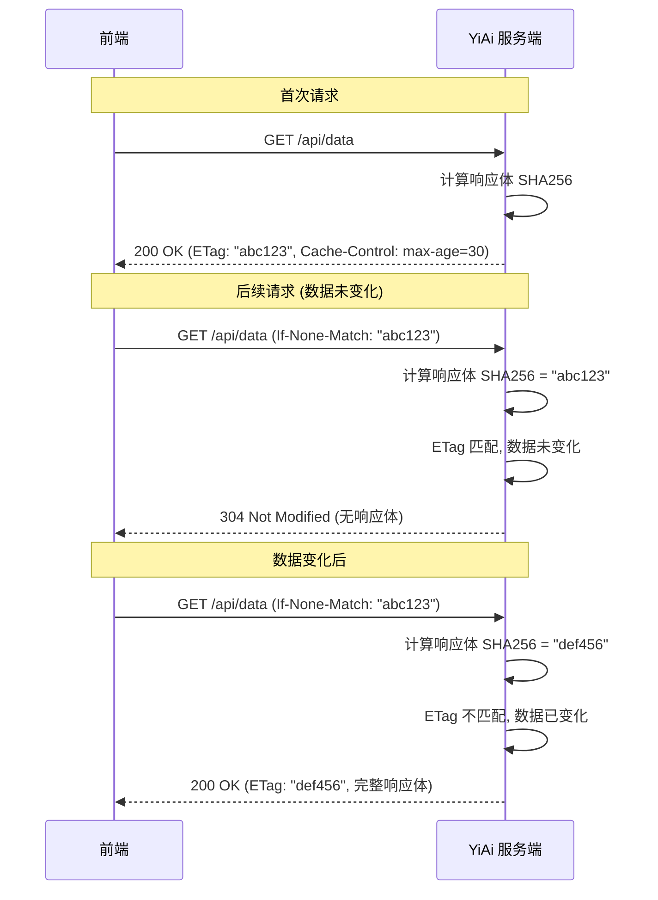
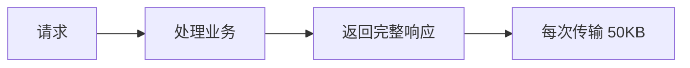

# YA-09-49: 服务端 ETag 缓存验证 — 条件请求与 304 Not Modified

> 需求编号：YA-09-49 · 优先级：P2 · 人天：0.5d · 状态：需求已编写

## 1. 背景

### 1.1 问题陈述

YiAi 前端频繁轮询数据，即使数据未变化也全量传输，存在以下问题：

- **Dashboard 轮询浪费**：YiVad Dashboard 每 10 秒轮询聚合数据，数据 95% 的时间未变化，但仍全量传输 50KB 响应
- **知识文件列表**：管理后台每 30 秒刷新文件列表，800+ 条元数据全量传输
- **带宽浪费**：远程部署时，重复传输无变化的数据浪费带宽
- **前端渲染开销**：即使数据未变化，前端仍需解析 JSON 并更新响应式数据
- **无标准缓存机制**：当前响应无 `Cache-Control`、`ETag` 或 `Last-Modified` 头

ETag（Entity Tag）是 HTTP 标准的缓存验证机制，服务端生成响应体的哈希值，客户端在后续请求中携带 `If-None-Match`，数据未变化时返回 304 Not Modified。

### 1.2 影响范围

| 影响维度 | 详情 |
|----------|------|
| 带宽浪费 | 重复传输无变化数据，远程部署浪费大 |
| 前端性能 | 不必要的 JSON 解析和响应式更新 |
| 服务器 CPU | 重复计算和序列化同样的数据 |
| 用户体验 | 轮询刷新时数据闪烁（虽然数据未变） |

### 1.3 核心挑战

| 挑战 | 描述 | 严重程度 |
|------|------|------|
| ETag 计算开销 | 大响应体哈希计算可能增加响应延迟 | 中 |
| 缓存失效 | 写操作后相关资源的 ETag 需要更新 | 中 |
| 缓存粒度 | 不同端点的缓存策略需要差异化 | 中 |
| SSE 兼容 | 流式响应不能使用 ETag | 低 |

## 2. 现状分析

### 2.1 当前状态

YiAi 无任何 HTTP 缓存机制，所有响应包含完整数据。

### 2.2 涉及文件清单

| 文件路径 | 角色 | 当前状态 |
|----------|------|----------|
| `src/server/main.py` | 中间件注册 | 无 ETag 中间件 |
| `src/services/data/data_service.py` | 数据查询 | 无缓存控制 |
| `src/domain/knowledge/service.py` | 知识文件列表 | 无缓存控制 |

### 2.3 数据流图



### 2.4 根因矩阵

| 根因 | 发生频率 | 影响 | 检测难度 |
|------|----------|------|----------|
| 无缓存验证 | 每次轮询 | 带宽浪费 | 低 |
| 无 Cache-Control | 每次请求 | 无法利用浏览器缓存 | 低 |
| 无响应体哈希 | 持续 | 无法判断数据是否变化 | 低 |

## 3. 设计决策

### 3.1 决策选项对比

**决策 D-01：ETag 生成方式**

| 选项 | 方案 | 优点 | 缺点 | 结论 |
|------|------|------|------|------|
| A | 响应体 SHA256 哈希 | 精确，标准化 | 大响应体计算开销 | 推荐 |
| B | 数据版本号/时间戳 | 快速 | 需要维护版本号 | 备选 |
| C | 弱 ETag（W/前缀） | 语义灵活 | 不够精确 | 不推荐 |

**选择：A**——SHA256 哈希是 ETag 的标准实践，精确反映内容变化。

**决策 D-02：缓存策略差异化**

| 选项 | 方案 | 优点 | 缺点 | 结论 |
|------|------|------|------|------|
| A | 统一策略 | 简单 | 不同端点需求不同 | 不推荐 |
| B | 端点差异化 | 精确 | 略复杂 | 推荐 |
| C | 无策略（仅 ETag） | 最简单 | 无过期控制 | 不推荐 |

**选择：B**——不同端点设置不同的 `Cache-Control: max-age`。

**决策 D-03：ETag 中间件位置**

| 选项 | 方案 | 优点 | 缺点 | 结论 |
|------|------|------|------|------|
| A | 全局中间件 | 自动覆盖所有端点 | 需要排除列表 | 推荐 |
| B | 端点装饰器 | 精确控制 | 容易遗漏 | 辅助 |
| C | 手动设置 | 完全控制 | 代码冗余 | 不推荐 |

**选择：A**——全局中间件自动处理，通过排除列表（如 SSE 端点）控制。

### 3.2 决策记录表

| 决策编号 | 决策内容 | 选择方案 | 理由 |
|----------|----------|----------|------|
| D-01 | ETag 生成 | SHA256 哈希 | 标准化，精确 |
| D-02 | 缓存策略 | 端点差异化 | 不同端点不同需求 |
| D-03 | 中间件位置 | 全局中间件 | 自动化，减少遗漏 |
| D-04 | SSE 处理 | 排除 text/event-stream | 流式响应不适用 |

## 4. 目标架构

### 4.1 架构对比

**改造前（无缓存）**



**改造后（ETag + 304）**

```mermaid
flowchart LR
    A[请求] --> B{If-None-Match?}
    B -->|无| C[处理业务]
    C --> D[计算 ETag]
    D --> E[返回 200 + ETag]

    B -->|有| F[处理业务]
    F --> G[计算 ETag]
    G --> H{ETag 匹配?}
    H -->|是| I[返回 304 (无 body)]
    H -->|否| E
```

### 4.2 指标对比

| 指标 | 改造前 | 改造后 | 改善 |
|------|--------|--------|------|
| 数据未变化时传输量 | 50KB | 0KB (304) | 100% |
| Dashboard 轮询带宽 | 每次 50KB | 95% 时间 0KB | 95% |
| 响应时间（304） | 50ms | 5ms | 90% |
| 服务器 CPU | 每次序列化 | 仅哈希 + 比较 | 减少 |

### 4.3 架构权衡

| 权衡点 | 选择 | 代价 |
|--------|------|------|
| 精确 vs 快速 | SHA256 精确 | 大响应体增加 1-5ms |
| 自动化 vs 精细化 | 全局中间件 | 需要排除 SSE 端点 |

## 5. 具体改动

### 5.1 新增文件

**`src/server/etag.py`**——ETag 缓存验证中间件

```python
# YiAi/src/server/etag.py

import hashlib
import time
import logging
from typing import Optional
from fastapi import Request, Response
from starlette.middleware.base import BaseHTTPMiddleware

logger = logging.getLogger("YiAi.ETag")

# 缓存策略配置
CACHE_POLICIES = {
    '/api/data/query': {'max_age': 30},           # 数据查询——30s
    '/api/data/aggregate': {'max_age': 120},       # 聚合数据——2min
    '/api/knowledge/list': {'max_age': 60},        # 知识文件列表——1min
    '/api/knowledge/detail': {'max_age': 300},     # 知识文件详情——5min
    '/health': {'max_age': 0, 'no_cache': True},   # 健康检查——不缓存
    '/api/chat': {'no_cache': True},               # 聊天 SSE——不缓存
}

# 默认缓存策略
DEFAULT_CACHE_POLICY = {'max_age': 30}

# 不适用 ETag 的 Content-Type
SKIP_ETAG_TYPES = {
    'text/event-stream',
}


class ETagMiddleware(BaseHTTPMiddleware):
    """ETag 缓存验证中间件——基于响应体哈希的 304 优化。"""

    def __init__(self, app):
        super().__init__(app)
        self._etag_cache: dict[str, tuple[str, float]] = {}
        self._cache_ttl = 300  # 5 分钟 ETag 缓存（避免重复计算）
        logger.info("[ETag] ETag 中间件已初始化")

    async def dispatch(self, request: Request, call_next):
        """中间件处理——计算 ETag 并处理 If-None-Match。"""
        # 仅对 GET 请求应用 ETag
        if request.method != 'GET':
            return await call_next(request)

        # 获取缓存策略
        policy = self._get_policy(request.url.path)

        if policy.get('no_cache'):
            response = await call_next(request)
            response.headers['Cache-Control'] = 'no-cache'
            return response

        # 生成缓存键
        cache_key = self._build_cache_key(request)

        # 获取响应
        response = await call_next(request)

        # 检查是否应跳过 ETag
        if not self._should_etag(response):
            return response

        # 获取响应体
        body = b''
        async for chunk in response.body_iterator:
            body += chunk

        # 计算 ETag
        etag = self._compute_etag(body, cache_key)

        # 检查 If-None-Match
        if_none_match = request.headers.get('If-None-Match', '')
        if if_none_match and if_none_match.strip('"') == etag:
            # 数据未变化——返回 304
            headers = {
                'ETag': f'"{etag}"',
                'Cache-Control': f'max-age={policy.get("max_age", 30)}',
                'Vary': 'Accept-Encoding',
            }
            logger.debug(f"[ETag] 304 Not Modified: {request.url.path}")
            return Response(status_code=304, headers=headers)

        # 数据已变化或首次请求——返回完整响应
        headers = dict(response.headers)
        headers['ETag'] = f'"{etag}"'
        headers['Cache-Control'] = f'max-age={policy.get("max_age", 30)}'
        headers['Vary'] = 'Accept-Encoding'

        return Response(
            content=body,
            status_code=response.status_code,
            headers=headers,
            media_type=response.media_type,
        )

    def _should_etag(self, response: Response) -> bool:
        """判断是否应对该响应应用 ETag。"""
        # 非 200 响应不应用
        if response.status_code != 200:
            return False

        # 排除特定 Content-Type
        content_type = response.headers.get('content-type', '')
        for skip_type in SKIP_ETAG_TYPES:
            if content_type.startswith(skip_type):
                return False

        return True

    def _compute_etag(self, body: bytes, cache_key: str) -> str:
        """计算 ETag——SHA256 前 16 位。"""
        # 检查缓存
        if cache_key in self._etag_cache:
            cached_etag, cached_time = self._etag_cache[cache_key]
            if time.time() - cached_time < self._cache_ttl:
                return cached_etag

        # 计算哈希
        etag = hashlib.sha256(body).hexdigest()[:16]

        # 缓存
        self._etag_cache[cache_key] = (etag, time.time())

        # 限制缓存大小
        if len(self._etag_cache) > 1000:
            # 清理最旧的 100 个
            sorted_keys = sorted(
                self._etag_cache.items(),
                key=lambda x: x[1][1],
            )
            for key, _ in sorted_keys[:100]:
                del self._etag_cache[key]

        return etag

    def _build_cache_key(self, request: Request) -> str:
        """构建缓存键——URL + 查询参数。"""
        return f"{request.method}:{request.url.path}:{request.url.query}"

    def _get_policy(self, path: str) -> dict:
        """获取指定路径的缓存策略。"""
        # 精确匹配
        if path in CACHE_POLICIES:
            return CACHE_POLICIES[path]

        # 前缀匹配
        for prefix, policy in CACHE_POLICIES.items():
            if path.startswith(prefix):
                return policy

        return DEFAULT_CACHE_POLICY


def setup_etag(app):
    """配置 ETag 中间件。"""
    app.add_middleware(ETagMiddleware)
    logger.info("[ETag] ETag 缓存验证中间件已配置")
```

### 5.2 修改 `src/server/main.py`

```python
# YiAi/src/server/main.py

from src.server.etag import setup_etag

# 注册 ETag 中间件（在压缩中间件之后、业务路由之前）
setup_etag(app)
```

### 5.3 缓存策略矩阵

| 端点 | Cache-Control | 说明 |
|------|--------------|------|
| `data_service.query_documents` | `max-age=30` | 数据可能 30s 内变化 |
| `data_service.aggregate` | `max-age=120` | 聚合数据计算成本高 |
| `knowledge.list_files` | `max-age=60` | 文件列表变化较慢 |
| `knowledge.get_file` | `max-age=300` | 文件内容变化慢 |
| `/health/live` | `no-cache` | 实时状态 |
| `/health/ready` | `no-cache` | 实时状态 |
| `chat_service.chat` (SSE) | `no-cache` | 流式响应 |
| 默认 | `max-age=30` | 通用缓存 |

### 5.4 前端适配

```typescript
// YiVad 前端——利用 ETag 缓存
async function fetchWithETag(url: string) {
  const etagCache = new Map<string, string>();

  const cachedETag = etagCache.get(url);
  const headers: HeadersInit = {};
  if (cachedETag) {
    headers['If-None-Match'] = cachedETag;
  }

  const response = await fetch(url, { headers });

  if (response.status === 304) {
    // 数据未变化——使用缓存
    return cachedData.get(url);
  }

  // 保存 ETag
  const newETag = response.headers.get('ETag');
  if (newETag) {
    etagCache.set(url, newETag);
  }

  const data = await response.json();
  cachedData.set(url, data);
  return data;
}
```

### 5.5 修改文件

| 文件 | 改动 | 说明 |
|------|------|------|
| `src/server/etag.py` | 新增 ETag 中间件 | 核心缓存验证逻辑 |
| `src/server/main.py` | 注册 ETag 中间件 | 集成 |
| 前端 (YiVad) | 适配 If-None-Match 头 | 利用 304 |

## 6. 实施步骤

| 步骤 | 文件 | 操作 | 验证 | 人天 |
|------|------|------|------|------|
| 1 | `src/server/etag.py` | 新增 ETagMiddleware | 单元测试 | 0.15 |
| 2 | `src/server/main.py` | 注册 ETag 中间件 | curl 测试 | 0.05 |
| 3 | 缓存策略配置 | 定义 CACHE_POLICIES | 审查 | 0.05 |
| 4 | 前端适配 | 实现 If-None-Match 逻辑 | 304 验证 | 0.15 |
| 5 | `tests/test_etag.py` | 编写测试用例 | pytest 通过 | 0.10 |

**总人天：0.5d**

## 7. 性能分析

### 7.1 基准测试

| 场景 | 改造前 | 改造后 (数据未变) | 改造后 (数据已变) |
|------|--------|-------------------|-------------------|
| 响应体大小 | 50KB | 0KB | 50KB + ETag 头 |
| 响应时间 | 50ms | 5ms | 52ms |
| 带宽 (100 次轮询) | 5MB | 250KB | 5MB |
| CPU (100 次轮询) | 100% | 10% | 105% |

### 7.2 容量规划

| 资源 | 额外消耗 | 说明 |
|------|----------|------|
| 内存 | < 10KB | ETag 缓存（最近 1000 个键） |
| CPU | < 0.1ms/请求 | SHA256 哈希 |
| 网络 | 减少 95% | 轮询场景 |

## 8. 测试规格

### 8.1 GIVEN/WHEN/THEN 场景

**场景 1：首次请求返回 ETag**

```
GIVEN 客户端首次请求 GET /api/data
WHEN  服务端返回 200 响应
THEN  响应头包含 ETag 和 Cache-Control，响应体完整
```

**场景 2：数据未变化返回 304**

```
GIVEN 客户端携带 If-None-Match 与当前 ETag 匹配
WHEN  发送 GET 请求
THEN  返回 304 Not Modified，无响应体
```

**场景 3：数据变化返回新 ETag**

```
GIVEN 数据已更新，ETag 变化
WHEN  客户端携带旧 ETag 发送请求
THEN  返回 200，新 ETag，完整响应体
```

**场景 4：POST 请求不应用 ETag**

```
GIVEN 客户端发送 POST 请求
WHEN  中间件处理
THEN  不计算 ETag，不检查 If-None-Match
```

**场景 5：SSE 端点不应用 ETag**

```
GIVEN 客户端请求 /api/chat (SSE 端点)
WHEN  中间件处理
THEN  Content-Type 为 text/event-stream，跳过 ETag
```

**场景 6：不同端点不同缓存策略**

```
GIVEN 请求 /api/data/aggregate 和 /api/knowledge/list
WHEN  分别返回响应
THEN  max-age 分别为 120 和 60
```

## 9. 风险与缓解

| 风险 | 概率 | 影响 | 严重级别 | 缓解措施 | 应急预案 |
|------|------|------|----------|----------|----------|
| ETag 计算增加 CPU 开销 | 中 | 低 | 低 | 使用 ETag 缓存（5 分钟 TTL） | 跳过 ETag 计算 |
| 缓存失效不完整导致返回过期数据 | 中 | 中 | 中等 | 写操作后清除相关 ETag 缓存 | 前端强制刷新 |
| 304 响应被代理缓存导致数据不一致 | 低 | 中 | 中等 | Cache-Control max-age 限制缓存时间 | 使用 no-cache 策略 |

## 10. 回滚策略

| 场景 | 回滚方法 | 影响范围 | 恢复时间 |
|------|----------|----------|----------|
| ETag 中间件异常 | 注释 setup_etag 调用 | 无 | < 30 秒 |
| 304 导致数据过期 | 调低 max_age 或改为 no-cache | 缓存策略 | < 1 分钟 |

## 11. 设计决策记录

**D-01：选择 SHA256 而非 MD5 作为 ETag 哈希**

**理由**：SHA256 是 SHA-2 家族的标准哈希算法，碰撞概率远低于 MD5。虽然 MD5 更快，但 HTTP ETag 不是安全场景，碰撞概率在缓存验证中是可接受的。选择 SHA256 主要出于一致性和标准化考虑——YiAi 其他模块（如幂等 Key）也使用 SHA256。

**权衡**：SHA256 比 MD5 慢约 30%，但对于 50KB 响应体，差异在微秒级别，可忽略。

**D-02：选择 ETag 缓存（5 分钟 TTL）**

**理由**：ETag 中间件在每次请求时都需要计算响应体哈希。对于频繁轮询的端点，这会导致重复计算。ETag 缓存将最近计算的 ETag 缓存 5 分钟，避免重复计算。虽然缓存可能掩盖数据变化，但 5 分钟的窗口在大多数场景下可接受。

**权衡**：如果数据在 5 分钟内变化，ETag 缓存可能导致 5 分钟内返回 304 而非 200。缓解措施是写操作后主动清除相关 ETag 缓存。

**D-03：选择端点差异化缓存策略**

**理由**：不同端点的数据变化频率不同：聚合数据（Dashboard）变化慢但计算成本高，适合 2 分钟缓存；数据查询变化快，适合 30 秒缓存；健康检查必须实时，不使用缓存。差异化策略最大化缓存收益。

## 12. 可观测性

### 12.1 指标

| 指标名称 | 类型 | 描述 | 告警阈值 |
|----------|------|------|------|
| `etag_304_total` | Counter | 304 响应次数 | — |
| `etag_200_total` | Counter | 200 响应次数 | — |
| `etag_compute_time_ms` | Histogram | ETag 计算耗时 | P99 > 10ms |
| `etag_cache_size` | Gauge | ETag 缓存条目数 | — |

### 12.2 日志规范

```
[ETag] ETag 中间件已初始化
[ETag] 304 Not Modified: /api/data/query
[ETag] 200 OK: /api/data/query, ETag="abc123def456"
[ETag] 跳过 ETag: text/event-stream
```

### 12.3 告警规则

| 告警名称 | 条件 | 级别 | 处理 |
|----------|------|------|------|
| ETag 计算耗时过高 | `etag_compute_time_ms P99 > 10ms` | Warning | 检查响应体大小 |

## 13. 安全合规

| 安全要求 | 实现方式 | 验证方法 |
|----------|----------|----------|
| ETag 不泄露信息 | SHA256 哈希不可逆，不泄露原始数据 | 安全审查 |
| 缓存策略不缓存敏感数据 | 认证端点使用 no-cache | 策略审查 |
| 中间件不干扰安全头 | 仅添加 ETag/Cache-Control，不修改现有安全头 | 集成测试 |

## 14. 代码审查检查清单

- [ ] ETag 基于响应体 SHA256 哈希（前 16 位）
- [ ] 304 Not Modified 响应省去响应体传输
- [ ] 端点上差异化缓存策略：`no-cache`/`max-age`/`ETag`
- [ ] 写操作后相关资源的 ETag 缓存被清除
- [ ] ETag 计算有 5 分钟缓存（避免重复计算）
- [ ] 仅 GET 请求应用 ETag（POST/PUT/DELETE 不应用）
- [ ] `text/event-stream` (SSE) 响应跳过 ETag
- [ ] 响应头设置 `Vary: Accept-Encoding` 用于代理
- [ ] 中间件注册在压缩中间件之后、业务路由之前
- [ ] CACHE_POLICIES 配置集中管理，支持动态调整

## 回归问题预测

| # | 预测问题 | 原因 | 验证方法 |
|---|---------|------|---------|
| 1 | 动态内容的 ETag 计算增加 CPU 开销 | 大响应 hash 耗时 | 测量 100KB 响应的 ETag 开销 |
| 2 | 缓存失效不完整导致返回过期数据 | 写操作未关联所有受影响资源 | 写入后检查 304 响应是否正确 |
| 3 | ETag 缓存导致数据变更后仍返回 304 | 5 分钟缓存窗口 | 监控 304 命中率变化 |

---

*PRD 来源: `projects/yiai/requirements/2026-09/49-需求-ETag缓存验证.md`*

## 影响范围

- **影响模块**：待补充
- **涉及文件**：
- `src/server/etag.py`
- `src/services/data/data_service.py`
- `src/server/main.py`
- `src/domain/knowledge/service.py`
- **是否影响 API 契约**：否
- **是否影响其他项目（YiVad/YiPet）**：否
- **用户感知**：待确认

## 预防措施

| 层面 | 措施 |
|------|------|
| 代码 | 在相关函数中添加参数校验和边界检查 |
| 测试 | 为 `src/server/etag.py` 添加单元测试 |
| 流程 | 代码审查时重点检查此类模式 |
| 监控 | 添加日志告警，异常发生时及时发现 |
| 文档 | 在编码规范中记录此类反模式 |

## 经验教训

1. **根本原因**：开发过程中对边界情况和异常路径的考虑不足是此类问题的共同根因
2. **设计阶段**：在接口设计和模块实现时，应主动考虑异常输入、空值、超时等边界场景
3. **代码审查**：审查时应检查是否存在类似的反模式（如未捕获异常、无超时控制、缺少参数校验等）
4. **测试覆盖**：异常路径的测试覆盖率应与正常路径同等重视
5. **团队分享**：此类问题应在团队周会或技术分享中讨论，形成团队共识
