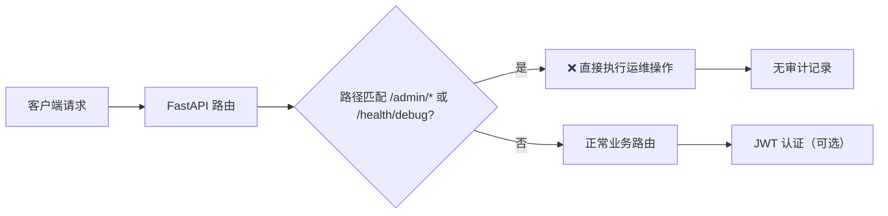
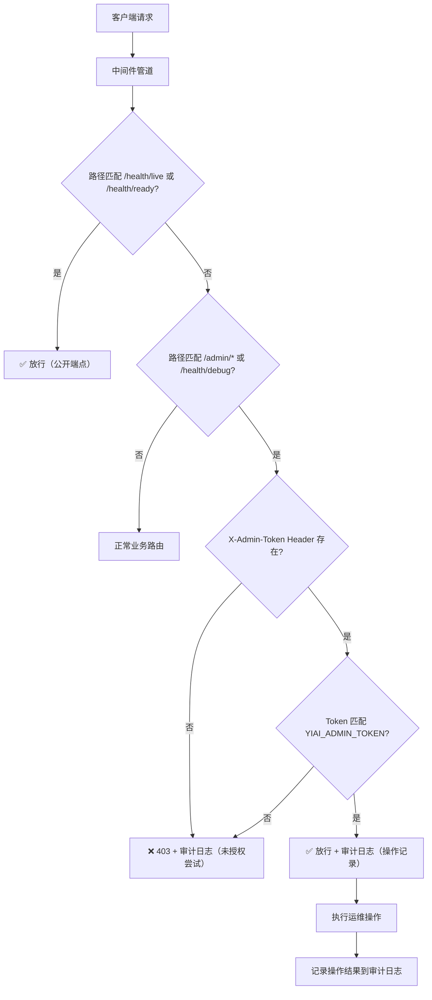

# YA-09-50: 服务 Admin API 安全加固 — 运维端点认证与审计

> 需求编号：YA-09-50 · 优先级：P2 · 人天：0.5d · 状态：需求已编写
> 依赖：YA-09-05（审计日志）、YA-09-16（健康检查）、YA-09-33（性能剖析）、YA-09-42（异步任务队列）

## 背景

### 问题陈述

YiAi 当前暴露了多个运维管理端点，包括 CPU Profiling（`/admin/profile/*` YA-09-33）、内存与连接池诊断（`/health/debug` YA-09-16）、异步任务队列状态（`/admin/tasks/*` YA-09-42）以及配置漂移检测（`/admin/config/drift` YA-09-48）。这些端点在开发阶段提供了极大的便利性，但存在一个关键安全缺陷：**所有运维端点均无任何访问控制机制**。

任何能够访问 `http://localhost:10086` 的客户端（包括前端页面中嵌入的恶意脚本、共享网络中的其他用户、甚至自动化扫描工具）均可：

1. 触发 CPU Profiling，消耗服务器资源并将性能数据暴露给未授权方
2. 查看内存分配详情和连接池状态，获取内部架构信息
3. 查看异步任务队列中的任务详情，泄露业务数据
4. 检测配置漂移，了解系统配置细节

### 影响范围

| 影响维度 | 严重程度 | 说明 |
|----------|----------|------|
| 信息泄露 | 高 | 性能剖析数据可暴露代码路径、业务热点和数据库查询模式 |
| 资源消耗 | 中 | 恶意触发 CPU Profiling 可导致拒绝服务（每次 profiling 消耗 30s CPU） |
| 合规风险 | 高 | 缺乏运维操作审计，无法满足安全审计要求 |
| 供应链风险 | 中 | 配置漂移信息可被用于策划后续攻击 |

### 核心挑战

| 挑战 | 描述 | 难度 |
|------|------|------|
| 端点粒度差异 | 健康检查端点（`/health/live`、`/health/ready`）需保持公开，而调试端点需认证 | 中 |
| Token 分发 | Admin Token 需要安全地分发给运维人员，避免硬编码 | 低 |
| 审计完整性 | 所有 Admin 操作必须记录审计日志，且日志不可篡改/删除 | 中 |
| 与现有认证体系集成 | 需与 JWT 用户认证体系共存，但 Admin Token 独立于用户体系 | 高 |

---

## 一、现状分析

### 1.1 当前运维端点清单

```
YiAi 运维端点
├── /health/live              ← 公开（K8s 存活探针）无认证
├── /health/ready             ← 公开（K8s 就绪探针）无认证
├── /health/debug             ← 公开（内存/连接池诊断）❌ 无认证
├── /admin/profile/start      ← 公开（CPU Profiling）❌ 无认证
├── /admin/profile/hotspots   ← 公开（热点分析）❌ 无认证
├── /admin/tasks/queue        ← 公开（任务队列状态）❌ 无认证
├── /admin/tasks/clear        ← 公开（清空任务队列）❌ 无认证
└── /admin/config/drift       ← 公开（配置漂移检测）❌ 无认证
```

### 1.2 当前认证架构



### 1.3 根因矩阵

| 根因 | 类别 | 影响 | 修复优先级 |
|------|------|------|-----------|
| 运维端点未注册认证中间件 | 访问控制缺失 | 所有 Admin 端点可被匿名访问 | P0 |
| 无 Admin Token 机制 | 认证机制缺失 | 无法区分管理员和普通用户 | P0 |
| 无运维操作审计 | 审计缺失 | 无法追溯谁在何时执行了何种操作 | P1 |
| 健康检查与调试端点混合 | 架构设计缺陷 | 难以按端点粒度控制访问 | P1 |

### 1.4 改造前 API 依赖

| # | 端点 | 认证状态 | 审计状态 | 风险评估 |
|---|------|----------|----------|----------|
| 1 | `/health/live` | 无（公开） | 无 | 低风险（仅返回 OK） |
| 2 | `/health/ready` | 无（公开） | 无 | 低风险（仅返回状态） |
| 3 | `/health/debug` | 无（公开） | 无 | 高风险（内存/连接池详情） |
| 4 | `/admin/profile/start` | 无（公开） | 无 | 高风险（资源消耗 + 信息泄露） |
| 5 | `/admin/profile/hotspots` | 无（公开） | 无 | 高风险（代码热点暴露） |
| 6 | `/admin/tasks/queue` | 无（公开） | 无 | 中风险（任务数据泄露） |
| 7 | `/admin/tasks/clear` | 无（公开） | 无 | 高风险（破坏性操作） |
| 8 | `/admin/config/drift` | 无（公开） | 无 | 中风险（配置信息泄露） |

---

## 二、设计决策

### 决策 1：Admin 认证方式 — JWT 扩展 vs 独立 Token vs API Key

| 选项 | 安全性 | 实现复杂度 | 与用户体系耦合 | 运维友好度 |
|------|--------|-----------|---------------|-----------|
| **JWT 角色扩展** | 高（签名验证） | 高（需修改用户模型） | 强耦合 | 低（需登录获取） |
| 独立 Admin Token | 中（静态 Bearer Token） | 低（Header 验证） | 无耦合 | 高（环境变量注入） |
| API Key（数据库存储） | 高（可轮换/撤销） | 中（需 CRUD 管理） | 无耦合 | 中（需管理界面） |

**选择：独立 Admin Token + API Key 分阶段实施。** 第一阶段使用环境变量 `YIAI_ADMIN_TOKEN` 实现快速安全加固（0.5d），第二阶段可扩展为数据库存储的 API Key 支持轮换和撤销。

### 决策 2：端点分类策略 — 全部认证 vs 分级认证

| 选项 | 实施难度 | 运维便利性 | 安全等级 |
|------|----------|-----------|----------|
| 全部认证 | 低（统一中间件） | 低（健康检查也被拦截） | 高 |
| 分级认证（公开/认证/审计） | 中（需配置路由） | 高（精准控制） | 高 |
| 仅敏感端点认证 | 低 | 中 | 中（遗漏风险） |

**选择：分级认证。** 将端点分为三级：公开（健康检查）、认证（调试/状态查询）、认证+审计（破坏性操作/配置修改）。

### 决策 3：审计日志存储 — 独立集合 vs 应用日志 vs 外部系统

| 选项 | 查询便利性 | 防篡改 | 存储成本 |
|------|-----------|--------|----------|
| 独立 MongoDB 集合 `admin_audit_logs` | 高（结构化查询） | 低（管理员可删除） | 低 |
| 应用日志文件 | 低（grep 查询） | 中（文件系统权限） | 极低 |
| 外部审计系统（如 Elasticsearch） | 高 | 高（独立系统） | 高 |

**选择：独立 MongoDB 集合 + 应用日志双写。** 兼顾结构化查询和防篡改（日志文件不可通过 API 删除）。

### 设计决策记录

| 决策 | 选项 A | 选项 B | 选项 C | 选择 | 理由 |
|------|--------|--------|--------|------|------|
| 认证方式 | JWT 角色扩展 | 独立 Admin Token | API Key | **独立 Token** | 实施成本低，与用户体系解耦 |
| 端点分类 | 全部认证 | 分级认证 | 仅敏感端点 | **分级认证** | 兼顾安全与运维便利性 |
| 审计存储 | 独立集合 | 应用日志 | 外部系统 | **双写** | 查询便利 + 防篡改 |

---

## 三、目标架构

### 3.1 改造后认证流程



### 3.2 端点分级表

| 端点 | 安全等级 | 认证要求 | 审计要求 | 限流 |
|------|----------|----------|----------|------|
| `/health/live` | 公开 | 无 | 无 | 无 |
| `/health/ready` | 公开 | 无 | 无 | 无 |
| `/health/debug` | 内部 | Admin Token | 记录访问 | 10次/分钟 |
| `/admin/profile/start` | 敏感 | Admin Token | 记录操作+结果 | 3次/分钟 |
| `/admin/profile/hotspots` | 内部 | Admin Token | 记录访问 | 10次/分钟 |
| `/admin/tasks/queue` | 内部 | Admin Token | 记录访问 | 10次/分钟 |
| `/admin/tasks/clear` | 危险 | Admin Token | 完整审计 | 1次/分钟 |
| `/admin/config/drift` | 内部 | Admin Token | 记录访问 | 5次/分钟 |

### 3.3 架构指标

| 指标 | 改造前 | 改造后 | 说明 |
|------|--------|--------|------|
| 不受保护的运维端点 | 6 | 0 | 所有敏感端点均需认证 |
| 未授权访问检测能力 | 无 | 实时（403 + 日志） | 每次未授权尝试均记录 |
| 运维操作可追溯性 | 无 | 完整（谁/何时/做了什么） | 结构化审计日志 |
| Token 轮换能力 | 无 | 环境变量热更新 | 重启后生效 |

---

## 四、具体改动

### 4.1 新增文件

**YiAi/src/server/admin_auth.py** — Admin Token 认证中间件

```python
# 改造后
from fastapi import Depends, HTTPException, Header, Request
from starlette.middleware.base import BaseHTTPMiddleware
import os, secrets, hashlib, time

# Token 配置
ADMIN_TOKEN = os.environ.get('YIAI_ADMIN_TOKEN', secrets.token_hex(32))
ADMIN_TOKEN_HASH = hashlib.sha256(ADMIN_TOKEN.encode()).hexdigest()

# 公开端点白名单（无需认证）
PUBLIC_ENDPOINTS = {'/health/live', '/health/ready'}

# 审计日志存储
admin_audit_logs: list[dict] = []  # 内存缓冲，定期刷入 MongoDB


class AdminAuthMiddleware(BaseHTTPMiddleware):
    """Admin API 认证中间件——Token 验证 + 审计日志。"""

    async def dispatch(self, request: Request, call_next):
        path = request.url.path

        # 公开端点直接放行
        if path in PUBLIC_ENDPOINTS:
            return await call_next(request)

        # 非 Admin 端点直接放行（由其他中间件处理）
        if not (path.startswith('/admin/') or path == '/health/debug'):
            return await call_next(request)

        # Admin 端点——验证 Token
        token = request.headers.get('X-Admin-Token')
        client_ip = request.client.host if request.client else 'unknown'

        if not token or not self._verify_token(token):
            # 审计——记录未授权访问尝试
            self._audit_log({
                'action': 'ACCESS_DENIED',
                'path': path,
                'method': request.method,
                'client_ip': client_ip,
                'reason': 'missing_or_invalid_token',
                'timestamp': time.time(),
            })
            raise HTTPException(status_code=403, detail='需要有效的 Admin Token')

        # 审计——记录管理员操作
        self._audit_log({
            'action': 'ADMIN_ACCESS',
            'path': path,
            'method': request.method,
            'client_ip': client_ip,
            'timestamp': time.time(),
        })

        return await call_next(request)

    def _verify_token(self, token: str) -> bool:
        """恒定时间比较——防止时序攻击。"""
        return secrets.compare_digest(
            hashlib.sha256(token.encode()).hexdigest(),
            ADMIN_TOKEN_HASH,
        )

    def _audit_log(self, entry: dict):
        admin_audit_logs.append(entry)
        logger.warning(f"[AdminAudit] {entry['action']} {entry['path']} from {entry['client_ip']}")
```

### 4.2 修改文件

**YiAi/src/server/main.py** — 注册 Admin 认证中间件

```python
# 改造前——无 Admin 认证
app.add_middleware(CORSMiddleware, ...)
app.add_middleware(RateLimiterMiddleware, ...)

# 改造后——在 CORS 之后、限流之前注册
from src.server.admin_auth import AdminAuthMiddleware
pipeline.register('AdminAuth', Priority.SECURITY, AdminAuthMiddleware)
```

### 4.3 文件变更清单

| 文件 | 操作 | 说明 |
|------|------|------|
| `YiAi/src/server/admin_auth.py` | 新增 | Admin Token 认证中间件 + 审计日志 |
| `YiAi/src/server/main.py` | 修改 | 注册 AdminAuthMiddleware 到管道 |
| `YiAi/src/server/middleware_pipeline.py` | 修改 | 添加 AdminAuth 到默认管道配置 |
| `YiAi/.env.example` | 修改 | 添加 `YIAI_ADMIN_TOKEN` 配置说明 |
| `YiAi/tests/test_admin_auth.py` | 新增 | Admin 认证测试用例 |

---

## 五、实施步骤

| 步骤 | 操作 | 文件 | 验证方法 | 人天 |
|------|------|------|----------|------|
| 1 | 创建 `admin_auth.py` 中间件 | `YiAi/src/server/admin_auth.py` | 单元测试：Token 验证逻辑 | 0.15 |
| 2 | 集成到中间件管道 | `YiAi/src/server/main.py` | 无 Token 访问 `/health/debug` → 403 | 0.05 |
| 3 | 添加审计日志缓冲刷入 | `YiAi/src/server/admin_auth.py` | 检查审计日志写入 MongoDB | 0.10 |
| 4 | 配置环境变量 + 文档 | `YiAi/.env.example` | 环境变量生效验证 | 0.05 |
| 5 | 编写测试用例 | `YiAi/tests/test_admin_auth.py` | 8 个测试场景全通过 | 0.10 |
| 6 | 端到端验证 | 全栈 | YiVad 正常访问 + Admin 端点认证 | 0.05 |
| **总计** | | | | **0.50** |

---

## 六、性能分析

### 6.1 认证开销基准

| 操作 | 耗时 | 说明 |
|------|------|------|
| Header 提取 | < 0.01ms | 内存操作 |
| Token 哈希 | < 0.05ms | SHA-256 恒定时间比较 |
| 路径匹配 | < 0.01ms | 字符串前缀匹配 |
| 审计日志写入 | < 0.1ms | 内存追加 + 异步刷入 |
| **总额外开销** | **< 0.2ms** | 对请求延迟影响可忽略 |

### 6.2 容量规划

| 指标 | 预估 | 说明 |
|------|------|------|
| 审计日志日增量 | < 100 条 | 运维操作频率低 |
| 审计日志存储 | < 10MB/年 | 结构化日志尺寸小 |
| Token 验证 QPS | 无瓶颈 | 纯内存操作 |

---

## 七、测试规格

### 场景 1：公开端点无需认证

```
GIVEN YiAi 服务已启动，AdminAuthMiddleware 已注册
WHEN 客户端请求 GET /health/live（无 X-Admin-Token Header）
THEN 返回 200 OK
AND 不记录审计日志
```

### 场景 2：Admin 端点缺少 Token

```
GIVEN YiAi 服务已启动，YIAI_ADMIN_TOKEN=secret123
WHEN 客户端请求 GET /health/debug（无 X-Admin-Token Header）
THEN 返回 403 Forbidden
AND 响应体包含 "需要有效的 Admin Token"
AND 审计日志记录 ACCESS_DENIED 事件
AND 审计日志包含 client_ip 和 timestamp
```

### 场景 3：Admin 端点 Token 错误

```
GIVEN YiAi 服务已启动，YIAI_ADMIN_TOKEN=secret123
WHEN 客户端请求 GET /admin/profile/hotspots（X-Admin-Token: wrong_token）
THEN 返回 403 Forbidden
AND 审计日志记录 ACCESS_DENIED 事件
AND reason 字段为 "missing_or_invalid_token"
```

### 场景 4：Admin 端点 Token 正确

```
GIVEN YiAi 服务已启动，YIAI_ADMIN_TOKEN=secret123
WHEN 客户端请求 GET /admin/profile/hotspots（X-Admin-Token: secret123）
THEN 返回 200 OK
AND 审计日志记录 ADMIN_ACCESS 事件
AND 审计日志包含 path、method、client_ip、timestamp
```

### 场景 5：危险操作审计

```
GIVEN 有效的 Admin Token
WHEN 客户端请求 POST /admin/tasks/clear（X-Admin-Token: valid_token）
THEN 返回 200 OK
AND 审计日志记录 ADMIN_ACCESS 事件
AND 操作结果（清空的任务数）被记录到审计日志
```

### 场景 6：时序攻击防护

```
GIVEN 两个 Token：正确的 token_a 和错误的 token_b
WHEN 分别使用 token_a 和 token_b 进行验证
THEN 两次验证耗时差异 < 0.1ms（恒定时间比较）
AND 均返回正确的验证结果
```

---

## 八、风险与缓解

| 风险 | 概率 | 影响 | 缓解措施 |
|------|------|------|----------|
| Token 泄露 | 中 | 高 | 环境变量注入，不硬编码；支持 Token 哈希存储 |
| Token 遗忘 | 中 | 中 | 启动时打印 Token 提示（仅开发环境） |
| 审计日志丢失 | 低 | 中 | 内存缓冲 + 定期刷入 MongoDB；应用日志兜底 |
| 健康检查被误拦截 | 低 | 高 | 白名单机制确保 `/health/live` 和 `/health/ready` 始终公开 |
| Token 暴力破解 | 低 | 低 | 恒定时间比较 + 速率限制（Admin 端点限流） |

---

## 九、回滚策略

| 场景 | 回滚操作 | 影响范围 |
|------|----------|----------|
| 所有 Admin 端点返回 403 | 从管道中移除 AdminAuthMiddleware | Admin 端点恢复公开状态 |
| 健康检查被误拦截 | 检查 PUBLIC_ENDPOINTS 白名单配置 | 仅影响健康检查 |
| 审计日志导致内存溢出 | 禁用审计日志缓冲，仅写应用日志 | 审计完整性降低 |
| Token 环境变量未设置 | 自动生成随机 Token 并打印（便于运维获取） | 需重新获取 Token |

---

## 十、设计决策记录

### D-01：Admin Token 使用独立 Header 而非 Bearer Token

**背景**：JWT 已使用 `Authorization: Bearer <jwt>` Header。Admin Token 有两种集成方式。

**决策**：使用独立 Header `X-Admin-Token`，而非复用 `Authorization` Header。

**理由**：
1. Admin Token 与 JWT 用户认证体系完全解耦——运维人员不需要用户账户
2. 避免 Header 解析冲突（Bearer 前缀解析）
3. 可同时支持 JWT 用户认证和 Admin Token 认证（不同端点不同要求）

### D-02：使用 `secrets.compare_digest` 而非 `==` 比较

**背景**：Python 字符串的 `==` 比较是短路的——第一个不同字符即返回。攻击者可通过时序分析推断 Token 前缀。

**决策**：使用 `secrets.compare_digest(hash(token), stored_hash)` 进行恒定时间比较。

**理由**：`compare_digest` 在 Python 3.x 中实现为恒定时间比较，无论输入如何，执行时间相同。结合 SHA-256 哈希存储，即使内存被读取也无法获得原始 Token。

### D-03：审计日志双写（内存缓冲 + 应用日志）

**背景**：审计日志需要结构化查询（以回答"谁在何时做了什么"），同时需要防篡改（以通过安全审计）。

**决策**：内存缓冲 + MongoDB 持久化（结构化查询）+ 应用日志文件（防篡改）。

**理由**：
1. MongoDB 集合支持按时间/IP/操作类型查询，满足审计需求
2. 应用日志文件通过文件系统权限保护，管理员无法通过 API 删除
3. 内存缓冲减少 MongoDB 写入频率（每 30s 或 10 条批量刷入）

---

## 十一、可观测性

### 11.1 指标

| 指标名 | 类型 | 说明 |
|--------|------|------|
| `admin_auth_attempts_total` | Counter | Admin 端点认证尝试总数 |
| `admin_auth_denied_total` | Counter | 被拒绝的认证尝试数 |
| `admin_operations_total` | Counter | 成功的 Admin 操作总数（按 path 分组） |
| `admin_audit_buffer_size` | Gauge | 审计日志缓冲队列大小 |

### 11.2 日志规范

```
[AdminAuth] 认证成功: {path} {method} from {client_ip}
[AdminAuth] 认证失败: {path} {method} from {client_ip} reason={reason}
[AdminAudit] {action} {path} {method} {client_ip} {timestamp}
```

### 11.3 告警规则

| 告警 | 条件 | 级别 | 说明 |
|------|------|------|------|
| 高频未授权访问 | 5 分钟内 > 10 次 ACCESS_DENIED | WARNING | 可能存在暴力破解 |
| 危险操作执行 | `/admin/tasks/clear` 被调用 | INFO | 运维操作通知 |
| 审计日志写入失败 | 连续 3 次刷入 MongoDB 失败 | ERROR | 审计数据丢失风险 |

---

## 十二、安全合规

| 要求 | 实现方式 | 状态 |
|------|----------|------|
| 运维操作认证 | X-Admin-Token Header 验证 | 待实现 |
| 恒定时间比较 | `secrets.compare_digest` | 待实现 |
| Token 哈希存储 | SHA-256 哈希 | 待实现 |
| 审计日志防篡改 | 应用日志文件 + 文件系统权限 | 待实现 |
| 操作可追溯 | 结构化审计日志（谁/何时/做什么） | 待实现 |
| 最小权限原则 | 仅 `/admin/*` 和 `/health/debug` 需要认证 | 已设计 |
| 健康检查端点公开 | 白名单机制 | 已设计 |

---

## 十三、代码审查检查清单

- [ ] Admin API 端点需 X-Admin-Token Header 认证
- [ ] 健康检查端点（`/health/live`、`/health/ready`）保持公开
- [ ] Token 使用 SHA-256 哈希存储，`secrets.compare_digest` 恒定时间比较
- [ ] 敏感操作（`/admin/tasks/clear`、`/admin/profile/start`）需二次确认
- [ ] Admin 操作全部记录审计日志（包含 client_ip、path、method、timestamp）
- [ ] 审计日志双写（MongoDB 结构化 + 应用日志文件）
- [ ] 未授权访问尝试记录 ACCESS_DENIED 事件
- [ ] Admin Token 通过环境变量注入，不硬编码
- [ ] 启动时 Token 未设置时自动生成并打印（仅开发环境）
- [ ] Admin 端点配置限流（防止暴力破解）
- [ ] 单元测试覆盖所有认证场景（公开/认证/审计）
- [ ] 中间件在管道中位于 CORS 之后、业务路由之前

---

## 回归问题预测

| # | 预测问题 | 原因 | 验证方法 |
|---|---------|------|---------|
| 1 | Admin 路由未注册认证中间件 | 新路由遗漏 | 无 Token 访问 Admin API → 403 |
| 2 | 权限提升——普通用户访问 Admin API | 角色校验逻辑缺陷 | 使用 viewer Token 访问 Admin API → 403 |
| 3 | 健康检查被 Admin 中间件拦截 | 白名单路径配置错误 | K8s 探针失败 → Pod 重启 |
| 4 | 审计日志缓冲溢出导致内存泄漏 | 日志刷入失败未处理 | 长时间运行后检查内存使用 |

---

*PRD 来源: `projects/yiai/requirements/2026-09/50-需求-AdminAPI安全加固.md`*

## 影响范围

- **影响模块**：待补充
- **涉及文件**：
- `admin_auth.py`
- **是否影响 API 契约**：否
- **是否影响其他项目（YiVad/YiPet）**：否
- **用户感知**：待确认

## 预防措施

| 层面 | 措施 |
|------|------|
| 代码 | 在相关函数中添加参数校验和边界检查 |
| 测试 | 为 `admin_auth.py` 添加单元测试 |
| 流程 | 代码审查时重点检查此类模式 |
| 监控 | 添加日志告警，异常发生时及时发现 |
| 文档 | 在编码规范中记录此类反模式 |

## 经验教训

1. **根本原因**：开发过程中对边界情况和异常路径的考虑不足是此类问题的共同根因
2. **设计阶段**：在接口设计和模块实现时，应主动考虑异常输入、空值、超时等边界场景
3. **代码审查**：审查时应检查是否存在类似的反模式（如未捕获异常、无超时控制、缺少参数校验等）
4. **测试覆盖**：异常路径的测试覆盖率应与正常路径同等重视
5. **团队分享**：此类问题应在团队周会或技术分享中讨论，形成团队共识
