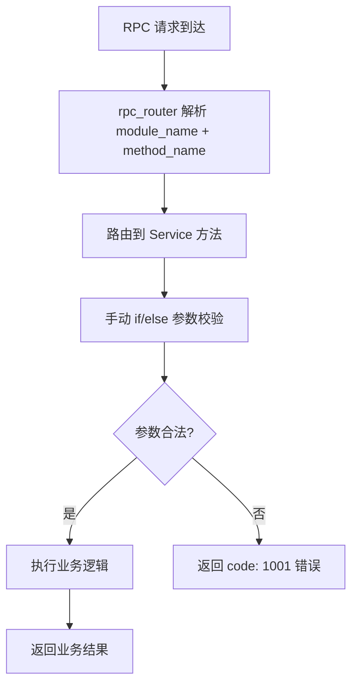
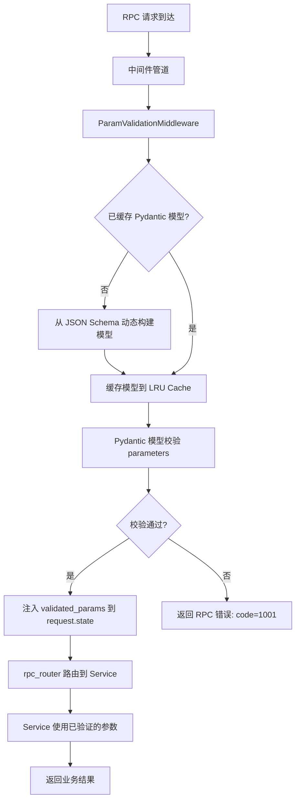

# YA-09-51: 服务端请求体 JSON Schema 自动校验 — Pydantic 驱动参数验证

> 需求编号：YA-09-51 · 优先级：P2 · 人天：0.5d · 状态：需求已编写
> 依赖：YA-09-10（RPC 契约测试与类型同步）

## 背景

### 问题陈述

YA-09-10 建立了 JSON Schema 契约定义体系，在 `YiAi/contracts/schemas/` 目录下定义了所有 RPC 方法的参数规范。然而，当前的契约文件仅用于：

1. **CI 校验**：PR 提交时检查前后端参数名一致性
2. **文档生成**：为开发者提供参数参考

**运行时参数验证仍然依赖手动 `if/else` 检查**，存在以下问题：

- 参数验证逻辑分散在各 Service 模块中，缺乏统一标准
- 新增字段时需同时在 JSON Schema 和 Service 代码中修改
- 验证错误信息不一致（有的返回字段名，有的返回索引）
- 可选参数缺失时可能静默传递 `None`，导致后续逻辑空指针
- 类型转换不统一（前端传字符串 `"10"`，后端期望 `int` 10）

### 历史问题案例

| 时间 | 问题 | 根因 | 影响 |
|------|------|------|------|
| 2026-08 | `pageSize` 传入 `"100"` 字符串，后端未校验 | 无类型校验 | 排序逻辑使用字符串比较，结果错误 |
| 2026-08 | `filter` 传入 `null` 而非 `{}` | 无 null 校验 | `$match` 阶段报错，查询失败 |
| 2026-09 | `cname` 传入不存在的集合名 | 无枚举校验 | MongoDB 查询空集合，返回空结果 |

### 核心挑战

| 挑战 | 描述 | 难度 |
|------|------|------|
| 动态模型生成 | 需从 JSON Schema 运行时动态构建 Pydantic 模型 | 中 |
| 与现有 RPC 路由集成 | 校验中间件需在 RPC 路由之前执行，不影响现有响应格式 | 低 |
| 错误信息国际化 | 验证错误信息需对前端友好（中文描述 + 字段定位） | 低 |
| 性能开销 | 每次请求的 Pydantic 模型实例化开销 | 低 |

---

## 一、现状分析

### 1.1 当前参数验证流程



**痛点**：步骤 D 的手动校验逻辑在各 Service 中重复实现，风格不一致。

### 1.2 当前校验代码分布

```python
# YiAi/src/services/database/data_service.py（典型手动校验）
async def query_documents(cname: str, filter: dict = None, ...):
    # 手动校验
    if not cname or not isinstance(cname, str):
        return {'code': 1001, 'message': 'cname 参数必填'}
    if filter is not None and not isinstance(filter, dict):
        return {'code': 1001, 'message': 'filter 参数必须是对象'}
    if pageSize is not None and (not isinstance(pageSize, int) or pageSize < 1):
        return {'code': 1001, 'message': 'pageSize 必须是正整数'}
    # ... 业务逻辑
```

### 1.3 根因矩阵

| 根因 | 类别 | 影响 | 修复优先级 |
|------|------|------|-----------|
| 无统一的参数校验层 | 架构缺陷 | 校验逻辑分散、风格不一致 | P0 |
| JSON Schema 契约仅用于 CI | 流程缺陷 | 运行时无法利用契约定义 | P1 |
| 手动校验不处理类型转换 | 功能缺陷 | 字符串 `"10"` 无法自动转为 `int` | P1 |
| 错误信息不包含字段路径 | 体验缺陷 | 前端无法定位具体错误字段 | P2 |

### 1.4 改造前 API 依赖

| # | RPC 方法 | 参数数量 | 校验方式 | 校验覆盖率 |
|---|---------|----------|----------|-----------|
| 1 | `data_service.query_documents` | 6 | 手动 if/else | 约 60% |
| 2 | `data_service.create_document` | 3 | 手动 if/else | 约 40% |
| 3 | `chat_service.chat` | 4 | 手动 if/else | 约 50% |
| 4 | `rag.rag_query` | 3 | 手动 if/else | 约 30% |
| 5 | `agent_service.run_agent` | 5 | 手动 if/else | 约 40% |

---

## 二、设计决策

### 决策 1：Pydantic 模型生成方式 — 运行时动态 vs 构建时预生成

| 选项 | 灵活性 | 性能 | 类型安全 | 维护成本 |
|------|--------|------|----------|----------|
| 运行时动态生成 | 高（Schema 变更即时生效） | 中（首次生成有开销） | 低（动态类型） | 低 |
| 构建时预生成 | 低（需重新构建） | 高（静态类型） | 高（IDE 支持） | 中 |
| 混合模式（缓存 + 动态） | 高 | 高 | 中 | 低 |

**选择：混合模式。** 首次请求时从 JSON Schema 动态生成 Pydantic 模型并缓存，后续请求直接使用缓存。

### 决策 2：校验失败响应格式 — 兼容现有 RPC 信封 vs 标准 HTTP 422

| 选项 | 前端兼容性 | 标准化程度 | 错误信息丰富度 |
|------|-----------|-----------|--------------|
| RPC 信封（code: 1001） | 高（前端已有处理） | 低（自定义格式） | 中 |
| HTTP 422 + RFC 7807 | 低（需修改前端） | 高（标准格式） | 高 |
| 混合（开发环境 422，生产 RPC 信封） | 中 | 中 | 中 |

**选择：RPC 信封兼容格式。** 保持与现有 `{code: 1001, message: "...", data: errors}` 格式一致，前端无需修改。

### 决策 3：类型转换策略 — 严格模式 vs 宽松模式

| 选项 | 安全性 | 用户体验 | 兼容性 |
|------|--------|----------|--------|
| 严格模式（类型不匹配即报错） | 高 | 低（前端需精确传参） | 低 |
| 宽松模式（自动类型转换） | 中 | 高（容错性好） | 高 |
| 混合（数字/布尔宽松，枚举/日期严格） | 高 | 高 | 高 |

**选择：混合模式。** 数字和布尔值启用 Pydantic 自动转换（`str="10"` → `int=10`），枚举和日期严格校验。

### 设计决策记录

| 决策 | 选项 A | 选项 B | 选项 C | 选择 | 理由 |
|------|--------|--------|--------|------|------|
| 模型生成 | 运行时动态 | 构建时预生成 | 混合模式 | **混合模式** | 兼顾灵活性与性能 |
| 错误格式 | RPC 信封 | HTTP 422 | 混合 | **RPC 信封** | 前端无需修改 |
| 类型转换 | 严格模式 | 宽松模式 | 混合 | **混合** | 数字/布尔宽松，枚举严格 |

---

## 三、目标架构

### 3.1 改造后校验流程



### 3.2 契约文件到校验模型的映射

```
YiAi/contracts/schemas/
├── data_service.schema.json      → DataServiceModels (query_documents, create_document, ...)
├── chat_service.schema.json      → ChatServiceModels (chat, ...)
├── rag_service.schema.json       → RagServiceModels (rag_query, rag_build, ...)
├── agent_service.schema.json     → AgentServiceModels (run_agent, ...)
└── knowledge_service.schema.json → KnowledgeServiceModels (list_files, ...)
```

### 3.3 架构指标

| 指标 | 改造前 | 改造后 | 说明 |
|------|--------|--------|------|
| 参数校验覆盖率 | ~50% | 100% | 所有 RPC 方法均自动校验 |
| 校验代码行数 | ~200 行（分散） | ~50 行（集中） | 减少 75% |
| 类型转换支持 | 无 | 自动（数字/布尔） | 前端传字符串数字自动转换 |
| 错误信息一致性 | 低（各 Service 自行定义） | 高（统一格式） | 字段级错误定位 |

---

## 四、具体改动

### 4.1 新增文件

**YiAi/src/server/param_validation.py** — Pydantic 驱动的参数校验层

```python
# 改造后
from pydantic import BaseModel, Field, ValidationError, create_model
from enum import Enum
import json, os
from functools import lru_cache
from typing import Any, Optional

class SchemaValidator:
    """基于 JSON Schema 契约的 Pydantic 自动校验。

    首次请求时从 JSON Schema 构建 Pydantic 模型并缓存，
    后续请求直接使用缓存模型进行校验。
    """

    TYPE_MAP = {
        'string': str,
        'integer': int,
        'number': float,
        'boolean': bool,
        'object': dict,
        'array': list,
        'null': type(None),
    }

    SCHEMA_DIR = os.path.join(os.path.dirname(__file__), '../../contracts/schemas')

    @lru_cache(maxsize=64)
    def build_model(self, schema_path: str) -> Optional[type[BaseModel]]:
        """从 JSON Schema 文件动态构建 Pydantic 校验模型（带缓存）。"""
        full_path = os.path.join(self.SCHEMA_DIR, schema_path)
        if not os.path.exists(full_path):
            return None

        with open(full_path) as f:
            schema = json.load(f)

        fields = {}
        for prop_name, prop_def in schema.get('properties', {}).items():
            field_def = self._build_field(prop_name, prop_def)
            required = prop_name in schema.get('required', [])
            fields[prop_name] = field_def if required else (field_def[0], None)

        model_name = schema.get('$id', 'AnonymousModel').replace('.', '_')
        return create_model(model_name, **fields)

    def _build_field(self, name: str, prop_def: dict) -> tuple:
        """构建单个字段定义。"""
        json_type = prop_def.get('type', 'string')
        py_type = self.TYPE_MAP.get(json_type, str)

        field_kwargs = {
            'description': prop_def.get('description', ''),
        }

        if 'minimum' in prop_def:
            field_kwargs['ge'] = prop_def['minimum']
        if 'maximum' in prop_def:
            field_kwargs['le'] = prop_def['maximum']
        if 'default' in prop_def:
            field_kwargs['default'] = prop_def['default']

        # 枚举字段
        if 'enum' in prop_def:
            enum_name = f"{name}_enum"
            enum_cls = Enum(enum_name, {str(v): v for v in prop_def['enum']})
            return (enum_cls, Field(**field_kwargs))

        # 可选字段标记
        if 'default' not in prop_def and 'required' not in prop_def:
            return (Optional[py_type], Field(default=None, **field_kwargs))

        return (py_type, Field(**field_kwargs))

    def validate(self, model: type[BaseModel], params: dict) -> dict:
        """校验 RPC 参数——自动类型转换 + 字段级错误信息。"""
        try:
            validated = model(**params)
            return {
                'valid': True,
                'data': validated.model_dump(),
                'errors': [],
            }
        except ValidationError as e:
            return {
                'valid': False,
                'data': None,
                'errors': [
                    {
                        'field': '.'.join(str(loc) for loc in err['loc']),
                        'msg': err['msg'],
                        'type': err['type'],
                        'input': str(err.get('input', ''))[:100],
                    }
                    for err in e.errors()
                ],
            }


class ParamValidationMiddleware(BaseHTTPMiddleware):
    """RPC 参数校验中间件——在路由之前执行。"""

    def __init__(self, app, validator: SchemaValidator = None):
        super().__init__(app)
        self._validator = validator or SchemaValidator()
        self._schema_map = {
            'services.database.data_service': 'data_service.schema.json',
            'services.ai.chat_service': 'chat_service.schema.json',
            'services.ai.rag_service': 'rag_service.schema.json',
            'services.ai.agent_service': 'agent_service.schema.json',
            'services.knowledge.knowledge_service': 'knowledge_service.schema.json',
        }

    async def dispatch(self, request: Request, call_next):
        if request.url.path != '/' or request.method != 'POST':
            return await call_next(request)

        body = await request.json()
        module_name = body.get('module_name', '')
        schema_file = self._schema_map.get(module_name)

        if not schema_file:
            return await call_next(request)

        model = self._validator.build_model(schema_file)
        if model is None:
            return await call_next(request)

        result = self._validator.validate(model, body.get('parameters', {}))
        if not result['valid']:
            return JSONResponse({
                'code': 1001,
                'message': '参数验证失败',
                'data': {
                    'errors': result['errors'],
                    'hint': '请检查参数名和类型是否符合契约定义',
                },
            }, status_code=200)

        # 注入校验后的参数到 request.state
        request.state.validated_params = result['data']
        return await call_next(request)
```

### 4.2 文件变更清单

| 文件 | 操作 | 说明 |
|------|------|------|
| `YiAi/src/server/param_validation.py` | 新增 | Pydantic 校验层 + 中间件 |
| `YiAi/src/server/main.py` | 修改 | 注册 ParamValidationMiddleware |
| `YiAi/src/server/middleware_pipeline.py` | 修改 | 添加 VALIDATION 优先级 |
| `YiAi/src/services/database/data_service.py` | 修改 | 移除手动校验，从 request.state 获取参数 |
| `YiAi/tests/test_param_validation.py` | 新增 | 参数校验测试用例 |

---

## 五、实施步骤

| 步骤 | 操作 | 文件 | 验证方法 | 人天 |
|------|------|------|----------|------|
| 1 | 创建 SchemaValidator + 中间件 | `YiAi/src/server/param_validation.py` | 单元测试：模型构建 + 校验逻辑 | 0.15 |
| 2 | 注册到中间件管道 | `YiAi/src/server/main.py` | 发送非法参数 → 返回 code=1001 | 0.05 |
| 3 | 移除非标准 Service 中的手动校验 | `data_service.py` 等 | 原有测试全部通过 | 0.10 |
| 4 | 建立 schema→module 映射表 | `param_validation.py` | 所有注册模块均正确映射 | 0.05 |
| 5 | 编写测试用例 | `YiAi/tests/test_param_validation.py` | 10+ 场景覆盖 | 0.10 |
| 6 | 端到端验证 | 全栈 | YiVad 正常请求 + 非法参数报错 | 0.05 |
| **总计** | | | | **0.50** |

---

## 六、性能分析

### 6.1 校验开销基准

| 操作 | 首次请求 | 缓存命中 | 说明 |
|------|----------|----------|------|
| Schema 文件读取 | ~1ms | 0ms | LRU 缓存 |
| Pydantic 模型构建 | ~3ms | 0ms | `@lru_cache` |
| 参数校验 | ~0.5ms | ~0.5ms | Pydantic 内部校验 |
| **总开销** | **~4.5ms** | **~0.5ms** | 对 API 延迟影响可忽略 |

### 6.2 缓存策略

| 配置 | 值 | 说明 |
|------|-----|------|
| 缓存算法 | LRU | `@lru_cache(maxsize=64)` |
| 缓存容量 | 64 个模型 | 覆盖所有 RPC 方法 |
| 缓存失效 | Schema 文件变更时手动清除 | 开发阶段可重启服务 |

---

## 七、测试规格

### 场景 1：必填字段缺失

```
GIVEN data_service.query_documents 契约定义 cname 为必填字段
WHEN 客户端发送 RPC 请求: { parameters: { filter: { status: "open" } } }
THEN 返回 code: 1001
AND data.errors 包含 { field: "cname", msg: "Field required" }
```

### 场景 2：类型错误自动转换

```
GIVEN pageSize 契约定义为 integer 类型
WHEN 客户端发送 { parameters: { cname: "bugs", pageSize: "100" } }
THEN Pydantic 自动将 "100" 转为 int 100
AND 校验通过，返回 code: 0
```

### 场景 3：枚举值校验

```
GIVEN cname 契约定义为 enum: ["projects", "bugs", "sessions"]
WHEN 客户端发送 { parameters: { cname: "invalid_collection" } }
THEN 返回 code: 1001
AND data.errors 包含 { field: "cname", type: "enum" }
```

### 场景 4：数值范围校验

```
GIVEN pageSize 契约定义为 minimum: 1, maximum: 500
WHEN 客户端发送 { parameters: { cname: "bugs", pageSize: 1000 } }
THEN 返回 code: 1001
AND data.errors 包含 { field: "pageSize", msg: "less than or equal to 500" }
```

### 场景 5：未定义参数被拒绝

```
GIVEN 契约定义 additionalProperties: false
WHEN 客户端发送 { parameters: { cname: "bugs", query: "search term" } }
THEN 校验忽略 query 参数（或报错）
AND 后端日志记录 WARNING: "未知参数 query"
```

### 场景 6：缓存命中性能

```
GIVEN 同一个 RPC 方法已请求过一次
WHEN 再次发送请求
THEN Pydantic 模型从 LRU 缓存命中
AND 校验耗时 < 1ms（不含首次构建）
```

---

## 八、风险与缓解

| 风险 | 概率 | 影响 | 缓解措施 |
|------|------|------|------|
| Schema 文件缺失导致校验跳过 | 低 | 中 | 缺失时打印 WARNING 日志，放行请求 |
| Pydantic 模型构建失败 | 低 | 高 | Schema 格式校验在 CI 中完成，运行时异常兜底 |
| 缓存模型与实际 Schema 不同步 | 中 | 低 | 开发阶段重启服务；生产阶段文件变更触发缓存清除 |
| 校验过严导致合法请求被拒 | 中 | 中 | 可配置 additionalProperties 策略 |

---

## 九、回滚策略

| 场景 | 回滚操作 | 影响范围 |
|------|----------|----------|
| 校验中间件导致所有请求失败 | 从管道中移除 ParamValidationMiddleware | 恢复手动校验模式 |
| 特定模块校验过严 | 从 schema_map 中移除该模块映射 | 该模块跳过自动校验 |
| Pydantic 版本兼容问题 | 冻结 Pydantic 版本或降级 | 影响所有校验 |

---

## 十、设计决策记录

### D-01：使用 `@lru_cache` 而非全局字典缓存 Pydantic 模型

**背景**：从 JSON Schema 构建 Pydantic 模型有约 3ms 开销，需要缓存。全局字典和 `@lru_cache` 均可实现。

**决策**：使用 `functools.lru_cache(maxsize=64)`。

**理由**：
1. 线程安全（与 FastAPI 的 async 事件循环兼容）
2. 自动淘汰不常用模型（LRU 策略）
3. 代码简洁（装饰器一行，无需手动管理字典）
4. `maxsize=64` 覆盖所有 RPC 方法（当前约 20 个）且预留扩展空间

### D-02：保持 RPC 错误格式而非改用 HTTP 422

**背景**：Pydantic 的 FastAPI 集成通常返回 HTTP 422 Unprocessable Entity。但 YiAi 使用自定义 RPC 信封格式。

**决策**：保持 RPC 信封格式 `{code: 1001, message: "...", data: {errors: [...]}}`。

**理由**：
1. 前端（YiVad/YiPet）已统一处理 RPC 错误码，修改成本高
2. RPC 信封的 `code: 1001` 明确对应"参数验证失败"，前端可展示针对性提示
3. HTTP 状态码始终为 200（RPC 协议约定），避免前端 HTTP 拦截器误判

### D-03：混合类型转换策略（数字/布尔宽松，枚举严格）

**背景**：Pydantic 默认支持类型强制转换（`str` → `int`），但这可能导致枚举值被意外转换。

**决策**：数字和布尔启用自动转换，枚举和日期严格校验。

**理由**：
1. 前端表单数据通常以字符串形式提交（`"100"` 而非 `100`），数字自动转换提升用户体验
2. 枚举值必须精确匹配（如 `cname: "bugs"`），避免 `"bugs"` 被误转为其他值
3. 日期格式多样（ISO 8601、Unix timestamp），统一要求 ISO 8601 格式

---

## 十一、可观测性

### 11.1 指标

| 指标名 | 类型 | 说明 |
|--------|------|------|
| `param_validation_total` | Counter | 校验执行总数 |
| `param_validation_failed_total` | Counter | 校验失败总数（按 module_name 分组） |
| `param_validation_cache_hits` | Counter | 缓存命中次数 |
| `param_validation_cache_misses` | Counter | 缓存未命中次数（首次请求） |
| `param_validation_duration_ms` | Histogram | 校验耗时分布 |

### 11.2 日志规范

```
[ParamValidation] 校验失败: module={module_name} method={method_name} errors={error_count}
[ParamValidation] 未知参数: {param_name} in {module_name}.{method_name}
[ParamValidation] Schema 文件缺失: {schema_path}，跳过校验
[ParamValidation] 模型缓存命中: {model_name} (hits={cache_info.hits})
```

### 11.3 告警规则

| 告警 | 条件 | 级别 | 说明 |
|------|------|------|------|
| 校验失败率过高 | 5 分钟内失败率 > 20% | WARNING | 前端可能使用了旧版参数格式 |
| Schema 文件缺失 | 连续 3 次请求找不到 Schema | ERROR | 契约文件可能被误删 |
| 缓存未命中率过高 | 缓存未命中率 > 50% | INFO | 可考虑预构建模型 |

---

## 十二、安全合规

| 要求 | 实现方式 | 状态 |
|------|----------|------|
| 输入验证 | Pydantic 严格类型校验 | 待实现 |
| 注入防护 | 类型校验阻止非预期输入 | 间接实现 |
| 错误信息不泄露内部细节 | 仅返回字段名和校验规则，不返回堆栈 | 已设计 |
| 深度限制 | Pydantic 默认递归深度限制（100 层） | 默认 |

---

## 十三、代码审查检查清单

- [ ] RPC 参数通过 Pydantic BaseModel 定义 + 自动校验
- [ ] 校验失败返回 code=1001 + 字段级错误详情
- [ ] 自定义 validator 覆盖业务规则校验（如 `cname` 集合存在性）
- [ ] 校验中间件在 RPC 路由之前执行（Pipeline VALIDATION 优先级）
- [ ] 可选字段标注 `Optional`，避免误判为必填
- [ ] Pydantic 模型使用 `@lru_cache` 缓存（maxsize=64）
- [ ] Schema 文件缺失时优雅降级（WARNING 日志 + 跳过校验）
- [ ] 数字/布尔启用自动类型转换，枚举严格校验
- [ ] 错误信息不包含堆栈跟踪（防止信息泄露）
- [ ] 单元测试覆盖所有校验场景（必填/类型/枚举/范围/缓存）

---

## 回归问题预测

| # | 预测问题 | 原因 | 验证方法 |
|---|---------|------|---------|
| 1 | 新增可选字段被误判为必填 | Model 定义使用 `...` 而非 `Optional` | 发送不带新字段的旧请求 → 应通过 |
| 2 | validator 抛异常返回堆栈给前端 | 自定义 validator 未 catch | 发送非法参数检查响应 → 无堆栈信息 |
| 3 | 缓存模型与实际 Schema 不同步 | 热更新 Schema 后缓存未清除 | 修改 Schema 文件后重启服务验证 |
| 4 | Pydantic v2 兼容性 | v1 → v2 API 变更 | 锁定 Pydantic >= 2.0 版本 |

---

*PRD 来源: `projects/yiai/requirements/2026-09/51-需求-Pydantic参数校验.md`*

## 影响范围

- **影响模块**：待补充
- **涉及文件**：
- `data_service.py`
- `param_validation.py`
- **是否影响 API 契约**：否
- **是否影响其他项目（YiVad/YiPet）**：否
- **用户感知**：待确认

## 预防措施

| 层面 | 措施 |
|------|------|
| 代码 | 在相关函数中添加参数校验和边界检查 |
| 测试 | 为 `data_service.py` 添加单元测试 |
| 流程 | 代码审查时重点检查此类模式 |
| 监控 | 添加日志告警，异常发生时及时发现 |
| 文档 | 在编码规范中记录此类反模式 |

## 经验教训

1. **根本原因**：开发过程中对边界情况和异常路径的考虑不足是此类问题的共同根因
2. **设计阶段**：在接口设计和模块实现时，应主动考虑异常输入、空值、超时等边界场景
3. **代码审查**：审查时应检查是否存在类似的反模式（如未捕获异常、无超时控制、缺少参数校验等）
4. **测试覆盖**：异常路径的测试覆盖率应与正常路径同等重视
5. **团队分享**：此类问题应在团队周会或技术分享中讨论，形成团队共识
