# YA-09-52: 服务端中间件执行顺序编排 — 声明式管道与优先级

> 需求编号：YA-09-52 · 优先级：P2 · 人天：0.5d · 状态：需求已编写
> 依赖：YA-09-12（API 限流）、YA-09-50（Admin API 认证）、YA-09-51（参数校验）、YA-09-31（结构化日志）

## 背景

### 问题陈述

YiAi 当前通过 `app.add_middleware()` 按注册顺序执行中间件。随着九月迭代持续引入新的中间件，中间件数量已从最初的 3 个增长到 8+ 个：

| 中间件 | 引入时间 | 功能 |
|--------|----------|------|
| CORSMiddleware | 初始 | 跨域请求处理 |
| ETagMiddleware | YA-09-49 | 缓存验证 |
| RateLimiterMiddleware | YA-09-12 | 请求限流 |
| BodySizeLimitMiddleware | YA-09-46 | 请求体大小限制 |
| IdempotencyMiddleware | YA-09-35 | 幂等写入保护 |
| AdminAuthMiddleware | YA-09-50 | Admin API 认证 |
| ParamValidationMiddleware | YA-09-51 | 参数校验 |
| TracingMiddleware | YA-09-29 | 分布式链路追踪 |
| LoggingMiddleware | YA-09-31 | 结构化日志 |

**核心问题**：中间件的注册顺序直接影响请求处理行为。例如：

- 如果在 `CORSMiddleware` 之前注册 `RateLimiterMiddleware`，OPTIONS 预检请求会消耗限流配额
- 如果在 `AdminAuthMiddleware` 之前注册 `ParamValidationMiddleware`，未认证的请求也会触发参数校验（浪费资源）
- 如果在 `ETagMiddleware` 之前注册 `LoggingMiddleware`，304 响应也会打印完整日志

当前手动维护的注册顺序容易出错，且新增中间件时开发者需要理解所有现有中间件的依赖关系。

### 历史问题案例

| 时间 | 问题 | 根因 | 影响 |
|------|------|------|------|
| 2026-08 | 限流中间件在 CORS 之前，OPTIONS 请求消耗配额 | 注册顺序错误 | 跨域请求被限流拦截 |
| 2026-09 | 日志中间件在 ETag 之前，304 响应打印完整日志 | 注册顺序错误 | 日志量翻倍 |

### 核心挑战

| 挑战 | 描述 | 难度 |
|------|------|------|
| 优先级语义化 | 需要用明确的语义（而非数字）定义中间件顺序 | 低 |
| 同优先级排序 | 同一优先级的多个中间件需确定执行顺序 | 低 |
| 条件启用 | 中间件可能按路径或环境条件启用/禁用 | 中 |
| 管道可视化 | 需要直观展示中间件执行顺序，便于调试 | 低 |

---

## 一、现状分析

### 1.1 当前中间件注册方式

```python
# YiAi/src/server/main.py（当前方式——隐式顺序依赖）
app = FastAPI()

# 顺序敏感——必须按此顺序注册
app.add_middleware(CORSMiddleware, ...)         # 1. 最先执行
app.add_middleware(AdminAuthMiddleware, ...)     # 2. 认证
app.add_middleware(RateLimiterMiddleware, ...)   # 3. 限流
app.add_middleware(BodySizeLimitMiddleware, ...) # 4. 请求体大小
app.add_middleware(IdempotencyMiddleware, ...)   # 5. 幂等保护
app.add_middleware(ETagMiddleware, ...)          # 6. 缓存
app.add_middleware(TracingMiddleware, ...)       # 7. 追踪
app.add_middleware(LoggingMiddleware, ...)       # 8. 最后执行
```

### 1.2 当前执行流程


### 1.3 根因矩阵

| 根因 | 类别 | 影响 | 修复优先级 |
|------|------|------|-----------|
| 注册顺序隐式依赖 | 架构缺陷 | 新增中间件时容易放错位置 | P0 |
| 无优先级语义 | 设计缺陷 | 需要记住所有中间件的依赖关系 | P1 |
| 无管道可视化 | 可观测性缺陷 | 调试困难，无法快速了解执行顺序 | P2 |
| 无启用/禁用机制 | 运维缺陷 | 无法按环境选择性启用中间件 | P2 |

### 1.4 改造前中间件依赖

| 中间件 | 必须位于...之前 | 必须位于...之后 | 原因 |
|--------|----------------|----------------|------|
| CORS | 所有中间件 | 无 | CORS 是请求的第一道门 |
| AdminAuth | 业务路由 | CORS | 认证在 CORS 之后 |
| RateLimiter | 业务路由 | CORS | 限流在认证之前（防止暴力破解） |
| BodySizeLimit | 参数校验 | 限流 | 先检查大小再校验内容 |
| Idempotency | 业务路由 | BodySizeLimit | 幂等检查在读写之前 |
| ParamValidation | 业务路由 | BodySizeLimit | 校验在幂等检查之后 |
| ETag | 业务路由 | 无（但建议在业务之后） | 缓存检查 |
| Tracing | 所有中间件 | 无 | 追踪整个请求生命周期 |
| Logging | 所有中间件 | 无 | 记录最终响应 |

---

## 二、设计决策

### 决策 1：优先级定义方式 — 枚举 vs 数值 vs 配置文件

| 选项 | 可读性 | 灵活性 | 排序确定性 |
|------|--------|--------|-----------|
| IntEnum 枚举 | 高（语义化名称） | 中（预定义层级） | 高 |
| 纯数值 | 低（无语义） | 高（任意值） | 高 |
| 配置文件（YAML/JSON） | 高（可热更新） | 高 | 低（可能冲突） |

**选择：IntEnum 枚举。** 预定义优先级层级（SECURITY=100, RATE_LIMIT=200, ...），语义清晰，排序确定。配置文件方案增加了复杂度但收益有限（中间件顺序通常不需要热更新）。

### 决策 2：同优先级排序策略 — FIFO vs 字母序 vs 显式 order

| 选项 | 确定性 | 灵活性 | 实现复杂度 |
|------|--------|--------|-----------|
| FIFO（注册顺序） | 高 | 中 | 低 |
| 字母序 | 高 | 低（无法控制） | 低 |
| 显式 order 字段 | 高 | 高 | 中 |

**选择：FIFO + 显式 order 字段。** 默认按注册顺序（FIFO），同优先级可通过可选的 `order` 字段精确控制。

### 决策 3：中间件启用/禁用机制 — 环境变量 vs Feature Flag vs 配置文件

| 选项 | 灵活性 | 复杂度 | 热更新 |
|------|--------|--------|--------|
| 环境变量 | 低（重启生效） | 低 | 否 |
| Feature Flag（配置中心） | 高 | 中 | 是 |
| 条件注册（代码中 if/else） | 中 | 低 | 否 |

**选择：环境变量 + 条件注册。** 中间件的启用/禁用通常与环境相关（如开发环境禁用限流），环境变量足够。未来可扩展为配置中心 Feature Flag。

### 设计决策记录

| 决策 | 选项 A | 选项 B | 选项 C | 选择 | 理由 |
|------|--------|--------|--------|------|------|
| 优先级定义 | IntEnum | 纯数值 | 配置文件 | **IntEnum** | 语义化 + 确定排序 |
| 同优先级排序 | FIFO | 字母序 | 显式 order | **FIFO + order** | 默认简单，复杂场景可控 |
| 启用/禁用 | 环境变量 | Feature Flag | 条件注册 | **环境变量** | 够用且简单 |

---

## 三、目标架构

### 3.1 改造后管道声明

```mermaid
flowchart TD
    subgraph "声明式管道（按优先级排序）"
        A["100 → CORS（SECURITY）"]
        B["100 → AdminAuth（SECURITY）"]
        C["200 → RateLimiter（RATE_LIMIT）"]
        D["300 → BodySizeLimit（VALIDATION）"]
        E["300 → ParamValidation（VALIDATION）"]
        F["300 → Idempotency（VALIDATION）"]
        G["400 → RPC Router（BUSINESS）"]
        H["500 → ETag（CACHING）"]
        I["600 → Tracing（LOGGING）"]
        J["600 → Logging（LOGGING）"]
    end

    A --> B --> C --> D --> E --> F --> G --> H --> I --> J
```



### 3.2 架构指标

| 指标 | 改造前 | 改造后 | 说明 |
|------|--------|--------|------|
| 中间件顺序可见性 | 低（需阅读代码） | 高（声明式 + 可视化） | 启动时打印管道图 |
| 顺序错误自动检测 | 无 | CI 检查（管道顺序约束） | 防止顺序错误合并 |
| 新增中间件门槛 | 高（需理解全部依赖） | 低（选择优先级即可） | 开发者友好 |
| 中间件可启用/禁用 | 无 | 环境变量控制 | 按环境定制 |

---

## 四、具体改动

### 4.1 新增文件

**YiAi/src/server/middleware_pipeline.py** — 声明式中间件管道

```python
# 改造后——完整实现
from dataclasses import dataclass, field
from enum import IntEnum
from typing import Optional, Callable
import os


class Priority(IntEnum):
    """中间件优先级——数值越小越先执行。

    请求流程: FIRST → SECURITY → RATE_LIMIT → VALIDATION → BUSINESS → CACHING → LOGGING → LAST
    """
    FIRST = 0
    SECURITY = 100       # CORS、认证——安全第一道防线
    RATE_LIMIT = 200      # 限流——在资源消耗之前
    VALIDATION = 300      # 参数校验、幂等——在业务逻辑之前
    BUSINESS = 400        # 业务路由——核心逻辑
    CACHING = 500         # 缓存（ETag）——在响应序列化之前
    LOGGING = 600         # 日志/追踪——最后执行（记录完整响应）
    LAST = 999


@dataclass
class MiddlewareDef:
    """中间件定义。"""
    name: str
    priority: Priority
    middleware_class: type
    args: tuple = ()
    kwargs: dict = field(default_factory=dict)
    enabled: bool = True
    order: int = 0                    # 同优先级内的顺序（越小越靠前）
    path_pattern: Optional[str] = None  # 路径匹配模式（可选）


class DeclarativePipeline:
    """声明式中间件管道——按优先级自动排序并注册。

    使用方式:
        pipeline = DeclarativePipeline(app)
        pipeline.register('CORS', Priority.SECURITY, CORSMiddleware, ...)
        pipeline.register('RateLimiter', Priority.RATE_LIMIT, RateLimiterMiddleware, ...)
        pipeline.build()
    """

    def __init__(self, app):
        self._app = app
        self._middlewares: list[MiddlewareDef] = []

    def register(self, name: str, priority: Priority, middleware_class: type,
                 *args, enabled: bool = True, order: int = 0,
                 path_pattern: Optional[str] = None, **kwargs):
        """注册中间件到管道。

        Args:
            name: 中间件名称（用于日志和可视化）
            priority: 优先级层级
            middleware_class: 中间件类
            enabled: 是否启用（可通过环境变量控制）
            order: 同优先级内的顺序
            path_pattern: 路径匹配模式（如 '/admin/*'）
        """
        # 环境变量覆盖启用状态
        env_key = f'MIDDLEWARE_{name.upper()}_ENABLED'
        if env_key in os.environ:
            enabled = os.environ[env_key].lower() in ('true', '1', 'yes')

        self._middlewares.append(MiddlewareDef(
            name=name,
            priority=priority,
            middleware_class=middleware_class,
            args=args,
            kwargs=kwargs,
            enabled=enabled,
            order=order,
            path_pattern=path_pattern,
        ))

    def build(self):
        """按优先级排序后注册到 FastAPI。

        排序规则:
        1. 按 priority 升序（数值越小越先执行）
        2. 同优先级按 order 升序
        3. 同 order 按注册顺序（FIFO）
        """
        sorted_mw = sorted(
            [m for m in self._middlewares if m.enabled],
            key=lambda m: (m.priority, m.order),
        )

        for mw in sorted_mw:
            if mw.path_pattern:
                # 路径匹配中间件——使用 mount 或条件路由
                self._app.add_middleware(
                    mw.middleware_class, *mw.args, **mw.kwargs
                )
            else:
                self._app.add_middleware(
                    mw.middleware_class, *mw.args, **mw.kwargs
                )
            logger.info(f"[Pipeline] {mw.priority.value:>3} [{mw.priority.name:>10}] → {mw.name}")

        self._print_pipeline(sorted_mw)
        self._validate_pipeline(sorted_mw)

    def _print_pipeline(self, sorted_mw: list[MiddlewareDef]):
        """打印管道可视化——便于调试。"""
        lines = ['=' * 50, '中间件执行管道（按优先级排序）:', '=' * 50]
        for i, mw in enumerate(sorted_mw):
            arrow = '├──' if i < len(sorted_mw) - 1 else '└──'
            enabled_str = '✓' if mw.enabled else '✗'
            lines.append(
                f"  {arrow} {mw.priority.value:>3} [{mw.priority.name:>10}] "
                f"{enabled_str} {mw.name}"
            )
        lines.append('=' * 50)
        logger.info('\n'.join(lines))

    def _validate_pipeline(self, sorted_mw: list[MiddlewareDef]):
        """验证管道约束——CORS 必须在最前，Logging 必须在最后。"""
        names = [m.name for m in sorted_mw]

        # 约束 1: CORS 必须在 SECURITY 层级
        if 'CORS' in names:
            cors_mw = next(m for m in sorted_mw if m.name == 'CORS')
            if cors_mw.priority != Priority.SECURITY:
                logger.warning(f"[Pipeline] CORS 应在 SECURITY 层级，当前为 {cors_mw.priority.name}")

        # 约束 2: Logging 必须在 LOGGING 层级
        for log_name in ['Logging', 'Tracing', 'StructuredLogging']:
            if log_name in names:
                log_mw = next(m for m in sorted_mw if m.name == log_name)
                if log_mw.priority < Priority.LOGGING:
                    logger.warning(f"[Pipeline] {log_name} 应在 LOGGING 层级，当前为 {log_mw.priority.name}")

    def get_pipeline_info(self) -> list[dict]:
        """获取管道信息——用于 /health/debug 端点。"""
        sorted_mw = sorted(
            [m for m in self._middlewares if m.enabled],
            key=lambda m: (m.priority, m.order),
        )
        return [
            {
                'name': m.name,
                'priority': m.priority.value,
                'priority_name': m.priority.name,
                'enabled': m.enabled,
                'order': m.order,
            }
            for m in sorted_mw
        ]
```

### 4.2 修改文件

**YiAi/src/server/main.py** — 使用声明式管道

```python
# 改造前——隐式顺序
app.add_middleware(CORSMiddleware, allow_origins=["*"], ...)
app.add_middleware(ETagMiddleware)

# 改造后——声明式管道
pipeline = DeclarativePipeline(app)

pipeline.register('CORS', Priority.SECURITY, CORSMiddleware,
                  allow_origins=['*'], allow_methods=['*'], allow_headers=['*'])

pipeline.register('AdminAuth', Priority.SECURITY, AdminAuthMiddleware)

pipeline.register('RateLimiter', Priority.RATE_LIMIT, RateLimiterMiddleware)

pipeline.register('BodySizeLimit', Priority.VALIDATION, BodySizeLimitMiddleware,
                  order=1)  # 先检查大小

pipeline.register('ParamValidation', Priority.VALIDATION, ParamValidationMiddleware,
                  order=2)  # 再校验内容

pipeline.register('Idempotency', Priority.VALIDATION, IdempotencyMiddleware,
                  order=3)  # 最后检查幂等

pipeline.register('ETag', Priority.CACHING, ETagMiddleware)

pipeline.register('Tracing', Priority.LOGGING, TracingMiddleware,
                  order=1)

pipeline.register('StructuredLogging', Priority.LOGGING, LoggingMiddleware,
                  order=2)

pipeline.build()
```

### 4.3 文件变更清单

| 文件 | 操作 | 说明 |
|------|------|------|
| `YiAi/src/server/middleware_pipeline.py` | 新增 | 声明式管道 + 优先级定义 + 验证 |
| `YiAi/src/server/main.py` | 修改 | 替换 `add_middleware` 为 `pipeline.register` |
| `YiAi/tests/test_middleware_pipeline.py` | 新增 | 管道排序 + 约束验证测试 |

---

## 五、实施步骤

| 步骤 | 操作 | 文件 | 验证方法 | 人天 |
|------|------|------|----------|------|
| 1 | 创建 Priority 枚举 + MiddlewareDef + Pipeline | `middleware_pipeline.py` | 单元测试：排序逻辑 | 0.15 |
| 2 | 重构 main.py 使用声明式管道 | `main.py` | 启动服务，检查管道日志 | 0.10 |
| 3 | 添加管道约束验证 | `middleware_pipeline.py` | 错误顺序 → WARNING 日志 | 0.05 |
| 4 | 添加环境变量启用/禁用 | `middleware_pipeline.py` | `MIDDLEWARE_RATELIMITER_ENABLED=false` | 0.05 |
| 5 | 添加管道可视化（启动日志） | `middleware_pipeline.py` | 启动时打印管道图 | 0.05 |
| 6 | 编写测试用例 | `tests/test_middleware_pipeline.py` | 8+ 场景覆盖 | 0.10 |
| **总计** | | | | **0.50** |

---

## 六、性能分析

| 指标 | 改造前 | 改造后 | 说明 |
|------|--------|--------|------|
| 中间件注册耗时 | ~5ms | ~6ms | 增加排序开销（可忽略） |
| 请求处理额外开销 | 0ms | 0ms | 管道仅在启动时排序，运行时无额外开销 |
| 启动内存 | 无变化 | +2KB | 管道定义数据结构 |

---

## 七、测试规格

### 场景 1：管道按优先级排序

```
GIVEN 注册了 SECURITY(100)、RATE_LIMIT(200)、LOGGING(600) 中间件
WHEN 调用 pipeline.build()
THEN 执行顺序为 SECURITY → RATE_LIMIT → LOGGING
AND 启动日志打印正确的管道图
```

### 场景 2：同优先级按 order 排序

```
GIVEN VALIDATION 层级注册了三个中间件：BodySizeLimit(order=1)、ParamValidation(order=2)、Idempotency(order=3)
WHEN 调用 pipeline.build()
THEN 执行顺序为 BodySizeLimit → ParamValidation → Idempotency
```

### 场景 3：环境变量禁用中间件

```
GIVEN 设置了 MIDDLEWARE_RATELIMITER_ENABLED=false
WHEN 调用 pipeline.build()
THEN RateLimiter 中间件不在管道中
AND 启动日志显示 RateLimiter 为 ✗（禁用）
```

### 场景 4：管道约束验证

```
GIVEN Logging 中间件被注册到 SECURITY 优先级（而非 LOGGING）
WHEN 调用 pipeline.build()
THEN 启动日志打印 WARNING: "Logging 应在 LOGGING 层级"
AND 服务正常启动（不阻塞）
```

### 场景 5：管道信息查询

```
GIVEN 管道已构建
WHEN 调用 pipeline.get_pipeline_info()
THEN 返回所有已启用中间件的名称、优先级、order 信息
AND 结果按优先级排序
```

### 场景 6：中间件同注册顺序

```
GIVEN 两个中间件具有相同的 priority 和 order
WHEN 调用 pipeline.build()
THEN 按注册顺序执行（FIFO）
AND 排序稳定（多次构建结果一致）
```

---

## 八、风险与缓解

| 风险 | 概率 | 影响 | 缓解措施 |
|------|------|------|------|
| 管道重构导致中间件顺序错乱 | 中 | 高 | 约束验证 + 启动日志 + 集成测试 |
| 环境变量禁用关键中间件（如 CORS） | 低 | 高 | 关键中间件不允许环境变量禁用 |
| 同优先级中间件执行顺序不确定 | 低 | 中 | 显式 order 字段 + 稳定排序 |

---

## 九、回滚策略

| 场景 | 回滚操作 | 影响范围 |
|------|----------|----------|
| 管道注册失败导致服务无法启动 | git revert main.py 改为手动 add_middleware | 所有中间件 |
| 特定中间件排序错误 | 调整该中间件的 priority 或 order | 单个中间件 |
| 约束验证误报 | 关闭约束验证（`_validate_pipeline` 返回空） | 无功能影响 |

---

## 十、设计决策记录

### D-01：使用 IntEnum 而非纯数值定义优先级

**背景**：优先级可以用 `100`、`200` 这样的纯数值，也可以用 `Priority.SECURITY`、`Priority.RATE_LIMIT` 这样的枚举。

**决策**：使用 IntEnum（`class Priority(IntEnum)`）。

**理由**：
1. 语义化名称（`SECURITY`、`RATE_LIMIT`）自文档化，开发者无需记住数值含义
2. IntEnum 可直接用于数值比较和排序（`Priority.SECURITY < Priority.RATE_LIMIT`）
3. 预留间隔（100、200、300...）便于在现有层级之间插入新层级
4. IDE 自动补全和类型检查，减少拼写错误

### D-02：预留 100 间隔而非连续数值

**背景**：优先级可以是连续值（1、2、3...）或间隔值（100、200、300...）。

**决策**：使用 100 间隔（100、200、300...）。

**理由**：
1. 在现有层级之间插入新层级（如需要在 SECURITY 和 RATE_LIMIT 之间插入 AUDIT=150）
2. 数值大小直观（100 vs 200 比 1 vs 2 更易区分优先级差距）
3. 与 HTTP 状态码（1xx、2xx、3xx）的设计理念一致

### D-03：管道约束验证为 WARNING 而非 ERROR

**背景**：如果 CORS 不在 SECURITY 层级，应该阻止启动还是仅警告。

**决策**：WARNING 日志，不阻止启动。

**理由**：
1. 约束验证是辅助工具，不应成为启动阻塞点
2. 开发者可能有特殊需求（如测试环境不需要 CORS）
3. CI 中可配置将 WARNING 升级为 ERROR，但生产环境不宜因约束警告而拒绝启动

---

## 十一、可观测性

### 11.1 指标

| 指标名 | 类型 | 说明 |
|--------|------|------|
| `middleware_pipeline_size` | Gauge | 已启用的中间件数量 |
| `middleware_disabled_total` | Gauge | 被禁用的中间件数量 |
| `middleware_pipeline_build_duration_ms` | Histogram | 管道构建耗时 |

### 11.2 日志规范

```
[Pipeline] 100 [  SECURITY] ✓ CORS
[Pipeline] 100 [  SECURITY] ✓ AdminAuth
[Pipeline] 200 [RATE_LIMIT] ✓ RateLimiter
[Pipeline] 300 [VALIDATION] ✓ BodySizeLimit
[Pipeline] 300 [VALIDATION] ✓ ParamValidation
[Pipeline] 500 [   CACHING] ✓ ETag
[Pipeline] 600 [   LOGGING] ✓ Tracing
[Pipeline] 600 [   LOGGING] ✓ StructuredLogging
```

### 11.3 告警规则

| 告警 | 条件 | 级别 | 说明 |
|------|------|------|------|
| 关键中间件被禁用 | CORS 或 Logging 未启用 | WARNING | 可能导致功能异常 |
| 管道约束违反 | 约束验证失败 | WARNING | 中间件顺序可能不正确 |

---

## 十二、安全合规

| 要求 | 实现方式 | 状态 |
|------|----------|------|
| CORS 始终最先执行 | SECURITY 优先级 + 约束验证 | 已设计 |
| 认证在限流之前 | SECURITY 优先级（CORS 和 Auth 同层级） | 已设计 |
| 日志记录最终响应 | LOGGING 优先级最后执行 | 已设计 |

---

## 十三、代码审查检查清单

- [ ] 中间件管道：CORS → 限流 → 认证 → 参数校验 → 审计 → 路由
- [ ] 管道顺序可配置（非硬编码，通过 Priority + order 控制）
- [ ] 中间件可独立启用/禁用（环境变量 `MIDDLEWARE_<NAME>_ENABLED`）
- [ ] 管道中断时返回明确错误（非静默跳过）
- [ ] 管道约束验证在启动时执行（WARNING 日志，不阻塞）
- [ ] 启动日志打印完整的管道图（便于调试）
- [ ] 同优先级中间件有明确的 order 字段
- [ ] 关键中间件（CORS、Logging）不允许环境变量禁用
- [ ] 单元测试覆盖排序、禁用、约束验证场景
- [ ] 新中间件开发指南更新（说明如何选择 Priority 和 order）

---

## 回归问题预测

| # | 预测问题 | 原因 | 验证方法 |
|---|---------|------|---------|
| 1 | 中间件顺序变更导致功能异常 | 依赖关系被破坏 | 所有顺序组合的集成测试 |
| 2 | 新增中间件被错误放置在管道末端 | 开发者不了解编排规则 | CI 检查管道顺序 |
| 3 | 环境变量禁用 CORS 导致跨域失败 | 关键中间件未保护 | 前端请求 → CORS 错误 |
| 4 | 管道约束验证误报 | 特殊场景未考虑 | 检查 WARNING 日志的合理性 |

---

*PRD 来源: `projects/yiai/requirements/2026-09/52-需求-中间件管道编排.md`*

## 影响范围

- **影响模块**：待补充
- **涉及文件**：
- `middleware_pipeline.py`
- `main.py`
- **是否影响 API 契约**：否
- **是否影响其他项目（YiVad/YiPet）**：否
- **用户感知**：待确认

## 预防措施

| 层面 | 措施 |
|------|------|
| 代码 | 在相关函数中添加参数校验和边界检查 |
| 测试 | 为 `middleware_pipeline.py` 添加单元测试 |
| 流程 | 代码审查时重点检查此类模式 |
| 监控 | 添加日志告警，异常发生时及时发现 |
| 文档 | 在编码规范中记录此类反模式 |

## 经验教训

1. **根本原因**：开发过程中对边界情况和异常路径的考虑不足是此类问题的共同根因
2. **设计阶段**：在接口设计和模块实现时，应主动考虑异常输入、空值、超时等边界场景
3. **代码审查**：审查时应检查是否存在类似的反模式（如未捕获异常、无超时控制、缺少参数校验等）
4. **测试覆盖**：异常路径的测试覆盖率应与正常路径同等重视
5. **团队分享**：此类问题应在团队周会或技术分享中讨论，形成团队共识
