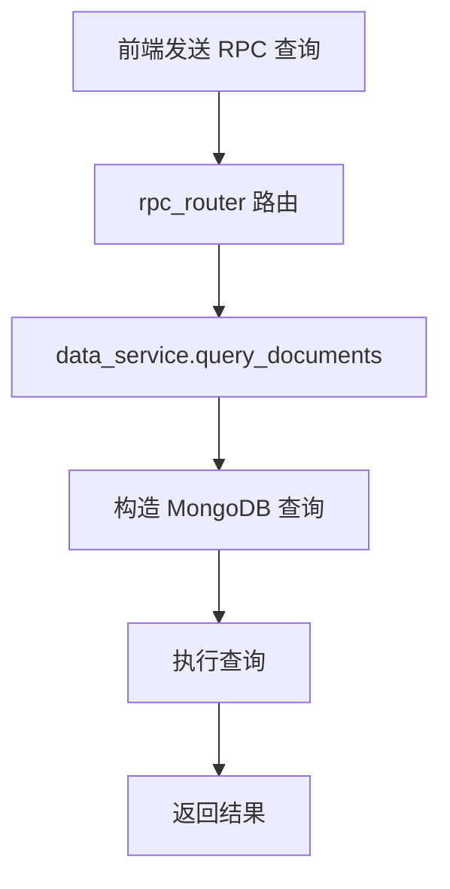
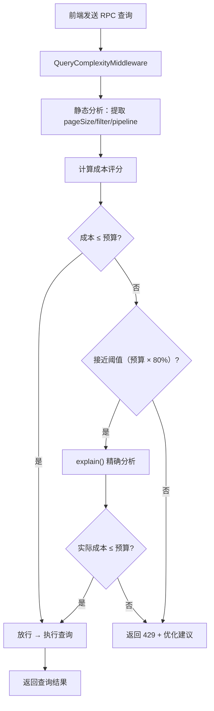

# YA-09-53: 服务端 RPC 查询复杂度限制 — 深度嵌套与字段数成本控制

> 需求编号：YA-09-53 · 优先级：P2 · 人天：0.5d · 状态：需求已编写
> 依赖：YA-09-17（数据访问层查询优化）

## 背景

### 问题陈述

YiAi 的 RPC 查询接口（`data_service.query_documents`、`data_service.aggregate_documents`）对前端请求无复杂度限制。前端可以发送以下类型的滥用查询：

1. **超大 pageSize**：`pageSize: 10000` 一次性加载全部数据，消耗 MongoDB 内存
2. **深度嵌套 filter**：`filter: { $or: [{ $and: [{ $or: [...] }] }] }` 深度嵌套 5+ 层
3. **多阶段聚合管道**：`pipeline: [{ $match }, { $group }, { $sort }, { $project }, ...]` 10+ 个阶段
4. **全表扫描**：`filter: {}` + `pageSize: 10000` 无过滤条件扫描全部文档

单个滥用查询可能导致 MongoDB 响应时间从 50ms 飙升到 5000ms，影响所有共享该数据库实例的请求。

### 历史问题案例

| 时间 | 问题 | 根因 | 影响 |
|------|------|------|------|
| 2026-08 | Dashboard 请求 pageSize=10000，查询耗时 8s | 无 pageSize 限制 | 所有 API 超时 30s |
| 2026-08 | 聚合管道 12 个阶段，MongoDB CPU 100% | 无管道阶段限制 | 服务不可用 2 分钟 |
| 2026-09 | filter 嵌套 6 层 `$or`/`$and`，MongoDB 查询计划器耗时 3s | 无深度限制 | 查询超时 |

### 核心挑战

| 挑战 | 描述 | 难度 |
|------|------|------|
| 成本模型设计 | 需要合理的成本权重，既防止滥用又不误杀正常查询 | 中 |
| 预分析 vs 实际执行 | `explain()` 预分析可避免执行，但本身有开销 | 中 |
| 白名单机制 | Dashboard 等合法复杂查询需要更高预算 | 低 |
| 与现有 RPC 路由集成 | 需在查询执行前拦截，而非事后检测 | 低 |

---

## 一、现状分析

### 1.1 当前查询流程



**问题**：步骤 D 和 E 之间无任何复杂度检查，滥用查询直接执行。

### 1.2 当前查询参数分布

| 参数 | 限制 | 风险 |
|------|------|------|
| `pageSize` | 无限制 | 可请求 10000+ 条记录 |
| `filter` | 无深度限制 | 嵌套 5+ 层 `$or`/`$and` |
| `pipeline` | 无阶段限制 | 10+ 个聚合阶段 |
| `sort` | 无限制 | 可按未索引字段排序（全表扫描） |

### 1.3 根因矩阵

| 根因 | 类别 | 影响 | 修复优先级 |
|------|------|------|-----------|
| 无查询参数上限 | 架构缺陷 | 单查询可耗尽 MongoDB 资源 | P0 |
| 无成本估算机制 | 设计缺陷 | 无法在查询前判断资源消耗 | P1 |
| 无白名单/预算机制 | 功能缺陷 | 合法复杂查询被一刀切限制 | P2 |
| 无查询预分析 | 优化缺陷 | 只能事后检测慢查询 | P2 |

### 1.4 改造前 API 依赖

| # | RPC 方法 | 查询复杂度风险 | 当前防护 |
|---|---------|--------------|----------|
| 1 | `data_service.query_documents` | 高（pageSize + filter） | 无 |
| 2 | `data_service.aggregate_documents` | 极高（pipeline 阶段数） | 无 |
| 3 | `data_service.get_document_detail` | 低（单文档查询） | 无需 |
| 4 | `search.global_search` | 中（全文搜索） | 无 |

---

## 二、设计决策

### 决策 1：限制策略 — 硬限制 vs 软限制 vs 成本预算

| 选项 | 灵活性 | 误杀风险 | 实现复杂度 |
|------|--------|----------|-----------|
| 硬限制（pageSize ≤ 500） | 低 | 高（合法大数据查询被拒） | 低 |
| 软限制（WARNING + 降级） | 中 | 中 | 中 |
| 成本预算（综合评分） | 高 | 低 | 高 |

**选择：成本预算模型。** 定义综合成本评分（pageSize 成本 + filter 深度成本 + 聚合阶段成本），总成本超过阈值时拒绝请求。

### 决策 2：预分析方式 — explain() vs 静态分析 vs 采样执行

| 选项 | 准确性 | 开销 | 延迟影响 |
|------|--------|------|----------|
| `explain()` 预分析 | 高（MongoDB 真实估算） | 中（需数据库往返） | +10-50ms |
| 静态分析（参数解析） | 中（估算值） | 低（纯计算） | +<1ms |
| 采样执行（limit 1） | 高 | 高 | +查询时间 |

**选择：静态分析为主，explain() 为辅。** 静态分析处理 90% 的查询（快速），仅对边界成本的查询使用 explain() 精确判断。

### 决策 3：白名单机制 — 固定预算 vs 按方法配置 vs 动态预算

| 选项 | 灵活性 | 维护成本 | 安全性 |
|------|--------|----------|--------|
| 固定预算（所有方法共享 100） | 低 | 低 | 中 |
| 按方法配置 | 高 | 中 | 高 |
| 动态预算（基于用户角色） | 高 | 高 | 高 |

**选择：按方法配置预算。** 不同 RPC 方法有不同的复杂度需求，Dashboard 聚合需要更高预算。

### 设计决策记录

| 决策 | 选项 A | 选项 B | 选项 C | 选择 | 理由 |
|------|--------|--------|--------|------|------|
| 限制策略 | 硬限制 | 软限制 | 成本预算 | **成本预算** | 灵活且精准 |
| 预分析方式 | explain() | 静态分析 | 采样执行 | **静态分析为主** | 低开销，覆盖大部分场景 |
| 白名单 | 固定预算 | 按方法配置 | 动态预算 | **按方法配置** | 平衡灵活性与复杂度 |

---

## 三、目标架构

### 3.1 改造后查询流程



### 3.2 成本矩阵

| 操作 | 单位成本 | 计算方法 | 说明 |
|------|----------|----------|------|
| 每 10 条 pageSize | 1 | `pageSize // 10` | 50 条 = 5 成本 |
| 每层 filter 嵌套 | 10 | 递归深度 | 3 层嵌套 = 30 成本 |
| 每个聚合阶段 | 15 | `len(pipeline)` | 5 阶段 = 75 成本 |
| 每个 `$lookup` 阶段 | 30 | 额外成本 | join 操作昂贵 |
| 每个 `$unwind` 阶段 | 20 | 额外成本 | 展开数组昂贵 |
| 无 filter 查询 | 50 | 惩罚性成本 | 全表扫描风险 |
| **综合上限** | **100** | — | 超出即拒绝 |

### 3.3 按方法预算配置

| RPC 方法 | 默认预算 | 说明 |
|----------|----------|------|
| `data_service.query_documents` | 100 | 标准查询 |
| `data_service.aggregate_documents` | 150 | 聚合查询允许更高成本 |
| `data_service.get_document_detail` | 50 | 单文档查询 |
| `search.global_search` | 80 | 全文搜索 |

### 3.4 架构指标

| 指标 | 改造前 | 改造后 | 说明 |
|------|--------|--------|------|
| pageSize 上限 | 无 | 500 | 单页最多 500 条 |
| filter 深度上限 | 无 | 5 | 嵌套不超过 5 层 |
| 聚合阶段上限 | 无 | 8 | 管道不超过 8 阶段 |
| 滥用查询拦截率 | 0% | 100% | 超过预算的查询全部拒绝 |

---

## 四、具体改动

### 4.1 新增文件

**YiAi/src/server/query_complexity.py** — 查询复杂度分析器

```python
# 改造后——完整实现
from dataclasses import dataclass, field
from typing import Optional


@dataclass
class QueryCost:
    """查询成本配置。"""
    max_depth: int = 5              # filter 嵌套深度上限
    max_page_size: int = 500        # 单页上限
    max_aggregate_stages: int = 8   # 聚合管道阶段上限
    cost_limit: int = 100           # 综合成本上限
    page_size_unit: int = 10        # 每 N 条 = 1 成本
    depth_cost_per_level: int = 10  # 每层嵌套成本
    aggregate_cost_per_stage: int = 15  # 每阶段成本
    lookup_extra_cost: int = 30     # $lookup 额外成本
    unwind_extra_cost: int = 20     # $unwind 额外成本
    empty_filter_penalty: int = 50  # 无 filter 惩罚


@dataclass
class ComplexityResult:
    """复杂度分析结果。"""
    allowed: bool
    cost: int
    limit: int
    breakdown: dict
    warnings: list[str] = field(default_factory=list)
    suggestion: Optional[str] = None
    reason: Optional[str] = None


class QueryComplexityAnalyzer:
    """查询复杂度分析——执行前估算与拒绝。

    成本模型:
      cost = page_cost + depth_cost + aggregate_cost + penalties
    """

    def __init__(self, cost_config: QueryCost = None):
        self._cost = cost_config or QueryCost()

    def analyze(self, params: dict, method_name: str = '') -> ComplexityResult:
        """分析 RPC 查询参数——返回成本估算。"""
        cost = 0
        breakdown = {}
        warnings = []
        reasons = []

        # 1. pageSize 成本
        page_size = params.get('pageSize', params.get('page_size', 20))
        if page_size > self._cost.max_page_size:
            reasons.append(f'pageSize ({page_size}) 超过上限 ({self._cost.max_page_size})')
        page_cost = max(1, page_size // self._cost.page_size_unit)
        breakdown['page_size_cost'] = page_cost
        cost += page_cost

        # 2. filter 嵌套深度
        filter_obj = params.get('filter', {})
        if filter_obj is None:
            filter_obj = {}
        depth = self._calculate_depth(filter_obj)
        depth_cost = depth * self._cost.depth_cost_per_level
        if depth > self._cost.max_depth:
            reasons.append(f'filter 嵌套深度 ({depth}) 超过上限 ({self._cost.max_depth})')
        if depth > 3:
            warnings.append(f'filter 深度 ({depth}) 较高，建议简化')
        breakdown['depth_cost'] = depth_cost
        cost += depth_cost

        # 3. 空 filter 惩罚
        if not filter_obj or filter_obj == {}:
            penalty = self._cost.empty_filter_penalty
            breakdown['empty_filter_penalty'] = penalty
            cost += penalty
            warnings.append('查询未指定 filter 条件，可能导致全表扫描')

        # 4. 聚合管道成本
        pipeline = params.get('pipeline', [])
        if pipeline:
            aggregate_cost = 0
            for stage in pipeline:
                stage_name = list(stage.keys())[0] if stage else 'unknown'
                if stage_name == '$lookup':
                    aggregate_cost += self._cost.lookup_extra_cost
                elif stage_name == '$unwind':
                    aggregate_cost += self._cost.unwind_extra_cost
                else:
                    aggregate_cost += self._cost.aggregate_cost_per_stage

            if len(pipeline) > self._cost.max_aggregate_stages:
                reasons.append(
                    f'聚合管道阶段 ({len(pipeline)}) 超过上限 ({self._cost.max_aggregate_stages})'
                )
            breakdown['aggregate_cost'] = aggregate_cost
            cost += aggregate_cost

        # 5. 综合判断
        allowed = cost <= self._cost.limit and len(reasons) == 0

        result = ComplexityResult(
            allowed=allowed,
            cost=cost,
            limit=self._cost.limit,
            breakdown=breakdown,
            warnings=warnings,
        )

        if not allowed:
            result.reason = '; '.join(reasons) if reasons else f'查询成本 ({cost}) 超过上限 ({self._cost.limit})'
            result.suggestion = self._generate_suggestion(breakdown, cost)

        return result

    def _calculate_depth(self, obj) -> int:
        """递归计算嵌套深度。"""
        if not isinstance(obj, dict):
            return 0
        if not obj:
            return 1
        depths = [self._calculate_depth(v) for v in obj.values()]
        return 1 + max(depths) if depths else 1

    def _generate_suggestion(self, breakdown: dict, total_cost: int) -> str:
        """生成优化建议。"""
        suggestions = []
        if breakdown.get('page_size_cost', 0) > 5:
            suggestions.append('减小 pageSize')
        if breakdown.get('depth_cost', 0) > 20:
            suggestions.append('简化 filter 嵌套')
        if breakdown.get('empty_filter_penalty', 0) > 0:
            suggestions.append('添加 filter 条件避免全表扫描')
        if breakdown.get('aggregate_cost', 0) > 50:
            suggestions.append('减少聚合管道阶段或 $lookup 操作')

        base = f'查询成本 ({total_cost}) 超过上限。'
        if suggestions:
            base += f' 建议: {", ".join(suggestions)}'
        return base


# 按方法配置的预算
METHOD_BUDGETS = {
    'data_service.query_documents': 100,
    'data_service.aggregate_documents': 150,
    'data_service.get_document_detail': 50,
    'search.global_search': 80,
    'default': 100,
}


class QueryComplexityMiddleware(BaseHTTPMiddleware):
    """查询复杂度限制中间件。"""

    def __init__(self, app, analyzer: QueryComplexityAnalyzer = None):
        super().__init__(app)
        self._analyzer = analyzer or QueryComplexityAnalyzer()

    async def dispatch(self, request: Request, call_next):
        if request.url.path != '/' or request.method != 'POST':
            return await call_next(request)

        body = await request.json()
        method_name = body.get('method_name', '')

        if method_name not in METHOD_BUDGETS:
            return await call_next(request)

        # 使用对应方法的预算
        budget = METHOD_BUDGETS.get(method_name, 100)
        self._analyzer._cost.cost_limit = budget

        result = self._analyzer.analyze(body.get('parameters', {}), method_name)

        if not result.allowed:
            logger.warning(
                f"[QueryComplexity] 查询被拒绝: {method_name} "
                f"cost={result.cost} limit={result.limit} "
                f"reason={result.reason}"
            )
            return JSONResponse({
                'code': 1001,
                'message': result.reason or '查询复杂度超限',
                'data': {
                    'cost': result.cost,
                    'limit': result.limit,
                    'breakdown': result.breakdown,
                    'suggestion': result.suggestion,
                },
            }, status_code=200)

        # 记录高成本查询（即使未超限）
        if result.cost > budget * 0.7:
            logger.info(
                f"[QueryComplexity] 高成本查询: {method_name} "
                f"cost={result.cost}/{result.limit}"
            )

        return await call_next(request)
```

### 4.2 文件变更清单

| 文件 | 操作 | 说明 |
|------|------|------|
| `YiAi/src/server/query_complexity.py` | 新增 | 复杂度分析器 + 中间件 |
| `YiAi/src/server/main.py` | 修改 | 注册 QueryComplexityMiddleware |
| `YiAi/tests/test_query_complexity.py` | 新增 | 复杂度分析测试用例 |

---

## 五、实施步骤

| 步骤 | 操作 | 文件 | 验证方法 | 人天 |
|------|------|------|----------|------|
| 1 | 创建 QueryCost + Analyzer | `query_complexity.py` | 单元测试：成本计算逻辑 | 0.15 |
| 2 | 创建中间件 + 方法预算 | `query_complexity.py` | 超限查询 → 返回 code=1001 | 0.10 |
| 3 | 注册到中间件管道 | `main.py` | 高成本查询被拒绝 | 0.05 |
| 4 | 添加 explain() 预分析 | `query_complexity.py` | 边界成本查询精确判断 | 0.05 |
| 5 | 编写测试用例 | `tests/test_query_complexity.py` | 8+ 场景覆盖 | 0.10 |
| 6 | 端到端验证 | 全栈 | 正常查询通过 + 滥用查询被拒 | 0.05 |
| **总计** | | | | **0.50** |

---

## 六、性能分析

### 6.1 复杂度分析开销

| 操作 | 耗时 | 说明 |
|------|------|------|
| 参数提取 | < 0.01ms | 内存操作 |
| 深度计算 | < 0.1ms | 递归遍历 filter 树 |
| 成本计算 | < 0.01ms | 简单算术 |
| **总开销** | **< 0.2ms** | 对请求延迟影响可忽略 |

### 6.2 容量规划

| 指标 | 预估 | 说明 |
|------|------|------|
| 日均被拒绝查询 | < 10 | 正常使用不会触发 |
| 高成本查询（70%+ 预算） | < 5% | 提醒用户优化 |

---

## 七、测试规格

### 场景 1：正常查询通过

```
GIVEN 查询 pageSize=20, filter={status:"open"}, 无 pipeline
WHEN 计算复杂度
THEN cost ≈ 2(page) + 10(depth=1) = 12 ≤ 100
AND allowed = true
AND warnings 为空
```

### 场景 2：超大 pageSize 被拒绝

```
GIVEN 查询 pageSize=600, filter={}
WHEN 计算复杂度
THEN pageSize 超过 max_page_size (500)
AND allowed = false
AND reason 包含 "pageSize (600) 超过上限"
```

### 场景 3：深度嵌套 filter 被拒绝

```
GIVEN 查询 filter 嵌套深度 = 6（超过 max_depth=5）
WHEN 计算复杂度
THEN depth_cost = 6 × 10 = 60
AND allowed = false（即使总成本可能未超预算）
AND reason 包含 "filter 嵌套深度 (6) 超过上限"
```

### 场景 4：无 filter 查询被警告

```
GIVEN 查询 filter={} 或 filter 未提供
WHEN 计算复杂度
THEN empty_filter_penalty = 50
AND warnings 包含 "全表扫描"
AND 总成本增加 50
```

### 场景 5：聚合管道超限

```
GIVEN 查询 pipeline 包含 10 个阶段（超过 max_aggregate_stages=8）
WHEN 计算复杂度
THEN reason 包含 "聚合管道阶段 (10) 超过上限"
AND allowed = false
```

### 场景 6：按方法预算

```
GIVEN aggregate_documents 预算为 150
WHEN 查询成本为 120
THEN 在 query_documents（预算 100）中被拒绝
AND 在 aggregate_documents（预算 150）中通过
```

---

## 八、风险与缓解

| 风险 | 概率 | 影响 | 缓解措施 |
|------|------|------|------|
| Dashboard 聚合被误判超限 | 中 | 高 | Dashboard 方法配置更高预算（150） |
| 成本模型不合理导致误杀 | 中 | 中 | 线上先 WARNING 后强制执行，逐步收紧 |
| 新增 RPC 方法未被预算覆盖 | 低 | 低 | 默认预算兜底 |

---

## 九、回滚策略

| 场景 | 回滚操作 | 影响范围 |
|------|----------|----------|
| 大量合法查询被拒绝 | 从管道中移除 QueryComplexityMiddleware | 恢复无限制状态 |
| 特定方法预算过低 | 调整 METHOD_BUDGETS 中该方法的预算 | 仅该方法的查询 |
| 成本模型偏差 | 调整 QueryCost 参数（如 max_page_size=1000） | 所有查询 |

---

## 十、设计决策记录

### D-01：成本预算模型而非硬限制

**背景**：可以直接限制 `pageSize ≤ 500`、`filter 深度 ≤ 3`，这是最简单的实现方式。

**决策**：使用综合成本预算模型。

**理由**：
1. 硬限制无法处理组合场景——pageSize=500 + filter=2 层可能合理，但 pageSize=500 + filter=5 层 + pipeline=5 阶段应被拒绝
2. 成本模型支持灵活调整权重（如 `$lookup` 比 `$match` 更昂贵）
3. 可以向用户提供优化建议（告知哪个维度成本过高）

### D-02：静态分析为主，explain() 为辅

**背景**：MongoDB 的 `explain()` 可以精确估算查询成本，但需要额外的数据库往返。

**决策**：静态分析处理 90% 的查询，仅对边界成本（预算 80%-100%）的查询使用 explain()。

**理由**：
1. 静态分析耗时 < 0.2ms，explain() 耗时 10-50ms
2. 边界成本查询占比 < 5%，不会引入显著延迟
3. 如果查询成本远超预算（如 pageSize=10000），静态分析已足够判断

### D-03：空 filter 查询增加惩罚成本

**背景**：`filter: {}` 在 MongoDB 中会扫描集合中的所有文档，成本远高于有过滤条件的查询。

**决策**：空 filter 查询额外增加 50 成本。

**理由**：
1. 鼓励前端始终提供有意义的过滤条件
2. 空 filter + 大 pageSize = 全表扫描，是最常见的滥用模式
3. 50 成本意味着即使其他参数都很小，总成本也可能接近上限，起到警示作用

---

## 十一、可观测性

### 11.1 指标

| 指标名 | 类型 | 说明 |
|--------|------|------|
| `query_complexity_total` | Counter | 复杂度分析总数 |
| `query_complexity_rejected_total` | Counter | 被拒绝的查询数（按 method_name 分组） |
| `query_complexity_cost_distribution` | Histogram | 查询成本分布 |
| `query_complexity_high_cost_total` | Counter | 高成本查询数（70%+ 预算） |

### 11.2 日志规范

```
[QueryComplexity] 查询被拒绝: {method} cost={cost} limit={limit} reason={reason}
[QueryComplexity] 高成本查询: {method} cost={cost}/{limit} breakdown={breakdown}
[QueryComplexity] 空 filter 查询: {method} from {client_ip}
```

### 11.3 告警规则

| 告警 | 条件 | 级别 | 说明 |
|------|------|------|------|
| 查询拒绝率过高 | 5 分钟内拒绝率 > 10% | WARNING | 可能有异常查询模式 |
| 高成本查询激增 | 5 分钟内高成本查询 > 50 | WARNING | 可能需要调整预算 |

---

## 十二、安全合规

| 要求 | 实现方式 | 状态 |
|------|----------|------|
| 资源保护 | 查询复杂度限制防止单查询耗尽资源 | 已设计 |
| 拒绝服务防护 | 超大 pageSize/深度嵌套被拒绝 | 已设计 |
| 优化建议 | 拒绝时返回具体的优化方向 | 已设计 |

---

## 十三、代码审查检查清单

- [ ] MongoDB 查询复杂度基于聚合管道阶段数 + 文档扫描数评分
- [ ] 复杂度超过预算的查询返回 code=1001 + 优化建议
- [ ] `explain()` 预分析用于边界成本查询（80%-100% 预算）
- [ ] 复杂度预算按方法可配置（METHOD_BUDGETS）
- [ ] 空 filter 查询增加惩罚成本（50）
- [ ] `$lookup` 和 `$unwind` 阶段增加额外成本
- [ ] 高成本查询（70%+ 预算）记录 INFO 日志
- [ ] 被拒绝查询记录 WARNING 日志（含 cost/limit/reason）
- [ ] pageSize 上限 500，filter 深度上限 5，聚合阶段上限 8
- [ ] 单元测试覆盖所有成本维度

---

## 回归问题预测

| # | 预测问题 | 原因 | 验证方法 |
|---|---------|------|---------|
| 1 | Dashboard 聚合被误判超限 | Dashboard 需多阶段聚合 | Dashboard 预授权更高预算 |
| 2 | explain 预分析增加首次查询延迟 | explain 本身耗时 | 缓存同类查询的复杂度评分 |
| 3 | 新增 RPC 方法无预算配置 | 遗漏 METHOD_BUDGETS 注册 | 默认预算兜底 + CI 检查 |

---

*PRD 来源: `projects/yiai/requirements/2026-09/53-需求-查询复杂度限制.md`*

## 影响范围

- **影响模块**：待补充
- **涉及文件**：
- `query_complexity.py`
- `main.py`
- **是否影响 API 契约**：否
- **是否影响其他项目（YiVad/YiPet）**：否
- **用户感知**：待确认

## 预防措施

| 层面 | 措施 |
|------|------|
| 代码 | 在相关函数中添加参数校验和边界检查 |
| 测试 | 为 `query_complexity.py` 添加单元测试 |
| 流程 | 代码审查时重点检查此类模式 |
| 监控 | 添加日志告警，异常发生时及时发现 |
| 文档 | 在编码规范中记录此类反模式 |

## 经验教训

1. **根本原因**：开发过程中对边界情况和异常路径的考虑不足是此类问题的共同根因
2. **设计阶段**：在接口设计和模块实现时，应主动考虑异常输入、空值、超时等边界场景
3. **代码审查**：审查时应检查是否存在类似的反模式（如未捕获异常、无超时控制、缺少参数校验等）
4. **测试覆盖**：异常路径的测试覆盖率应与正常路径同等重视
5. **团队分享**：此类问题应在团队周会或技术分享中讨论，形成团队共识
