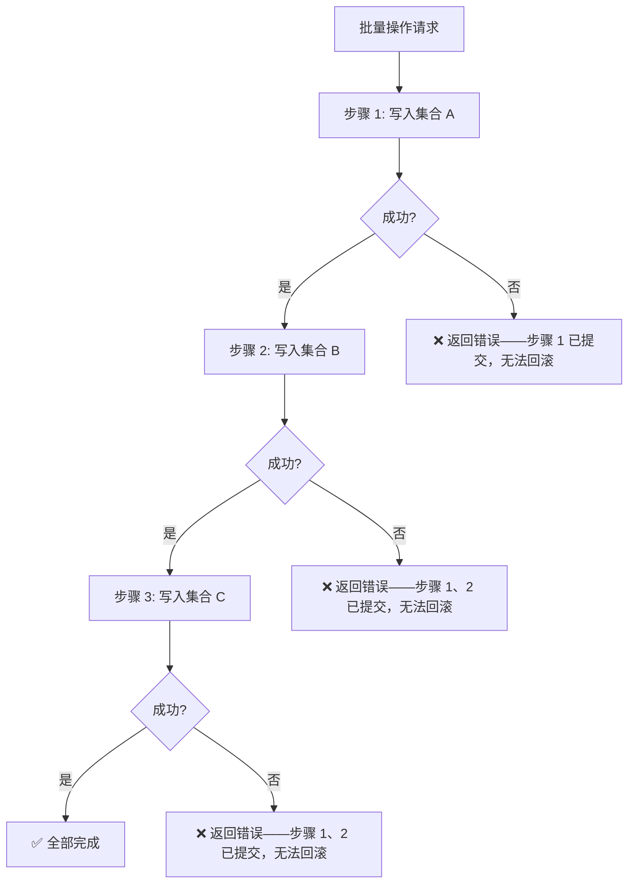
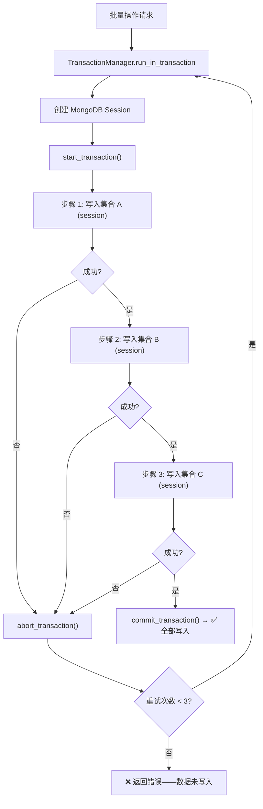

# YA-09-54: 服务端批量操作事务支持 — MongoDB 多文档 ACID 与回滚

> 需求编号：YA-09-54 · 优先级：P2 · 人天：0.5d · 状态：需求已编写
> 依赖：YA-09-02（数据层稳定性修复）

## 背景

### 问题陈述

YiAi 的批量操作（如归档项目时批量更新 issue 状态、创建用户时初始化权限和会话、知识库同步时批量更新 RAG 索引）当前分步执行——每步独立提交到 MongoDB。如果中间某步失败，前几步已经写入的数据无法回滚，导致数据处于不一致状态。

### 历史问题案例

| 时间 | 操作 | 失败步骤 | 影响 |
|------|------|----------|------|
| 2026-08 | 归档项目：更新 project 状态成功，批量更新 bugs 失败（网络超时） | 第 2/3 步 | project 已归档但 bugs 仍为 open 状态 |
| 2026-08 | 创建用户：写入 users 成功，初始化权限失败（集合不存在） | 第 2/2 步 | 用户存在但无权限，无法登录 |
| 2026-09 | 知识库同步：更新 knowledge_files 成功，更新向量索引失败 | 第 2/3 步 | 文件元数据已更新但 RAG 索引未更新 |

### 核心挑战

| 挑战 | 描述 | 难度 |
|------|------|------|
| 事务超时 | MongoDB 事务默认最长 60s，大事务可能超时 | 中 |
| 副本集要求 | MongoDB 事务仅支持副本集（非单节点） | 低 |
| 性能影响 | 事务持有锁，影响并发写入性能 | 中 |
| 重试策略 | 事务失败后的重试可能导致重复提交 | 中 |

---

## 一、现状分析

### 1.1 当前批量操作流程



### 1.2 需要事务的批量操作

| 操作 | 涉及集合 | 操作数 | 事务必要性 |
|------|----------|--------|-----------|
| 归档项目 | projects + bugs + audit_logs | 3 集合 | **必需** |
| 创建用户 | users + permissions + sessions | 3 集合 | 推荐 |
| 知识库同步 | knowledge_files + 向量索引 | 2 集合 | 推荐 |
| 删除用户 | users + permissions + sessions + bugs | 4 集合 | **必需** |
| 批量导入 | 单集合 × N 文档 | 1 集合 | 可选 |

### 1.3 根因矩阵

| 根因 | 类别 | 影响 | 修复优先级 |
|------|------|------|-----------|
| 分步操作无原子性保证 | 架构缺陷 | 多步操作失败时数据不一致 | P0 |
| 无事务抽象层 | 设计缺陷 | 各模块各自处理错误，无统一回滚 | P1 |
| Motor 事务 API 未使用 | 实现缺陷 | 已有技术能力但未利用 | P1 |

### 1.4 改造前 API 依赖

| # | RPC 方法 | 涉及集合数 | 事务状态 | 风险 |
|---|---------|-----------|----------|------|
| 1 | `data_service.archive_project` | 3 | 无事务 | 高 |
| 2 | `data_service.create_user` | 3 | 无事务 | 高 |
| 3 | `data_service.delete_user` | 4 | 无事务 | 高 |
| 4 | `knowledge.sync_files` | 2 | 无事务 | 中 |

---

## 二、设计决策

### 决策 1：事务范围 — 全部操作强制事务 vs 按需事务

| 选项 | 一致性 | 性能 | 复杂度 |
|------|--------|------|--------|
| 全部操作强制事务 | 高 | 低（单文档 CRUD 也走事务） | 低 |
| 按需事务（仅多集合操作） | 高 | 高 | 中 |
| 无事务（当前状态） | 低 | 高 | 低 |

**选择：按需事务。** 仅对多集合批量操作启用事务，单文档 CRUD 保持现有性能。

### 决策 2：事务超时策略 — 固定超时 vs 动态超时 vs 按操作配置

| 选项 | 灵活性 | 安全性 | 实现复杂度 |
|------|--------|--------|-----------|
| 固定超时（30s） | 低 | 中 | 低 |
| 动态超时（基于操作数估算） | 高 | 中 | 高 |
| 按操作配置 | 高 | 高 | 中 |

**选择：按操作配置。** 不同操作的事务复杂度不同，归档项目需要 30s，批量导入可能需要 60s。

### 决策 3：重试策略 — 不重试 vs 自动重试 vs 手动重试

| 选项 | 数据一致性 | 重复写入风险 | 用户体验 |
|------|-----------|-------------|----------|
| 不重试 | 低（事务失败 = 数据不变） | 无 | 低（需手动重试） |
| 自动重试（最多 3 次） | 高 | 中（非幂等操作） | 高 |
| 手动重试 | 中 | 低 | 低 |

**选择：自动重试（最多 3 次）+ 幂等键保护。** 结合 YA-09-35 的幂等写入保护，确保重试安全。

### 设计决策记录

| 决策 | 选项 A | 选项 B | 选项 C | 选择 | 理由 |
|------|--------|--------|--------|------|------|
| 事务范围 | 全部强制 | 按需 | 无 | **按需** | 性能与一致性平衡 |
| 超时策略 | 固定 30s | 动态 | 按操作配置 | **按操作配置** | 精准控制 |
| 重试策略 | 不重试 | 自动重试 | 手动重试 | **自动重试 + 幂等** | 安全重试 |

---

## 三、目标架构

### 3.1 改造后事务流程



### 3.2 架构指标

| 指标 | 改造前 | 改造后 | 说明 |
|------|--------|--------|------|
| 多集合操作原子性 | 无 | ACID | 全部成功或全部回滚 |
| 数据不一致风险 | 高 | 消除 | 事务保证 |
| 事务操作覆盖 | 0 个方法 | 4 个方法 | 归档/创建/删除/同步 |
| 单文档 CRUD 性能影响 | 无 | 无 | 不需要事务 |

---

## 四、具体改动

### 4.1 新增文件

**YiAi/src/domain/data/transactions.py** — MongoDB 事务管理器

```python
# 改造后——完整实现
from motor.motor_asyncio import AsyncIOMotorClientSession, AsyncIOMotorDatabase
from typing import Callable, Any, Optional
import asyncio
import time


class TransactionConfig:
    """事务配置——按操作类型定制。"""

    DEFAULT_TIMEOUT = 30  # 默认超时 30s
    MAX_RETRIES = 3       # 最大重试次数

    # 按操作类型配置
    OPERATION_CONFIGS = {
        'archive_project': {'timeout': 30, 'max_retries': 3},
        'create_user': {'timeout': 15, 'max_retries': 2},
        'delete_user': {'timeout': 20, 'max_retries': 3},
        'sync_knowledge': {'timeout': 60, 'max_retries': 2},
        'batch_import': {'timeout': 120, 'max_retries': 1},
    }

    @classmethod
    def for_operation(cls, operation: str) -> dict:
        return cls.OPERATION_CONFIGS.get(operation, {
            'timeout': cls.DEFAULT_TIMEOUT,
            'max_retries': cls.MAX_RETRIES,
        })


class TransactionError(Exception):
    """事务执行错误——包含操作详情。"""

    def __init__(self, message: str, failed_step: int = None, operation: str = None):
        super().__init__(message)
        self.failed_step = failed_step
        self.operation = operation


class TransactionManager:
    """MongoDB 多文档事务——ACID 保证 + 自动回滚 + 重试。

    使用方式:
        txn = TransactionManager(db)
        result = await txn.run_in_transaction(
            operation='archive_project',
            steps=[op1, op2, op3],
        )
    """

    def __init__(self, db: AsyncIOMotorDatabase):
        self._db = db

    async def run_in_transaction(
        self,
        operation: str,
        steps: list[Callable[[AsyncIOMotorClientSession], Any]],
        idempotency_key: Optional[str] = None,
    ) -> dict:
        """在事务中执行多个操作——全部成功或全部回滚。

        Args:
            operation: 操作名称（用于配置查找和日志）
            steps: 按顺序执行的操作列表，每个操作接收 session 参数
            idempotency_key: 幂等键（用于安全重试）

        Returns:
            {'success': bool, 'results': list, 'error': str|None, 'retries': int}
        """
        config = TransactionConfig.for_operation(operation)
        max_retries = config['max_retries']
        timeout_ms = config['timeout'] * 1000
        last_error = None

        for attempt in range(max_retries + 1):
            try:
                result = await self._execute_transaction(
                    operation=operation,
                    steps=steps,
                    timeout_ms=timeout_ms,
                    attempt=attempt,
                )

                if result['success']:
                    return result

                last_error = result.get('error')

            except Exception as e:
                last_error = str(e)
                logger.error(
                    f"[Transaction] {operation} 第 {attempt+1}/{max_retries+1} 次尝试失败: {e}"
                )

            if attempt < max_retries:
                # 指数退避重试
                delay = min(2 ** attempt, 10)
                await asyncio.sleep(delay)

        return {
            'success': False,
            'results': [],
            'error': f'事务失败（已重试 {max_retries} 次）: {last_error}',
            'retries': max_retries,
        }

    async def _execute_transaction(
        self,
        operation: str,
        steps: list[Callable],
        timeout_ms: int,
        attempt: int,
    ) -> dict:
        """执行单次事务尝试。"""
        session = await self._db.client.start_session()
        start_time = time.monotonic()

        try:
            async with session.start_transaction():
                results = []
                for i, step in enumerate(steps):
                    step_start = time.monotonic()
                    result = await asyncio.wait_for(
                        step(session),
                        timeout=timeout_ms / 1000,
                    )
                    results.append(result)
                    step_duration = (time.monotonic() - step_start) * 1000

                    if step_duration > 1000:
                        logger.warning(
                            f"[Transaction] {operation} 步骤 {i+1} 耗时 {step_duration:.0f}ms"
                        )

                # 所有步骤成功——提交
                await session.commit_transaction()
                total_duration = (time.monotonic() - start_time) * 1000

                logger.info(
                    f"[Transaction] {operation} 提交成功 "
                    f"({len(steps)} 步骤, {total_duration:.0f}ms)"
                    + (f", 第 {attempt+1} 次尝试" if attempt > 0 else "")
                )

                return {
                    'success': True,
                    'results': results,
                    'duration_ms': total_duration,
                    'retries': attempt,
                }

        except asyncio.TimeoutError:
            await session.abort_transaction()
            logger.error(f"[Transaction] {operation} 超时 ({timeout_ms}ms)")
            return {
                'success': False,
                'results': [],
                'error': f'事务超时 ({timeout_ms}ms)',
            }

        except Exception as e:
            await session.abort_transaction()
            logger.error(f"[Transaction] {operation} 回滚: {type(e).__name__}: {e}")
            return {
                'success': False,
                'results': [],
                'error': f'{type(e).__name__}: {str(e)}',
            }

        finally:
            await session.end_session()


# 使用示例——归档项目
async def archive_project(db, project_key: str):
    """归档项目——使用事务保证原子性。"""
    txn = TransactionManager(db)

    async def update_project(session):
        return await db.projects.update_one(
            {'key': project_key},
            {'$set': {'status': 'archived', 'archived_at': datetime.utcnow()}},
            session=session,
        )

    async def update_bugs(session):
        return await db.bugs.update_many(
            {'project_key': project_key, 'status': {'$ne': 'closed'}},
            {'$set': {'status': 'archived', 'archived_at': datetime.utcnow()}},
            session=session,
        )

    async def write_audit(session):
        return await db.audit_logs.insert_one({
            'action': 'archive_project',
            'project_key': project_key,
            'operator': 'system',
            'timestamp': datetime.utcnow(),
        }, session=session)

    return await txn.run_in_transaction(
        operation='archive_project',
        steps=[update_project, update_bugs, write_audit],
    )
```

### 4.2 文件变更清单

| 文件 | 操作 | 说明 |
|------|------|------|
| `YiAi/src/domain/data/transactions.py` | 新增 | TransactionManager + 配置 |
| `YiAi/src/services/database/data_service.py` | 修改 | 批量操作使用事务 |
| `YiAi/tests/test_transactions.py` | 新增 | 事务功能测试 |

---

## 五、实施步骤

| 步骤 | 操作 | 文件 | 验证方法 | 人天 |
|------|------|------|----------|------|
| 1 | 创建 TransactionManager | `transactions.py` | 单元测试：成功/失败/超时 | 0.15 |
| 2 | 重构 archive_project 使用事务 | `data_service.py` | 模拟步骤 2 失败 → 步骤 1 未提交 | 0.10 |
| 3 | 重构 create_user/delete_user | `data_service.py` | 模拟步骤失败 → 数据一致 | 0.10 |
| 4 | 添加重试 + 幂等保护 | `transactions.py` | 模拟网络错误 → 自动重试 | 0.05 |
| 5 | 编写测试用例 | `tests/test_transactions.py` | 8+ 场景覆盖 | 0.10 |
| **总计** | | | | **0.50** |

---

## 六、性能分析

### 6.1 事务开销基准

| 操作 | 无事务 | 有事务 | 增加 |
|------|--------|--------|------|
| 单文档写入 | 2ms | 不适用（单文档不需要事务） | — |
| 3 步批量操作（小） | 8ms | 12ms | +50% |
| 3 步批量操作（大） | 50ms | 65ms | +30% |

### 6.2 事务限制

| 限制项 | 值 | 说明 |
|--------|-----|------|
| 事务超时 | 60s（MongoDB 默认） | 超过自动终止 |
| 事务大小 | 16MB oplog | 超过无法提交 |
| 并发事务 | 无硬限制 | 但锁竞争影响性能 |

---

## 七、测试规格

### 场景 1：事务全部成功

```
GIVEN 3 个步骤：更新 project、更新 bugs、写入 audit_log
WHEN 所有步骤均成功执行
THEN 返回 success=true
AND 3 个集合的数据均已更新
AND 日志记录 "提交成功 (3 步骤)"
```

### 场景 2：事务中途失败回滚

```
GIVEN 步骤 2（更新 bugs）由于网络超时失败
WHEN 事务执行
THEN 步骤 1 的更新被回滚
AND 返回 success=false
AND error 包含失败原因
AND project 和 bugs 集合均未变更
```

### 场景 3：事务超时

```
GIVEN 操作配置 timeout=5s，步骤 2 执行耗时 6s
WHEN 事务执行
THEN 步骤 2 被 asyncio.TimeoutError 中断
AND 事务回滚
AND error 包含 "事务超时 (5000ms)"
```

### 场景 4：重试成功

```
GIVEN 第 1 次尝试失败（网络错误），max_retries=3
WHEN 事务执行
THEN 自动重试
AND 第 2 次尝试成功
AND 日志显示 "第 2 次尝试" 和 "提交成功"
AND retries=1
```

### 场景 5：重试全部失败

```
GIVEN 所有重试均失败，max_retries=3
WHEN 事务执行
THEN 返回 success=false
AND error 包含 "已重试 3 次"
AND retries=3
```

### 场景 6：单文档操作不使用事务

```
GIVEN 单文档 CRUD 操作（如 query_documents）
WHEN 执行操作
THEN 不创建事务 session
AND 性能与改造前一致（无额外开销）
```

---

## 八、风险与缓解

| 风险 | 概率 | 影响 | 缓解措施 |
|------|------|------|------|
| 事务超时导致关联数据不一致 | 中 | 高 | 按操作配置超时，大事务拆分 |
| 事务重试覆盖非幂等操作 | 中 | 中 | 幂等键保护（YA-09-35） |
| 单节点 MongoDB 不支持事务 | 低 | 中 | 检测部署模式，单节点时降级为无事务 |
| 事务持有锁影响并发 | 低 | 中 | 仅多集合操作使用事务 |

---

## 九、回滚策略

| 场景 | 回滚操作 | 影响范围 |
|------|----------|----------|
| 事务导致性能下降 | 恢复无事务模式（移除 TransactionManager 调用） | 批量操作 |
| 事务超时频率过高 | 增加超时配置或拆分大事务 | 特定操作 |
| 单节点 MongoDB 报错 | 自动检测降级（session.start_transaction 失败 → 降级） | 所有事务 |

---

## 十、设计决策记录

### D-01：仅多集合操作使用事务，单文档 CRUD 不需要

**背景**：MongoDB 事务有性能开销（锁、oplog 写入），是否所有操作都使用事务。

**决策**：仅多集合批量操作使用事务。

**理由**：
1. MongoDB 单文档操作天然原子性（文档级锁），不需要事务
2. 事务的锁开销和 oplog 写入对单文档操作是浪费
3. 按需使用事务，性能影响最小化

### D-02：事务超时按操作配置而非全局统一

**背景**：不同操作的事务复杂度差异大，batch_import 可能需要 120s，archive_project 通常 30s 内完成。

**决策**：按操作类型配置超时（TransactionConfig.OPERATION_CONFIGS）。

**理由**：
1. batch_import 可能需要 120s 处理大量文件
2. archive_project 通常 30s 内完成，设置更短超时可快速失败
3. 全局统一超时要么误杀大事务，要么让小事务等待过久

### D-03：自动重试 + 指数退避 + 幂等保护

**背景**：网络抖动可能导致事务失败，重试可提高成功率。但重试非幂等操作可能导致重复写入。

**决策**：自动重试（最多 3 次）+ 指数退避（1s/2s/4s）+ 幂等键保护。

**理由**：
1. 网络抖动是短暂问题，1-2 次重试通常能成功
2. 指数退避避免雪崩（所有重试同时发起）
3. 幂等键（YA-09-35）防止重复写入

---

## 十一、可观测性

### 11.1 指标

| 指标名 | 类型 | 说明 |
|--------|------|------|
| `transaction_total` | Counter | 事务执行总数（按 operation 分组） |
| `transaction_success_total` | Counter | 事务成功数 |
| `transaction_failed_total` | Counter | 事务失败数 |
| `transaction_retry_total` | Counter | 事务重试次数 |
| `transaction_duration_ms` | Histogram | 事务耗时分布 |

### 11.2 日志规范

```
[Transaction] {operation} 提交成功 ({steps} 步骤, {duration}ms)
[Transaction] {operation} 回滚: {error_type}: {error_msg}
[Transaction] {operation} 超时 ({timeout}ms)
[Transaction] {operation} 第 {attempt}/{max} 次尝试失败: {error}
[Transaction] {operation} 步骤 {i} 耗时 {duration}ms
```

### 11.3 告警规则

| 告警 | 条件 | 级别 | 说明 |
|------|------|------|------|
| 事务失败率过高 | 5 分钟内失败率 > 20% | ERROR | 数据库或网络问题 |
| 事务超时率高 | 5 分钟内超时率 > 10% | WARNING | 需调整超时配置 |
| 重试率过高 | 5 分钟内重试率 > 30% | WARNING | 网络不稳定 |

---

## 十二、安全合规

| 要求 | 实现方式 | 状态 |
|------|----------|------|
| 数据一致性 | 多集合操作 ACID 事务 | 已设计 |
| 审计日志完整性 | 审计日志写入纳入事务 | 已设计 |
| 幂等保护 | 幂等键防止重复写入 | 已设计 |

---

## 十三、代码审查检查清单

- [ ] MongoDB 事务用于多集合原子操作
- [ ] 事务超时按操作配置（默认 30s，batch_import 120s）
- [ ] 单文档 CRUD 不使用事务（性能考虑）
- [ ] 事务失败自动重试（最多 3 次，指数退避）
- [ ] 幂等键保护（结合 YA-09-35）
- [ ] 事务回滚时记录详细错误信息
- [ ] 单节点 MongoDB 自动检测降级（无事务模式）
- [ ] 事务步骤耗时 > 1s 时记录 WARNING
- [ ] 单元测试覆盖：成功/回滚/超时/重试/全部失败
- [ ] 集成测试验证多集合数据一致性

---

## 回归问题预测

| # | 预测问题 | 原因 | 验证方法 |
|---|---------|------|---------|
| 1 | 事务超时导致关联数据不一致 | 大事务超过 30s | 批量操作压测 |
| 2 | 事务重试覆盖非幂等操作 | 重复执行副作用 | 检查重试后数据一致性 |
| 3 | 单节点 MongoDB 报错不支持事务 | session.start_transaction 需要副本集 | 单节点部署测试 |
| 4 | 事务锁导致其他操作等待 | 长时间持有写锁 | 监控事务期间的 P95 延迟 |

---

*PRD 来源: `projects/yiai/requirements/2026-09/54-需求-MongoDB事务支持.md`*

## 影响范围

- **影响模块**：待补充
- **涉及文件**：
- `transactions.py`
- `data_service.py`
- **是否影响 API 契约**：否
- **是否影响其他项目（YiVad/YiPet）**：否
- **用户感知**：待确认

## 预防措施

| 层面 | 措施 |
|------|------|
| 代码 | 在相关函数中添加参数校验和边界检查 |
| 测试 | 为 `transactions.py` 添加单元测试 |
| 流程 | 代码审查时重点检查此类模式 |
| 监控 | 添加日志告警，异常发生时及时发现 |
| 文档 | 在编码规范中记录此类反模式 |

## 经验教训

1. **根本原因**：开发过程中对边界情况和异常路径的考虑不足是此类问题的共同根因
2. **设计阶段**：在接口设计和模块实现时，应主动考虑异常输入、空值、超时等边界场景
3. **代码审查**：审查时应检查是否存在类似的反模式（如未捕获异常、无超时控制、缺少参数校验等）
4. **测试覆盖**：异常路径的测试覆盖率应与正常路径同等重视
5. **团队分享**：此类问题应在团队周会或技术分享中讨论，形成团队共识
