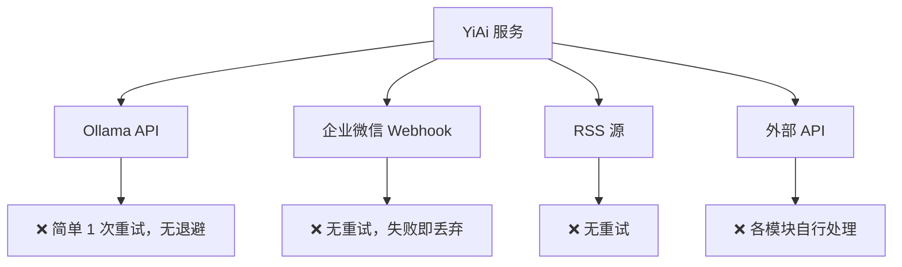
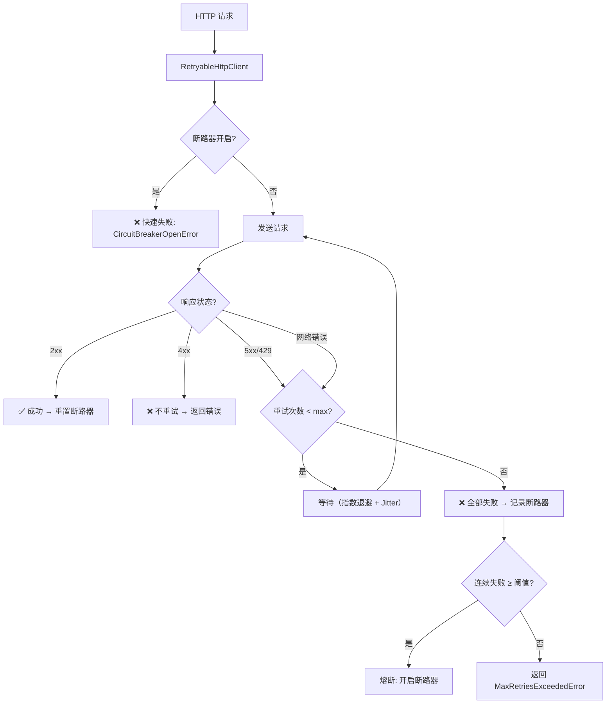
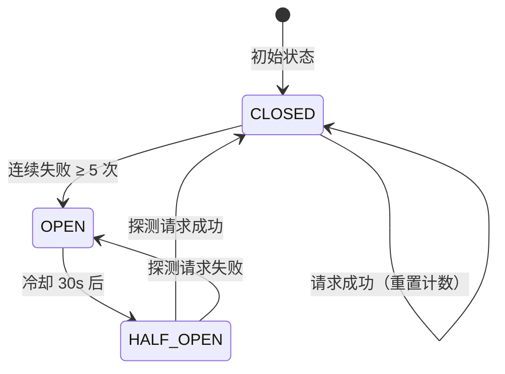

# YA-09-55: 服务端 HTTP 客户端重试策略 — 指数退避与断路器集成

> 需求编号：YA-09-55 · 优先级：P2 · 人天：0.5d · 状态：需求已编写

## 背景

### 问题陈述

YiAi 作为后端服务，需要调用多个外部 HTTP 服务：

| 外部服务 | 用途 | 调用频率 | 可用性要求 |
|----------|------|----------|-----------|
| Ollama API (`:11434`) | LLM 推理 | 高（每次聊天） | 核心依赖 |
| 企业微信 Webhook | 消息推送 | 中（通知触发） | 非核心 |
| RSS 源 | 文章抓取 | 低（定时任务） | 非核心 |
| 外部 RAG 数据源 | 知识检索 | 中 | 重要 |

当前各模块对外部 HTTP 调用的重试策略各自为政，甚至完全缺失：

- **Ollama 调用**：`chat_service.py` 中有简单的 1 次重试，无退避
- **企业微信 Webhook**：`wechat_service.py` 无重试，失败即丢弃
- **RSS 抓取**：`rss_service.py` 无重试，单次超时即失败
- **外部 API**：各模块直接使用 `httpx` 或 `requests`，无统一错误处理

### 历史问题案例

| 时间 | 服务 | 问题 | 根因 | 影响 |
|------|------|------|------|------|
| 2026-08 | Ollama | 模型加载中返回 503，1 次重试后仍失败 | 无退避，重试间隔太短 | 聊天功能不可用 2 分钟 |
| 2026-08 | 企业微信 | Webhook 偶发 502，消息丢失 | 无重试机制 | 用户未收到通知 |
| 2026-09 | RSS | 源站 503 维护，抓取失败 | 无重试 | 当日新闻缺失 |
| 2026-09 | Ollama | 连续 10 次请求超时，每次等待 30s | 无断路器 | 大量请求堆积，内存飙升至 2GB |

### 核心挑战

| 挑战 | 描述 | 难度 |
|------|------|------|
| 重试策略统一 | 不同服务需要不同的重试参数（次数/间隔/退避） | 中 |
| 断路器设计 | 连续失败后快速失败，避免雪崩 | 中 |
| Jitter 引入 | 防止多个客户端同时重试（雷群效应） | 低 |
| 幂等安全 | 重试非幂等操作可能导致重复提交 | 中 |

---

## 一、现状分析

### 1.1 当前 HTTP 调用分布



### 1.2 当前重试代码示例

```python
# YiAi/src/services/ai/chat_service.py（当前方式——简单重试）
async def _call_ollama(prompt: str) -> str:
    for attempt in range(2):  # 只重试 1 次
        try:
            async with httpx.AsyncClient() as client:
                resp = await client.post(OLLAMA_URL, json={...}, timeout=30)
                return resp.json()
        except Exception as e:
            if attempt == 0:
                await asyncio.sleep(1)  # 固定 1s 等待
            else:
                raise  # 第二次失败直接抛异常
```

### 1.3 根因矩阵

| 根因 | 类别 | 影响 | 修复优先级 |
|------|------|------|------|
| 无统一 HTTP 客户端 | 架构缺陷 | 各模块重试逻辑不一致 | P0 |
| 无断路器保护 | 设计缺陷 | 下游故障时请求堆积 | P0 |
| 无指数退避 + Jitter | 设计缺陷 | 重试风暴风险 | P1 |
| 无幂等保护 | 功能缺陷 | 非幂等请求被重试 | P2 |

### 1.4 改造前 API 依赖

| # | 外部服务 | 重试次数 | 退避策略 | 断路器 | 幂等保护 |
|---|---------|----------|----------|--------|----------|
| 1 | Ollama API | 1 | 固定 1s | 无 | 无 |
| 2 | 企业微信 Webhook | 0 | 无 | 无 | 无 |
| 3 | RSS 源 | 0 | 无 | 无 | 无 |
| 4 | 外部 API | 0（各模块自行） | 无 | 无 | 无 |

---

## 二、设计决策

### 决策 1：重试策略 — 固定间隔 vs 指数退避 vs 指数退避 + Jitter

| 选项 | 雷群效应风险 | 恢复速度 | 实现复杂度 |
|------|-------------|----------|-----------|
| 固定间隔（1s/1s/1s） | 高（所有请求同时重试） | 快 | 低 |
| 指数退避（1s/2s/4s） | 中（同批次请求同步） | 中 | 低 |
| 指数退避 + Jitter（1s/2.3s/4.1s） | 低（随机分散） | 中 | 中 |

**选择：指数退避 + Jitter。** 在指数退避基础上增加随机抖动（+/- 25%），避免雷群效应。

### 决策 2：断路器模式 — 简单计数 vs 滑动窗口 vs 半开探测

| 选项 | 恢复速度 | 误判风险 | 实现复杂度 |
|------|----------|----------|-----------|
| 简单计数（连续 N 次失败 → 熔断） | 中（需等待冷却） | 低 | 低 |
| 滑动窗口（时间窗口内失败率） | 快 | 中 | 中 |
| 半开探测（冷却后发送探测请求） | 快 | 低 | 中 |

**选择：简单计数 + 半开探测。** 连续 5 次失败触发熔断，30s 冷却后发送探测请求（半开状态），成功则恢复。

### 决策 3：重试条件 — 所有错误 vs 仅 5xx vs 可配置

| 选项 | 覆盖面 | 安全性 | 复杂度 |
|------|--------|--------|--------|
| 所有错误 | 高 | 低（4xx 也重试无意义） | 低 |
| 仅 5xx + 网络错误 | 中 | 高 | 中 |
| 可配置（默认 5xx/429/网络错误） | 高 | 高 | 中 |

**选择：可配置，默认仅 5xx/429/网络错误。** 4xx 错误（如 400/401/404）表示客户端错误，重试无意义。

### 设计决策记录

| 决策 | 选项 A | 选项 B | 选项 C | 选择 | 理由 |
|------|--------|--------|--------|------|------|
| 退避策略 | 固定间隔 | 指数退避 | 指数 + Jitter | **指数 + Jitter** | 防雷群效应 |
| 断路器 | 简单计数 | 滑动窗口 | 半开探测 | **计数 + 半开** | 简单且有效 |
| 重试条件 | 所有错误 | 仅 5xx | 可配置 | **可配置** | 灵活适配 |

---

## 三、目标架构

### 3.1 改造后 HTTP 调用流程



### 3.2 断路器状态机



### 3.3 架构指标

| 指标 | 改造前 | 改造后 | 说明 |
|------|--------|--------|------|
| 重试策略统一性 | 各模块独立 | 统一 RetryableHttpClient | 消除不一致 |
| 断路器保护 | 无 | 5 次失败 → 30s 熔断 | 防止雪崩 |
| 雷群效应防护 | 无 | Jitter +/- 25% | 分散重试 |
| 幂等保护 | 无 | X-Idempotency-Key | 安全重试 |

---

## 四、具体改动

### 4.1 新增文件

**YiAi/src/shared/retry_client.py** — 统一重试 HTTP 客户端

```python
# 改造后——完整实现
import httpx, asyncio, time, random
from dataclasses import dataclass, field
from enum import Enum
from typing import Optional, Any


class CircuitState(Enum):
    CLOSED = 'closed'       # 正常——请求通过
    OPEN = 'open'           # 熔断——快速失败
    HALF_OPEN = 'half_open' # 半开——探测恢复


@dataclass
class RetryConfig:
    """重试配置——可针对不同服务定制。"""
    max_retries: int = 3
    base_delay: float = 1.0
    max_delay: float = 30.0
    backoff_multiplier: float = 2.0
    jitter_factor: float = 0.25         # 25% 随机抖动
    retryable_statuses: set[int] = field(default_factory=lambda: {429, 500, 502, 503, 504})
    circuit_breaker_threshold: int = 5   # 连续失败 5 次 → 熔断
    circuit_breaker_timeout: float = 30.0  # 30s 后尝试恢复
    total_timeout: float = 60.0          # 总超时（含所有重试）


class CircuitBreakerOpenError(Exception):
    """断路器开启——请求被快速拒绝。"""
    pass


class MaxRetriesExceededError(Exception):
    """重试耗尽——所有重试均失败。"""
    pass


class RetryableHttpClient:
    """带指数退避重试 + 断路器保护的 HTTP 客户端。

    使用方式:
        client = RetryableHttpClient(RetryConfig())
        resp = await client.request('POST', 'http://ollama:11434/api/generate', json={...})
    """

    # 预定义配置
    DEFAULT = RetryConfig()
    OLLAMA = RetryConfig(
        max_retries=3, base_delay=1.0, max_delay=10.0,
        circuit_breaker_threshold=5, circuit_breaker_timeout=30.0,
        total_timeout=120.0,
    )
    WEBHOOK = RetryConfig(
        max_retries=2, base_delay=2.0, max_delay=10.0,
        circuit_breaker_threshold=3, circuit_breaker_timeout=60.0,
        total_timeout=30.0,
    )
    RSS = RetryConfig(
        max_retries=1, base_delay=5.0, max_delay=30.0,
        circuit_breaker_threshold=3, circuit_breaker_timeout=300.0,
        total_timeout=60.0,
    )

    def __init__(self, config: RetryConfig = None):
        self._config = config or RetryConfig()
        self._client = httpx.AsyncClient(
            timeout=httpx.Timeout(30.0, connect=5.0),
        )
        self._circuit_state: dict[str, CircuitState] = {}
        self._failure_counts: dict[str, int] = {}
        self._circuit_open_until: dict[str, float] = {}

    async def request(self, method: str, url: str,
                      idempotency_key: Optional[str] = None,
                      **kwargs) -> httpx.Response:
        """发送带重试的 HTTP 请求。

        Args:
            method: HTTP 方法
            url: 请求 URL
            idempotency_key: 幂等键（用于安全重试）
            **kwargs: 传递给 httpx 的额外参数
        """
        host = self._extract_host(url)

        # 断路器检查
        if self._is_circuit_open(host):
            raise CircuitBreakerOpenError(
                f"断路器开启: {host}（冷却中，{self._circuit_open_until[host] - time.monotonic():.0f}s 后恢复）"
            )

        # 添加幂等键 Header
        if idempotency_key:
            headers = kwargs.get('headers', {})
            headers['X-Idempotency-Key'] = idempotency_key
            kwargs['headers'] = headers

        last_error = None
        total_start = time.monotonic()

        for attempt in range(self._config.max_retries + 1):
            # 检查总超时
            if time.monotonic() - total_start > self._config.total_timeout:
                raise MaxRetriesExceededError(
                    f"总超时 ({self._config.total_timeout}s)，已重试 {attempt} 次"
                )

            try:
                resp = await self._client.request(method, url, **kwargs)

                if resp.status_code < 500:
                    # 成功 → 重置断路器
                    self._on_success(host)
                    return resp

                if resp.status_code in self._config.retryable_statuses:
                    raise RetryableError(
                        f"HTTP {resp.status_code}",
                        status_code=resp.status_code,
                    )

                # 非重试状态码（如 4xx）→ 直接返回
                return resp

            except (RetryableError, httpx.TimeoutException,
                    httpx.ConnectError, httpx.RemoteProtocolError) as e:
                last_error = e

                if attempt < self._config.max_retries:
                    delay = self._calculate_delay(attempt)
                    logger.warning(
                        f"[Retry] {method} {host} 第 {attempt+1}/{self._config.max_retries} 次重试, "
                        f"等待 {delay:.1f}s (error: {e})"
                    )
                    await asyncio.sleep(delay)

        # 全部重试失败 → 记录断路器
        self._on_failure(host)
        raise MaxRetriesExceededError(
            f"重试 {self._config.max_retries} 次后仍失败: {last_error}"
        )

    def _calculate_delay(self, attempt: int) -> float:
        """计算退避延迟——指数退避 + Jitter。"""
        base = self._config.base_delay * (self._config.backoff_multiplier ** attempt)
        delay = min(base, self._config.max_delay)

        # 添加 Jitter: +/- 25%
        jitter = delay * self._config.jitter_factor * (2 * random.random() - 1)
        return delay + jitter

    def _extract_host(self, url: str) -> str:
        """从 URL 提取主机标识（用于断路器分组）。"""
        from urllib.parse import urlparse
        parsed = urlparse(url)
        return f"{parsed.hostname}:{parsed.port or 80}"

    def _is_circuit_open(self, host: str) -> bool:
        """检查断路器状态。"""
        state = self._circuit_state.get(host, CircuitState.CLOSED)

        if state == CircuitState.OPEN:
            if time.monotonic() >= self._circuit_open_until.get(host, 0):
                # 冷却结束 → 半开探测
                self._circuit_state[host] = CircuitState.HALF_OPEN
                logger.info(f"[Retry] 断路器半开: {host}（探测恢复中）")
                return False
            return True

        return False

    def _on_success(self, host: str):
        """请求成功——重置断路器。"""
        self._failure_counts[host] = 0
        if self._circuit_state.get(host) == CircuitState.HALF_OPEN:
            logger.info(f"[Retry] 断路器恢复: {host}（探测成功）")
        self._circuit_state[host] = CircuitState.CLOSED

    def _on_failure(self, host: str):
        """请求失败——记录断路器。"""
        self._failure_counts[host] = self._failure_counts.get(host, 0) + 1
        count = self._failure_counts[host]

        if count >= self._config.circuit_breaker_threshold:
            self._circuit_state[host] = CircuitState.OPEN
            self._circuit_open_until[host] = time.monotonic() + self._config.circuit_breaker_timeout
            logger.error(
                f"[Retry] 断路器开启: {host} "
                f"（连续 {count} 次失败，冷却 {self._config.circuit_breaker_timeout}s）"
            )

    async def close(self):
        """关闭 HTTP 客户端。"""
        await self._client.aclose()

    def get_circuit_status(self) -> dict:
        """获取所有断路器的状态（用于 /health/debug）。"""
        return {
            host: {
                'state': state.value,
                'failures': self._failure_counts.get(host, 0),
                'open_until': self._circuit_open_until.get(host),
            }
            for host, state in self._circuit_state.items()
        }


class RetryableError(Exception):
    """可重试错误——携带 HTTP 状态码。"""
    def __init__(self, message: str, status_code: int = None):
        super().__init__(message)
        self.status_code = status_code
```

### 4.2 文件变更清单

| 文件 | 操作 | 说明 |
|------|------|------|
| `YiAi/src/shared/retry_client.py` | 新增 | RetryableHttpClient + 断路器 |
| `YiAi/src/services/ai/chat_service.py` | 修改 | 使用 RetryableHttpClient.OLLAMA |
| `YiAi/src/services/notification/wechat_service.py` | 修改 | 使用 RetryableHttpClient.WEBHOOK |
| `YiAi/src/services/rss/rss_service.py` | 修改 | 使用 RetryableHttpClient.RSS |
| `YiAi/tests/test_retry_client.py` | 新增 | 重试 + 断路器测试 |

---

## 五、实施步骤

| 步骤 | 操作 | 文件 | 验证方法 | 人天 |
|------|------|------|----------|------|
| 1 | 创建 RetryableHttpClient + 断路器 | `retry_client.py` | 单元测试：重试/断路器 | 0.15 |
| 2 | 重构 Ollama 调用 | `chat_service.py` | 模拟 503 → 自动重试成功 | 0.10 |
| 3 | 重构企业微信/RSS/外部 API | 各 Service 文件 | 模拟网络错误 → 重试 | 0.10 |
| 4 | 添加断路器状态查询 | `retry_client.py` | `/health/debug` 查看断路器状态 | 0.05 |
| 5 | 编写测试用例 | `tests/test_retry_client.py` | 10+ 场景覆盖 | 0.10 |
| **总计** | | | | **0.50** |

---

## 六、性能分析

### 6.1 重试延迟基准

| 重试次数 | 无 Jitter 延迟 | 有 Jitter 延迟 | 说明 |
|----------|---------------|---------------|------|
| 第 1 次 | 1.0s | 0.75-1.25s | Jitter +/- 25% |
| 第 2 次 | 2.0s | 1.5-2.5s | |
| 第 3 次 | 4.0s | 3.0-5.0s | |
| 总重试时间 | 7.0s | 5.25-8.75s | |

### 6.2 断路器效果

| 指标 | 无断路器 | 有断路器 | 改善 |
|------|----------|----------|------|
| 下游故障时请求堆积 | 持续堆积 | 快速失败 | 消除堆积 |
| 下游恢复后请求恢复 | 立即 | 30s 冷却后 | 安全恢复 |
| 故障检测延迟 | 每次请求等待 30s | 立即（快速失败） | 30x |

---

## 七、测试规格

### 场景 1：正常请求无重试

```
GIVEN Ollama API 返回 200
WHEN 发送请求
THEN 不触发重试
AND 断路器状态保持 CLOSED
AND 日志无重试记录
```

### 场景 2：503 重试成功

```
GIVEN Ollama 第 1 次返回 503，第 2 次返回 200
WHEN 发送请求
THEN 自动重试 1 次后成功
AND 日志记录 "第 1/3 次重试, 等待 x.xs"
AND 断路器状态保持 CLOSED
```

### 场景 3：全部重试失败

```
GIVEN Ollama 连续 4 次（1 次原始 + 3 次重试）返回 503
WHEN 发送请求
THEN 抛出 MaxRetriesExceededError
AND 断路器失败计数 +1
```

### 场景 4：断路器熔断

```
GIVEN 连续 5 次请求全部失败
WHEN 第 6 次请求到达
THEN 抛出 CircuitBreakerOpenError
AND 不发送实际 HTTP 请求（快速失败）
AND 日志记录 "断路器开启: {host}"
```

### 场景 5：断路器半开恢复

```
GIVEN 断路器处于 OPEN 状态，冷却时间已过
WHEN 发送探测请求
THEN 断路器转为 HALF_OPEN
AND 发送实际 HTTP 请求
AND 如果成功 → 断路器转为 CLOSED
AND 如果失败 → 断路器重新转为 OPEN
```

### 场景 6：指数退避 + Jitter

```
GIVEN 请求需要重试 3 次
WHEN 计算每次重试延迟
THEN 延迟呈指数增长（1s/2s/4s）
AND 每次延迟有 +/- 25% 随机抖动
AND 两次连续请求的延迟不完全相同
```

### 场景 7：4xx 错误不重试

```
GIVEN 返回 401 Unauthorized
WHEN 发送请求
THEN 不触发重试
AND 直接返回 401 响应
```

### 场景 8：幂等键传递

```
GIVEN 提供了 idempotency_key="abc123"
WHEN 发送请求
THEN 请求头包含 X-Idempotency-Key: abc123
AND 重试时也携带相同的幂等键
```

---

## 八、风险与缓解

| 风险 | 概率 | 影响 | 缓解措施 |
|------|------|------|------|
| 重试风暴——所有客户端同时重试 | 中 | 高 | Jitter 随机分散重试时间 |
| 非幂等操作被重试 | 中 | 中 | 幂等键保护（X-Idempotency-Key） |
| 断路器误判——短暂故障被熔断 | 低 | 中 | 半开探测机制快速恢复 |
| 总重试时间过长 | 低 | 中 | total_timeout 限制总耗时 |

---

## 九、回滚策略

| 场景 | 回滚操作 | 影响范围 |
|------|----------|----------|
| 断路器误熔断核心服务 | 手动重置断路器状态或重启服务 | 单个服务 |
| 重试策略导致请求堆积 | 降低 max_retries 或禁用重试 | 所有外部调用 |
| Jitter 导致延迟过长 | 设置 jitter_factor=0（禁用 Jitter） | 重试延迟 |

---

## 十、设计决策记录

### D-01：断路器状态持久化在内存而非 Redis

**背景**：断路器状态可以存储在 Redis 中，在多 Worker 之间共享。也可以存储在内存中。

**决策**：内存存储（单进程有效）。

**理由**：
1. YiAi 当前为单进程部署，多 Worker 是未来规划
2. 内存存储延迟极低（< 0.01ms），Redis 需要网络往返
3. 断路器状态短暂丢失（重启）影响有限——重启后服务通常已恢复
4. 未来可扩展为 Redis 共享存储

### D-02：Jitter 因子设为 25% 而非 50%

**背景**：Jitter 可以设置为更大的随机范围（如 50%），更分散。但过度分散可能影响恢复速度。

**决策**：Jitter 因子 25%（即延迟在 `[0.75x, 1.25x]` 之间）。

**理由**：
1. 25% 已足够分散重试请求（避免同秒重试）
2. 50% 的 Jitter 可能使部分重试延迟过长，影响用户体验
3. 与 AWS SDK 的默认 Jitter 策略一致

### D-03：4xx 错误不重试，仅 5xx/429/网络错误可重试

**背景**：是否所有 HTTP 错误都应该重试。

**决策**：仅 5xx（服务端错误）、429（限流）和网络错误可重试。4xx 直接返回。

**理由**：
1. 4xx 错误（如 400/401/403/404）表示客户端请求有问题，重试不会改变结果
2. 429 重试有意义——限流是暂时的，等待后可能成功
3. 网络错误（超时、连接拒绝）是暂时的，重试有意义

---

## 十一、可观测性

### 11.1 指标

| 指标名 | 类型 | 说明 |
|--------|------|------|
| `retry_attempts_total` | Counter | 重试尝试总数（按 host 分组） |
| `retry_success_total` | Counter | 重试后成功数 |
| `retry_exhausted_total` | Counter | 重试耗尽数 |
| `circuit_breaker_state` | Gauge | 断路器状态（0=CLOSED, 1=OPEN, 2=HALF_OPEN） |
| `circuit_breaker_transitions_total` | Counter | 断路器状态转换次数 |

### 11.2 日志规范

```
[Retry] {method} {host} 第 {n}/{max} 次重试, 等待 {delay}s (error: {error})
[Retry] 断路器开启: {host}（连续 {count} 次失败，冷却 {timeout}s）
[Retry] 断路器半开: {host}（探测恢复中）
[Retry] 断路器恢复: {host}（探测成功）
```

### 11.3 告警规则

| 告警 | 条件 | 级别 | 说明 |
|------|------|------|------|
| 断路器开启 | 任何断路器状态变为 OPEN | ERROR | 下游服务不可用 |
| 重试率过高 | 5 分钟内重试率 > 20% | WARNING | 下游服务不稳定 |
| 重试耗尽率高 | 5 分钟内重试耗尽 > 10 次 | WARNING | 需检查下游服务 |

---

## 十二、安全合规

| 要求 | 实现方式 | 状态 |
|------|----------|------|
| 幂等重试 | X-Idempotency-Key Header | 已设计 |
| 重试不泄露敏感信息 | 日志中仅记录 host 和状态码，不记录请求体 | 已设计 |
| 断路器防止雪崩 | 5 次失败 → 30s 熔断 | 已设计 |

---

## 十三、代码审查检查清单

- [ ] 重试策略：指数退避 + Jitter（基础 1s/2s/4s，Jitter +/- 25%）
- [ ] 可重试条件：5xx/429/网络超时（非 4xx）
- [ ] 最大重试 3 次 + 总超时 60s
- [ ] 幂等请求标记 `X-Idempotency-Key` 用于去重
- [ ] 断路器：连续 5 次失败 → 30s 熔断 → 半开探测
- [ ] 断路器状态可在 `/health/debug` 查询
- [ ] 预定义配置：OLLAMA / WEBHOOK / RSS / DEFAULT
- [ ] 4xx 错误不重试（直接返回）
- [ ] 日志记录重试次数和延迟，不记录请求体
- [ ] 单元测试覆盖：成功/重试成功/重试耗尽/断路器/4xx/幂等键

---

## 回归问题预测

| # | 预测问题 | 原因 | 验证方法 |
|---|---------|------|---------|
| 1 | 重试风暴——所有客户端同时重试 | 无 Jitter 同步退避 | 模拟 503 → 检查请求时间分布 |
| 2 | 非幂等操作被重试 | POST 写入重复 | 检查 X-Idempotency-Key 是否正确传递 |
| 3 | 断路器误熔断导致服务不可用 | 短暂网络抖动 | 检查半开探测是否在 30s 后正确恢复 |
| 4 | 总超时限制过短，合法长请求被中断 | total_timeout 不合理 | 监控重试耗尽率 |

---

*PRD 来源: `projects/yiai/requirements/2026-09/55-需求-HTTP重试策略.md`*

## 影响范围

- **影响模块**：待补充
- **涉及文件**：
- `chat_service.py`
- `rss_service.py`
- `retry_client.py`
- `wechat_service.py`
- **是否影响 API 契约**：否
- **是否影响其他项目（YiVad/YiPet）**：否
- **用户感知**：待确认

## 预防措施

| 层面 | 措施 |
|------|------|
| 代码 | 在相关函数中添加参数校验和边界检查 |
| 测试 | 为 `chat_service.py` 添加单元测试 |
| 流程 | 代码审查时重点检查此类模式 |
| 监控 | 添加日志告警，异常发生时及时发现 |
| 文档 | 在编码规范中记录此类反模式 |

## 经验教训

1. **根本原因**：开发过程中对边界情况和异常路径的考虑不足是此类问题的共同根因
2. **设计阶段**：在接口设计和模块实现时，应主动考虑异常输入、空值、超时等边界场景
3. **代码审查**：审查时应检查是否存在类似的反模式（如未捕获异常、无超时控制、缺少参数校验等）
4. **测试覆盖**：异常路径的测试覆盖率应与正常路径同等重视
5. **团队分享**：此类问题应在团队周会或技术分享中讨论，形成团队共识
