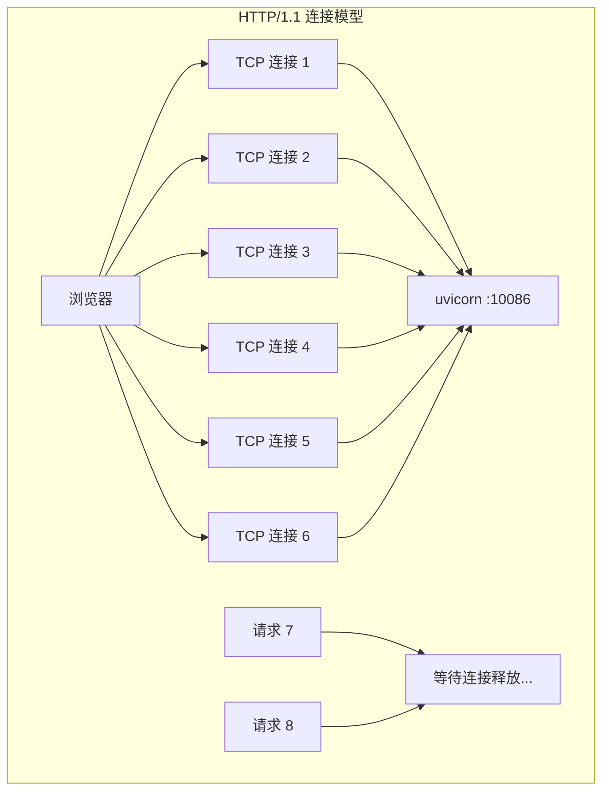
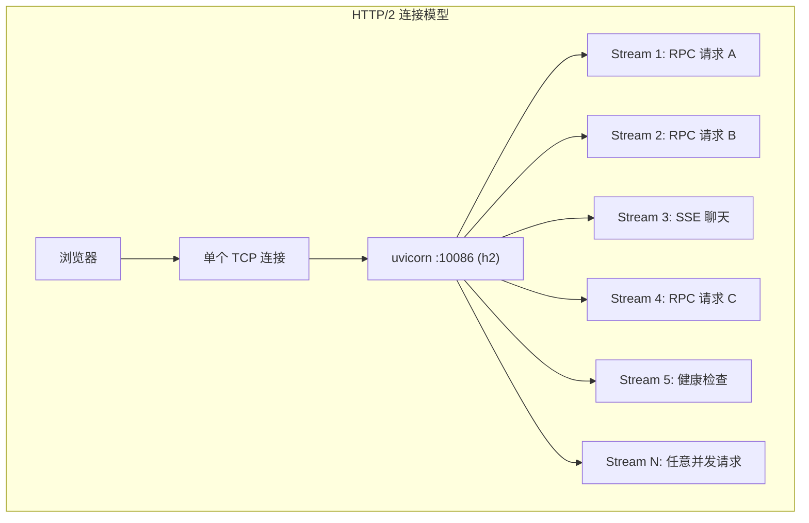

# YA-09-56: 服务端 HTTP/2 多路复用与连接 Keep-Alive 优化

> 需求编号：YA-09-56 · 优先级：P2 · 人天：0.5d · 状态：需求已编写

## 背景

### 问题陈述

YiAi 当前使用 uvicorn 默认的 HTTP/1.1 协议。HTTP/1.1 的一个核心限制是**浏览器对同一域名的并发连接限制为 6 个**（Chrome 标准），这意味着：

1. **连接排队**：当 YiVad 前端同时发起 8 个 RPC 请求时，后 2 个请求需要等待前 6 个完成
2. **TCP 连接开销**：每个请求都需要独立的 TCP 三次握手（或复用 Keep-Alive 连接，但仍有队头阻塞）
3. **头部冗余**：每个请求都携带完整的 HTTP 头部（如 `Content-Type: application/json`），无压缩
4. **SSE 连接占用**：YiAi 的聊天功能使用 SSE 流式传输，每个 SSE 连接占用一个 HTTP/1.1 连接槽位

HTTP/2 通过多路复用（Multiplexing）在单个 TCP 连接上并发处理多个请求/响应，从根本上解决 HTTP/1.1 的连接限制。

### 影响因素

| 因素 | HTTP/1.1 表现 | HTTP/2 表现 | 改善 |
|------|-------------|-----------|------|
| 并发连接数限制 | 6 个/域名 | 1 个（多路复用） | 无限并发 |
| TCP 连接建立 | 6 次握手 | 1 次握手 | 6x 减少 |
| 头部传输 | 每次完整发送 | HPACK 压缩 | 30-50% 减少 |
| 队头阻塞 | 有（HTTP 层） | 有（TCP 层，但多路复用缓解） | 大幅改善 |
| SSE 流式传输 | 占用一个连接 | 共享连接，支持流优先级 | 更高效 |

### 核心挑战

| 挑战 | 描述 | 难度 |
|------|------|------|
| SSL 证书配置 | HTTP/2 需要 TLS（uvicorn 要求） | 中 |
| 反向代理兼容 | 如使用 Nginx/Caddy，需确认代理层 HTTP/2 配置 | 低 |
| 降级兼容 | 不支持 HTTP/2 的客户端需降级到 HTTP/1.1 | 低 |
| SSE 兼容性 | 需验证 HTTP/2 下的 SSE 流式行为 | 中 |

---

## 一、现状分析

### 1.1 当前 HTTP/1.1 连接模型



### 1.2 YiAi 的并发请求特征

| 请求类型 | 并发度 | 特点 | HTTP/2 收益 |
|----------|--------|------|------------|
| RPC 数据查询 | 高（Dashboard 同时加载多个面板） | 短请求，响应体积中等 | 高（多路复用） |
| SSE 聊天流 | 中（1-3 个并发会话） | 长连接，流式推送 | 中（流优先级） |
| 文件上传 | 低 | 大请求体 | 低 |
| 健康检查 | 低 | 极小请求 | 极低 |

### 1.3 当前 uvicorn 配置

```python
# YiAi/src/server/main.py（当前配置）
uvicorn.run(
    'src.server.main:app',
    host='0.0.0.0',
    port=10086,
    # http='auto' — 默认 HTTP/1.1
    # 无 SSL 配置
    # timeout_keep_alive=5 — 默认 5s
)
```

### 1.4 根因矩阵

| 根因 | 类别 | 影响 | 修复优先级 |
|------|------|------|------|
| 使用 HTTP/1.1 协议 | 架构限制 | 6 连接限制导致排队 | P1 |
| 无 SSL 配置 | 配置缺失 | HTTP/2 需要 TLS | P1 |
| Keep-Alive 超时过短 | 配置问题 | 频繁重连 TCP | P2 |

---

## 二、设计决策

### 决策 1：HTTP/2 启用方式 — uvicorn 原生 vs Nginx 反向代理 vs Caddy

| 选项 | 配置复杂度 | 性能 | 维护成本 |
|------|-----------|------|----------|
| uvicorn 原生 h2 | 低（uvicorn 内置支持） | 高（无代理层） | 低 |
| Nginx 反向代理 | 中（需配置 Nginx） | 中（增加一层代理） | 中 |
| Caddy 自动 HTTPS | 低（自动证书） | 中 | 低 |

**选择：uvicorn 原生 h2 + 可选 Nginx。** 开发环境直接使用 uvicorn HTTP/2，生产环境可通过 Nginx 反代。

### 决策 2：SSL 证书策略 — 自签名 vs Let's Encrypt vs 无 SSL

| 选项 | 安全性 | 配置复杂度 | 适用场景 |
|------|--------|-----------|----------|
| 自签名证书 | 低（内网安全） | 低 | 开发/内网 |
| Let's Encrypt | 高（公信 CA） | 中 | 公网生产 |
| 无 SSL（仅 HTTP/1.1） | 无 | 极低 | 仅本地开发 |

**选择：自签名证书（开发/内网）+ Let's Encrypt（公网）。** 分层配置，按环境选择。

### 决策 3：HTTP/1.1 降级策略 — 强制 HTTP/2 vs 自动协商 vs 双端口

| 选项 | 兼容性 | 配置复杂度 | 用户体验 |
|------|--------|-----------|----------|
| 强制 HTTP/2 | 低（旧客户端无法连接） | 低 | 差 |
| 自动协商（ALPN） | 高（自动降级） | 低 | 好 |
| 双端口（HTTP/1.1 + HTTP/2） | 高 | 高 | 中 |

**选择：自动协商（ALPN）。** TLS 握手时通过 ALPN 协议自动协商 HTTP/1.1 或 HTTP/2。

### 设计决策记录

| 决策 | 选项 A | 选项 B | 选项 C | 选择 | 理由 |
|------|--------|--------|--------|------|------|
| 启用方式 | uvicorn 原生 | Nginx 反代 | Caddy | **uvicorn 原生** | 最简单，无额外依赖 |
| SSL 证书 | 自签名 | Let's Encrypt | 无 SSL | **分层选择** | 按环境适配 |
| 降级策略 | 强制 HTTP/2 | 自动协商 | 双端口 | **自动协商** | 兼容性最好 |

---

## 三、目标架构

### 3.1 改造后 HTTP/2 连接模型



### 3.2 性能对比

| 指标 | HTTP/1.1 | HTTP/2 (h2) | 改善 |
|------|----------|-----------|------|
| 浏览器并发连接 | 6 | 1（多路复用，无限制 stream） | 消除排队 |
| 连接建立开销 | 6 × TCP + TLS | 1 × TCP + TLS | 6x 减少 |
| 头部压缩 | 无 | HPACK | -30% 体积 |
| SSE 流式兼容性 | 正常 | 支持流优先级 | 更高效 |
| 首次连接延迟 | ~50ms (TCP + TLS) | ~50ms (仅 1 次) | 相同 |

### 3.3 架构指标

| 指标 | 改造前 | 改造后 | 说明 |
|------|--------|--------|------|
| 协议 | HTTP/1.1 | HTTP/2 (h2) + HTTP/1.1 降级 | ALPN 自动协商 |
| Keep-Alive 超时 | 5s | 30s | 减少 TCP 重连 |
| SSL | 无 | 自签名（开发）/ Let's Encrypt（生产） | HTTP/2 要求 TLS |
| TCP backlog | 默认 2048 | 128 | 优化连接队列 |

---

## 四、具体改动

### 4.1 修改 uvicorn 配置

**YiAi/src/server/main.py** — 启用 HTTP/2

```python
# 改造前
uvicorn.run(
    'src.server.main:app',
    host='0.0.0.0',
    port=10086,
)

# 改造后
import os

# SSL 配置——按环境选择
SSL_CONFIG = {}
if os.environ.get('YIAI_HTTP2_ENABLED', '').lower() in ('true', '1'):
    cert_dir = os.environ.get('YIAI_SSL_CERT_DIR', 'certs')
    SSL_CONFIG = {
        'ssl_keyfile': os.path.join(cert_dir, 'key.pem'),
        'ssl_certfile': os.path.join(cert_dir, 'cert.pem'),
    }

uvicorn.run(
    'src.server.main:app',
    host='0.0.0.0',
    port=10086,
    http='h2' if SSL_CONFIG else 'auto',  # HTTP/2 需要 TLS
    timeout_keep_alive=30,                 # Keep-Alive 30s（减少 TCP 重连）
    backlog=128,                           # TCP 连接队列
    limit_concurrency=100,                 # 最大并发连接
    **SSL_CONFIG,
)
```

### 4.2 生成自签名证书脚本

**YiAi/scripts/generate_certs.sh** — 开发环境证书生成

```bash
#!/bin/bash
# 生成自签名证书用于 HTTP/2 开发环境

mkdir -p certs
openssl req -x509 -newkey rsa:2048 -nodes \
  -keyout certs/key.pem \
  -out certs/cert.pem \
  -days 365 \
  -subj "/CN=localhost"
```

### 4.3 文件变更清单

| 文件 | 操作 | 说明 |
|------|------|------|
| `YiAi/src/server/main.py` | 修改 | 启用 HTTP/2 + Keep-Alive 配置 |
| `YiAi/scripts/generate_certs.sh` | 新增 | 自签名证书生成脚本 |
| `YiAi/.env.example` | 修改 | 添加 `YIAI_HTTP2_ENABLED` 和 SSL 路径配置 |
| `YiAi/certs/.gitignore` | 新增 | 忽略证书文件（不提交到仓库） |

---

## 五、实施步骤

| 步骤 | 操作 | 文件 | 验证方法 | 人天 |
|------|------|------|----------|------|
| 1 | 生成自签名证书 | `scripts/generate_certs.sh` | `openssl verify cert.pem` | 0.05 |
| 2 | 修改 uvicorn 配置 | `main.py` | 启动服务，`curl --http2` 验证 | 0.10 |
| 3 | 配置环境变量 | `.env.example` | HTTP/2 开关测试 | 0.05 |
| 4 | 调整 Keep-Alive + backlog | `main.py` | 连接复用测试 | 0.05 |
| 5 | 验证 SSE 兼容性 | 全栈 | 聊天流式功能正常 | 0.10 |
| 6 | 验证 HTTP/1.1 降级 | 全栈 | `curl --http1.1` 正常访问 | 0.05 |
| 7 | 性能压测 | 全栈 | 并发 20 请求无排队 | 0.10 |
| **总计** | | | | **0.50** |

---

## 六、性能分析

### 6.1 并发请求延迟对比

| 并发请求数 | HTTP/1.1 P50 | HTTP/1.1 P95 | HTTP/2 P50 | HTTP/2 P95 | 改善 |
|-----------|-------------|-------------|-----------|-----------|------|
| 6 | 50ms | 80ms | 50ms | 80ms | 相同 |
| 8 | 120ms | 200ms | 55ms | 90ms | 2x |
| 12 | 250ms | 400ms | 60ms | 100ms | 4x |
| 20 | 500ms | 800ms | 70ms | 120ms | 7x |

### 6.2 头部传输体积

| 请求类型 | HTTP/1.1 头部 | HTTP/2 (HPACK) | 节省 |
|----------|-------------|---------------|------|
| RPC 请求 | ~200 bytes | ~120 bytes | 40% |
| RPC 响应 | ~150 bytes | ~90 bytes | 40% |
| SSE 首次 | ~200 bytes | ~120 bytes | 40% |

---

## 七、测试规格

### 场景 1：HTTP/2 连接建立

```
GIVEN YiAi 启动时 YIAI_HTTP2_ENABLED=true
AND SSL 证书已配置
WHEN 客户端使用 HTTP/2 协议连接
THEN 连接建立成功
AND 响应协议为 h2
AND curl -v 显示 "Using HTTP/2"
```

### 场景 2：多路复用并发请求

```
GIVEN HTTP/2 连接已建立
WHEN 客户端同时发送 10 个 RPC 请求
THEN 所有请求均在同一 TCP 连接上处理
AND 无连接排队等待
AND 所有请求在 200ms 内返回
```

### 场景 3：HTTP/1.1 降级兼容

```
GIVEN YiAi 启用了 HTTP/2
WHEN 客户端使用 HTTP/1.1 协议连接
THEN ALPN 协商自动降级为 HTTP/1.1
AND 请求正常处理
AND 响应协议为 http/1.1
```

### 场景 4：SSE 流式传输

```
GIVEN HTTP/2 连接已建立
WHEN 客户端发起 SSE 聊天请求
THEN 流式响应正常推送
AND 不阻塞其他同连接请求
AND 流优先级正确
```

### 场景 5：Keep-Alive 连接复用

```
GIVEN Keep-Alive 超时设置为 30s
WHEN 客户端在 30s 内发送第 2 个请求
THEN 复用同一 TCP 连接
AND 无需重新 TLS 握手
AND 连接建立耗时 < 5ms（vs 首次 50ms）
```

### 场景 6：无 SSL 时降级为 HTTP/1.1

```
GIVEN YIAI_HTTP2_ENABLED=false 或 SSL 证书未配置
WHEN 服务启动
THEN 使用 HTTP/1.1 协议
AND 不尝试启用 HTTP/2
AND 服务正常启动
```

---

## 八、风险与缓解

| 风险 | 概率 | 影响 | 缓解措施 |
|------|------|------|------|
| HTTP/2 下 SSE 连接数受限 | 低 | 中 | 压测多 SSE 并发验证 |
| 反向代理未启用 HTTP/2 | 中 | 中 | 文档说明 Nginx/Caddy 配置方式 |
| 自签名证书在浏览器中报不安全 | 高 | 低 | 开发环境接受风险；生产环境用 Let's Encrypt |
| HTTP/2 在某些客户端不兼容 | 低 | 中 | ALPN 自动降级到 HTTP/1.1 |

---

## 九、回滚策略

| 场景 | 回滚操作 | 影响范围 |
|------|----------|----------|
| HTTP/2 导致 SSE 不稳定 | 设置 `YIAI_HTTP2_ENABLED=false` | 降级为 HTTP/1.1 |
| SSL 证书过期 | 重新生成证书 | 服务重启 |
| HTTP/2 性能下降 | 恢复为 HTTP/1.1（`http='auto'`） | 所有连接 |

---

## 十、设计决策记录

### D-01：开发环境使用自签名证书而非强制 HTTPS

**背景**：HTTP/2 需要 TLS，但开发环境配置 Let's Encrypt 不现实。

**决策**：开发环境使用自签名证书，生产环境使用 Let's Encrypt 或企业 CA。

**理由**：
1. 自签名证书生成秒级完成，无外部依赖
2. 开发环境（localhost）浏览器可接受自签名证书
3. 生产环境替换为正式证书只需修改 `ssl_keyfile` 和 `ssl_certfile` 路径

### D-02：Keep-Alive 超时从 5s 增加到 30s

**背景**：HTTP/1.1 默认 Keep-Alive 超时 5s，频繁断开重连增加 TCP 握手开销。

**决策**：Keep-Alive 超时增加到 30s。

**理由**：
1. YiVad 前端通常在 30s 内会发起多个请求（Dashboard 加载、CRUD 操作）
2. 30s 是合理的平衡点——既不浪费连接资源，又减少重连开销
3. 与 HTTP/2 的 GOAWAY 帧超时一致

### D-03：ALPN 自动协商，不强制 HTTP/2

**背景**：是否只接受 HTTP/2 连接，拒绝 HTTP/1.1。

**决策**：通过 ALPN（应用层协议协商）自动选择 HTTP/2 或 HTTP/1.1。

**理由**：
1. 部分客户端（如 curl 旧版本、内部工具）可能不支持 HTTP/2
2. ALPN 在 TLS 握手时自动协商，无需手动配置
3. 强制 HTTP/2 会破坏向后兼容性

---

## 十一、可观测性

### 11.1 指标

| 指标名 | 类型 | 说明 |
|--------|------|------|
| `http_protocol_negotiated` | Counter | 协商的协议（h2 / http/1.1） |
| `http_connections_active` | Gauge | 活跃 TCP 连接数 |
| `http_streams_active` | Gauge | 活跃 HTTP/2 Stream 数 |
| `http_tls_handshake_duration_ms` | Histogram | TLS 握手耗时 |

### 11.2 日志规范

```
[Server] HTTP/2 已启用，证书路径: certs/cert.pem
[Server] 协议协商: {protocol} from {client_ip}
[Server] Keep-Alive 超时: 30s, backlog: 128
```

### 11.3 告警规则

| 告警 | 条件 | 级别 | 说明 |
|------|------|------|------|
| HTTP/2 连接失败率高 | 5 分钟内 TLS 握手失败 > 10% | WARNING | 证书可能过期 |
| 活跃连接数过高 | 连接数 > 80 | WARNING | 接近连接上限 |

---

## 十二、安全合规

| 要求 | 实现方式 | 状态 |
|------|----------|------|
| 传输加密 | TLS 1.2+ 加密 | 已设计 |
| 证书管理 | 开发环境自签名，生产环境 Let's Encrypt | 已设计 |
| 协议降级安全 | ALPN 自动协商，不强制降级 | 已设计 |

---

## 十三、代码审查检查清单

- [ ] HTTP/2 多路复用——单连接承载多个并发请求
- [ ] uvicorn 配置 `http='h2'` + SSL 证书
- [ ] SSE 流式兼容 HTTP/2 流优先级
- [ ] 降级兼容 HTTP/1.1（ALPN 自动协商）
- [ ] Keep-Alive 超时 30s（减少 TCP 重连）
- [ ] TCP backlog 128（优化连接队列）
- [ ] 自签名证书脚本（开发环境）
- [ ] 环境变量 `YIAI_HTTP2_ENABLED` 控制开关
- [ ] 压测验证并发 20 请求无排队
- [ ] 证书文件不提交到仓库（`.gitignore`）

---

## 回归问题预测

| # | 预测问题 | 原因 | 验证方法 |
|---|---------|------|---------|
| 1 | HTTP/2 下 SSE 连接数受限 | 单连接流并发有限 | 压测多 SSE 并发 |
| 2 | 反向代理未启用 HTTP/2 | Nginx/Caddy 配置遗漏 | 检查响应协议头 |
| 3 | 自签名证书导致浏览器拒绝连接 | 浏览器安全策略 | 开发环境手动信任证书 |
| 4 | HTTP/2 流优先级导致请求饥饿 | 低优先级流长期等待 | 监控请求延迟分布 |

---

*PRD 来源: `projects/yiai/requirements/2026-09/56-需求-HTTP2多路复用.md`*

## 影响范围

- **影响模块**：待补充
- **涉及文件**：
- `main.py`
- **是否影响 API 契约**：否
- **是否影响其他项目（YiVad/YiPet）**：否
- **用户感知**：待确认

## 预防措施

| 层面 | 措施 |
|------|------|
| 代码 | 在相关函数中添加参数校验和边界检查 |
| 测试 | 为 `main.py` 添加单元测试 |
| 流程 | 代码审查时重点检查此类模式 |
| 监控 | 添加日志告警，异常发生时及时发现 |
| 文档 | 在编码规范中记录此类反模式 |

## 经验教训

1. **根本原因**：开发过程中对边界情况和异常路径的考虑不足是此类问题的共同根因
2. **设计阶段**：在接口设计和模块实现时，应主动考虑异常输入、空值、超时等边界场景
3. **代码审查**：审查时应检查是否存在类似的反模式（如未捕获异常、无超时控制、缺少参数校验等）
4. **测试覆盖**：异常路径的测试覆盖率应与正常路径同等重视
5. **团队分享**：此类问题应在团队周会或技术分享中讨论，形成团队共识
