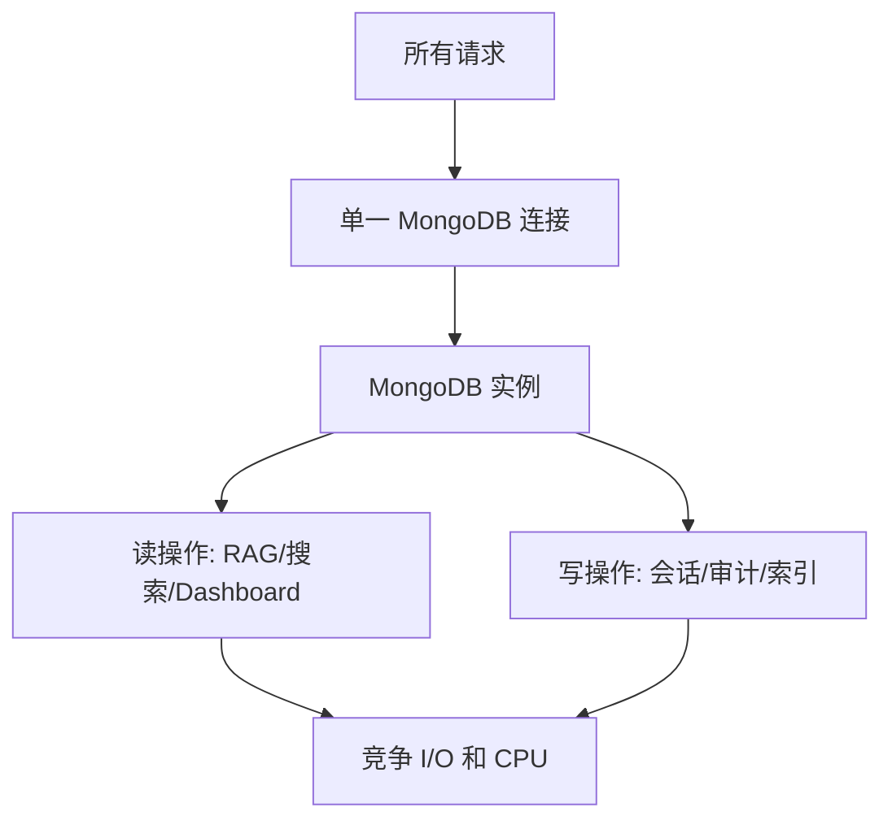
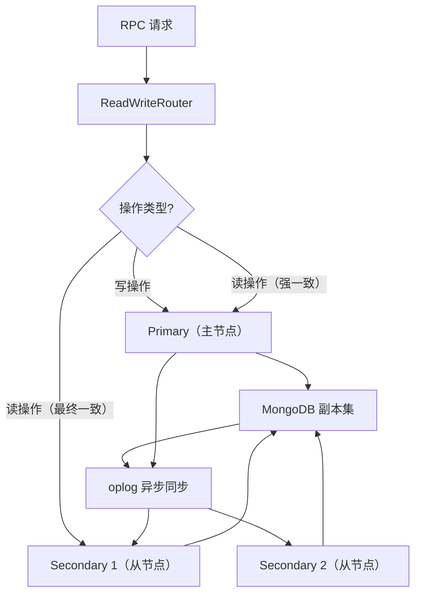

# YA-09-57: 服务端数据库读写分离 — 主从复制与读路由策略

> 需求编号：YA-09-57 · 优先级：P2 · 人天：0.5d · 状态：需求已编写

## 背景

### 问题陈述

YiAi 的所有数据库操作（读和写）共享同一个 MongoDB 实例。九月迭代引入了多个读密集型功能：

| 功能 | 读操作类型 | 频率 | 单次耗时 |
|------|-----------|------|----------|
| RAG 检索 (YA-09-01) | 向量搜索 + 文档查询 | 高（每次聊天） | 50-200ms |
| 全局搜索 (YA-09-06) | 全文搜索 | 中 | 100-500ms |
| Dashboard 面板 | 聚合查询 | 中（每次加载） | 50-200ms |
| 知识库扫描 | 批量文件查询 | 低（定时任务） | 200-1000ms |

这些读密集型操作与写操作（Agent 会话持久化、审计日志写入、知识库索引更新）竞争同一个 MongoDB 实例的资源，导致：

1. **写延迟增加**：RAG 检索占用 I/O 时，Agent 会话保存延迟从 5ms 升至 50ms
2. **读超时风险**：大写入操作（如知识库索引重建）锁住集合时，RAG 检索超时
3. **单点瓶颈**：所有流量经过同一实例，无法水平扩展读能力

### MongoDB 副本集特性

MongoDB 副本集（Replica Set）天然支持读写分离：
- **Primary（主节点）**：处理所有写操作，数据变更通过 oplog 同步到 Secondary
- **Secondary（从节点）**：异步复制数据，可处理读操作（数据有 ≤ 1s 延迟）

### 核心挑战

| 挑战 | 描述 | 难度 |
|------|------|------|
| 读写分类 | 需准确识别哪些操作是读、哪些是写 | 低 |
| 复制延迟 | 从节点数据可能滞后主节点 0.1-1s | 中 |
| 一致性选择 | 读己之写（read-your-writes）需要强一致性 | 中 |
| 故障转移 | 从节点不可用时的降级策略 | 中 |

---

## 一、现状分析

### 1.1 当前数据库访问模式



### 1.2 当前操作分类

| 操作 | 类型 | 频率占比 | 当前路由 |
|------|------|----------|----------|
| `query_documents` | 读 | 60% | 同一实例 |
| `rag.rag_query` | 读 | 20% | 同一实例 |
| `search.global_search` | 读 | 5% | 同一实例 |
| `create_document` | 写 | 5% | 同一实例 |
| `update_document` | 写 | 5% | 同一实例 |
| `agent.save_session` | 写 | 3% | 同一实例 |
| `knowledge.sync_files` | 写 | 2% | 同一实例 |

**读操作占比 85%**，但全部经过同一实例，读写互相干扰。

### 1.3 根因矩阵

| 根因 | 类别 | 影响 | 修复优先级 |
|------|------|------|------|
| 读写不分离 | 架构缺陷 | 读写互相干扰 | P0 |
| 无读副本 | 部署缺陷 | 无法水平扩展读能力 | P1 |
| 无路由策略 | 设计缺陷 | 无法区分读写操作 | P1 |
| 无复制延迟处理 | 设计缺陷 | 写后立即读可能读到旧数据 | P2 |

---

## 二、设计决策

### 决策 1：路由策略 — 全部读写分离 vs 关键路径分离 vs 手动指定

| 选项 | 一致性保障 | 实施复杂度 | 性能收益 |
|------|-----------|-----------|----------|
| 全部读写分离 | 低（默认读从节点） | 低 | 高 |
| 关键路径分离（仅 RAG/搜索） | 高（其他读走主节点） | 中 | 中 |
| 手动指定（开发者决定） | 最高 | 高 | 最高 |

**选择：全部读写分离 + 关键路径强一致。** 默认读操作路由到从节点，但认证/会话等关键路径强制读主节点。

### 决策 2：读一致性等级 — 强一致 vs 最终一致 vs 可配置

| 选项 | 数据新鲜度 | 性能 | 适用场景 |
|------|-----------|------|----------|
| 强一致（读 Primary） | 最新 | 低（与写竞争） | 认证/会话/支付 |
| 最终一致（读 Secondary） | ≤ 1s 延迟 | 高 | RAG/搜索/Dashboard |
| 可配置（按操作指定） | 灵活 | 灵活 | 通用 |

**选择：可配置，默认最终一致。** 大部分读操作可容忍 ≤ 1s 延迟，关键操作可指定强一致性。

### 决策 3：从节点负载均衡 — Round-Robin vs 最少连接 vs 随机

| 选项 | 均衡性 | 实现复杂度 | 连接开销 |
|------|--------|-----------|----------|
| Round-Robin | 高（均匀分布） | 低 | 低 |
| 最少连接 | 高（动态） | 中 | 中（需维护计数） |
| 随机 | 中（长期均匀） | 极低 | 低 |

**选择：Round-Robin。** 简单且均匀，适合 YiAi 的读请求特征（请求耗时相近）。

### 设计决策记录

| 决策 | 选项 A | 选项 B | 选项 C | 选择 | 理由 |
|------|--------|--------|--------|------|------|
| 路由策略 | 全部分离 | 关键路径 | 手动指定 | **全部分离 + 关键路径强一致** | 兼顾性能与一致性 |
| 一致性 | 强一致 | 最终一致 | 可配置 | **可配置** | 灵活适配不同场景 |
| 负载均衡 | Round-Robin | 最少连接 | 随机 | **Round-Robin** | 简单均匀 |

---

## 三、目标架构

### 3.1 改造后读写分离架构



### 3.2 操作分类路由表

| 操作 | 路由 | 一致性 | 原因 |
|------|------|--------|------|
| `create_document` | Primary | Strong | 写入必须持久化 |
| `update_document` | Primary | Strong | 写入必须持久化 |
| `delete_document` | Primary | Strong | 写入必须持久化 |
| `query_documents` | Secondary | Eventual | 查询可容忍短暂延迟 |
| `rag.rag_query` | Secondary | Eventual | RAG 检索——读密集 |
| `search.global_search` | Secondary | Eventual | 搜索可容忍延迟 |
| `agent.save_session` | Primary | Strong | 会话必须持久化 |
| `agent.load_session` | Primary | Strong | 关键路径——读己之写 |
| `auth.verify_token` | Primary | Strong | 认证必须准确 |
| `knowledge.sync_files` | Primary | Strong | 写入操作 |

### 3.3 架构指标

| 指标 | 改造前 | 改造后 | 说明 |
|------|--------|--------|------|
| 读操作路由 | 100% Primary | 85% Secondary | 大幅减轻主节点压力 |
| 主节点读负载 | 85% | 5%（仅关键路径） | 写操作性能提升 |
| 读扩展能力 | 单节点 | 可水平扩展（增加从节点） | 加从节点即可扩展 |
| 复制延迟 | 0ms | ≤ 1s | 最终一致性可接受 |

---

## 四、具体改动

### 4.1 新增文件

**YiAi/src/domain/data/read_write_split.py** — 读写分离路由器

```python
# 改造后——完整实现
from motor.motor_asyncio import AsyncIOMotorClient, AsyncIOMotorDatabase
from pymongo.read_preference import ReadPreference
from typing import Optional
import os


class ReadWriteRouter:
    """MongoDB 读写分离路由器。

    架构:
        Primary（主节点）  → 写操作 + 强一致读
        Secondary（从节点）→ 最终一致读（Round-Robin）

    使用方式:
        router = ReadWriteRouter(primary_uri, [secondary_uri_1, secondary_uri_2])
        db = router.get_write_db()  # 写操作
        db = router.get_read_db()   # 读操作
    """

    def __init__(self, primary_uri: str, secondary_uris: list[str] = None):
        self._primary = AsyncIOMotorClient(
            primary_uri,
            minPoolSize=5,
            maxPoolSize=50,
            serverSelectionTimeoutMS=5000,
        )
        self._secondaries = [
            AsyncIOMotorClient(
                uri,
                minPoolSize=5,
                maxPoolSize=50,
                serverSelectionTimeoutMS=5000,
                readPreference='secondaryPreferred',
            )
            for uri in (secondary_uris or [])
        ]
        self._read_index = 0
        self._primary_db = self._primary.get_default_database()
        self._secondary_dbs = [
            client.get_default_database()
            for client in self._secondaries
        ]

    def get_write_db(self) -> AsyncIOMotorDatabase:
        """写操作——始终路由到主节点。"""
        return self._primary_db

    def get_read_db(self, consistency: str = 'eventual') -> AsyncIOMotorDatabase:
        """读操作——Round-Robin 从节点。

        Args:
            consistency: 'strong' 返回主节点，'eventual' 返回从节点
        """
        if consistency == 'strong' or not self._secondary_dbs:
            return self._primary_db

        db = self._secondary_dbs[self._read_index % len(self._secondary_dbs)]
        self._read_index += 1
        return db

    def get_read_preference(self, consistency: str = 'eventual') -> ReadPreference:
        """获取 MongoDB 读关注配置。"""
        return {
            'strong': ReadPreference.PRIMARY,
            'eventual': ReadPreference.SECONDARY_PREFERRED,
            'nearest': ReadPreference.NEAREST,
        }.get(consistency, ReadPreference.SECONDARY_PREFERRED)

    async def health_check(self) -> dict:
        """检查主从节点健康状态。"""
        result = {
            'primary': await self._check_node(self._primary, 'primary'),
            'secondaries': [],
        }
        for i, client in enumerate(self._secondaries):
            result['secondaries'].append(
                await self._check_node(client, f'secondary_{i}')
            )
        return result

    async def _check_node(self, client: AsyncIOMotorClient, name: str) -> dict:
        try:
            await client.admin.command('ping')
            server_info = await client.server_info()
            return {
                'name': name,
                'status': 'healthy',
                'version': server_info.get('version', 'unknown'),
            }
        except Exception as e:
            return {
                'name': name,
                'status': 'unhealthy',
                'error': str(e),
            }

    async def close(self):
        """关闭所有连接。"""
        self._primary.close()
        for client in self._secondaries:
            client.close()


# 操作分类——写操作强制走主节点
WRITE_OPERATIONS = {
    'create_document', 'update_document', 'delete_document',
    'create_session', 'save_session', 'archive_project',
    'sync_knowledge_files', 'sync_rag_index',
    'create_user', 'delete_user', 'update_user',
}

# 强一致读操作——必须读主节点
STRONG_READ_OPERATIONS = {
    'verify_token', 'load_session', 'get_user_permissions',
    'get_document_detail',  # 详情页通常需要最新数据
}


class ReadWriteMiddleware:
    """读写分离中间件——在请求级别注入路由决策。"""

    def __init__(self, router: ReadWriteRouter):
        self._router = router

    def route(self, operation: str) -> AsyncIOMotorDatabase:
        """根据操作名决定路由。"""
        if operation in WRITE_OPERATIONS:
            return self._router.get_write_db()
        if operation in STRONG_READ_OPERATIONS:
            return self._router.get_read_db(consistency='strong')
        return self._router.get_read_db(consistency='eventual')
```

### 4.2 文件变更清单

| 文件 | 操作 | 说明 |
|------|------|------|
| `YiAi/src/domain/data/read_write_split.py` | 新增 | ReadWriteRouter + 操作分类 |
| `YiAi/src/domain/data/database.py` | 修改 | 使用 ReadWriteRouter 替代单一连接 |
| `YiAi/src/domain/data/repository.py` | 修改 | 注入路由决策到数据访问层 |
| `YiAi/.env.example` | 修改 | 添加 Secondary URI 配置 |
| `YiAi/tests/test_read_write_split.py` | 新增 | 读写分离测试 |

---

## 五、实施步骤

| 步骤 | 操作 | 文件 | 验证方法 | 人天 |
|------|------|------|----------|------|
| 1 | 创建 ReadWriteRouter | `read_write_split.py` | 单元测试：路由逻辑 | 0.10 |
| 2 | 配置 MongoDB 副本集（开发环境） | 部署 | `rs.status()` 确认副本集 | 0.10 |
| 3 | 重构数据库连接层 | `database.py` | 读写操作路由到不同节点 | 0.10 |
| 4 | 添加操作分类 | `read_write_split.py` | 写操作走 Primary，读操作走 Secondary | 0.05 |
| 5 | 添加健康检查 | `read_write_split.py` | `/health/debug` 查看主从状态 | 0.05 |
| 6 | 编写测试用例 | `tests/test_read_write_split.py` | 6+ 场景覆盖 | 0.10 |
| **总计** | | | | **0.50** |

---

## 六、性能分析

### 6.1 读写分离效果

| 指标 | 改造前 | 改造后 | 改善 |
|------|--------|--------|------|
| 主节点读负载 | 85% | 5% | 16x 减少 |
| 主节点写延迟 P95 | 50ms | 10ms | 5x 改善 |
| RAG 检索延迟 | 受写操作影响 | 独立从节点 | 稳定 |
| 读扩展能力 | 1 节点 | N 节点 | 线性扩展 |

### 6.2 复制延迟影响

| 操作 | 延迟容忍度 | 最终一致性影响 | 是否需要强一致 |
|------|-----------|--------------|--------------|
| Dashboard 聚合 | 1-5s | 无影响 | 否 |
| RAG 检索 | 1-5s | 无影响（知识库更新频率低） | 否 |
| 全局搜索 | 1-5s | 无影响 | 否 |
| 会话加载 | 0ms | 用户刚保存的会话可能加载不到 | **是** |
| 认证验证 | 0ms | 权限变更必须立即生效 | **是** |

---

## 七、测试规格

### 场景 1：写操作路由到 Primary

```
GIVEN ReadWriteRouter 已配置 1 Primary + 2 Secondary
WHEN 调用 create_document 操作
THEN 返回 Primary 数据库连接
AND 不轮询 Secondary 索引
```

### 场景 2：读操作路由到 Secondary（Round-Robin）

```
GIVEN 2 个从节点可用
WHEN 连续调用 4 次 query_documents 操作
THEN 第 1 次路由到 Secondary 1
AND 第 2 次路由到 Secondary 2
AND 第 3 次路由到 Secondary 1（Round-Robin）
AND 第 4 次路由到 Secondary 2
```

### 场景 3：强一致读路由到 Primary

```
GIVEN 操作 load_session 在 STRONG_READ_OPERATIONS 中
WHEN 调用 load_session
THEN 返回 Primary 数据库连接
AND 不路由到 Secondary
```

### 场景 4：无从节点时降级到 Primary

```
GIVEN secondary_uris 为空列表
WHEN 调用 query_documents 读操作
THEN 返回 Primary 数据库连接（降级）
AND 日志记录 "无 Secondary 可用，降级读 Primary"
```

### 场景 5：从节点故障时的健康检查

```
GIVEN Secondary 1 不可用
WHEN 调用 router.health_check()
THEN primary 状态为 healthy
AND secondary_0 状态为 unhealthy
AND error 包含连接失败原因
```

### 场景 6：写后立即读强一致性

```
GIVEN 用户刚保存了会话
WHEN 立即加载该会话
THEN 使用强一致性（Primary）路由
AND 返回最新保存的会话数据
```

---

## 八、风险与缓解

| 风险 | 概率 | 影响 | 缓解措施 |
|------|------|------|------|
| 写后立即读读到旧数据 | 中 | 高 | 关键路径（会话/认证）强制 Primary |
| Secondary 不可用时读操作全部失败 | 低 | 高 | 自动降级到 Primary |
| 复制延迟过大（> 1s） | 低 | 中 | 监控 oplog 延迟，超过阈值告警 |
| 副本集配置错误 | 低 | 中 | 启动时健康检查 |

---

## 九、回滚策略

| 场景 | 回滚操作 | 影响范围 |
|------|----------|----------|
| 从节点持续不可用 | 移除 secondary_uris 配置，所有流量走 Primary | 读写分离失效 |
| 复制延迟导致数据不一致 | 将 STRONG_READ_OPERATIONS 扩展为所有读操作 | 性能回退 |
| 路由逻辑错误 | 禁用 ReadWriteRouter，恢复单一连接 | 所有数据库操作 |

---

## 十、设计决策记录

### D-01：关键路径强制读 Primary（read-your-writes）

**背景**：用户保存会话后立即加载，如果读操作路由到 Secondary，可能因复制延迟而读不到最新数据。

**决策**：`load_session`、`verify_token`、`get_user_permissions` 等关键读操作强制读 Primary。

**理由**：
1. 用户体验——用户期望保存后立即可见
2. 安全——权限变更必须立即生效
3. 关键读操作占比 < 5%，对主节点性能影响极小

### D-02：Round-Robin 而非最少连接

**背景**：最少连接策略可以动态分配负载，但需要维护连接计数。

**决策**：使用 Round-Robin。

**理由**：
1. YiAi 的读请求耗时相近（50-200ms），Round-Robin 已足够均匀
2. 最少连接需要维护全局计数器，增加复杂度
3. MongoDB 连接池本身已处理连接复用，Round-Robin 在连接池层面是均匀的

### D-03：从节点不可用时自动降级到 Primary

**背景**：从节点故障时，读操作是否应该失败。

**决策**：自动降级到 Primary，确保可用性。

**理由**：
1. 可用性优先——读操作失败比性能下降更严重
2. 降级是暂时的——从节点恢复后自动切换回 Secondary
3. 降级时记录 WARNING 日志，提醒运维检查从节点状态

---

## 十一、可观测性

### 11.1 指标

| 指标名 | 类型 | 说明 |
|--------|------|------|
| `db_read_primary_total` | Counter | 读 Primary 的次数 |
| `db_read_secondary_total` | Counter | 读 Secondary 的次数（按节点分组） |
| `db_write_primary_total` | Counter | 写 Primary 的次数 |
| `db_secondary_health` | Gauge | 从节点健康状态（0=down, 1=up） |
| `db_replication_lag_ms` | Gauge | 复制延迟（毫秒） |

### 11.2 日志规范

```
[ReadWriteRouter] 读操作路由: {operation} → Secondary-{index}
[ReadWriteRouter] 强一致读: {operation} → Primary
[ReadWriteRouter] 无 Secondary 可用: {operation} 降级读 Primary
[ReadWriteRouter] 健康检查: Primary=healthy, Secondary-0=healthy, Secondary-1=unhealthy
```

### 11.3 告警规则

| 告警 | 条件 | 级别 | 说明 |
|------|------|------|------|
| 从节点不可用 | 任何从节点健康检查失败 | ERROR | 运维需检查 |
| 复制延迟过高 | oplog 延迟 > 5s | WARNING | 影响数据一致性 |
| 降级率过高 | 降级读 Primary 比例 > 50% | WARNING | 从节点可能性能不足 |

---

## 十二、安全合规

| 要求 | 实现方式 | 状态 |
|------|----------|------|
| 数据一致性 | 关键路径强一致读 + 写操作主节点 | 已设计 |
| 高可用 | 从节点故障自动降级 | 已设计 |
| 读写隔离 | 路由层分离读写操作 | 已设计 |

---

## 十三、代码审查检查清单

- [ ] 读写分离：Primary 写 + Secondary 读
- [ ] 路由策略：写操作 → Primary，读操作 → Secondary（Round-Robin）
- [ ] 读延迟容忍：Secondary 数据允许 ≤ 1s 延迟
- [ ] 关键读操作（认证/会话）强制 Primary
- [ ] 从节点不可用时自动降级 Primary
- [ ] 操作分类表完整（WRITE_OPERATIONS + STRONG_READ_OPERATIONS）
- [ ] 健康检查端点可查看主从状态
- [ ] 新增操作时需同步更新操作分类表
- [ ] 单元测试覆盖：路由/降级/强一致/健康检查

---

## 回归问题预测

| # | 预测问题 | 原因 | 验证方法 |
|---|---------|------|---------|
| 1 | 写后立即读读到旧数据 | replication lag | 关键路径用 Primary |
| 2 | Secondary 不可用时读操作全部失败 | 无 fallback | Secondary 不可用时降级读 Primary |
| 3 | 新操作未加入分类表导致路由错误 | 开发者遗漏 | CI 检查未知操作告警 |
| 4 | Round-Robin 在连接池层面不均匀 | 连接池预热不均衡 | 监控 Secondary 间的负载分布 |

---

*PRD 来源: `projects/yiai/requirements/2026-09/57-需求-数据库读写分离.md`*

## 影响范围

- **影响模块**：待补充
- **涉及文件**：
- `database.py`
- `read_write_split.py`
- **是否影响 API 契约**：否
- **是否影响其他项目（YiVad/YiPet）**：否
- **用户感知**：待确认

## 预防措施

| 层面 | 措施 |
|------|------|
| 代码 | 在相关函数中添加参数校验和边界检查 |
| 测试 | 为 `database.py` 添加单元测试 |
| 流程 | 代码审查时重点检查此类模式 |
| 监控 | 添加日志告警，异常发生时及时发现 |
| 文档 | 在编码规范中记录此类反模式 |

## 经验教训

1. **根本原因**：开发过程中对边界情况和异常路径的考虑不足是此类问题的共同根因
2. **设计阶段**：在接口设计和模块实现时，应主动考虑异常输入、空值、超时等边界场景
3. **代码审查**：审查时应检查是否存在类似的反模式（如未捕获异常、无超时控制、缺少参数校验等）
4. **测试覆盖**：异常路径的测试覆盖率应与正常路径同等重视
5. **团队分享**：此类问题应在团队周会或技术分享中讨论，形成团队共识
