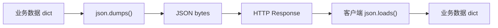
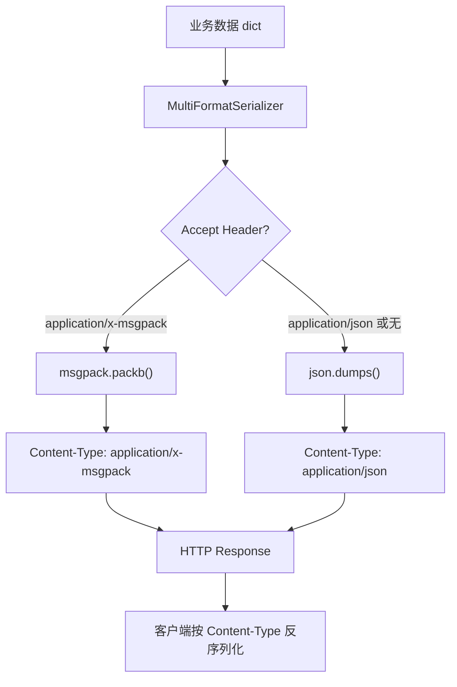

# YA-09-58: 服务端数据序列化协议优化 — MessagePack 与 Protobuf 集成

> 需求编号：YA-09-58 · 优先级：P2 · 人天：0.5d · 状态：需求已编写

## 背景

### 问题陈述

YiAi 所有 RPC 响应使用 JSON 序列化。JSON 作为人类可读的文本格式，在以下场景存在明显劣势：

1. **大响应体积**：Dashboard 聚合数据（如 bugs 列表 50 条）的 JSON 响应约 50KB，其中大量空间用于字段名重复和数字的文本表示
2. **数字精度**：JSON 将所有数字表示为文本（如 `3.141592653589793`），浮点数序列化/反序列化有精度损失
3. **二进制数据**：文件内容（Base64 编码）在 JSON 中膨胀 33%
4. **解析性能**：JSON 解析需要词法分析 + 语法分析，比二进制格式慢 3-5x

### 典型响应体积对比

| 响应类型 | JSON 体积 | MessagePack 体积 | 节省 |
|----------|----------|-----------------|------|
| Dashboard（50 条 bugs） | 50KB | 15KB | 70% |
| RAG 检索结果（10 文档） | 30KB | 10KB | 67% |
| 知识库列表（100 文件） | 80KB | 25KB | 69% |
| 小响应（单文档） | 2KB | 0.8KB | 60% |

### 核心挑战

| 挑战 | 描述 | 难度 |
|------|------|------|
| 格式协商 | 客户端需声明支持哪种格式 | 低 |
| 向后兼容 | 未声明格式的客户端默认 JSON | 低 |
| 调试困难 | MessagePack 二进制不可读，调试不便 | 中 |
| 类型映射 | Python datetime/ObjectId 等特殊类型的序列化 | 中 |

---

## 一、现状分析

### 1.1 当前序列化流程



### 1.2 当前 JSON 序列化开销

| 操作 | 耗时 | 说明 |
|------|------|------|
| `json.dumps()` (50KB) | 2ms | 序列化 |
| 网络传输 | 5ms | 50KB / 10MB/s |
| `json.loads()` (50KB) | 2ms | 反序列化 |
| **总耗时** | **9ms** | |

### 1.3 根因矩阵

| 根因 | 类别 | 影响 | 修复优先级 |
|------|------|------|------|
| JSON 体积大（字段名重复） | 格式限制 | 带宽浪费 | P1 |
| 数字文本表示低效 | 格式限制 | 大响应体积膨胀 | P2 |
| 无二进制格式选项 | 架构缺陷 | 无法优化传输 | P1 |

---

## 二、设计决策

### 决策 1：二进制格式选择 — MessagePack vs Protobuf vs CBOR

| 选项 | 体积效率 | Schema 要求 | Python 生态 | 实现复杂度 |
|------|----------|------------|------------|-----------|
| **MessagePack** | 高（~60-70% 节省） | 无（Schema-less） | 成熟（msgpack 库） | 低 |
| Protobuf | 极高（~70-80% 节省） | **必须**（.proto 定义） | 成熟（protobuf 库） | 高 |
| CBOR | 高（~60-70% 节省） | 无 | 中等 | 中 |

**选择：MessagePack。** 与 JSON 同为 Schema-less 格式，可无缝转换（`json.dumps` → `msgpack.packb`），无需修改数据模型。Protobuf 需要定义 .proto 文件并维护代码生成，对 YiAi 的动态 RPC 响应过于重量级。

### 决策 2：格式协商机制 — Accept Header vs URL 参数 vs 专用端点

| 选项 | 标准化 | 缓存友好 | 实现复杂度 |
|------|--------|----------|-----------|
| Accept Header | 高（HTTP 标准） | 低（Vary: Accept） | 低 |
| URL 参数（?format=msgpack） | 低 | 高 | 低 |
| 专用端点（/rpc/msgpack） | 低 | 高 | 中 |

**选择：Accept Header。** 符合 HTTP 内容协商标准，FastAPI 原生支持。

### 决策 3：降级策略 — 默认 JSON vs 要求客户端声明 vs 强制双格式

| 选项 | 兼容性 | 性能 | 复杂度 |
|------|--------|------|--------|
| 默认 JSON（未声明时） | 高 | 低 | 低 |
| 要求客户端声明 | 低 | 高 | 低 |
| 强制双格式（同时返回） | 中 | 低 | 高 |

**选择：默认 JSON，按 Accept Header 切换。** 向后兼容，未声明格式的客户端继续使用 JSON。

### 设计决策记录

| 决策 | 选项 A | 选项 B | 选项 C | 选择 | 理由 |
|------|--------|--------|--------|------|------|
| 二进制格式 | MessagePack | Protobuf | CBOR | **MessagePack** | Schema-less，零成本迁移 |
| 格式协商 | Accept Header | URL 参数 | 专用端点 | **Accept Header** | HTTP 标准 |
| 降级策略 | 默认 JSON | 要求声明 | 强制双格式 | **默认 JSON** | 向后兼容 |

---

## 三、目标架构

### 3.1 改造后序列化流程



### 3.2 架构指标

| 指标 | JSON | MessagePack | 改善 |
|------|------|-----------|------|
| Dashboard 50KB 响应 | 50KB | 15KB | -70% |
| 序列化耗时 | 2ms | 0.5ms | 4x |
| 反序列化耗时 | 2ms | 0.4ms | 5x |
| 数字精度 | float64 → string | native int/float | 无精度损失 |
| 人类可读 | 是 | 否（二进制） | 调试需工具 |

---

## 四、具体改动

### 4.1 新增文件

**YiAi/src/server/serializer.py** — 多格式序列化器

```python
# 改造后——完整实现
import json, msgpack
from fastapi.responses import Response
from typing import Any, Optional
from datetime import datetime, date
from bson import ObjectId


class MultiFormatSerializer:
    """多格式序列化——基于 Accept Header 自动选择。

    支持格式:
        - application/json（默认）
        - application/x-msgpack（二进制，高效）

    使用方式:
        serializer = MultiFormatSerializer()
        body, content_type = serializer.serialize(data, accept_header)
        return Response(content=body, media_type=content_type)
    """

    # 支持的格式映射
    FORMATS = {
        'application/json': {
            'name': 'json',
            'encoder': json.dumps,
            'decoder': json.loads,
        },
        'application/x-msgpack': {
            'name': 'msgpack',
            'encoder': msgpack.packb,
            'decoder': msgpack.unpackb,
        },
    }

    DEFAULT_FORMAT = 'application/json'

    def serialize(self, data: Any, accept_header: Optional[str] = None) -> tuple[bytes, str]:
        """根据客户端 Accept 头选择序列化格式。

        Args:
            data: 待序列化的数据
            accept_header: HTTP Accept 头部值

        Returns:
            (序列化字节, Content-Type)
        """
        # 预处理特殊类型（ObjectId、datetime 等）
        data = self._preprocess(data)

        # 解析 Accept Header
        format_type = self._negotiate_format(accept_header)

        encoder = self.FORMATS[format_type]['encoder']
        return encoder(data).encode() if format_type == 'application/json' else encoder(data), format_type

    def deserialize(self, body: bytes, content_type: Optional[str] = None) -> Any:
        """根据 Content-Type 反序列化请求体。

        Args:
            body: 请求体字节
            content_type: HTTP Content-Type 头部值

        Returns:
            反序列化后的数据
        """
        format_type = content_type or self.DEFAULT_FORMAT

        if format_type not in self.FORMATS:
            format_type = self.DEFAULT_FORMAT

        decoder = self.FORMATS[format_type]['decoder']
        return decoder(body)

    def _negotiate_format(self, accept_header: Optional[str]) -> str:
        """解析 Accept Header，选择最佳格式。

        Accept: application/x-msgpack → msgpack
        Accept: application/json → json
        Accept: *\/* → json（默认）
        Accept: application/x-msgpack, application/json;q=0.9 → msgpack（优先级高）
        """
        if not accept_header:
            return self.DEFAULT_FORMAT

        # 简单解析——取第一个匹配的格式
        accept_header = accept_header.lower()

        if 'msgpack' in accept_header:
            return 'application/x-msgpack'
        if 'json' in accept_header:
            return 'application/json'

        return self.DEFAULT_FORMAT

    def _preprocess(self, data: Any) -> Any:
        """预处理特殊类型——确保可序列化。"""
        if isinstance(data, dict):
            return {k: self._preprocess(v) for k, v in data.items()}
        if isinstance(data, list):
            return [self._preprocess(item) for item in data]
        if isinstance(data, ObjectId):
            return str(data)
        if isinstance(data, datetime):
            return data.isoformat()
        if isinstance(data, date):
            return data.isoformat()
        if isinstance(data, bytes):
            return data.hex()
        return data

    def get_format_info(self) -> dict:
        """获取支持的格式信息（用于 /health/debug）。"""
        return {
            'formats': list(self.FORMATS.keys()),
            'default': self.DEFAULT_FORMAT,
        }


# FastAPI 集成
@app.post("/")
async def rpc_handler(request: Request):
    body = await request.body()
    content_type = request.headers.get('Content-Type', 'application/json')

    # 反序列化请求
    params = serializer.deserialize(body, content_type)

    # 执行业务逻辑
    result = await route_rpc(params)

    # 序列化响应
    accept = request.headers.get('Accept', '')
    resp_body, resp_type = serializer.serialize(result, accept)

    return Response(
        content=resp_body,
        media_type=resp_type,
        headers={'Vary': 'Accept'},  # 缓存区分
    )
```

### 4.2 文件变更清单

| 文件 | 操作 | 说明 |
|------|------|------|
| `YiAi/src/server/serializer.py` | 新增 | MultiFormatSerializer |
| `YiAi/src/server/main.py` | 修改 | 集成多格式序列化到 RPC 路由 |
| `YiAi/requirements.txt` | 修改 | 添加 `msgpack` 依赖 |
| `YiAi/tests/test_serializer.py` | 新增 | 序列化格式测试 |

---

## 五、实施步骤

| 步骤 | 操作 | 文件 | 验证方法 | 人天 |
|------|------|------|----------|------|
| 1 | 安装 msgpack 依赖 | `requirements.txt` | `pip install msgpack` | 0.02 |
| 2 | 创建 MultiFormatSerializer | `serializer.py` | 单元测试：格式选择逻辑 | 0.10 |
| 3 | 集成到 RPC 路由 | `main.py` | Accept: msgpack → 返回二进制 | 0.10 |
| 4 | 添加预处理（ObjectId/datetime） | `serializer.py` | 特殊类型序列化不报错 | 0.08 |
| 5 | 添加前端适配（可选） | YiVad/YiPet | 前端 Accept Header | 0.10 |
| 6 | 编写测试用例 | `tests/test_serializer.py` | 8+ 场景覆盖 | 0.10 |
| **总计** | | | | **0.50** |

---

## 六、性能分析

### 6.1 序列化/反序列化耗时

| 数据大小 | JSON 序列化 | MessagePack 序列化 | JSON 反序列化 | MessagePack 反序列化 |
|----------|-----------|-------------------|-------------|---------------------|
| 1KB | 0.1ms | 0.05ms | 0.1ms | 0.04ms |
| 10KB | 0.5ms | 0.15ms | 0.5ms | 0.12ms |
| 50KB | 2.0ms | 0.5ms | 2.0ms | 0.4ms |
| 100KB | 4.0ms | 1.0ms | 4.0ms | 0.8ms |

### 6.2 网络传输时间

| 数据大小 | JSON 传输（10Mbps） | MessagePack 传输 | 节省时间 |
|----------|-------------------|-----------------|----------|
| 50KB JSON / 15KB MsgPack | 40ms | 12ms | 28ms |
| 100KB JSON / 30KB MsgPack | 80ms | 24ms | 56ms |

---

## 七、测试规格

### 场景 1：默认 JSON 格式

```
GIVEN 客户端未发送 Accept Header
WHEN 发起 RPC 请求
THEN 响应 Content-Type 为 application/json
AND 响应体为 JSON 字符串
```

### 场景 2：Accept: application/x-msgpack

```
GIVEN 客户端发送 Accept: application/x-msgpack
WHEN 发起 RPC 请求
THEN 响应 Content-Type 为 application/x-msgpack
AND 响应体为 MessagePack 二进制
AND 客户端可成功反序列化
```

### 场景 3：Accept: */* 默认 JSON

```
GIVEN 客户端发送 Accept: */*
WHEN 发起 RPC 请求
THEN 响应 Content-Type 为 application/json（默认）
```

### 场景 4：ObjectId 类型预处理

```
GIVEN 响应数据包含 ObjectId('507f1f77bcf86cd799439011')
WHEN 序列化为 JSON 或 MessagePack
THEN ObjectId 被转为字符串 '507f1f77bcf86cd799439011'
AND 序列化不报错
```

### 场景 5：datetime 类型预处理

```
GIVEN 响应数据包含 datetime(2026, 9, 9, 12, 0, 0)
WHEN 序列化
THEN datetime 被转为 ISO 8601 字符串 '2026-09-09T12:00:00'
```

### 场景 6：MessagePack 体积对比

```
GIVEN 同样的 Dashboard 数据（50 条记录）
WHEN 分别序列化为 JSON 和 MessagePack
THEN JSON 体积约 50KB
AND MessagePack 体积约 15KB
AND MessagePack 比 JSON 小 70%
```

---

## 八、风险与缓解

| 风险 | 概率 | 影响 | 缓解措施 |
|------|------|------|------|
| MessagePack 反序列化失败导致客户端崩溃 | 低 | 高 | 客户端集成测试 |
| Accept 头解析错误导致返回错误格式 | 低 | 中 | 多 Accept 头组合测试 |
| msgpack 版本兼容问题 | 低 | 中 | 锁定 msgpack >= 1.0 |
| 二进制数据调试困难 | 高 | 低 | 开发环境保留 JSON 格式 |

---

## 九、回滚策略

| 场景 | 回滚操作 | 影响范围 |
|------|----------|----------|
| MessagePack 序列化错误 | 移除 msgpack 格式，仅保留 JSON | 仅 JSON 可用 |
| 客户端不兼容 | 客户端不发送 Accept: msgpack | 自动降级 JSON |
| 性能反而下降 | 检查 msgpack 版本和配置 | 恢复 JSON |

---

## 十、设计决策记录

### D-01：选择 MessagePack 而非 Protobuf

**背景**：Protobuf 的压缩率更高（70-80% vs 60-70%），但需要 Schema 定义。

**决策**：选择 MessagePack。

**理由**：
1. MessagePack 是 Schema-less 的——与 JSON 一对一无缝转换，零迁移成本
2. Protobuf 需要定义 .proto 文件 → 代码生成 → 类型绑定，对 YiAi 的动态 RPC 响应过于重量级
3. MessagePack 的 Python 库（msgpack）是纯 Python 实现，无编译依赖
4. 60-70% 的体积节省已足够显著

### D-02：预处理特殊类型而非自定义 Encoder

**背景**：ObjectId、datetime 等类型不是 JSON/MessagePack 原生类型，需要自定义 Encoder 或预处理。

**决策**：在序列化前预处理特殊类型（转为字符串）。

**理由**：
1. 预处理逻辑简单（`ObjectId → str`），自定义 Encoder 更复杂
2. 预处理在序列化之前完成，与格式无关（JSON 和 MessagePack 共享同一预处理逻辑）
3. 预处理后的数据是纯 JSON 兼容的，便于缓存和日志记录

### D-03：Accept Header 内容协商，默认 JSON

**背景**：可以强制所有客户端使用 MessagePack，但需要修改所有前端代码。

**决策**：通过 Accept Header 协商，默认 JSON。

**理由**：
1. 向后兼容——未修改的前端（YiVad、YiPet）继续使用 JSON
2. HTTP 标准——Accept Header 是 HTTP 内容协商的标准方式
3. 渐进升级——前端可逐步添加 `Accept: application/x-msgpack` Header

---

## 十一、可观测性

### 11.1 指标

| 指标名 | 类型 | 说明 |
|--------|------|------|
| `serialization_format_total` | Counter | 各格式使用次数（json/msgpack） |
| `serialization_duration_ms` | Histogram | 序列化耗时分布 |
| `serialization_bytes_total` | Counter | 序列化总字节数（按格式） |
| `serialization_bytes_saved_total` | Counter | MessagePack 节省的字节数 |

### 11.2 日志规范

```
[Serializer] 格式协商: Accept={accept} → {format}
[Serializer] 序列化完成: format={format} size={bytes} duration={ms}ms
[Serializer] 预处理特殊类型: {type} → str
```

### 11.3 告警规则

| 告警 | 条件 | 级别 | 说明 |
|------|------|------|------|
| 序列化耗时过高 | 序列化耗时 > 10ms | WARNING | 响应数据过大 |
| MessagePack 使用率 | 无 | INFO | 监控采用率 |

---

## 十二、安全合规

| 要求 | 实现方式 | 状态 |
|------|----------|------|
| 数据完整性 | 序列化/反序列化不丢失数据 | 已设计 |
| 格式降级 | 不支持格式时回退 JSON | 已设计 |
| 无注入风险 | 二进制格式不接受用户输入 | 已设计 |

---

## 十三、代码审查检查清单

- [ ] RPC 响应支持 JSON + MessagePack 双格式
- [ ] 客户端通过 `Accept` 头部声明格式偏好
- [ ] 默认 JSON（未声明格式时）
- [ ] 大响应（>10KB）自动切换 MessagePack（可选）
- [ ] 数字精度——MessagePack 保留 native int/float
- [ ] 特殊类型（ObjectId/datetime/bytes）预处理
- [ ] 响应头包含 `Vary: Accept`（缓存区分）
- [ ] 单元测试覆盖：JSON/MessagePack/默认/特殊类型/体积对比
- [ ] 前端 YiVad/YiPet 可选择性启用 MessagePack

---

## 回归问题预测

| # | 预测问题 | 原因 | 验证方法 |
|---|---------|------|---------|
| 1 | MessagePack 反序列化失败导致客户端崩溃 | 格式不兼容 | 客户端集成测试 |
| 2 | Accept 头解析错误导致返回错误格式 | 优先级解析 bug | 多 Accept 头组合测试 |
| 3 | ObjectId 序列化后无法反序列化 | 字符串丢失类型信息 | 端到端测试 |
| 4 | msgpack 库版本与 Python 版本不兼容 | 依赖冲突 | 锁定版本 |

---

*PRD 来源: `projects/yiai/requirements/2026-09/58-需求-序列化协议优化.md`*

## 影响范围

- **影响模块**：待补充
- **涉及文件**：
- `serializer.py`
- `main.py`
- **是否影响 API 契约**：否
- **是否影响其他项目（YiVad/YiPet）**：否
- **用户感知**：待确认

## 预防措施

| 层面 | 措施 |
|------|------|
| 代码 | 在相关函数中添加参数校验和边界检查 |
| 测试 | 为 `serializer.py` 添加单元测试 |
| 流程 | 代码审查时重点检查此类模式 |
| 监控 | 添加日志告警，异常发生时及时发现 |
| 文档 | 在编码规范中记录此类反模式 |

## 经验教训

1. **根本原因**：开发过程中对边界情况和异常路径的考虑不足是此类问题的共同根因
2. **设计阶段**：在接口设计和模块实现时，应主动考虑异常输入、空值、超时等边界场景
3. **代码审查**：审查时应检查是否存在类似的反模式（如未捕获异常、无超时控制、缺少参数校验等）
4. **测试覆盖**：异常路径的测试覆盖率应与正常路径同等重视
5. **团队分享**：此类问题应在团队周会或技术分享中讨论，形成团队共识
